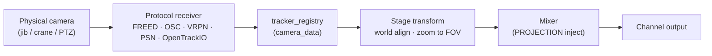

# Camera Tracking Module

The `tracking` module enables real-time camera tracking data to drive CasparCG layer transforms — either 2D fill/scale/rotation or full 360° equirectangular projection — all frame-accurately, without round-tripping through AMCP.

---

## Table of Contents

1. [Overview](#overview)
2. [How It Works](#how-it-works)
3. [Supported Protocols](#supported-protocols)
4. [Starting Position and Zeroing](#starting-position-and-zeroing)
5. [AMCP Command Reference](#amcp-command-reference)
6. [Transform Modes](#transform-modes)
7. [Zoom Calibration](#zoom-calibration)
8. [Axis Offsets and Scaling](#axis-offsets-and-scaling)
9. [Lens & Timing Realism](#lens--timing-realism)
10. [Lens Calibration File Format](#lens-calibration-file-format)
11. [OpenTrackIO (SMPTE RIS OSVP)](#opentrackio-smpte-ris-osvp)
12. [Configuration File](#configuration-file)
13. [Building with VRPN](#building-with-vrpn)
14. [Worked Examples](#worked-examples)
15. [Architecture Reference](#architecture-reference)

---

## Overview



This module receives tracking data from physical camera rigs (head trackers, optical trackers, inertial systems) and maps each packet to a specific CasparCG channel/layer. Depending on the configured mode the data drives either:

- **360° mode** — the `MIXER PROJECTION` system: yaw/pitch/roll and FOV are updated each time a packet arrives, letting viewers pan inside an equirectangular video as the physical camera moves.
- **2D mode** — the `MIXER FILL` / `MIXER ROTATION` system: pan/tilt shift the layer's position, roll rotates it, and zoom adjusts the fill scale. Useful for tracking-responsive lower thirds, tracked planar inserts, or parallax-shifted graphics.
- **TARGET mode** — projects a tracked **subject** position through a static virtual camera so a graphic *follows the subject* on screen (AR track-target). See [TARGET Mode](#target-mode-mode-target).

Multiple cameras, channels, and layers can all be active simultaneously. Each binding is independent.

---

## How It Works

```
Physical camera
     │ (UDP / VRPN)
     ▼
Protocol Receiver          (freed_receiver / osc_receiver / …)
     │ decoded camera_data struct (radians, mm, raw zoom)
     ▼
tracker_registry::on_data()
     │ look up each binding that matches camera_id
     ▼
stage::apply_transform()   (duration=0, tween=linear)
     │ same path as MIXER PROJECTION / MIXER FILL AMCP commands
     ▼
Mixer → Output
```

Tracking data is injected directly into the stage transform pipeline on the receiver's IO thread, bypassing the AMCP round-trip. At 50 Hz FreeD data hitting a 50 Hz channel the transform is always one packet fresh — typically ≤ 1 frame of latency.

---

## Supported Protocols

| Protocol | Default Port | Description |
| :--- | :--- | :--- |
| `FREED` | 6301 | FreeD D1 UDP (29-byte, big-endian, XOR checksum). The de-facto industry standard. Most tracking vendors support it natively: Mo-Sys, Stype, Ncam, Trackmen, OptiTrack, Vicon (via bridge). Multiple cameras share one port using the camera ID nibble in byte 26. |
| `FREED_PLUS` | 6301 | Stype FreeD+ extended format: identical to FreeD D1 for the first 26 bytes, then adds a 12-byte extension with 32-bit high-precision angles (1/8 388 608 degree per unit). Falls back to standard D1 automatically when a 29-byte packet arrives. |
| `OSC` | 9000 | OSC 1.0 UDP. No external library required. Uses the address schema `/camera/{id}/pan`, `/tilt`, `/roll`, `/zoom`, `/focus`, `/x`, `/y`, `/z`. Angles in degrees; position in mm; zoom/focus in raw 0–65535 or normalised 0.0–1.0. |
| `VRPN` | — | VRPN tracker client (`vrpn_Tracker_Remote`). Quaternion pose converted to yaw/pitch/roll. Analogue channel 0 used as zoom. Optional — requires `-DBUILD_TRACKING_VRPN=ON` at CMake configure time. |
| `PSN` | 56565 | PosiStageNet v2.0 UDP multicast. Open protocol for live 3D stage position data (BlackTrax, MA Lighting grandMA, Disguise, etc.). Joins multicast group `236.10.10.10` by default. Carries position and orientation per tracker but no zoom/focus — those fields remain at 0. Position is converted from metres to mm; orientation from degrees to radians. |
| `OPENTRACKIO` | 55555 | SMPTE RIS OSVP **OpenTrackIO** — JSON over UDP multicast. The modern successor to FreeD: a single stream carries camera transform, full lens metadata (focus / iris / zoom encoders), and timing in one packet. Joins multicast group `239.135.1.100` by default. See [OpenTrackIO](#opentrackio-smpte-ris-osvp). |

> **Iris channel:** `OSC`, `VRPN`, and `OpenTrackIO` additionally decode an **iris** encoder (0–65535). FreeD/FreeD+ have no standard iris field and leave it at 0. Iris feeds the focus-driven depth-of-field system only when you map it; by default the focus channel drives DOF.

---

## Starting Position and Zeroing

### Transforms are absolute, not relative

Every incoming tracking packet **fully replaces** the previous transform. There is no accumulation. The injected value is:

```
injected = data.angle × axis_scale + axis_offset
```

This means:
- At `scale=1.0` and `offset=0`, a tracker that returns `pan=0` will always snap the layer back to neutral.
- Whatever the physical tracker sends, that is what the layer shows — immediately, every packet.

### Before the first packet arrives

The layer retains whatever transform it had before `TRACKING BIND` was called. If you
set `MIXER 1-1 PROJECTION 0 0 0 90` and then bind the tracker, the layer will hold
that position until the first tracking packet lands. Use this as your "waiting" pose.

### Setting where neutral (zero) is

Use `TRACKING OFFSET` to shift the tracker’s zero point without touching anything
else. You do **not** need to unbind/rebind. The change takes effect on the very next
packet:

```amcp
— The camera is resting at pan=+5° due to a mount offset.
— We want that physical position to show as 0° on screen.
TRACKING 1-1 OFFSET -5 0 0
```

### One-click zero with `TRACKING ZERO`

Instead of calculating the offset manually, send `TRACKING ZERO` while the camera is
pointing at the desired neutral position. The module reads the latest received data
and automatically sets the offsets so that the current physical pose maps exactly to
`(yaw=0, pitch=0, roll=0)` in 360 mode, or `(fill_translation=0, 0)` in 2D mode.

```amcp
— Point the camera at the intended centre-of-frame, then:
TRACKING 1-1 ZERO
```

The new offsets are visible immediately in `TRACKING INFO`. No rebind required.

### Summary: what requires a rebind?

| Change | Needs rebind? |
| :--- | :--- |
| Adjust neutral position | No — use `TRACKING OFFSET` or `TRACKING ZERO` |
| Flip or scale an axis | No — use `TRACKING SCALE` |
| Change zoom calibration range | No — use `TRACKING SCALE` (third parameter) |
| Change default FOV | No — use `TRACKING DEFAULT_FOV` |
| Set latency delay / nodal offset / DOF | No — use `TRACKING DELAY` / `NODAL` / `DOF` |
| Load or clear a lens-calibration profile | No — use `TRACKING LENS` |
| Switch between 360 and 2D mode | **Yes** — requires rebind |
| Switch to a different camera ID | **Yes** — requires rebind |
| Move to a different UDP port | **Yes** — requires rebind |

---

## AMCP Command Reference

All commands use the standard CasparCG channel-layer syntax: `TRACKING <ch>-<layer> <subcommand> [params]`.

---

### `TRACKING BIND`

Creates or replaces a tracking binding on the specified layer.

```
TRACKING <ch>-<layer> BIND <protocol>
    [PORT <port>]
    [HOST <host>]
    [CAMERA <id>]
    [MODE <2D|360|PREVIZ|TARGET>]
```

| Parameter | Default | Description |
| :--- | :--- | :--- |
| `protocol` | — | `FREED`, `FREED_PLUS`, `OSC`, `VRPN`, `PSN`, or `OPENTRACKIO` (required) |
| `PORT` | 6301 (56565 for PSN, 55555 for OpenTrackIO) | UDP port to listen on |
| `HOST` | — | VRPN server URL, e.g. `Tracker0@192.168.1.50`; or multicast group for PSN (`236.10.10.10`) / OpenTrackIO (`239.135.1.100`) |
| `CAMERA` | 0 | Camera ID to accept. Use `-1` to accept all cameras on this port. |
| `MODE` | `360` | `360` injects into the equirectangular projection; `2D` injects into fill/scale/rotation; `PREVIZ` drives the previz renderer; `TARGET` projects a tracked **subject** position through a static virtual camera so the layer follows it on screen (see [TARGET Mode](#target-mode-mode-target)) |

**Examples:**
```amcp
TRACKING 1-1 BIND FREED PORT 6301 CAMERA 1 MODE 360
TRACKING 1-2 BIND FREED_PLUS PORT 6302 CAMERA 2 MODE 360
TRACKING 1-5 BIND OSC PORT 9100 CAMERA 0 MODE 2D
TRACKING 2-1 BIND VRPN HOST Tracker0@192.168.1.50 CAMERA 0 MODE 360
TRACKING 1-1 BIND PSN PORT 56565 CAMERA 0 MODE 360
TRACKING 1-1 BIND PSN HOST 236.10.10.10 CAMERA 3 MODE 360
TRACKING 1-1 BIND OPENTRACKIO PORT 55555 HOST 239.135.1.100 CAMERA 0 MODE 360
```

If a binding already exists on this channel/layer it is replaced and the old receiver's reference count is decremented.

---

### `TRACKING UNBIND`

Removes the binding from a channel/layer.

```
TRACKING <ch>-<layer> UNBIND
```

---

### `TRACKING OFFSET`

Sets a fixed angular offset (in degrees) added to the decoded tracking angles after scaling. Use this to trim the rest position of the camera without physically re-zeroing the tracker.

```
TRACKING <ch>-<layer> OFFSET <pan_deg> <tilt_deg> <roll_deg>
```

**Example** — compensate a 1.5° downward tilt at the mount:
```amcp
TRACKING 1-1 OFFSET 0 -1.5 0
```

---

### `TRACKING SCALE`

Sets per-axis scale factors and the zoom calibration range.

```
TRACKING <ch>-<layer> SCALE <pan_scale> <tilt_scale> <zoom_full_range>
```

| Parameter | Default | Description |
| :--- | :--- | :--- |
| `pan_scale` | `1.0` | Multiplier applied to decoded pan before offset. Use `-1.0` to flip the axis (counter-tracking: layer moves opposite to camera). |
| `tilt_scale` | `1.0` | Multiplier applied to decoded tilt. Use `-1.0` to flip. |
| `zoom_full_range` | `65535` | The raw zoom value your lens/encoder sends when at its widest angle. Adjust this to calibrate zoom-to-FOV mapping. |

**Example** — flip pan for counter-tracking, calibrate zoom encoder range:
```amcp
TRACKING 1-1 SCALE -1.0 1.0 32000
```

---

### `TRACKING ZERO`

Captures the tracker’s current physical position as the new neutral / home position. Sets the pan, tilt, and roll offsets so that wherever the camera is pointing right now produces `(0, 0, 0)` injected into the layer.

```
TRACKING <ch>-<layer> ZERO
```

Returns `404` if no binding exists, or if no data has been received yet from the bound camera.

**Example workflow:**
```amcp
// 1. Bind the tracker
TRACKING 1-1 BIND FREED PORT 6301 CAMERA 1 MODE 360

// 2. Wait for data, then aim the camera at the desired start view
// 3. Capture that as home — no calculation needed
TRACKING 1-1 ZERO
```

---

### `TRACKING DEFAULT_FOV`

Sets the wide-end FOV (in degrees) used by the zoom lens formula. This is the FOV the lens produces when `zoom_raw == zoom_full_range`. Live — no rebind needed.

```
TRACKING <ch>-<layer> DEFAULT_FOV <degrees>
```

**Example** — a 12mm lens on Super35 has an ~85° horizontal FOV at its widest:
```amcp
TRACKING 1-1 DEFAULT_FOV 85
```

---

### `TRACKING DELAY`

Delays the applied camera pose by a number of milliseconds so the tracking data lines up with a delayed video feed (genlock, frame-sync, or downstream processing latency). The module keeps a short rolling history of samples and **interpolates** between them, so the delayed pose stays smooth even between packets. Live — no rebind needed.

```
TRACKING <ch>-<layer> DELAY [milliseconds]
TRACKING <ch>-<layer> DELAY              // Query current delay
```

| Value | Behaviour |
| :--- | :--- |
| `0` | Disabled — the newest sample is injected immediately (default; identical to pre-feature behaviour). |
| `> 0` | The pose is reconstructed for `now − delay` by interpolating the sample history (max 2000 ms window). |

**Example** — the camera SDI feed is delayed by ~80 ms through a switcher; match it:
```amcp
TRACKING 1-1 DELAY 80
```

See [Latency Compensation](#latency-compensation-tracking-delay) for the full explanation.

---

### `TRACKING GENLOCK`

A **frame-native, LTC-anchored** alternative to `DELAY`. Instead of milliseconds, the pose is held back by a number of **frames of the channel's frame rate** (captured automatically when the binding is created). When a valid **house LTC signal** is present on the shared LTC input, the sampled time is **snapped to the house frame grid**, so pose updates align to video frame boundaries — true genlock behaviour. With no LTC present it degrades gracefully to a plain frame-native delay (`frames ÷ channel_fps`). Live — no rebind needed.

```
TRACKING <ch>-<layer> GENLOCK <frames> [ON|OFF]
TRACKING <ch>-<layer> GENLOCK OFF        // Disable (keeps the frame count)
TRACKING <ch>-<layer> GENLOCK            // Query → "GENLOCK <enable> <frames>"
```

| Parameter | Default | Description |
| :--- | :--- | :--- |
| `frames` | `0` | Number of channel frames to delay the pose by. |
| `ON` / `OFF` | `ON` | Enables or disables genlock. Omitting it with a frame count enables. |

> **Precedence:** when `GENLOCK` is enabled it **overrides** `DELAY`. Disable it (`GENLOCK OFF`) to fall back to the millisecond `DELAY` path. It reuses the same interpolated sample-history buffer as `DELAY`, so both share the 2000 ms window.

The shared LTC input is the same one used by the recorder/timecode features; its current value and lock state are reported in `TRACKING INFO` as `LTC_VALID` / `LTC_TC`.

**Example** — the program feed is genlocked and the camera path runs 3 frames behind house sync:
```amcp
TRACKING 1-1 GENLOCK 3 ON
TRACKING 1-1 GENLOCK              // → "201 TRACKING OK\r\nGENLOCK 1 3\r\n"
```

---

### `TRACKING NODAL`

Sets the **entrance-pupil (nodal) offset** — the position of the lens's optical centre relative to the tracked origin, expressed in the camera's own frame (metres). This produces correct parallax when the camera rotates about a point that is not its optical centre. Live — no rebind needed.

```
TRACKING <ch>-<layer> NODAL [forward_m right_m up_m]
TRACKING <ch>-<layer> NODAL              // Query current offset
```

| Parameter | Description |
| :--- | :--- |
| `forward_m` | Offset along the optical axis (toward the subject). Equivalent to OpenLensIO `entrancePupilOffset`. |
| `right_m` | Offset to camera-right (CasparVP extension). |
| `up_m` | Offset upward (CasparVP extension). |

All three `0` disables the correction (default). See [Nodal / Entrance-Pupil Offset](#nodal--entrance-pupil-offset-tracking-nodal).

**Example** — the no-parallax point sits 4 cm in front of the tracked sensor plane:
```amcp
TRACKING 1-1 NODAL 0.04 0 0
```

---

### `TRACKING DOF`

Maps the lens **focus** channel to a layer blur radius for a rack-focus look. **This is non-physical** — flat/360 layers have no depth buffer — so it is an operator-calibrated effect rather than a true optical defocus. When enabled, tracking drives the layer blur on every packet (overriding `MIXER BLUR`); when disabled, the layer blur is left untouched.

```
TRACKING <ch>-<layer> DOF <enable 0|1> [near_raw far_raw max_radius]
TRACKING <ch>-<layer> DOF                // Query current settings
```

| Parameter | Default | Description |
| :--- | :--- | :--- |
| `enable` | — | `1` enables focus-driven blur, `0` disables it. |
| `near_raw` | preserved | Raw focus value (0–65535) at which blur is zero. |
| `far_raw` | preserved | Raw focus value at which blur reaches `max_radius`. |
| `max_radius` | preserved | Maximum blur radius in pixels (lens-bokeh kernel). |

The blur radius is computed as:

$$\text{radius} = \text{max\_radius} \cdot \operatorname{clamp}\!\left(\frac{\text{focus} - \text{near\_raw}}{\text{far\_raw} - \text{near\_raw}},\, 0,\, 1\right)$$

Omitting the calibration values keeps the previously set ones, so you can toggle the effect on/off without re-entering them. See [Focus-Driven Depth of Field](#focus-driven-depth-of-field-tracking-dof).

**Example** — focus pulls from sharp at raw 10000 to fully soft (12 px) at raw 40000:
```amcp
TRACKING 1-1 DOF 1 10000 40000 12
```

---

### `TRACKING LENS`

Loads a **dynamic lens-calibration profile**. Once loaded, the binding samples the profile by the live `(zoom, focus)` encoder values on every packet and uses it to drive the projection **FOV**, the **Brown–Conrady distortion** (`k1`–`k3`, `p1`/`p2`), and the **entrance-pupil forward offset** — all of which then change automatically as the lens zooms and focuses. Distortion is applied in 360 mode. Live — no rebind needed.

```
TRACKING <ch>-<layer> LENS LOAD <path>
TRACKING <ch>-<layer> LENS CLEAR
TRACKING <ch>-<layer> LENS               // Query active profile name
```

- `<path>` is resolved **relative to the server media folder** and is path-traversal guarded — files outside the media folder are rejected (`403`).
- `LENS CLEAR` (or `LENS NONE`) removes the profile; any manually set `PROJECTION_DISTORTION` is then preserved untouched.
- Returns `404` if the file is missing, `400` if the JSON is malformed.

**Example:**
```amcp
TRACKING 1-1 LENS LOAD lenses/cooke_s4_18mm.json
TRACKING 1-1 LENS              // → "201 TRACKING OK\r\nLENS Cooke S4 18mm\r\n"
TRACKING 1-1 LENS CLEAR
```

The file format is documented in [Lens Calibration File Format](#lens-calibration-file-format).

---

### `TRACKING TARGET_CAMERA`

Defines the **static virtual camera** that a tracked subject is projected through in `TARGET` mode (see [TARGET Mode](#target-mode-mode-target)). Setting a camera **enables** target projection. Live — no rebind needed.

```
TRACKING <ch>-<layer> TARGET_CAMERA <x> <y> <z> <yaw> <pitch> <roll> <fov>
TRACKING <ch>-<layer> TARGET_CAMERA               // Query
```

| Parameter | Unit | Description |
| :--- | :--- | :--- |
| `x y z` | metres | Virtual camera position in the same world frame as the tracked subject. |
| `yaw pitch roll` | degrees | Virtual camera orientation. |
| `fov` | degrees | Vertical field of view. |

**Example:**
```amcp
TRACKING 1-1 TARGET_CAMERA 0 1.6 0 0 0 0 50
TRACKING 1-1 TARGET_CAMERA          // → "201 TRACKING OK\r\nTARGET_CAMERA 1 0 1.6 0 0 0 0 50\r\n"
```

---

### `TRACKING TARGET_MAP`

Configures how the projected subject position maps onto the layer's screen transform in `TARGET` mode. Live — no rebind needed.

```
TRACKING <ch>-<layer> TARGET_MAP <gain> [ref_dist_m] [aspect]
TRACKING <ch>-<layer> TARGET_MAP                  // Query
```

| Parameter | Default | Description |
| :--- | :--- | :--- |
| `gain` | `0.5` | Maps projected NDC `[-1, 1]` to `fill_translation`. At `0.5`, a subject at the frame edge places the graphic at the frame edge. |
| `ref_dist_m` | `0` | Reference distance in metres. `0` disables distance scaling; otherwise `fill_scale = ref_dist_m / view_z`, so the graphic shrinks as the subject moves away. |
| `aspect` | `16/9` | Frame aspect ratio (W/H). `<= 0` leaves the current value unchanged. |

**Example:**
```amcp
TRACKING 1-1 TARGET_MAP 0.5 3.0 1.7778
```

---

### `TRACKING INFO`

Returns the current binding configuration and the most recently received data for the bound camera.

```
TRACKING <ch>-<layer> INFO
```

**Response:**
```
201 TRACKING OK
PROTOCOL FREED
PORT 6301
CAMERA 1
MODE 360
PAN_SCALE 1.0
TILT_SCALE 1.0
PAN_OFFSET 0.0
TILT_OFFSET -1.5
ROLL_OFFSET 0.0
ZOOM_FULL_RANGE 65535.0
ZOOM_DEFAULT_FOV 90.0
POSITION_SCALE 0.001
DELAY 0.0
GENLOCK 0 0
NODAL 0.0 0.0 0.0
DOF 0 0.0 65535.0 0.0
LENS NONE
TARGET_CAMERA 0 0 0 0 0 0 0 90
TARGET_MAP 0.5 0 1.7778
LAST_PAN -0.023
LAST_TILT 12.451
LAST_ROLL 0.001
LAST_X 0.0
LAST_Y 1532.5
LAST_Z 4800.0
LAST_ZOOM 29450
LAST_FOCUS 0
LTC_VALID 1
LTC_TC 10:00:05:12
```

The realism fields report the live state of the [lens & timing](#lens--timing-realism) features:

| Field | Meaning |
| :--- | :--- |
| `DELAY` | Latency-compensation delay in milliseconds (`0` = live). |
| `GENLOCK` | `enabled frames` — frame-native, LTC-anchored latency compensation (overrides `DELAY` when enabled). |
| `NODAL` | Entrance-pupil offset `forward right up` in metres. |
| `DOF` | `enabled near_raw far_raw max_radius` for focus-driven depth of field. |
| `LENS` | Active lens-profile name, or `NONE`. |
| `TARGET_CAMERA` | `enabled x y z yaw pitch roll fov` — the virtual camera for `TARGET` mode (position in metres, angles in degrees). |
| `TARGET_MAP` | `gain ref_dist_m aspect` — screen-mapping parameters for `TARGET` mode. |
| `LTC_VALID` | `1` if a valid house LTC signal is currently decoded, else `0` (system-clock fallback). |
| `LTC_TC` | The current house timecode `HH:MM:SS:FF` from the shared LTC input. |

---

### `TRACKING LIST`

Lists all active bindings across all channels and layers.

```
TRACKING LIST
```

**Response:**
```
200 TRACKING OK
1-1 PROTOCOL FREED PORT 6301 CAMERA 1 MODE 360
1-5 PROTOCOL OSC PORT 9100 CAMERA 0 MODE 2D

```

---

## Transform Modes

### 360° Mode (`MODE 360`)

Injects decoded angles and computed FOV directly into the `MIXER PROJECTION` system, which drives the GPU equirectangular shader. The binding is exactly equivalent to — and real-time-updates — the same parameters set by:

```amcp
MIXER 1-1 PROJECTION <yaw_deg> <pitch_deg> <roll_deg> <fov_deg>
```

| Tracking value | Struct field set |
| :--- | :--- |
| Pan (yaw) | `projection.yaw` (radians) |
| Tilt (pitch) | `projection.pitch` (radians) |
| Roll | `projection.roll` (radians) |
| Zoom → FOV | `projection.fov` (radians, via lens formula) |

The 360 layer must have an equirectangular video loaded and projection enabled. Projection is enabled automatically when `fov > 0`. Set `fov = 0` (or zoom to the maximum telephoto raw value) to disable it.

> **Curved-screen compensation** (`MIXER PROJECTION_CURVE`) is independent of the tracking binding. Set it once with the AMCP command; the tracking system will not touch it.

---

### 2D Mode (`MODE 2D`)

Injects tracking data into the standard layer fill/scale/rotation transforms, equivalent to simultaneously running:

```amcp
MIXER 1-1 FILL <pan> <tilt_inv> 1 1
MIXER 1-1 ROTATION <roll_deg>
MIXER 1-1 FILL 0 0 <scale> <scale>
```

| Tracking value | Struct field set |
| :--- | :--- |
| Pan | `fill_translation[0]` |
| Tilt | `fill_translation[1]` (inverted so camera-up maps to layer-up) |
| Roll | `angle` (radians) |
| Zoom → scale | `fill_scale[0]` and `fill_scale[1]` (uniform, via lens formula) |

Use `TRACKING SCALE` to tune how much pan/tilt movement shifts the layer. At the default `pan_scale = 1.0`, one radian of pan moves the layer by one full frame width — large. For subtle parallax effects a `pan_scale` of `0.05` to `0.2` is more typical.

---

### TARGET Mode (`MODE TARGET`)

In `360` and `2D` modes the tracked data is the **camera's own pose**. `TARGET` mode inverts the relationship: the tracked data is the **world position of a moving subject** (a performer, a prop, a follow-spot puck), and the binding projects that position through a **static virtual camera** to compute where on screen the subject appears. The layer's fill position (and optionally scale) is driven to that screen point, so a graphic — a nameplate, an arrow, a highlight ring — *follows the subject* as it moves through the shot. This is an augmented-reality "track-target" follow.

Unlike the camera-pose modes, `TARGET` mode is **opt-in per binding**: until you set a virtual camera with `TRACKING TARGET_CAMERA`, the binding writes nothing (the graphic is unaffected). Two commands configure it:

1. **`TRACKING TARGET_CAMERA <x> <y> <z> <yaw> <pitch> <roll> <fov>`** — the static virtual camera the subject is viewed through. Set it to match the real program camera that is framing the subject. Setting it enables projection.
2. **`TRACKING TARGET_MAP <gain> [ref_dist_m] [aspect]`** — how the projected position maps to the layer.

**How a packet is processed:**

1. The subject's world position is `s = (data.x, data.y, data.z) × position_scale` (so raw millimetres become metres, as in 2D parallax).
2. The vector from camera to subject `d = s − camera_position` is rotated into the camera's view frame using the inverse of the camera orientation (the same `Rz(−roll)·Rx(−pitch)·Ry(−yaw)` view convention as the previz renderer).
3. The view-space vector `(vx, vy, vz)` is perspective-projected: `ndc_x = (vx / vz) · f / aspect`, `ndc_y = (vy / vz) · f`, where `f = 1 / tan(fov / 2)`.
4. `fill_translation = (ndc_x · gain, −ndc_y · gain)`. When `ref_dist_m > 0`, `fill_scale = ref_dist_m / vz` so the graphic shrinks with distance.
5. If the subject is **behind** the camera (`vz ≤ 0`), the layer's `opacity` is driven to `0` so the graphic disappears rather than mirroring to the wrong side.

| Tracking value | Struct field set |
| :--- | :--- |
| Projected screen X | `fill_translation[0]` |
| Projected screen Y | `fill_translation[1]` (inverted to screen space) |
| Distance (when `ref_dist_m > 0`) | `fill_scale[0]` and `fill_scale[1]` |
| In front of / behind camera | `opacity` (`1` / `0`) |

**Worked example — AR nameplate follows a performer via OpenFollow (PSN):**

**OpenFollow** streams a performer's stage position as PSN over multicast. Bind a nameplate layer to that stream in `TARGET` mode, set the virtual camera to match the program camera (here at eye height, looking down +Z), and let the nameplate track the performer:

```amcp
PLAY 1-1 nameplate                                  // graphic to follow the subject
TRACKING 1-1 BIND PSN HOST 236.10.10.10 PORT 56565 CAMERA 0 MODE TARGET
TRACKING 1-1 TARGET_CAMERA 0 1.6 0 0 0 0 50         // camera at 1.6 m, 50° FOV
TRACKING 1-1 TARGET_MAP 0.5 3.0 1.7778              // gain 0.5, shrink past 3 m, 16:9
```

As the performer walks, the nameplate slides to stay over them and shrinks slightly as they move upstage; when they step behind the virtual camera the nameplate fades out. Calibrate `gain` against a known position on a real 16:9 channel (a subject at the frame edge should put the graphic at the frame edge at `gain = 0.5`).

> **Tip:** the OpenFollow defaults (PSN group `236.10.10.10`, port `56565`) are available as a one-click **"+ PSN (OpenFollow)"** preset in the client's config editor.

---

## Zoom Calibration

FreeD zoom values are raw encoder counts with no standard unit. The module converts them to FOV using a **realistic lens formula**:

$$\text{fov} = 2 \arctan\!\left( \tan\!\left(\frac{\text{fov\_wide}}{2}\right) \cdot \frac{\text{zoom\_full\_range}}{\max(z, 1)} \right)$$

Where:
- **fov\_wide** — FOV at the widest angle (default 90°, i.e. the FOV when `zoom_raw == zoom_full_range`)
- **zoom\_full\_range** — raw encoder value representing the widest angle (set via `TRACKING SCALE`)
- **z** — current raw zoom value from the tracker

This formula mimics the angular behaviour of a real zoom lens: at `z = zoom_full_range` → FOV = fov\_wide; as z decreases → FOV widens; as z increases beyond full_range → FOV narrows.

### Optional Lookup Table (config file only)

For lenses with non-linear zoom encoders, a per-binding lookup table can be specified in `casparcg.config`. Values between entries are linearly interpolated:

```xml
<binding>
  <protocol>FREED</protocol>
  <port>6301</port>
  <zoom_lookup>
    <entry raw="0"     fov="90.0"/>
    <entry raw="8000"  fov="65.0"/>
    <entry raw="20000" fov="30.0"/>
    <entry raw="40000" fov="12.0"/>
    <entry raw="65535" fov="4.5"/>
  </zoom_lookup>
</binding>
```

---

## Axis Offsets and Scaling

The full transform chain applied to each decoded angle before injection:

```
decoded_angle_rad
    × axis_scale          (from TRACKING SCALE)
    + axis_offset_rad     (from TRACKING OFFSET, converted from degrees internally)
    = injected_angle_rad
```

### Tips

| Goal | Command |
| :--- | :--- |
| Flip pan (counter-tracking) | `TRACKING 1-1 SCALE -1.0 1.0 65535` |
| Trim tilt 2° upward | `TRACKING 1-1 OFFSET 0 2.0 0` |
| Halve pan sensitivity in 2D | `TRACKING 1-1 SCALE 0.5 0.5 65535` |
| Invert tilt axis | `TRACKING 1-1 SCALE 1.0 -1.0 65535` |

---

## Lens & Timing Realism

The four features below model the parts of a real camera-and-lens system that raw pose data alone cannot capture: the **time** the signal takes to arrive, the **off-axis pivot** of the lens, the **distortion and FOV** of the glass, and the **focus falloff**. Each one defaults to a no-op, so an existing binding behaves exactly as before until you opt in.

### Latency Compensation (`TRACKING DELAY`)

Tracking data and the camera's video almost never arrive at the compositor at the same instant. The video is delayed by the camera's internal processing, SDI/IP transport, and any switcher or frame-sync downstream — typically one to several frames. If the pose is applied the moment it arrives, a CG layer will visibly *lead* the live plate during fast moves.

`TRACKING DELAY <ms>` holds the pose back to re-align it. The module keeps a rolling 2000 ms history of samples per camera and, for a non-zero delay, reconstructs the pose for the timestamp `now − delay` by **interpolating** between the two bracketing samples — angles are interpolated along the shortest path (no ±180° glitch), positions and encoders linearly. The result is smooth even between packets and even if the delay falls between two samples.

```amcp
# Measure the offset (e.g. with a clap/flash visible to both the tracker and camera),
# then dial it in. Here the SDI path is ~80 ms behind the tracking data:
TRACKING 1-1 DELAY 80
```

- `DELAY 0` injects the newest sample immediately — byte-identical to the pre-feature behaviour.
- The delay can exceed the gap between packets; the buffer holds up to ~2 seconds.
- Combine with `TRACKING INFO` (look at the `DELAY` field) to confirm the active value.

> **Tip:** To find the exact value, record the program output, step through a sharp camera move frame-by-frame, and increase the delay until the CG layer and live plate move on the same frame.

### Nodal / Entrance-Pupil Offset (`TRACKING NODAL`)

A tracker reports the position of *its sensor*, but the image is formed at the lens's **entrance pupil** (the "nodal point"). When these differ and the camera rotates, near and far objects shift relative to each other — parallax. For a locked-off pan this is what makes a poorly-aligned virtual set "swim" against the foreground.

`TRACKING NODAL <forward> <right> <up>` tells the system where the entrance pupil sits relative to the tracked origin, in metres, in the camera's own frame. Each packet, the world position is shifted along the current camera basis (built from the applied pan/tilt) before being mapped to the projection — so the rotation now pivots about the correct optical point.

```amcp
# The no-parallax point is 4 cm in front of the tracked sensor plane:
TRACKING 1-1 NODAL 0.04 0 0
```

- `forward_m` matches the SMPTE OpenLensIO `entrancePupilOffset` scalar and is the value you will normally set; `right_m`/`up_m` are CasparVP extensions for off-axis rigs.
- All-zero disables the shift (default).
- If a [lens profile](#lens-calibration-file-format) is loaded, its `nodal_forward_m` is **added** to this value, so the profile can supply a zoom-dependent offset on top of a fixed rig offset.

### Focus-Driven Depth of Field (`TRACKING DOF`)

> **Non-physical effect.** 2D and 360 layers are flat — there is no depth buffer to defocus by distance. This feature instead maps the **focus encoder** to a single full-frame blur radius to *suggest* a rack-focus. It is an operator-calibrated look, not a simulation.

`TRACKING DOF <enable> [near_raw far_raw max_radius]` enables the mapping. Calibrate the two raw focus values that bracket your move and the maximum blur:

```amcp
# Sharp when the lens is focused at raw 10000, fully soft (12 px) by raw 40000:
TRACKING 1-1 DOF 1 10000 40000 12
```

The blur uses the lens-bokeh kernel (`blur type = lens`) for a rounded out-of-focus look. While enabled it overrides `MIXER BLUR` on that layer each packet; disabling it (`DOF 0`) returns control to any manual blur. Calibration values are remembered, so `DOF 1` / `DOF 0` toggles the effect without retyping them.

### Dynamic Lens Profile (`TRACKING LENS`)

The three items above plus FOV and distortion all change as a real lens **zooms** and **focuses**. Rather than chasing them by hand, load a lens-calibration profile and let the live encoders drive everything:

```amcp
TRACKING 1-1 LENS LOAD lenses/cooke_s4_18mm.json
```

On every packet the binding samples the profile by `(zoom_raw, focus_raw)` and applies:

| Profile output | Drives |
| :--- | :--- |
| `fov` | Projection field of view (supersedes the zoom→FOV formula when > 0) |
| `k1`, `k2`, `k3` | Radial `PROJECTION_DISTORTION` coefficients (360 mode) |
| `p1`, `p2` | Tangential `PROJECTION_DISTORTION` coefficients (360 mode) |
| `nodal_forward_m` | Added to the `TRACKING NODAL` forward offset |

`LENS CLEAR` removes the profile and restores manual control of distortion/FOV. The file format is below.

---

## Lens Calibration File Format

A lens profile is a JSON file stored under the server **media folder**. It tabulates the lens's behaviour across its zoom range (and optionally its focus range) on a grid; values between grid nodes are **bilinearly interpolated** (linearly for a 1-D zoom-only profile). All distortion coefficients follow the same Brown–Conrady convention as [`PROJECTION_DISTORTION`](VIRTUAL_PRODUCTION_FEATURES.md#lens-distortion-correction).

### Top-level fields

| Field | Required | Description |
| :--- | :--- | :--- |
| `name` | no | Human-readable profile name (reported by `TRACKING LENS`). Default `"lens"`. |
| `fov_unit` | no | `"deg"` (default) or `"rad"` — the unit of every `fov` value in `samples`. |
| `zoom_axis` | **yes** | Ascending array of raw zoom encoder values at each grid column. |
| `focus_axis` | no | Ascending array of raw focus values. Omit (or give a single value) for a **1-D** zoom-only profile; two or more entries make it a **2-D** zoom × focus grid. |
| `samples` | **yes** | The grid of per-node lens samples (see below). |

### Per-node sample fields

Each sample node carries the lens characteristics at that `(zoom, focus)` grid point. All fields are optional and default to `0`:

| Field | Meaning |
| :--- | :--- |
| `k1`, `k2`, `k3` | Radial distortion coefficients. |
| `p1`, `p2` | Tangential (decentering) distortion coefficients. |
| `fov` | Field of view at this node, in `fov_unit`. A value > 0 overrides the zoom→FOV formula. |
| `nodal_forward_m` | Entrance-pupil forward offset (metres) at this node. |

### Sample layout

- **1-D (zoom only)** — `samples` is a flat array with exactly one node per `zoom_axis` entry.
- **2-D (zoom × focus)** — `samples` is an array of **rows** (one per `zoom_axis` entry); each row is an array of **columns** (one per `focus_axis` entry).

The loader validates that the axes are strictly ascending and that the grid dimensions match the axes, throwing a descriptive error (returned as `400 TRACKING ERROR …`) otherwise.

### Example — 1-D zoom-only profile

```json
{
  "name": "Cooke S4 18mm",
  "fov_unit": "deg",
  "zoom_axis": [0, 16000, 32000, 48000, 65535],
  "samples": [
    { "fov": 90.0, "k1": -0.180, "k2": 0.020, "nodal_forward_m": 0.052 },
    { "fov": 62.0, "k1": -0.120, "k2": 0.012, "nodal_forward_m": 0.050 },
    { "fov": 40.0, "k1": -0.060, "k2": 0.006, "nodal_forward_m": 0.048 },
    { "fov": 22.0, "k1":  0.010, "k2": 0.000, "nodal_forward_m": 0.047 },
    { "fov": 12.0, "k1":  0.040, "k2": -0.004, "nodal_forward_m": 0.046 }
  ]
}
```

### Example — 2-D zoom × focus grid

```json
{
  "name": "Zoom 18-100 T2.9",
  "fov_unit": "deg",
  "zoom_axis":  [0, 32000, 65535],
  "focus_axis": [0, 32000, 65535],
  "samples": [
    [ { "fov": 90, "k1": -0.18 }, { "fov": 89, "k1": -0.17 }, { "fov": 88, "k1": -0.16 } ],
    [ { "fov": 40, "k1": -0.06 }, { "fov": 39, "k1": -0.055 }, { "fov": 38, "k1": -0.05 } ],
    [ { "fov": 12, "k1":  0.04 }, { "fov": 12, "k1":  0.045 }, { "fov": 11, "k1":  0.05 } ]
  ]
}
```

> The grid is read row-major: outer array = `zoom_axis` order, inner array = `focus_axis` order. Each inner array's length must equal `focus_axis`'s length, and the number of rows must equal `zoom_axis`'s length.

---

## OpenTrackIO (SMPTE RIS OSVP)

`OPENTRACKIO` is a receiver for the **SMPTE Rapid Industry Solutions On-Set Virtual Production (RIS OSVP)** OpenTrackIO transport — the modern, vendor-neutral successor to FreeD. Where FreeD carries only pose, a single OpenTrackIO sample bundles **camera transform + full lens metadata (focus / iris / zoom) + timing** together, which is exactly the data this module's pose, lens, and DOF features consume.

### Transport

| Aspect | Value |
| :--- | :--- |
| Encoding | JSON (CBOR is reserved for a future pass) |
| Network | UDP multicast |
| Default group | `239.135.1.100` (set via `HOST`) |
| Default port | `55555` |
| Framing | Raw JSON datagrams **or** `OTrk`-framed datagrams — the receiver extracts the JSON object, tolerating a transport header and trailing checksum bytes. One sample per datagram. |

```amcp
TRACKING 1-1 BIND OPENTRACKIO PORT 55555 HOST 239.135.1.100 CAMERA 0 MODE 360
```

`CAMERA <id>` matches the sample's `sourceNumber`; use `-1` to accept any source on the group.

### Field mapping

The receiver decodes the first camera transform and the lens encoders from each sample:

| OpenTrackIO field | → `camera_data` | Conversion |
| :--- | :--- | :--- |
| `transforms[0].translation.{x,y,z}` | position | metres → millimetres |
| `transforms[0].rotation.{pan,tilt,roll}` | pan / tilt / roll | degrees → radians |
| `lens.encoders.zoom` | zoom | 0.0–1.0 → 0–65535 |
| `lens.encoders.focus` | focus | 0.0–1.0 → 0–65535 |
| `lens.encoders.iris` | iris | 0.0–1.0 → 0–65535 |
| `sourceNumber` | camera_id | integer (default 0) |

Samples without a usable transform are ignored.

### Coordinate / axis mapping

OpenTrackIO uses a right-handed metric world. The receiver maps it to CasparVP's internal convention (`x = right`, `y = up`, `z = toward subject`) with the named Euler angles applied directly (`pan`→yaw, `tilt`→pitch, `roll`→roll). The mapping lives in a single clearly-marked block in `opentrackio_receiver.cpp`; if a particular source uses a different handedness or axis order, that block is the one place to adjust.

> **Synergy with the realism features:** because one OpenTrackIO stream already carries lens encoders, a profile loaded with `TRACKING LENS` will track that stream's live zoom/focus, and `TRACKING DOF` can rack-focus from the same `focus` channel — no separate FreeD + lens-data plumbing required.

---

## Configuration File

Receivers can be pre-started when the server boots by adding a `<tracking>` block to `casparcg.config`. This is useful in unattended deployments where AMCP clients connect after the server is already running.

```xml
<configuration>
  ...
  <tracking>
    <!-- Pre-start a FreeD receiver on the standard port -->
    <receiver>
      <protocol>FREED</protocol>
      <port>6301</port>
    </receiver>

    <!-- Pre-start an OSC receiver on a custom port -->
    <receiver>
      <protocol>OSC</protocol>
      <port>9100</port>
    </receiver>

    <!-- Pre-start a VRPN connection -->
    <receiver>
      <protocol>VRPN</protocol>
      <host>Tracker0@192.168.1.50</host>
    </receiver>

    <!-- Pre-start a PSN multicast receiver (BlackTrax, MA Lighting, etc.) -->
    <receiver>
      <protocol>PSN</protocol>
      <port>56565</port>
      <host>236.10.10.10</host>
    </receiver>

    <!-- Pre-start an OpenTrackIO multicast receiver (SMPTE RIS OSVP) -->
    <receiver>
      <protocol>OPENTRACKIO</protocol>
      <port>55555</port>
      <host>239.135.1.100</host>
    </receiver>
  </tracking>
  ...
</configuration>
```

> **Note:** Only receivers are started from config. Channel/layer bindings are always established at runtime via `TRACKING BIND`. This mirrors the standard CasparCG design where consumers and producers are bound by AMCP clients after connect.

---

## Building with VRPN

VRPN support is off by default to keep the default build light. To enable it, pass the flag at CMake configure time:

```bat
cmake ..\src -G Ninja -DBUILD_TRACKING_VRPN=ON
```

CMake will automatically fetch VRPN from GitHub via `FetchContent` and compile the client libraries. No manual dependency installation is required.

Without this flag the `vrpn_receiver` class compiles but `start()` is a no-op that logs a message. All other protocols work regardless of this flag.

---

## Worked Examples

### Example 1 — Live 360° camera feed

A PTZ camera on a robotic head streams FreeD over UDP. We want the 360 layer to follow the camera exactly.

```amcp
// Load a 360 equirectangular clip on layer 1
PLAY 1-1 360_studio_loop

// Enable projection (any non-zero FOV activates it)
MIXER 1-1 PROJECTION 0 0 0 90

// Bind FreeD, camera ID 1, 360 mode (default)
TRACKING 1-1 BIND FREED PORT 6301 CAMERA 1

// Tilt is mounted 3° down — trim it
TRACKING 1-1 OFFSET 0 3.0 0
```

The layer now shows exactly what the locked-off camera sees, interactively, every time a FreeD packet arrives.

---

### Example 2 — Tracked lower third (2D counter-tracking)

A graphic lower third should appear fixed in screen space even as the camera pans. We bind it in 2D mode with pan and tilt axes flipped (counter-tracking).

```amcp
// Load a transparent HTML lower third on layer 10
PLAY 1-10 [HTML] http://localhost:8080/lower_third

// Bind with flipped axes so the graphic counter-moves with the camera
TRACKING 1-10 BIND FREED PORT 6301 CAMERA 1 MODE 2D
TRACKING 1-10 SCALE -0.15 -0.10 65535
```

A pan_scale of `-0.15` means the layer shifts 0.15 frame-widths per radian of pan — enough to cancel parallax from a moderate zoom.

---

### Example 3 — OSC from a custom motion-capture system

A bespoke body-tracking system sends OSC bundles to port 9200. Camera ID is always 0.

```amcp
TRACKING 1-3 BIND OSC PORT 9200 CAMERA 0 MODE 360
```

The sender must use the `/camera/0/pan`, `/camera/0/tilt`, etc. schema. The z message triggers the frame push, so it must always be sent last in each update bundle.

---

### Example 4 — Multiple cameras on one server

Two cameras simultaneously driving different layers:

```amcp
TRACKING 1-1 BIND FREED PORT 6301 CAMERA 1 MODE 360
TRACKING 1-3 BIND FREED PORT 6301 CAMERA 2 MODE 360
```

Both cameras share the same UDP port (standard FreeD multiplexing). The registry routes each packet to the correct layer based on the camera ID.

---

### Example 5 — Full virtual-production lens realism

A tracked camera shoots a 360 virtual backdrop. We want the backdrop to match the real lens exactly — distortion and FOV following zoom/focus — sit on the correct nodal point, and stay time-aligned with the delayed program feed.

```amcp
// Load the 360 backdrop and enable projection
PLAY 1-1 360_set_extension
MIXER 1-1 PROJECTION 0 0 0 90

// Bind the tracker (FreeD here, but OpenTrackIO works identically)
TRACKING 1-1 BIND FREED PORT 6301 CAMERA 1 MODE 360

// 1. Time-align with the ~3-frame SDI delay (60 ms @ 50p)
TRACKING 1-1 DELAY 60

// 2. Put the pivot on the lens entrance pupil (5 cm forward)
TRACKING 1-1 NODAL 0.05 0 0

// 3. Drive distortion + FOV + nodal from the measured lens file
TRACKING 1-1 LENS LOAD lenses/cooke_s4_18mm.json
```

As the operator zooms and focuses, the backdrop's field of view and barrel distortion now follow the glass automatically, the parallax pivots correctly, and the CG and live plate move on the same frame.

---

### Example 6 — One OpenTrackIO stream, everything included

A modern tracking system publishes OpenTrackIO. A single bind picks up pose, lens encoders, and timing; we add a profile and a rack-focus look on top.

```amcp
PLAY 1-1 360_set_extension
MIXER 1-1 PROJECTION 0 0 0 90

// Bind the multicast stream
TRACKING 1-1 BIND OPENTRACKIO PORT 55555 HOST 239.135.1.100 CAMERA 0 MODE 360

// The stream already carries zoom/focus/iris — load a lens profile to use them
TRACKING 1-1 LENS LOAD lenses/master_prime_25mm.json

// Suggest depth of field from the same focus channel
TRACKING 1-1 DOF 1 8000 38000 10
```

---

## Architecture Reference

### Source Files

```
src/modules/tracking/
├── camera_data.h               Normalised packet struct (pose, zoom, focus, iris)
├── tracker_binding.h           Per-layer config (mode, scales, camera_id, zoom, delay, nodal, DOF, lens)
├── tracker_registry.h/.cpp     Singleton dispatcher + transform injection + sample-history interpolation
├── lens_profile.h/.cpp         Lens-calibration JSON loader + bilinear (zoom, focus) sampling
├── receiver_manager.h/.cpp     Ref-counted receiver lifecycle
├── tracking_commands.h/.cpp    AMCP command implementations
├── tracking.h/.cpp             Module init/uninit + config-file loading
├── CMakeLists.txt
└── protocol/
    ├── receiver_base.h         Abstract receiver interface
    ├── freed_receiver.h/.cpp   FreeD D1 UDP
    ├── freed_plus_receiver.h/.cpp  Stype FreeD+ extended
    ├── osc_receiver.h/.cpp     OSC 1.0 UDP (no external lib)
    ├── psn_receiver.h/.cpp     PosiStageNet v2.0 UDP multicast
    ├── opentrackio_receiver.h/.cpp  SMPTE RIS OSVP OpenTrackIO (JSON UDP multicast)
    └── vrpn_receiver.h/.cpp    VRPN (optional)
```

### FreeD Packet Layout (D1, 29 bytes)

```
Byte  0      : Message type (0xD1)
Bytes  1– 3  : Pan   (24-bit signed, 1/32768 degree/unit)
Bytes  4– 6  : Tilt  (24-bit signed, 1/32768 degree/unit)
Bytes  7– 9  : Roll  (24-bit signed, 1/32768 degree/unit)
Bytes 10–13  : X position (32-bit signed, 1/64 mm/unit)
Bytes 14–17  : Y position (32-bit signed, 1/64 mm/unit)
Bytes 18–21  : Z position (32-bit signed, 1/64 mm/unit)
Bytes 22–23  : Zoom  (16-bit unsigned, vendor-raw)
Bytes 24–25  : Focus (16-bit unsigned, vendor-raw)
Byte  26     : User bits — high nibble = camera ID (0–15)
Bytes 27–28  : Checksum (sum of all 29 bytes & 0xFF == 0x40)
```

### OSC Address Schema

```
/camera/{id}/pan    f   degrees
/camera/{id}/tilt   f   degrees
/camera/{id}/roll   f   degrees
/camera/{id}/x      f   millimetres
/camera/{id}/y      f   millimetres
/camera/{id}/z      f   millimetres  ← frame is pushed when this arrives
/camera/{id}/zoom   f   0–65535 (or 0.0–1.0 normalised)
/camera/{id}/focus  f   0–65535 (or 0.0–1.0 normalised)
/camera/{id}/iris   f   0–65535 (or 0.0–1.0 normalised)
```

### VRPN Coordinate Conventions

VRPN uses a right-hand Y-up coordinate system. Quaternion components in the callback are `(qx, qy, qz, qw)` — note `qw` is at index `[3]`. The receiver extracts ZYX Euler angles matching CasparVP's yaw/pitch/roll convention:

- **Yaw** (Z): horizontal rotation, positive = right
- **Pitch** (Y): vertical rotation, positive = up
- **Roll** (X): tilt rotation, positive = clockwise

Position values from VRPN are in metres and are multiplied by 1000 to convert to millimetres before being stored in `camera_data`.
