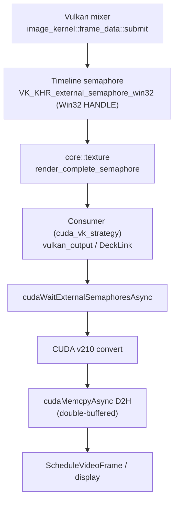
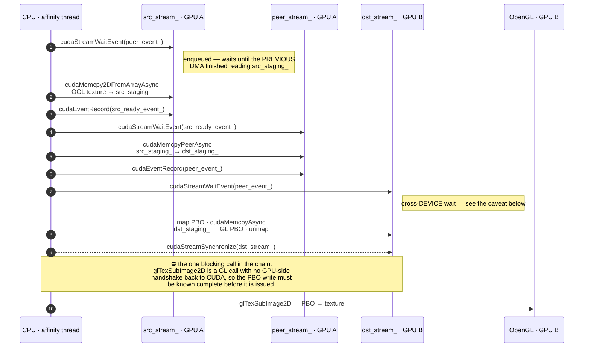

# GPU Interop Architecture

**Date:** May 2026
**Scope:** VK→CUDA timeline semaphore interop, async cross-GPU peer copy, GPU topology detection

This document describes the GPU-side synchronization architecture that connects the Vulkan mixer, DeckLink output, and cross-GPU transfer pipelines — eliminating CPU blocking from the critical render→output path.

## Table of Contents

- [Overview](#overview)
- [VK→CUDA Timeline Semaphore Pipeline](#vkcuda-timeline-semaphore-pipeline)
- [Async Cross-GPU Peer Copy](#async-cross-gpu-peer-copy)
- [GPU Topology Detection](#gpu-topology-detection)
- [Performance Results](#performance-results)
- [File Reference](#file-reference)

---

## Overview

```
┌─────────────────────────────────────────────────────────────────────────┐
│                        Vulkan Mixer (GPU A)                            │
│  image_kernel::frame_data::submit()                                    │
│    └── vkQueueSubmit signals VkSemaphore (timeline, value N)           │
│         └── VK_KHR_external_semaphore_win32 exports Win32 HANDLE       │
└────────────────────────────┬────────────────────────────────────────────┘
                             │  core::texture propagates
                             │  sem_handle + sem_value
                             ▼
┌─────────────────────────────────────────────────────────────────────────┐
│                     core::const_frame                                  │
│  frame.texture()->render_complete_semaphore_handle()  → Win32 HANDLE   │
│  frame.texture()->render_complete_semaphore_value()   → uint64_t       │
└────────────────────────────┬────────────────────────────────────────────┘
                             │
               ┌─────────────┴─────────────┐
               ▼                           ▼
┌──────────────────────────┐  ┌──────────────────────────────────────────┐
│  vulkan_output consumer  │  │  DeckLink consumer (cuda_vk_strategy)   │
│  (same-GPU or cross-GPU  │  │  cudaImportExternalSemaphore             │
│   display presentation)  │  │  cudaWaitExternalSemaphoresAsync         │
│                          │  │  CUDA BGRA→v210 kernel                   │
│                          │  │  cudaMemcpyAsync (D2H, double-buffered)  │
│                          │  │  ScheduleVideoFrame                      │
└──────────────────────────┘  └──────────────────────────────────────────┘
```

The key insight: **no CPU thread blocks waiting for the render**. The Vulkan render signals a timeline semaphore on the GPU, and downstream consumers enqueue GPU-side waits on that semaphore. The CPU issues those waits and returns; it never polls or waits for render completion.

Two blocking waits do remain, and naming them is what makes the claim above checkable — neither is a wait on the *current* frame's render:

| where | call | why it does not stall |
| :--- | :--- | :--- |
| DeckLink `push_and_take` | `cudaEventSynchronize(oldest.done)` | on the copy `PIPELINE_DEPTH` frames back, which has long since completed in steady state — this is what makes the measured fence wait 0.06 ms instead of 22 ms |
| cross-GPU write step | `cudaStreamSynchronize(dst_stream_)` | at the CUDA→GL handoff, where no GPU-side handshake exists (see [Async Cross-GPU Peer Copy](#async-cross-gpu-peer-copy)) |

---

## VK→CUDA Timeline Semaphore Pipeline



### Step 1: Vulkan Creates and Signals

In `image_kernel.cpp`, each `frame_data::submit()`:

1. Creates a `VkSemaphore` with `VK_SEMAPHORE_TYPE_TIMELINE` and `VK_EXTERNAL_SEMAPHORE_HANDLE_TYPE_OPAQUE_WIN32_BIT` export capability
2. Increments the timeline value
3. Includes a `VkTimelineSemaphoreSubmitInfo` signal in `vkQueueSubmit`
4. Exports the Win32 HANDLE via `vkGetSemaphoreWin32HandleKHR`

The semaphore and value are stored in `vulkan::texture_wrapper`, which implements `core::texture`.

### Step 2: Frame Pipeline Propagates

The `core::const_frame` holds a `shared_ptr<core::texture>`. The base class declares:

```cpp
virtual void* render_complete_semaphore_handle() { return nullptr; }
virtual uint64_t render_complete_semaphore_value() { return 0; }
```

`vulkan::texture_wrapper` overrides these to return the exported handle and timeline value. This means any consumer can query the semaphore without knowing whether the mixer is OGL or Vulkan — OGL frames return `nullptr`/0, and consumers fall back gracefully.

### Step 3: CUDA Imports and Waits

In `cuda_vk_strategy.cpp`:

1. **Handle caching**: A multi-slot cache (`cached_semaphore cached_sems_[MAX_CACHED_SEMS]`, 8 slots) maps Win32 HANDLEs to imported `cudaExternalSemaphore_t` objects. The VK mixer rotates through 3-4 `frame_data` slots, each with a unique handle.

2. **Import**: On cache miss, `cudaImportExternalSemaphore` imports the Win32 HANDLE as a timeline semaphore:
   ```cpp
   cudaExternalSemaphoreHandleDesc desc = {};
   desc.type = cudaExternalSemaphoreHandleTypeTimelineSemaphoreWin32;
   desc.handle.win32.handle = sem_handle;
   ```

3. **GPU-side wait**: `cudaWaitExternalSemaphoresAsync` enqueues a wait on the CUDA stream:
   ```cpp
   cudaExternalSemaphoreWaitParams params = {};
   params.params.fence.value = sem_value;
   cudaWaitExternalSemaphoresAsync(&ext_sem, &params, 1, stream_);
   ```
   This returns immediately — the GPU will stall the CUDA stream until the VK timeline reaches `sem_value`.

4. **Pipelined output**, which is two separate mechanisms rather than one:

   - **Device pack targets** — `NUM_DEV_BUFS = 3` buffers (`d_v210_[]`, or `d_bgra_[]` for SDR) rotated by `dev_idx_`. These are where the CUDA kernel writes.
   - **Host output buffers** — a *refcounted pool*, not a fixed ring. DeckLink may hold a frame past the tick it was scheduled on, so a buffer returns to the pool when the last reference drops. It was previously three pinned buffers rotated by index and handed over with a no-op deleter; the pool replaced that.

   `PIPELINE_DEPTH = 2` then decides *when* the D2H copy for frame N is waited on — at frame N+2, in `push_and_take`. It is a latency/throughput knob and says nothing about how long a buffer must stay valid, which is what `buffer_depth_` governs. Conflating the two is easy and gives a buffer handed to DeckLink twice.

### Why Timeline (Not Binary) Semaphores

Binary semaphores have strict signal-before-wait ordering and can only be waited once. Timeline semaphores:
- Support any wait value ≤ the signal value (monotonically increasing)
- Allow multiple waiters on the same semaphore
- Don't require reset between signal/wait cycles
- Map naturally to CUDA's `cudaWaitExternalSemaphoresAsync` with a fence value

---

## Async Cross-GPU Peer Copy

When the mixer GPU (A) differs from the output GPU (B), `cuda_peer_transfer` handles the pixel transfer using a fully async GPU-side event chain.

### Event Synchronization Chain

Three CUDA streams and one GL context, across two devices. What the diagram is for is the
distinction between an *enqueued* wait and an *awaited* one: every `cudaStreamWaitEvent`
below returns to the CPU immediately and stalls only the GPU stream it was issued on. There
is exactly one call in the chain that blocks the calling thread, and it is at the end.



### Key Properties

- **One CPU sync point, at the CUDA→GL boundary.** `src_ready_event_` and `peer_event_` are `cudaEventDisableTiming` events — lightweight GPU-only signals — and the read→peer half of the chain contains no CPU wait at all. The write half ends in `cudaStreamSynchronize(dst_stream_)` ([cuda_peer_transfer.cpp:426](../src/modules/vulkan_output/util/cuda_peer_transfer.cpp#L426)) because the GL upload that follows it cannot be made to wait on a CUDA stream. That is the cost of handing off to GL rather than staying in CUDA, and it is the only one.
- **Overlap**: While `peer_stream_` DMAs frame N, `src_stream_` can already be reading frame N+1 into staging_A (after `WaitEvent(peer_event)` confirms the previous DMA finished reading from staging_A).
- **The cross-device wait is not formally guaranteed.** `peer_event_` is created on `src_device_` and waited on from `dst_stream_`. The code says this plainly: supported on NVIDIA with CUDA 11+ drivers, not promised by the CUDA programming guide for all configurations, tested on Ampere + Pascal with driver 550+. Worth knowing before this is run on other hardware.
- **Staged fallback**: When GPU architectures differ (e.g., Ampere + Pascal), direct P2P is unavailable. `cudaMemcpyPeerAsync` transparently stages through system RAM using DMA engines — still faster than CPU memcpy.

---

## GPU Topology Detection

At module initialization, `vulkan_device::log_gpu_topology()` performs a one-time scan:

### Vulkan Device Groups

Creates a temporary `VkInstance` and calls `vkEnumeratePhysicalDeviceGroups()`. Multi-GPU device groups (count > 1, `subsetAllocation = true`) indicate NVLink or SLI bridges.

### CUDA P2P Attributes

For every GPU pair (i, j), queries:

| Attribute | Meaning |
|-----------|---------|
| `cudaDevP2PAttrAccessSupported` | Whether direct P2P DMA is possible |
| `cudaDevP2PAttrPerformanceRank` | 0 = PCIe, >0 = NVLink (higher = faster) |
| `cudaDevP2PAttrNativeAtomicSupported` | NVLink with atomic operations (confirms NVLink) |

### Example Output

Mixed architectures (no P2P):
```
[vulkan_output] GPU topology: 4 device group(s)
[vulkan_output]   Group 0: NVIDIA RTX A4000 (single GPU)
[vulkan_output]   Group 1: Quadro P4000 (single GPU)
[vulkan_output]   No NVLink bridge detected. Cross-GPU transfers use CUDA peer DMA (PCIe).
[vulkan_output] CUDA P2P topology (2 devices):
[vulkan_output]   NVIDIA RTX A4000 <-> Quadro P4000: staged (system RAM) (perf_rank=0)
```

NVLink pair:
```
[vulkan_output] GPU topology: 1 device group(s)
[vulkan_output]   Group 0: NVIDIA RTX A6000 x2 (NVLink/SLI bridge, subsetAllocation)
[vulkan_output] CUDA P2P topology (2 devices):
[vulkan_output]   NVIDIA RTX A6000 <-> NVIDIA RTX A6000: direct P2P (perf_rank=1, NVLink)
```

---

## Performance Results

### DeckLink Output (VK→CUDA Semaphore Interop)

| Scenario | Fence Wait | Sync Time | Total | Notes |
|----------|-----------|-----------|-------|-------|
| PNG/solid (no CUDA decode) | 0ms | 2-4ms | 2-4ms | GPU idle, perfect 60fps |
| ProRes (old CPU fence) | 22ms | 8ms | 30ms | CPU blocked on `glClientWaitSync` |
| ProRes (GPU semaphore) | 0.06ms | 28ms | 28ms | CPU free, GPU throughput limited |

The 28ms under heavy ProRes decode is GPU execution time (VK render + CUDA v210 conversion competing for GPU cycles), not CPU blocking. The improvement frees the CPU thread entirely.

### Cross-GPU Transfer (Async Peer Copy)

The async event chain eliminates CPU `cudaStreamSynchronize` calls from the read→peer→write pipeline:

| Transfer Type | Bandwidth | CPU Involvement |
|--------------|-----------|-----------------|
| NVLink | ~600 GB/s | Zero (GPU DMA) |
| PCIe P2P | ~15 GB/s (3.0 x16) | Zero (GPU DMA) |
| Staged (system RAM) | ~10 GB/s | Zero (GPU DMA engines, no CPU memcpy) |
| PBO fallback (no CUDA) | ~6 GB/s | Moderate (CPU uploads) |

---

## File Reference

| File | Role |
|------|------|
| `src/accelerator/vulkan/image/image_kernel.cpp` | Timeline semaphore creation, signal in `vkQueueSubmit` |
| `src/accelerator/vulkan/util/texture_wrapper.h` | `core::texture` impl with sem_handle/sem_value |
| `src/accelerator/vulkan/util/device.cpp` | `VK_KHR_external_semaphore_win32` device extension |
| `src/accelerator/vulkan/util/renderpass.h` | `frame_context` virtual methods for semaphore access |
| `src/core/frame/frame.h` | `core::texture` base class with virtual semaphore methods |
| `src/modules/decklink/consumer/cuda_vk_strategy.cpp` | CUDA semaphore import, GPU-side wait, double-buffered v210 |
| `src/modules/vulkan_output/util/cuda_peer_transfer.cpp` | Async peer copy with GPU-side event chain |
| `src/modules/vulkan_output/util/cuda_peer_transfer.h` | `peer_stream_`, `src_ready_event_`, `peer_event_` members |
| `src/modules/vulkan_output/util/vulkan_device.cpp` | `log_gpu_topology()` — VK device groups + CUDA P2P probing |
| `src/modules/vulkan_output/util/vulkan_device.h` | `static void log_gpu_topology()` declaration |
| `src/modules/vulkan_output/vulkan_output.cpp` | Calls `log_gpu_topology()` at module init |
