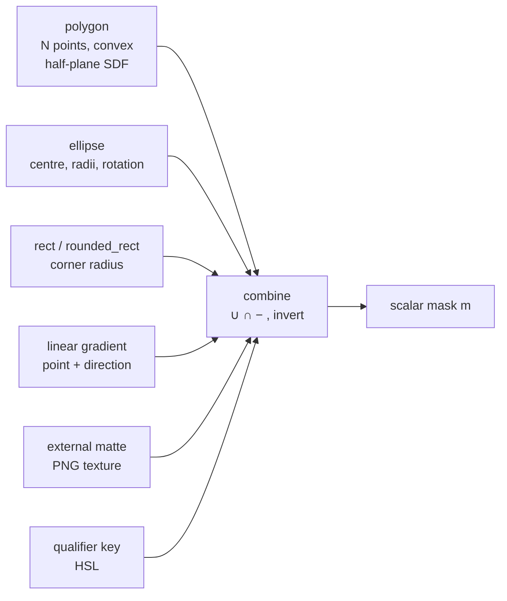
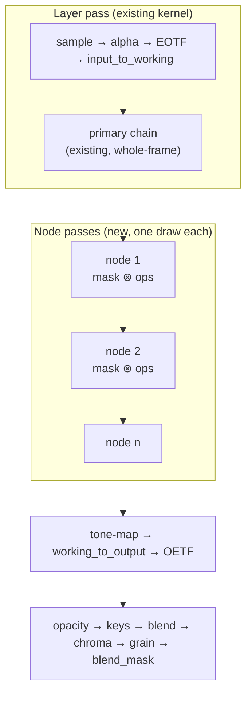

# Windowed Grading and a Node Graph in the CasparVP Mixer — Design Study

**Status: study. Nothing is implemented.** Written 2026-08-17.

> There is no node graph, no spatial window, and no AMCP command for either. What exists is a
> source-level survey of the current mixer, a design for Resolve-style windows and a true node
> graph, and — the finding that reframes the whole thing — **the multi-pass machinery a node
> graph needs is already shipped and in use six times over.**
>
> The headline conclusion: **a node graph is not the architectural change it looks like.** The
> hard part is not passes, ping-pong or attachment lifetime; all three are existing, proven
> patterns. The hard part is the *data model* — a variable-length per-layer structure flowing
> through a transform system built for fixed scalar fields.

---

## 1. What exists today

Read from source, not from docs. Everything in this section is present on **both** mixers.

### 1.1 Four mask-shaped mechanisms, none of which gates a grade

| Mechanism | Geometry | Soft edge | What it drives | Where |
| :--- | :--- | :--- | :--- | :--- |
| `apply_qualifier` | none — HSL colour key | `qual_softness`, `smoothstep` | 3 grading ops | [`shader.frag`](../src/accelerator/ogl/image/shader.frag) `apply_qualifier` |
| `icvfx_mask` | **arbitrary quadrilateral**, 4 corners in output NDC, winding-independent half-plane SDF | `icvfx_feather` | ICVFX frustum dim/gain | `icvfx_mask` |
| `shape` | SDF `rect` / `rounded_rect` / `circle` / `ellipse` | `edge_softness` | draws a fill *over* the result | `shape_config` in [`frame_transform.h`](../src/core/frame/frame_transform.h) |
| `blend_mask` | arbitrary — any PNG, sampled in output space | inherent in the texture | final `col.rgb *=` multiply | `blend_mask_data` |

**Soft edges are not the gap.** Every one of these feathers correctly. The gap is *what they are
wired to*.

### 1.2 The qualifier is a real secondary, with a three-operation payload

`apply_qualifier` builds `hue_mask * sat_mask * lum_mask`, each `smoothstep`-feathered, then:

```glsl
vec3 graded = c;
graded *= (1.0 + exp_off);                        // exposure offset
float glum = working_luma(graded);
graded = mix(vec3(glum), graded, 1.0 + sat_off);  // saturation offset
if (abs(hue_off) > 0.01) graded = apply_hue_shift(graded, hue_off);
return mix(c, graded, mask);
```

Two things to keep:

* **`mix(c, graded, mask)` is exactly the right structure.** The node graph does not need to
  invent a gating pattern; it needs to generalise this one.
* **The payload is three operations and there is one instance per layer.** No lift/gamma/gain,
  no curves, no CDL, no LUT inside the key, and no second qualifier.

### 1.3 The chain is one fixed sequence, applied whole-frame

From `main()`, in order:

```
blur → icvfx → sharpen → alpha → EOTF → luminance_scale → input_to_working
→ exposure → gamut-compress → CDL → LUT3D → linear-sat → white-balance → LMG
→ split-tone → QUALIFIER → hue-shift → hue-curves → tone-balance → rgb-levels
→ curves → LevelsControl → CSB → invert → SHAPE OVERLAY → tone-map
→ working_to_output → clamp → OETF → opacity → keys → blend → chroma-key
→ grain → blend_alpha → BLEND_MASK MULTIPLY
```

Roughly 19 grading operations, one uniform set per layer, one draw per layer. The two spatial
mechanisms sit at positions that structurally prevent them gating a grade: `shape` composites
*after* all grading, and `blend_mask` is the last operation in the shader.

### 1.4 What is exposed

`MIXER QUALIFIER` (10 arguments) is registered in
[`AMCPCommandsImpl.cpp`](../src/protocol/amcp/AMCPCommandsImpl.cpp) and documented in
[`COLOR_GRADING.md`](COLOR_GRADING.md#secondary-qualifier) §Secondary Qualifier. That doc
describes the qualifier accurately and **does not** claim spatial windows, so nothing currently
overstates this.

---

## 2. The finding that makes a node graph tractable

A node graph needs: intermediate render targets, chained full-screen passes, pooled attachment
reuse, and a way to route the kernel into "run only part of the chain". **All four already exist
and ship.**

### 2.1 Six existing multi-pass precedents

| Precedent | Mechanism | Where |
| :--- | :--- | :--- |
| Non-normal blend mode | allocates a layer attachment, draws items into it, then draws that into the target | `image_mixer.cpp` `draw(layer)` |
| `is_mix` | `local_mix_texture` precomp, then one draw into the channel | same |
| `is_key` | `local_key_texture`, 1-component attachment | same |
| Channel calibration LUT | **full-screen pass through the same kernel into a fresh attachment**, source tagged so no colour conversion runs | `apply_calibration_lut` |
| `working-space-composite` output convert | post-composite full-screen pass, input half off / output half on | `apply_output_convert`, routed by `draw_params::output_convert_only` |
| Float→unorm resolve | another full-screen pass | `apply_passthrough` |

`apply_calibration_lut` is the closest template: a full-screen draw through the *ordinary*
kernel, with `pix_desc` tagged as already being in the target space so the colour conversion
halves are suppressed and only one operation runs. That is precisely what a grading node pass is.

### 2.2 Chained passes with pooled attachments are already the shipped pattern

The Vulkan mixer's per-view `finish` lambda chains up to **three** passes, each into a pooled
attachment, fanned out per consumer view — and its own comment explains the choice:

> *"Everything after the composite, for ONE view. All of it lands in this renderpass's single
> command buffer, so one fence covers every view and each wrapper below can share it — which is
> why this is one pass with N attachments rather than N passes sharing a texture across them."*

A grading node graph is the same shape, moved from post-composite to per-layer and with more
links in the chain.

### 2.3 Both backends pool attachments

OpenGL `device::create_texture` and Vulkan `renderpass::create_attachment` both draw from a
pool keyed on dimensions/format. N intermediates per layer is N pool hits, not N allocations.
The Vulkan device header is explicit that `create_attachment()` handles layout reset for pooled
returns.

### 2.4 The Vulkan constraint that is real

The Vulkan kernel reads the background as `layout(binding = 1, input_attachment_index = 0)
uniform subpassInput background`. A `subpassInput` must be an attachment of the same render pass
read at the same pixel. So a node pass on the Vulkan side cannot read its *source* through that
binding — it must sample it as an ordinary `sampler2D`, exactly as `apply_calibration_lut` and
`apply_output_convert` already do (they pass the source in `textures` and the destination in
`background`). This is a constraint on how a node pass is written, not a blocker, and the
existing post-process passes prove the shape.

Vulkan's `renderpass` also already models a pass as a **list** of `layer_info` records, each with
its own `uniform_block`, texture views, coords and optionally its own pipeline
([`renderpass.h`](../src/accelerator/vulkan/util/renderpass.h)). Per-node uniform sets fit that
model directly.

### 2.5 Uniform budget is not the constraint

The Vulkan params block is a **UBO** (`layout(scalar, binding = 2) uniform ParamsBlock`), not
push constants, so the per-draw payload has room. One node's worth of uniforms per pass is
comfortably within it.

**But flag bits are nearly exhausted.** `flags` is populated to `1u<<30`
(`F_SHAPE_STROKE`); `flags2` is only at `1u<<5`. Any new node/mask flags belong in `flags2`.

---

## 3. Mask design

A mask is **one scalar field per pixel**, `float m ∈ [0,1]`, evaluated in a defined space and
consumed by exactly one operation: `col = mix(col, graded, m)`.

Keeping the mask scalar and the consumption single is what stops this becoming a rewrite.

### 3.1 Window primitives



* **Polygon** generalises `icvfx_mask`, which already computes a winding-independent,
  feathered, convex-quad SDF by taking `min` over signed half-plane distances. Extending 4 to N
  is a loop bound and a uniform array; the maths is unchanged. **Convex only** — a concave
  N-gon needs either triangulation or a different SDF, and is not worth it in v1.
* **Ellipse / rect / rounded_rect** already exist as SDFs in the `shape` code path
  (`sdf_box`, `sdf_rbox`, `sdf_circle`, `sdf_ellipse` in the Vulkan shader). They are
  currently consumed by the fill; a window consumes the same distance differently. **Rotation
  is missing** from `shape_config` and a grading window needs it.
* **Linear gradient** is Resolve's fourth window type and is trivial — a dot product against a
  direction, feathered.
* **External matte** reuses `blend_mask_data` and its loader wholesale. The only change is
  where it is sampled and what consumes it.
* **Qualifier key** reuses the *first half* of `apply_qualifier` — the `hue_mask * sat_mask *
  lum_mask` product — split out from its three-operation payload.

### 3.2 Soft edges

Every primitive above produces a signed distance; the feather is `clamp(d / feather, 0, 1)` (the
`icvfx_mask` form) or `smoothstep` (the `shape` form). Two decisions worth making deliberately:

* **Pick one form and use it everywhere.** The two currently coexist in the tree and produce
  measurably different falloffs. A mixed set of windows with mixed falloff is a support burden.
* **Feather in NDC or pixels, stated.** `icvfx_feather` is in output-NDC units and therefore
  anisotropic on a non-square raster. For a grading window that is wrong; feather should be
  isotropic, which means dividing by aspect or working in pixels.

### 3.3 Combine algebra

Resolve composes multiple windows per node. The minimum useful set:

| Op | Formula |
| :--- | :--- |
| union | `max(a, b)` |
| intersect | `a * b` |
| subtract | `a * (1 - b)` |
| invert | `1 - a` |

Applied left to right over a node's window list. `a * b` rather than `min(a, b)` for intersect
keeps the falloff smooth where two feathers overlap — and note this is the same
double-attenuation question the projection blend-mask fix ran into.

### 3.4 Space — the decision that matters most

A window can be evaluated in:

* **source UV** — sticks to the image, follows `fill_scale`/`fill_translation`/`angle`;
* **output NDC** — sticks to the screen, which is what `icvfx_mask` and `blend_mask` do.

**These are not interchangeable and the wrong default is a bug that looks like a feature.** A
grading window in Resolve tracks the *image*, so source UV is the right default. Output NDC
should remain available, because that is what a projector-blend or per-screen correction needs.
Make it an explicit per-window field, not an implicit consequence of which code path was reused.

> **⚠ Corrected 2026-08-17 by building it (§10).** The paragraph above is right about what is
> *wanted* and wrong about what is *cheap*. A node pass is a full-screen draw over an
> attachment with `frame_geometry::get_default()`, so **its UV spans the frame** — by the time
> a node runs, the layer has already been scaled, translated and rotated into place. Frame
> space is therefore what a post-layer node pass gets for free, and source UV is the one that
> costs something: either the layer's geometry transform has to be carried into the pass and
> inverted per pixel, or the mask has to be evaluated inside the layer draw instead of after
> it. Neither is hard; both are more than "an explicit per-window field".
>
> The prototype implements frame space only, and says so in the AMCP help.

---

## 4. Node graph design

### 4.1 Data model

```cpp
struct grade_window {
    window_type           type;          // polygon | ellipse | rect | linear | matte
    combine_op            op;            // union | intersect | subtract
    bool                  invert;
    mask_space            space;         // source_uv (default) | output_ndc
    double                feather;       // isotropic
    std::array<double,2>  center;
    std::array<double,2>  size;          // ellipse radii / rect half-extent
    double                rotation;
    double                corner_radius;
    std::vector<std::array<double,2>> points;  // polygon, convex
    std::shared_ptr<const blend_mask_data> matte;   // matte only
};

struct grade_node {
    bool                       enable = true;
    std::string                label;         // operator-facing, for query
    std::vector<grade_window>  windows;       // empty = whole frame
    bool                       qualifier_enable = false;
    qualifier_key              key;           // the HSL half of apply_qualifier
    node_ops                   ops;           // the per-node grading payload
};

struct grade_graph { std::vector<grade_node> nodes; };   // serial chain, v1
```

`node_ops` is the real scoping decision. **Do not make it "the whole 19-operation chain".**
A defensible v1 subset, chosen because each is order-independent enough to be safe out of
sequence and because together they cover what a window is actually used for:

`exposure`, `contrast`, `saturation`, `CDL (slope/offset/power/sat)`, `lift/midtone/gain`,
`white balance`, `hue shift`, `curves`, `LUT3D`.

`blur`, `sharpen` and `grain` are deliberately excluded: they are neighbourhood operations, and
a windowed neighbourhood operation has to decide what happens at the window edge — a real
design question, not an oversight.

### 4.2 Where the graph sits in the chain

**In the working space, after the input transform and before the output half.** That is the only
position where a grade is well-defined: scene-linear ACEScg, before tone mapping, before
`working_to_output`, before OETF.



The existing primary chain stays exactly where it is and keeps its current behaviour. That is
deliberate: it means **a layer with no graph renders bit-identically to today**, which is the
only way this change can be verified at 1 LSB.

### 4.3 Execution

One full-screen pass per enabled node, ping-ponging between two pooled attachments:

```
src = layer attachment
for each enabled node:
    dst = pool.acquire()
    kernel.draw({ textures = {src}, background = dst,
                  grade_node_only = true, node = <this node> })
    swap(src, dst)
```

Two attachments suffice regardless of node count, because each node reads only its immediate
predecessor. A serial chain is the v1 topology; genuine DAGs (parallel branches, layer mixers)
need more than two and are out of scope.

`grade_node_only` is a new `draw_params` flag following `output_convert_only` exactly: it routes
the kernel to skip both colour-conversion halves, skip the primary chain, skip alpha/keying and
blending, and run mask evaluation plus `node_ops` only.

### 4.4 Backend specifics

* **OpenGL** — identical in shape to `apply_calibration_lut`: source in `textures`, destination
  in `background`, `pix_desc` tagged as already-converted, `auto_color_convert = false`.
* **Vulkan** — the same, plus §2.4: the source must be sampled as `sampler2D`, not read through
  the `subpassInput background` binding. Each node becomes one more `layer_info` in the
  `renderpass` list, with its own `uniform_block`.

### 4.5 The fast path is mandatory, not an optimisation

If `grade_graph` is null or has no enabled nodes, **nothing changes** — no extra attachment, no
extra draw, no extra uniform upload. This has to be structural rather than incidental, because
almost every layer in almost every production will have no graph, and the primary chain is the
hot path.

---

## 5. Transform composition — where this is most likely to break

### 5.1 The allowlist trap applies, and there are THREE lists, not two

> **Corrected 2026-08-17.** This section originally named the two copies of
> `apply_transform_colour_values` and treated the still-frame fingerprint as a separate
> concern. It is not separate: `item_fingerprint` stores a whole `core::image_transform` and
> compares it with `core::operator==(const image_transform&, const image_transform&)`, which is
> **also hand-written field by field** (`core/frame/frame_transform.cpp`, ~125 lines of
> `&&`). So a new field has to be named in *three* hand-maintained lists, and the three fail
> differently:
>
> | List | Omission symptom |
> | :--- | :--- |
> | `apply_transform_colour_values` (ogl) | value never reaches the OpenGL kernel |
> | `apply_transform_colour_values` (vulkan) | value never reaches the Vulkan kernel — backends diverge |
> | `image_transform::operator==` | value reaches both kernels, but the still-frame cache replays the previous frame, so the change does not appear on air while the query reads it back correctly |
>
> The third is the nastiest because both other lists can be correct and the feature still
> appears not to work — intermittently, depending on whether anything else in the frame changed.
>
> **A consequence for the data model:** because composition and equality both use *pointer*
> identity for `shared_ptr` fields, every mutation of the graph must **allocate a new one**.
> A graph mutated in place compares equal to itself and the cache replays. The prototype's
> AMCP handler is copy-on-write for exactly this reason, and that is load-bearing rather
> than stylistic.

`apply_transform_colour_values` in **both** `accelerator/ogl/util/transforms.cpp` and
`accelerator/vulkan/util/transforms.cpp` composes `image_transform` **field by hand-written
field**. A field not named there is silently dropped: the AMCP command returns `202`, the query
reads back correctly, and the kernel sees the default on every frame. `blend_mask` was dead this
exact way.

So `grade_graph` must be added to both lists. The existing pointer-valued fields establish the
rule — innermost wins:

```cpp
if (other.blend_mask) { self.blend_mask = other.blend_mask; }
if (other.lut3d)      { self.lut3d = other.lut3d; self.lut3d_strength = other.lut3d_strength; }
if (other.hue_curves) { self.hue_curves = other.hue_curves; }
```

**`grade_graph` should follow the same rule and for the same reason**: two graphs cannot be
composed without deciding whose windows apply in whose space, which is exactly the resampling
problem that made `blend_mask` innermost-wins.

### 5.2 Channel order

The OpenGL kernel carries the pixel in **BGR** and reverses per-channel uniforms on upload;
Vulkan carries RGB and uploads straight through. `apply_qualifier` already carries a comment
about being bitten by this — an unswizzled `rgb2hsv` keyed the opposite hue.

For the node graph:

* **Spatial windows are channel-agnostic** — a polygon SDF does not care. Safe.
* **The qualifier key half is not**, and neither is any per-channel op in `node_ops` (CDL, LMG,
  white balance, curves, LUT3D). Every one needs the same treatment the primary chain already
  applies.
* **Test with asymmetric per-channel values.** A grey ramp and a neutral mask are both invariant
  under a red/blue exchange and will pass while broken.

### 5.3 Serialisation

`grade_graph` is variable-length, which nothing in `image_transform` currently is. Query
(`MIXER ... GRADE`), the still-frame cache fingerprint (`item_fingerprint` /
`render_fingerprint` in `image_mixer.cpp`) and any keyframe/tween path all assume fixed scalar
fields. **The fingerprint is the dangerous one**: if the graph is not in it, changing a window
leaves a stale frame on air — the same class of defect as the sublayer omission its comments
record.

---

## 6. AMCP surface

The existing grading commands are flat and positional. A variable-length graph does not fit that
shape, so an addressed form is proposed:

```
MIXER <ch>-<layer> GRADE NODE <n> WINDOW <w> POLYGON <x1> <y1> <x2> <y2> ... [FEATHER f] [SPACE source|output] [OP union|intersect|subtract] [INVERT]
MIXER <ch>-<layer> GRADE NODE <n> WINDOW <w> ELLIPSE <cx> <cy> <rx> <ry> [ROTATION deg] [FEATHER f] ...
MIXER <ch>-<layer> GRADE NODE <n> WINDOW <w> MATTE <file.png>
MIXER <ch>-<layer> GRADE NODE <n> QUALIFIER <hue> <width> <minSat> <maxSat> <minLum> <maxLum> <soft>
MIXER <ch>-<layer> GRADE NODE <n> CDL <slope×3> <offset×3> <power×3> <sat>
MIXER <ch>-<layer> GRADE NODE <n> LABEL "sky"
MIXER <ch>-<layer> GRADE NODE <n> CLEAR | ENABLE 0|1
MIXER <ch>-<layer> GRADE CLEAR                      # drop the whole graph
MIXER <ch>-<layer> GRADE                            # query, returns the graph
```

Two notes: every numeric parameter should tween like the existing grading commands, which means
the tween system needs to address `node[n].window[w].field`; and per
[`CLAUDE.md`](../CLAUDE.md), a new command goes in the owning feature doc **and**
[`OPERATIONS_GUIDE.md`](OPERATIONS_GUIDE.md) in the same commit.

---

## 7. Cost model

Per layer with an enabled graph of `n` nodes:

* `n` extra full-screen draws at output resolution;
* 1 extra pooled attachment (2 total, ping-ponged, reused across layers and frames);
* `n` extra uniform-block uploads;
* mask evaluation per pixel per node — cheap for SDFs, one texture fetch for a matte.

The dominant term is `n` × fullscreen fragment work. For reference the channel already runs up to
three such passes post-composite per view, so the per-pass cost is a known quantity in this
codebase — **but it has not been measured here, and no number in this document is a benchmark.**

A layer with no graph costs nothing extra (§4.5).

---

## 8. Verification, and the gap

`conformance` and `grading` gate at 1 LSB against a closed-form model of the shader, with flat
colour patches, no producer and no resampling. That is the right instrument for the *ops* and the
wrong one for the *windows*.

| What changed | What covers it |
| :--- | :--- |
| Node ops on a whole-frame node (no window) | `conformance` + `grading`, **both mixers** — must be bit-identical to applying the same op in the primary chain |
| A layer with **no** graph | `conformance` + `grading` — must be **byte-identical to today**. This is the regression gate that matters most |
| Window geometry and feather | **nothing exists** — needs a new battery |
| Composition through `apply_transform_colour_values` | **nothing exists** — needs the allowlist check below |
| Both backends agree | `mixer-parity` |

**Two gaps to declare rather than paper over:**

1. **No battery can see a spatial window.** A flat patch is invariant under any mask that covers
   it, so a 1 LSB flat-colour gate cannot distinguish a correct window from no window at all. A
   window battery needs a *spatially varying* fixture and a closed-form expectation for the
   feather — which is a new capability in `CasparCG-TestRunner`, not a new invocation of an
   existing one.
2. **No battery can see the allowlist trap.** `MIXER GRADE` returning `202` with a correct
   query readback and a defaulted kernel value is invisible to every picture comparison unless
   the picture actually changes. The test has to be: set a node that *must* change pixels, and
   assert they changed. Per `CLAUDE.md`, this trap has bitten twice and no battery has ever
   caught it.

Suggested minimum before any of this is believed:

* `grade-node` — whole-frame node vs the same op in the primary chain, 1 LSB, both mixers.
* `grade-window` — asymmetric per-channel values across a feathered edge against a closed-form
  falloff, both mixers, and **both mask spaces**.
* `grade-graph-null` — a layer with no graph, byte-identical to the pre-change binary.

---

## 9. Risks and open questions

* **Scope creep in `node_ops`.** The subset in §4.1 is the design. "Just add blur too" is where
  this becomes a rewrite (§4.1 explains why neighbourhood ops are different).
* **Concave polygons** are excluded from v1 and there is no cheap way in.
* **The still-frame cache fingerprint** (§5.3) is the most likely source of a hard-to-reproduce
  "changed nothing on air" bug.
* **Feather anisotropy** (§3.2) — the existing NDC feather is wrong for this use and copying it
  would inherit the defect.
* **Tween addressing** into `node[n].window[w].field` is unspecified and may be the largest piece
  of non-shader work.
* **Vulkan `subpassInput`** (§2.4) is understood but unproven for a per-layer chain; the existing
  precedents are all post-composite.
* **Nothing here is measured.** This is a source read and a design. No pass was written, no frame
  rendered, no cost timed.

---

## 10. Prototype — what was built

**Built 2026-08-17, on `feature/ocio-mixer`, both backends.** The narrowest end-to-end slice:
**one node, one soft-edged ellipse window, exposure only.** Its purpose was to test the two
things this document could not answer by reading — whether the `grade_node_only` routing works,
and what the fingerprint actually requires — and it changed two of the sections above.

### 10.1 What it touches

| File | Change |
| :--- | :--- |
| `core/frame/frame_transform.h` | `grade_window`, `grade_node`, `grade_graph`; `image_transform::grade_nodes` |
| `core/frame/frame_transform.cpp` | `operator==` — pointer identity (§5.1) |
| `accelerator/{ogl,vulkan}/util/transforms.cpp` | composition, innermost wins |
| `accelerator/ogl/image/image_kernel.h`, `accelerator/vulkan/util/draw_params.h` | `grade_node_only` + `grade_node` |
| `accelerator/{ogl,vulkan}/image/image_kernel.cpp` | uniform upload; Vulkan sets `flags2` bits 6 and 7 |
| `accelerator/vulkan/util/uniform_block.h` | 6 floats appended (852→876 bytes), every prior offset untouched |
| `accelerator/ogl/image/shader.frag`, `accelerator/vulkan/image/fragment_shader.frag` | `grade_node_mask` + the early-out branch |
| `accelerator/{ogl,vulkan}/image/image_mixer.cpp` | `apply_grade_node` + the ping-pong loop |
| `protocol/amcp/AMCPCommandsImpl.cpp` | `MIXER GRADE NODE … \| CLEAR \| query` |

### 10.2 Design decisions the code makes, and why

* **Exposure first because it is channel-order agnostic.** A uniform scale over all three
  channels is correct in BGR and RGB alike, so this slice cannot be broken by the
  channel-order trap — which means if the two backends disagree, it is the mask. It also means
  the slice does **not** test that trap; the first per-channel operation will.
* **Feather as a fraction of the radius**, not a distance in UV, so the edge is isotropic.
  `icvfx_mask`'s NDC feather was deliberately not reused (§3.2).
* **The early-out returns from `main()`** immediately after sampling. Everything below already
  ran in the layer pass that produced the attachment, so falling through would grade twice.
* **Copy-on-write in the AMCP handler**, for the pointer-identity reason in §5.1.
* **The OpenGL kernel sets `grade_node_only` both ways**; the Vulkan one does not need to,
  because its `uniform_block` is fresh per draw while a GL bool uniform persists in the
  program until overwritten.

### 10.3 Known limitation of the slice

With a graph enabled the item renders into a private attachment and the result is composited
`normal`. `keyer`, `local_key`/`layer_key` and non-normal blend modes all interact with the
target *during* the item draw, so routing through an attachment first is only equivalent for
an ordinary opaque layer. **Doing this properly means running the chain inside the layer draw
rather than after it** — which also happens to be what source-UV windows need (§3.4). The two
open questions have the same answer, which is the most useful thing this prototype produced.

Also unimplemented, by design: tweening (§6 explains why), every window shape but the ellipse,
every operation but exposure, and combine algebra.

### 10.4 Measured

Build: clean, 305/305 targets, after the full header sweep — PCH deletion **and**
touch-everything, per `BUILDING_WORKFLOW.md`. `casparcg.exe` verified newer than both
generated shader headers (21:59:01 vs 21:57:22), so the binary contains the new shaders rather
than merely relinking. Both `.frag` files pass `glslangValidator`, the Vulkan one with SPIR-V
codegen.

**Regression gate — a layer with no graph must be unaffected.** The check that matters most,
since the fast path is every layer in every production. All four green:

| Gate | Result |
| :--- | :--- |
| `conformance --mixer ogl` | 100/100 conversions within 1.0 LSB |
| `conformance --mixer vulkan` | 100/100 conversions within 1.0 LSB |
| `grading --mixer ogl` | exit 0 — single 13/13, stack 8/8, lut 3/3, neutral 14/14, shuffled 8/8 |
| `grading --mixer vulkan` | exit 0 — same groups, all passing |

**Windowed pixels — the new `grade-window` battery.** §8 said no existing battery could see a
spatial window and that closing the gap meant new harness capability rather than a new
invocation. That turned out to be right, so it was built: `CasparCG-TestRunner/core/grade_window.py`
plus a `cli.py grade-window` subcommand, modelled on `blend_mask.py`. It samples **two sites**
and gates the relationship between them, with the reference for inside the window being the
*measured* value outside it times the requested exposure — so no colour model is involved and
1 LSB is defensible.

| Assertion | What it catches | ogl | vulkan |
| :--- | :--- | :--- | :--- |
| `inside == outside × exposure` | the operation is wrong | **0.50 LSB** | **0.50 LSB** |
| `outside == ungraded base` | the window leaks; a node applied whole-frame | **0.00 LSB** | **0.00 LSB** |
| `\|inside − outside\| ≥ 8 LSB` | the graph dropped by an allowlist — the ungraded frame rendered twice | **77.0** | **77.0** |
| moving the window changes the picture | a stale still-frame cache, i.e. `operator==` missing the field | **76.7** | **76.7** |
| `GRADE CLEAR` restores | a graph that cannot be cleared | **0.00 LSB** | **0.00 LSB** |

**The two backends are byte-identical**, patch for patch, on every figure above — which is
what makes the 0.50 LSB inside-error credible as rounding rather than a fault they share.

**What these numbers do not cover**, in the same breath as the numbers: the feather profile
itself is untested — both sample sites sit in flat regions by design, so the falloff between
them is unmeasured. Nor is any window shape but a centred ellipse, any operation but exposure,
source-UV windows, multiple nodes, or the interaction with keyers and blend modes that §10.3
excludes.

**One harness note worth recording:** `conformance` fails at startup in its default parallel
mode with *"Directory …\build\shell\template\ is not writable"* — four servers racing on one
shared `template/` directory. `--sequential` passes. Unrelated to this change (the directory is
writable, and a manually started server is fine), but it will bite the next person.

## 11. Sources

* **Current behaviour** — [`shader.frag`](../src/accelerator/ogl/image/shader.frag) and
  [`fragment_shader.frag`](../src/accelerator/vulkan/image/fragment_shader.frag);
  [`frame_transform.h`](../src/core/frame/frame_transform.h) for `image_transform`,
  `shape_config`, `blend_mask_data`, `shape_type`.
* **Multi-pass precedents** — [`image_mixer.cpp`](../src/accelerator/ogl/image/image_mixer.cpp)
  (`draw(layer)`, `apply_calibration_lut`, `apply_output_convert`) and
  [`image_mixer.cpp`](../src/accelerator/vulkan/image/image_mixer.cpp) (the per-view `finish`
  lambda, `apply_passthrough`).
* **Pass/attachment model** — [`renderpass.h`](../src/accelerator/vulkan/util/renderpass.h)
  (`layer_info`, `create_attachment`), [`device.h`](../src/accelerator/vulkan/util/device.h)
  (attachment pool).
* **Kernel routing precedent** — `draw_params::output_convert_only` in
  [`image_kernel.h`](../src/accelerator/ogl/image/image_kernel.h).
* **Composition rules** — `apply_transform_colour_values` in
  `accelerator/{ogl,vulkan}/util/transforms.cpp`.
* **Existing qualifier docs** — [`COLOR_GRADING.md`](COLOR_GRADING.md) §Secondary Qualifier.
* **Traps** — [`CLAUDE.md`](../CLAUDE.md): the allowlist trap, the channel-order trap, and the
  rule that a battery which cannot fail for your change is worse than running nothing.
