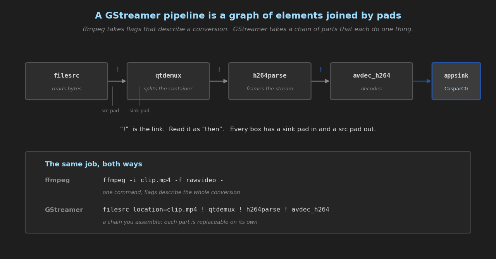
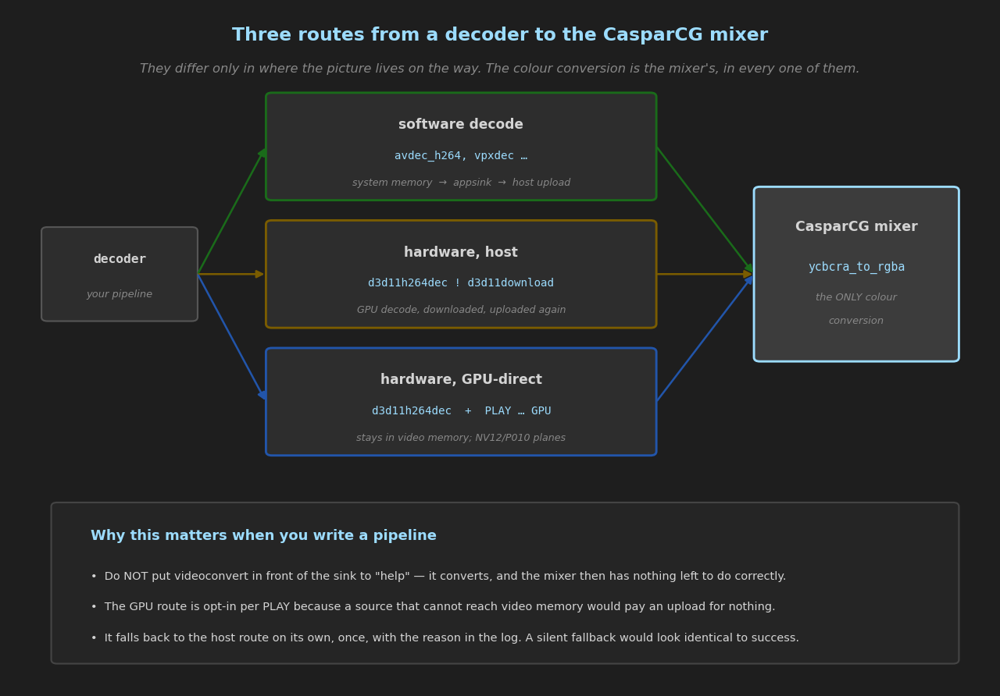

# GStreamer in CasparVP — a guide for people who know FFmpeg

You already know how to get video into CasparCG: you put a file in the media folder, or you
type an FFmpeg URL, and it plays. This module adds a second way in, and a way out, built on
**GStreamer** instead.

This guide assumes you have never written a GStreamer pipeline and starts there. If you only
want the reference — what the server accepts, what it reports, what the config keys are — that
is `src/modules/gstreamer/README.md` and it is deliberately short.

**Contents**

1. [Why bother, when FFmpeg already works](#1-why-bother-when-ffmpeg-already-works)
2. [The one idea you need: a pipeline is a graph](#2-the-one-idea-you-need-a-pipeline-is-a-graph)
3. [Vocabulary, against the FFmpeg word you already know](#3-vocabulary-against-the-ffmpeg-word-you-already-know)
4. [Your first five pipelines](#4-your-first-five-pipelines)
5. [Where CasparCG joins in](#5-where-casparcg-joins-in)
6. [The GPU route](#6-the-gpu-route)
7. [Sending a channel out](#7-sending-a-channel-out)
8. [Recipes](#8-recipes)
9. [Debugging: how to find out what actually happened](#9-debugging-how-to-find-out-what-actually-happened)
10. [Best practice, and the mistakes that cost us days](#10-best-practice-and-the-mistakes-that-cost-us-days)
11. [Third-party plugins](#11-third-party-plugins)
11b. [Worth exploring — surveyed, not tested](#11b-worth-exploring--surveyed-not-tested)
12. [What this module does not do](#12-what-this-module-does-not-do)

---

## 1. Why bother, when FFmpeg already works

For playing a file off disk, it mostly does not. Use the FFmpeg producer; it is the default for
good reasons and this module gives you nothing extra there.

GStreamer earns its place in three situations:

**Live transports.** SRT with its full option set, RIST, RTP, WebRTC, HLS and DASH as *inputs*,
RTMP, ONVIF. FFmpeg can do several of these; GStreamer treats them as first-class elements with
proper state handling, and reconnects rather than ending.

**Things that are not a codec.** Test pattern generators, scene-change and comb detection,
closed-caption extraction and insertion, ONVIF metadata, object-detection overlays, screen and
camera capture, audio analysis. These are elements you drop into a chain.

**Vendor and third-party elements.** NVIDIA, Intel Quick Sync and AMD encoders and decoders are
plugins here, as is anything you or a vendor builds — see [§11](#11-third-party-plugins).

If none of those describe your problem, the FFmpeg producer is the right answer and this guide
is optional reading.

---

## 2. The one idea you need: a pipeline is a graph



FFmpeg gives you **one program with flags**. You describe the *result* — input here, codec
there, output there — and FFmpeg works out the middle.

GStreamer gives you **a chain of parts**. You describe the *route*, one step at a time, and each
step is a component you could have replaced with a different one.

```
filesrc location=clip.mp4 ! qtdemux ! h264parse ! avdec_h264
```

Read `!` as **"then"**. Read the whole line as: read the file, then split the container, then
frame the video stream, then decode it.

Three consequences worth internalising early:

* **It is longer, and that is the trade.** FFmpeg hides the demuxer and parser; GStreamer makes
  you name them. In exchange you can swap the decoder without touching anything else.
* **Order is real.** `videoconvert ! videoscale` and `videoscale ! videoconvert` do different
  amounts of work. FFmpeg's filter graph has the same property; here it is just more visible.
* **Elements negotiate.** Two linked elements agree a format between themselves — the
  resolution, the pixel layout, the framerate. This is called **caps negotiation** and it is
  where most of your confusion will come from at first. §9 tells you how to see it.

---

## 3. Vocabulary, against the FFmpeg word you already know

| GStreamer | FFmpeg's nearest thing | What it actually is |
| :--- | :--- | :--- |
| **element** | a filter, a demuxer, a codec | one box that does one job |
| **pad** | — | a socket on an element. `sink` pads take data in, `src` pads put it out |
| **`!`** | `,` between filters | a link between two pads |
| **caps** | pixel format + resolution + rate | the format description two pads agree on |
| **capsfilter** (`video/x-raw,format=NV12`) | `-pix_fmt`, `-s`, `-r` | a constraint you impose on a link |
| **pipeline** | the whole command | the graph, plus its clock and its message bus |
| **bus** | stderr | where errors, warnings and end-of-stream arrive |
| **`gst-launch-1.0`** | `ffmpeg` | the command-line runner. Use it to test outside the server |
| **`gst-inspect-1.0`** | `ffmpeg -h filter=…` | what an element does, and every property it takes |
| **element properties** (`key=value`) | flags | `filesrc location=x.mp4`, `x264enc bitrate=8000` |
| **`decodebin`** | FFmpeg's automatic demux+decode | picks demuxer, parser and decoder for you |
| **appsink / appsrc** | a pipe | where an application takes frames out / puts them in. **This is where CasparCG attaches** |

Two naming conventions that save a lot of guessing:

* `*src` produces (`filesrc`, `srtsrc`, `videotestsrc`), `*sink` consumes (`filesink`,
  `fakesink`, `appsink`), `*dec` decodes, `*enc` encodes, `*parse` frames a stream,
  `*mux`/`*demux` handle containers.
* `av*` elements are **GStreamer's own bundled FFmpeg** (`avdec_h264` is FFmpeg's H.264
  decoder). They coexist with CasparCG's FFmpeg because the two are different versions with
  different library names — see [§10](#10-best-practice-and-the-mistakes-that-cost-us-days).

---

## 4. Your first five pipelines

Run these with `gst-launch-1.0` **before** putting them in CasparCG. Testing outside the server
is the single most useful habit in this guide: it separates "my pipeline is wrong" from
"CasparCG did something unexpected", and those have completely different fixes.

`gst-launch-1.0.exe` is in `<install>\bin`, e.g. `D:\gstreamer\1.28.6\bin`.

**1. Does anything work at all?**

```
gst-launch-1.0 videotestsrc ! autovideosink
```

A test pattern in a window. If this fails, your install is wrong and nothing else will work.

**2. Play a file to the screen.**

```
gst-launch-1.0 filesrc location=D:/media/clip.mp4 ! decodebin ! videoconvert ! autovideosink
```

`decodebin` is the lazy option and a good one while exploring: it inspects the data and builds
the demux/parse/decode chain itself.

**3. The same thing, spelled out.**

```
gst-launch-1.0 filesrc location=D:/media/clip.mp4 ! qtdemux ! h264parse ! avdec_h264 ! videoconvert ! autovideosink
```

Identical result. Now you can change one link — `avdec_h264` → `d3d11h264dec` — and know exactly
what changed.

**4. Count frames instead of showing them.**

```
gst-launch-1.0 filesrc location=D:/media/clip.mp4 ! decodebin ! fakesink num-buffers=100
```

`fakesink` discards. Useful for "does this decode?" without a window in the way.

**5. Receive something live.**

```
gst-launch-1.0 srtsrc uri=srt://127.0.0.1:9010 ! tsdemux ! h264parse ! avdec_h264 ! videoconvert ! autovideosink
```

To make something to receive, from another terminal:

```
ffmpeg -re -stream_loop -1 -i D:/media/clip.mp4 -c copy -f mpegts "srt://127.0.0.1:9010?mode=listener"
```

That is a genuinely useful pair to keep: an FFmpeg sender and a GStreamer receiver is how the
harness tests this module, precisely because a fault the two ends share cannot hide.

---

## 5. Where CasparCG joins in



You give CasparCG **everything except the sink**. It appends the sink itself:

```
PLAY 1-10 [GSTREAMER] "filesrc location=D:/media/clip.mp4 ! decodebin"
```

becomes, internally:

```
filesrc location=D:/media/clip.mp4 ! decodebin ! videoconvert ! videorate ! appsink name=caspar_video
```

**Note the quoting.** The whole description is one AMCP argument, so it goes in double quotes —
and therefore it **must not contain double quotes of its own**. AMCP ends the argument at the
first inner quote. This bites immediately with URIs:

```
PLAY 1-10 [GSTREAMER] "srtsrc uri="srt://host:9010" ! tsdemux ! ..."   ← WRONG, silently
PLAY 1-10 [GSTREAMER] "srtsrc uri=srt://host:9010 ! tsdemux ! ..."     ← right
```

The wrong one produces `uri=` with nothing after it, and `srtsrc` then reports "Connection
timeout (16). Trying to reconnect" forever — which looks exactly like a sender that is not
sending. None of the values you need actually require quoting; they contain no spaces.

### Taking control of the sink

Name `caspar_video` yourself and your description is used as written — no `videoconvert`, no
`videorate`, nothing appended:

```
PLAY 1-10 [GSTREAMER] "filesrc location=clip.mp4 ! qtdemux ! h264parse ! d3d11h264dec ! d3d11download ! appsink name=caspar_video"
```

Do this when you want to be certain what reaches the mixer. It is also how you attach **audio**,
by running a second chain to `caspar_audio`:

```
PLAY 1-10 [GSTREAMER] "filesrc location=clip.mp4 ! decodebin name=d
                       d. ! queue ! videoconvert ! videorate ! appsink name=caspar_video
                       d. ! queue ! audioconvert ! audioresample ! appsink name=caspar_audio"
```

`d.` means "another pad from the element named `d`". The `queue` elements are not optional here:
without them both branches run on one thread and the pipeline can deadlock.

### Transport

```
CALL 1-10 PAUSE | RESUME | SEEK <frame> | LENGTH | POSITION
```

`SEEK` is flushing and frame-accurate. `LENGTH` answers 0 on a live source rather than inventing
a duration. **`LOOP`, `IN` and `OUT` are deliberately absent** — they belong to a producer that
owns its reader, and this one owns a pipeline whose source may be a socket. If you need a file
to loop, use the FFmpeg producer.

---

## 6. The GPU route

```
PLAY 1-10 [GSTREAMER] "filesrc location=clip.mp4 ! qtdemux ! h264parse ! d3d11h264dec" GPU
```

The `GPU` flag keeps a hardware-decoded picture in video memory all the way to the mixer.
Windows only. It appends a different tail — `d3d11upload ! d3d11convert !
video/x-raw(memory:D3D11Memory),format={P010_10LE,NV12} ! appsink` — and hands the mixer the
decoder's own **NV12 or P010 planes**, so the mixer's shader does the colour conversion with the
channel's colour management.

Measured on both mixers: byte-identical to the host route, and 8 simultaneous 1080p50 streams
with no starvation.

**It is opt-in per PLAY, not automatic.** The tail changes what the pipeline has to negotiate,
and a source that cannot reach D3D11 memory would pay an upload for nothing.

**It falls back to host memory on its own** — once, with the reason in the log — when the sample
is not D3D11 memory, when the surface format is not NV12/P010/P016, when GStreamer's decoder is
on a different adapter from the mixer, or when the mixer refuses the textures. Check `INFO` for
`gpu-frames`: if it is 0, the flag did nothing and the log says why.

Use it when your pipeline ends in a `d3d11*dec`. It does nothing useful for a software decoder.

---

## 7. Sending a channel out

```
ADD 1 GSTREAMER "videoconvert ! x264enc ! mpegtsmux ! srtsink uri=srt://:9020?mode=listener"
```

Here you give **everything except the source**; CasparCG prepends `appsrc name=caspar_video
is-live=true format=time !`.

The channel arrives as BGRA, so start with `videoconvert` unless your encoder takes BGRA
directly. Only **one** GStreamer consumer per channel: the consumer uses a fixed index, so
adding a second replaces the first.

---

## 8. Recipes

**SRT ingest, listener at the far end**

```
PLAY 1-10 [GSTREAMER] "srtsrc uri=srt://encoder.example:9010 ! tsdemux ! h264parse ! avdec_h264"
```

**SRT ingest, hardware decode, GPU-direct**

```
PLAY 1-10 [GSTREAMER] "srtsrc uri=srt://encoder.example:9010 ! tsdemux ! h264parse ! d3d11h264dec" GPU
```

**SRT with latency and a passphrase** — options go on the URI, which is why it must not be
quoted:

```
PLAY 1-10 [GSTREAMER] "srtsrc uri=srt://host:9010?latency=200&passphrase=0123456789abcdef ! tsdemux ! h264parse ! avdec_h264"
```

**RTP / MPEG-TS over UDP multicast**

```
PLAY 1-10 [GSTREAMER] "udpsrc uri=udp://239.1.1.1:5004 ! tsdemux ! h264parse ! avdec_h264"
```

**RIST**

```
PLAY 1-10 [GSTREAMER] "ristsrc address=0.0.0.0 port=5004 ! rtpmp2tdepay ! tsdemux ! h264parse ! avdec_h264"
```

**HLS or DASH as an input**

```
PLAY 1-10 [GSTREAMER] "souphttpsrc location=https://example/stream.m3u8 ! hlsdemux ! tsdemux ! h264parse ! avdec_h264"
```

**A test pattern, for wiring up a channel with no source yet**

```
PLAY 1-10 [GSTREAMER] "videotestsrc is-live=true pattern=smpte"
```

**Screen capture**

```
PLAY 1-10 [GSTREAMER] "d3d11screencapturesrc ! d3d11convert"
```

**NDI in** (the bundled `gstndi` plugin, not CasparCG's own NDI module)

```
PLAY 1-10 [GSTREAMER] "ndisrc ndi-name=SOURCE-NAME ! ndisrcdemux name=d d.video ! queue ! videoconvert"
```

**Record a channel to SRT**

```
ADD 1 GSTREAMER "videoconvert ! nvh264enc bitrate=20000 ! h264parse ! mpegtsmux ! srtsink uri=srt://:9020?mode=listener"
```

**Record a channel to a file**

```
ADD 1 GSTREAMER "videoconvert ! x264enc speed-preset=veryfast ! h264parse ! mp4mux ! filesink location=D:/out/rec.mp4"
```

---

## 9. Debugging: how to find out what actually happened

**Test outside CasparCG first.** Almost every problem is a pipeline problem, and
`gst-launch-1.0` tells you about it in one line instead of through a server log.

**`GST INFO`** — is the module loaded, and which install?
**`GST LIST <substring>`** — which elements exist. `GST LIST srt`, `GST LIST d3d11`.

**`INFO 1-10`** on a running layer reports:

| field | what it tells you |
| :--- | :--- |
| `received` | frames the producer pulled from the pipeline |
| `format` | what the sink actually negotiated, e.g. `NV12 (D3D11)`. **Read this before assuming** |
| `starved` | ticks that found the queue empty and repeated the last picture — the number that shows a dead source |
| `queue`, `queue-peak` | how much runway there is between pipeline and channel |
| `gpu-frames` | frames that took the GPU route. 0 with `GPU` asked for means it fell back |
| `restarts` | pipeline rebuilds after an error |
| `eos`, `position`, `length` | end of stream, and where you are |

The **diag window** carries the same story live: the producer plots `frame-time`, `tick-time`
and `buffer` (queue fill) and tags `dropped-frame`, `audio-underrun`, `starved` and `restart`.

**Verbose GStreamer logging.** The module routes GStreamer's own log into the server log at
WARNING and above. For more, set `GST_DEBUG` before starting the server:

```
set GST_DEBUG=3            :: errors, warnings, fixmes
set GST_DEBUG=4            :: + info, including caps negotiation
set GST_DEBUG=GST_CAPS:5   :: just negotiation, which is usually what you want
```

**Read the failure messages literally.** Two you will meet:

* *"Delayed linking failed … failed delayed linking some pad of X to some pad of Y"* — usually
  means downstream **cannot accept what upstream produces**, and the message names the wrong
  place. A hardware decoder refusing a profile shows up like this, at the demuxer.
* *"Internal data stream error"* after a demuxer — often an **unlinked pad**. `qtdemux` on a
  file with audio errors the whole stream if nothing consumes the audio pad. Add
  `d.audio_0 ! fakesink` or use `decodebin`, which handles it.

---

## 10. Best practice, and the mistakes that cost us days

**Do not put `videoconvert` in front of the sink to be helpful.** It converts, and the mixer
then receives already-converted RGB with the colour decisions already made — by an element that
knows nothing about your channel's colour management. Let the semi-planar or planar YUV through
and let the mixer convert. This is the single most important rule here.

**Name the decoder when it matters.** `decodebin` picks for you, and may pick a software decoder
where you wanted hardware. A case in our own test suite silently stopped testing what it claimed
to for exactly this reason.

**Never quote anything inside the pipeline description.** See [§5](#5-where-casparcg-joins-in).

**`queue` on every branch of a `tee` or a demuxer.** Without it, branches share a thread and can
deadlock.

**Lossless H.264 cannot be hardware-decoded.** `-qp 0` puts x264 into *High 4:4:4 Predictive*,
and hardware decoders refuse it — and the failure appears at the demuxer, naming neither the
profile nor the decoder. All-intra 10-bit HEVC is *Rext*, with the same problem. Check with
`ffprobe -show_entries stream=profile`.

**Watch for DLL name collisions.** GStreamer ships its own FFmpeg, OpenSSL and runtime
libraries, and Windows resolves libraries by base name **per process**. CasparCG's own copies
win, because the application directory is searched first. This module logs every shared name at
startup — if a plugin refuses to load and nothing else explains it, that list is the first place
to look. The whole module only became possible when CasparCG moved to FFmpeg 8, because at
FFmpeg 7 all six library names collided.

**A silent fallback is worse than an error.** If you ask for `GPU`, check `gpu-frames`. If you
expect NV12, check `format`. The module logs its refusals, but it does not fail your command
over them.

---

## 11. Third-party plugins

**Supported, and off by default.** The bundled install is about 271 plugins and covers
essentially every transport, codec and filter this server has a use for. Anything beyond it is a
deliberate act:

```xml
<gstreamer>
    <path>D:\gstreamer\1.28.6</path>
    <plugin-path>D:\my-plugins;D:\vendor-sdk\gst</plugin-path>
</gstreamer>
```

Semicolon-separated. Each directory is checked at startup for DLL names that also exist next to
`casparcg.exe`, and any overlap is logged — because **a plugin brings its own dependencies**,
and those resolve by base name per process just like everything else. A plugin shipping its own
`avcodec-*.dll` or OpenSSL is the one thing most likely to go wrong here.

### What this unlocks, and what is already bundled

The install already has the *consuming* half of the analytics story:

* **`objectdetectionoverlay`, `segmentationoverlay`** — draw detection boxes and masks that
  something upstream produced.
* **`onvifmeta2relationmeta`** — ONVIF metadata from cameras into GStreamer's analytics
  metadata.
* **`tensordecoders`** — turn raw tensor output into that metadata.
* **`hsvdetector`, `combdetect`, `gleffects_sobel`** — classical detection, no model needed.

What is **not** bundled is the **inference element** — the thing that actually runs a model.
That is where a third-party plugin comes in:

| Want | Plugin | Notes |
| :--- | :--- | :--- |
| Object detection / segmentation, any vendor | **`onnx`** (`gst-plugins-bad`, built against ONNX Runtime) | The portable choice. Not in the stock Windows build; needs building or a vendor package. Pairs directly with `objectdetectionoverlay` |
| Object detection on NVIDIA, production scale | **`nvinfer`** (NVIDIA **DeepStream** SDK) | Fastest path on NVIDIA, heavily optimised, but pulls in the DeepStream stack and is Linux-first |
| Face/feature work, classical CV | **`opencv`** plugin (`gst-plugins-bad`) | `facedetect`, `edgedetect`, `cvtracker`. Old-fashioned, cheap, no model wrangling |
| Speech to text / captions | **`whisper`** elements (gst-plugins-rs) or an external service | Live subtitling; pair with the bundled `closedcaption` plugin to embed |
| Broadcast SDI/NDI vendor cards | vendor's own GStreamer plugins | Usually shipped with the card's SDK |

**A caution worth stating plainly.** Inference in the frame path is a latency and stability
decision, not just a feature. A model that takes 40 ms on a 20 ms frame budget will starve the
channel — watch `starved` and `buffer` in `INFO` and the diag window. For anything but the
lightest models, the usual production shape is to run detection on a *branch* (`tee ! queue !
videoscale ! inference`) at a lower resolution and rate, and composite the result, rather than
putting the model in the main path.

None of the third-party options above have been tested against this module. `<plugin-path>` is
the supported mechanism; what you load through it is yours to verify.

---

## 11b. Worth exploring — surveyed, not tested

The bundled install is 272 plugins and 1632 elements, and the module currently exercises maybe
twenty of them. This is what a survey of the rest turned up, **checked for existence on this
box but not integrated or measured**. Ordered by how large a gap it fills in CasparCG rather
than by how interesting it is.

### Fills something CasparCG does not have at all

**Closed captions.** `ccextractor`, `cccombiner`, `ccconverter`, `cea608mux`, `line21decoder`,
and — notably — `h264ccinserter` / `h265ccinserter`, which put CEA-608/708 back into an encoded
stream. A grep of this tree finds **no caption support anywhere**, so a compliance requirement
that arrives tomorrow currently has no answer. This is the biggest single gap the survey found.

**Automatic failover.** `fallbacksrc` and `fallbackswitch` — "live source with a fallback
stream", switching to a still or a backup input when the primary stops, and back when it
returns. CasparCG has nothing equivalent: our `srt-recovery` case proves a layer survives its
sender going away, but it shows the last frame while it waits. For a playout channel that is
the difference between a freeze and a slate.

**Loudness compliance.** `ebur128level` measures EBU R128 integrated/short/momentary loudness
and true peak. `level` and `spectrum` cover simpler metering. Nothing in this tree measures
loudness, and it is a delivery requirement in most of Europe.

**Timecode-triggered playout.** `avwait` "drops all audio/video until a specific timecode or
running time has been reached", and `timecodestamper` puts timecode onto a stream. This tree
has an LTC module for reading timecode, but nothing that *waits* for one.

**Segmented and resilient recording.** `splitmuxsink` writes a new file every N seconds or N
bytes, so a long record is not one file that a crash truncates entirely. `hlssink3`,
`dashsink`, `awss3hlssink` do the packaging equivalents.

**WebRTC.** `whipclientsink`, `whepclientsrc`, `webrtcsink`/`webrtcsrc`, plus LiveKit and Janus
integrations. Sub-second contribution and distribution, which SRT does not do.

**IP cameras.** `rtspsrc2` for RTSP, plus `rtponvifparse`/`rtponviftimestamp` and
`onvifmeta2relationmeta` for ONVIF cameras and their metadata.

### Directly relevant to work already done here

**`nvd3d11h264enc` — a zero-copy consumer without CUDA.** Its sink caps are
`video/x-raw(memory:D3D11Memory)` with `BGRA` among the accepted formats, and it runs on this
box. `cli.py gst-consumer-cost` measured the current consumer's host readback costing 0.20-0.27%
of frames; the obvious fix was assumed to be `cuda_vk_uploader`, and this suggests it does not
have to be. The mixer's texture already reaches D3D11 through `d3d11_import_bridge` /
`dx_interop` for ingest — the same machinery, in reverse, would hand a D3D11 texture straight
to this encoder. **That is a hypothesis, not a result.**

**SRT statistics.** `srtsrc` has a `stats` property carrying RTT, bandwidth, packet loss and
retransmission counts. Surfacing it in `INFO` would turn "the picture is breaking up" into a
number, and this module currently reports nothing about the link itself.

**PTP.** GStreamer has a PTP clock and can slave a pipeline to it. CasparCG **already has PTP**
in the cluster module (`src/modules/cluster/ptp/ptp_clock.cpp`), so this is not a gap — it is an
alignment question. Two independent PTP clients on one machine is worth thinking about before
it is worth building.

**The whole `d3d12` stack.** `d3d12h264dec`, `d3d12av1dec`, `d3d12convert`, `d3d12compositor`,
`d3d12deinterlace`, `d3d12fisheyedewarp`, `d3d12screencapturesrc`. The module's GPU bridge is
D3D11 only. Whether D3D12 is worth a second bridge is unmeasured, and the answer is probably
"not until something needs AV1 decode".

**Vendor encoders on other hardware.** `qsv*` (Intel) and `amfcodec` (AMD) plugins ship with the
install but register no elements on this box, because it has neither. On a deployment that does,
they are the equivalent of `nvcodec`.

### Smaller, but cheap to try

`zbar` (barcode/QR detection), `hsvdetector`, `combdetect` (interlacing detection),
`videoframe-audiolevel` (audio level as video-frame metadata), `gleffects_*` filters,
`d3d11fisheyedewarp` for 360 work, and `dvbsubenc`/`ttml` for subtitles.

**None of the above is tested against this module.** Existence is not integration: several will
need caps the appended sink cannot negotiate, and anything that produces metadata rather than
pixels has nowhere to go today — `make_frame` carries a picture and audio, not GStreamer's
analytics metadata.

## 12. What this module does not do

* **No `LOOP`, `IN` or `OUT`.** Deliberate — see §5.
* **One GStreamer consumer per channel.** A second replaces the first.
* **The consumer takes BGRA only**, and reads the frame back to host memory.
* **The GPU route is Windows only**, and only helps a `d3d11*dec` source.
* **Audio on the GPU path is carried, not converted** — 16 channels, the source's mapped into
  the first of them.
* **No throughput or latency guarantees.** Frames are counted; our own measurements are on a
  loopback with no loss or jitter, which is the best case a transport ever sees.

---

## See also

* `src/modules/gstreamer/README.md` — the reference: exact behaviour, config keys, the
  architecture, and the traps found while building it.
* `docs/GSTREAMER_INTEGRATION_PLAN.md` — how this came to exist. Superseded in its details;
  accurate about the upstream prototype.
* [gstreamer.freedesktop.org/documentation](https://gstreamer.freedesktop.org/documentation/) —
  the upstream docs. The *Application Development Manual* is the good introduction; the
  *Plugins* reference is what you will actually live in.
