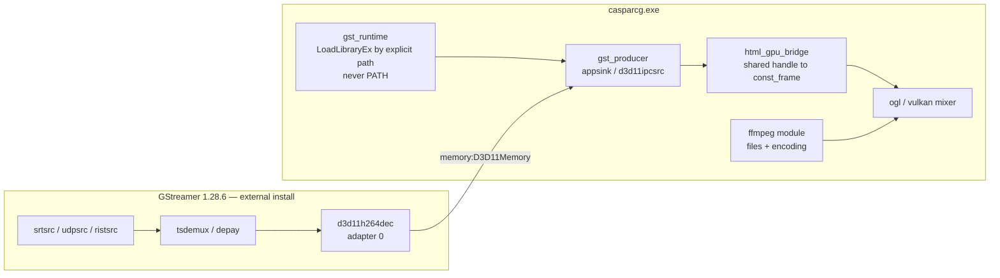

# GStreamer alongside FFmpeg in CasparVP — Integration Plan

**Status: a producer exists and plays. Written 2026-08-17, implemented 2026-08-18.**

> `src/modules/gstreamer` now exists on `proto/gstreamer-ffmpeg8` in
> `d:\Github\CasparCG-server`, wired into CMake behind `ENABLE_GSTREAMER`, with a producer on
> `PLAY … [GSTREAMER] "<pipeline>"`. **There is still no harness coverage** — §10 is unchanged
> and is the honest gap. What preceded it: a verified GStreamer install on the development box
> and a measured answer to the question that was blocking the decision — *can both stacks live
> in one process* — which §3.5 answers yes, on FFmpeg 8.
>
> The short version: **full integration is possible, and the route that makes it clean is a
> move to FFmpeg 8.x.** The FFmpeg DLLs are the entire conflict surface, and FFmpeg 8.x
> renames every one of them.
>
> **Updated 2026-08-18**: §3.5 measures the FFmpeg 8 arm — upstream already ships 8.1.2, a
> host built from it runs here, and with it the 272-plugin tree registers with `gstlibav`
> intact and both FFmpeg stacks coexist in one process. Route A is no longer a proposal.
>
> **Updated 2026-08-17** with §7, on external and custom plugins — including the finding that
> settles where CV work has to live: `d3d11ipcsink` transmits the texture handle, caps, layout
> and a timestamp, and **no GstMeta**, so isolation and native analytics metadata cannot both
> be had without a side channel. §4.4's recommendation changed as a result.

---

## 1. Why consider it at all

Three separate motives, in increasing order of how well they are established:

1. **A reported failure.** Receiving streams above ~60 Mbps is said to choke the FFmpeg
   producer. **This is currently an untested premise** — see §9.1. It is the motive that
   started the evaluation, and it is the weakest-evidenced one.
2. **Capabilities FFmpeg does not have.** Not "does worse" — does not have. PTP clock
   discipline, WebRTC/WHIP/WHEP, closed-caption round-tripping, SCTE-35 parsing, and a
   tracer-based observability layer. Inventory in §6, all entries verified against the
   install rather than recalled.
3. **A/B testing as a first-class goal.** Today the FFmpeg path is the only path, so
   "FFmpeg is the right tool for this workflow" is an assumption the tree cannot test. Two
   independent implementations of ingest let it be measured. This is the motive that argues
   for *full* integration rather than a curated subset — see §5.

---

## 2. What is installed

| | |
| :--- | :--- |
| Version | GStreamer 1.28.6, MSVC x86_64, runtime **and** devel |
| Location | `D:\gstreamer\1.28.6` |
| Installed | 2026-08-17, per-user (`/VERYSILENT /CURRENTUSER /DIR=...`), no elevation |
| Footprint | ~2 GB; 146 DLLs in `bin`, 271 plugins, 143 `.lib`, 155 `.pc` |
| Registered | 272 plugins, 1636 features. Only `gstpython.dll` blacklisted (no Python in the scanner environment) |
| Uninstall | `D:\gstreamer\1.28.6\unins000.exe` |

**It added nothing to PATH and set no environment variables.** Verified by snapshotting
machine and user PATH before and after. This is deliberate and load-bearing: a global PATH
entry would put GStreamer's FFmpeg on the DLL search path of every process on the box,
`casparcg.exe` included. The module must locate GStreamer by explicit path — the pattern
[`newtek/util/ndi.cpp`](../src/modules/newtek/util/ndi.cpp) already uses for the NDI SDK.

The installer was checked against its published SHA256 before being run
(`059251444d1267b486eba390b18d25fed87e10315e72f757ec6c7e912fa746b5`).

---

## 3. The conflict surface, measured

### 3.1 The mechanism

Windows keys loaded modules by **base name**, per process. Once `avcodec-61.dll` is loaded
from `build\shell`, any later dependent load of that base name — from any directory —
resolves to the module already in the process. No search-path flag changes this;
`LOAD_LIBRARY_SEARCH_DLL_LOAD_DIR` alters where Windows *looks*, not whether it reuses a
module it already has.

The corollary is the useful half: **DLLs with different base names do not interact at all.**

### 3.2 What actually collides

Comparing GStreamer's `bin` (146 DLLs) and its 271 plugins against the 25 DLLs shipped next
to `casparcg.exe`:

| Colliding DLL | CasparVP (`build\shell`) | GStreamer 1.28.6 |
| :--- | :--- | :--- |
| `avcodec-61.dll` | 61.3.100 — FFmpeg 7.0.2 gyan, 80.0 MB | 61.19.100 — FFmpeg 7.1.x, 14.8 MB |
| `avformat-61.dll` | 61.1.100 | 61.7.100 |
| `avutil-59.dll` | 59.8.100 | 59.39.100 |
| `avfilter-10.dll` | 10.1.100 — 39.5 MB | 10.4.100 — 0.2 MB |
| `swscale-8.dll` | 8.1.100 | 8.3.100 |
| `swresample-5.dll` | 5.1.100 | 5.3.100 |

**Six collisions, all FFmpeg. Zero plugin-name collisions.** Nothing else in either tree
shares a base name. FFmpeg is not *a* problem, it is *the* problem — which is what makes
full integration tractable.

A widely repeated claim is that Cerbero links FFmpeg statically into the libav plugin, so
no shared FFmpeg DLLs ship. **That is false for 1.28.6** and was asserted in this
evaluation before being tested. The plugin is `gstlibav.dll` — note, no `lib` prefix, which
is how a first check for `libgstlibav.dll` wrongly concluded it was absent.

### 3.3 Which side is at risk

Only GStreamer's. The application directory is searched before any other user directory, so
`casparcg.exe`'s own FFmpeg always wins. GStreamer's build is the newer minor (61.19 vs
61.3), so the failure mode is a GStreamer plugin needing a symbol our older FFmpeg does not
export. Never the reverse.

### 3.4 Measured: what naive unification does

Test: a copy of GStreamer's `bin` with the six `av*` DLLs replaced by CasparVP's FFmpeg
7.0.2, then `gst-inspect-1.0 avdec_h264` against a fresh registry.

```
swapped in CasparVP FFmpeg 7.0.2 → "No such element or plugin 'avdec_h264'", exit -1
  GST_PLUGIN_LOADING:5 → gstpluginloader-win32.c:275: Adding blacklist plugin 'gstlibav.dll'
control, GStreamer's own 7.1.x restored, same directory, only av* differs → exit 0, loads
```

Two things worth keeping from that:

* **The premise holds** — one FFmpeg cannot serve both at these vintages. The control rules
  out the test setup as the cause.
* **The failure mode is safe.** GStreamer loads plugins through a separate loader process on
  Win32, so the symbol failure does not crash the host: the plugin is blacklisted and every
  other plugin keeps working. A degraded plugin set is a recoverable outcome, not a fault.

**What this does not cover:** it tests plugin *registration* only. No frame was decoded, no
throughput was measured, and nothing was run inside `casparcg.exe`.

### 3.5 Measured: FFmpeg 8 removes the collision — 2026-08-18

The §3.4 test, re-run with a host built against FFmpeg 8.1.2 (`proto/gstreamer-ffmpeg8` in
`d:\Github\CasparCG-server`, off `upstream/master`, which is already pinned to 8.1.2 — see
[`FFMPEG_8_MIGRATION.md`](FFMPEG_8_MIGRATION.md) §0). Two independent measurements.

**1. In-process dual load.** This is the question that actually matters, because Windows
keys loaded modules by base name *per process* — an exit code from a helper process does not
answer it. In one process: `LoadLibraryEx` on our `avcodec-62.dll` from `build-ffmpeg8\shell`,
then GStreamer's `gstreamer-1.0-0.dll`, then `gstlibav.dll` from `lib\gstreamer-1.0`, each
with `LOAD_LIBRARY_SEARCH_DEFAULT_DIRS | _DLL_LOAD_DIR | _USER_DIRS` and `AddDllDirectory`
for both `bin` directories. All three returned a handle, and the process ended up holding
**both FFmpeg stacks at once**:

```
avcodec-62.dll     ...\build-ffmpeg8\shell\avcodec-62.dll     ours, 8.1.2
avutil-60.dll      ...\build-ffmpeg8\shell\avutil-60.dll
swresample-6.dll   ...\build-ffmpeg8\shell\swresample-6.dll
avcodec-61.dll     D:\gstreamer\1.28.6\bin\avcodec-61.dll     GStreamer's, 7.1.x
avformat-61.dll    D:\gstreamer\1.28.6\bin\avformat-61.dll
avutil-59.dll      D:\gstreamer\1.28.6\bin\avutil-59.dll
avfilter-10.dll    D:\gstreamer\1.28.6\bin\avfilter-10.dll
swscale-8.dll      D:\gstreamer\1.28.6\bin\swscale-8.dll
swresample-5.dll   D:\gstreamer\1.28.6\bin\swresample-5.dll
```

Nine modules, two stacks, no interference — which is §3.1's corollary (*different base names
do not interact*) demonstrated rather than argued.

**2. Registration, both arms side by side.** A copy of GStreamer's `bin` plus a copy of
`gst-plugin-scanner.exe`, a fresh registry per run, and `PATH` scoped to that directory — so
the arms differ only in which FFmpeg sits next to the scanner. The query is §3.4's, verbatim:

| arm | `av*` in the directory | `gst-inspect-1.0 avdec_h264` | blacklisted | features |
| :--- | :--- | :--- | :--- | :--- |
| **arm8** — FFmpeg 8 **added** | 61/59/10/8/5 **and** 62/60/11/9/6 | **exit 0**, rank primary (256) | `gstpython.dll` only | **1632** |
| **arm7** — FFmpeg 7.0.2 **overwriting** (§3.4) | 61/59/10/8/5, ours | exit -1, *No such element or plugin* | `gstlibav.dll`, `gstpython.dll` | 1206 |

The 426-feature gap is exactly `gstlibav`'s element set. Nothing was replaced in arm8 because
no base name overlaps — which is the whole of §4.1's argument, now measured rather than
inferred from a table of sonames.

**3. It also runs.** In arm8,
`videotestsrc num-buffers=10 ! video/x-raw,width=320,height=240 ! avenc_mjpeg ! fakesink`
exits 0, and a module audit of that running process shows it resolving GStreamer's own
`avcodec-61` while our `avcodec-62` sits in the same directory, unused. §3.3's "only
GStreamer is at risk" survives the change, for a better reason than before: our FFmpeg is no
longer even a candidate for its imports.

**What this does not cover.** Registration plus one encode, and still nothing inside
`casparcg.exe` — no `gst_init` in the host, no frame across the boundary, nothing on the
mixer. It establishes that the collision is gone, which is what §4.1 rests on. It says
nothing about throughput, latency, or the founding premise in §9.1.

---

## 4. Three routes to full integration

### 4.1 Route A — move CasparVP to FFmpeg 8.x *(recommended; upstream already did it)*

**Status, 2026-08-18: done upstream, and measured.** `upstream/master` has been pinned to
`ffmpeg-8.1.2-full_build-shared.7z` since before this document was written, so the "migration"
this route asks for is, for the fork, a **rebase** — see [`FFMPEG_8_MIGRATION.md`](FFMPEG_8_MIGRATION.md)
§0. A host built from it runs here, and §3.5 measures the coexistence this section predicts:
`gstlibav` registers, both FFmpeg stacks load into one process, and a libav pipeline runs.

FFmpeg bumps every soname at a major release. From the local FFmpeg tree
(`d:\Github\FFmpeg`, `n8.1.1-7-g3728de467d`) read directly out of `version_major.h` /
`version.h`:

| Library | FFmpeg 7.x (both current builds) | FFmpeg 8.x |
| :--- | :--- | :--- |
| libavcodec | 61 | **62** |
| libavutil | 59 | **60** |
| libavformat | 61 | **62** |
| libavfilter | 10 | **11** |
| libswscale | 8 | **9** |
| libswresample | 5 | **6** |

**Every name differs. The overlap becomes zero.** `avcodec-62.dll` and `avcodec-61.dll` are
different modules and coexist in one process without interacting — which means the entire
272-plugin GStreamer tree, `gstlibav.dll` included, loads in-process with no curation, no
renaming, no helper process and no Cerbero rebuild.

This is also not a detour: the CasparCG dependency mirror **already hosts**
`ffmpeg-8.0.1-full_build-shared.7z` and `ffmpeg-8.1.2-full_build-shared.7z` under the
`ffmpeg` release tag, next to the `ffmpeg-7.0.2-full_build-shared.7z` that
[`Bootstrap_Windows.cmake:81`](../src/CMakeModules/Bootstrap_Windows.cmake#L81) currently
pins. The packages exist; only the pin and the API migration are missing.

**Cost — investigated 2026-08-17, and smaller than this section originally claimed.** See
[`FFMPEG_8_MIGRATION.md`](FFMPEG_8_MIGRATION.md). Of the 24 deprecated API groups FFmpeg
removed in the 8.x cycle, CasparVP references **none**, and the two that would have bitten
already carry version-guarded dual paths — one of them gated on `LIBAVCODEC_VERSION_MAJOR
< 62`, i.e. the FFmpeg 8 branch is already written. The real risk is not the API but a
**swscale engine rewrite**, confined to two call sites
([`image_converter.cpp`](../src/modules/image/util/image_converter.cpp) and
[`spout_consumer.cpp`](../src/modules/spout/consumer/spout_consumer.cpp)), neither of which
is in the 1 LSB path — which also means no existing battery can detect a regression there.

This is no longer the largest unknown in the plan. It also carries gains worth having on
their own: ProRes and ProRes RAW Vulkan hwaccels, swscale Vulkan support, JPEG-XS, APV, and
the D3D12 filter set — the last of which shares a bridge problem with §9.2.

### 4.2 Route B — out-of-process helper

GStreamer runs entirely in a helper executable; frames return over
`d3d11ipcsink`→`d3d11ipcsrc` or `cudaipcsink`→`cudaipcsrc`, both of which ship in this
install. Zero conflict by construction, full plugin set, and a decoder crash cannot take
playout down.

The subtlety: the *receiving* element is itself a GStreamer element, so the host still loads
GStreamer — but only the receive-side plugins. That subset is measured and clean:

> Curated receive set (`srt`, `udp`, `rist`, `rtp`, `mpegtsdemux`, `videoparsersbad`,
> `d3d11`, `coreelements`, `app`, `typefindfunctions`, `playback`) →
> **26-DLL / 26.5 MB transitive closure, zero FFmpeg DLLs, zero collisions.**
> Computed with `dumpbin /DEPENDENTS` walked transitively, *not* a strings scan, because a
> strings scan cannot see delay-loaded imports and this is the number the decision rests on.

So Route B works today, without touching FFmpeg. It is the fallback if the FFmpeg 8.x
migration proves expensive, and it is the better answer regardless if crash isolation is
valued for its own sake. It costs an IPC layer, process lifecycle and a watchdog.

### 4.3 Route C — rename GStreamer's FFmpeg

Rebuild GStreamer's FFmpeg from the Cerbero recipe with FFmpeg's supported
`--build-suffix`, producing distinct DLL names. Legitimate and surgical, but it means owning
a Cerbero build of GStreamer forever, and every upgrade re-runs it. Binary-patching the
import tables of the shipped DLLs is the cheaper-looking variant and is **rejected** — it
breaks signatures and turns each upgrade into a re-patch.

### 4.4 Recommendation — both, split by plugin provenance

Revised 2026-08-17. This section previously said "Route A, with Route B as the fallback". That
framed A and B as alternatives, and they are not: **§7 establishes that the process boundary
is the right trust boundary for third-party plugins**, which makes B part of the design rather
than a fallback.

* **Route A is still the base**, and still the only one that removes the FFmpeg collision
  rather than managing it. **It is also no longer pending**: upstream carries FFmpeg 8.1.2,
  a host built from it runs here, and §3.5 measures the whole 272-plugin tree registering
  in-process with `gstlibav` intact. What remains is the fork's rebase, not a migration —
  [`FFMPEG_8_MIGRATION.md`](FFMPEG_8_MIGRATION.md) §0 and §8. FFmpeg **9.0** exists as of
  2026-08-03 and is deliberately not the target; §7 of that document says why.
* **Route B is then applied selectively**, not as a fallback: freedesktop-built core plugins
  (transport, demux, hardware decode) run in-process; third-party, CV/ML, experimental and
  Python plugins run in the helper. §7.4 gives the reasoning and §7.5 the one measured
  obstacle.
* **Route C stays rejected.**

---

## 5. Why full, not a subset

A curated subset is enough to *use* GStreamer. It is not enough to *evaluate* it.

Motive 3 in §1 is to stop assuming the FFmpeg path is best. That requires running the same
workload through both stacks and comparing — and any subset chosen up front encodes the
assumption it was meant to test. `gstlibav` is the clearest case: it is the one plugin a
capability-driven subset would obviously drop, and also the only way to compare GStreamer's
*scheduling* against FFmpeg's while holding the decoder constant. Dropping it removes the
control from the experiment.

---

## 6. Capability inventory

Every element below was confirmed present in this install with `gst-inspect-1.0` (42 probed,
42 found, none absent). Presence is not a performance claim — nothing here has been
benchmarked.

| Area | Elements | State in CasparVP |
| :--- | :--- | :--- |
| Scheduling / clock | pipeline clock, QoS, latency negotiation; `gst_ptp_clock_new` + `gst-ptp-helper.exe`, `gst_net_client_clock_new` (both in `gstnet-1.0-0.dll`) | no equivalent; adjacent to [`CLUSTER_SYNC.md`](CLUSTER_SYNC.md) |
| Observability | 10 tracers: `latency`, `buffer-lateness`, `queue-levels`, `pad-push-timings`, `pcap-writer`, `leaks`, `stats`, `dots`, `log`, `factories`; `GST_DEBUG_BIN_TO_DOT_FILE` | `-loglevel debug` and inference |
| GPU-resident pipelines | `memory:D3D11Memory` / `memory:CUDAMemory` as negotiated caps; `d3d11ipcsink/src`, `cudaipcsink/src` for cross-process | `hw_frames_ctx`; cross-process is bespoke |
| Warp / projection | `d3d12fisheyedewarp` (`projection-type`, `fisheye-fov`, `horizontal-fov`, `center-x/y`, `radius-x/y`, `inner-radius`, ROI); `d3d12remap` (arbitrary `ID3D12Resource` UV map, R→U, G→V, **A = mask**) | overlaps [`PROJECTION_CALIBRATION.md`](PROJECTION_CALIBRATION.md) — see §9.2 |
| Closed captions | `ccextractor`, `cccombiner`, `ccconverter`, `cea608tocea708` | nothing |
| SCTE-35 | `gst_mpegts_scte`, `scte_sit` in `gstmpegts-1.0-0.dll` | nothing |
| Timecode | `timecodestamper` with a dedicated `ltc_sink` pad: `ltc-auto-resync`, `ltc-timeout`, `ltc-daily-jam`, `rtc-max-drift`, `timecode-offset` | `ltc` module exists |
| Transport | `srtsrc`, `ristsrc` + `roundrobin`, `rtpvrawpay/depay`, `rtspsrc`, `udpsrc`, `tsdemux`, `tsparse` | FFmpeg protocols |
| WebRTC | `webrtcbin`, `whipclientsink`, `whepclientsrc` | nothing — FFmpeg cannot do this |
| Test / fault injection | `netsim`, `livesync`, `clocksync`, `identity` | nothing |
| Already covered here | `decklinkvideosrc/sink`, `ndisrc/ndisink`, `x264enc`, `openh264dec` | mature `decklink` / `newtek` modules; GPU-direct NVENC consumer. **No reason to switch** |

### 6.1 Where FFmpeg stays the right tool

Stated so the plan is not read as a replacement. Our `avcodec-61.dll` is 80 MB against
GStreamer's 14.8, and `avfilter` 39.5 MB against 0.2 — a GPL build with `--enable-libx264
--enable-libx265 --enable-libsrt --enable-nvenc --enable-nvdec --enable-cuda-llvm` across 90
configure flags, versus a much smaller one. Muxer/demuxer/codec breadth, the file-playback
semantics `SEEKABLE`/`LOOP`/`PINGPONG`/`SPEED` in
[`ffmpeg_producer.cpp`](../src/modules/ffmpeg/producer/ffmpeg_producer.cpp) are built on,
and the existing GPU-direct NVENC consumer all argue for FFmpeg keeping files and encoding.

*(GStreamer's own FFmpeg configure line could not be recovered — no flag strings are present
in its `avcodec-61.dll`, so its exact feature set is inferred from size and is not
established here.)*

---

## 7. External and custom plugins

Added 2026-08-17, after the question *"how would external and custom plugins work — computer
vision and other things that might not be native?"* Assertions here were checked against
upstream documentation and source, not recalled; §7.7 records which claims are measured, which
are documented, and which are neither.

### 7.1 The extension model — this is the structural win

GStreamer discovers plugins by **scanning directories for DLLs at init** and caching their
metadata in a registry file. Per the upstream `GstRegistry` documentation the search order is:

1. `--gst-plugin-path` on the command line
2. `GST_PLUGIN_PATH`
3. `GST_PLUGIN_SYSTEM_PATH`
4. built-in defaults

with the primary source of truth being *"each plugin file itself"* and the registry only a
cache, invalidated per-file when stale. `GST_PLUGIN_PATH` plugins load **in addition to and
before** system plugins, so a directory we own can be layered over the vendor tree without
mixing into it.

**Adding a plugin is dropping a file.** No CasparVP rebuild, no reship, no version bump.

Contrast this with FFmpeg, where a new codec means rebuilding FFmpeg and replacing
`avcodec-*.dll`. That asymmetry is arguably a bigger deal than any single capability in §6: it
is why this tree carries [`cuda_prores`](../src/modules/cuda_prores/),
[`cuda_notchlc`](../src/modules/cuda_notchlc/) and [`hap`](../src/modules/hap/) as bespoke
C++ modules — there was no other way in. A GStreamer module gives CasparVP its first plugin
extension point that does not require recompiling the server.

Verified present in the 1.28.6 core: `GST_PLUGIN_PATH`, `GST_PLUGIN_SYSTEM_PATH`,
`GST_PLUGIN_FEATURE_RANK`, `GST_REGISTRY`, `GST_REGISTRY_FORK`, `GST_PLUGIN_SCANNER`,
`gst_plugin_load_file`, `gst_registry_scan_path`, `gst_element_register`.

### 7.2 What ships already — the CV framework is native, the engines are not

Confirmed with `gst-inspect-1.0` on this install:

| Layer | Present in 1.28.6 |
| :--- | :--- |
| Metadata model | `gstanalytics-1.0-0.dll` — `gst_analytics_relation_meta` with `od_mtd` (detection), `cls_mtd` (classification), **`tracking_mtd`**, `segmentation_mtd` |
| Tensor decoding | `yolov8tensordec` (YOLO v8–v11), `yolosegv8tensordec` (segmentation), `ssdtensordec`, `classifiertensordecoder`, `ultralightfacedetectortensordec`, **`ioutracker`** (IoU object tracker), `tensordecodebin` |
| Inference | `burn-yoloxinference` — YOLOX via the Rust **Burn** framework |
| Rendering | `objectdetectionoverlay`, `segmentationoverlay` |
| Classical CV | `hsvdetector`, `gleffects_sobel`, `colordetect`, `zbar` |

**Absent:** OpenCV (`gstopencv.dll`), ONNX Runtime, TensorRT/DeepStream. So the *framework* is
native and the heavy *engines* are the external part — which is the right shape, because the
metadata model is the stable interface and the engines are the churn.

`tracking_mtd` matters here specifically: [`tracking`](../src/modules/tracking/) already
exists, and analytics metadata is a documented path from detector → object identity → mixer
transform, DMX or keyframes.

**Three caveats, all found by checking rather than assuming:**

* **The GstAnalytics API is explicitly unstable.** Upstream states *"NOTE: This library API is
  considered unstable"*. Anything built on it should expect breaking changes across GStreamer
  releases, and that argues for keeping our own code behind a thin adapter.
* **`burn-yoloxinference` defaults to CPU.** Its `backend-type` default is `NdArray`, which is
  the CPU backend; GPU requires selecting a CubeCL backend via `backend-type` plus
  `cubecl-type-id` / `cubecl-index-id`. It loads PyTorch weights (`weights-path`) in six
  YOLOX sizes. A CPU-by-default inference element in a playout server is a trap worth naming.
* **Upstream docs describe a newer element set than 1.28.6.** The documented YOLOX example
  pipeline uses `yoloxtensordec`, which is **absent** here, as is `yolov8tensordec2`. Read the
  docs for main, then check against `gst-inspect` on the pinned release.

### 7.3 What determines whether an external plugin works

**ABI — measured compatible.** GStreamer's `gstreamer-1.0-0.dll` and `casparcg.exe` both link
`VCRUNTIME140.dll` plus the UCRT `api-ms-win-crt-*` forwarders; `glib-2.0-0.dll` links
`VCRUNTIME140` too. GStreamer's API is C and allocates through GLib, so C++ ABI differences
largely do not cross the element boundary. An MSVC plugin built against the 1.28.6 devel
headers is the safe case; a MinGW-built plugin is the risky one.

**DLL collisions — recurring, not one-off.** This is the real ongoing cost. Every plugin's
dependency closure enters `casparcg.exe`'s process, so a CV plugin dragging in OpenCV, ONNX
Runtime, protobuf or its own CUDA needs the same `dumpbin /DEPENDENTS` audit as §3, against
**both** our 25 DLLs and GStreamer's 146. One piece of luck: the ffmpeg module links
`CUDA::cudart_static`, so we ship no `cudart64_*.dll` and a plugin bringing its own will not
collide. This is what turns the `dll-audit` battery in §10 from a nice-to-have into a standing
per-plugin gate.

**Failure isolation is real but partial.** Measured this session: the Win32 plugin loader runs
in a **separate process** (`gstpluginloader-win32.c`), so a plugin that fails to *load* is
blacklisted and everything else keeps working — exactly what happened to `gstlibav.dll` in
§3.4, and `gst-inspect-1.0 -b` then lists it. That covers load. It does **not** cover a plugin
that loads cleanly and then hits GPU OOM, triggers a driver reset, leaks unboundedly, or stalls
seconds on first inference — which is precisely the CV/ML risk profile.

*(Upstream's `GstRegistry` reference documents the scan order and cache but says nothing about
the scanner helper process or blacklisting; that claim rests on our own measurement.)*

### 7.4 Provenance is the right process boundary

Which resolves the in-process/out-of-process question from §4 rather than choosing a side:

| | In-process | Helper process |
| :--- | :--- | :--- |
| **What runs there** | freedesktop-built core: transport, demux, hardware decode | third-party, CV/ML, experimental, Python |
| **Why** | deterministic, version-pinned, audited 26-DLL closure | crash contained, memory bounded by the OS, a hung inference cannot stall playout |

It also answers the licensing question conventionally: plugins declare a license string in
`GST_PLUGIN_DEFINE`, CasparCG is GPLv3, and a process boundary is the usual separation for
anything proprietary. *(Not legal advice; flagged so it is not discovered late.)*

### 7.5 The measured obstacle: metadata does not cross the IPC boundary

This was flagged as unverified and is now settled from the upstream source of
`gstd3d11ipcsink.cpp`. The IPC message carries **only**:

* the D3D11 shared NT handle (`prepared_handle`),
* the caps,
* a `GstD3D11IpcMemLayout` (`size`, `pitch`),
* a timestamp.

There is **no GstMeta serialization**. So a CV plugin running in the helper can attach
`GstAnalyticsRelationMeta` all it likes and **none of it reaches the host** over
`d3d11ipcsink` → `d3d11ipcsrc`. Documented properties are only `adapter`, `min-buffer-size`
and `pipe-name`.

Consequences for the design:

1. The helper split needs a **second channel for metadata**, correlated to frames by the
   timestamp the IPC message does carry. That is a design item, not a detail.
2. Alternatively, CV runs **in-process** where metadata rides the buffer natively — accepting
   the §7.3 isolation risk. That is the trade, stated plainly: *isolation or metadata, not
   both, without building the side channel.*
3. Either way this must be decided before any CV work starts, because it determines where the
   inference element lives.

### 7.6 Two practical levers

**`GST_PLUGIN_FEATURE_RANK` serves the A/B goal in §5 directly** — it re-ranks elements by
name at runtime, with no code and no rebuild, so two decoders can be compared on one pipeline.
Upstream annotates it *"Since: 1.30"*, but **measured working on 1.28.6**:
`d3d11h264dec` reports `Rank primary + 1 (257)` normally and `Rank none (0)` under
`GST_PLUGIN_FEATURE_RANK=d3d11h264dec:NONE`. Trust the measurement for our pin, and re-check
if the pin moves backwards.

**Python is constrained.** `gstpython.dll` ships but hard-links `python39.dll`, and it is the
one plugin auto-blacklisted on this install (no Python present). Python 3.9 is old for a modern
CV stack, so Python plugins are a prototyping route with real friction — and another argument
for the helper rather than the server.

### 7.7 Provenance of the claims in this section

| Claim | Basis |
| :--- | :--- |
| Plugin scan order, registry-as-cache, `GST_PLUGIN_PATH` precedence | upstream `GstRegistry` and *Running GStreamer* docs |
| `d3d11ipcsink` carries no GstMeta | upstream source `gstd3d11ipcsink.cpp` |
| GstAnalytics API is unstable | upstream `analytics` library docs |
| `burn-yoloxinference` backends, weights, properties | upstream `burn` plugin docs |
| Element presence/absence in 1.28.6, `burn`/`yoloxtensordec` mismatch | `gst-inspect-1.0` on this install |
| CRT/ABI linkage | `dumpbin /DEPENDENTS` on both trees |
| Plugin-loader isolation and blacklisting | our own measurement (§3.4); **not** covered by the docs consulted |
| `GST_PLUGIN_FEATURE_RANK` works on 1.28.6 | measured here; contradicts the docs' "Since: 1.30" |
| Per-plugin collision cost | inference from §3's mechanism; **no third-party CV plugin has been audited yet** |

---

## 8. Proposed shape

### 8.0 What exists — 2026-08-18

The shape below was followed, and the GPU handoff it defers to `d3d11ipcsrc` exists too, by a
different route: in-process, through a shared texture rather than an IPC element.

| File | What it does |
| :--- | :--- |
| `util/gst_runtime.*` | resolves the install, loads its libraries **by explicit path**, sets a private registry, `gst_init` |
| `util/gst_frame.*` | `GstSample` → `core::draw_frame`, via `GstVideoFrame` and `ffmpeg::make_frame` |
| `util/gst_d3d11.*` | the GPU route: a `GstD3D11Memory` texture copied into a shared one and imported by the mixer, with no host round trip |
| `producer/gst_producer.*` | the pipeline, its worker threads, the bounded frame queue, the bus, the rebuild-on-error and the transport commands |
| `util/gst_query.*` | `GST INFO` and `GST LIST`, so the box can be asked what it has |
| `consumer/gst_consumer.*` | the way out: channel frames into an `appsrc`, wrapped rather than copied |
| `gstreamer.cpp` | registers the producer factory; optional `auto-load` |

* **AMCP**: `PLAY 1-10 [GSTREAMER] "videotestsrc pattern=smpte"`, `gst://<pipeline>`, and
  `ADD 1 GSTREAMER "<pipeline>"` for output — the consumer prepends an `appsrc name=caspar_video`
  where the producer appends an `appsink`, so the two read the same way round.
* **Transport**: `CALL 1-10 PAUSE | RESUME | SEEK <frame> | LENGTH | POSITION`. Deliberately a
  subset — `LOOP`, `IN` and `OUT` belong to a producer that owns its reader, and this one owns
  a pipeline whose source may be a socket. The seek is `FLUSH | ACCURATE`: with `KEY_UNIT`,
  `SEEK 300` on a clip with keyframes every 250 landed at 250 and read back 324 a moment
  later, which is plausible enough to be believed and wrong by two seconds.
* **Config**: `<gstreamer><pipeline>` inside a channel's `<consumers>`, so a channel can leave
  through a pipeline with no AMCP client present. Documented in `casparcg.config`.
* **Queries**: `GST INFO` (version, path, plugin and feature counts, how many were
  blacklisted) and `GST LIST <substring>` (element factories matching it, capped at 100 and
  saying how many it dropped). `INFO` does not initialise GStreamer if it is not loaded — a
  query that changes what it is asked about cannot answer *was it loaded*.
  `has_invalid_protocol` in `ffmpeg_producer.cpp` hands `gst://` over the way it already
  hands over `ndi://` — §8's wiring point 2, used as written.
* **Config**: `<gstreamer><path>` and `<gstreamer><auto-load>`, both documented in the
  commented block of `casparcg.config`.
* **Build**: `ENABLE_GSTREAMER=ON` plus `GSTREAMER_ROOT`; **off by default**.
* **The description contract**: everything up to but *not* including the sink. The module
  appends `videoconvert ! videorate ! appsink name=caspar_video`, with caps pinning the
  channel's frame rate and the raw formats `gst_frame` can map. A description that names
  `caspar_video` itself is taken as written, which is how a second chain reaches
  `caspar_audio`.
* **Audio**: a second `appsink` named `caspar_audio`, pulled on its own thread into a bounded
  buffer and drained into each frame at the format's rotating cadence, padded with silence on
  a short read and counted as an underrun. Opt-in, because the sink has to be named — a
  pipeline with no audio branch is unaffected.
* **Dynamic sources work**: the description goes through `gst_parse_launch`, whose delayed
  links handle `filesrc ! decodebin` producing its pad later.
* **A pipeline that errors is rebuilt**, backing off 500 ms → 1 s → 2 s → 4 s to a 5 s
  ceiling, rather than stopping the producer for good. The original behaviour meant a layer
  died with its sender and stayed on air showing its last frame — survivable for a file,
  wrong for everything this module is for.
* **The GPU path**, opt-in per `PLAY` with a `GPU` argument. The tail becomes
  `d3d11upload ! d3d11convert ! video/x-raw(memory:D3D11Memory),format=BGRA`, and the texture
  reaches the mixer through the route the CEF shared-texture path already uses: a ring of
  three textures created on GStreamer's device with `SHARED | SHARED_NTHANDLE`, a
  `CopySubresourceRegion`, an event query so the copy is retired before the mixer reads, and
  `import_d3d_texture` on the other side. **Not zero-copy** — it trades a download and an
  upload for one GPU-to-GPU copy on the same adapter, which is the honest description.
  It refuses rather than guesses on a different adapter — caught once, logged, host path
  thereafter. **Both mixers import**: the Vulkan half is ported from this fork's
  `accelerator/vulkan/util/d3d11_import_bridge`, single-plane half.
* **Absence is not an error**: the five GStreamer libraries are delay-loaded and nothing is
  shipped next to `casparcg.exe`, so a server on a machine without GStreamer starts normally.
  `dumpbin /dependents` lists all five under *delay load dependencies* and none as a hard
  import. A `PLAY` then answers `403` and logs the path to set.

**A network source works, and it is the coexistence thesis in use rather than in principle.**
`srtsrc ! tsdemux ! h264parse ! avdec_h264` against a `gst-launch` sender over SRT delivered
605 frames — decoded by **`avdec_h264`, which is `gstlibav`**, GStreamer's own FFmpeg running
in the same process as ours. §3.5 measured that the two stacks *can* coexist; this is one of
them actually decoding video inside `casparcg.exe`.

**Measured, 1080p5000, through the mixer and out of the IMAGE consumer.**

* **Against the FFmpeg producer, which is the comparison that matters.** A static 1920×1080
  SMPTE clip — static so frame timing cannot confound it, at native raster so no scaling can —
  played through this producer and through the FFmpeg producer, captured from the same
  consumer, is **byte-identical**: max per-channel difference 0, mean 0.000. Both differ from
  an `ffmpeg` CLI decode of the same file by the same amounts (mean 0.44 / 0.84 / 0.89 LSB,
  max at the bar edges), which is CasparCG's YUV-to-RGB path and not this module's.
* **Synthetic video.** `videotestsrc pattern=smpte` yields yellow `(255,255,0)`, red
  `(255,0,0)`, blue `(0,0,255)` — asymmetric on purpose, since a red/blue exchange is
  invisible on greys and is the standing trap in this tree.
* **Audio.** A 1 kHz mono sine from `audiotestsrc`, recorded to WAV through the FFmpeg
  consumer, lands on channel 0 at **1000.0 Hz**, RMS **0.5629** against the 0.5657 expected of
  an 0.8-amplitude sine, peak −1.9 dBFS; channels 1 and 15 are exactly zero. So a mono source
  maps to one channel and does not bleed.
* **Decode.** `filesrc ! decodebin` delivers 115 frames in the single-chain form, 147 with a
  second chain routed to `caspar_audio` at 1 channel and 0 underruns.
* **Output.** A static lossless clip through the FFmpeg producer, written back out by the
  consumer as PNG (`videoconvert ! pngenc ! multifilesink`), is **byte-identical to the
  channel's own IMAGE capture** — three separate frames, max difference 0, 423 frames sent and
  none dropped. PNG on both sides on purpose: no colour conversion sits between them, so
  byte-identity is the right gate rather than a tolerance.
* **Transport.** On an 8 s clip at 50 fps: `LENGTH` answers **400**, exactly the frame count;
  `PAUSE` holds the position across two seconds; paused seeks land exactly — `SEEK 100` → 100,
  `SEEK 300` → 300, `SEEK 42` → 42. On a live source `LENGTH` answers 0, which is the honest
  answer rather than a fabricated duration.
* **Audio on the GPU path.** 498 frames on the GPU carrying audio: channel 0 peaks at
  **1000.0 Hz** with RMS **0.5657** — 0.8/√2 to four places — and every other channel is
  exactly 0.000000, matching the host path sample for sample.
* **The GPU path on Vulkan.** 223 of 223 frames imported through
  `VK_KHR_external_memory_win32`, **byte-identical to the Vulkan host path and to the OpenGL
  mixer's GPU capture** (max 0 against both). The two backends now agree with each other and
  with themselves on the GPU path, which is what parity means here.
* **Recovery.** `identity error-after=100` posts a hard error deterministically: 4 restarts
  inside 15 s, frames resuming across each (119 → 300 → 500), and the picture afterwards still
  correct bars. **Killing a real SRT sender proved nothing** — `srtsrc` reconnects by itself,
  the recovery path never fired, and the only evidence was that nothing happened. A feature
  measured that way is not measured.

**Three defects this measuring found, none of which the code would have reported:**

1. **A decoded file played as 164 perfectly black frames.** The accepted caps listed NV12
   because GStreamer and FFmpeg both have it; `ffmpeg::pixel_format_desc` does not map it and
   returns `invalid` rather than failing, so the frame had no planes and the copy loop had
   nothing to do. The producer counted every one as received. The list is now exactly what
   `ffmpeg::make_frame` can describe, and the format is checked before a frame is built.
2. **`audioresample` was silently blacklisted.** Only six libraries are loaded by explicit
   path, and GStreamer loads its own plugins with a plain `LoadLibrary`, so a plugin needing a
   seventh found nothing. Its `bin/` is now on the process search path via `SetDllDirectory` —
   searched *after* the application directory, so nothing beside `casparcg.exe` can be
   displaced. The two directories are compared at startup and shared base names logged: **zero
   on FFmpeg 8, six on FFmpeg 7**, which is §3.5's result reappearing as a runtime invariant.
3. **A pipeline that lost a link reported `202`.** `set_state` returning ASYNC only means the
   change was accepted, and `gst_parse_launch` returns a partial pipeline with an error set
   when it drops a link. Both failed the same way — runs, reaches EOS, delivers nothing. PLAY
   now waits for the state change and refuses an incomplete pipeline.

**Unrelated upstream defect found in passing:** recording a channel with audio to MP4 or MOV
fails on `upstream/master` at FFmpeg 8.1.2 — the FFmpeg consumer offers AAC a 16-channel
`9.1.6` layout it does not support, and `avcodec_open2` returns EINVAL. Reproduced with a
plain colour producer and no GStreamer in the path, so it is upstream's, not this module's.
It does mean WAV is the only audio-carrying consumer that works here.

**Three defects in the server came out of building this, and none is GStreamer's.**

* **The WGL/D3D interop only existed when `<html><enable-gpu>` was set.** It is not an HTML
  feature — it is how *any* D3D11 texture reaches the OpenGL mixer — so a correct pipeline
  failed with `d3d interop not setup to bind shared d3d texture` against a config mentioning
  neither GStreamer nor D3D. It is now opened on demand.
* **`output::add` keys its consumer map on `index()` before calling `initialize()`.** Any
  consumer whose index depends on something `initialize()` sets — as the FFmpeg consumer's
  `100000 + channel_index_` does — is registered under one number and reported under another,
  so `REMOVE` by index never finds it. Reproduced here first by accident and then on purpose;
  this module's consumer sidesteps it with a constant index.
* **The Vulkan mixer's sampler used `eRepeat` where OpenGL uses `GL_CLAMP_TO_EDGE`**, so every
  frame border sampled the opposite edge. Measured on the *plain FFmpeg producer* with no
  GStreamer in the path: **5996 of 2073600 pixels differed between the backends (0.289%), max
  71 LSB**, the top-left corner reading `(177,190,233)` on Vulkan against `(191,191,191)` on
  OpenGL — the blue bar from the right of the picture, wrapped. With `eClampToEdge`, **0
  pixels differ**. What exposed it was the GPU path coming out *cleaner* than the host path,
  which is the wrong way round. Write-up in `CasparCG-server/PR_vulkan_sampler_wrap.md`.

**Three changes reached outside the module**, and each was forced by something failing:

* `import_d3d_texture` **takes the frame's audio**. It had no way to carry any — the
  `const_frame` it returns owns an opaque holding the GPU textures, so it cannot be taken
  apart and rebuilt with samples added — and the producer was refusing the GPU path for any
  pipeline with audio as a result. Defaulted, so the CEF path that was its only caller is
  untouched.
* `import_shared_texture(tag, handle, w, h, …)` is **new**, and it is the honest interface.
  `d3d_texture2d` is an OpenGL-side object: constructing one registers with
  WGL_NV_DX_interop2, and `d3d_device::get_device()` returns null unless that extension is
  present — so on a Vulkan server there is no way to *make* the argument `import_d3d_texture`
  wants, and a caller holding a perfectly good shared texture could not hand it over at all.
  The handle is what both backends take.
* The **Vulkan mixer imports** one, through a port of this fork's
  `accelerator/vulkan/util/d3d11_import_bridge` (single-plane half; the multi-plane path needs
  a texture wrapper upstream has no use for, since `core::texture` there is `bind`/`unbind`
  and nothing else). The Vulkan device now enables `VK_KHR_external_memory_win32` —
  `enable_extension_if_present`, so a device without it still comes up and the import falls
  back rather than the server failing to start.

**Not done, and neither item is small.**

**Handing the mixer YUV planes** instead of converting to BGRA on the GPU. The obvious next
optimisation, and it is not a module change: **this tree has no NV12 pixel format**.
`core::pixel_format` knows `ycbcr` and `ycbcra` (three planes) and the packed formats; a
semi-planar frame would need a new format in core *and* shader changes in both backends. That
would want gating at 1 LSB, and the batteries that do that — `conformance` and `grading` —
**cannot run against an upstream server at all**: they drive `MIXER COLORSPACE`, a CasparVP
command, and every case skips with `AMCP 400` (measured 2026-08-18, 0/0 conversions). Changing
both shaders with no gate available is the wrong trade, so this is recorded rather than
attempted. CasparVP's `d3d11_import_bridge` already has the two-plane import when it is wanted,
along with the measured reason it imports two single-plane textures rather than one
multi-planar one.

**Throughput and latency under load.** A network source runs and is measured for *frames*;
nothing measures the rates. That is the half of §1's first motive a frame count cannot speak
to, and it needs harness work rather than server work.

The server half of it exists now: the producer reports **`starved`** — ticks that found the
queue empty and repeated the last picture — and **`queue-peak`**. Those are what a rate
measurement would need, and they already answer the on-air question on their own. Measured
with a source that ends (`videotestsrc num-buffers=50`): `received` sticks at 51, `eos` goes
true, and `starved` climbs 70 → 261 → 452 across six seconds, which is the frozen-frame case
nothing else in the state distinguishes from a healthy producer. Note that a source merely
*slower* than the channel does not starve it — the appended `videorate` duplicates 25 fps up
to 50 — so starvation means the source stopped, not that it is behind.

---




Files, mirroring the layout every other module uses:

```
src/modules/gstreamer/
  gstreamer.cpp/.h          init/uninit; gst_init, register factories
  util/gst_runtime.cpp/.h   explicit-path loading, GST_PLUGIN_SYSTEM_PATH, private registry
  util/gst_frame.cpp/.h     GstBuffer -> core::const_frame
  producer/gst_producer.*   PLAY 1-10 GSTREAMER "<pipeline>" | gst://...
  consumer/gst_consumer.*   later, if at all
```

Three wiring points that are easy to miss:

1. **`casparcg_add_module_project`** in [`modules/CMakeLists.txt`](../src/modules/CMakeLists.txt)
   generates the include/init/uninit statements — see
   [`CasparCG_Util.cmake`](../src/CMakeModules/CasparCG_Util.cmake). Nothing in the module
   system assumes a single media backend.
2. **URI ownership.** `producer_factories_` is a vector tried in registration order
   ([`frame_producer_registry.cpp:40`](../src/core/producer/frame_producer_registry.cpp#L40)),
   and the FFmpeg producer is effectively a catch-all for `://` URIs. There is precedent for
   carving one out: `has_invalid_protocol` at
   [`ffmpeg_producer.cpp:347`](../src/modules/ffmpeg/producer/ffmpeg_producer.cpp#L347)
   exists solely to hand `ndi://` to another module. Use that explicit route rather than
   relying on `add_subdirectory` ordering.
3. **Adapter selection.** GStreamer enumerates both GPUs on this box by name: plain
   `d3d11h264dec` binds the RTX A4000, `d3d11h264device1dec` the Quadro P4000. The mixers
   run on adapter 0, so the non-`device1` variants are the ones that avoid a cross-adapter
   copy. See [`GPU_AFFINITY_PLAN.md`](GPU_AFFINITY_PLAN.md).

The frame handoff reuses what CEF already needs:
[`html_gpu_bridge.h`](../src/modules/html/producer/html_gpu_bridge.h) turns a shared texture
handle into a mixer-ready `const_frame` on both backends with no host-memory round trip, and
its interface is deliberately free of platform GPU types (`void*` handle, byte-order enum,
rect).

---

## 9. Open questions

### 9.1 The founding premise is untested

That FFmpeg chokes above 60 Mbps has not been reproduced or instrumented here. High-bitrate
UDP/SRT receive failures are frequently a socket-buffer or single-threaded-demux limit
rather than a library ceiling — `buffer_size`, `fifo_size`, `thread_queue_size`, SRT
`rcvbuf`. **If the real fault is a buffer size, this whole plan solves a problem that a
config change would have solved.**

First measurement, before any code:

```
GST_TRACERS=queue-levels,buffer-lateness  gst-launch-1.0 srtsrc uri=... ! tsdemux ! ...
```
against the equivalent FFmpeg invocation, on the real feed. That answers whether the motive
is real and, if it is, names the stage that backs up.

### 9.2 D3D12 warp elements vs D3D11 interop

`d3d12fisheyedewarp` and `d3d12remap` are the most directly relevant elements to the
projection work, and they are **D3D12**, while the mixers are OpenGL/Vulkan over D3D11
interop. Sharing D3D12 resources into Vulkan is possible but it is a different bridge from
the one in [`d3d11_import_bridge.h`](../src/accelerator/vulkan/util/d3d11_import_bridge.h).
Unscoped.

### 9.3 Other

* ~~Cost of the FFmpeg 7→8 migration (§4.1) — the largest unknown.~~ **Investigated
  2026-08-17**: [`FFMPEG_8_MIGRATION.md`](FFMPEG_8_MIGRATION.md). No longer the largest
  unknown; the residual risk is a swscale rewrite over two call sites.
* ~~Whether analytics metadata crosses the `d3d11ipc` boundary.~~ **Answered from upstream
  source, 2026-08-17: it does not** (§7.5). The live question is now the consequence —
  **which side of the process boundary CV runs on**, given that isolation and native
  metadata cannot both be had without building a side channel. Decide before starting CV
  work, not during.
* Whether `gst_init` in-process interacts badly with CEF's or TBB's thread pools.
* Whether an `appsink` copy is acceptable for v1, or the GPU-memory path is required from
  the start.
* Deployment: bundling a curated plugin set versus depending on an external install.
* No third-party CV plugin has been collision-audited yet (§7.3) — the cost is inferred from
  §3's mechanism, not measured on a real one.
* Whether the GstAnalytics API's declared instability (§7.2) is stable enough in practice to
  build on, or needs an adapter layer of our own.

---

## 10. Verification — the gap, and what closed it

**Written as a gap, and it was a real one:** nothing in `CasparCG-TestRunner` could measure
any of this, so the first module landed with no gate that could fail — and two defects
followed within two days, one of which (a decoded file playing as black frames the producer
counted as *received*) is invisible to every other battery in the harness.

**Closed for the cases below on 2026-08-18: `python cli.py gstreamer`.** Five cases, run
against a server built from `upstream/master` plus the module, **5/5 on both mixers**:

| case | what it can catch |
| :--- | :--- |
| `init` | wrong `<gstreamer><path>`, missing install, `gst_init` failure. Its failure skips the rest rather than reporting four failures with one cause |
| `synthetic` | channel order and the black-frame class, from `videotestsrc` bars checked for saturation and **order** — a red/blue exchange is invisible on greys |
| **`parity`** | **the same file through the GStreamer producer and the FFmpeg producer must be byte-identical.** No colour model: the FFmpeg producer is the oracle. This is the case that catches the decode, pixel-format and colour-order class |
| `audio` | a 1 kHz tone recorded to WAV and measured by FFT — right frequency, right amplitude, no bleed onto the other 15 channels |
| `dll-audit` | one loaded module **per FFmpeg base name**, and ours is the 8.x set. The runtime form of §3.5 |

Three things the battery cost, and each is a trap this document should carry rather than
leave in a Python comment:

* **A blind settle measured the wrong producer.** The first run reported the two decode
  paths differing by 44 LSB; the capture was the *previous* producer's picture. Waiting for
  a non-black frame was not enough either — a cleared channel keeps showing what was there —
  so the guard is two-sided: the clear must be observed before the new picture counts.
* **The fixture had to be lossless.** At `-crf 12` the two producers came out 2 LSB apart on
  a handful of pixels. That is not a defect and not tolerance to widen: different frames of
  a lossy encode decode differently, so "byte-identical" was not a well-posed question until
  `-qp 0` made every frame the same array.
* **The audio case records to WAV**, because to MP4 it would fail on the upstream AAC defect
  in §8.0, and it is analysed after the server stops, because a WAV read while the recorder
  still held it reported zero samples.

**Still open**, and none of it is covered by the above: no network source, so nothing
measures the transport that motivated the integration (§1 motive 1); no throughput, latency
or drop counting; no hardware or zero-copy path, because there is not one yet. The two
remaining items from the original list:

1. ~~**`gst-smoke`**~~ — done, as the `init` case, plus the functional check that matters
   more than a blacklist scrape: a pipeline needing `audioresample` either builds or does
   not.
2. **`ingest-ab`** — the same source through both producers, comparing **frame count,
   timing and drops**. The *pixel* half of this is done, as `parity`; the timing half is
   not, and it is the half that turns "assume FFmpeg is best" into a measurement.
3. ~~**`dll-audit`**~~ — done. As written it would have asserted the loaded-module set holds
   **exactly one module per FFmpeg base name**, and that ours is the 8.x set
   (`avcodec-62`, `avutil-60`, …). Cheap, and it is the regression test for §3 and §4.1.

   > This was written as "exactly one `avcodec-*.dll`", which §3.5 shows would **fail on a
   > correctly working system**: once GStreamer is loaded in-process there are two — ours at
   > 62 and GStreamer's at 61 — and that is the healthy state, not a fault. The invariant
   > that actually matters is one module per *name*, which is what Windows guarantees and
   > what a 7.x-era host violated.

Existing batteries that stay relevant unchanged: `mixer-parity` and `flat-decoded` if
frames reach the mixer, `vk-validation` for the Vulkan import path.

---

## 11. Reproducing the measurements

```powershell
# collision audit — full tree
$g = "D:\gstreamer\1.28.6"
$caspar = (Get-ChildItem "d:\Github\CasparVP\build\shell\*.dll").Name
(Get-ChildItem "$g\bin\*.dll").Name | Where-Object { $caspar -contains $_ }

# which plugin wants FFmpeg (expect: gstlibav.dll, and only that)
# transitive closure of a plugin set: dumpbin /DEPENDENTS, walked, filtered against $caspar

# §3.4 — swap CasparVP's FFmpeg into a copy of GStreamer's bin, fresh registry:
#   expect exit -1 and 'Adding blacklist plugin gstlibav.dll'
#   control: restore GStreamer's own av* in the same directory, expect exit 0
```

Run `gst-inspect-1.0` with `GST_PLUGIN_SYSTEM_PATH_1_0`, `GST_PLUGIN_SCANNER_1_0` and a
scratch `GST_REGISTRY` set explicitly — never by putting GStreamer's `bin` on PATH (§2).

```powershell
# §3.5 arm 2 — both arms, differing only in which FFmpeg sits beside the scanner.
# Copy GStreamer's bin twice, and copy gst-plugin-scanner.exe into each copy so the
# scanner resolves av* from the arm rather than from libexec.
#   arm8: ADD    build-ffmpeg8\shell\{av,sw}*.dll   -> nothing is replaced, names differ
#   arm7: OVERWRITE with CasparVP 7.0.2 av*/sw*      -> reproduces §3.4
# Then, per arm, with a fresh GST_REGISTRY and PATH scoped to that directory:
#   gst-inspect-1.0.exe avdec_h264     expect arm8 exit 0 / arm7 exit -1
#   gst-inspect-1.0.exe -b             expect arm8 {gstpython} / arm7 {gstlibav, gstpython}
#   gst-launch-1.0.exe -q videotestsrc num-buffers=10 ! avenc_mjpeg ! fakesink   (arm8)

# §3.5 arm 1 — in-process dual load, which no exit code can answer.
# SetDefaultDllDirectories(LOAD_LIBRARY_SEARCH_DEFAULT_DIRS), AddDllDirectory for both
# bin directories, then LoadLibraryExW with DEFAULT_DIRS|DLL_LOAD_DIR|USER_DIRS on:
#   build-ffmpeg8\shell\avcodec-62.dll
#   D:\gstreamer\1.28.6\bin\gstreamer-1.0-0.dll
#   D:\gstreamer\1.28.6\lib\gstreamer-1.0\gstlibav.dll
# then enumerate Process.Modules and filter '^(av|sw)'. Expect both stacks, distinct paths.
# Note: check the returned HMODULE, not GetLastError -- it is stale after a successful load.
```

## 12. Sources

* **FFmpeg sonames** — `d:\Github\FFmpeg` at `n8.1.1-7-g3728de467d`,
  `libav*/version_major.h` and `libavutil/version.h`. Read from the project that defines
  them, not from a changelog summary.
* **GStreamer 1.28.6** — plugin and element inventory from `gst-inspect-1.0` on the install
  described in §2; element properties from `gst-inspect-1.0 <element>`.
* **DLL search order and per-process module identity** — Microsoft's documented Windows
  loader behaviour; the `LOAD_LIBRARY_SEARCH_*` flags affect search paths, not module reuse.
* **Dependency packages** — `CasparCG/dependencies` GitHub releases, `ffmpeg` tag.

Consulted for §7 on 2026-08-17 (see §7.7 for which claim rests on which):

* **Plugin discovery, registry-as-cache, scan order** —
  [GstRegistry](https://gstreamer.freedesktop.org/documentation/gstreamer/gstregistry.html)
  and [Running GStreamer](https://gstreamer.freedesktop.org/documentation/gstreamer/running.html).
  Note: neither documents the plugin-scanner helper process or blacklisting.
* **`d3d11ipcsink` carries no GstMeta** — upstream source
  [`gstd3d11ipcsink.cpp`](https://raw.githubusercontent.com/GStreamer/gstreamer/main/subprojects/gst-plugins-bad/sys/d3d11/gstd3d11ipcsink.cpp);
  element docs at
  [d3d11ipcsink](https://gstreamer.freedesktop.org/documentation/d3d11/d3d11ipcsink.html).
* **GstAnalytics API is declared unstable** —
  [analytics library](https://gstreamer.freedesktop.org/documentation/analytics/index.html).
* **`burn-yoloxinference` backends, weights and properties** —
  [burn plugin](https://gstreamer.freedesktop.org/documentation/burn/). Part of
  [gst-plugins-rs](https://github.com/GStreamer/gst-plugins-rs); its docs describe a newer
  element set than 1.28.6 ships (§7.2).
* **`GST_PLUGIN_FEATURE_RANK`** — documented "Since: 1.30" in *Running GStreamer*, but
  measured working on 1.28.6 (§7.6). Where the two disagree, the measurement governs for our
  pin.
