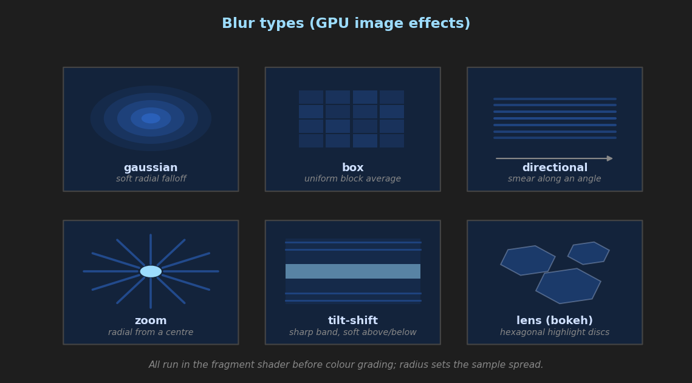

# GPU Image Effects

Hardware-accelerated image processing effects for CasparCG layers. All effects run in the GLSL fragment shader at zero CPU cost. Blur and sharpening operate on raw texture samples before color grading; film grain is applied last, after output encoding.

For color grading (CDL, LUT, saturation, split tone, etc.), see [COLOR_GRADING.md](COLOR_GRADING.md).

## Table of Contents

1. [Blur](#blur)
2. [Sharpening](#sharpening)
3. [Film Grain](#film-grain)

---

## Blur

Hardware-accelerated OpenGL blurs for creative treatments. The blur modifier manipulates the raw texture samples based on requested types, sizes (radii), and directional vectors natively within the GPU.

## Command Syntax

```amcp
MIXER <channel>-<layer> BLUR <radius> [type] [angle] [center_x] [center_y] [tilt_y] [tilt_h] [duration] [tween]
```
> **Note:** To disable a blur effect entirely, set `radius` to `0`. 

### Parameters:
*   `radius` (Required): The sheer size/intensity of the effect (in pixels).
*   `type` (Optional): String name specifying the algorithm applied (Default is `gaussian`). 
*   `angle` (Optional): Vector orientation driving the blur (used for `directional`, `tilt-shift`). Represented in degrees (Default is `0`). 
*   `center_x`, `center_y` (Optional): The normalized `[0.0, 1.0]` x/y focal point (used for origin tracking in `zoom`, `tilt-shift`, or `lens`). Default is `0.5`, center.
*   `tilt_y` (Optional): Base origin parameter for gradient blurring (used in `tilt-shift`).
*   `tilt_h` (Optional): Base threshold boundary size for gradient boundaries (used in `tilt-shift`).
*   `duration`, `tween` (Optional): Standard animation duration/tween type string. 

## Supported Blur Types



### `gaussian` (Default)
Applies a standard, organic soft Gaussian falloff blur matching physical camera diffusion across a general radius vector. This is perfect for background obscuring and standard out-of-focus simulation.
**Example (Blur layer 10 by 15 pixels softly):**
`MIXER 1-10 BLUR 15 gaussian`

### `box`
A uniform averaging filter across a block of pixels. Computationally cheaper but visually produces slight "squared" or "stepped" artifacts at high thresholds. Useful for blocky/stylized aesthetics.
**Example (High intensity box blur):**
`MIXER 1-10 BLUR 20 box`

### `directional`
Smeared motion blur that drags pixels violently along a defined `angle`, simulating fast movement or whipping pans across the screen. 
**Example (Motion blur dragged across a 45-degree angle):**
`MIXER 1-10 BLUR 30 directional 45`

### `zoom`
Radiates blurring dynamically outwards originating from the given `center_x` / `center_y` position. Creates extreme warp-speed / hyperspace rush effects.
**Example (Warp zoom originating slightly off-center right):**
`MIXER 1-10 BLUR 25 zoom 0 0.8 0.5`

### `tilt-shift`
Re-creates the miniature model effect achievable on physically tilted optics. Leaves a sharp central line while sharply blurring top and bottom planes based on rotation (`angle`), positioning (`tilt_y`), and band width (`tilt_h`).
**Example (Tilt-shift with a thin sharp band angled slightly across the screen):**
`MIXER 1-10 BLUR 15 tilt-shift 15 0.5 0.5 0.5 0.1`

### `lens` (Bokeh)
A high-quality rendering simulation of optical bokeh using pentagon/hexagon sampling rotations. Bright highlights generally pop and expand into rounded overlapping rings simulating heavy depth-of-field separation.
**Example (Simulate a heavy cinematic background depth-of-field):**
`MIXER 1-10 BLUR 18 lens`

---

## Sharpening

3×3 Laplacian-based unsharp mask applied directly after texture sampling, before any color grading. Works on all layer types including 360° projections and curved screen compensated content — the kernel samples the correct post-warp UV coordinates.

### Command Syntax

```amcp
MIXER <channel>-<layer> SHARPEN <amount> [radius] [duration] [tween]
MIXER <channel>-<layer> SHARPEN                    # Query current values
```

### Parameters

| Parameter | Type | Default | Description |
| :--- | :--- | :--- | :--- |
| `amount` | float | `0.0` | Sharpening strength. `0.0` = off, `0.5` = subtle, `1.0` = standard, `>1.0` = aggressive. |
| `radius` | float | `1.0` | Kernel radius multiplier — controls how far (in pixels) the surrounding samples are taken from. Higher values sharpen coarser detail. |
| `duration` | int | `0` | Tween duration in frames. |
| `tween` | string | `linear` | Tween curve type. |

> **Tip:** To disable sharpening, set `amount` to `0`.

### How It Works

The shader samples the 8 surrounding pixels (3×3 Laplacian kernel) at a distance controlled by `radius`, computes the difference between the centre pixel and the weighted average, and adds it back scaled by `amount`. This enhances edges and fine detail without affecting flat areas.

### Examples

```amcp
# Subtle sharpening for soft source material
MIXER 1-10 SHARPEN 0.5

# Aggressive sharpening with wider radius
MIXER 1-10 SHARPEN 1.5 2.0

# Animated sharpen reveal over 25 frames
MIXER 1-10 SHARPEN 1.0 1.0 25 EASEINOUTQUAD

# Disable
MIXER 1-10 SHARPEN 0
```

### Pipeline Position

Sharpening runs **after** texture fetch and **before** color grading. This means:
- Sharpening operates on the original pixel data, not on graded colors.
- Color grading artifacts (banding, LUT quantization) are not amplified by the sharpening pass.
- The kernel correctly follows 360° projection and curved screen UV warping.

---

## Film Grain

Procedural photographic grain emulation applied in display-referred space (after OETF encoding). Uses a hash-based noise function with a photographic response curve — grain is most visible in midtones and fades in deep shadows and bright highlights, matching the behavior of real film stock. The noise pattern animates every frame automatically.

### Command Syntax

```amcp
MIXER <channel>-<layer> GRAIN <intensity> [size] [duration] [tween]
MIXER <channel>-<layer> GRAIN                      # Query current values
```

### Parameters

| Parameter | Type | Default | Description |
| :--- | :--- | :--- | :--- |
| `intensity` | float | `0.0` | Grain visibility. `0.0` = off, `0.03`–`0.05` = subtle (35mm), `0.10`–`0.15` = heavy (16mm/Super 8). |
| `size` | float | `1.0` | Grain particle size multiplier. `1.0` = pixel-level noise, `2.0` = coarser granules. |
| `duration` | int | `0` | Tween duration in frames. |
| `tween` | string | `linear` | Tween curve type. |

> **Tip:** To disable grain, set `intensity` to `0`.

### How It Works

Each pixel is combined with a procedural noise value derived from a fast hash function seeded by the pixel's screen-space position and the current frame number. The noise is then modulated by a **photographic response** curve based on luminance:

$$\text{response} = 4 \cdot L \cdot (1 - L)$$

This peaks at midtone luminance ($L = 0.5$) and falls off to zero in pure black and pure white — matching how silver halide film grain is most visible in mid-exposure areas.

### Examples

```amcp
# Subtle 35mm film grain
MIXER 1-10 GRAIN 0.04

# Heavy 16mm grain with larger particles
MIXER 1-10 GRAIN 0.12 2.0

# Fade grain in over 2 seconds (50 frames)
MIXER 1-10 GRAIN 0.08 1.0 50 LINEAR

# Disable
MIXER 1-10 GRAIN 0
```

### Pipeline Position

Film grain is the **very last** operation in the shader, applied after:
- All color grading (CDL, LUT, saturation, curves, levels, etc.)
- Tone mapping and output OETF encoding
- Opacity, blend modes, and chroma keying

This ensures the grain has the correct display-referred photographic response and is never altered by upstream color processing.
