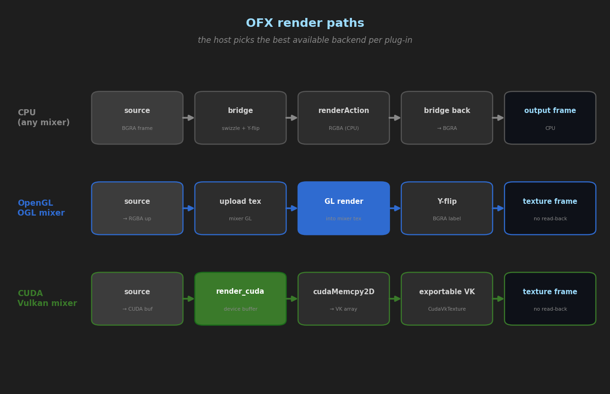
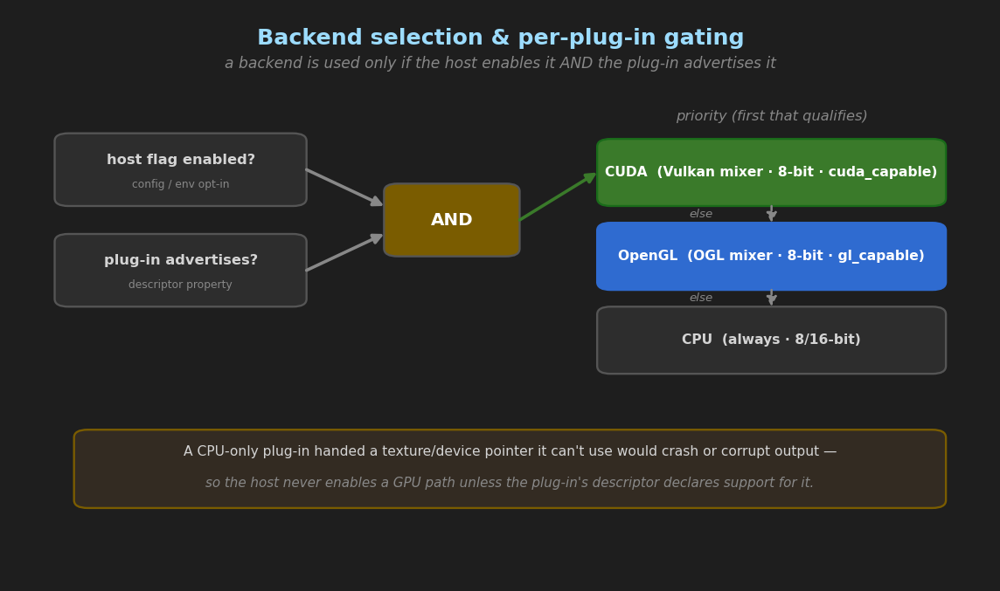

# CasparCG OpenFX (OFX) Host — Implementation & Current State

> Module: `src/modules/ofx` · Branch: `CasparVPV` · Status: **Production-ready core, verified**
> Companion document: [OPENFX_USER_AND_PLUGIN_GUIDE.md](OPENFX_USER_AND_PLUGIN_GUIDE.md)

This document describes *how* the OFX host is built and *what state it is in*. For how to **use** it or
**author plugins**, read the companion guide.

---

## 1. Overview

The `ofx` module embeds a fully in-process [OpenFX](https://openfx.readthedocs.io/) image-effect **host**
inside CasparCG. It discovers `.ofx` plug-in bundles on disk and exposes them as CasparCG producers, so a
plug-in can filter a source, generate frames, blend a transition, and be controlled live over AMCP.

Key properties:

- **In-process** (locked design decision) — no out-of-process host; stability is provided by a crash guard,
  a hung-render watchdog, and a per-plug-in blocklist.
- **Three render backends** — CPU, OpenGL, and CUDA — chosen per plug-in by capability negotiation
  (**CUDA > OpenGL > CPU**).
- **Zero-copy GPU wherever possible** (locked design decision):
  - **OpenGL** plug-ins render directly into a mixer-owned GL texture on the OGL mixer (no readback).
  - **CUDA** plug-ins render into a device buffer that is copied device-to-device into an exportable
    Vulkan texture on the Vulkan mixer (no CPU readback).
- **Correctness over cheapness** for premultiplication, bit depth (8/16/float), and colour channel order.

---

## 2. Component map

All paths are under `src/modules/ofx/` unless noted.

![OFX host component map: the [OFX] producer, the in-process host (plug-in cache, effect/clip/param instances, stability layer), and the CPU/OpenGL/CUDA render backends](images/ofx_components.png)

| File | Responsibility |
|------|----------------|
| `ofx.cpp` / `ofx.h` | Module entry (`ofx::init`). Reads the `<ofx>` config block, scans plug-ins, registers the `OFX Producer` factory. |
| `host/ofx_host.{h,cpp}` | `class host` (scan + `create_effect`) and `class effect` (render, params, health). Contains the private `caspar_ofx_host` (derives `OFX::Host::ImageEffect::Host`). |
| `host/ofx_effect_instance.{h,cpp}` | `ofx_effect_instance : OFX::Host::ImageEffect::Instance`. Owns the per-render `render_context`; overrides `renderAction` to drive CPU/OpenGL/CUDA. |
| `host/ofx_clip_instance.{h,cpp}` | `ofx_clip_instance` / `ofx_image` / `ofx_texture`. Maps clip names (`Source`, `SourceFrom`, `SourceTo`, `Output`) to the current frame's buffers/textures/device pointers. |
| `host/ofx_param_instance.{h,cpp}` | Concrete parameter instances (int, double, bool, choice, rgb(a), 2D, pushbutton, **string**, group, page). |
| `host/ofx_gl_render.{h,cpp}` | Self-contained offscreen OpenGL backend (SFML **compatibility** context + GLEW). Fallback for legacy GL plug-ins and the Vulkan mixer. |
| `host/ofx_cuda_render.{h,cpp}` | CUDA host-copy backend (cudaMalloc/cudaMemcpy). Runtime API only, no nvcc. |
| `host/ofx_includes.h` | Order-sensitive, warning-wrapped OFX + HostSupport includes. |
| `bridge/ofx_image_bridge.{h,cpp}` | Pixel bridging: BGRA↔RGBA, 8/16-bit, float, vertical flip, premultiply. |
| `producer/ofx_producer.{h,cpp}` | `ofx_producer : core::frame_producer` + `create_producer`. Wraps source(s), bridges pixels, drives the render backends, exposes the AMCP `CALL OFX …` control protocol. |
| `test/coregl_orientation_test.cpp` | Core-profile GL test plug-in (`caspar.test:CoreGLOrientation`). |
| `test/transition_mix_test.cpp` | CPU transition test plug-in (`caspar.test:TransitionMix`). |
| `test/cuda_fill_test.cpp` | CUDA test plug-in (`caspar.test:CudaFill`). |

**External / build**: `src/CMakeModules/Bootstrap_Windows.cmake` and `Bootstrap_Linux.cmake` fetch
OpenFX 1.5.1 + libexpat and build the `openfx_host` static library (`OFX_SUPPORTS_OPENGLRENDER` +
`OFX_SUPPORTS_MULTITHREAD`), plus the optional sample/test plug-ins under `BUILD_OFX_SAMPLE_PLUGINS`.

---

## 3. Frame & data flow



### 3.1 Filter (CPU)
```
source producer → const_frame (BGRA/RGBA, 8/16-bit)
   → bridge to bottom-up RGBA at the negotiated working depth (+ premultiply straight-alpha)
   → effect.render()  →  plugin CPU render
   → bridge back to BGRA/RGBA top-down  →  mixer
```

### 3.2 Filter (OpenGL, zero-copy — OGL mixer)
```
downcast frame_factory → ogl::image_mixer → get_ogl_device()
   → device.dispatch_sync on the GL thread:
        upload source → GL texture; bind output texture to an FBO; set viewport;
        plugin renders (core-profile GL) into the output texture;
        GPU Y-flip (glBlitNamedFramebuffer, DSA) → final texture
   → texture-backed const_frame (pixel_format::bgra)  →  mixer consumes directly (NO readback)
```
Legacy **fixed-function** GL plug-ins are auto-detected (they raise `GL_INVALID_OPERATION` in the mixer's
**core** context) and transparently fall back to the self-contained **compatibility** GL backend + readback.

### 3.3 Filter (CUDA, zero-copy — Vulkan mixer)
```
downcast frame_factory → vulkan::image_mixer → get_vk_device()
   → create/acquire an exportable VK texture, imported into CUDA (CudaVkTexture)
   → effect.render_cuda(): upload source → device; plugin renders into a device buffer (NO readback)
   → cudaMemcpy2DToArray device-to-device into the VK texture
   → texture-backed const_frame  →  mixer consumes the VkImage directly (NO CPU roundtrip)
```

### 3.4 Generator
No source; the plug-in renders into a fresh output frame (CPU or GL).

### 3.5 Transition
Two sources (`SourceFrom` / `SourceTo`) are bridged; a **Transition** parameter is ramped `0→1` over a
frame count and set on the plug-in each frame; the plug-in blends. (CPU path.)

---

## 4. Contexts, backends & negotiation



| Context | Trigger | Clips |
|---|---|---|
| Filter | `PLAY [OFX] <id> <source…>` | `Source`, `Output` |
| Generator | `PLAY [OFX] <id>` (no source) | `Output` |
| General | plug-in declares only General | `Source`, `Output` (treated like Filter) |
| Transition | `PLAY [OFX] <id> TRANSITION <from> <to> [frames]` | `SourceFrom`, `SourceTo`, `Output` |

`create_effect` selects the OFX context from the plug-in's declared contexts (Filter → General fallback,
Generator → General fallback, Transition explicit).

Render-backend negotiation happens in `ofx_effect_instance::renderAction`: **CUDA → OpenGL → CPU**, gated by
(a) host enable flags (config/env) and (b) the plug-in's advertised capability. A backend that is not viable
falls through to the next.

---

## 5. Parameters & control

Supported parameter types: integer, double, boolean, choice, RGB, RGBA, double2D, integer2D, pushbutton,
**string**, group, page. Values initialise from `kOfxParamPropDefault`.

Control is via AMCP `CALL <ch-layer> OFX …`:
- `LIST` — parameters with metadata: `<name> <type> "<label>" dim=<n> [min= max= def=] [choices="a","b"]`
  (unbounded limits shown as `*`; display ranges preferred over hard limits).
- `SET <name> <v…>` — numeric/bool/choice.
- `SETSTR <name> <text…>` — string.
- `KEY <name> <frame> <v…> [tween]` / `CLEARKEYS <name>` — per-parameter keyframe animation (decoupled from
  the mixer keyframe engine; interpolated with CasparCG tweeners).

---

## 6. Stability layer (in-process)

- **Crash guard** — every render/create is wrapped in a `try/catch` compiled with `/EHa`, so a plug-in
  hardware fault is caught rather than crashing the server; the frame is dropped and the source passes
  through. Spawned multithread workers are individually guarded (`run_ofx_worker`).
- **Hung-render watchdog** — a render exceeding **2000 ms** (`kRenderBudgetMs`) records a *strike*.
- **Blocklist** — **3 strikes** (`kMaxStrikes`) for crashes/timeouts blocklists a plug-in id; it is no longer
  instantiated (producer passes the source through). Config can pre-blocklist ids.
- **Multithread suite** — the host implements a real parallel `OfxMultiThreadSuite` (up to 8 workers) with
  per-worker crash guards and `std::recursive_mutex`-backed OFX mutexes.

---

## 7. Persistence & startup

- **Plug-in cache** — `scan()` reads/writes `casparcg_ofx_cache.xml` (working dir) so unchanged bundles are
  not re-described on every boot. A corrupt cache is ignored (full rescan).

---

## 8. Build

- CMake + Ninja. `openfx_host` (BSD HostSupport) + libexpat are fetched and built statically.
- Definitions that **must match** across `openfx_host` and the `ofx` module: `OFX_SUPPORTS_OPENGLRENDER`,
  `OFX_SUPPORTS_MULTITHREAD` (they align the class vtables across the two static libs).
- `CASPAR_OFX_ENABLED` gates all OFX code in the module.
- `CASPAR_OFX_CUDA` (when CUDAToolkit is found) enables the CUDA backend.
- `CASPAR_OFX_VULKAN_CUDA` (when CUDA **and** `ENABLE_VULKAN`) enables CUDA↔Vulkan zero-copy interop
  (links `Vulkan::Headers`, reuses the header-only `src/modules/cuda_vk_texture.h`).
- `BUILD_OFX_SAMPLE_PLUGINS` (default OFF) builds the Invert/Basic/OpenGL samples and the CasparCG test
  plug-ins into `build/ofx-plugins/<Name>.ofx.bundle/`.

> **Windows toolchain note:** the module is currently built with the pinned MSVC 14.50 BuildTools via
> `build/ofx_build.bat <target>` (CUDA 12.9 nvcc is incompatible with the 14.51 STL). See
> `BUILDING_WORKFLOW.md`.

---

## 9. Current state — what is implemented & verified

Every item below was built and validated at runtime; the CPU golden test (`gain 0.5` on gray 128 →
`(128,128,128,127)`) stayed stable throughout as a regression sentinel.

| Area | State | Evidence |
|---|---|---|
| CPU filter (audio, time, isIdentity, premult, 8/16/float) | ✅ | golden-pixel test |
| RGBA **and** BGRA sources (8-bit) | ✅ | orientation/transition tests |
| OpenGL zero-copy (core-profile plug-ins, OGL mixer) | ✅ | `CoreGLTest`: green-top/red-bottom, no readback |
| Orientation + channel order (GPU) | ✅ | matches CPU reference exactly |
| Legacy fixed-function GL auto-fallback (compat + readback) | ✅ | `OpenGLSamplePlugin` renders correctly on OGL mixer |
| CUDA render path (host-copy) | ✅ | `CudaFill`: alpha=64 proves device write + readback |
| **CUDA↔Vulkan zero-copy** (Vulkan mixer) | ✅ | `CudaFill`: alpha=64 via device-to-device, no readback |
| Generator context | ✅ | runtime |
| General context | ✅ | General-only `CoreGLTest` instantiates + renders |
| Transition context | ✅ | `TransitionMix`: red→blue `(161,0,94)` linear blend |
| Parameters incl. string + AMCP metadata | ✅ | `CALL OFX LIST` + `SET`/`SETSTR` |
| Keyframe animation (per-param) | ✅ | runtime |
| Stability: crash guard + watchdog + blocklist | ✅ | design + runtime |
| Real parallel multithread suite | ✅ | `CoreGLTest`: `numCPUs=8 workersRan=8` |
| Persistent plug-in cache | ✅ | boot1 "created" / boot2 "loaded" |
| Config `<ofx>` block + env overrides | ✅ | runtime |
| Client-side param module (`ofx_params.py`) | ✅ | headless unit test |
| Linux bootstrap block | ⚠️ implemented, **untested on Windows** | mirrors verified Windows block |

---

## 10. Known limitations & next steps

- **CUDA zero-copy — non-uniform correctness unverified.** `CudaFill` writes a *uniform* value, so it
  cannot validate orientation (source is uploaded bottom-up with **no Y-flip** on the CUDA path) or colour
  channel order (the output texture is labelled `bgra`). A **CUDA kernel** test plug-in (nvcc) with a
  spatial/channel-dependent transform is needed to confirm and, if required, add a Y-flip and channel fix.
- **Multi-GPU CUDA↔Vulkan.** The CUDA path does not call `cudaSetDevice` to match the Vulkan mixer's GPU;
  on a multi-GPU host where the CUDA default device differs from the VK device the interop may fail
  (it currently falls back to passing the source through).
- **Transition parameter provisioning.** The host *sets* the `Transition` parameter; a real transition
  plug-in that expects the host to *inject* the parameter without defining it would not receive the value.
  Transitions are CPU-only (no zero-copy GL/CUDA transition).
- **Linux** OFX build is untested; the `ofx` module also hard-codes `sfml-window`/`sfml-system` target
  names (SFML 2), which may need `SFML::Window`/`SFML::System` for SFML 3.
- **Parameter breadth.** Custom, parametric, and 3D parameter types are not yet implemented.
- **16-bit / float on the GPU zero-copy paths.** Zero-copy GL/CUDA currently engage for 8-bit only;
  higher depths use the CPU path.

---

## 11. Test plug-ins & harnesses

| Plug-in (id) | Purpose | Harness |
|---|---|---|
| `caspar.test:CoreGLOrientation` (`CoreGLTest`) | core-profile GL, known top/bottom pattern; multithread probe | `build/ofx_gl_orient_test.ps1` |
| `caspar.test:TransitionMix` (`TransitionTest`) | CPU transition blend | `build/ofx_transition_test.ps1` |
| `caspar.test:CudaFill` (`CudaTest`) | CUDA device-buffer fill | inline CUDA test |
| `uk.co.thefoundry.BasicGainPlugin` | CPU gain (golden reference) | `build/ofx_golden_test.ps1` |
| `com.genarts:OpenGLSamplePlugin` | legacy fixed-function GL | `build/ofx_gl_test.ps1` |

All harnesses launch the server with `OFX_PLUGIN_PATH=build/ofx-plugins`, drive AMCP on TCP 5250, and snapshot
via `ADD <ch> IMAGE <name>` into `build/shell/media/`.
