# CasparCG 360° Client — Operations Guide

A practical, task-oriented manual for the CasparCG 360° / Virtual Production
control client. It covers day-to-day playout as well as the advanced xR
toolset: the global **3D Stage / previz**, **camera tracking**, **projection
calibration**, **LED calibration**, and the **advanced colour pipeline**.

> Looking for the deep projection workflow? The full camera-vision calibration
> reference lives in [docs/PROJECTION_CALIBRATION.md](PROJECTION_CALIBRATION.md).
> This guide summarises it and points you there for the detail.

---

## Contents

1. [Concepts & terminology](#1-concepts--terminology)
2. [Getting started](#2-getting-started)
3. [Window layout & navigation](#3-window-layout--navigation)
4. [The channel workspace](#4-the-channel-workspace)
5. [Advanced colour pipeline](#5-advanced-colour-pipeline)
6. [Geometry, compositing & effects](#6-geometry-compositing--effects)
7. [Keyframe animation](#7-keyframe-animation)
8. [Presets & macros](#8-presets--macros)
9. [Annotations & lighting overlays](#9-annotations--lighting-overlays)
10. [The Global 3D Stage (previz)](#10-the-global-3d-stage-previz) — *advanced*
11. [Camera tracking & world alignment](#11-camera-tracking--world-alignment) — *advanced*
12. [Projection calibration](#12-projection-calibration) — *advanced*
13. [LED calibration](#13-led-calibration) — *advanced*
14. [Rundown / playout](#14-rundown--playout)
15. [Config editor](#15-config-editor)
16. [Sessions & persistence](#16-sessions--persistence)
17. [AMCP & OSC reference](#17-amcp--osc-reference)
18. [Troubleshooting](#18-troubleshooting)

---

## 1. Concepts & terminology

| Term | Meaning |
| :--- | :--- |
| **Channel** | A CasparCG output (1-based). Most commands target a channel, e.g. `MIXER 1 ...`. |
| **Layer** | A compositing slot within a channel (e.g. layer 10). Mixer/grade commands target `<channel>-<layer>`. |
| **AMCP** | The TCP control protocol. Every panel ultimately sends an AMCP command string. |
| **OSC** | UDP telemetry *from* the server — frame position, timecode, clip names. Drives the timelines and tally. |
| **Previz** | The client-side 3D render of your stage, optionally mirrored by a **server-side previz render pass** on a chosen channel. |
| **ICVFX** | In-Camera VFX: the inner camera frustum is rendered onto the LED wall so a tracked camera sees correct perspective. |
| **xR** | Extended reality — the combined LED-wall + tracked-camera + set-extension workflow. |

The app is a **control surface**: it does not process video itself (except for
local scopes/histograms grabbed from the embedded preview). It builds AMCP
commands and sends them to a CasparVP server, and listens to OSC for playback
state.

---

## 2. Getting started

### Launch & connect

1. Start the client. It auto-connects using the host/port from your last
   session.
2. To connect manually, use the **connection bar** at the top: enter **Host**
   and **Port**, then press **Connect**. The status bar reports the result.
3. The **OSC listener** widget (next to the connection controls) shows the
   listen port, a traffic dot that blinks on incoming packets, and a packet
   counter. If your timelines and timecode are not moving, this is the first
   place to check.

### First-run checklist

- **Server reachable?** Connection bar shows *Connected*.
- **OSC flowing?** The traffic dot blinks during playback. If not, confirm the
  server's OSC consumer points at this machine and the port matches.
- **Right channel/layer?** Each channel tab shows its target as `CH n · L10` —
  set the **CH** / **LAY** spinboxes before sending commands.

---

## 3. Window layout & navigation

The main window is a single tabbed workspace. Top-level tabs, in order:

| Tab | Purpose |
| :--- | :--- |
| **CH 1 … CH 5** | Five full per-channel workspaces (playout, mixer, grade, effects). |
| **▶ Rundown** | Multi-channel cue list / playout. |
| **🎬 Virtual Production** | Server-wide xR tools, grouped as sub-tabs (below). |
| **⚙ Config** | Visual editor for the server's `casparcg.config`. |

**Virtual Production** sub-tabs:

| Sub-tab | Purpose |
| :--- | :--- |
| **▣ Projection** | Camera-vision projector calibration (corner-pin → warp → multi-projector). |
| **🎨 LED Calibration** | Per-wall colour LUT matching (OpenVPCal). |
| **🏗 Stage** | The single global 3D previz scene and its server render channel. |

> **Performance note:** CH 1 builds immediately on launch; CH 2–5 build lazily
> the first time you open them, so startup stays fast.

Other always-available controls live in the connection bar: the **OSC status**
widget and a **Diagnostics viewport** toggle (a floating embedded preview useful
for monitoring an arbitrary channel).

### Window map

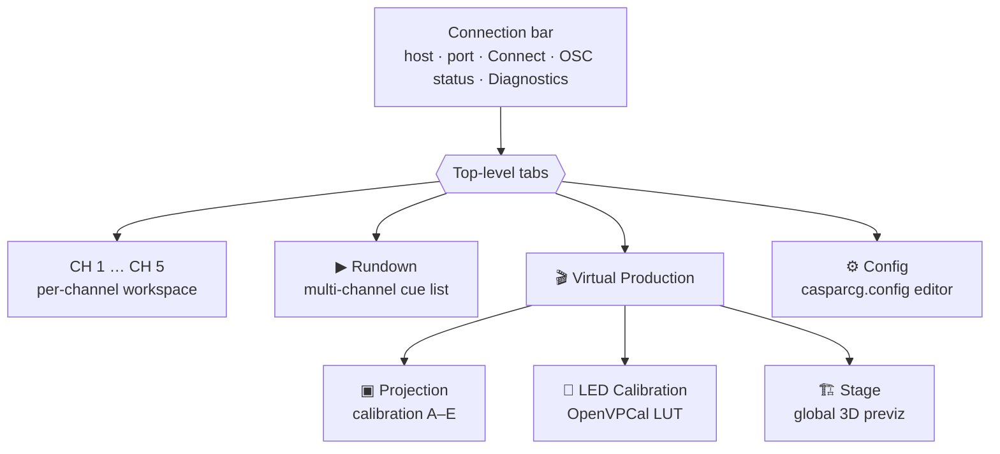

> **Rule of thumb:** anything that targets *one layer's pixels* (grade, geometry,
> effects) lives in a **channel tab**; anything **server-wide** (the stage scene,
> projector geometry, wall colour) lives under **Virtual Production**.

---

## 4. The channel workspace

Each channel tab is a vertical workspace split into a viewport/transport column
on the left and a stack of tool panels on the right.

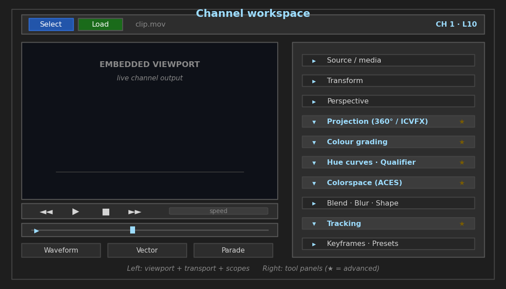


### Media & transport

- **File bar** — Select / Load a media file; the filename is shown alongside.
- **Source panel** — choose what the layer plays: a **File**, a live **Channel /
  layer**, **DeckLink**, **NDI**, **Spout**, or a **stream URL**. File metadata
  (format, codec, resolution, fps, duration, colour space, HDR format) is shown
  for the current clip.
- **Transport** — Play / Pause / Stop / FF / RW plus a speed control.
- **Playhead timeline** — scrub bar with frame position and duration, in/out
  marks, and live OSC frame sync. The **timeline control bar** adds zoom and
  go-to-frame.

### Embedded viewport

The left pane shows the **live channel output** by embedding the server's native
screen-consumer window (Win32). It is the actual signal being produced, and it
feeds the local scopes and histogram.

### Scopes

Three toggle buttons open floating analysis overlays fed by a background frame
grabber:

- **Waveform** — luminance vs. horizontal position.
- **Vectorscope** — chroma distribution (detect colour casts).
- **Parade** — R/G/B as three waveforms (detect channel imbalance).

Overlays reposition with the active tab and hide when the tab is not in front.

---

## 5. Advanced colour pipeline

The colour tools form a layered grade, each sending its own `MIXER <ch>-<layer>
…` command. Use them in roughly this order: primary grade → secondary
qualifier/hue curves → colour-management (ACES) → creative LUT.

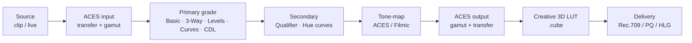

> **Why order matters:** key/qualify **before** tone-mapping so your selection
> works in a predictable space, and apply the creative LUT **last** so the look
> sits on top of a correctly managed image rather than fighting it.

### Colour grading panel

These are the same primary-grade controls you will recognise from any grading
system — wheels, curves and CDL — wired to AMCP. The concepts are universal:

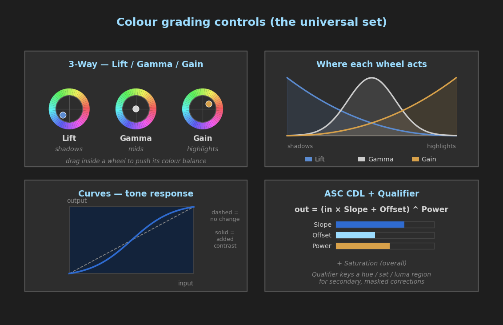

Collapsible sections, top to bottom:

| Section | Use it for |
| :--- | :--- |
| **Basic** | Brightness, contrast, saturation (with wheels). |
| **3-Way** | Lift / Gamma / Gain colour balance for shadows / mids / highlights. |
| **Levels** | Per-channel input/output levels and gamma, with a live histogram. |
| **Curves** | Free-form tone curves (master or per channel). |
| **ASC CDL** | Broadcast-standard Slope / Offset / Power + Saturation. |
| **Split Toning** | Separate shadow and highlight tints. |
| **Linear Saturation** | HSL saturation that preserves perceived brightness. |
| **3D LUT** | Load a `.cube` creative look. |

### Hue curves

Four hue/sat-keyed curve editors for surgical secondary work:
**Hue→Hue**, **Hue→Saturation**, **Hue→Luminance**, **Saturation→Saturation**.
Typical use: pull a specific hue's saturation down without touching the rest of
the frame.

### Qualifier (secondary correction)

Key a region by **target hue + hue width**, **saturation min/max**, **luminance
min/max** and **softness**, then apply **exposure / saturation / hue** offsets to
*only that selection*. Enable **Live** to preview the key while you drag.

### Colour management (ACES)

The **Colorspace** panel runs an ACES-style transform: pick **input transfer /
input gamut → tone-mapping → output gamut / output transfer**, with optional
**gamut compression** (cyan/magenta/yellow limits). Use this to bring footage
into a common working space and map HDR to your delivery (e.g. PQ/HLG vs.
Rec.709).

### Worked example — matching a log clip to Rec.709 broadcast

> A camera-original clip is flat (log) and slightly green; you need a clean
> Rec.709 deliverable with the talent's red jacket kept in gamut.

1. **Colorspace** — set input transfer to the camera's log curve and input gamut
   to its colour space; tone-mapping **ACES**; output **Rec.709 / Rec.709**. The
   image instantly looks "normal" instead of washed out.
2. **Basic / Levels** — set black and white points against the **Levels**
   histogram so shadows touch 0 and highlights sit just below clip.
3. **3-Way** — nudge **Gamma** away from green to neutralise the cast; confirm on
   the **Vectorscope** (the cloud should centre, skin tones along the I-line).
4. **Qualifier** — key the **red jacket** (target hue ≈ red, tighten hue width,
   add softness) and pull **saturation** down a touch so it stops clipping.
5. **Gamut compression** (Colorspace) — enable it to fold the remaining
   out-of-gamut reds back inside Rec.709 instead of hard-clipping.
6. **3D LUT** — optionally drop a show LUT on top for the house look.

> **Best practices**
> - **Manage first, grade second.** Get the Colorspace transform right before you
>   touch the wheels — grading in the wrong space fights you at every step.
> - **Trust the scopes, not the monitor.** Use Vectorscope for casts, Parade for
>   channel balance, Waveform/Levels for exposure. Monitors lie; scopes don't.
> - **Key in, grade out.** Build a qualifier selection while looking at the *key*
>   (Live preview), then switch to the image to dial the correction.
> - **Coalescing is your friend.** Dragging a slider only sends the final value,
>   so scrub freely — you won't flood the server.
> - **Keep the LUT last.** A creative `.cube` belongs on top of a managed image,
>   not as a substitute for one.

---

## 6. Geometry, compositing & effects

### Transform

**FILL** (offset + scale, with a draggable rectangle), **ANCHOR** (pivot),
**ROTATION**, and **CROP** (with an interactive corner canvas). A format lookup
fills the working resolution from the channel's video format.

### Perspective (corner-pin / keystone)

Four draggable corners (UL/UR/LR/LL) for manual keystone correction, with a
reset-to-identity button. Sends `MIXER <ch>-<layer> PERSPECTIVE …`. For an
*automatic* corner-pin from a camera, use the Projection calibration tab
(section 12).

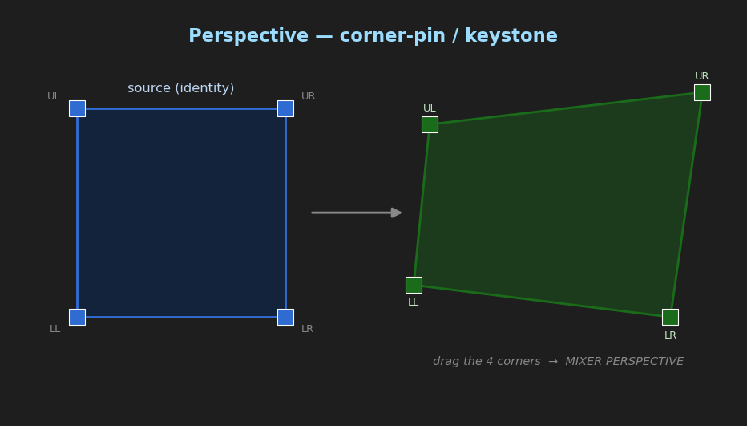

### Projection (360° / ICVFX)

The per-layer **Projection** panel drives the spherical / xR projection:

- **Camera** — yaw, pitch, roll, **FOV**, and nodal **offset X/Y**, shown over an
  equirectangular map with a live frustum rectangle.
- **ICVFX / advanced** — inner-frustum **width/height**, lens **distortion**
  (k1/k2/k3) and **prism** (p1/p2) terms, **cylindrical** screen arc + curvature,
  and **edge-blend** margins + gamma.

This panel is what a bound camera tracker drives in real time (section 11).

### Blend, blur, shape

- **Blend** — a full set of photoshop-style blend modes.
- **Blur / Sharpen / Grain** — Gaussian / box / directional / zoom / tilt-shift /
  lens blur with the relevant angle/centre/band controls; plus sharpen and film
  grain.
- **Shape** — GPU 2D vector shapes (rect / rounded-rect / circle / ellipse) with
  solid or linear/radial/conic gradient fills, stroke, and transform — handy for
  mattes and quick graphic elements.

---

## 7. Keyframe animation

The **keyframe engine** records snapshots of mixer state at frame positions and
interpolates between them as the clip plays (synced via OSC).

1. **Arm** the panels whose changes you want captured (geometry, colour,
   projection, etc.).
2. Move the playhead, set values, and **add a keyframe**.
3. Repeat at later frames; choose an **interpolation / easing** per keyframe.
4. On playback the engine drives the armed parameters between keyframes.

Keyframes are visualised on the keyframe timeline; you can add, delete, label and
re-time them.

The **interpolation** chosen on each key controls how a value travels into it.
The common eases and a *hold* (step) are shown below; pick per key:

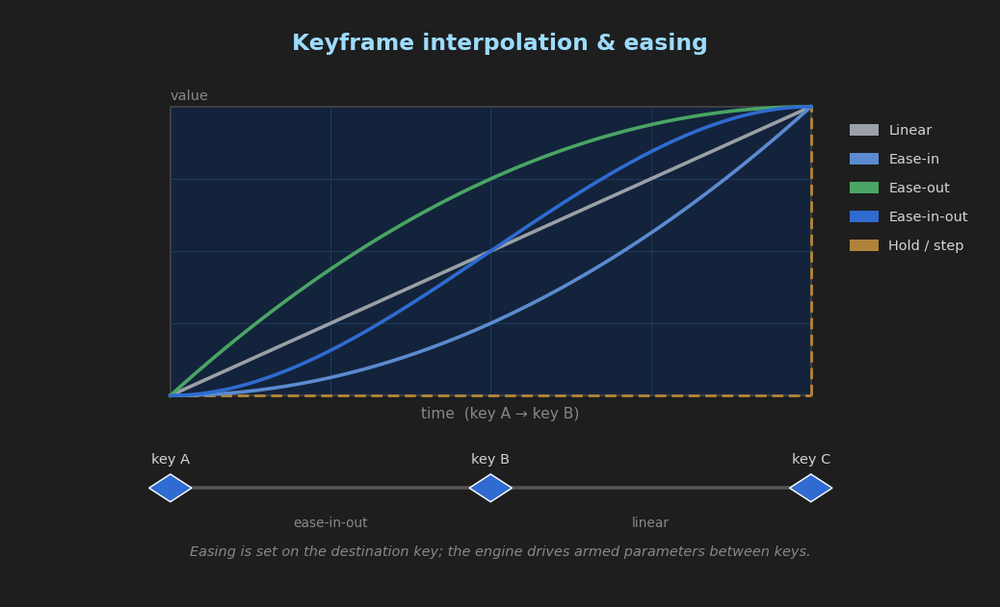

### Worked example — a 1-second push-in with an ease

> Animate a layer scaling from full-frame to a 110% punch-in over 25 frames,
> easing into the hold.

1. **Arm** the **Transform** panel (so FILL changes are captured).
2. Go to **frame 0**. Set FILL scale to `1.0` and **add keyframe** → key A.
3. Go to **frame 25**. Set scale to `1.10` and **add keyframe** → key B.
4. Set key B's interpolation to **ease-in-out**.
5. Play from 0: the layer pushes in and settles. Re-time by dragging key B; the
   easing follows.

> **Best practices**
> - **Arm only what you animate.** An armed panel captures *everything* it owns at
>   each keyframe — leave colour disarmed if you only want a move, or a later grade
>   tweak gets baked into an earlier key.
> - **Key the extremes first, then the middle.** Set the start/end poses, scrub to
>   check the interpolation, and only add intermediate keys where the motion needs
>   shaping.
> - **Easing lives on the destination key.** The curve into a key is set on that
>   key, so adjust the *arrival* key to change how a move settles.
> - **Mind the frame rate.** Keyframe positions are frames, so 1 second = the
>   channel's fps (25 / 30 / 50 / 60). Confirm fps in the source panel.

---

## 8. Presets & macros

The **Presets** panel provides three snapshot types:

| Type | Captures | Use for |
| :--- | :--- | :--- |
| **Snapshot** | Full layer state (reset-then-apply). | A complete look you can recall exactly. |
| **Preset** | Only the fields you mask in. | Recall *part* of a look (e.g. just the grade). |
| **Macro** | An ordered list of preset recalls + raw AMCP, with per-step delays. | Sequenced automation / show cues. |

Presets are organised into groups with search and drag-reorder, and persist
per channel.

---

## 9. Annotations & lighting overlays

- **Annotations** — a drawing overlay on the viewport (pen, rectangle, circle,
  line, arrow, text, eraser) with colour/opacity/width. Strokes can be **bound to
  a frame range** so notes appear only during the relevant part of a clip, and the
  set can be imported/exported as JSON.
- **Lighting** — DMX fixture control over **ArtNet** or **sACN**. Define a
  universe/host/port and a fixture list (type, DMX start, channel count,
  position, size, rotation). Fixtures appear as draggable regions on the
  viewport for live repositioning.

---

## 10. The Global 3D Stage (previz)

> **Advanced.** This is the heart of the virtual-production workflow.

The Stage lives under **🎬 Virtual Production → 🏗 Stage** and edits **one global
3D scene** shared by the whole show. You build a 3D model of your physical
volume — LED walls, screens, set pieces, reference figures, and the previz
camera — and optionally mirror it as a **server-side render** on a chosen
channel.

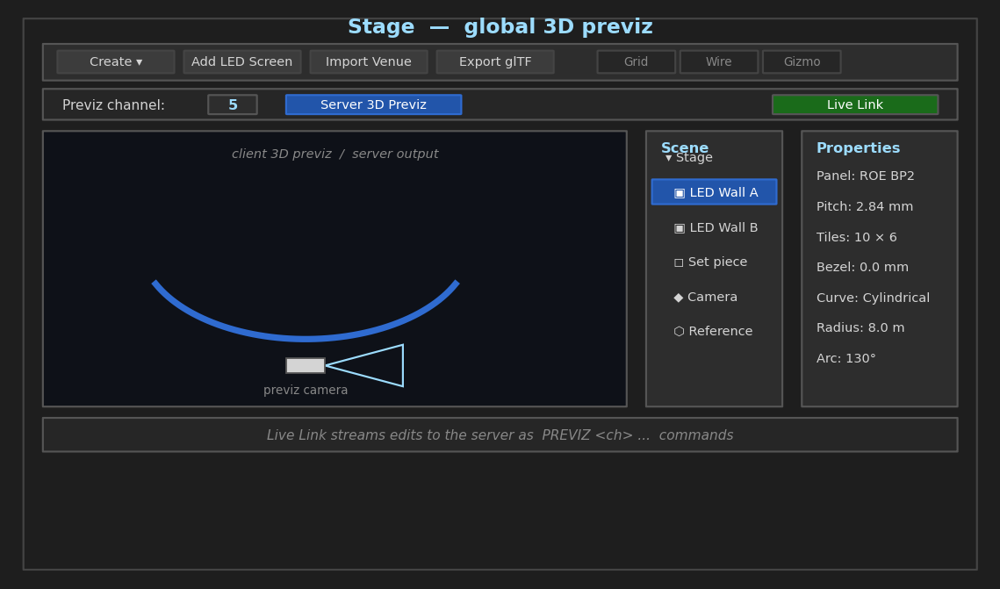

### How the scene reaches the wall

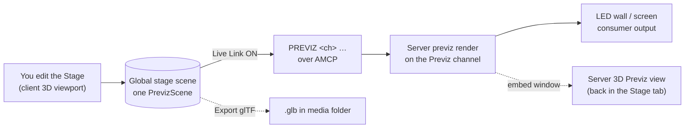

### Anatomy of the Stage tab

- **Main viewport** — the editing view, switchable between two modes:
  - **Client 3D previz** (default) — the local OpenGL render you orbit and edit.
  - **Server 3D Previz** (toggle button) — embeds the *server's* actual previz
    output for the selected channel, so you compare client model vs. live render
    side by side.
- **Previz channel** selector — the CasparCG channel that runs the server-side
  previz render pass (**default channel 5**). Every `PREVIZ …` command this tab
  sends targets this channel; changing it re-points everything, including the
  embedded server view.
- **Scene tree** (left) — the node hierarchy with visibility toggles.
- **Properties** (right) — transform and type-specific properties for the
  selected node.
- **Virtual camera widget** — a small wireframe camera that mirrors the scene
  camera and can be dragged to reorient it.

### Node types

| Type | What it is |
| :--- | :--- |
| **Screen** | An LED wall / screen built from panels (see below). |
| **Venue** | An imported set/venue model (`.glb` / `.obj` / `.usdz`). |
| **Reference** | A reference object (figure, tripod, camera) for scale. |
| **Primitive** | A procedural cube / sphere / cylinder / plane / cone. |
| **Camera** | The previz virtual camera. |
| **Group** | A folder for organising nodes. |

### Building an LED wall

1. Add a **Screen** (Create ▾ menu / LED screen builder).
2. In Properties, pick a panel from the **LED panel database** (manufacturer
   presets with pixel pitch and tile geometry) or set values manually:
   **pixel pitch**, **tile size** (mm/px), **tiling grid** (H×V tiles), and
   **bezel gap**.
3. Choose **curvature**: *Flat* or *Cylindrical* (with **radius** and **arc
   angle**). The computed real-world size is shown, and the mesh regenerates
   automatically.

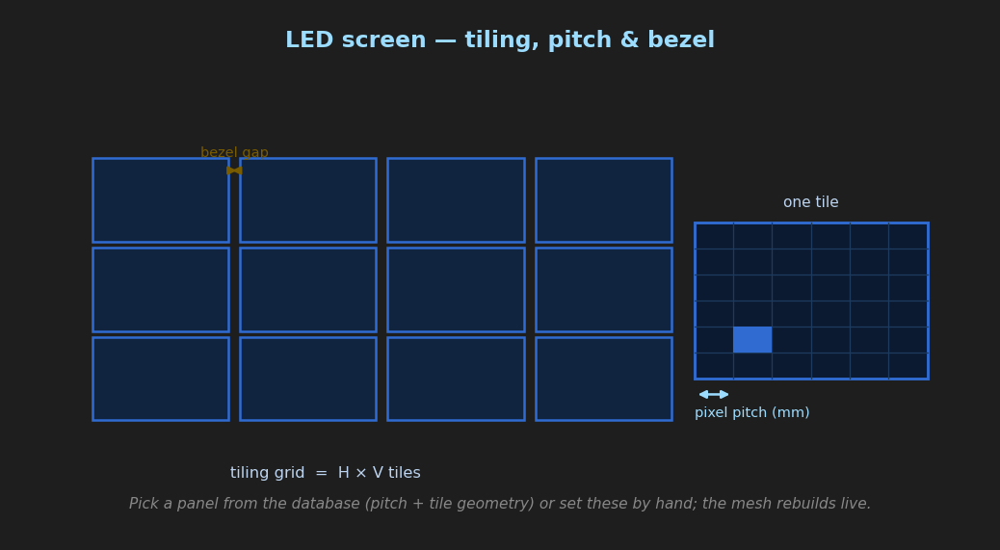

> **Get the real-world scale right.** Pixel pitch × pixel count = physical size.
> If a wall looks wrong next to a 1.8 m reference figure, your pitch or tile count
> is off — fix it here, because everything downstream (camera framing, ICVFX
> frustum) inherits this geometry.

### Editing the scene

- **Viewport navigation** — LMB orbit, RMB roll, middle-drag pan, Shift+LMB
  vertical translate, scroll to zoom.
- **Tree actions** — delete, duplicate (Ctrl+D), lock/unlock, reset transform,
  group, and **focus** (F) to frame a node.
- Selected nodes are highlighted; the camera frustum is drawn live.

### Live Link (push to server)

Enable **🔗 Live Link** to stream your edits to the server in real time. While
on, the tab pushes `PREVIZ <channel> …` commands as you work:

| Command | When it fires |
| :--- | :--- |
| `PREVIZ <ch> CAMERA …` | Camera moves (orbit / virtual-camera widget). |
| `PREVIZ <ch> VIEW …` | Navigation view sync. |
| `PREVIZ <ch> SCREEN …` | A screen's geometry / parameters change. |
| `PREVIZ <ch> SHOW …` | A node's visibility changes. |
| `PREVIZ <ch> GRID / WIREFRAME / GIZMO <0\|1>` | Display toggles in the toolbar. |

Turning Live Link **off** sends `PREVIZ <ch> VIEW CLEAR` to drop the server-side
nav view. The whole scene also exports to glTF (`.glb`) for upload to the server
media folder.

> **Server-view tip:** when you switch the main viewport to **Server 3D Previz**,
> the tab embeds the previz channel's screen-consumer window and retries the
> attach every couple of seconds until the consumer appears. If it stays blank,
> confirm the server is actually rendering previz on that channel.

### ICVFX — the inner frustum

In-Camera VFX renders the **inner frustum** (the camera's exact field of view)
with correct perspective on the wall, while the area outside it acts as **set
extension** and ambient lighting. The Stage scene supplies the wall geometry and
the camera; a bound tracker (section 11) keeps the inner frustum locked to the
real lens.

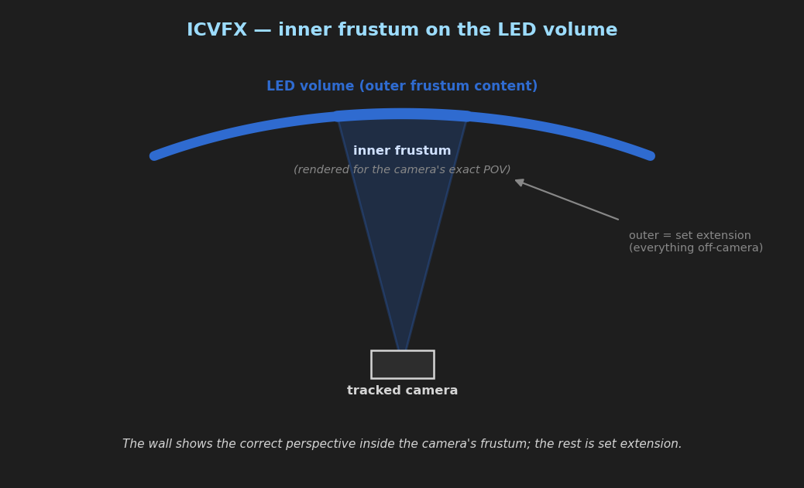

### Case study — virtual set for a curved LED volume

> A studio has a 10 m × 3 m curved LED wall and one tracked camera. You need a
> driving-plate environment that looks correct through the lens.

1. **Model the wall.** Add a **Screen**, pick the installed panel from the
   database, set the **tiling grid** to the real tile count, and set **curvature
   = Cylindrical** with the measured **radius** and **arc**. Check it against a
   **Reference** figure for scale.
2. **Place the camera.** Position the **Camera** node where the real camera
   stands; rough in height and lens FOV.
3. **Pick the Previz channel.** Set it to the channel that carries the server
   previz render (default **5**), then enable **Server 3D Previz** to watch the
   real output next to your model.
4. **Go live.** Enable **🔗 Live Link** so every screen/camera tweak streams to
   the server as `PREVIZ 5 …`.
5. **Bind tracking.** In the camera's channel **Tracking** panel, bind the
   tracker and run **world alignment** so the inner frustum tracks the lens
   (section 11).
6. **Lock geometry.** Calibrate any projectors / blends in the **Projection** tab
   (section 12). Once happy, **lock** finished nodes in the tree so a stray drag
   can't move a wall mid-shoot.

> **Best practices**
> - **One scene, one source of truth.** The stage is global — build it once and
>   every channel references the same geometry. Don't duplicate walls per channel.
> - **Model in real metres.** Survey the volume and enter true dimensions; ICVFX
>   perspective is only as right as the geometry.
> - **Client view to build, server view to trust.** Lay things out fast in the
>   client 3D view, but verify the *look* on **Server 3D Previz** before calling it.
> - **Toggle Live Link off for big rebuilds.** Streaming every intermediate edit
>   during a major re-layout is noisy; switch it on once the scene settles.
> - **Lock and name nodes.** Locked, clearly-named nodes survive long shoot days
>   and make the tree readable under pressure.
> - **Export a `.glb` checkpoint.** Before risky changes, Export glTF as a restore
>   point (it also seeds the server media folder).

---

## 11. Camera tracking & world alignment

> **Advanced.** Connects an external camera tracker to a layer so the projection
> follows a real camera.

The **Tracking** panel (per channel) binds a tracker (e.g. Stype / Mo-Sys / a
custom UDP or OSC source) and feeds the live **Projection** panel.

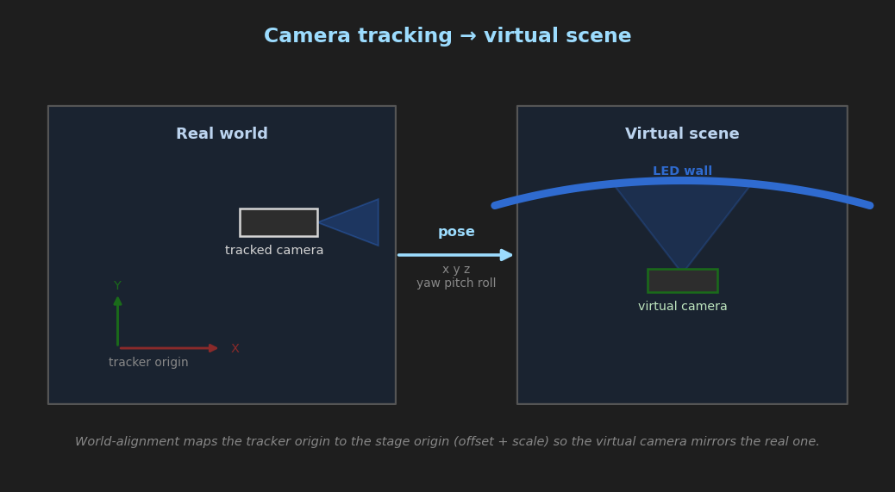

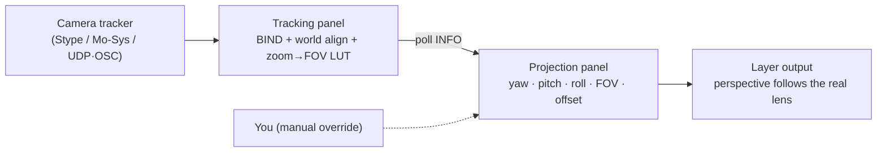

Sections, top to bottom:

1. **Bind / Unbind** — attach or detach the tracker source; status shows the
   bound name and last update.
2. **World alignment** — survey reference points on the stage to compute the
   world→camera alignment so virtual and physical space agree.
3. **Zoom → FOV LUT** — record paired *zoom value → FOV* points and build a LUT
   so lens zoom drives the virtual FOV live.
4. **Tuning** — delay (to match the tracker latency), nodal offset, depth-of-field
   and lens parameters for realism.
5. **Diagnostics** — `INFO` (current pan/tilt/roll, position, zoom, scales and
   offsets), `LIST` (available trackers) and `ZERO` (reset offsets to the current
   pose).

The panel polls the tracker periodically and updates the Projection panel's
yaw/pitch/roll/FOV/offsets; you can manually override any value to take back
control.

Representative commands: `TRACKING <ch>-<layer> BIND …`, `… UNBIND`,
`… OFFSET …`, `… SCALE …`, `… ZERO`, `… INFO`, and `TRACKING LIST`.

### Case study — locking a tracked camera to the volume

> A jib-mounted tracked camera needs its virtual perspective to match the LED
> volume so the inner frustum stays glued through a move.

1. **Bind** the tracker on the camera's channel; confirm the status shows a
   recent *last update* and `LIST` sees the source.
2. **World alignment** — survey three or more known stage points (wall corners,
   floor marks). This sets the world→camera relationship so virtual space matches
   physical space.
3. **Zoom → FOV LUT** — at a few zoom positions, record the *zoom value → matching
   FOV* and **build the LUT**. Now the lens zoom drives the virtual FOV live.
4. **ZERO** at a known home pose so pan/tilt offsets read sensibly.
5. **Tuning** — increase **delay** until the rendered move lines up with the
   physical camera; set the **nodal** offset so parallax pivots at the lens, not
   the tracker body.
6. Watch the **Projection** panel update live; nudge any value to fine-tune, and
   confirm against **Server 3D Previz** in the Stage tab.

> **Best practices**
> - **Align before you tune.** World alignment is the foundation — delay, nodal
>   and FOV tuning only make sense once virtual and physical space agree.
> - **Latency-match, don't guess.** Whip-pan the camera and raise **delay** until
>   the wall content stops lagging or leading the move.
> - **Nodal offset kills parallax error.** If foreground/background slide against
>   each other on a move, the pivot is wrong — correct the nodal offset.
> - **ZERO at a repeatable home.** Re-zero after re-rigging so offsets stay
>   meaningful across setups.
> - **Manual override is a safety net, not a workflow.** Override a value to nurse
>   a shot, but fix the alignment/LUT for a lasting result.

---

## 12. Projection calibration

> **Advanced.** Camera-vision geometry solve for projection-mapped surfaces.
> Full reference: [docs/PROJECTION_CALIBRATION.md](PROJECTION_CALIBRATION.md).

Under **🎬 Virtual Production → ▣ Projection**, the workflow is organised into
progressive phases. A camera films the projected surface; the client solves a
correction and pushes it over AMCP.

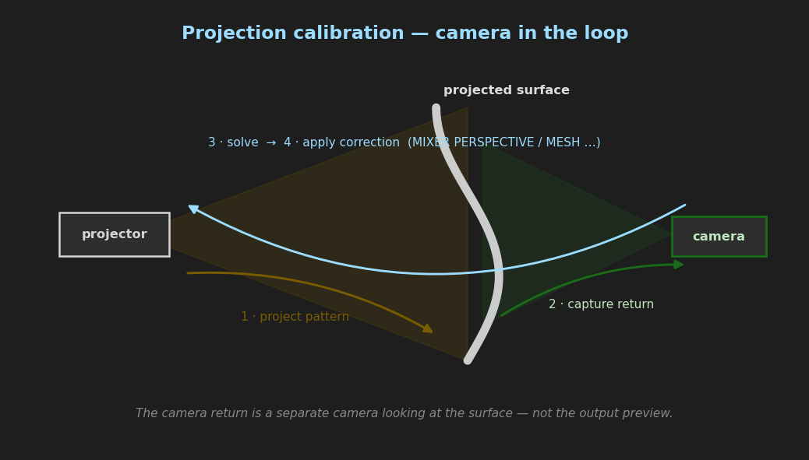

| Phase | Goal | Result applied as |
| :--- | :--- | :--- |
| **A — Corner-Pin** | Automatic keystone from a checkerboard / ArUco board. | `MIXER PERSPECTIVE` |
| **B — Distortion & Blend** | Lens distortion solve + multi-projector edge blend. | `MIXER PROJECTION_DISTORTION`, `PROJECTION_BLEND` |
| **C — Diagnostics** | Uniformity / focus / contrast readouts and **grid-straightness validation**. | analysis only |
| **D — Dense Warp** | Gray-code structured light → per-vertex warp mesh. | `MIXER MESH` (`.glb`) |
| **E — Multi-projector** | World-UV alignment of several projectors, optional **per-pixel blend masks** and **bundle adjustment**. | aligned `.glb` + `PROJECTION_BLEND_MASK` |

**Camera return** can come from an image folder/file, a live **UVC** camera, or
the server's **SDI (DeckLink)** input — the latter enables a fully automated
Gray-code scan. See the dedicated document for the step-by-step of each phase,
the auto blend-gamma fit, distortion validation, and the multi-projector
registration strategies.

### Case study — two projectors onto a curved cyclorama

> Two overlapping projectors must cover one curved cyc as a single seamless
> image.

1. **Per projector, Phase A** — project a checkerboard / ArUco board, capture the
   camera return, **solve corner-pin** and apply. Each projector is now roughly
   rectified.
2. **Phase B distortion** — capture several checkerboard views per projector and
   solve **lens distortion** so straight lines land straight.
3. **Phase D dense warp** — run the **Gray-code** scan per projector (use the SDI
   closed-loop scan if a DeckLink return is wired) to build a per-vertex warp
   `.glb` that follows the curve a 4-corner pin can't.
4. **Phase E alignment** — align both projectors into a shared **world-UV** frame;
   enable **bundle adjustment** if they're filmed from different viewpoints so the
   overlap agrees.
5. **Blend the seam** — for the irregular curved overlap use **per-pixel blend
   masks** (`PROJECTION_BLEND_MASK`) rather than straight bands, and set the blend
   **gamma** from a measured ramp, not the 2.2 default.
6. **Validate** — Phase C **grid-straightness**: project a checkerboard through the
   corrected layer and confirm RMS deviation drops sharply.

> **Best practices**
> - **Stabilise the camera.** It must not move between project and capture — a
>   nudged tripod invalidates the solve.
> - **Reset to identity before each solve.** Re-run **Generate + Play** so the
>   homography is measured against undistorted content.
> - **Expose for detection.** Keep the whole pattern in frame, in focus, and avoid
>   blown highlights — clipped whites wreck corner detection.
> - **More views = stabler distortion.** Add several checkerboard positions before
>   solving lens distortion.
> - **Measure gamma, don't guess it.** Use the auto blend-gamma fit so the
>   cross-fade is perceptually linear for *your* projector.
> - **Validate before and after.** Phase C turns "looks fine" into a number — run
>   it to prove the correction actually improved straightness.
> - **Install `opencv-contrib-python`.** ArUco patterns and live UVC capture need
>   it.

---

## 13. LED calibration

> **Advanced.** Per-wall colour matching with **OpenVPCal**.

Under **🎬 Virtual Production → 🎨 LED Calibration**, generate a colour-patch
sequence, play it to the wall, photograph the return, and solve a 3D `.cube`
LUT that corrects the wall's colour and uniformity.

Typical flow:

1. **Setup** — target channel, the OpenVPCal binary path, and a working folder.
2. **Wall parameters** — target gamut and EOTF, peak luminance (nits), camera
   gamut, capture resolution, and options (EOTF correction, gamut compression,
   avoid clipping).
3. **Generate patches → play → capture plate → solve LUT**.
4. **Apply** the LUT to the channel; use **BYPASS** to A/B it and **CLEAR** to
   remove it. `CALIBRATION <ch> INFO` reports the current state.

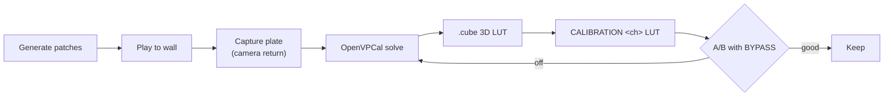

### Worked example — matching two walls to one look

> A floor and a back wall use the same panels but read slightly different on
> camera; you need them to match a Rec.709 / 1000-nit target.

1. **Setup** per wall — point at the OpenVPCal binary and a per-wall working
   folder; set the target **channel**.
2. **Wall parameters** — target gamut **Rec.709**, EOTF to taste, **peak
   luminance 1000 nits**, and the **camera gamut** of the stills camera you're
   measuring with. Enable **EOTF correction** and **avoid clipping**.
3. **Generate → play → capture** the patch sequence on the **back wall**; let the
   panels warm up first so brightness is stable.
4. **Solve** and **Apply** the `.cube`. Use **BYPASS** to A/B raw vs. corrected.
5. Repeat for the **floor** with the *same* target parameters so both walls land
   on one reference.
6. Verify with a shared neutral/skin reference shown on both walls in camera.

> **Best practices**
> - **Warm up the wall.** LEDs drift until thermally stable — calibrate after a
>   warmup, not from cold.
> - **Same camera, same settings.** Lock the measuring camera's exposure, white
>   balance and gamut across walls; an auto setting ruins comparability.
> - **One target for all walls.** Matching is only meaningful when every wall
>   solves to the *same* gamut / EOTF / nits.
> - **A/B with BYPASS, decide in camera.** Judge the corrected vs. raw wall
>   through the production camera, not by eye on the panel.
> - **Re-check after rig changes.** New processors, brightness or a panel swap can
>   shift colour — re-measure.

---

## 14. Rundown / playout

The **▶ Rundown** tab is a multi-channel cue list. Build an ordered list of
clips (drag to reorder, or drop files from the OS) and fire them with
transitions and per-clip settings.

Per-clip properties include name, file path, target **channel/layer**, **loop
mode**, **load mode** (play / load / queue / auto-background), **transition**
(type, tween, duration), **mark in/out**, **audio level**, and optional **FFmpeg
filters**. A monitor viewport and per-layer timers show what is on air, with
colour-coded tally states (loaded / playing / paused / background).

Playout uses `LOADBG` + `PLAY` with transition and `MIXER AUDIO_LEVEL` commands
as configured. Rundowns save/load as JSON and are included in the session.

---

## 15. Config editor

The **⚙ Config** tab is a visual editor for the server's `casparcg.config`. Load
the file, edit channels (video mode, consumers, producers) and global settings,
review the live **XML preview**, and **Save**. **Apply & Restart** issues a
server `RESTART` (which reloads the config and drops the connection).

Supported consumers include Screen, DeckLink, NDI, FFmpeg/file, SystemAudio,
ArtNet, sACN, Bluefish and CUDA-ProRes; producers include DeckLink, SystemAudio,
Bluefish and FFmpeg.

> The config editor is a large, self-contained tool; treat **Apply & Restart**
> as a disruptive action — it restarts the server.

---

## 16. Sessions & persistence

- The app **auto-saves** to `session_autosave.json` (including on close) and
  restores it on launch: connection, channel/layer assignments, window geometry,
  rundown, presets, and the **global Stage scene** (one `stage_scene` plus the
  previz channel).
- Use **File ▸ Save Session… / Load Session…** for named snapshots.
- Several tools keep their own side files (e.g. projection settings in
  `projcal_config.json`, presets per channel). These are git-ignored working
  state.

---

## 17. AMCP & OSC reference

### How commands are sent

Every panel emits a command string that the channel routes to the AMCP client,
which runs on a background thread with heartbeat and auto-reconnect. Rapid mixer
changes (e.g. dragging a slider) are **coalesced** so only the latest value per
sub-command reaches the server.

### Command families you will see

| Family | Examples |
| :--- | :--- |
| Transport | `PLAY`, `PAUSE`, `STOP`, `LOAD`, `LOADBG`, `CALL` |
| Mixer | `MIXER <ch>-<l> FILL/ANCHOR/ROTATION/CROP/BLEND/OPACITY` |
| Grade | `MIXER <ch>-<l> BRIGHTNESS/CONTRAST/SATURATION/LEVELS/CURVES/HUECURVE/QUALIFIER/COLORSPACE` |
| Geometry | `MIXER <ch>-<l> PERSPECTIVE/PROJECTION/PROJECTION_DISTORTION/PROJECTION_BLEND/PROJECTION_BLEND_MASK/MESH` |
| Previz | `PREVIZ <ch> CAMERA/VIEW/SCREEN/SHOW/GRID/WIREFRAME/GIZMO` |
| Tracking | `TRACKING <ch>-<l> BIND/UNBIND/OFFSET/SCALE/ZERO/INFO`, `TRACKING LIST` |
| Calibration | `CALIBRATION <ch> LUT/BYPASS/CLEAR/INFO` |
| System | `INFO`, `RESTART`, `SHUTDOWN` |

### OSC telemetry

The client listens on a UDP port for playback state — current frame, total
frames, fps, clip name and paused flag per `channel/layer`, plus channel frame
rate. This drives the playhead timelines, timecode, keyframe evaluation and
rundown timers. The traffic dot in the OSC widget confirms packets are arriving.

---

## 18. Troubleshooting

| Symptom | Check |
| :--- | :--- |
| Timelines / timecode frozen | OSC traffic dot not blinking → verify the server's OSC consumer host/port and the listener port here. |
| Commands have no effect | Wrong **CH/LAY** target, or AMCP shows *Disconnected* in the connection bar. |
| Embedded viewport is black | The channel has no screen consumer, or the consumer window has not appeared yet. |
| **Server 3D Previz** view stays blank | The server is not rendering previz on the selected **Previz channel** — confirm the channel and that previz is enabled server-side. |
| Live Link does nothing | Live Link toggle is off, or AMCP is disconnected. |
| Projection solve fails | Pattern not fully in frame / out of focus / clipped highlights; re-run **Generate + Play** to reset to identity before solving (see the projection doc). |
| Scopes / histogram empty | They read the embedded preview — if the viewport is black they have no input. |
| OpenCV-dependent steps disabled | Install `opencv-contrib-python` (ArUco + live UVC). |

---

*For the complete projection-calibration workflow — patterns, multi-projector
alignment, blend masks, bundle adjustment and the SDI closed-loop scan — see*
*[docs/PROJECTION_CALIBRATION.md](PROJECTION_CALIBRATION.md).*

---

## Appendix — regenerating the diagrams

The UI mockups and geometry sketches in this guide are rendered from a small
matplotlib script (themed to the app palette). Flowcharts are inline Mermaid and
need no build step. To re-render the PNGs after a layout change:

```bash
python docs/diagrams/generate_diagrams.py   # writes docs/images/*.png
```

Requires `matplotlib` and `numpy` (already used by the app). Edit
[docs/diagrams/generate_diagrams.py](diagrams/generate_diagrams.py) to adjust a
figure, then re-run and commit the updated images.
