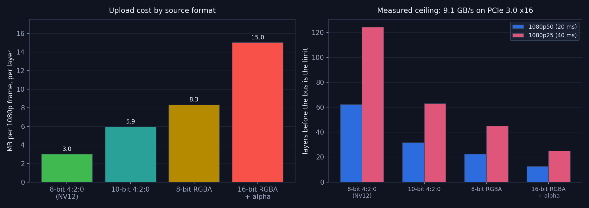
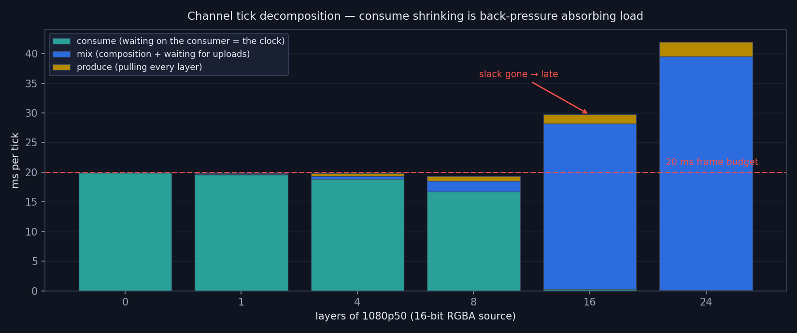
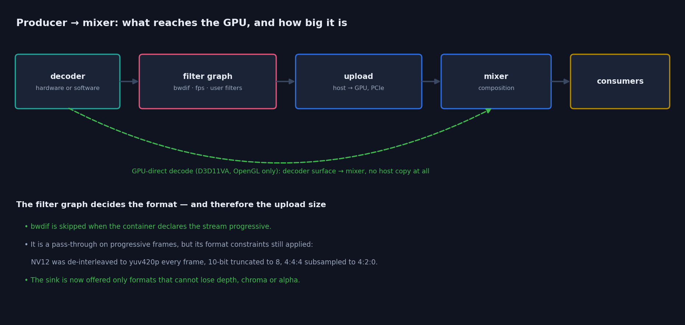
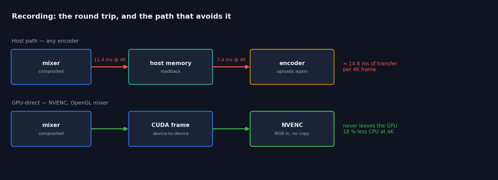
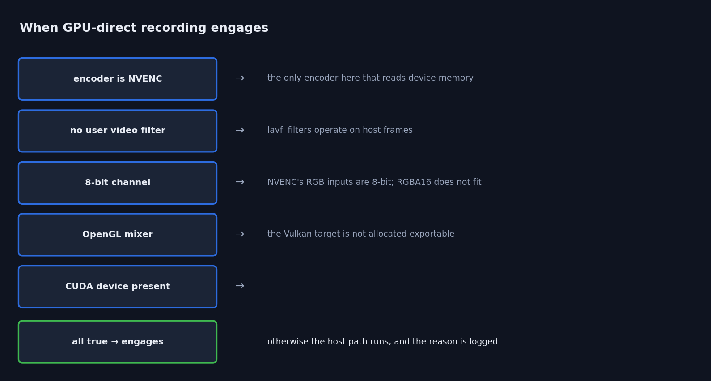

# Pipeline Efficiency — Operations Guide

> How to get the efficient paths, how to tell whether you are on them, and what
> limits a channel. Practical companion to `GPU_OPTIMIZATION_PLAN.md`, which
> carries the reasoning, the measurements and the rejected ideas.

Every figure and number here is measured on the reference rig (Quadro P4000 +
RTX A4000, PCIe 3.0 x16). Re-measure before trusting them elsewhere — the
harnesses are in `CasparCG-TestRunner/vkdispatch/`.

---

## 1. The one thing to know

**Host→GPU upload bandwidth is what limits how many layers a channel can carry.**
Not composition, not layer pulling, not the mixer's threading. Everything else
measured under 10 % of a frame even on a channel running at half rate.



Bytes per frame per layer decide the ceiling, and they are a property of the
**source file**, not of the server:

| source | MB per 1080p frame | layers at 1080p50 | at 1080p25 |
|---|---|---|---|
| 8-bit 4:2:0 (H.264/HEVC, NV12) | 3.0 | ~60 | ~120 |
| 10-bit 4:2:0 | 5.9 | ~30 | ~60 |
| 8-bit RGBA | 8.3 | ~22 | ~44 |
| 16-bit RGBA + alpha (NotchLC, ProRes 4444) | 15.0 | ~12 | ~24 |

Measured plateau **9.1 GB/s**, about three quarters of the practical throughput
of a PCIe 3.0 x16 link.

**Practical consequences**

- Prefer 8-bit 4:2:0 for anything that does not need more. It is 5× cheaper than
  16-bit RGBA and the difference is the whole layer budget.
- Ten-bit and 4:4:4 content costs twice its 8-bit equivalent — since the fix in
  §3 it is no longer being silently truncated, which is correct but is a real
  change to headroom if you run many such layers.
- Do not benchmark with lossless RGBA (NotchLC, ProRes 4444, `bars.mov`). It
  costs five times ordinary material and will mislead you about capacity.

---

## 2. What the channel does each tick



Four phases, all published under `tick` in `INFO <channel>`:

| phase | what it is |
|---|---|
| `produce` | pulling every layer from its producer |
| `mix` | composition, LUT passes, **and waiting for the frame's uploads** |
| `consume` | handing the frame to every consumer |
| `osc` | publishing state to OSC subscribers |

### Read `consume` as the clock, not as cost

A large `consume` is **healthy** — it is the consumer pacing the channel. Watch
it shrink as `mix` grows: that is back-pressure absorbing load, and the tick
stays exactly at nominal while it can. In the figure, `consume` falls 19.9 → 16.7
ms as layers are added and the channel holds 20.00 ms throughout.

**`consume` approaching zero is the warning sign.** The slack is spent, and the
next increment of `mix` makes the channel late.

---

## 3. Getting the efficient producer path



Most of this is automatic now. What is worth knowing:

**Progressive files skip the deinterlacer.** When the container explicitly
declares `field_order=progressive`, `bwdif` is left out of the graph. It was only
ever a pass-through on progressive frames, but its format constraints applied to
everything — measured **~18 % of total server CPU** on twelve layers of
hardware-decoded H.264.

- Containers that say `unknown` keep the deinterlacer. That is deliberate and
  conservative; check with
  `ffprobe -show_entries stream=field_order` if a file seems more expensive than
  its neighbours.
- If a container lies and delivers interlaced frames, the deinterlacer is
  restored at the next filter rebuild and the reason is logged.
- `auto-deinterlace=all` disables the optimisation by design — it means you want
  every frame deinterlaced.

**The mixer now receives each source's native format.** Nothing is silently
converted to fit a filter's preferences. In particular 10-bit stays 10-bit and
4:4:4 stays 4:4:4, where both used to be reduced to 8-bit 4:2:0 before the mixer
ever saw them.

**GPU-direct decode** (the dashed path) bypasses host memory entirely for
hardware-decoded H.264/HEVC. Opt in with
`configuration.ffmpeg.producer.gpu-direct-decode`. OpenGL mixer only, progressive
only, and it declines with a logged reason for anything it cannot handle
(High 10 and 4:4:4 are not hardware-decodable here, so they fall back).

### 10-bit decoding

Works, and both paths now agree. Per codec, measured:

| source | hardware decode | GPU-direct | reaches the mixer as |
|---|---|---|---|
| HEVC Main 10 | **yes** (NVDEC) | **yes** — no host copy at all | 10-bit |
| H.264 High 10 | no — NVDEC cannot | stands down to software, logged | `yuv420p10le` |
| ProRes 422 HQ, v210, DNxHR | software | n/a | native 10-bit |

Both 10-bit paths measure **39.63 dB** against an external reference decode —
the same as every other 4:2:0 clip, where the residual is chroma upsampling
differing between GPU sampling and swscale.

**Hardware and software now agree to 75.0 dB.** They used to differ by ~46 dB,
because the software path ran through a filter graph that truncated it to 8-bit
while GPU-direct handed the mixer the true 10-bit planes. That was recorded in
the gpudirect harness as a known quirk; it is fixed, and a difference there now
means a real regression.

Nothing needs configuring for this. 10-bit content that can be hardware-decoded
is, 10-bit content that cannot falls back and keeps its depth either way.

### Verifying

One log line per producer, at the first frame:

```
[ffmpeg] decoded frames arrive as nv12 -> mixer pixel_format 15 (2 plane(s), 1 stride)
```

That is the authoritative answer to "what is this clip actually costing me".
Multiply the format's bytes-per-pixel by the frame size and check it against §1.

---

## 4. Getting the efficient recording path



By default a recording makes a **round trip**: the channel reads the composited
frame back to host memory, and the encoder uploads the same pixels again. At 4K
that is about 14.8 ms of transfer per frame.

GPU-direct recording removes both legs. It engages automatically:



```
ADD 1 FILE out.mp4 -vcodec h264_nvenc -b:v 60M
```

Measured **5.8 % less server CPU at 1080p and 15–18 % at 4K**, and the recorded
picture is **pixel-identical** to the host path (`inf` dB, same encoder).

**To stay on it, avoid:** a `-filter:v`, an explicit `-pix_fmt`, a 16-bit
channel, or a Vulkan mixer. Any of those silently and correctly falls back — and
says so:

```
[ffmpeg] GPU-direct recording active: the composited texture goes straight to NVENC, with no readback.
[ffmpeg] GPU-direct recording not used: a video filter was supplied.
```

Confirm the readback really stopped:

```
output[1] No consumer needs CPU readback (1 consumers); mixer readback skipped.
```

### 10-bit recording — and what the 8-bit gate actually means

**NVENC is not limited to 8-bit, and neither is recording here.** The gate above
says "8-bit channel" because of how *this* fast path works, not because of the
hardware. Measured on the reference rig:

| encoder | 10-bit? |
|---|---|
| `h264_nvenc` | **no** — H.264 NVENC is 8-bit only in hardware. Fed 10-bit it reports *"No capable devices found"* |
| `hevc_nvenc` | **yes** — Main 10, verified producing `yuv420p10le` |
| `av1_nvenc` | not on Pascal or Ampere; fails at 8-bit too, so this is the GPU generation, not the depth |

To record 10-bit, ask for it:

```
ADD 1 FILE out.mp4 -vcodec hevc_nvenc -pix_fmt p010le
```

That works from an 8-bit **or** a 16-bit channel, and it takes the host path by
design — an explicit pixel format is a request the GPU path cannot honour,
because its frames are CUDA/RGB0 and lavfi cannot reformat device frames.

So the trade is explicit: **GPU-direct gives you 8-bit output with less CPU;
`-pix_fmt p010le` gives you 10-bit through the host path.** You choose per
recording, and the log says which you got.

Why the fast path is 8-bit: it copies the mixer's `GL_RGBA8` texture
byte-for-byte into an `AV_PIX_FMT_RGB0` frame, which is what makes it kernel-free.
A 16-bit channel's texture is RGBA16, and NVENC accepts no packed 16-bit RGB
format that matches it byte-for-byte (`x2rgb10le` is 10 bits in 32; `gbrp16le`
and `yuv444p16le` are planar). Supporting it means a conversion kernel — exactly
what the current design avoids.

### Recording with alpha

GPU-direct is NVENC-only and NVENC carries no alpha. **Keyed and fill/key
recordings must use the host path** — `qtrle`, ProRes 4444 — which is what
happens automatically. Verified end to end: a transparent channel recorded to
`qtrle` keeps `a=0`, on both mixers.

### Encoder defaults worth knowing

- Software H.264/HEVC records **8-bit 4:2:0** by default. It used to negotiate
  4:4:4, which most players and every hardware decoder refuse.
- An explicit `-pix_fmt` always wins.
- Alpha-capable codecs are untouched by that preference and negotiate as before.

---

## 5. Telemetry reference

Everything below is published state, readable over AMCP — no debugger, no build
flags.

### `INFO <channel>` → `tick`

| key | meaning |
|---|---|
| `produce/mix/consume/osc .avg_ms`, `.peak_ms`, `.percent` | per-phase cost and share of the frame |
| `unaccounted.avg_ms` | what the four phases do not explain |
| `nominal_ms` | the frame budget |

### `INFO <channel>` → `receive`

| key | meaning |
|---|---|
| `tick_avg_us`, `tick_peak_us` | time pulling all layers |
| `budget_percent`, `peak_budget_percent` | as a share of the frame |
| `slowest_layer`, `slowest_producer` | **names the culprit** if a producer blocks |

### `INFO <channel>` → `timing`

| key | meaning |
|---|---|
| `period_avg_ms` vs `nominal_ms` | is the channel meeting its rate |
| `jitter_ms`, `late_frames`, `drift_ms` | pacing health |
| `consume_load` | share of the budget spent waiting on consumers |
| `clock_sources` | **>1 means two consumers both claim to be the clock** |

### `GL INFO` → `vk.dispatch.*` (Vulkan)

| key | meaning |
|---|---|
| `busy_percent` | wall-clock share the device thread is occupied |
| `cpu_percent` | **actual CPU** consumed by it |
| `wait_avg_us`, `depth_peak` | queueing on the device thread |
| `vk.dispatch_by_kind.*` | split into upload / readback / other |
| `vk.cmd_buffers.reuse_percent` | command-buffer recycling health |

`busy_percent` and `cpu_percent` are both published deliberately. They diverged
by 8× under load — the thread looked 78 % busy while using 9.7 % of a core,
because it was descheduled rather than working. Trust `cpu_percent`.

---

## 6. Diagnosing a channel that is late

In order, because each step rules out the ones after it:

1. **`timing/period_avg_ms` vs `nominal_ms`** — confirm it is actually late.
2. **`tick/*`** — which phase owns the time.
   - `mix` large → almost always upload bandwidth. Check what the producers'
     arrival log lines say and add it up against §1.
   - `produce` large → `receive/slowest_producer` names the layer.
   - `consume` large *and the tick is on time* → healthy back-pressure, not a
     problem.
3. **`consume` near zero** → the channel has no slack left; it is at capacity.
4. **Vulkan and still unexplained** → `GL INFO`, `vk.dispatch.cpu_percent`.

---

## 7. Things to watch out for

**Measurement traps** — each of these produced a confidently wrong answer during
this work:

- **Attach a consumer before measuring anything.** With no consumer the channel
  skips composition *and* readback, and `output.cpp` publishes no timing at all.
  A measurement without one is a measurement of the upload path only.
- **Compare within a run, never across runs.** Absolute server CPU for an
  identical configuration varied 2.4–3.9 cores between sessions on the reference
  rig. Only A/B deltas inside one run are meaningful.
- **Sample twice before believing a peak.** Peaks are cumulative maxima; a
  40–75 ms "stall" that does not grow over a second window was pipeline creation
  at startup.
- **Peaks are worst at the edge of capacity, not past it.** A producer that has
  fallen behind returns empty immediately (cheap); the one that waits is the one
  just barely keeping up.
- **Static sources cannot show combing**, and lossy encoders do not reproduce
  frames — pin a frame with `SEEK` when comparing pixels.
- **Colour strings are `#AARRGGBB`.** `#FF0000FF` is opaque *blue*. A result
  that is exactly the wrong primary is usually this.
- **Reference decodes of metadata-less content disagree with the channel.** The
  channel assumes BT.709 for HD; swscale defaults to BT.601. That is a spurious
  ~10 dB gap, not a regression.

**Real constraints**

- `AV_PIX_FMT_{RGB24,BGR24,ARGB,ABGR}` are deliberately not negotiated. The
  packed-alpha shader cases are wrong (and the two backends disagree with each
  other), and Vulkan cannot sample 3-component 8-bit images at all. Negotiation
  picks a correct equivalent; do not re-enable them without deriving the
  swizzles experimentally.
- GPU-direct **recording** is OpenGL-only. The Vulkan mixer's composition target
  is not allocated with export capability, so CUDA cannot import it. That is a
  mixer allocation change, not a consumer one.
- GPU-direct **recording** is 8-bit output only, by construction. This is not an
  NVENC limitation — `hevc_nvenc` does Main 10 — it is the byte-for-byte copy
  that makes the path kernel-free. Ask for `-pix_fmt p010le` and you get 10-bit
  via the host path.
- GPU-direct **decode** is OpenGL-only and progressive-only.

---

## 8. Regenerating the figures

```
python docs/gen_pipeline_figures.py
```

Writes into `docs/images/pipeline/`. The data is inline in the script and every
value is measured — if you re-measure on different hardware, update it there so
the guide and the numbers cannot drift apart.
