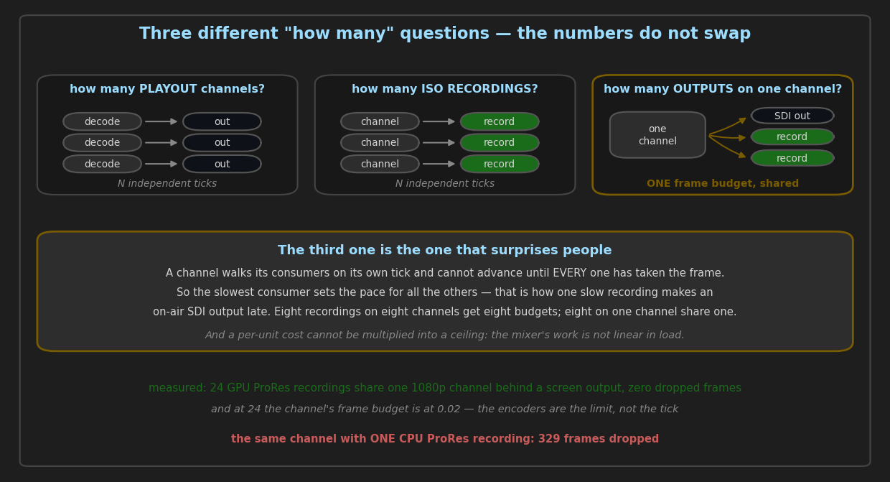
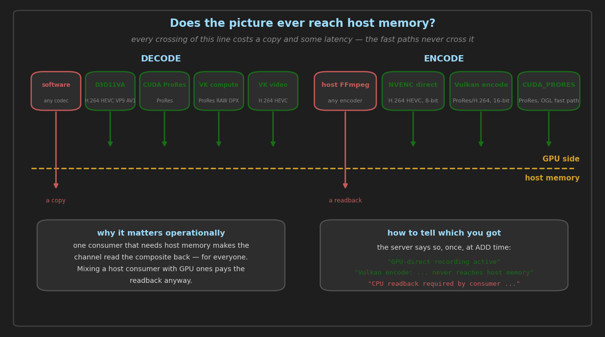
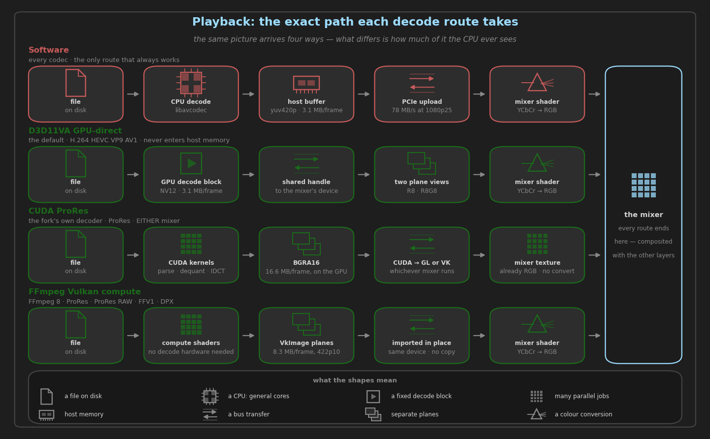
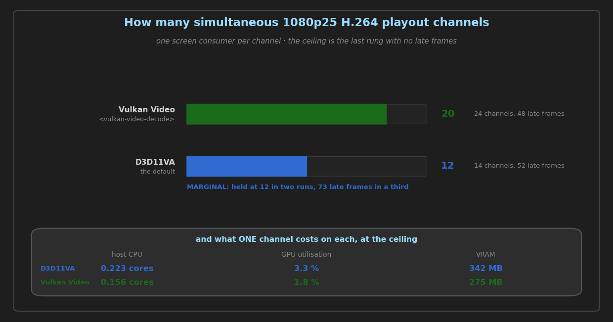
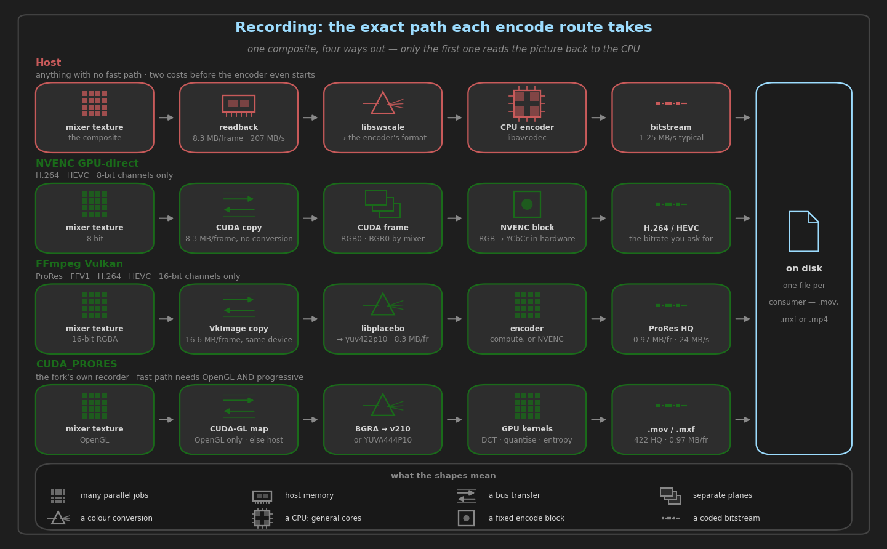
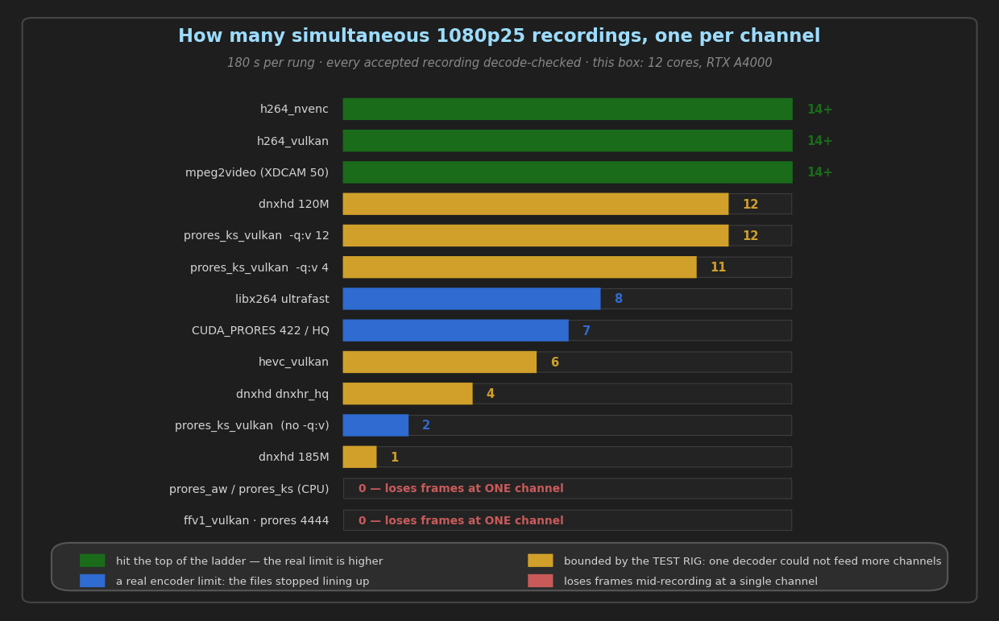
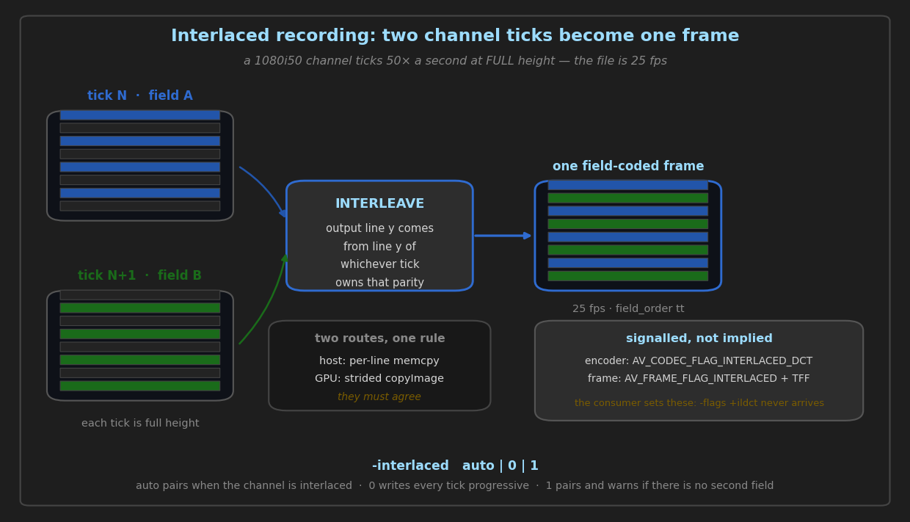
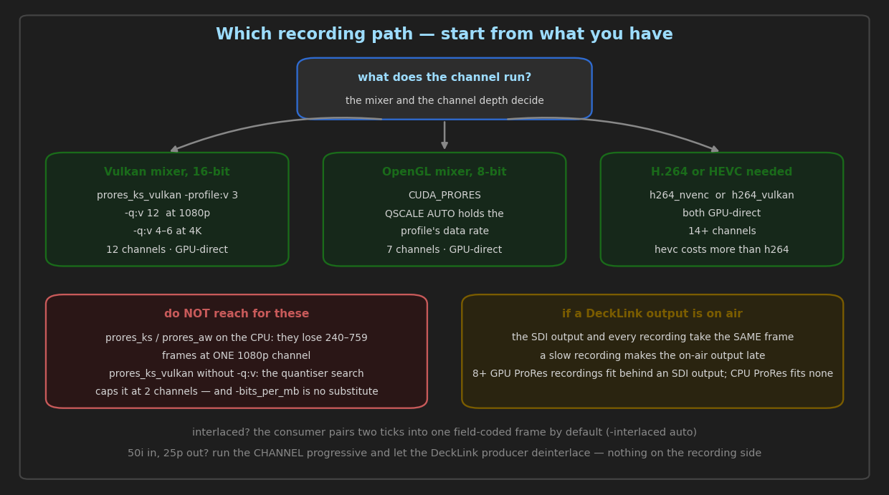

# Playback and recording — every route, what it costs, and which to pick

For the person running the machine, not the person building it. Every number here was measured on
the reference box (RTX A4000 + Quadro P4000, driver 582.53) with the harness batteries named
beside it, so you can re-measure rather than trust.

If you read one thing: **the fast paths are not interchangeable, and each one needs the channel
configured a particular way.** A recording that silently runs three times slower than it should
is almost always a fast path that declined because the channel was 8-bit when it needed 16, or
Vulkan when it needed OpenGL. The server always says so in its log. §7 is how to check.

---

## Contents

1. [Three different "how many" questions](#1-three-different-how-many-questions)
2. [Playback: the decode routes](#2-playback-the-decode-routes)
3. [Recording: the four encode routes](#3-recording-the-four-encode-routes)
4. [Commands you can paste](#4-commands-you-can-paste)
5. [Why the pictures differ](#5-why-the-pictures-differ)
6. [How many at once](#6-how-many-at-once)
7. [Checking which path you actually got](#7-checking-which-path-you-actually-got)
8. [Which path for which job](#8-which-path-for-which-job)
9. [What none of this covers](#9-what-none-of-this-covers)

---

## 1. Three different "how many" questions



These get confused constantly, and the numbers are not interchangeable.

| question | shape | what limits it |
| :--- | :--- | :--- |
| "how many **playout channels**?" | N channels, one producer each | decode cost and upload bandwidth, N independent ticks |
| "how many **ISO recordings**?" | N channels, one recording each | encode cost, N independent ticks |
| "how many **outputs on one channel**?" | 1 channel, several consumers | **one** frame budget shared between them |

The third is the one that surprises people. A channel walks its consumers on its own tick and
**cannot advance until every one of them has taken the frame**, so the slowest consumer sets the
pace for all the others. That is how a single slow recording makes an on-air SDI output late.
Eight recordings on eight channels get eight frame budgets; eight recordings on one channel share
one.

And a per-unit cost cannot be multiplied to get a ceiling. The mixer's per-tick work is not
linear in load, and upload bandwidth saturates before CPU does — so a route that is cheapest at
one channel is not necessarily the one that reaches furthest.

---



## 2. Playback: the decode routes

### At a glance

| route | how you select it | requires | host memory touched? |
| :--- | :--- | :--- | :--- |
| **Software** | `<gpu-direct-decode>false</gpu-direct-decode>` | nothing | yes — decode and upload |
| **D3D11VA GPU-direct** | `<gpu-direct-decode>true</gpu-direct-decode>` *(default)* | a codec the GPU decodes (H.264, HEVC, VP9, AV1) | **no** |
| **CUDA ProRes** | `PLAY 1-1 CUDA_PRORES "clip"` | ProRes source, NVIDIA GPU | no |
| **FFmpeg Vulkan compute** | `<vulkan-decode>true</vulkan-decode>` | Vulkan mixer; ProRes, ProRes RAW, DPX or FFV1 | no |
| **FFmpeg Vulkan Video** | `<vulkan-video-decode>true</vulkan-video-decode>` | Vulkan mixer; H.264 or HEVC; a GPU with a video-decode queue | no |
| **GStreamer** | `PLAY 1-1 GST "pipeline"` | a GStreamer installation; see `docs/GSTREAMER_GUIDE.md` | no on its GPU route |

**The last two switches are not one switch, and that is deliberate.** `<vulkan-decode>` reaches
FFmpeg's Vulkan **compute** decoders, which need only a compute queue.
`<vulkan-video-decode>` reaches `VK_KHR_video_decode`, which needs a video-decode queue *and* a
profile the driver accepts — and when either is missing FFmpeg **faults** rather than declining.
Folding them together would let a fault in one switch off the other.

### The exact path each one takes



The diagram covers the five FFmpeg routes; GStreamer has its own guide. The blocks below are the
same paths with the exact formats and the reasons each restriction exists.

Note that the **same glyph** marks the second and fifth rows' first step. That is not an
oversight: D3D11VA and Vulkan Video drive the *same* fixed-function video engine, and what differs
is the API used to reach it and what happens to the frame afterwards.

**Software.** The safe path, and the only one that handles every codec.

```
file → libavcodec software decoder → AVFrame (yuv420p / yuv422p10le / …)
     → filter graph (may convert format)
     → host buffer
     → PCIe upload, one texture per plane
     → mixer: shader converts YCbCr → RGB
```

The planes are uploaded as-is and the **shader** does the YCbCr→RGB conversion, so no CPU colour
conversion happens. What costs is the decode itself and the upload.

**D3D11VA GPU-direct** — the default, and the picture never enters host memory.

```
file → D3D11VA hardware decoder → NV12 texture on the GPU (DXGI_FORMAT_NV12)
     → shared handle → the mixer's device
        (OpenGL: WGL_NV_DX_interop · Vulkan: the D3D11 import bridge)
     → two plane views: R8_UNORM for Y, R8G8_UNORM for UV
     → mixer: shader converts YCbCr → RGB
```

Only for codecs the GPU's decode block handles. ProRes is **not** one of them — no NVIDIA GPU has
a ProRes decoder — so a ProRes clip on this route logs *"the decoder has no hardware device"* and
falls back to software. That is expected, not a fault.

**CUDA ProRes** — the fork's own decoder, for ProRes specifically. It runs on **either** mixer:
the finished frame is copied into whichever texture the channel's mixer owns.

```
file → CUDA kernels: bitstream parse, dequantise, IDCT
     → BGRA16 buffer in GPU memory
     → CUDA→OpenGL or CUDA→Vulkan copy
     → mixer texture
```

**FFmpeg Vulkan compute** — new in FFmpeg 8, compute shaders rather than a fixed-function block.

```
file → FFmpeg Vulkan compute decoder (prores · prores_raw · dpx · ffv1)
     → VkImage planes on the mixer's own device
     → imported directly, no copy across devices
     → mixer: shader converts YCbCr → RGB
```

Because it is a compute shader it needs no ProRes hardware, which is why ProRes decodes on the
GPU here and cannot on the D3D11VA route.

**FFmpeg Vulkan Video** — H.264 and HEVC on the GPU's own video-decode engine, reached through
Vulkan instead of D3D11.

```
file → VK_KHR_video_decode on the mixer's device (h264 · hevc)
     → ONE multi-planar VkImage: nv12 at 8-bit, p010 at 10-bit
     → copied plane by plane into mixer textures, by aspect plane
     → mixer: shader converts YCbCr → RGB
```

**This is not a CPU saving over D3D11VA**, and the numbers below say so: that route already
decodes these codecs to a GPU texture with no host round trip. Measured against it on the same
clip and binary, 4 layers: host CPU +1% on H.264 and −7.4% on HEVC, i.e. no reliable difference.
What is better is GPU-side — **4.4–5.1% utilisation down to 3.4–3.8%**, **1498 MB peak VRAM down
to 1347 MB**, and the decode stage down from 0.024–0.046 of the frame budget to **0.002** —
because there is no D3D11 device, no shared handles and no per-producer import bridge. And it is
the same code off Windows, which D3D11VA can never be.

The picture is **byte-identical to the software path** on 8-bit H.264 and 10-bit HEVC alike: 0
differing pixels, max delta 0. `docs/FFMPEG_8_MIGRATION.md` §12 has the mechanism, including why
the multi-planar image is not optional and the P010 trap that comes with it.

**A fifth route exists for one codec.** `CUDA_NOTCHLC` is a second CUDA decoder in this fork,
built the same way as the ProRes one and likewise usable on either mixer. It is not in the table
because NotchLC is not a recording format — nothing here encodes it — so it plays back and that
is all. The CUDA decoders are a family of two, not a ProRes-only feature.

### What they cost

Measured with `decode-cost`, three interleaved rounds per arm, all four producers confirmed on
their route's fast path:

| source | software | CUDA ProRes | FFmpeg Vulkan |
| :--- | ---: | ---: | ---: |
| ProRes 422 HQ, 10-bit | 1.90 cores | 1.26 (−33.7%) | **1.16 (−38.9%)** |
| ProRes 4444, 12-bit + alpha | 2.85 cores | 1.25 (−56.1%) | **1.16 (−59.3%)** |

**The Vulkan decoder costs the same 1.16 cores whether the content is 422 or 4444.** The decode
is effectively free and what remains is the mixer's own fixed cost. The software decoder's cost,
by contrast, rises with the format's difficulty — which is exactly why the heavier the source,
the more a GPU route is worth.


### How many channels does each route sustain?

`decode-cost` above answers "what does one layer cost, and four". This is the other shape of the
question, and the one an operator asks: how many playout channels before frames go late.
1080p25, H.264 noise, the Vulkan mixer, one screen consumer per channel
(`playback-scaling --routes auto,vulkan_video`, 2026-08-25):

| route | channels | at the ceiling | what stopped it |
| :--- | ---: | :--- | :--- |
| **D3D11VA** (`auto`, the default) | **12** | 2.68 cores · 39% GPU · 4099 MB | 14 channels, 52 late frames |
| **Vulkan Video** | **20** | 3.11 cores · 36% GPU · 5508 MB | 24 channels, 48 late frames |



Per channel that is **0.156 cores against 0.223, 1.8% GPU against 3.3%, and 275 MB against
342 MB** — Vulkan Video is cheaper on all three, which is what the four-layer cost figures above
were also saying in a form that could not be read as channels.

**D3D11VA's 12 is marginal and the number is quoted as measured rather than as a limit.** It held
at 12 in two runs and took 73 late frames in a third, same binary, same clip, same config — so 12
is the edge rather than a comfortable figure, and a venue planning to that number has no headroom.
Vulkan Video's 20 was reached in both runs that tried it.

**One number here was wrong before it was right, and the correction only ever runs one way.** The
first run had D3D11VA stop at 16 because "0 of 16 producers stayed on the fast path", and the
server's log for that rung holds twelve activation lines and no stand-downs: engagement was being
counted from a console buffer that lags at high channel counts. An undercount can only void a rung
that should have held, so it can only report a ceiling LOWER than the truth — every ladder that
battery published before 2026-08-25 is a floor rather than a measurement. It reads the log file
now, and with the fix the real limiter turned out to be late frames at 14 rather than engagement
at 16.

---

## 3. Recording: the four encode routes

### At a glance

| route | how you select it | requires | host memory touched? |
| :--- | :--- | :--- | :--- |
| **Host (CPU encoders)** | any `-vcodec` with no fast path | nothing | yes — readback + convert |
| **NVENC GPU-direct** | `-vcodec h264_nvenc` / `hevc_nvenc` | **8-bit** channel, CUDA | **no** |
| **FFmpeg Vulkan** | `-vcodec prores_ks_vulkan` / `h264_vulkan` / `hevc_vulkan` / `ffv1_vulkan` | **16-bit** channel, Vulkan mixer | no |
| **CUDA ProRes** | `ADD 1 CUDA_PRORES …` | **OpenGL** mixer, progressive — *for the fast path* | no on the fast path, yes otherwise |

**No single channel satisfies all three fast paths.** NVENC needs 8-bit, the Vulkan encoders need
16-bit, and CUDA ProRes needs the OpenGL mixer. Choose the channel for the recording you intend.

**CUDA_PRORES still records where its fast path does not apply** — this is the one row whose
requirement is not a refusal. `try_gpu_direct_upload` declines on a Vulkan channel (there is no
CUDA-GL interop to be had) and on an interlaced channel, and the consumer then reads the frame
back and uploads it, exactly as the host route does. The encoding is unchanged; only the two
costs above are added. So the OpenGL and progressive requirements buy you the zero-copy, and
their absence costs speed rather than the recording.

### The exact path each one takes



**Host.** Everything that has no fast path.

```
mixer texture → readback to host memory
                  8-bit channel  → BGRA
                  16-bit channel → RGBA64LE
              → libswscale converts to the encoder's pixel format
                  (e.g. yuv422p10le for ProRes, yuv420p for H.264)
              → CPU encoder
```

Two costs: the readback (about 8 MB per 1080p frame at 8-bit, 16 MB at 16-bit) and the swscale
conversion, both on top of the encoder itself.

**NVENC GPU-direct.**

```
mixer texture (8-bit) → CUDA copy, byte-for-byte, no conversion
                      → CUDA frame:  RGB0  on the OpenGL mixer
                                     BGR0  on the Vulkan mixer
                      → NVENC does RGB→YCbCr in hardware
                      → bitstream
```

The frame format differs by mixer because the two mixers hold their 8-bit composite in opposite
byte order. This is handled for you; it is listed because it explains why the path is byte-exact
and needs no conversion kernel — and therefore why it is restricted to 8-bit.

**FFmpeg Vulkan encoders.**

```
mixer texture (16-bit RGBA) → VkImage copy on the mixer's own device
                            → libplacebo converts on the GPU
                                 → yuv422p10  for prores_ks_vulkan / ffv1_vulkan
                                 → nv12       for h264_vulkan / hevc_vulkan
                            → encoder
```

The 16-bit requirement is a **colour-order** constraint, not a quality preference: the 8-bit
composite is BGRA and libplacebo exchanges red and blue on a BGRA Vulkan frame, so an 8-bit
channel is refused outright rather than recorded wrongly.

`h264_vulkan` and `hevc_vulkan` run on the **NVENC hardware block** reached through Vulkan —
measured at 15–39% block utilisation, where the compute encoders read 0%. `prores_ks_vulkan` and
`ffv1_vulkan` are compute shaders and use no fixed-function unit.

**CUDA ProRes consumer.** The fast path, taken on an OpenGL progressive channel:

```
mixer OpenGL texture → CUDA-GL map on the mixer's own thread
                     → BGRA8 buffer in GPU memory
                     → red/blue exchange (the texture and a readback differ in byte order)
                     → CUDA kernels: BGRA → v210 (422) or YUVA444P10 (4444)
                     → GPU DCT, quantise, entropy code
                     → .mov or .mxf
```

On a Vulkan or interlaced channel the first two lines become a readback and a host upload, and
everything from the conversion kernels down is the same.

### What they cost

`encode-matrix`, 1080p2500, two interleaved rounds, every fast path confirmed engaged:

| codec | route | cores | NVENC block | frames kept | MB / 10 s |
| :--- | :--- | ---: | ---: | ---: | ---: |
| ProRes 422 HQ | `prores_ks_vulkan` | **1.46** | 0% | 258/258 | 50.9 |
| | `CUDA_PRORES` | 1.64 | 0% | 260/260 | 55.4 |
| | `prores_aw` (CPU) | 2.24 | 0% | 260/260 | 22.4 |
| | `prores_ks` (CPU) | 2.32 | 0% | **138/260** | 14.4 |
| H.264 | `h264_nvenc` † | **1.37** | 9% | 255/255 | 0.1 |
| | `h264_vulkan` | 1.40 | 15% | 259/259 | 0.3 |
| | `libx264` | 2.18 | 0% | 262/262 | 0.1 |
| HEVC | `hevc_nvenc` † | **1.39** | 11% | 258/258 | 0.1 |
| | `hevc_vulkan` | 1.43 | 36% | 256/256 | 6.7 |
| | `libx265` | 2.83 | 0% | 252/252 | 0.1 |
| FFV1 | `ffv1_vulkan` | **1.50** | 0% | 258/258 | **210.0** |
| | `ffv1` (CPU) | 2.26 | 0% | 260/260 | 11.8 |

† NVENC requires `tools/use_local_ffmpeg.sh apply` on this machine — see §8.

**Two rows to read carefully.**

`prores_ks` **kept 138 of 260 frames.** It is not a cheaper recording, it is half a recording: the
encoder cannot sustain 1080p25 and the channel drops what it cannot take. **`prores_aw` can**, for
slightly less CPU. If you are recording ProRes on the CPU, ask for `prores_aw`.

`ffv1_vulkan` wrote **210 MB against 11.8 MB** for the same ten seconds. FFV1 is lossless, so that
is not a quality difference — it is a weaker entropy coder. Eighteen times the disk is often
enough to decide the trade on its own.

---

## 4. Commands you can paste

**Playback**

```
PLAY 1-1 "clip"                          # default route: D3D11VA GPU-direct if the codec allows
PLAY 1-1 CUDA_PRORES "clip"              # the CUDA ProRes decoder
```

Software decode, or the Vulkan decoders, are configuration rather than commands:

```xml
<gpu-direct-decode>false</gpu-direct-decode>   <!-- force software -->
<vulkan-decode>true</vulkan-decode>            <!-- FFmpeg Vulkan compute decoders -->
```

**Recording — a 16-bit Vulkan-mixer channel**

```
ADD 1 FILE "out.mov" -vcodec prores_ks_vulkan -profile:v 3 -q:v 12 -ac 2
ADD 1 FILE "out.mov" -vcodec hevc_vulkan -b:v 40M -ac 2
ADD 1 FILE "out.mov" -vcodec h264_vulkan -b:v 50M -ac 2
REMOVE 1 FILE "out.mov" -vcodec prores_ks_vulkan -profile:v 3 -q:v 12 -ac 2
```

**`-profile:v` is not optional**: without it `prores_ks_vulkan` picks a profile from its input,
so a recording you think is 422 may be 422 HQ — profile 2 is 422, profile 3 is 422 HQ.

**`-q:v` is what takes this from one recording channel to eight, and the value is per raster.**
12 keeps a 1080p file on the profile's data rate; at 4K the same value gives **0.46x** of it and you
want 4-6. §6 has the table, and two prerequisites: the patched FFmpeg from
`tools/use_local_ffmpeg.sh apply` (on the pinned build the option writes a corrupt file). The
`+ildct` deadlock is fixed in that same patched build — see §6 for what interlaced actually does
here, which is not what the flag suggests.

**Recording — an 8-bit channel**

```
ADD 1 FILE "out.mp4" -vcodec h264_nvenc -b:v 60M
ADD 1 FILE "out.mov" -vcodec prores_aw -pix_fmt yuv422p10le
ADD 1 CUDA_PRORES PATH "D:/recordings" FILENAME "out.mov" PROFILE 3
REMOVE 1 CUDA_PRORES
```

Three things that catch people out:

* **`REMOVE` needs the same arguments as the `ADD`.** `REMOVE 1 FILE` on its own returns
  `404 REMOVE FAILED` and finalises nothing — the container is left without its trailer and will
  not open. The server builds a consumer from the parameters to identify which one to remove.
* **`-ac 2` on FFmpeg 8.** The channel's default 16-channel audio layout is refused by the AAC
  encoder (*"Unsupported channel layout 9.1.6"*), which fails the whole recording for a reason
  that has nothing to do with video.
* **Set a bitrate.** The GPU encoders' defaults are untuned and vary by more than a factor of ten
  between routes producing the same picture.

---

## 5. Why the pictures differ

Every GPU route was compared against the CPU encoder on a still, one frame each. The numbers are
small; what matters is *where* the difference sits.

| route | mean difference | where it sits |
| :--- | ---: | :--- |
| `prores_aw` vs `prores_ks` | 0.17 LSB | at colour boundaries |
| `CUDA_PRORES` | 0.89 LSB | 63% at colour boundaries |
| `prores_ks_vulkan` | 2.55 LSB | 86% at colour boundaries |
| `h264_vulkan` | 2.70 LSB | 55% at boundaries, rest is block noise |
| `hevc_nvenc` | 1.64 LSB | 53% at boundaries |

**Why "at colour boundaries" is the reassuring answer.** All these codecs store colour at half
horizontal resolution (4:2:2) or quarter (4:2:0). At a hard vertical edge — the join between two
colour bars — there is no single correct answer for the shared colour sample, and two
implementations legitimately choose differently. The disagreement is then **one or two pixel
columns wide at each transition and nothing in between**, which is what these percentages
describe.

A difference spread evenly across **flat areas** would be the worrying one: that is a colour
error, not a resampling choice. That is exactly how two real defects were caught this month — a
red/blue exchange reads as ~166 LSB with only 5% at boundaries, because flat areas are wrong
everywhere.

**Why a grey test pattern is a bad check.** Grey has equal red and blue, so it is unchanged by a
red/blue exchange and by most colour-matrix errors. Both defects above would have passed a grey
ramp cleanly. Use colour bars or anything with saturated, *asymmetric* colour.

**One number that is not the encoder.** For FFV1 — a lossless codec — any difference at all comes
from the RGB→YCbCr conversion, not the encoding: the CPU route converts with libswscale and the
Vulkan route with libplacebo. The 2.49 LSB there says nothing about either encoder.

---

## 6. How many at once

All three ladders stop at the first configuration that goes late in **steady state** — start-up
lateness is excluded, because every configuration on this machine loses one to three frames while
it opens files and compiles shaders, and counting those reports a ceiling of zero for everything.
The ceiling quoted is the last configuration that held.

**Read these as ±1, not as exact.** They are threshold crossings: `hevc_vulkan` measured 7
channels in one run and 5 in the next with nothing changed. The ordering is stable; the last
channel is not.

### Recording — N channels, one recording each



**Re-measured 2026-08-24, and the previous version of this table was wrong.** It gated on the
channel's *late-frame* count, which on a recording-only channel measures jitter rather than
anything reaching the file: a late tick still produces a frame and the encoder still writes it.
That gate put `CUDA_PRORES` at "0 — late at one channel" when it records six, and `prores_ks`
(CPU) at 1 when it loses 717 frames at one channel and records none.

What stops a rung now, in the order checked:

1. **A recording that does not decode**, or cannot be read at all — a defect, not a ceiling.
2. **A frame lost mid-recording**, with no tolerance. Frames lost during the consumer's start-up
   or its close are reported separately: those are the edges of the take, not the load.
3. **The channels behind real time once warm**, from the server's own tick rate over the steady
   window, excluding a 30 s warm-up and a 10 s drain.
4. **The rung's recordings differing in length** by more than 2% — an ISO set whose files do not
   line up is a failed take however complete each file is.

Every rung is **180 seconds**. At the 12 s the old table used, a rung that fails under sustained
load has not failed yet: the queues are still absorbing and nothing has throttled. And **every
recording at every accepted rung was decode-checked** — 700+ files, zero decode errors.

Each arm runs at the depth and mixer its own fast path needs, so those are columns rather than
constants. `--producer route`: one decoder feeds every channel, so the figures are the
recording's and not the decode's.

| route | mixer / depth | channels | stopped by |
| :--- | :--- | ---: | :--- |
| `h264_nvenc` | vulkan 8 | **14+** | the top of the ladder |
| `h264_vulkan` | vulkan 16 | **14+** | the top of the ladder |
| `mpeg2video` (XDCAM 50) | vulkan 8 | **14+** | the top of the ladder |
| `dnxhd -b:v 120M` | vulkan 8 | **12** | ⚠ the source producer starved |
| `prores_ks_vulkan -q:v 12` | vulkan 16 | **12** | ⚠ the source producer starved |
| `prores_ks_vulkan -q:v 4` | vulkan 16 | **11** | ⚠ the source producer starved — at 100% GPU and 12.4 GB |
| `libx264 -preset ultrafast` | vulkan 8 | **8** | files diverged by 401 frames at 9 |
| `CUDA_PRORES` 422 HQ, AUTO | ogl 8 | **6–7** | files diverged at 7–8 |
| `CUDA_PRORES` 422, AUTO | ogl 8 | **7** | files diverged by 165 frames at 8 |
| `hevc_vulkan` | vulkan 16 | **6** | ⚠ the source producer starved |
| `dnxhd -profile dnxhr_hq` | vulkan 8 | **4** | ⚠ the source producer starved |
| `prores_ks_vulkan` (no `-q:v`) | vulkan 16 | **2** | files diverged at 3 |
| `prores_ks_vulkan -bits_per_mb 2000` | vulkan 16 | **2** | files diverged at 3 |
| `dnxhd -b:v 185M` | vulkan 8 | **1** | ⚠ the source producer starved |
| `prores_aw` 422 / HQ | vulkan 8 | **0** | 240 / 449 frames lost mid-recording at 1 channel |
| `ffv1_vulkan` | vulkan 16 | **0** | 594 frames lost at 1 channel |
| `prores_ks` 422 / HQ / HQ-16bit | vulkan 8/16 | **0** | 717 / 732 / 732 frames lost at 1 channel |
| `prores_ks -profile:v 4` (4444) | vulkan 8 | **0** | 759 frames lost at 1 channel |
| `ffv1` (CPU) | vulkan 8 | **0** | 172 frames lost at 1 channel — and 0 in another run, so marginal |
| `hap` | — | **n/a** | the encoder is not in this FFmpeg build |

### Are these numbers plausible for the hardware?

The whole table above came from one program — this server, measured by one harness, through one
exporter. A defect anywhere in that chain that made a recording **cheaper** than it should be
would raise the ceiling and look exactly like success, so the three highest Vulkan rows were
re-measured with **CasparCG out of the picture entirely**: concurrent standalone `ffmpeg`
processes, same GPU, same FFmpeg binaries, 30 s each, `smptehdbars` at 1080p25.

| encoder | this server | standalone ffmpeg | |
| :--- | ---: | ---: | :--- |
| `prores_ks_vulkan -q:v 12` | 12 | **14** held, at 1.14× | server is 2 below the hardware |
| `h264_vulkan` | 14 | **14** held, 16 failed at 0.94× | exact |
| `hevc_vulkan` | 6 | **6** held, 8 failed at 0.91× | exact |

Two of the three land on the server's number exactly, and the third leaves the server slightly
under the hardware — which is the expected direction, because the server also runs a mixer, a
producer and an output on every one of those channels. **Nothing in the table is cheaper than
the GPU can account for.**

**What this does not check.** That the recordings are *correct* — a fast encoder writing rubbish
would pass; `encode-parity` owns the picture. And it shares the table's content bias: bars
compress to 0.059 MB/frame against the 0.97 ProRes 422 HQ is rated for, so entropy coding is
easier on both sides than it would be on real pictures. Two arms disagree the other way under
that same bias and are open questions rather than corroboration: standalone holds **4** channels
of `ffv1_vulkan` where this server records none, and **4** of `prores_ks_vulkan` without `-q:v`
with 3.78× still spare where the server caps at 2. Both are consistent with the quantiser search
below being content-dependent — exactly what trivial content cannot stress.

> **⚠ "the source producer starved" is not a recorder ceiling.** One decoder feeding N routed
> channels eventually cannot, and the source channel then logs `Waiting for video frame...`. Six
> arms stopped that way, so their numbers are floors bounded by this rig rather than by the
> encoder — `dnxhd -b:v 185M` at "1" says nothing about DNxHD. Re-run those with
> `--producer file`, which gives every channel its own decoder, to separate them.

**The single most useful thing in that table: `-q:v` takes `prores_ks_vulkan` from 2 channels to
12.** The default runs a *trellis quantiser search* — a compute shader trying several quantisers
per slice and keeping the best — and it saturates the GPU below what three 25p channels need.
Pinning the quantiser skips the search:

```
ADD 1 FILE "out.mov" -vcodec prores_ks_vulkan -profile:v 3 -q:v 12 -ac 2
```

`-bits_per_mb` is **not** a substitute: it still runs the search, and still stops at 2.

Between the two pinned values, **`-q:v 12` is the better setting** and not only on data rate: it
reached the same ceiling as `-q:v 4` at **87% GPU and 4.0 GB** against `-q:v 4`'s **100% and
12.4 GB**. At those rungs the Vulkan mixer also began logging *"renderpass slot still waiting for
the GPU"* — refusing to recycle a submission still in flight, which is the mixer protecting
itself rather than corrupting, but it marks the point where the GPU is the constraint.

**This needs a patched FFmpeg, and the pinned build is not it.** `-q:v` on `prores_ks_vulkan`
wrote a corrupt picture — green, luma clamped, `invalid plane data size` from the decoder on every
frame — because three places in the encoder disagreed about which quantiser index the frame was
being built at. Fixed in `docs/upstream/prores_ks_vulkan_qscale_corruption.md`, applied to the
local build, and installed with `tools/use_local_ffmpeg.sh apply`. On an unpatched FFmpeg the
option is worse than useless, so the guard is: **if `-q:v` is in the args, check the recording
decodes before trusting anything else about it.**

### Which quantiser — and it is different for every raster

**`-q:v 12` at 1080p. `-q:v 4`–`6` at 4K. Nothing at all for interlaced.** The value is not
portable, and getting it wrong is silent: the recording succeeds and simply carries the wrong data
rate.

ProRes profiles have published data rates and the trellis search exists to hit them. FFmpeg targets
**950 bits per macroblock** for profile 3 at every raster above 6075 macroblocks (`br_tab[3]` in
`proresenc_kostya_common.c`, and the loop that selects it stops at index 3 — so 1080p and 4K share
the same bits-per-macroblock target and differ only in how many macroblocks there are). Apple's
nominal figure for 422 HQ is 220 Mbit/s at 1920×1080/29.97 and 880 at UHD, so FFmpeg aims about
5.6% above the vendor's number.

**The target for each mode**, which is arithmetic rather than measurement:

| mode | MB/picture | pictures/s | FFmpeg target | Apple nominal |
| :--- | ---: | ---: | ---: | ---: |
| 1080p25 | 8160 | 25 | 193.8 Mbit/s | 183.5 |
| 1080p50 | 8160 | 50 | 387.6 | 367.0 |
| 1080i50 | 4080 | 50 | 193.8 | 183.5 |
| 2160p25 | 32400 | 25 | 769.5 | 734.1 |
| 2160p50 | 32400 | 50 | 1539.0 | 1468.1 |

`1080i50` and `1080p25` coincide because they carry the same pixels per second. **Frame rate needs
no separate measurement**: bits-per-macroblock is a per-*picture* property, so 50p is the 25p
bits/MB at twice the pictures per second.

**What each quantiser achieves at 1080p** (detailed content, one frame through each setting):

| setting | bits/MB | Mbit/s @25p | vs target | Y PSNR | channels |
| :--- | ---: | ---: | ---: | ---: | ---: |
| default (trellis search) | 929 | 189.5 | **0.98×** | 42.89 dB | **1** |
| **`-q:v 12`** | 961 | 196.1 | **1.01×** | **43.70 dB** | **8+** |
| `-q:v 8` | 1309 | 267.0 | 1.38× | 46.76 dB | 8+ |
| `-q:v 4` | 2043 | 416.8 | **2.15×** | 52.34 dB | 8+ |
| `-q:v 2` | 2826 | 576.5 | 2.97× | 58.02 dB | 8+ |

**And at 4K, where the same values land somewhere else entirely:**

| setting | bits/MB | Mbit/s @25p | vs target |
| :--- | ---: | ---: | ---: |
| default (trellis search) | 956 | 774.1 | **1.01×** |
| `-q:v 2` | 1896 | 1535.6 | 2.00× |
| `-q:v 4` | 1189 | 963.2 | 1.25× |
| **`-q:v 6`** | 872 | 706.3 | **0.92×** |
| `-q:v 8` | 683 | 553.1 | 0.72× |
| `-q:v 12` | 439 | 355.2 | **0.46×** |

**`-q:v 12` at 4K gives less than half the profile's data rate** — worse quality than 422 HQ
intends, from the value that is correct at 1080p. Nothing brackets 4K as neatly as q12 does at
1080p: q6 at 0.92× is the closest below, q4 at 1.25× the closest above. Pick by which side of the
target you would rather be on.

**Interlaced: the flag works now, and you still will not reach it from AMCP.** Two separate
things, and conflating them wasted a measurement here already.

`prores_ks_vulkan -flags +ildct` used to hang — 30 s and a 36-byte file with no diagnostic. That
was a deadlock in the encoder (`ff_vk_exec_start` called once per picture, waiting forever on a
fence it had itself just reset), and fixing it exposed a heap corruption underneath from a
double-unref of the host-mapped packet. **Both are fixed in the patched build**: measured
**929 bits/MB, 0.98× target, zero decode errors**, against the software `prores_ks` at 943
(0.99×), with field order signalled correctly. Written up in
`docs/upstream/prores_ks_vulkan_qscale_corruption.md`.



**And the FILE consumer now pairs fields for you, so `+ildct` is not something you ask for.**
An interlaced channel ticks at field rate: 50 full-height frames a second. The consumer holds
one and interleaves it with the next, so a `1080i5000` channel records as **25 fps field-coded**
with the interlaced flags set on the encoder and on every frame. You do not pass `-flags +ildct`
— it would not reach the encoder anyway, it is reported as an unused option.

Measured 2026-08-23 on a `1080i5000` channel, before and after:

| | before | after |
| :--- | :--- | :--- |
| rate | 50/1 **progressive** | **25/1** |
| `field_order` | `progressive` | **`tt`** |
| per-frame flags | — | `interlaced_frame=1, top_field_first=1` |
| duplicate frames | **every picture written twice** — the first eight video frames hashed as four identical pairs | none; all distinct |
| dropped frames (fast encoder) | — | 0 |

The duplication is what made the old behaviour worse than merely unsignalled: with a 25p source
on a 50-tick channel it wrote each picture twice, so the file was double the size for the same
pictures. Pairing also halves what the encoder sees, which is why an encoder that could not
sustain the channel before may now keep up.

Progressive channels are untouched — verified `field_order=progressive`, `interlaced_frame=0`,
25/1, zero drops on the same build.

**A 25p file from a 50i SDI input is a CHANNEL choice, not a consumer one** — and it is the
common case, so it is worth separating from everything below. The DeckLink *producer*
deinterlaces when an interlaced input feeds a **progressive** channel: `decklink_producer` sets
`i2p` for exactly that case and inserts `bwdif=mode=send_field` with the input's parity, then an
`fps` stage to the channel rate. Run the channel at `1080p2500`, point a `DECKLINK` producer at
the 50i input, and every consumer records plain 25p — no pairing, no `-interlaced`, nothing to
configure on the recording side. Verified over the looped DeckLink pair: `progressive, 25/1` out.
(Limit of that check: the card reported the generator's mode both as `1080p25` and as `1080i50`
during the run, so the output is confirmed and the `bwdif` stage engaging is not.)

Everything below is about the other case: keeping the fields, on an interlaced channel.

**`-interlaced auto|0|1` chooses, and the channel only says what is possible.**

| value | effect |
| :--- | :--- |
| `auto` (default) | pair when the channel is interlaced |
| `0` | never pair — every tick becomes its own progressive frame, which is what this consumer did before pairing existed. Correct when the deliverable is 50p. |
| `1` | pair; warns and records progressive if the channel has no second field |

Measured on a 1080i50 channel with `prores_ks_vulkan`: `auto` and `-interlaced 1` both give
`tt, 25/1`; `-interlaced 0` gives `progressive, 50/1`. An unrecognised value warns and falls back
to `auto`. On a progressive channel `-interlaced 1` warns and records `progressive, 25/1`.

`-interlaced 0` also lifts the NVENC refusal below, since there is then nothing to interleave.

**`-interlaced` is the FFmpeg consumer only.** `CUDA_PRORES` and `CUDA_PRORES_BYPASS` field-code
an interlaced channel unconditionally — the first from `field_count`, the second from the capture
signal — and neither exposes a switch. If you need a progressive file out of an interlaced
channel, use the `FILE` consumer with `-interlaced 0`, or change the channel.

**Three things to know about it.**

* **The Vulkan encode path pairs on the GPU; NVENC still declines.** The Vulkan exporter
  interleaves the two composites with two strided `vkCmdCopyImage` calls in one command buffer,
  so a field-coded interlaced recording still never touches host memory. NVENC's route has no
  strided image copy available to it, so an interlaced channel makes it decline with that reason
  and the host path pairs instead — which is a change from recording such a channel as 50p.
* **Field dominance is derived from the video mode**, because the core has carried none since the
  2018 refactor — SD PAL/NTSC are bottom-field-first, everything else interlaced is top. This is
  the same rule `cuda_prores` derives separately, and two modules deriving it independently is a
  hazard: change one and the same timeline records with opposite field order on SDI and to file.
* **A backlogged encoder keeps writing after the channel stops, and the file is incomplete
  until it finishes.** `prores_ks` and `prores_aw` drop frames at 1080p, and their drain ran
  **4 seconds past `KILL`** on a 431 MB file. Read the recording before that and you get
  `moov atom not found` — `ftyp/wide/mdat` with the `moov` not yet appended — which looks exactly
  like a corrupt recording and is not one. **Wait for the consumer's `Uninitialized` line in the
  log.** Verified afterwards: `prores_ks` at 1080i50 gives `tt`, `interlaced_frame=1`,
  `top_field_first=1`, zero decode errors, 1248 bits/MB at `-q:v 12`.

**One ceiling on `-q:v` itself:** the Vulkan encoder refuses a forced quantiser above **14**,
because its score buffer is dimensioned `[16]` and indexed by quantiser. The software encoder
allows 64. That is ample for 422 HQ at these rasters, and would bite on a low-rate profile at 4K
that legitimately wants a coarser quantiser.

**Limits on the picture and rate figures.** One frame per arm, and the content is detailed noise —
the worst case for a DCT codec and the material most likely to make a trellis search look bad, so
on flatter footage expect the search to do better and the on-spec quantiser to move. PSNR is not a
look: the maximum errors (41 at `-q:v 12` against 73 for the default) say more about visible
quality than the means, and neither is a viewing verdict. And **the 1080p and 4K figures come from
different source frames**, so they are not a controlled comparison of raster alone — they are two
separate answers to "what hits target here", which is the question an operator actually has.

**`-bits_per_mb` is not an alternative.** It produces a correct picture on any build but does not
bypass the search — `force_quant` comes only from `global_quality` — so it changes the rate and
not the speed, and measures the same one-channel ceiling.

Two more things this table says that the 8-bit one cannot:

* **The CPU encoder also stops at one channel here**, on 5 late frames rather than 47. Recording
  ProRes at 16-bit is simply more expensive than at 8-bit — 16 MB a frame of composite instead of
  8 — so the 8-bit table's "3 channels for `prores_ks`" does not carry over.
* **`-q:v` used to be discarded by the consumer entirely**, so any ceiling measured before
  2026-08-23 with that argument in it was measured without it. Between the consumer fix and the
  FFmpeg fix it was measuring a corrupt encode. Only numbers taken with both fixes in place mean
  anything.

**Choosing the right CPU encoder buys more than moving to the GPU does, for ProRes.** `prores_aw`
reaches five channels — the same as `prores_ks_vulkan` — while `prores_ks` reaches three. If you
are recording ProRes and cannot use a GPU route, that one word in the command is worth two
channels.

**The `CUDA_PRORES` zero is resolved, and it was the instrument.** This paragraph used to say
the zero was unexplained — that the consumer engaged its GPU-direct path and still "went late at
one channel" while `encode-matrix` recorded it cleanly. The difference was the gate, not the
configuration: the ladder stopped on the channel's late-tick count, which on a recording-only
channel measures jitter and not anything reaching the file. Re-measured against frame loss,
decode validity, steady-state real time and inter-file agreement, the same consumer records
**six to seven channels**.

`ffv1_vulkan`'s zero is a different thing and it is real: 594 frames lost mid-recording at one
channel, with the recording unreadable afterwards. It writes about 21 MB/s per channel, so the
disk is a plausible cause and still not an isolated one — that has not been tested and is not
asserted here.

### `file` against `route` — what the producer costs a recording channel

Every ISO ceiling here is measured two ways, and the difference is meant to be the playback cost
per recording channel: `--producer route` decodes once on a source channel and routes the picture,
`--producer file` gives every channel its own decoder. A real ISO rig decodes (or captures) per
channel, so the `file` number is the operational one and the `route` number isolates the encode.

| codec | `--producer file` | `--producer route` |
| :--- | :--- | :--- |
| `h264_vulkan` | **≥9** | **≥16** |
| `prores_ks_vulkan` (16-bit) | **1** | **1** |

**Neither H.264 figure is a ceiling, and the gap is therefore not quantified.** The route arm ran
out of ladder at 16 with headroom to spare; the file arm stopped because the **10-channel step
could not start a server at all** (`WinError 10053` on the AMCP connect), which the battery
reports as an absent measurement rather than a limit. Two different non-limits. What the pair does
establish is the *direction*: route is at least as good as file, which is what paying for one
decode instead of nine should give.

**That direction is worth stating because the first attempt got it backwards.** Before the
late-frame floor existed, this table read `file 8` against `route 3` — routing apparently three
times worse than nine independent decoders. The route arm had stopped on **one late frame out of
about 500**, with 11 ms of jitter against a 40 ms budget. It was a threshold crossing on noise,
and it was very nearly written up as a finding about `route://`.

**For ProRes there is no gap to find.** One channel either way: the encoder is the limit, so how
the picture arrives does not enter into it.

### What a real input costs — the ISO ceilings are for routed pictures

Every recording ceiling above uses `route://1`: one channel decodes and the rest take its
picture. That isolates the recording, which is the point — but **a real ISO rig does not route,
it captures**, and a capture is not free. The honest form of the ceiling is *routed ceiling,
minus an adder per real input*.

Measured by difference on the looped pair (DeckLink 1 cabled to DeckLink 4), with a standalone
ffmpeg driving the output so that path's cost sits outside the figures, and the measured
channel's producer swapped between `route://1` and `DECKLINK 4`:

| round | `route://1` | `DECKLINK 4` | difference |
| ---: | ---: | ---: | ---: |
| 1 | 0.76 | 1.01 | +0.25 |
| 2 | 0.77 | 1.00 | +0.23 |
| 3 | 0.85 | 1.04 | +0.19 |

**One capture costs about +0.23 cores**, and the range is +0.19 to +0.25.

**Read the difference, never the columns.** The absolute figures moved from ~1.8 cores to ~0.8
between two runs of this same measurement with nothing changed — this box's CPU sampling drifts
that much over minutes. That is exactly why the arms are interleaved round by round and each
difference is taken within its own round: a capture measured now against a route measured five
minutes ago is two numbers minutes apart, and their difference is mostly drift.

**It is an extrapolation, and a floor rather than an estimate, for the Nth input.** Connectors
1 and 4 are the only cabled pair on this rig, so exactly one channel can capture and the
"cost of two captures" cannot be measured here at all. Multiplying assumes every capture costs
the same, and they may not: they contend for the card's PCIe bandwidth and its capture engine,
so the true cost of the Nth is at least this and plausibly more.

### Playback — N channels, one producer each

One screen output per channel, so these are playout channels rather than a bare decode test.

Measured 2026-08-23 with realistic content (60 s of moving noise, looped) on the same nine-rung
ladder at both rasters, so the pair is comparable.

| route | source | 1080p | 4K | cores @ 4K | GPU% @ 4K |
| :--- | :--- | ---: | ---: | ---: | ---: |
| Software (`<gpu-direct-decode>false`) | ProRes | **1** | **2** | 5.68 | 17 |
| `CUDA_PRORES` | ProRes | **4** | **4** | 1.72 | 66 |
| `<vulkan-decode>` | ProRes | **12** | **4** | **0.86** | **28** |
| D3D11VA GPU-direct | **H.264** | 6 † | 12 | 1.90 | 35 |

**The first three are the comparison; the fourth is not.** Software, CUDA and Vulkan all decode
the same ProRes clip. D3D11VA cannot be included: no NVIDIA GPU decodes ProRes, so that route has
to be measured on an H.264 clip, and its numbers reflect a much lighter source as well as the
route. Run on ProRes it declines every producer, correctly, and the ladder refuses to report a
number.

† and its 1080p figure is **not** a ceiling — the 8-channel step failed to start a server, which
the ladder reports as an absent measurement rather than a limit. Read it as "at least 6".

**`<vulkan-decode>` is the case, and at 4K it is a cost case rather than a channel-count one.**
At 1080p it reaches twelve playout channels against software's one. At 4K it ties CUDA on channels
and wins on everything else: **half the CPU (0.86 against 1.72 cores) and a third of the GPU (28%
against 66%)** for the same four channels. That headroom is what lets a recording or an output
share the box.

**Software decode collapses at 4K**: 5.68 cores for two channels is over half this machine for two
pictures.

**Read a 1080p-to-4K row as a ratio only where both ends are real ceilings.** Two of these rows
were not, in an earlier version of this table: `<vulkan-decode>` and D3D11VA both *held at the top*
of a shorter ladder at 1080p, which is a floor rather than a ceiling, and comparing a floor with a
ceiling produced a "4K is faster than 1080p" reading that cannot be true. Both rasters here use
the same rungs, and the software row still reads 1 at 1080p against 2 at 4K — that one is the
late-frame noise floor rather than a real inversion, and the 1080p figure is the less trustworthy
of the two.

### Outputs on one channel — the SDI case

One channel, one producer, a real-time output always present, then recordings added to the same
channel.

Re-measured 2026-08-23 with two controls the earlier version of this table did not have: the
added consumers' **own dropped frames** (a recording that cannot keep up records less and leaves
the channel perfectly on time), and the **frame budget** `consume_max/nominal` from the channel's
TIMING line. Ladders extended until each arm actually failed, because an arm that stops at the
ladder's top has not been measured.

| output on air | recordings added | raster | ceiling | cores | GPU% | drops | budget | readback |
| :--- | :--- | :--- | ---: | ---: | ---: | ---: | ---: | :--- |
| screen | `prores_ks_vulkan` | 1080p | **24** | 2.88 | 99 | 0 | 0.02 | no |
| screen | `prores_ks_vulkan` | 4K | **8** | 2.11 | 95 | 0 | — | no |
| screen | `prores_ks` (CPU) | 1080p | **0** | — | — | **329** with 1 | — | — |
| screen | `prores_ks` (CPU) | 4K | **0** | — | — | **453** with 1 | — | — |
| DeckLink SDI | `prores_ks_vulkan` | 1080p | **8+** | 1.97 | 46 | 0 | 0.02 | no |
| DeckLink SDI | `prores_ks` (CPU) | 1080p | **0** | — | — | — | **1.12** | — |

**This is the answer to "can I record while I am on air", and it is a better answer than the
previous one.** **Twenty-four** GPU ProRes recordings share a 1080p channel behind a screen output
with **zero dropped frames**, and eight do at 4K. The 1080p arm stops at 28 on **838 dropped
frames** — a real failure, found by counting the consumers' losses rather than the channel's.

**And the `budget` column says what the limit is not.** At 24 recordings the channel's frame
budget is at **0.02** — essentially untouched. The consumers are not holding the tick, so the
constraint is the encoders' own throughput (GPU at 99%), which surfaces as dropped frames and
never as a late channel. That is the whole reason the drops control had to exist: on the
late-frame count alone this arm would have climbed to the top of any ladder reporting a clean
run. A single **CPU** ProRes recording fails at both
rasters — and note *how* it fails: 324 and 453 dropped frames **with the channel exactly on
time**. The earlier version of this table called that a working configuration and reported a
ceiling of four, because it only ever looked at whether the channel went late.

**The trellis quantiser search does not change these numbers.** `prores_ks_vulkan` with the search
on and with it forced off reach the same ceiling at both rasters — the search costs real GPU (95%
against 54% at 4K) and is not the binding constraint in this shape. So for many outputs on ONE
channel there is nothing to gain from `-q:v` on channel count, and the reason to reach for it is
the picture rather than the throughput (§6 quantifies both). It only bites on throughput in the
other shape, N channels each with one recording, where the default caps at one.

**With an SDI output on air, the GPU recordings are essentially free and the CPU one is fatal.**
Eight or more `prores_ks_vulkan` recordings sit alongside a live DeckLink output with the frame
budget at **0.02** — the tick is barely touched — and eight is the top of the ladder rather than a
limit. One **CPU** ProRes recording takes **1.12 of the budget on its own**: the channel cannot
advance until every consumer has taken the frame, so at 1.00 there is nothing left however few
frames went late. It showed two or three late frames, which on a late-frame count reads as noise;
the budget is what makes it a limit and names it as one.

**Two things in the previous version of this section were wrong, and both are worth flagging.** It
reported `0` for *either* kind of recording alongside SDI, which was a pre-floor run stopping on
noise — the GPU recordings are fine. And it explained the DeckLink rows as "that output needs host
pixels, so the channel reads back once per tick": `readback` here is **no**, so the DeckLink output
is on its own GPU-direct path (NVIDIA DVP, "Tier-2 GPU-direct output") and forces no readback at
all. The readback in the CPU row is the CPU *recording's*, not the output's.

**A channel with no real-time output cannot be measured this way**, and the battery refuses to
try. A channel whose only consumer is a file recording has nothing pacing it, so "late" has
nothing fixed to be late against — measured, it reported *worse* than the same channel with an SDI
output added, which cannot be true of a channel doing strictly less work.

**One earlier observation is now explained, and the §8 rule is now proven on both sides.**
`readback` used to read `yes` in every consumer-ladder configuration, including GPU-only ones, and
that was recorded here as unexplained. Re-run, it reads **`no`** wherever every consumer is on a
GPU path — including with a live DeckLink output, which has its own GPU-direct route — and `yes`
only when a host-path consumer is present. So the readback being *avoided* is now demonstrated
rather than assumed, which is what the earlier version said it could not show; and the cost of
breaking it is measured in the same table, where one CPU recording takes 1.12 of the frame budget
on a channel where eight GPU recordings took 0.02.

---

## 7. Checking which path you actually got

**Never assume.** Every fast path announces itself, and every decline says why. Recording:

```
[ffmpeg] Vulkan encode: prores_ks_vulkan on the mixer's own device, converting with
         libplacebo=format=yuv422p10 -- the composite never reaches host memory
[ffmpeg] GPU-direct recording active: the composited texture goes straight to NVENC
[cuda_prores] GPU-direct path active (CUDA-GL interop on the mixer's own thread)
```

and the declines, which name the cause:

```
[ffmpeg] Vulkan encode not used for prores_ks_vulkan: the channel is 8-bit, whose composite is
         BGRA -- and libplacebo exchanges red and blue on a BGRA Vulkan frame; use
         <color-depth>16</color-depth>
[ffmpeg] GPU-direct recording not used: channel is not 8-bit.
```

Confirm the channel stopped reading back — this is the line that proves it end to end:

```
output[1] No consumer needs CPU readback (1 consumers); mixer readback skipped.
```

If instead you see `CPU readback required by consumer <name>`, that consumer is on the host path
and **every other consumer on that channel loses the benefit too**, because the readback happens
once per tick and is shared.

Playback:

```
[ffmpeg] Vulkan GPU-direct video active
[ffmpeg] D3D11 GPU-direct video not used: the decoder has no hardware device
         (codec not hardware-accelerated here)
```

---

## 8. Which path for which job



### If the channel runs the Vulkan mixer

Use the **Vulkan encoders** and set the channel to 16-bit. They are the only GPU recording route
that works on a Vulkan channel without a rebuild, and `prores_ks_vulkan` is the cheapest ProRes
route measured. `<vulkan-decode>` on the same channel gives you the Vulkan *decoders* too, and
decode and encode then share one device with no cross-API import anywhere in the chain.

```xml
<accelerator>vulkan</accelerator>
<color-depth>16</color-depth>
<vulkan-decode>true</vulkan-decode>
```

The one thing you give up is NVENC, which needs 8-bit. On this machine that is currently moot —
see below.

### If you need H.264 or HEVC specifically

**NVENC is the better path where it is available**: cheaper than the Vulkan encoder, closer to the
CPU encoder's picture, and far better rate-controlled by default (0.1 MB against 6.7 MB on HEVC).
It also uses *less* of the NVENC block for the same work, so the NVENC API drives that unit more
efficiently than Vulkan video-encode does.

**But it does not work with the pinned FFmpeg on this machine.** The pinned build requires NVIDIA
driver 610+; the box runs 582.53 and **cannot be raised**, because driver R580 is the last branch
supporting the Pascal Quadro P4000 in the second slot. `tools/use_local_ffmpeg.sh apply` swaps in
a locally built FFmpeg that restores NVENC at the same FFmpeg version — read that script first,
its codec set is narrower and the swap reverts on the next build.

Without the swap, use `h264_vulkan` / `hevc_vulkan`. They reach the same silicon.

### If you are recording ProRes

- **Vulkan mixer, 16-bit, progressive** → `prores_ks_vulkan -profile:v 3 -q:v 12` at 1080p,
  `-q:v 4`–`6` at 4K, **eight channels or more**. The quantiser is what keeps the data rate on
  profile and it does not carry between rasters; without `-q:v` it is one channel, and with it on
  an unpatched FFmpeg the file is corrupt. See §6.
- **Interlaced (50i), keeping the fields** → any consumer. The FFmpeg consumer pairs the
  channel's two ticks into one field-coded 25 fps frame (`-interlaced auto`, the default), and the
  Vulkan encode route does the pairing on the GPU. `CUDA_PRORES` and the bypass consumer
  field-code unconditionally. NVENC is the one route that declines — pass `-interlaced 0` if you
  want it. See §6.
- **50i input, 25p file** → run the **channel** progressive (`1080p2500`) and let the DeckLink
  producer deinterlace. Nothing on the recording side is involved. See §6.
- **OpenGL mixer, 8-bit** → `CUDA_PRORES`, and its `QSCALE` now defaults to `AUTO`, which holds
  the profile's published data rate instead of whatever the content produces. See
  `docs/CUDA_PRORES OPERATION_GUIDE.md`.
- **CPU** → `prores_aw`, never `prores_ks`. The latter cannot sustain 1080p25.

### If a DeckLink output is on air

This is where the shared frame budget matters most. The SDI output and every recording on that
channel take the same frame, and the channel waits for all of them — so **a slow recording on the
same channel can make the on-air output late.**

Two rules follow:

1. **Use a GPU recording route, or put the recording on another channel.** Measured with a
   DeckLink output live on the channel: **eight or more `prores_ks_vulkan` recordings fit, and a
   single `prores_ks` CPU recording makes the channel late.** One. If you must record on the CPU,
   give it its own channel — separate channels get separate frame budgets.
2. **Do not mix a host-path consumer onto a GPU-direct channel.** The composite is read back once
   per tick if *any* consumer needs host pixels, and that readback is then paid by the channel
   regardless of how GPU-native the other consumers are. One CPU recording removes the benefit for
   all of them.

DeckLink output itself has a GPU-direct path (NVIDIA DVP, "Tier-2 GPU-direct output"), so an
SDI-out channel can stay GPU-resident end to end — but only if nothing else on it asks for host
pixels.

### If the source is ProRes and you also want to record

Decode and encode compete for the same GPU. `<vulkan-decode>` plus `prores_ks_vulkan` keeps both
on one device with no copies, which is the least-contended combination measured.

The ceilings say how much that is worth: **eight ProRes playout channels on `<vulkan-decode>`
against one on software decode**, and five concurrent ProRes recordings on the GPU encoder. Those
were measured separately rather than together, so a box doing both at once has not been measured
and the two numbers cannot simply be added.

---

## 9. What none of this covers

* **Ceilings are ±1 and were each measured once.** They are threshold crossings, and
  `hevc_vulkan` moved between 7 and 5 channels across two runs with nothing changed. The
  ordering held; the last channel did not.
* **1080p25 only.** No 4K, no 50p. Both change the balance: upload bandwidth and readback scale
  with pixels, so GPU routes gain as the raster grows.
* **One clip, one still.** The cost figures use a moving ProRes clip and the picture figures a
  still. Real content with grain or motion costs more to encode.
* **No alpha.** The 4444 and key/fill cases are measured only by `decode-cost`, not here.
* **Nothing is tuned.** Every encoder ran at its default rate control, which is why recorded sizes
  vary by over ten times between routes producing the same picture.
* **AV1 encoding is unavailable**, on any route. This GPU is Ampere and has no AV1 encoder;
  FFmpeg declines with *"No capable devices found"*. `av1_vulkan` needs an Ada-generation card.
* **The ceilings in §6 are for the shapes stated there** and cannot be converted into each other.

---

## Re-measuring

```bash
cd d:\Github\CasparCG-TestRunner
python cli.py encode-matrix     --server <casparcg.exe> --codec prores    # routes, cost, picture
python cli.py decode-cost       --server <casparcg.exe> --arms force_cpu,cuda,vulkan
python cli.py iso-scaling       --server <casparcg.exe> --media media/sources   # ISO recordings
python cli.py playback-scaling  --server <casparcg.exe>                    # playout channels
python cli.py consumer-scaling  --server <casparcg.exe> --base decklink    # outputs per channel
python cli.py encode-visual     # contact sheet of what each route produced
```

Every one of those refuses to report a number when its fast path declined, which is the property
that makes the tables above worth anything.
