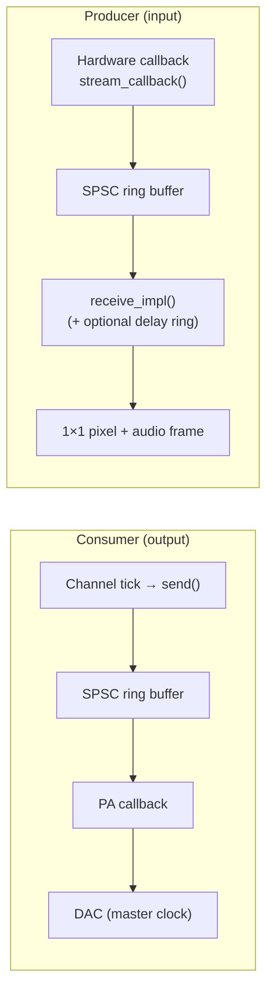

# PortAudio Module

## Overview

The PortAudio module provides professional audio I/O for CasparCG Server via the PortAudio library (v19.7.0, statically linked). It supports ASIO, WASAPI, and DirectSound host APIs on Windows, and ALSA/JACK on Linux, enabling multi-channel output to professional audio interfaces and low-latency capture from any input device.

The module provides three components:

- **Consumer** — Audio output to any PortAudio-compatible device (USB interfaces, ASIO, Dante, MADI). Acts as a master synchronisation clock for the channel.
- **Producer** — Audio capture from any input device (microphones, line-in, virtual cables, Dante receivers) into a CasparCG layer.
- **Shared utilities** — Device enumeration, host API selection, and a lock-free SPSC ring buffer used by both consumer and producer.

The LTC timecode module also uses PortAudio internally for its audio capture stream.

## Module Structure

```
src/modules/portaudio/
├── portaudio_module.h/cpp          Module lifecycle (init/uninit)
├── consumer/
│   └── portaudio_consumer.h/cpp    Audio output consumer
├── producer/
│   └── portaudio_producer.h/cpp    Audio capture producer
├── util/
│   ├── portaudio_device.h/cpp      Device manager singleton + shared capture registry
│   ├── shared_capture.h            Shared capture stream (one PaStream per device)
│   └── spsc_ring_buffer.h          Lock-free ring buffer
└── CMakeLists.txt                  Build config + FetchContent
```

## Architecture



### Consumer (Audio Output)

The consumer bridges CasparCG's push model (one audio buffer per video frame) with PortAudio's pull model (hardware callback requests samples at its own rate).

```
Channel tick                    Hardware callback
    │                                │
    ▼                                ▼
  send()                        stream_callback()
    │                                │
    ▼                                ▼
  Queue ──► Write Thread ──► SPSC Ring Buffer ──► PA Callback ──► DAC
              │         blocks on              reads lock-free
              │         drain_cv_              notifies drain_cv_
              ▼
         future completes
         (master clock)
```

**Key design decisions:**

1. **Master clock via ring buffer backpressure.** The write thread blocks until the hardware drains enough space from the ring buffer. This makes the audio device's crystal oscillator pace the entire channel, identical to how DeckLink consumers work. `has_synchronization_clock()` returns `true`.

2. **Dedicated write thread.** `send()` posts work to a queue and returns a `std::future` immediately. The write thread does the blocking. This allows the PortAudio consumer's future to be awaited in parallel with other consumers (e.g. DeckLink) rather than serialising them.

3. **Hardware-optimal callback size.** The stream is opened with `paFramesPerBufferUnspecified`, letting the driver choose the ideal callback granularity for the device.

4. **Average cadence for buffer sizing.** The ring buffer is sized using the average of the audio cadence array, not the minimum. This prevents cumulative drift on variable-cadence formats like NTSC 29.97fps (cadence pattern 1602, 1601, 1602, 1601, 1602).

5. **Condition variable drain notification.** The PA callback signals `drain_cv_` after every read, replacing a spin-wait loop and reducing CPU usage.

6. **Device hot-unplug detection.** The write thread checks `Pa_IsStreamActive()` before each write and logs a warning if the stream has stopped unexpectedly.

### Producer (Audio Capture)

The producer captures audio from an input device and delivers it as audio-only frames to the CasparCG mixer. It supports two capture modes:

**Direct mode** (default for WASAPI/DS): each producer opens its own `PaStream`.

```
Hardware callback                  Channel tick
    │                                  │
    ▼                                  ▼
  stream_callback()              receive_impl()
    │                                  │
    ▼                                  ▼
  SPSC Ring Buffer ◄── write    read ──► get_frame()
  (lock-free)                          │
                                       ▼
                                  Channel extract
                                  [FROM..FROM+COUNT)
                                       │
                                       ▼
                                  Delay ring (opt)
                                       │
                                       ▼
                                  1×1 pixel frame
                                  + audio_data()
```

**Shared mode** (automatic for ASIO, opt-in via `SHARED`): multiple producers share one `PaStream` through `shared_portaudio_capture`.

```
Single PaStream (shared)              Per-producer
    │                                     │
    ▼                                     ▼
  pa_callback()                      on_captured_audio()
    │                                     │
    ▼                                     ▼
  Shared ring ──► pump thread ──► Listener ring buffer
                  distributes         │
                  to all listeners    ▼
                                  get_frame() → channel extract → delay → frame
```

**Key design decisions:**

1. **Lock-free capture callback.** The PA callback writes directly into an SPSC ring buffer with no mutex. This is critical — audio callbacks run on a real-time thread where blocking can cause glitches or driver dropouts.

2. **Minimal video frame allocation.** Audio-only producers create a 1×1 transparent BGRA pixel instead of a full-resolution frame. On a 1080p channel this saves ~8 MB per frame of unnecessary allocation.

3. **5-second ring buffer.** The capture buffer holds up to 5 seconds of audio, preventing unbounded memory growth if the CasparCG mixer stalls momentarily.

4. **Channel extraction in `get_frame()`.** The PA stream always captures the full device channel width. Channel selection (`FROM`/`COUNT` or `MAP`) happens after reading from the ring buffer, in the mixer's thread — not in the audio callback.

5. **Delay compensation via secondary ring buffer.** When `DELAY` is set, a second ring buffer pre-filled with silence sits between the capture ring and the output. This adds a precise, sample-accurate delay without modifying the capture path.

6. **Shared capture for ASIO.** ASIO only allows one stream per device. The `shared_portaudio_capture` class (modelled on DeckLink's `SharedDeckLinkInput`) owns a single `PaStream` per device, with ref-counted lifecycle via `shared_ptr`. A pump thread reads from the shared ring buffer and distributes to all registered listeners. When the last producer releases its reference, the stream is stopped automatically.

7. **Hot-plug detection.** Shared captures monitor `Pa_IsStreamActive()` and set a `disconnected_` flag when the device disappears, notifying all registered producers.

### SPSC Ring Buffer

Both consumer and producer use `spsc_ring_buffer`, a single-producer single-consumer lock-free ring buffer for `int32_t` samples.

- Power-of-two capacity (auto-rounded, minimum 64 samples)
- Wrap-around via bitmask (`pos & mask_`)
- `alignas(64)` on atomic counters to prevent false sharing
- `memory_order_acquire`/`release` on counter loads/stores
- Bulk `memcpy` with two-chunk wrap handling

### Device Manager

`portaudio_device_manager` is a singleton that owns the PortAudio lifecycle (`Pa_Initialize` / `Pa_Terminate`) and provides device enumeration, matching, and shared capture stream management.

**Host API priority** (auto mode): ASIO → WASAPI → system default.

**Device name matching** (two-pass):
1. Exact match (case-sensitive)
2. Substring match (case-insensitive)

If no match is found, the default device for the selected host API is used.

**Shared capture registry:** The device manager maintains a `map<int, weak_ptr<shared_portaudio_capture>>` keyed by device index. `get_shared_capture()` returns an existing live stream or creates a new one. When the last `shared_ptr` expires the entry auto-cleans.

### LTC Integration

The LTC timecode module (`src/modules/ltc/`) uses PortAudio independently for its own mono float32 capture stream. It has a dedicated `Pa_Initialize`/`Pa_Terminate` cycle managed by `ltc::uninit()`, which runs before PortAudio's global `Pa_Terminate` in the module shutdown sequence.

## Configuration

### Consumer — XML (casparcg.config)

```xml
<channel>
  <video-mode>1080i5000</video-mode>
  <consumers>
    <portaudio>
      <device>Focusrite</device>
      <host-api>asio</host-api>
      <channels>8</channels>
      <buffer-size>4</buffer-size>
      <delay>0</delay>
      <channel-map>0,1,0,1,-1,-1,-1,-1</channel-map>
    </portaudio>
  </consumers>
</channel>
```

| Element | Default | Description |
|---|---|---|
| `<device>` | *(empty = default device)* | Partial device name, case-insensitive substring match |
| `<host-api>` | `auto` | `auto`, `asio`, `wasapi`, `directsound` (alias: `ds`) |
| `<channels>` | `2` | Number of output channels (clamped to device maximum). Overridden by `<channel-map>` size if present |
| `<buffer-size>` | `4` | Ring buffer depth in video frames |
| `<delay>` | `0` | Pipeline delay compensation in video frames (pre-fills silence) |
| `<channel-map>` | *(empty = 1:1)* | Comma-separated routing: each value is the source channel index for that output (-1 = silence). Size determines output channel count |

### Consumer — AMCP

```
ADD [channel] PORTAUDIO [device] [DEVICE=name] [API=api] [CHANNELS=n] [BUFFER=n] [DELAY=n] [MAP=list]
```

All parameters are optional. Examples:

```bash
# Default device, stereo, auto API
ADD 1 PORTAUDIO

# Named device with keyword params
ADD 1 PORTAUDIO DEVICE=Focusrite API=asio CHANNELS=8

# Positional device name (first non-keyword arg)
ADD 1 PORTAUDIO "Dante Virtual Soundcard" CHANNELS=16

# Channel routing matrix: duplicate L/R to outputs 1-4, silence on 5-8
ADD 1 PORTAUDIO DEVICE=RME CHANNELS=8 MAP=0,1,0,1,-1,-1,-1,-1
```

### Producer — AMCP

```
PLAY [channel]-[layer] portaudio [device] [DEVICE=name] [API=api] [CHANNELS=n] [FROM=n] [COUNT=n] [MAP=list] [DELAY=ms] [DELAY_FRAMES=n] [SHARED]
```

| Parameter | Default | Description |
|---|---|---|
| `DEVICE=` | *(default device)* | Partial device name match |
| `API=` | `auto` | Host API: `auto`, `asio`, `wasapi`, `directsound`/`ds` |
| `CHANNELS=` | *(all)* | Device stream channel count (how many channels to open) |
| `FROM=` | `0` | First device channel to capture (0-indexed) |
| `COUNT=` | *(all from FROM)* | Number of channels to extract from the device |
| `MAP=` | *(none)* | Non-contiguous channel picks, e.g. `MAP=0,3,7`. Overrides FROM/COUNT |
| `DELAY=` | `0` | Delay compensation in milliseconds |
| `DELAY_FRAMES=` | `0` | Delay compensation in video frames (converted to ms internally) |
| `SHARED` | *(off)* | Force shared capture mode. Auto-enabled for ASIO devices |

Examples:

```bash
# Default capture device, stereo
PLAY 1-10 portaudio

# Specific device
PLAY 1-10 portaudio DEVICE="Line In (Focusrite)" API=asio CHANNELS=2

# Dante 64-ch: capture channels 0-1 with 40ms delay
PLAY 1-10 portaudio DEVICE=Dante FROM=0 COUNT=2 DELAY=40

# Same device, channels 2-3 for camera 2
PLAY 2-10 portaudio DEVICE=Dante FROM=2 COUNT=2 DELAY=40

# Non-contiguous: pick channels 0, 5, 10 from a 16-ch device
PLAY 3-10 portaudio DEVICE=Dante MAP=0,5,10

# Shared mode explicit (auto for ASIO)
PLAY 1-10 portaudio DEVICE=Dante API=wasapi SHARED FROM=0 COUNT=2
```

### Producer — XML (casparcg.config)

Producers use the AMCP command syntax inside a `<producer>` element:

```xml
<channel>
  <video-mode>1080i5000</video-mode>
  <producers>
    <producer id="10">portaudio DEVICE=Focusrite API=asio CHANNELS=2</producer>
    <producer id="11">portaudio DEVICE=Dante FROM=0 COUNT=2 DELAY=40</producer>
    <producer id="12">portaudio DEVICE=Dante FROM=2 COUNT=2 DELAY=40</producer>
    <producer id="13">portaudio DEVICE=Dante MAP=0,5,10</producer>
  </producers>
</channel>
```

### Host API Values

| Value | API | Notes |
|---|---|---|
| `auto` | Auto-select | Tries ASIO first, then WASAPI, then system default |
| `asio` | ASIO | Requires ASIO SDK at build time + ASIO driver at runtime |
| `wasapi` | Windows Audio Session API | Default on most Windows systems, shared or exclusive mode |
| `directsound` / `ds` | DirectSound | Legacy, higher latency |

### ASIO Support

ASIO is optional at build time. Set `ASIOSDK_ROOT_DIR` to the Steinberg ASIO SDK path before configuring CMake:

```
cmake -DASIOSDK_ROOT_DIR=C:/ASIOSDK2.3.3 ../src
```

If not set, the module builds with WASAPI and DirectSound only.

## Operation Manual

### Scenario 1: Professional Audio Interface (ASIO)

**Use case:** Route CasparCG audio to a Focusrite, RME, or Dante interface with 8+ channels via ASIO for lowest latency.

```xml
<portaudio>
  <device>Focusrite</device>
  <host-api>asio</host-api>
  <channels>8</channels>
  <buffer-size>4</buffer-size>
</portaudio>
```

**Requirements:**
- ASIO driver installed for the device
- CasparCG built with `ASIOSDK_ROOT_DIR` set
- Device sample rate set to 48 kHz in the ASIO control panel

**Notes:**
- ASIO provides exclusive device access — no other application can use the device simultaneously.
- ASIO gives the lowest achievable latency and the most stable clock.

### Scenario 2: System Audio Output (WASAPI)

**Use case:** Output to a standard Windows audio device (headphones, USB speakers, HDMI audio) without ASIO drivers.

```xml
<portaudio>
  <host-api>wasapi</host-api>
  <channels>2</channels>
</portaudio>
```

Or via AMCP:
```bash
ADD 1 PORTAUDIO API=wasapi
```

**Notes:**
- WASAPI shared mode allows other applications to use the device simultaneously.
- Set the device to 48 kHz / 24-bit in Windows Sound Settings → Properties → Advanced to avoid resampling.

### Scenario 3: Live Audio Capture (Voice-over, Line In)

**Use case:** Bring live audio from a microphone or line-in into a CasparCG layer.

```bash
PLAY 1-10 portaudio DEVICE="Microphone" CHANNELS=2
```

Or preconfigured in casparcg.config:
```xml
<producers>
  <producer id="10">portaudio DEVICE=Microphone CHANNELS=2</producer>
</producers>
```

The audio appears on layer 10 and is mixed with other layers by the CasparCG mixer. Control its volume with:
```bash
MIXER 1-10 VOLUME 0.8
```

### Scenario 4: Virtual Audio Cable Routing

**Use case:** Capture audio from another application (media player, DAW, browser) via a virtual cable.

1. Install [VB-CABLE](https://vb-audio.com/Cable/), [Voicemeeter](https://vb-audio.com/Voicemeeter/), or similar virtual audio device.
2. Configure the source application to output to the virtual cable.
3. Capture in CasparCG:

```bash
PLAY 1-10 portaudio DEVICE="CABLE Output"
```

### Scenario 5: Dante / AES67 / Ravenna (IP-Based Audio)

**Use case:** Output to or capture from an IP audio network (Dante, AES67, Ravenna).

CasparCG does not implement any IP audio protocol directly. Instead, these protocols are handled by a **virtual soundcard driver** that runs on the same machine and presents the network audio streams as standard ASIO or WASAPI devices. The PortAudio module sees them like any other audio interface.

**Common virtual soundcard drivers:**

| Driver | Protocol | Cost | Notes |
|---|---|---|---|
| Dante Virtual Soundcard (DVS) | Dante + AES67 | ~$30 (one-time) | Most widely used in broadcast. ASIO mode recommended |
| Dante Via | Dante + AES67 | ~$50 (one-time) | Routes any application audio to Dante, more flexible |
| Merging RAVENNA ASIO | AES67 / Ravenna | Free | Works with generic AES67 streams |

**Network requirements:**
- Any GbE NIC works. Intel i210/i225/i226 chipsets are recommended for their hardware PTP (IEEE 1588) timestamping, which provides more stable clock synchronisation.
- A dedicated or VLAN-isolated network is recommended for production use to avoid jitter from other traffic.
- All devices must be on the same PTP clock domain. The virtual soundcard driver handles PTP participation automatically.

**Output (consumer):**
```xml
<portaudio>
  <device>Dante Virtual Soundcard</device>
  <host-api>asio</host-api>
  <channels>16</channels>
</portaudio>
```

**Input (producer):**
```bash
PLAY 1-10 portaudio DEVICE="Dante Virtual Soundcard" API=asio CHANNELS=8
```

**Setup steps:**
1. Install the virtual soundcard driver (e.g. DVS) and configure it for ASIO mode.
2. Open Dante Controller (free) and set up audio subscriptions between devices.
3. Set the sample rate to 48 kHz in both the virtual soundcard and Dante Controller.
4. Configure the PortAudio consumer or producer with the virtual soundcard's device name.

### Scenario 6: DeckLink Video + PortAudio Audio

**Use case:** Output video via DeckLink (with embedded audio disabled) and route audio separately to a dedicated audio interface.

```xml
<channel>
  <video-mode>1080i5000</video-mode>
  <consumers>
    <decklink>
      <device>1</device>
      <embedded-audio>false</embedded-audio>
    </decklink>
    <portaudio>
      <device>RME</device>
      <host-api>asio</host-api>
      <channels>8</channels>
    </portaudio>
  </consumers>
</channel>
```

Both consumers run as master clocks. The channel tick is paced by whichever consumer's `send()` future completes last (both block until their hardware accepts the frame). The DeckLink's genlock and the audio interface's crystal oscillator run independently — the ring buffer absorbs the minor drift between them.

### Scenario 7: LTC Timecode Input

The LTC module uses PortAudio independently for timecode capture. It does not conflict with the PortAudio consumer or producer — each opens its own PA stream.

Configure the LTC capture device in casparcg.config:
```xml
<ltc>
  <device>Line In</device>
</ltc>
```

### Scenario 8: ISO Recording with Dante Audio

**Use case:** Record individual camera ISO files, each with SDI video from DeckLink and specific audio channels from a shared Dante device. For example, 3 cameras each getting their own stereo pair from a 64-channel Dante interface.

The key challenge is that ASIO only allows one stream per device. The PortAudio producer's **shared capture** mode solves this — multiple producers register as listeners on a single stream, each extracting different channels.

**Configuration:**

```xml
<channels>
    <!-- Camera 1 ISO: DeckLink 1 video + Dante ch 0-1 audio -->
    <channel>
        <video-mode>1080i5000</video-mode>
        <consumers>
            <ffmpeg>recording/cam1_iso.mxf -codec:v prores_ks -codec:a pcm_s24le</ffmpeg>
        </consumers>
        <producers>
            <producer id="0">DECKLINK DEVICE 1</producer>
            <producer id="10">portaudio DEVICE=Dante API=asio FROM=0 COUNT=2 DELAY=40</producer>
        </producers>
    </channel>

    <!-- Camera 2 ISO: DeckLink 2 video + Dante ch 2-3 audio -->
    <channel>
        <video-mode>1080i5000</video-mode>
        <consumers>
            <ffmpeg>recording/cam2_iso.mxf -codec:v prores_ks -codec:a pcm_s24le</ffmpeg>
        </consumers>
        <producers>
            <producer id="0">DECKLINK DEVICE 2</producer>
            <producer id="10">portaudio DEVICE=Dante API=asio FROM=2 COUNT=2 DELAY=40</producer>
        </producers>
    </channel>

    <!-- Camera 3 ISO: DeckLink 3 video + Dante ch 4-5 audio -->
    <channel>
        <video-mode>1080i5000</video-mode>
        <consumers>
            <ffmpeg>recording/cam3_iso.mxf -codec:v prores_ks -codec:a pcm_s24le</ffmpeg>
        </consumers>
        <producers>
            <producer id="0">DECKLINK DEVICE 3</producer>
            <producer id="10">portaudio DEVICE=Dante API=asio FROM=4 COUNT=2 DELAY=40</producer>
        </producers>
    </channel>
</channels>
```

**How it works:**
- All three `portaudio` producers target the same Dante device with `API=asio`. Because ASIO is detected, shared capture mode activates automatically.
- The first producer to initialise creates the shared `PaStream`. Producers 2 and 3 attach as listeners.
- Each producer extracts its own stereo pair (`FROM=0 COUNT=2`, `FROM=2 COUNT=2`, `FROM=4 COUNT=2`) from the full device-width capture.
- `DELAY=40` adds 40ms of audio delay to compensate for the SDI video pipeline latency (DeckLink capture → GPU → mixer), keeping audio and video in sync in the recorded files.
- When a channel is stopped, its producer releases its shared_ptr; the shared stream stays open for the remaining producers.

### Scenario 9: Vulkan Output + PortAudio Audio

**Use case:** Output video via the Vulkan output consumer (direct display or fullscreen exclusive) and route audio separately to a professional audio interface. Common for LED wall setups, preview monitors, and any workflow where video goes to a GPU output and audio to a dedicated DAC.

```xml
<channel>
  <video-mode>1080p5000</video-mode>
  <consumers>
    <vulkan-output>
      <gpu>0</gpu>
      <device>1</device>
      <buffer-depth>4</buffer-depth>
      <delay>3</delay>
      <delay-ms>5</delay-ms>
    </vulkan-output>
    <portaudio>
      <device>Focusrite</device>
      <host-api>asio</host-api>
      <channels>2</channels>
      <buffer-size>3</buffer-size>
    </portaudio>
  </consumers>
</channel>
```

Or via AMCP:
```bash
ADD 1 VULKAN_OUTPUT 1 0 DELAY 3 DELAY_MS 5
ADD 1 PORTAUDIO DEVICE=Focusrite API=asio CHANNELS=2 BUFFER=3
```

The Vulkan consumer takes output index and GPU index as positional parameters (`1 0`), with `DELAY`, `DELAY_MS`, and `MODE` as keyword-value pairs. The PortAudio consumer uses `KEY=VALUE` syntax.

**How it works:**

The PortAudio consumer is the **master clock** for the channel (`has_synchronization_clock() = true`). The Vulkan output consumer does **not** provide a clock (`has_synchronization_clock() = false`). This means:

1. The audio hardware's crystal oscillator paces every channel tick via ring buffer backpressure.
2. Both consumers receive the same frame at the same tick — no production-rate drift between them, ever.
3. The Vulkan consumer pushes frames into a buffer queue; its present thread displays them at the next vsync. If the display's vsync rate drifts slightly against the audio clock (~50ppm), the buffer absorbs it transparently — at most one frame repeat or skip per minute, imperceptible to viewers.

**The latency compensation problem:**

Although both consumers receive frames simultaneously, their output pipelines have different depths:

- **Audio path:** Frame audio → ring buffer (nearly full at steady state) → PA callback → DAC. Pipeline depth ≈ `(buffer-size + 1)` video frames.
- **Video path:** Frame video → buffer queue → present thread → GPU → next vsync. Pipeline depth ≈ `(delay + 1)` video frames (where `delay` = Vulkan's `<delay>` parameter).

Without compensation, audio **lags** video because the ring buffer holds more frames in its pipeline than the Vulkan present path. The Vulkan `<delay>` parameter corrects this by holding video frames in the buffer before presenting, matching the audio pipeline depth.

**Delay formula:**

```
vulkan <delay> ≈ portaudio <buffer-size>
vulkan <buffer-depth> ≥ vulkan <delay> + 1
vulkan <delay-ms>     fine-tune residual offset (measure with lip-sync analyzer)
```

| PortAudio buffer-size | Vulkan delay | Vulkan buffer-depth | Expected accuracy |
|---|---|---|---|
| 2 | 2 | 3 | ±10ms, ~65ms total pipeline |
| 3 | 3 | 4 | ±10ms, ~85ms total pipeline |
| 4 (default) | 4 | 5 | ±10ms, ~105ms total pipeline |

The `<delay-ms>` parameter adds a sub-frame hold (in milliseconds) on top of the frame-granularity `<delay>`. Use it to trim the last few ms of A/V offset that integer frames can't reach — for example, if a lip-sync analyzer shows audio arriving 5ms late, set `<delay-ms>5</delay-ms>` to hold video an extra 5ms. This is the same workflow used by disguise and Pixera for their per-output delay trim.

**Expected lip-sync accuracy:**

Once the delay is configured, the A/V offset is fixed (no drift over time) with residual jitter of **±10–15ms typical, ±20ms worst case**. This is determined by:

- Vsync alignment jitter: ±0.5 frames (the channel tick is audio-locked, not vsync-locked, so frame submission rotates relative to the vsync edge)
- PA callback granularity: ±half a hardware buffer period (~±2.7ms for 256-sample ASIO)

This is well within the EBU R37 broadcast threshold (±40ms) and the ITU-R BT.1359 perceptibility threshold (±20ms). No drift accumulates over time because the audio clock is the single timing source for the entire channel.

**Why no drift?**

The PortAudio consumer's ring buffer backpressure paces every channel tick. The audio clock is the sole timing reference — there is no "video clock vs audio clock" conflict. The Vulkan display's vsync is a free-running consumer: it takes whatever frame is newest in the buffer at each refresh. Minor rate differences (display at 50.001 Hz vs audio at exactly 50 Hz) cause the buffer level to slowly oscillate by ±1 frame, absorbed silently. Audio plays without interruption.

This is the "audio-scheduled video" architecture — the same approach validated in [CasparCG PR #1714](https://github.com/CasparCG/server/pull/1714) for OAL/screen consumers, extended to the Vulkan output path.

**Tighter sync (optional):**

If the display is genlocked to the same reference clock as the audio device (e.g. both locked to house sync via Quadro Sync II + word clock), vsync jitter drops to ±1–2ms, achieving near-SDI-level lip-sync accuracy.

**Notes:**
- The Vulkan consumer drops the oldest frame when its buffer is full rather than blocking the channel. This prevents a slow display from throttling audio.
- For lowest audio latency, use ASIO. WASAPI adds ~10ms of extra driver buffer compared to ASIO.
- The `delay` values above are starting points. Fine-tune with `<delay-ms>` and a lip-sync analyzer if ±10ms precision is needed. A simple field test: play a clapper/slate clip and compare the visual clap frame to the audio transient on a scope or by ear.
- The same `<delay-ms>` parameter can also compensate for external downstream latency (scalers, LED processors, audio DSP chains), just as `delay` compensates in whole frames.

## Channel Mapping

### Consumer (Output)

By default, the consumer maps channels 1:1: output channel N receives source channel N. If the source has fewer channels than the output, excess output channels are zero-filled (silence).

With `MAP=` or `<channel-map>`, you can define arbitrary routing. Each entry specifies which source channel feeds that output position (-1 = silence).

| Configuration | Output result |
|---|---|
| `CHANNELS=2` (no map) | L→1, R→2 |
| `CHANNELS=8` (no map) | ch1→1, ch2→2, ..., ch3-8 silence if source is stereo |
| `MAP=0,1,0,1` | L→1, R→2, L→3, R→4 (stereo duplicated) |
| `MAP=1,0` | R→1, L→2 (swapped) |
| `MAP=0,-1,-1,-1,1,-1,-1,-1` | L on out1, R on out5, rest silence |

### Producer (Input)

By default, the producer captures all device channels and delivers them to the CasparCG mixer.

With `FROM=`/`COUNT=`, you select a contiguous range from the device. With `MAP=`, you pick arbitrary (possibly non-contiguous) device channels.

| Configuration | Captured channels |
|---|---|
| *(no params)* | All device channels |
| `FROM=0 COUNT=2` | Device ch 0, 1 |
| `FROM=4 COUNT=2` | Device ch 4, 5 |
| `MAP=0,3,7` | Device ch 0, 3, 7 (non-contiguous) |
| `CHANNELS=16 FROM=8 COUNT=4` | Open 16-ch stream, extract ch 8-11 |

### Shared Capture (ASIO / Explicit)

When multiple producers target the same device (same device index), they can share a single `PaStream`. This is required for ASIO (exclusive access) and optional but beneficial for WASAPI/DS (reduces threads and ensures clock coherence).

Shared mode is **automatic** for ASIO devices and can be forced with the `SHARED` keyword for other APIs.

```bash
# Three producers sharing one Dante ASIO device, each picking different channels
PLAY 1-10 portaudio DEVICE=Dante API=asio FROM=0 COUNT=2 DELAY=40
PLAY 2-10 portaudio DEVICE=Dante API=asio FROM=2 COUNT=2 DELAY=40
PLAY 3-10 portaudio DEVICE=Dante API=asio FROM=4 COUNT=2 DELAY=40
```

The first producer creates the shared stream; subsequent producers attach as listeners. The stream closes automatically when the last producer is removed.

### Delay Compensation

The `DELAY=` (milliseconds) or `DELAY_FRAMES=` (video frames) parameter inserts a precise delay between audio capture and delivery to the mixer. This compensates for external pipeline latency (e.g. SDI video processing delay vs. direct Dante audio path).

Internally, a secondary ring buffer pre-filled with silence sits between the capture buffer and `get_frame()`. Audio passes through this delay buffer FIFO-style, emerging exactly `DELAY` milliseconds later.

## Diagnostics

The consumer registers a diagnostics graph with these traces:

| Trace | Color | Description |
|---|---|---|
| `tick-time` | Blue | Time between successive `send()` completions, normalised to frame duration |
| `buffer-fill` | Green | Ring buffer fill ratio (0.0 = empty, 1.0 = full) |
| `underrun` | Red | PA callback requested more samples than available |
| `overflow` | Orange | Write thread could not fit all samples into the ring buffer |

Monitor state (available via OSC):

| Key | Type | Description |
|---|---|---|
| `buffer/fill` | int64 | Samples currently in the ring buffer |
| `buffer/underruns` | int64 | Cumulative underrun count |
| `buffer/overflows` | int64 | Cumulative overflow count |

## Best Practices

1. **Match sample rates.** Set the audio device to 48 kHz (CasparCG's native rate) in its driver or control panel. Mismatched rates cause resampling artefacts or drift.

2. **Use ASIO when available.** ASIO provides exclusive device access, lowest latency, and the most stable clock. WASAPI shared mode adds an extra mixing stage and slightly higher latency.

3. **Keep buffer-size at 4.** The default ring buffer depth of 4 video frames provides a good balance between latency (~80ms at 50fps) and resilience to scheduling jitter. Reduce to 2 for lower latency if the system is dedicated to CasparCG; increase to 6–8 if you see underrun warnings.

4. **Use delay compensation for external pipelines.** If your audio goes through an external processing chain (e.g. Dante network → DSP → amplifiers), set `<delay>` to the number of video frames of additional latency to keep audio and video in sync.

5. **Check logs on startup.** The device manager logs all detected host APIs and devices at initialisation. Use this to verify device names and channel counts before configuring.

6. **One ASIO device per host.** Most ASIO drivers only allow a single application to open the device. If CasparCG holds the ASIO device, DAWs or other applications cannot access it.

7. **Producer captures are audio-only.** The PortAudio producer creates minimal 1×1 transparent video frames. Layer it behind your video content — it will not affect the video output.

## Troubleshooting

| Symptom | Cause | Fix |
|---|---|---|
| No audio output | Wrong device name | Check startup logs for available devices; use a substring that uniquely matches |
| No audio output | Wrong host API | Try `auto` or explicitly set `wasapi` if ASIO is not installed |
| Audio glitches / underruns | Buffer too small | Increase `<buffer-size>` to 6 or 8 |
| Audio glitches / underruns | Sample rate mismatch | Set device to 48 kHz in its control panel |
| Audio drift over time | Clock mismatch with video | The PortAudio consumer is a master clock — drift against DeckLink is absorbed by the ring buffer. If drift is severe (>1 frame), check that both devices are on the same clock domain or use genlock |
| "ASIO host API not found" | ASIO SDK not included in build | Rebuild with `-DASIOSDK_ROOT_DIR=path/to/sdk` |
| "ASIO host API not found" | No ASIO driver installed | Install hardware ASIO driver, ASIO4ALL, or FlexASIO |
| Device not found | Device connected after CasparCG started | Restart CasparCG — device enumeration happens at startup |
| Producer silence | Microphone permissions | Windows Settings → Privacy → Microphone → allow CasparCG |
| Producer silence | Wrong capture device | Try without `DEVICE=` to use the system default |
| "Audio device disconnected" warning | USB device unplugged | Reconnect device and restart the consumer (`REMOVE` then `ADD`) |