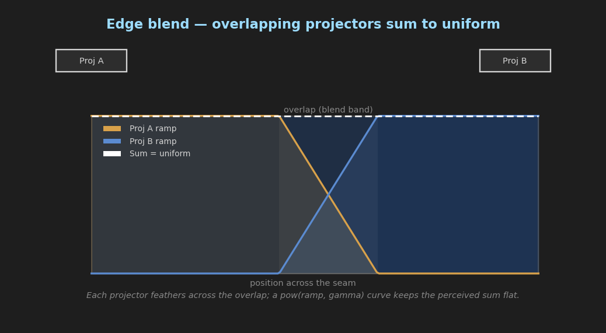

# Camera-Based Projection Calibration

> Part of the [CasparCG 360° Client Operations Guide](OPERATIONS_GUIDE.md) — this
> is the in-depth reference for the **▣ Projection** tab. For the rest of the app
> (Stage / previz, tracking, LED calibration, colour pipeline, rundown) start
> with the operations guide.

Geometry calibration for projection-mapped surfaces, driven from a **camera that
films the projected surface** and applied through CasparVP's existing per-layer
mixer geometry commands. This mirrors the camera-vision approach used by systems
like disguise OmniCal, but the solve runs in the client and the result is pushed
to the server over AMCP.

> The Projection tab is organised into sub-tabs that follow the calibration
> phases:
>
> * **Corner-Pin** (Phase A) — automatic keystone via `MIXER PERSPECTIVE`.
> * **Distortion & Blend** (Phase B) — optical lens distortion
>   (`MIXER PROJECTION_DISTORTION`) and multi-projector edge blending
>   (`MIXER PROJECTION_BLEND`).
> * **Diagnostics** (Phase C) — uniformity / focus / contrast / luminance
>   readouts plus closed-loop **distortion validation** (grid straightness);
>   analysis only, no AMCP apply.
> * **Dense Warp** (Phase D) — Gray-code structured light → per-vertex warp
>   mesh (`MIXER MESH` with a generated `.glb`).
> * **Multi-projector** (Phase E) — shared-target or multi-view world-UV
>   alignment of several overlapping projectors (`multi_projector.py`,
>   `surface_registration.py`), with optional **per-pixel blend masks**
>   (`MIXER PROJECTION_BLEND_MASK`, generated by `blend_mask.py`) and an
>   **auto blend-gamma fit**.

## How it works

1. **Resolve resolution** — the client reads the channel's video format via
   `INFO <channel>` and renders patterns at the **native pixel resolution** so
   camera-side detection maps 1:1 to content pixels.
2. **Project a pattern** — a checkerboard or ArUco board is generated and played
   full-frame with an **identity perspective**, so the solve sees undistorted
   content.
3. **Capture the camera return** — from an image folder / single file, or a live
   USB/UVC camera.
4. **Solve** — OpenCV detects the pattern, fits a `content → camera` homography,
   and derives the corner-pin positions that rectify the content to the desired
   target quad.
5. **Apply** — the result is sent as `MIXER <ch>-<layer> PERSPECTIVE …`.

The camera return is **not** the embedded output preview (that is the signal we
*send*); it is a separate camera looking at the physical surface.

## Requirements

* `opencv-contrib-python >= 4.8` — required for ArUco patterns and live UVC
  capture. Checkerboard generation and single-image ingest also work without it
  (numpy / Qt fallbacks), but installing OpenCV is strongly recommended.

```bash
pip install opencv-contrib-python
```

## Workflow (Projection tab)

| Step | Control | Action |
| :--- | :--- | :--- |
| Setup | Channel / Layer | Target layer that carries the content. |
| Setup | Query (INFO) | Fill resolution from the channel's video format. |
| Camera Return | Source / Capture | Grab a frame from an image folder/file or a UVC device (shared by all sub-tabs). |
| Corner-Pin | Generate + Play | Render at channel resolution and `PLAY` full-frame with identity perspective. |
| Corner-Pin | Solve Corner-Pin | Detect the pattern and compute corner-pin values. |
| Corner-Pin | Apply → PERSPECTIVE | Send `MIXER <ch>-<l> PERSPECTIVE`. |
| Corner-Pin | Reset Perspective | Restore identity corner-pin on the layer. |

Settings persist per channel to `projcal_config.json` (git-ignored).

## Pattern types

| Pattern | Needs OpenCV | Notes |
| :--- | :--- | :--- |
| Checkerboard | No (numpy) | Dense sub-pixel corners; needs the whole board visible and in focus. |
| ArUco board | Yes | Marker IDs give robust correspondence under steep angles or partial occlusion. |

Patterns are generated on demand at the channel's exact resolution — they cannot
be pre-baked, because a fixed-resolution pattern would not map 1:1 to content
pixels (and would break structured-light decode in later phases).

## Server commands used

Phases A–D and the geometry of Phase E are applied through existing per-layer
mixer commands. The only **server-side addition** is the per-pixel blend mask
command `MIXER PROJECTION_BLEND_MASK` (CasparVP, used by the optional Phase E
blend-mask step below); everything else runs against an unmodified server.

```bash
# Phase A — corner-pin (normalised output positions)
MIXER <ch>-<layer> PERSPECTIVE ul_x ul_y ur_x ur_y lr_x lr_y ll_x ll_y [dur] [tween]
#   identity: ul=(0,0) ur=(1,0) lr=(1,1) ll=(0,1)

# Phase B — optical distortion (Brown–Conrady; all-zero = identity)
MIXER <ch>-<layer> PROJECTION_DISTORTION k1 k2 k3 p1 p2 [dur] [tween]

# Phase B — edge blend (normalised band widths; gamma default 2.2)
MIXER <ch>-<layer> PROJECTION_BLEND left right [top bottom gamma] [dur] [tween]

# Phase E — per-pixel blend mask (CasparVP only; RGB PNG multiplied over output)
MIXER <ch>-<layer> PROJECTION_BLEND_MASK "blendmask_left.png"
MIXER <ch>-<layer> PROJECTION_BLEND_MASK NONE   # clear
MIXER <ch>-<layer> PROJECTION_BLEND_MASK        # query → "MASK <w> <h>" or "NONE"

# Phase D — dense warp mesh (path resolved under the server media folder)
MIXER <ch>-<layer> MESH "warp_ch1.glb"
MIXER <ch>-<layer> MESH NONE        # clear
```

## Phase B — Distortion & Blend

* **Lens distortion** — add several **checkerboard** captures from different
  positions, then **Solve Distortion**. `cv_solver.solve_distortion` runs
  `cv2.calibrateCamera` and maps the OpenCV coefficients to the server's
  `k1 k2 k3 p1 p2` order. More views = a more stable fit.
* **Edge blend** — capture the lit area of the **current** projector and of the
  **overlapping neighbour** (both projecting white). The overlap intersection
  drives the per-edge feather bands. Review then **Apply → BLEND**.



### Auto blend-gamma fit

`PROJECTION_BLEND` (and the per-pixel blend masks below) cross-fade with a
`pow(ramp, gamma)` curve. The correct `gamma` is the one that makes the
*perceived* brightness of the cross-fade linear, which depends on the
projector's optical/electrical response — guessing 2.2 is only a starting point.

`cv_solver.estimate_blend_gamma(positions, luminance)` recovers it from a
measurement: project a horizontal ramp (or a single edge-blend band) into the
overlap, capture it, then sample luminance at several normalised positions
across the ramp (0 at the dark edge, 1 at the fully-lit edge). The function fits
`luminance = position ** gamma` as a **scale-invariant** log–log slope, so the
absolute exposure of the capture does not matter, and clamps the result to a
sensible range (default `1.0 … 4.0`).

```python
import numpy as np
import cv_solver

# Sampled across the blend ramp (left = dark edge, right = lit edge):
positions = np.array([0.1, 0.25, 0.4, 0.55, 0.7, 0.85])
luminance = np.array([0.012, 0.07, 0.18, 0.34, 0.55, 0.80])  # measured, any scale

gamma = cv_solver.estimate_blend_gamma(positions, luminance)
# → e.g. 2.31 ; feed straight into PROJECTION_BLEND / the mask gamma spin-box.
```

In the **Multi-Projector** tab the *Blend gamma* spin-box (default 2.2) feeds
both the generated blend masks and is the value you would also pass to
`PROJECTION_BLEND`. Use `estimate_blend_gamma` to replace that default with a
measured number for the specific projector.

## Phase C — Diagnostics

Analysis only — nothing is sent to the server. Capture a frame, then run any of:

| Readout | Meaning |
| :--- | :--- |
| Uniformity | `min/max` luminance ratio over the lit area (1.0 = perfectly even). |
| Focus Map | Per-tile Laplacian variance heatmap (bright = sharper). |
| Black / Contrast | 1st/99th-percentile luminance and the contrast ratio. |
| Luminance Heatmap | Rec.709 luminance rendered as a colour map. |

### Distortion validation (closed loop)

The other phases *apply* a correction; this **verifies** it. Project a
checkerboard **through the corrected layer** (with the lens-distortion solve,
warp mesh, etc. already active), capture it, and measure how straight the grid
actually lands on the surface — a perfectly corrected projection makes every
row and column of the board a straight line.

Press **Validate Distortion (grid straightness)** in the Diagnostics tab (you
must have generated a **checkerboard** pattern first, so its inner-corner count
is known). The client runs `cv_solver.detect_chessboard_corners` then
`cv_solver.grid_straightness_residual`, which fits a best-fit (total-least-
squares) line to each detected row and column and reports the **perpendicular
deviation** of the corners from those lines:

| Metric | Meaning |
| :--- | :--- |
| RMS deviation | Root-mean-square corner-to-line distance, in **camera pixels** (lower = straighter / better corrected). |
| Max deviation | Worst single corner, in camera pixels (catches local kinks the RMS averages out). |

```python
import cv_solver

corners = cv_solver.detect_chessboard_corners(frame, inner_corners=(9, 6))
res = cv_solver.grid_straightness_residual(corners, inner_corners=(9, 6))
print(res.rms, res.max_dev)   # e.g. 0.42 px RMS, 1.1 px max → well corrected
```

Run it **before** and **after** applying a correction: the RMS should drop
sharply once the distortion solve / warp mesh is active. Because it works on the
captured image, it measures the *whole* optical chain (lens + surface + warp),
not just the model the solve assumed.

## Phase D — Dense Warp

For surfaces a 4-corner pin cannot rectify (curved / irregular screens):

1. **Generate Sequence** — render the Gray-code PNG sequence at channel
   resolution (a stack of patterns plus a white and a black frame).
2. Play the sequence and **capture each frame in order** to a folder.
3. Point the **capture folder** at those images and **Decode + Build .glb**.
   `cv_solver.decode_graycode` recovers a dense `camera → projector` map,
   `warp_mesh.build_warp_grid` inverts it into a regular vertex grid, and the
   result is written as a glTF `.glb`.
4. Copy the `.glb` under the server **media folder** and **Apply → MESH**.

### Automated scan (SDI closed loop)

Steps 2–3 can be fully automated when the camera return is wired to a DeckLink
**input** on the server. In the Dense Warp tab's *Automated Scan* group set the
**ingest channel/layer**, **DeckLink device**, **server media folder** and a
**settle** delay, then press **Run Automated Scan (SDI)**. The client:

1. Plays the DeckLink input producer on the ingest channel
   (`PLAY <ingest> DECKLINK <device>`),
2. for each Gray-code frame: `PLAY`s it on the target layer, waits the settle
   delay, then writes the ingest channel to a PNG (`PRINT <ingest> <name>`) and
   reads it back from the media folder,
3. decodes the captured sequence and builds the warp `.glb` automatically.

The Gray-code patterns must live **inside the server media folder** so the
server can `PLAY` them (set the working folder under the media folder before
generating). The same `Server SDI (DeckLink)` source is available in the
**Camera Return** group for single-frame captures on the other tabs.

Modules: `camera_capture.ServerSdiCaptureBackend` performs the
`DECKLINK` + `PRINT` capture; `scan_runner.PatternScanWorker` runs the
play→settle→capture loop on a background thread.

## Phase E — Multi-projector

`multi_projector.py` aligns several overlapping projectors into one seamless
surface. Two modes are supported:

* **Shared target (single viewpoint)** — when every projector's Gray-code is
  decoded against the *same* camera frame, each warp is solved against one
  camera-space quad so they share the same content UV space and the seams line
  up. Pairwise edge blends feather the overlaps.
* **World-UV (multiple viewpoints)** — when projectors are filmed from
  *different* viewpoints, each view carries a
  `surface_registration.SurfaceRegistration` that maps its camera pixels into a
  common **world-UV** frame on the surface, and every warp is built in that
  shared frame. Three registration strategies are available:
  * **Planar Fiducial** — flat surface with ArUco fiducials whose world UVs are
    known; a homography maps camera pixels to world UV.
  * **3D Model + Fiducial** — curved/3D surface described by a textured mesh with
    fiducials at known 3D positions; `solvePnP` recovers the camera pose and
    each camera pixel is ray-cast onto the model to read its surface UV (needs
    camera intrinsics from Phase B).
  * **Feature Stitch** — no fiducials; overlapping camera views are stitched with
    ORB feature homographies, the reference view defining the world frame.

In the **Multi-Projector** tab pick a strategy, supply the views/registration
JSON and the projector list (one `name, channel, layer, capture_folder, view`
per line), then **Build Aligned Meshes** and **Export + Apply All**. Each
projector's Gray-code is decoded from its capture folder, registered to the
shared frame, and built into an aligned `.glb` plus per-edge blend.

### Per-pixel blend masks (`blend_mask.py`)

Rectangular `PROJECTION_BLEND` bands feather straight edges, but overlaps on
curved or non-axis-aligned surfaces have irregular shapes that simple bands
cannot follow. A **per-pixel blend mask** is a grayscale PNG, one per projector,
that the server multiplies over the layer (`PROJECTION_BLEND_MASK`). Where two
projectors overlap, their masks cross-fade so the summed light stays uniform and
the seam disappears.

`blend_mask.py` builds the masks as a **partition of unity in world-UV space**,
reusing the aligned warp grids from Phase E:

1. Each projector's surface coverage is rasterised into a shared world-UV image;
   a distance transform makes a weight that is high in the interior and falls to
   zero at the coverage edge.
2. For a target projector, every warp-grid node's weight is its **own** edge
   distance divided by the **sum** of all overlapping projectors' edge distances
   at the same world point. Single-coverage regions get weight 1; in an overlap
   the contributing projectors' weights sum to 1 (hence "partition of unity").
3. The weights are raised to `1/gamma` so the *perceived* cross-fade is linear
   (see the auto blend-gamma fit in Phase B).
4. Because the warp grid's vertices form a regular grid over the projector
   output, the per-node weights are bilinearly upsampled to the full projector
   resolution and written as a grayscale PNG.

The distance transform prefers SciPy, then OpenCV, then a dependency-free
chamfer fallback, so masks generate even on a minimal install.

**In the UI:** tick **Per-pixel blend masks (PROJECTION_BLEND_MASK)** and set the
**Blend gamma** in the Multi-Projector tab, then **Export + Apply All**. For each
projector the client writes `blendmask_<name>.png` into the project folder and
sends `MIXER <ch>-<layer> PROJECTION_BLEND_MASK "blendmask_<name>.png"`. Copy the
PNGs under the server **media folder** (same rule as `MESH`) so the server can
resolve them.

**From code:**

```python
import multi_projector

# `solves` is the list of ProjectorSolve returned by the Phase E build,
# each carrying its world-UV aligned warp grid.
paths = multi_projector.export_blend_masks(
    solves,
    folder="C:/casparcg/media/proj",   # under the server media folder
    proj_width=1920, proj_height=1080, # projector native resolution
    gamma=2.2,                          # or a measured estimate_blend_gamma()
)
# paths → ["…/blendmask_left.png", "…/blendmask_right.png", …]
# each solve.mask_path is filled in; send PROJECTION_BLEND_MASK with the name.
```

Or generate a single mask directly:

```python
import blend_mask

mask = blend_mask.generate_blend_mask(
    target_grid, all_grids,            # warp grids from multi_projector
    proj_width=1920, proj_height=1080,
    gamma=2.2,
)                                       # → (H, W, 3) uint8 grayscale
blend_mask.save_blend_mask(mask, "blendmask_left.png")
```

> **Tip:** blend masks and `PROJECTION_BLEND` bands are independent — the server
> applies the mask *after* the edge-blend bands. Use bands for a quick straight-
> edge result, masks when the overlap geometry is irregular. They can be combined
> but usually you pick one.

### Global bundle adjustment

When projectors are filmed from *different* viewpoints, each view's registration
is solved independently, so they can drift and a surface point seen by two
cameras lands at slightly different world coordinates — leaving a seam. Enabling
**Global bundle adjustment** (checkbox in the Multi-Projector tab) jointly
refines every view's registration before the world-UV grids are built, so the
views agree on a common frame.

The solver (`bundle_adjust.py`, Approach A — *joint registration refinement*)
optimises each view's parameters together:

* **Planar fiducial** — the 8-DOF homography, parametrised on Hartley-normalised
  camera pixels for conditioning; residuals in world-UV.
* **3D model + PnP** — the 6-DOF camera pose (`rvec`, `tvec`), intrinsics fixed;
  residuals are image-pixel reprojection error.
* **Feature stitch** — the 8-DOF homography into the reference view.

Fiducials seen by more than one view become tie points that couple the views;
fiducials with a *known* world position act as anchors that pin the solution and
fix the gauge. Unanchored shared fiducials (planar/stitch) are triangulated as
free world points. The optimiser uses `scipy.optimize.least_squares` (Trust-
Region Reflective, soft-L1 robust loss) when SciPy is present and falls back to a
numpy Levenberg–Marquardt loop otherwise. The build log reports the alignment
RMS before and after.

```python
import multi_projector

# projectors carry CameraView registrations seeing shared fiducials
result = multi_projector.bundle_adjust_views(projectors)
if result is not None:
    print(result.rms_before, "->", result.rms_after, f"({result.backend})")
multi_projector.solve_world_aligned_grids(projectors)   # now in the refined frame
```

Full projector-as-camera reconstruction (OmniCal-style) remains out of scope;
bundle adjustment refines the *existing* per-view registrations.

## Modules

| File | Responsibility |
| :--- | :--- |
| `camera_capture.py` | Camera sources: image folder/file (`FileSequenceSource`), live UVC (`UvcSource`) and server-side SDI capture (`ServerSdiCaptureBackend`, DeckLink ingest + `PRINT`). |
| `scan_runner.py` | Background worker that plays a pattern sequence and captures one frame per pattern (automated Gray-code scan). |
| `pattern_generator.py` | Render checkerboard / ArUco / Gray-code patterns at channel resolution. |
| `cv_solver.py` | Detect patterns, fit homography/corner-pin, calibrate distortion, estimate blend, decode Gray-code, fit blend gamma (`estimate_blend_gamma`), validate distortion (`grid_straightness_residual`). |
| `warp_mesh.py` | Invert a dense correspondence into a vertex grid and export a glTF `.glb`. Accepts a `uv_fn` to assign content UV from a world-UV registration. |
| `diagnostics.py` | Uniformity / focus / contrast / luminance analysis. |
| `surface_registration.py` | Map camera pixels to a shared world-UV frame (planar-fiducial, 3D-model+PnP ray-cast, or feature-stitch); exposes bundle-adjustment params. |
| `bundle_adjust.py` | Joint refinement of several views' registrations (shared-fiducial tie points + anchors) via SciPy least-squares with a numpy LM fallback. |
| `blend_mask.py` | Per-pixel soft-edge blend masks (partition of unity in world-UV) → grayscale PNG for `PROJECTION_BLEND_MASK`. |
| `multi_projector.py` | Shared-target and world-UV multi-view alignment of several projectors, plus blend-mask export (Phase E). |
| `projection_cal_tab.py` | Orchestration UI and AMCP playout/apply. |

## Tips

* Keep the whole pattern within the camera frame, in focus, and avoid blown
  highlights — clipped whites hurt corner detection.
* For live capture the first few frames are discarded so auto-exposure can
  settle.
* Re-run **Generate + Play** (which resets to identity) before each new solve so
  the homography is measured against undistorted content.
