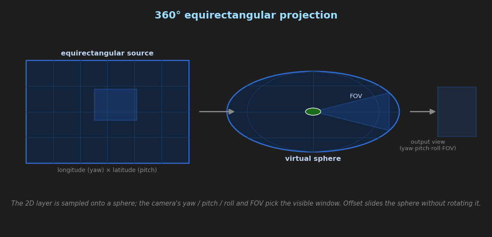

# Virtual Production Features

This feature set introduces GPU-accelerated 360° projection, curved screen compensation, real-time playback speed control, and layer mirroring to CasparCG Server, designed for virtual production, live events, and advanced broadcast workflows.

For color management and grading features, see [COLOR_GRADING.md](COLOR_GRADING.md). For blur, sharpening, and film grain, see [IMAGE_EFFECTS.md](IMAGE_EFFECTS.md). For keyframe animation, see [KEYFRAMES.md](KEYFRAMES.md). For DMX lighting integration, see [DMX_LIGHTING.md](DMX_LIGHTING.md). For LED-wall color calibration, see [LED_CALIBRATION.md](LED_CALIBRATION.md).

## Table of Contents

1. [360° Equirectangular Projection](#-equirectangular-projection)
2. [360° Projection Offset](#-projection-offset)
3. [Curved Screen Compensation](#curved-screen-compensation)
4. [Lens Distortion Correction](#lens-distortion-correction)
5. [Playback Speed Control](#playback-speed-control)
6. [Ping-Pong Loop](#ping-pong-loop)
7. [Flip (Mirror)](#flip-mirror)
8. [Camera Tracking](#camera-tracking)
9. [Shape Overlay](#shape-overlay)
10. [Image Effects](#image-effects)
11. [Keyframe Animation](#keyframe-animation)
12. [DMX Lighting](#dmx-lighting)

## 360° Equirectangular Projection

This feature maps standard 2D layers onto a virtual 360° sphere, allowing for immersive panning and tilting within an equirectangular video stream. It is ideal for virtual production, dome projection, or 360° video workflows.



### AMCP Command

```bash
MIXER [channel]-[layer] PROJECTION [yaw] [pitch] [roll] [fov] [duration] [tween]
MIXER [channel]-[layer] PROJECTION 0 0 0 0         // Disable (FOV 0 = Off)
```

### Parameters

| Parameter | Description | Range / Unit |
| :--- | :--- | :--- |
| **yaw** | Horizontal rotation (Panning) | -180.0 to 180.0 degrees |
| **pitch** | Vertical rotation (Tilting) | -90.0 to 90.0 degrees |
| **roll** | Z-axis rotation (Dutch angle) | -180.0 to 180.0 degrees |
| **fov** | Field of View (Zoom) | 1.0 to 179.0 degrees (0 = Disabled) |
| **duration**| Tween duration in frames | Integer |
| **tween** | Tween curve type | `linear`, `ease`, `ease-in`, `ease-out`, etc. |

### Usage Examples

**1. Standard 360° View**
Set a 90-degree FOV facing forward.
```bash
MIXER 1-10 PROJECTION 0 0 0 90
```

**2. Look Up and Right**
Pan 45° right, look 30° up.
```bash
MIXER 1-10 PROJECTION 45 30 0 90
```

**3. Animated Camera Move**
Smoothly pan 180 degrees over 2 seconds (50 frames at 25fps).
```bash
MIXER 1-10 PROJECTION 180 0 0 90 50 EASEINOUTQUAD
```

---

## 360° Projection Offset

Slides the viewport across the sphere along the X and Y axes **without changing the viewing orientation** (yaw/pitch/roll are unaffected). This is the correct way to reposition a 360° layer on screen independent of the projection command — the sphere wraps continuously so there is never any missing content at the edges.

### AMCP Command

```bash
MIXER [channel]-[layer] PROJECTION_OFFSET [x] [y] [duration] [tween]
MIXER [channel]-[layer] PROJECTION_OFFSET         // Query current offset
```

### Parameters

| Parameter | Description | Range / Unit |
| :--- | :--- | :--- |
| **x** | Horizontal lens-shift | NDC units — `+1.0` = one half-screen width to the right |
| **y** | Vertical lens-shift | NDC units — `+1.0` = one half-screen height upward |
| **duration** | Tween duration in frames | Integer |
| **tween** | Tween curve type | `linear`, `ease`, `ease-in`, `ease-out`, etc. |

> **Note:** NDC (Normalized Device Coordinate) units are relative to the half-screen size. An offset of `1.0` moves the view centre to the edge of the frame. Values beyond `±1.0` are valid and wrap around the sphere.

### Usage Examples

**1. Pan the view right by a quarter screen**
```bash
MIXER 1-10 PROJECTION_OFFSET 0.5 0.0
```

**2. Reset offset to centre**
```bash
MIXER 1-10 PROJECTION_OFFSET 0 0
```

**3. Animated horizontal pan across sphere**
Smoothly drift the viewport right over 100 frames.
```bash
MIXER 1-10 PROJECTION_OFFSET 2.0 0.0 100 LINEAR
```

**4. Combined with PROJECTION**
Set a 90° FOV facing forward, then offset the viewport up slightly.
```bash
MIXER 1-10 PROJECTION 0 0 0 90
MIXER 1-10 PROJECTION_OFFSET 0.0 0.3
```

---

## Curved Screen Compensation

Curved screen compensation pre-warps the UV coordinates of any layer — flat or 360° — so that content appears geometrically correct when projected onto a **physically curved destination surface**. Without compensation, straight lines bow noticeably towards the edges of a curved LED wall or cylindrical cyclorama because each pixel column subtends a different visual angle from the viewer's perspective. This command applies the inverse distortion on the GPU so the viewer sees a perfectly rectilinear image.

The compensation is **fully independent of 360° mode**: it works on standard flat clips, live inputs, and equirectangular 360° layers equally, and it can be set or cleared at any time without touching the `PROJECTION` command.

### AMCP Command

```bash
MIXER [channel]-[layer] PROJECTION_CURVE [type] [arc] [eye_distance] [duration] [tween]
MIXER [channel]-[layer] PROJECTION_CURVE              // Query: type arc eye_distance
MIXER [channel]-[layer] PROJECTION_CURVE FLAT 0       // Disable compensation
```

### Parameters

| Parameter | Description | Range / Unit |
| :--- | :--- | :--- |
| **type** | Shape of the physical screen | `FLAT`, `CYLINDER`, `SPHERE`, `FISHEYE` |
| **arc** | Total angular span of the screen surface as seen from the centre of curvature | 0.0 to 360.0 degrees |
| **eye_distance** | Viewer eye distance expressed as a multiple of the screen radius *R* (`k = Dᵥ / R`) | ≥ 0.05, default `1.0` |
| **duration** | Tween duration in frames | Integer |
| **tween** | Tween curve type | `linear`, `ease`, `ease-in`, `ease-out`, etc. |

### Screen Types

| Type | Screen shape | Warp axis |
| :--- | :--- | :--- |
| `FLAT` | Standard flat screen — no compensation | — |
| `CYLINDER` | Screen curves left-to-right only (LED wall arc, curved cyclorama, panoramic cinema) | Horizontal only — vertical axis is unaffected |
| `SPHERE` | Screen curves in all directions (dome, planetarium, CAVE) | Radial — both axes warped symmetrically |
| `FISHEYE` | Equidistant (angle-linear) projection surface | Radial — equidistant mapping |

### The Physical Model

The warp is derived from an explicit eye-point geometry rather than a naïve tangent map. The screen is an arc of radius *R* whose **centre of curvature is the origin**. The viewer's eye sits on the central axis at distance *Dᵥ* in front of that centre. The single dimensionless parameter

$$k = \text{eye\_distance} = \frac{D_v}{R}$$

controls the geometry. A screen sample at normalised position `s ∈ [-1, 1]` lies at physical angle `α = s · φ`, where `φ = arc / 2` (the half-arc). The angle that point subtends **at the viewer's eye** is

$$\theta(\alpha) = \operatorname{atan2}\!\big(\sin\alpha,\; k - (1 - \cos\alpha)\big)$$

and the corresponding rectilinear source coordinate is

$$u_{\text{src}} = \frac{\tan\theta(\alpha)}{\tan\theta(\varphi)}$$

**Regression guard:** at `k = 1` (eye on the curvature circle) the geometry collapses to `θ = α`, and the formula reduces *exactly* to the legacy tangent map `tan(s·φ) / tan(φ)`. So `eye_distance 1` reproduces the previous behaviour. Increasing `k` moves the viewer back (flatter perceived warp); decreasing `k` brings the eye closer (stronger warp). The edge angle is clamped below 89° so arcs ≥ 180° no longer produce a `tan → ∞` NaN.

- **`SPHERE`** applies the same `θ(α)` mapping **radially** on the NDC radius `r = length(ndc)` — no aspect-ratio coupling, so both axes warp symmetrically.
- **`FISHEYE`** uses a true equidistant (angle-linear) mapping `tan(r·φ) / tan(min(φ, 89°))` instead of a tangent/gnomonic curve.

The `arc` sign is ignored (its absolute value is used); the model is always the concave (viewer-inside) case.

### Usage Examples

**1. Flat content on a 140° cylindrical LED wall**
A standard broadcast clip played on a curved studio LED wall.
```bash
MIXER 1-10 PROJECTION_CURVE CYLINDER 140
```

**2. 360° equirectangular content on the same LED wall**
Combine with `PROJECTION` to point the virtual camera forward, compensating for the screen curvature simultaneously.
```bash
MIXER 1-10 PROJECTION 0 0 0 90
MIXER 1-10 PROJECTION_CURVE CYLINDER 140
```

**3. Dome / planetarium — spherical screen with viewer set back**
Viewer twice the screen radius away from the centre of curvature (`k = 2`).
```bash
MIXER 1-10 PROJECTION_CURVE SPHERE 160 2.0
```

**4. Animated arc — live calibration during rehearsal**
Smoothly sweep the arc value from 0° to 160° over 4 seconds (100 frames at 25 fps) to find the sweet spot without stopping playback. `eye_distance` is held at the default `1.0`.
```bash
MIXER 1-10 PROJECTION_CURVE CYLINDER 160 1.0 100 LINEAR
```

**5. Query current state**
```bash
MIXER 1-10 PROJECTION_CURVE
```
Response: `201 MIXER OK\r\nCYLINDER 140.0 1.0\r\n`

**6. Disable compensation**
```bash
MIXER 1-10 PROJECTION_CURVE FLAT 0
```

### Independence from PROJECTION

`PROJECTION_CURVE` and `PROJECTION` are completely orthogonal. Each command only touches its own parameters:

| Scenario | Commands needed |
| :--- | :--- |
| Flat content, flat screen | Neither command required |
| Flat content, curved screen | `PROJECTION_CURVE CYLINDER <arc>` only |
| 360° content, flat screen | `PROJECTION <yaw> <pitch> <roll> <fov>` only |
| 360° content, curved screen | Both commands — `PROJECTION` for view angle, `PROJECTION_CURVE` for screen arc |

Sending `PROJECTION 0 0 0 0` (disabling 360° mode) leaves any active curve compensation running — flat content will still be correctly warped for the curved screen.

### Source Lens — `PROJECTION_LENS` (360° content)

`PROJECTION_CURVE` describes the **physical destination screen**. A separate concept, the **source lens**, describes how the *incoming 360° source* is mapped onto the virtual camera before the destination warp is applied. Historically these two were overloaded onto the same `type` value; they are now fully separated so a `SPHERE` source can be shown on a `CYLINDER` screen, etc.

```bash
MIXER [channel]-[layer] PROJECTION_LENS [model]
MIXER [channel]-[layer] PROJECTION_LENS            // Query current lens model
```

| Model | Virtual-camera mapping of the 360° source |
| :--- | :--- |
| `RECTILINEAR` / `FLAT` | Pin-hole / gnomonic (default) — straight lines stay straight |
| `CYLINDER` | Cylindrical (panoramic) source unwrap |
| `SPHERE` | Spherical (equirectangular) source unwrap |
| `FISHEYE` | Equidistant fisheye source unwrap |

The lens mapping is driven by the virtual-camera **field of view** set via `PROJECTION` (the `fov` argument), *not* by the screen `arc`. The lens model snaps instantly (it is not tweened) but is fully keyframeable via `proj_source_lens`. Use `PROJECTION_LENS` only for 360° / equirectangular layers; it has no effect on flat content.

```bash
MIXER 1-10 PROJECTION 0 0 0 110          // 110° virtual FOV
MIXER 1-10 PROJECTION_LENS RECTILINEAR   // rectilinear de-warp of the 360° source
MIXER 1-10 PROJECTION_CURVE CYLINDER 140 // then compensate the curved LED wall
```

### Best Practices

- **Always measure the arc at the camera or primary viewer position**, not at the screen centre. The arc changes if the camera moves; for moving camera rigs, automate the arc via tween or OSC.
- **Use a grid test card** (100% white lines on black) at full brightness to dial in the arc value. Barrel distortion on verticals = arc too low; pincushion = arc too high.
- **For virtual production** with a tracking camera, combine `PROJECTION_CURVE` with `PROJECTION` yaw/pitch to account for both screen shape and camera look-direction simultaneously.
- **`CYLINDER` only compensates the horizontal axis.** Tall screens that also curve vertically require `SPHERE`, or you can stack two MIXER layers with separate compensations if the horizontal and vertical arcs differ.
- The arc can be **tweened** (`EASEINOUTQUAD`, `LINEAR`, etc.) — useful for dynamic architectural mapping where the screen profile changes during the show.

---

## Lens Distortion Correction

Real camera lenses never image the world perfectly. Straight lines bow outward (*barrel*) or pinch inward (*pincushion*), and de-centred optical elements skew the image diagonally (*tangential* distortion). `PROJECTION_DISTORTION` applies the industry-standard **Brown–Conrady** lens model on the GPU so that a 360° / projected layer can either:

- **Match a real lens** — reproduce the exact distortion of a physical taking-lens so a CG/virtual layer sits seamlessly on top of a live plate, or
- **Cancel a real lens** — pre-warp the source with the inverse of a measured profile so the projected image comes out geometrically straight.

This is the same distortion model used by OpenCV, Blender, Nuke, and the SMPTE OpenLensIO virtual-production standard. The five coefficients map 1:1 onto those tools, so a calibration captured elsewhere can be pasted straight in.

### AMCP Command

```bash
MIXER [channel]-[layer] PROJECTION_DISTORTION [k1] [k2] [k3] [p1] [p2] [duration] [tween]
MIXER [channel]-[layer] PROJECTION_DISTORTION                  // Query: k1 k2 k3 p1 p2
MIXER [channel]-[layer] PROJECTION_DISTORTION 0 0 0 0 0        // Disable (all zero = identity)
```

`p1`, `p2`, `duration`, and `tween` are optional. Supplying only `k1 k2 k3` leaves the tangential terms at zero (pure radial distortion) — fully backward compatible with the previous three-argument form.

### Parameters

| Parameter | Description | Typical Range |
| :--- | :--- | :--- |
| **k1** | 1st-order radial coefficient. The dominant barrel/pincushion term. Negative = barrel (wide-angle), positive = pincushion (telephoto). | `-0.5` … `+0.5` |
| **k2** | 2nd-order radial coefficient. Fine-tunes the curve toward the frame edge. | `-0.2` … `+0.2` |
| **k3** | 3rd-order radial coefficient. Corrects the extreme corners on fisheye / very wide glass. | `-0.1` … `+0.1` |
| **p1** | 1st tangential (decentering) coefficient. Corrects vertical-axis skew from a lens element that is not perfectly centred. | `-0.01` … `+0.01` |
| **p2** | 2nd tangential (decentering) coefficient. Corrects horizontal-axis skew. | `-0.01` … `+0.01` |
| **duration** | Tween duration in frames | Integer |
| **tween** | Tween curve type | `linear`, `ease`, `easeinoutquad`, … |

> **Magnitudes are small.** Tangential coefficients are usually one to two orders of magnitude smaller than the radial ones. For most lenses `p1`/`p2` stay below `±0.005`; values larger than that produce an obvious diagonal shear.

### The Brown–Conrady Model

Each output pixel is expressed as a normalised coordinate `(x, y)` measured from the optical centre, with squared radius `r² = x² + y²`. The distorted sample position is:

$$x_d = x\,(1 + k_1 r^2 + k_2 r^4 + k_3 r^6) + \big[\,2 p_1 x y + p_2 (r^2 + 2x^2)\,\big]$$

$$y_d = y\,(1 + k_1 r^2 + k_2 r^4 + k_3 r^6) + \big[\,p_1 (r^2 + 2y^2) + 2 p_2 x y\,\big]$$

- The first bracket is the **radial** polynomial (`k1`/`k2`/`k3`) — symmetric about the centre, it produces barrel/pincushion bowing.
- The second bracket is the **tangential** term (`p1`/`p2`) — it tilts the distortion off-axis to model a lens whose elements are slightly decentered.

**Regression guard:** with all five coefficients `0` the equations reduce to `x_d = x, y_d = y` — the layer is byte-for-byte identical to a layer with no distortion command. The tangential branch is skipped entirely when `p1 == 0 && p2 == 0`.

### Keyframe & OSC Integration

All five coefficients are independently keyframeable through the keyframe-animation system as `proj_lens_k1`, `proj_lens_k2`, `proj_lens_k3`, `proj_lens_p1`, and `proj_lens_p2`, and the current values are published on the OSC tree under each layer's stage node (`…/lens_k1`, `…/lens_p1`, etc.). This means a distortion profile can be ramped on a timeline — e.g. to match a real zoom lens whose distortion changes through its range — or driven live from the [camera-tracking lens-calibration system](CAMERA_TRACKING.md#tracking-lens).

### Usage Examples

**1. Correct moderate barrel distortion from a wide lens**
A 14 mm cine lens bows verticals outward; a small negative `k1` straightens them.
```bash
MIXER 1-10 PROJECTION_DISTORTION -0.18 0.02 0 0 0
```

**2. Full five-coefficient calibration pasted from OpenCV**
A lens calibrated externally yields `k1=-0.232, k2=0.061, k3=-0.009, p1=0.0007, p2=-0.0012`.
```bash
MIXER 1-10 PROJECTION_DISTORTION -0.232 0.061 -0.009 0.0007 -0.0012
```

**3. Animated distortion to match a zoom move**
Ease the distortion from the wide-end profile to the tele-end profile over 50 frames as a virtual lens zooms in.
```bash
MIXER 1-10 PROJECTION_DISTORTION -0.18 0.02 0 0 0
MIXER 1-10 PROJECTION_DISTORTION 0.04 -0.01 0 0 0 50 EASEINOUTQUAD
```

**4. Query the current coefficients**
```bash
MIXER 1-10 PROJECTION_DISTORTION
```
Response: `201 MIXER OK\r\n-0.232000 0.061000 -0.009000 0.000700 -0.001200\r\n`

**5. Disable distortion**
```bash
MIXER 1-10 PROJECTION_DISTORTION 0 0 0 0 0
```

### Best Practices

- **Calibrate, don't eyeball.** Capture a checkerboard or dot grid with the real lens and run OpenCV `calibrateCamera` (or a tool like Nuke's LensDistortion / PFTrack). Paste the resulting `k1 k2 k3 p1 p2` directly — the sign and scale conventions match.
- **Dial radial first, tangential last.** Get the verticals/horizontals straight with `k1` (then `k2`, `k3`), and only reach for `p1`/`p2` if the image is still skewed diagonally after the radial terms are correct.
- **For seamless virtual production**, drive the coefficients from a lens file via `TRACKING LENS` so distortion tracks zoom and focus automatically rather than being set as a static value.

---

## Playback Speed Control

Real-time playback speed control on any FFmpeg-loaded clip. Speed can be changed at any time without reloading the source, and the OSC position/duration state remains accurate throughout.

### AMCP Command

Speed can be set at load/play time as a parameter, or changed at runtime via `CALL`:

```bash
PLAY [channel]-[layer] [clip] SPEED [value]    # load and play at given speed
LOAD [channel]-[layer] [clip] SPEED [value]    # pre-load at given speed
CALL [channel]-[layer] SPEED [value]           # change speed on the running clip
CALL [channel]-[layer] SPEED                   # query current speed
```

`SPEED` can be combined with other `PLAY`/`LOAD` flags:

```bash
PLAY 1-10 MyClip LOOP SPEED 0.5
PLAY 1-10 MyClip IN 25 OUT 200 SPEED 2.0
PLAY 1-10 MyClip PINGPONG SPEED 0.5
```

### Parameters

| Parameter | Description | Range / Unit |
| :--- | :--- | :--- |
| **value** | Playback speed multiplier | Float — `1.0` = normal, `0.5` = half speed, `2.0` = double speed, `0.0` = freeze, negative = reverse |

### Speed Behaviour

| Speed Value | Behaviour |
| :--- | :--- |
| `> 1.0` | Fast forward — intermediate frames are dropped |
| `1.0` | Normal playback |
| `0.0 < speed < 1.0` | Slow motion — frames are repeated |
| `0.0` | Freeze on current frame |
| `< 0.0` | Reverse playback (see codec notes below) |

### Codec Considerations for Reverse Playback

Reverse playback works by seeking backward frame-by-frame each tick. The quality of reverse depends heavily on the source codec:

| Codec Type | Examples | Reverse Quality |
| :--- | :--- | :--- |
| **Intra-only** (recommended) | ProRes, DNxHD, Motion JPEG, DV, JPEG-XS | Smooth — every frame is a keyframe, seek is instant |
| **Long-GOP** | H.264, H.265/HEVC, MPEG-2 | Stuttery — seeks must wait for the previous keyframe to decode |

For production use, transcode long-GOP sources to an intra-only codec before using reverse playback.

### Audio at Non-Unity Speed

Audio frames are not resampled — they are played or dropped at the current speed:

- `SPEED 0.5` → audio frames repeat (sounds lower pitched / slow)
- `SPEED 2.0` → audio frames are skipped (sounds faster)
- `SPEED < 0.0` → audio plays **forward** at normal pitch (not reversed)

For correct pitch-compensated audio, combine with an audio filter:
```bash
CALL 1-10 AF "atempo=0.5"   # Valid range: 0.5–2.0 per filter
# Chain multiple for extreme values:
CALL 1-10 AF "atempo=0.5,atempo=0.5"   # 0.25× speed
```

### Looping with Reverse Playback

When loop is enabled (`CALL 1-10 LOOP 1`), reverse playback wraps from the IN point back to the OUT point seamlessly. Without loop enabled, playback freezes at the first frame.

### Usage Examples

**1. Half speed slow motion**
```bash
CALL 1-10 SPEED 0.5
```

**2. Double speed fast forward**
```bash
CALL 1-10 SPEED 2.0
```

**3. Freeze on current frame**
```bash
CALL 1-10 SPEED 0.0
```

**4. Full reverse playback**
```bash
CALL 1-10 SPEED -1.0
```

**5. Slow reverse**
```bash
CALL 1-10 SPEED -0.5
```

**6. Resume normal playback**
```bash
CALL 1-10 SPEED 1.0
```

**7. Query current speed**
```bash
CALL 1-10 SPEED
```

---

## Ping-Pong Loop

Automatically reverses playback direction each time a clip boundary is reached, creating a seamless back-and-forth loop without any manual command timing. This is fully frame-accurate — the direction flip happens deterministically inside `next_frame()` the moment the boundary is crossed.

### AMCP Command

Ping-pong can be set at load/play time or toggled at runtime via `CALL`:

```bash
PLAY  [channel]-[layer] [clip] PINGPONG            # load and play with ping-pong
LOAD  [channel]-[layer] [clip] PINGPONG            # pre-load with ping-pong
CALL  [channel]-[layer] PINGPONG [1|0]             # enable / disable at runtime
CALL  [channel]-[layer] PINGPONG                   # query current state
```

`PINGPONG` and `SPEED` can be combined with other `PLAY`/`LOAD` flags in the usual way:

```bash
PLAY 1-10 MyClip PINGPONG IN 25 OUT 200
PLAY 1-10 MyClip PINGPONG SPEED 0.5
```

### Behaviour

- Playback oscillates continuously between the IN point and the OUT point (or the full clip if neither is set).
- The absolute speed magnitude is preserved on every flip. `CALL 1-10 SPEED 0.5` with ping-pong enabled produces slow-motion bouncing.
- Ping-pong implies continuous looping — `LOOP` is not needed and has no additional effect when `PINGPONG` is set.
- **Codec note**: The reverse leg of each bounce has the same codec limitations as `SPEED -1.0`. Intra-only codecs (ProRes, DNxHD, MJPEG) give the smoothest results.

### Usage Examples

**1. Enable ping-pong at normal speed**
```bash
CALL 1-10 PINGPONG 1
```

**2. Ping-pong at half speed**
```bash
CALL 1-10 SPEED 0.5
CALL 1-10 PINGPONG 1
```

**3. Disable ping-pong (resumes forward looping if LOOP is set)**
```bash
CALL 1-10 PINGPONG 0
```

**4. Query current state**
```bash
CALL 1-10 PINGPONG
```

### OSC State

Both speed and ping-pong state are published to the OSC tree:
```
/channel/1/stage/layer/10/speed
/channel/1/stage/layer/10/pingpong
```

---

## Flip (Mirror)

GPU-accelerated horizontal and/or vertical mirror applied per-layer at no performance cost. Works on all layer types — standard clips, live inputs, and 360° layers equally. The flip is applied to the final UV sample coordinates, so it correctly mirrors the output image regardless of any other transforms on the layer.

### AMCP Command

```bash
MIXER [channel]-[layer] FLIP [mode]    # Set flip mode
MIXER [channel]-[layer] FLIP           # Query current mode
```

### Parameters

| Parameter | Description |
| :--- | :--- |
| **H** | Horizontal mirror — left becomes right |
| **V** | Vertical mirror — top becomes bottom |
| **HV** | Both axes — equivalent to a 180° rotation |
| **NONE** | Reset — no mirror (default) |

### Usage Examples

**1. Mirror a layer horizontally**
```bash
MIXER 1-10 FLIP H
```

**2. Mirror vertically**
```bash
MIXER 1-10 FLIP V
```

**3. Both axes**
```bash
MIXER 1-10 FLIP HV
```

**4. Reset**
```bash
MIXER 1-10 FLIP NONE
```

**5. Query current state**
```bash
MIXER 1-10 FLIP
```

---

## Camera Tracking

Real-time camera tracking integration maps physical camera movement (pan, tilt, roll, zoom) directly to layer transforms — either driving the 360° projection system or 2D fill/scale/rotation — with sub-frame latency. Supports FreeD, FreeD+ (Stype), OSC, VRPN, PosiStageNet, and SMPTE **OpenTrackIO** protocols.

Beyond raw pose, the tracking system now models the **lens and timing realism** needed for high-end virtual production:

- **Latency compensation** (`TRACKING DELAY`) — time-align tracking data with a delayed video feed by interpolating buffered samples.
- **Genlock / LTC sync** (`TRACKING GENLOCK`) — frame-native latency compensation that, when a house LTC signal is present on the shared LTC input, snaps the sampled pose to the video frame grid so tracking updates align to frame boundaries.
- **Nodal / entrance-pupil offset** (`TRACKING NODAL`) — correct parallax for a lens whose optical centre is offset from the tracked origin.
- **Dynamic lens calibration** (`TRACKING LENS`) — load a per-lens profile that drives FOV, Brown–Conrady distortion, and nodal offset from the live zoom/focus encoders.
- **Focus-driven depth of field** (`TRACKING DOF`) — map the lens focus channel to an operator-calibrated rack-focus blur.
- **Track-target follow** (`MODE TARGET` + `TRACKING TARGET_CAMERA` / `TARGET_MAP`) — project a tracked **subject** position through a static virtual camera so a graphic (nameplate, arrow, highlight ring) follows the subject on screen, e.g. driven from an OpenFollow PSN stream.

```bash
# Bind a FreeD tracker to drive 360° projection
TRACKING 1-1 BIND FREED PORT 6301 CAMERA 1 MODE 360

# Zero the current position as home
TRACKING 1-1 ZERO

# 2D counter-tracking for a fixed lower-third graphic
TRACKING 1-10 BIND FREED PORT 6301 CAMERA 1 MODE 2D
TRACKING 1-10 SCALE -0.15 -0.10 65535

# One OpenTrackIO stream carries pose + lens + timing together
TRACKING 1-1 BIND OPENTRACKIO PORT 55555 HOST 239.135.1.100 MODE 360

# AR track-target: a nameplate follows a performer (OpenFollow PSN)
TRACKING 1-1 BIND PSN HOST 236.10.10.10 PORT 56565 MODE TARGET
TRACKING 1-1 TARGET_CAMERA 0 1.6 0 0 0 0 50
TRACKING 1-1 TARGET_MAP 0.5 3.0 1.7778

# Genlock the tracking pose to house LTC, 3 frames behind the program feed
TRACKING 1-1 GENLOCK 3 ON
```

For full protocol details, zoom calibration, axis scaling, latency/nodal/lens/DOF realism, the lens-calibration file format, configuration file setup, and worked examples, see [CAMERA_TRACKING.md](CAMERA_TRACKING.md).

---

## Shape Overlay

GPU-accelerated 2D vector shapes (rectangles, rounded rectangles, circles, ellipses) rendered directly onto any layer using Signed Distance Field (SDF) shaders. Shapes support solid fills, linear/radial/conic gradients with per-stop opacity, and stroke outlines. All parameters are animatable with the standard tweening system.

Shapes are composited over the layer's existing content — useful for lower-third bars, vignettes, focus rings, title card backgrounds, and UI overlays in virtual production workflows.

### Quick Examples

```bash
# Semi-transparent lower-third bar
MIXER 1-1 SHAPE RECT 0.5 0.875 1.0 0.25 FILL SOLID COLOR1 #000000CC

# Radial spotlight vignette over video
MIXER 1-1 SHAPE CIRCLE 0.5 0.5 0.8 0.8 FILL RADIAL COLOR1 #FF0000FF COLOR2 #FF000000

# Rounded panel with white border
MIXER 1-1 SHAPE ROUNDED_RECT 0.5 0.5 0.6 0.3 CORNER_RADIUS 0.05 FILL SOLID COLOR1 #1A1A1AE0 STROKE 0.004 #FFFFFFFF

# Animated circle expand over 30 frames
MIXER 1-1 SHAPE CIRCLE 0.5 0.5 0.5 0.5 FILL SOLID COLOR1 #FF6600FF DURATION 30 TWEEN EASEOUTCUBIC

# Disable
MIXER 1-1 SHAPE NONE
```

For full command syntax, all shape types, gradient options, stroke parameters, and worked examples, see [MIXER_SHAPE.md](MIXER_SHAPE.md).

---

## Image Effects

GPU-accelerated blur, sharpening, and film grain effects applied per-layer in the fragment shader.

### Blur

Six blur algorithms — gaussian, box, directional (motion), zoom, tilt-shift, and lens (bokeh) — applied to raw texture samples. Set `radius` to `0` to disable.

```bash
# Gaussian blur (15px radius)
MIXER 1-10 BLUR 15 gaussian

# Motion blur along 45°
MIXER 1-10 BLUR 30 directional 45

# Tilt-shift miniature effect
MIXER 1-10 BLUR 15 tilt-shift 15 0.5 0.5 0.5 0.1

# Cinematic bokeh
MIXER 1-10 BLUR 18 lens
```

### Sharpening

3×3 Laplacian unsharp mask applied after texture sampling, before color grading. Works with 360° and curved screen projections.

```bash
# Subtle sharpening
MIXER 1-10 SHARPEN 0.5

# Aggressive with wider radius
MIXER 1-10 SHARPEN 1.5 2.0

# Disable
MIXER 1-10 SHARPEN 0
```

### Film Grain

Procedural photographic grain with luminance-aware response (most visible in midtones, fades in shadows/highlights). Applied after all color grading and output encoding. Animates automatically each frame.

```bash
# Subtle 35mm grain
MIXER 1-10 GRAIN 0.04

# Heavy 16mm grain with coarser particles
MIXER 1-10 GRAIN 0.12 2.0

# Disable
MIXER 1-10 GRAIN 0
```

For full parameter tables, pipeline position details, and additional examples, see [IMAGE_EFFECTS.md](IMAGE_EFFECTS.md).

---

## Keyframe Animation

Timeline-based keyframe animation that interpolates any MIXER transform property over clip time. Upload a sparse JSON timeline of keyframes (each with a time position, easing curve, and only the fields you want to animate), then arm the binding — the server automatically interpolates all fields every render frame as the clip plays.

Keyframeable properties include geometry (fill, crop, anchor, perspective corners), 360° projection (yaw, pitch, roll, FOV), opacity, color grading (contrast, brightness, saturation, lift/mid/gain, levels, CDL), white balance, blur, shapes, chroma key, and more — over 160 animatable fields in total.

### AMCP Commands

```bash
# Upload a keyframe timeline (JSON blob, sparse — only animated fields)
KEYFRAMES SET 1-10 ({"keyframes":[
  {"time_secs":0.0, "easing":"LINEAR", "opacity":1.0, "proj_yaw":0.0},
  {"time_secs":5.0, "easing":"EASEINOUTCUBIC", "opacity":0.5, "proj_yaw":90.0}
]})

# Arm — start injecting interpolated transforms each frame
KEYFRAMES ARM 1-10

# Scrub timeline while paused
KEYFRAMES SEEK 1-10 2.5

# Partial update of a single keyframe
KEYFRAMES PATCH 1-10 5.0 ({"opacity":0.8})

# Query armed state and keyframe count
KEYFRAMES STATUS 1-10

# Retrieve the stored timeline as JSON
KEYFRAMES GET 1-10

# Stop interpolation (timeline preserved for re-arming)
KEYFRAMES DISARM 1-10

# Remove timeline and disarm completely
KEYFRAMES CLEAR 1-10
```

### Supported Easing Curves

`LINEAR`, `EASEIN`, `EASEOUT`, `EASE`, `EASEINQUAD`, `EASEOUTQUAD`, `EASEINOUTQUAD`, `EASEINCUBIC`, `EASEOUTCUBIC`, `EASEINOUTCUBIC`, `EASEINBACK`, `EASEOUTBOUNCE`, `EASEINELASTIC`, and more — applied per-keyframe to control the interpolation shape between adjacent keyframes.

For the complete field reference, interpolation modes, worked examples, and best practices, see [KEYFRAMES.md](KEYFRAMES.md).

---

## DMX Lighting

CasparCG can drive DMX lighting fixtures directly from video output using the **ArtNet** and **sACN** consumers. Both analyse each rendered frame, sample the average colour of a configurable screen region per fixture, and transmit DMX values in real time — enabling pixel-accurate live lighting that matches on-screen content.

### Protocols

| | ArtNet | sACN (E1.31) |
|---|---|---|
| Port | UDP 6454 | UDP 5568 |
| Transport | Unicast / broadcast | Unicast / **multicast** |
| Priority merge | No | Yes (1–200) |
| Best for | Legacy consoles, simple rigs | Brompton, NovaStar, MA3, ETC Eos |

### Fixture Types

- **DIMMER** — single-channel luminance (BT.601 luma)
- **RGB** — 3-channel colour
- **RGBW** — 4-channel with white extraction ($W = \min(R,G,B)$)

### Configuration Example

```xml
<consumer>
  <type>sacn</type>
  <universe>1</universe>
  <priority>100</priority>
  <refresh-rate>44</refresh-rate>
  <fixtures>
    <fixture>
      <type>RGBW</type>
      <start-address>1</start-address>
      <fixture-count>24</fixture-count>
      <fixture-channels>4</fixture-channels>
      <x>960</x><y>540</y><width>1920</width><height>1080</height>
    </fixture>
  </fixtures>
</consumer>
```

Multiple consumers can run on the same channel for multi-universe rigs, and ArtNet + sACN can be mixed freely.

For full protocol references, fixture parameters, sampling region coordinates, worked examples, and troubleshooting, see [DMX_LIGHTING.md](DMX_LIGHTING.md).
