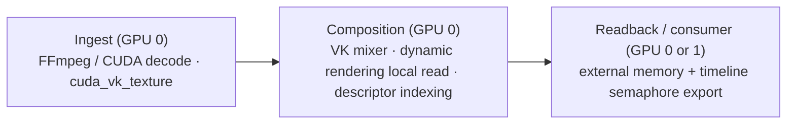

# Vulkan Mixer Implementation — Technical Reference

> **Scope**: This document describes the Vulkan GPU image mixer and its
> associated readback strategies as implemented on the `CasparVPV` branch.
> All path references are relative to the CasparVP repository root.

> **Platform support**: The Vulkan mixer runs on both **Windows** and
> **Linux**. Cross-device interop uses platform-specific external memory
> extensions: Win32 opaque handles on Windows, POSIX file descriptors on
> Linux. Platform constants are centralized in
> `src/accelerator/vulkan/util/platform_config.h`.

---

## 1. Architecture Overview



The Vulkan mixer replaces the OpenGL image mixer as an alternative GPU
compositing backend. It is selected at channel startup via the
`<accelerator>vulkan</accelerator>` configuration element. The system is
split into three logical stages:

```
┌───────────┐     ┌───────────────┐     ┌──────────────────┐
│  Ingest    │────▸│  Composition  │────▸│  Readback /      │
│  (decode)  │     │  (VK mixer)   │     │  Consumer Output │
└───────────┘     └───────────────┘     └──────────────────┘
     GPU 0              GPU 0              GPU 0 or 1
```

1. **Ingest** — Producers (FFmpeg, CUDA ProRes, CUDA NotchLC) decode media
   into CPU arrays or, when available, directly into Vulkan textures via
   `cuda_vk_texture.h` zero-copy interop.

2. **Composition** — The `vulkan::image_mixer` composites all layers into a
   single render target (`VK_FORMAT_R16G16B16A16_UNORM` at 16-bit depth,
   `VK_FORMAT_R8G8B8A8_UNORM` at 8-bit). The output is an exportable
   `VkImage` backed by platform-specific external memory
   (`VK_KHR_external_memory_win32` on Windows, `VK_KHR_external_memory_fd`
   on Linux).

3. **Readback / Output** — Downstream consumers convert the composited
   texture to their wire format. DeckLink consumers use one of five
   GPU-readback strategies; the `vulkan_output` consumer uses GPU-native
   VK→VK zero-copy.

---

## 2. Vulkan Device Initialization

**File**: `src/accelerator/vulkan/util/device.h`, `device.cpp`

### 2.1 Instance & Physical Device Selection

The device is created via **VkBootstrap** (`vkb::InstanceBuilder`,
`vkb::PhysicalDeviceSelector`). Key choices:

| Setting | Value | Rationale |
|---|---|---|
| API version | Vulkan 1.3 | Required for `synchronization2`, `dynamicRendering` |
| Headless | `true` | No swapchain — the mixer renders to offscreen attachments |
| Validation layers | Debug builds only | Enables `VK_EXT_debug_utils` |
| GPU preference | Discrete | `vkb::PreferredDeviceType::discrete` |

### 2.2 Required Features

| Feature | Extension / Version |
|---|---|
| `descriptorIndexing`, `descriptorBindingPartiallyBound`, `runtimeDescriptorArray`, `shaderSampledImageArrayNonUniformIndexing` | VK 1.2 |
| `timelineSemaphore` | VK 1.2 |
| `scalarBlockLayout` | VK 1.2 |
| `dynamicRendering` | VK 1.3 |
| `synchronization2` | VK 1.3 |
| `dynamicRenderingLocalRead` | `VK_KHR_dynamic_rendering_local_read` |
| External memory export | `VK_KHR_external_memory_win32` (Windows) / `VK_KHR_external_memory_fd` (Linux) |
| External semaphore export | `VK_KHR_external_semaphore_win32` (Windows) / `VK_KHR_external_semaphore_fd` (Linux) |

### 2.3 Memory Management

- **VMA** (`VmaAllocator`) is used for staging buffers.
- **Manual allocation** with platform-specific external memory handle type
  (`VK_EXTERNAL_MEMORY_HANDLE_TYPE_OPAQUE_WIN32_BIT` on Windows,
  `VK_EXTERNAL_MEMORY_HANDLE_TYPE_OPAQUE_FD_BIT` on Linux) is used for
  attachment textures (required for cross-device export).
- **Pool recycling**: Attachment, device-texture, and host-buffer pools use
  `tbb::concurrent_bounded_queue` keyed by `(width << 16 | height)` to
  recycle allocations without per-frame alloc/free.

### 2.4 Device LUID

The physical device LUID (`VkPhysicalDeviceIDProperties`) is queried at
init and stored on each exported texture. Downstream consumers (CUDA
interop, pure-VK readback) use the LUID to match the correct GPU when
creating their own device.

### 2.5 Dispatch Thread

All GPU work is serialized onto a single `boost::asio::io_context` thread
(`set_thread_name(L"Vulkan Device")`). Callers use `dispatch_async()` /
`dispatch_sync()` to enqueue work. This avoids external synchronization
around the VkDevice.

#### 2.5.1 Is one thread per GPU a scaling wall? — measured 2026-07-29

The claim above ("avoids external synchronization") is a design convenience,
not a Vulkan requirement, and it was reasonable to suspect that funnelling
every channel's uploads, composition, LUT passes and readback through one
thread would become a bottleneck on a multi-channel server. That suspicion was
argued from the code and never measured. It is now instrumented — the device
publishes `vk.dispatch.*` and `vk.dispatch_by_kind.*` in `info()`, which
`GL INFO` returns (its error message says OpenGL only; the code path is
generic and works for both backends).

Measured on the RTX A4000, `bars.mov` looping on layer 10 of every channel,
one NDI consumer per channel so composition *and* readback actually run
(with no consumer at all the channel skips both, and only the upload path is
exercised — an easy way to measure nothing):

| | 4 × 1080p50 | 8 × 1080p50 |
|---|---|---|
| dispatch items | 19.5 k | 37.4 k |
| wall-clock busy | 22.0 % | 77.7 % |
| **actual thread CPU** | **5.4 %** | **9.7 %** |
| queue wait, mean | 0.66 ms | 7.5 ms |
| composition (`other`) | 19.6 % wall | 72.3 % wall |
| uploads | 3.0 % wall | 4.5 % wall |
| readback | 0.7 % wall | 0.9 % wall |

**Conclusion: the thread is not the bottleneck, and adding threads to it would
not help.** At eight 1080p50 channels it consumes under 10 % of one core while
*appearing* 78 % busy. The gap between the two is time an item spent in
progress but not executing — the thread descheduled on an oversubscribed
machine (eight NDI encoders compressing 1080p50 alongside eight channel
threads), or blocked inside `vkQueueSubmit` when the GPU is behind. Neither is
relieved by per-thread command pools.

This is why both numbers are published. A wall-clock figure alone would have
made the thread look nearly saturated at eight channels and sent the next round
of work in exactly the wrong direction.

Two further findings from the same run:

- **All the alarming peaks are startup transients.** Composition shows a
  ~40–75 ms `exec_peak`, but across a second 16-second window with 5 500 more
  composition items, 12 000 more uploads and 2 700 more readbacks, no peak
  grew. They are one-off pipeline creation and first-allocation costs, not
  steady-state stalls. Any peak reported by this instrumentation should be
  re-checked against a second sample before it is believed.
- **Command-buffer recycling is healthy.** `submitSingleTimeCommands` reclaims
  at most one finished buffer per call and only if the *oldest* has completed,
  which looks like it could never recover from a burst. Measured, it is fine:
  99.8–99.9 % reuse, with the in-flight deque settling at 23 buffers (4 ch) and
  40 (8 ch). Published as `vk.cmd_buffers.*`. A hypothesis worth having and
  worth discarding.

**Consequence for the transfer-queue and parallel-recording work.** Transfers
are 4–5 % of this thread's wall-clock time and composition is the rest, so
moving staging and readback to a transfer queue cannot buy much *CPU* time, and
per-thread command recording targets a thread with 90 % of a core spare. Both
are deferred. The one case still open is GPU-side DMA parallelism — whether the
copy engines sitting idle actually costs throughput — and this instrumentation
cannot answer that, because it measures the CPU side only. Deciding it needs GPU
timestamps (`vkCmdWriteTimestamp2` around the copy and composition passes). Do
that measurement before writing any queue-ownership barriers.

---

## 3. Graphics Pipeline

**File**: `src/accelerator/vulkan/util/pipeline.h`, `pipeline.cpp`

Two pipeline instances are created at device init — one for 8-bit RGBA and
one for 16-bit RGBA:

```cpp
_pipelines[0] = pipeline(_device, VK_FORMAT_R8G8B8A8_UNORM, ...);
_pipelines[1] = pipeline(_device, VK_FORMAT_R16G16B16A16_UNORM, ...);
```

### 3.1 Descriptor Layout

| Set | Binding | Type | Description |
|---|---|---|---|
| 0 | 0 | `VK_DESCRIPTOR_TYPE_INPUT_ATTACHMENT` | Background (target) texture for blending |
| 0 | 1 | `VK_DESCRIPTOR_TYPE_COMBINED_IMAGE_SAMPLER` × 8 | Source texture array (Y, CbCr, BGRA, etc.) with partial binding |
| 0 | 2 | `VK_DESCRIPTOR_TYPE_UNIFORM_BUFFER_DYNAMIC` | Per-draw `uniform_block` (752 bytes) |
| 0 | 3 | `VK_DESCRIPTOR_TYPE_INPUT_ATTACHMENT` | Local key attachment |
| 0 | 4 | `VK_DESCRIPTOR_TYPE_INPUT_ATTACHMENT` | Layer key attachment |

### 3.2 UBO Ring Buffer

64 descriptor sets are pre-allocated. Each maps to a fixed 256-byte-aligned
offset within a single large UBO. The pipeline rotates through these slots
across draws within a renderpass, avoiding per-draw descriptor writes.

### 3.3 Samplers

Two immutable samplers are created:

- **Linear** (`VK_FILTER_LINEAR`, `VK_SAMPLER_ADDRESS_MODE_CLAMP_TO_EDGE`)
  — used for normal textures.
- **Nearest** (`VK_FILTER_NEAREST`) — used when exact texel sampling is
  needed (e.g., local/layer key).

---

## 4. Renderpass & Compositing

**File**: `src/accelerator/vulkan/util/renderpass.h`, `renderpass.cpp`

### 4.1 Dynamic Rendering with Local Read

The mixer uses `VK_KHR_dynamic_rendering_local_read` instead of traditional
VkRenderPass objects. This allows reading the current color attachment as an
input attachment within the same rendering scope — critical for blend mode
compositing where each draw reads the background it composites onto.

Each draw call produces a `layer_info` containing:
- The target attachment and optional key attachments
- The 752-byte `uniform_block` filled by `image_kernel`
- Clipped and transformed vertex coordinates

On `commit()`, all layers are batched into a single command buffer recording:
1. Vertex data is uploaded to a host-visible vertex buffer.
2. UBO data is written as a contiguous block.
3. For each layer: descriptor set is bound with dynamic offset →
   `vkCmdDraw()` with the layer's vertex count.
4. A timeline semaphore is signaled on submit (see §5).

### 4.2 Attachment Management

Attachments (`create_attachment()`) are VkImages with all of:
- `TRANSFER_SRC` — for GPU→CPU readback
- `INPUT_ATTACHMENT` — for dynamic rendering local read
- `COLOR_ATTACHMENT` — for rendering into
- `TRANSFER_DST` — for clears
- `SAMPLED` — for use as a texture source

Attachments use **export memory** (`VK_KHR_external_memory_win32` on
Windows, `VK_KHR_external_memory_fd` on Linux) so they can be imported by
consumer-side VkDevices or CUDA.

A per-frame-slot attachment pool (`frame_data::attachment_pool_`, max 4)
recycles allocations. This keeps the underlying `VkDeviceMemory` and its
platform handle (Win32 HANDLE / POSIX fd) stable across frames, which is
critical because `cudaImportExternalMemory()` costs 10–150 ms and must be
avoided per-frame.

### 4.3 Triple Buffering

The kernel maintains 3 `frame_data` slots (`frame_buffer_size = 3`), each
with its own command buffer and fence. `create_renderpass()` advances to the
next slot, waits for its fence (previous frame N-3), resets the command
buffer, and returns a new `renderpass` bound to that slot.

This means up to 2 frames can be in-flight on the GPU while the mixer
prepares a third.

---

## 5. Timeline Semaphores & Cross-Device Synchronization

### 5.1 Render Semaphore

Each `frame_data` slot creates an **exportable timeline VkSemaphore**:

```cpp
// Windows:
VkExternalSemaphoreHandleTypeFlagBits::eOpaqueWin32
// Linux:
VkExternalSemaphoreHandleTypeFlagBits::eOpaqueFd
VkSemaphoreType::eTimeline
```

On each `submit()`, the timeline value increments and is signaled when the
GPU finishes the command buffer. The platform handle is cached after the
first export call (`vkGetSemaphoreWin32HandleKHR` on Windows,
`vkGetSemaphoreFdKHR` on Linux) and exposed via:

- `renderpass::render_semaphore_handle()` → platform handle
- `renderpass::render_semaphore_value()` → uint64

### 5.2 texture_wrapper

**File**: `src/accelerator/vulkan/util/texture_wrapper.h`

The composited attachment is wrapped in `texture_wrapper` (implements
`core::texture`) and returned to the channel output pipeline. It exposes:

| Method | Purpose |
|---|---|
| `vk_texture()` | Native VK texture for GPU-native consumers |
| `export_handle()` | Platform handle to VkDeviceMemory (Win32 HANDLE / fd) |
| `export_alloc_size()` | Allocation size for CUDA import |
| `render_semaphore_handle()` | Timeline semaphore platform handle |
| `render_semaphore_value()` | Timeline value to wait for |
| `ensure_render_complete()` | Fence wait (thread-safe, one-shot) |

Consumers choose their access path:
- **vulkan_output**: calls `vk_texture()` — zero-copy, no readback
- **CUDA readback**: imports the platform handle + semaphore via `cudaImportExternalMemory` / `cudaImportExternalSemaphore`, waits GPU-side
- **VK readback**: imports via `VK_KHR_external_memory_win32` / `VK_KHR_external_memory_fd` on a consumer-side VkDevice
- **CPU readback**: calls `ensure_render_complete()` then `image_data()`

### 5.3 Fence Wait Ordering

The `wait_fn` lambda captures the `renderpass` shared_ptr. Consumers that
need GPU-side sync (CUDA/VK) use the timeline semaphore directly. Consumers
that need CPU-side sync call `ensure_render_complete()`, which is
`atomic_flag`-guarded so concurrent consumers only wait once.

---

## 6. Compositing Shader

**File**: `src/accelerator/vulkan/image/fragment_shader.frag`

A single monolithic GLSL 450 fragment shader handles all compositing,
effects, and color management. The shader is ~2000 lines and uses the
752-byte `uniform_block` (§6.1) to select code paths at runtime via
bitfield flags.

### 6.1 uniform_block (752 bytes)

**File**: `src/accelerator/vulkan/util/uniform_block.h`

The UBO is laid out for **std140** rules (vec3 padded to vec4, mat3 stored
as 3×vec4). All fields have documented byte offsets. Key sections:

| Offset | Field | Description |
|---|---|---|
| 0 | `color_space_index` | BT.601 / BT.709 / BT.2020 |
| 4 | `precision_factor[4]` | Per-plane normalization (bit depth) |
| 20 | `blend_mode` | 0..28+ blend modes |
| 28 | `pixel_format` | Source pixel format enum |
| 96 | `flags` | 32-bit bitfield (see below) |
| 176–291 | Color grading | EOTF, gamut matrices, tone mapping |
| 300–344 | Lift/Midtone/Gain | 3-way color corrector |
| 412–440 | Split toning | Shadow/highlight color |
| 604–639 | Blur | Gaussian, directional, radial, tilt-shift |
| 640–735 | Shape overlay | SDF shapes with gradient/stroke |
| 736 | `flags2` | Extended feature flags |

### 6.2 shader_flags Bitfield

32 flags controlling which shader paths are active:

| Bit | Flag | Effect |
|---|---|---|
| 0 | `is_straight_alpha` | Pre-multiply alpha conversion |
| 1–2 | `has_local_key` / `has_layer_key` | Key compositing |
| 3 | `invert` | Luminance inversion |
| 4 | `levels` | Input/output levels with gamma |
| 5 | `csb` | Brightness/saturation/contrast |
| 6–7 | `chroma` / `chroma_show_mask` | Chroma keying |
| 8–9 | `is_360` / `is_curved` | Equirectangular projection + curved screen |
| 10 | `color_grading` | Full grading pipeline (EOTF→gamut→tone map) |
| 11–12 | `flip_h` / `flip_v` | Horizontal/vertical flip |
| 13 | `white_balance` | Temperature + tint |
| 14 | `lmg_enable` | Lift/midtone/gain |
| 15 | `hue_shift_enable` | Hue rotation |
| 16 | `tonebalance_enable` | Shadow/highlight recovery |
| 17 | `linear_sat_enable` | Linear saturation |
| 18 | `cdl_enable` | ASC CDL |
| 19 | `split_tone_enable` | Split toning |
| 20 | `gamut_compress` | ACES gamut compression |
| 21 | `lut3d_enable` | 3D LUT application |
| 22 | `hue_curve_enable` | Hue-vs-hue / hue-vs-sat curves |
| 23 | `sharpen_enable` | Unsharp mask |
| 24 | `grain_enable` | Film grain synthesis |
| 25 | `qualifier_enable` | Secondary color qualifier |
| 26 | `rgb_levels_enable` | Per-channel RGB levels |
| 27 | `curves_enable` | Curve adjustments |
| 28 | `blur_enable` | Blur (Gaussian/directional/radial/tilt-shift) |
| 29–30 | `shape_enable` / `shape_stroke` | Shape overlay with SDF rendering |
| 31 | `edge_blend` | Multi-projector edge blending |

### 6.3 Blend Modes

28+ blend modes implemented in the fragment shader as per-pixel operations
on the background input attachment: Normal, Multiply, Screen, Overlay,
Darken, Lighten, Color Dodge, Color Burn, Hard Light, Soft Light,
Difference, Exclusion, Linear Dodge, Linear Burn, Vivid Light, Linear Light,
Pin Light, Hard Mix, Reflect, Glow, Phoenix, and more.

### 6.4 360° and Curved Screen

When `is_360` is set, the shader performs equirectangular-to-rectilinear
projection using yaw/pitch/roll Euler angles, configurable FOV, and optional
frustum offsets. Lens distortion (k1/k2/k3) is applied in UV space.

`is_curved` adds cylindrical/spherical screen curvature (`screen_arc`
parameter) on top of the projection.

### 6.5 Color Grading Pipeline

When `color_grading` is set, the shader applies the full pipeline:

1. **EOTF decode** (`input_transfer`) — sRGB, PQ (ST 2084), HLG, Linear
2. **Input gamut → working gamut** (`input_to_working` mat3)
3. Per-pixel grading (LMG, CDL, white balance, etc.)
4. **Tone mapping** (`tone_mapping_op`) — Reinhard, ACES, Hable
5. **Working gamut → output gamut** (`working_to_output` mat3)
6. **OETF encode** (`output_transfer`)

Seven gamut matrix presets are compiled in:
BT.601, BT.709, BT.2020, DCI-P3, ACES AP0, ACES AP1, Display P3.

---

## 7. Still-Frame Cache

**File**: `src/accelerator/vulkan/image/image_mixer.cpp`

When every input to composition is unchanged between ticks (a "still" frame),
the mixer short-circuits GPU composition entirely and returns the cached
`texture_wrapper` + CPU-pixel future from the previous tick. This reduces mixer
GPU load to ~0 during still scenes, freeing GPU cycles for CUDA decode.

The fingerprint (`render_fingerprint` / `item_fingerprint`) must describe
*everything* the result depends on, because a field left out is a change that
does not invalidate the cache — which reaches air as a frozen frame. It covers,
per item: all plane textures (as `shared_ptr`), the combined `image_transform`,
`frame_geometry`, `pixel_format_desc`, the owning layer's blend mode, and the
item's position in the layer/sublayer tree; plus, per render: target dimensions,
target colour space/transfer, `auto_color_convert`, tone-mapping parameters and
the calibration LUT identity/strength/bypass.

Two properties are load-bearing:

- **Textures are held by `shared_ptr`, never by raw pointer.** The attachment and
  device-texture pools recycle allocations, so a raw pointer can be reused by a
  different texture and make two different frames compare equal (ABA). Holding
  the `shared_ptr` both keeps the address unique and keeps the texture alive.
- **An unresolved upload future makes the fingerprint incomplete**, and an
  incomplete fingerprint never matches. Reading a pending future as `nullptr`
  would otherwise let two different frames compare equal mid-upload.

> **History:** this fingerprint originally compared
> `pair<const void*, image_transform>` for `textures[0]` only. The raw pointer
> was an ABA hazard (fixed in the OGL mixer at the time, but not here), and
> geometry, blend mode, pixel format, the non-plane-0 textures and all
> channel-wide colour state were not compared at all. `image_transform`'s own
> equality also skipped several `projection` fields including the whole ICVFX
> block, so a tracked camera moving the inner frustum over a static plate froze
> the wall.

---

## 8. CPU Readback Skip

When **all** attached consumers use GPU-native paths (e.g., only
`vulkan_output` is connected), the mixer skips the GPU→CPU readback
entirely by checking `cpu_readback_needed_`:

```cpp
if (!cpu_readback_needed_.load(std::memory_order_relaxed)) {
    // return empty pixel array + texture_wrapper
}
```

This saves:
- One staging buffer allocation
- One layout transition barrier
- ~127 MB/frame of wasted PCIe bandwidth at 7680×2160 × 8 bytes/pixel

The flag is set to `false` by consumers that call
`image_mixer::set_cpu_readback_needed(false)`.

---

## 9. Texture Upload Paths

### 9.1 Zero-Copy (CUDA → VK)

When a CUDA producer (ProRes, NotchLC) decodes directly into a
`vulkan::texture_wrapper`, the mixer receives it via `frame.texture()` and
uses the VK texture directly — no CPU→GPU upload.

```cpp
auto vk_wrapper = dynamic_pointer_cast<texture_wrapper>(frame.texture());
item.textures.push_back(make_ready_future(vk_wrapper->vk_texture()));
```

### 9.2 Opaque Upload (pre-staged)

When `mutable_frame` was created by the VK mixer's own
`create_frame()`, the freeze callback stages pixel data into a VK buffer
and uploads asynchronously. The resulting `future_texture` vector is
attached as `frame.opaque()`.

### 9.3 CPU Upload (fallback)

For frames without a VK texture or opaque data, pixel arrays are uploaded
per-plane via `device::copy_async()`:
- Create/recycle a host-visible staging `buffer`
- `memcpy` pixels into the buffer
- `vkCmdCopyBufferToImage` with layout transitions
- Return the texture as a `future<shared_ptr<texture>>`

---

## 10. DeckLink Readback Strategies

The DeckLink consumer must convert the composited VK texture into
DeckLink's wire format (v210 YCbCr or 8-bit BGRA). Five readback modes
are available via `<gpu-readback-mode>`:

### 10.1 Configuration

**Files**: `src/modules/decklink/consumer/config.h`, `config.cpp`

```xml
<decklink>
  <gpu-readback-mode>auto</gpu-readback-mode>
</decklink>
```

| Value | Enum | Description |
|---|---|---|
| `auto` | `auto_select` | Try CUDA → Vulkan → CPU (default) |
| `cuda` | `cuda` | CUDA-VK interop |
| `vulkan` | `vulkan` | VK compute shader packing |
| `vulkan-dma` | `vulkan_dma` | VK DMA copy + CPU v210 pack |
| `cpu` | `cpu` | CPU-only (AVX2/memcpy) |

> **Note**: GPU readback modes only apply when the channel uses the Vulkan
> mixer (`<accelerator>vulkan</accelerator>`). With OpenGL, the DeckLink
> consumer always uses the CPU-based `v210_strategy` / `bgra_strategy`.

### 10.2 Strategy Selection

**File**: `src/modules/decklink/consumer/decklink_consumer.cpp`
— `create_format_strategy()`

```
if (!use_vulkan) return cpu_strategy;    // OGL: CPU only

switch (gpu_readback_mode) {
    auto_select → try cuda_vk → try vk_readback → cpu
    cuda        → try cuda_vk → cpu
    vulkan      → try vk_readback(dma=false) → cpu
    vulkan_dma  → try vk_readback(dma=true) → cpu
    cpu         → cpu
}
```

Each GPU strategy wraps a CPU fallback strategy for partial operations
(e.g., vulkan-dma uses VK DMA for readback but CPU AVX2 for v210 packing).

### 10.3 CUDA-VK Interop (`cuda`)

**Files**: `cuda_vk_strategy.h/cpp`, `cuda_vk_kernels.cu`, `cuda_vk_v210.cuh`

1. Imports the mixer's VK texture via `cudaImportExternalMemory()` using the
   platform handle (Win32 HANDLE on Windows, POSIX fd on Linux) → maps to
   `cudaMipmappedArray` → creates `cudaSurfaceObject`.
2. Imports the timeline semaphore via `cudaImportExternalSemaphore()`.
3. Waits GPU-side (`cudaWaitExternalSemaphoresAsync`) for render completion.
4. CUDA kernels (`v210_pack_kernel`, `bgra_copy_kernel`) run on compute SMs:
   - Extract subregion (src_x, src_y, region_w, region_h)
   - Convert colorspace (BT.709/BT.2020 → v210 YCbCr) or copy BGRA
   - Write directly to pinned host memory (`cudaMallocHost`)
5. Triple-buffered: 3 host buffers + stream events for async D2H.
6. **Import caching**: Up to 8 texture/semaphore imports cached; only
   re-imported when the platform handle changes.

> **Linux fd ownership**: On Linux, `cudaImportExternalMemory` and
> `cudaImportExternalSemaphore` consume the fd on success. The implementation
> uses `dup()` before import so the original cached fd remains valid. On
> failure, the dup'd fd is closed explicitly to prevent leaks.

**Advantage**: Entire pipeline runs on GPU — no CPU involvement.
**Disadvantage**: Compute kernels run on SMs — contends with CUDA ProRes/NotchLC decode.

### 10.4 Pure Vulkan Compute (`vulkan`)

**Files**: `vk_readback_strategy.h/cpp`, `vk_readback_v210.comp`, `vk_readback_bgra.comp`

1. Creates a **consumer-side VkDevice** on the same physical GPU (matched
   by LUID), with a **compute-only queue family** (avoids graphics queue
   contention).
2. Imports the mixer's VK texture via `VK_KHR_external_memory_win32`
   (Windows) or `VK_KHR_external_memory_fd` (Linux) → creates a
   `VkImageView` on the consumer device.
3. Compute shader (`vk_readback_v210.comp`) packs RGBA → v210 entirely on
   GPU:
   - Reads 6 RGBA pixels per workgroup invocation
   - Converts to YCbCr (BT.709 or BT.2020 matrix)
   - Packs into 4×uint32 v210 words
   - Writes to a host-visible `VkBuffer` (SSBO)
4. The host-visible buffer is mapped and returned as the frame pointer.
5. Triple-buffered with fences.

**Advantage**: No CUDA dependency; v210 packing on GPU saves CPU.
**Disadvantage**: Compute shader runs on SMs — same contention as CUDA mode
under heavy SM workloads (CUDA ProRes decode).

### 10.5 Vulkan DMA (`vulkan-dma`)

**Files**: `vk_readback_strategy.h/cpp` (DMA path within same file)

1. Creates a consumer-side VkDevice on the same GPU, but selects a
   **transfer-only queue family** (`VK_QUEUE_TRANSFER_BIT` without
   `COMPUTE` or `GRAPHICS`).
2. Imports the mixer's VK texture (same as compute mode).
3. Issues `vkCmdCopyImageToBuffer` to copy the subregion from the imported
   image into a host-visible staging buffer. This uses the GPU's **DMA/Copy
   engine**, which is a separate hardware unit from the compute SMs.
4. Fences + triple buffering (same as compute path).
5. The raw RGBA pixel data is wrapped in a `const_frame` and passed to
   the CPU fallback strategy for v210 packing (AVX2 SIMD).

**Advantage**: Zero SM usage — the DMA engine runs in parallel with CUDA
decode. Designed specifically for CUDA ProRes + VK mixer scenarios.
**Disadvantage**: CPU must perform v210 packing (AVX2), so higher CPU load
than pure-GPU modes.

### 10.6 CPU Fallback (`cpu`)

The mixer's GPU→CPU readback (`device::copy_async()`) produces raw RGBA
pixels. The CPU strategy uses AVX2 SIMD intrinsics to pack v210 or convert
BGRA. This is always available and is the fallback for all GPU strategies.

---

## 11. Pixel Formats & Bit Depths

### 11.1 Mixer Output Format

| Bit Depth | VkFormat | Bytes/pixel | Notes |
|---|---|---|---|
| 8-bit | `R8G8B8A8_UNORM` | 4 | SDR content |
| 16-bit | `R16G16B16A16_UNORM` | 8 | HDR / 10-bit / 12-bit content |

The format is **unsigned normalized integer** (`UNORM`), not half-float
(`SFLOAT`). This is significant because:
- v210 packing can consume `uint16_t` values directly
- No float→int conversion overhead in readback
- CPU AVX2 `v210_strategy<uint16_t>` works on raw pixel data

### 11.2 Source Texture Formats

Input textures cover the CasparCG pixel formats via the `pixel_format` enum in the
UBO — **except packed 3-byte RGB, which this backend cannot take at all**:

| Format | Planes | Components |
|---|---|---|
| `bgra` | 1 | B8G8R8A8 or B16G16R16A16 |
| `rgba` | 1 | R8G8B8A8 or R16G16B16A16 |
| `ycbcr` | 3 | Y, Cb, Cr (4:2:0 / 4:2:2) |
| `ycbcra` | 4 | Y, Cb, Cr, A |
| `ycbcr_a` | 2 | Packed YCbCr + separate A |
| `bgr` / `rgb` | 1 | **not supported** — see below |

The fragment shader handles colorspace conversion from any source format it is given
to the target attachment format.

#### The 3-component exclusion

`bgr` and `rgb` (`rgb24`/`bgr24`, one plane of stride 3) reach
`device::create_texture` as `eR8G8B8Unorm`. Vulkan does **not** oblige an
implementation to support a 3-component format as a sampled image, and NVIDIA
Quadro/RTX do not — so the image cannot be created. This is a hard limit of the
backend, not a shader gap: the OpenGL mixer samples the same layout correctly, so it
is a **parity floor**.

What that means in practice:

* **Producers must convert before the mixer.** `av_producer` excludes `rgb24`/`bgr24`
  from filter-graph negotiation, and the image module's `ensure_mixer_compatible()`
  converts to BGRA (8-bit) or GBRAP16 (>8-bit). A still is converted once at load, so
  this costs nothing per frame.
* **`device::can_sample_packed(stride, depth)`** answers the question, from a table
  probed once at device construction. `vk::image_mixer::resolve_item_textures` asks it
  before *any* of its four texture routes, because every route ends in the same
  `create_texture` — including the pre-staged one, where the frame factory has already
  handed the producer a `copy_async` future whose exception would surface on the
  **channel thread** rather than where the frame was built.
* A layer the mixer cannot sample is **dropped**, with one warning naming the format.
  It used to throw once per frame from inside the channel tick instead, which blanked
  the output, pegged a core and free-ran the channel at ~190× its frame rate (fixed in
  `a0bf96bb6`, `3377edb78`).
* `bluefish_producer` still emits `rgb24`, so a Bluefish capture on a Vulkan-mixer
  channel is a dropped layer. Known, named at the call site, and not fixable without
  the card to measure against.

---

## 12. Geometry & Transforms

**Files**: `src/accelerator/vulkan/util/transforms.h/cpp`, `matrix.h/cpp`

### 12.1 Transform Stack

The mixer maintains a `transform_stack_` (vector of `draw_transforms`).
Each `push()` call combines the new `frame_transform` with the current top
via `combine_transform()`. This handles:

- Fill translation/scale (`fill_translation`, `fill_scale`)
- Clip rectangle (`clip_translation`, `clip_scale`)
- Anchor point
- Rotation (`angle`)
- Perspective (`perspective_scale`)

### 12.2 Vertex Computation

`matrix.cpp` computes a 4×4 vertex matrix from the combined transform:
anchor → scale → rotate → translate. This matrix is applied to geometry
coordinates to produce clip-space positions.

### 12.3 Polygon Clipping

`transforms.cpp` implements Sutherland-Hodgman polygon clipping against the
viewport edges. This clips geometry to `[0, 1]` in both X and Y,
interpolating texture coordinates along clipped edges.

Perspective-correct texture coordinate interpolation uses the `Q` factor:
```
Q = 1 / w_clip
tex_coord_corrected = tex_coord * Q
```

---

## 13. Layer Compositing Model

### 13.1 Layer Hierarchy

```
Channel
  └─ Layer (blend_mode)
       ├─ Sublayers (recursive)
       └─ Items (individual draw calls)
            ├─ Normal item → draw directly to target
            ├─ Key item → draw to key attachment
            └─ Mix item → draw to mix attachment, then composite
```

### 13.2 Blend Mode Fast Path

When `blend_mode == normal`, items within a layer are drawn directly to the
target attachment without an intermediate layer texture. Non-normal blend
modes require:
1. Draw all items to a temporary layer attachment
2. Draw the layer attachment onto the target with the specified blend mode

### 13.3 Key Compositing

- **Local key**: Set via `is_key` on a frame transform. The key item renders
  to `local_key_texture`, which is used as an alpha mask for subsequent
  non-key items.
- **Layer key**: Persists across items within a layer. The previous layer's
  local key becomes the next layer's layer key.

---

## 14. Performance Optimizations

### 14.1 Still-Frame Cache (§7)

Skips GPU composition entirely when inputs haven't changed.

### 14.2 CPU Readback Skip (§8)

Skips GPU→CPU transfer when only GPU-native consumers are attached.

### 14.3 Attachment Pool Recycling (§4.2)

Stable platform handles (Win32 HANDLEs / POSIX fds) avoid expensive CUDA
re-imports per frame.

### 14.4 Import Caching (CUDA strategy)

Up to 8 texture + 8 semaphore CUDA imports cached, keyed by platform handle.

### 14.5 Subregion Extraction on GPU

DeckLink ports typically display a subregion (e.g., `src-x=3840` for a
right-half crop of a 7680-wide canvas). GPU strategies extract only the
relevant subregion, reducing PCIe bandwidth by up to 6× vs full-frame
readback.

### 14.6 Triple Buffering

All paths use 3-deep buffering (mixer command buffers, readback staging
buffers, DeckLink schedule buffers) to hide GPU latency and keep the
pipeline fully occupied.

### 14.7 Transfer-Only Queue (DMA mode)

The `vulkan-dma` mode selects a `VK_QUEUE_TRANSFER_BIT`-only queue family.
On NVIDIA GPUs, this maps to the dedicated Copy/DMA engine, which operates
independently from the compute SMs. This is specifically designed to avoid
GPU compute contention when CUDA decode workloads saturate the SMs.

---

## 15. Configuration Reference

### 15.1 Channel-Level

```xml
<channels>
  <channel>
    <video-mode>7680x2160p6000</video-mode>
    <accelerator>vulkan</accelerator>    <!-- or "ogl" -->
    <consumers>
      <decklink>
        <gpu-readback-mode>auto</gpu-readback-mode>
        <!-- auto | cuda | vulkan | vulkan-dma | cpu -->
      </decklink>
    </consumers>
  </channel>
</channels>
```

### 15.2 DeckLink Consumer

| Parameter | Default | Description |
|---|---|---|
| `<gpu-readback-mode>` | `auto` | Readback strategy selection |
| `<hdr>` | `false` | Enable HDR metadata output |
| `<pixel-format>` | `rgba` | Wire format: `rgba` (BGRA 8-bit) or `yuv` (v210) |
| `<primary>/<device>` | `1` | DeckLink device index |
| `<primary>/<src-x>` | `0` | Subregion X offset in mixer canvas |
| `<primary>/<region-w>` | `0` | Subregion width (0 = full width) |

### 15.3 Backwards Compatibility

The XML parser also accepts `<gpu-strategy>` as a legacy alias for
`<gpu-readback-mode>`. The mapping is identical.

---

## 16. File Map

### Mixer Core
| File | Purpose |
|---|---|
| `src/accelerator/vulkan/image/image_mixer.h/cpp` | Public mixer interface, layer management, still-frame cache |
| `src/accelerator/vulkan/image/image_kernel.h/cpp` | Renderpass creation, triple-buffered command buffers, UBO filling, timeline semaphore export |
| `src/accelerator/vulkan/image/fragment_shader.frag` | ~2000-line GLSL 450 fragment shader |
| `src/accelerator/vulkan/image/vertex_shader.vert` | Pass-through vertex shader |

### Vulkan Utilities
| File | Purpose |
|---|---|
| `src/accelerator/vulkan/util/device.h/cpp` | VkDevice, VMA, memory pools, async dispatch |
| `src/accelerator/vulkan/util/pipeline.h/cpp` | Graphics pipeline, descriptor layout, UBO ring |
| `src/accelerator/vulkan/util/renderpass.h/cpp` | Dynamic rendering, layer batching, command recording |
| `src/accelerator/vulkan/util/texture.h/cpp` | VkImage wrapper, platform handle export, LUID |
| `src/accelerator/vulkan/util/texture_wrapper.h` | Core::texture adapter for cross-device export |
| `src/accelerator/vulkan/util/platform_config.h` | Platform-agnostic constants (handle types, extensions, close_handle) |
| `src/accelerator/vulkan/util/buffer.h/cpp` | VMA staging buffer |
| `src/accelerator/vulkan/util/matrix.h/cpp` | 4×4 vertex matrix computation |
| `src/accelerator/vulkan/util/transforms.h/cpp` | Transform composition, polygon clipping |
| `src/accelerator/vulkan/util/draw_params.h` | Draw call parameter struct |
| `src/accelerator/vulkan/util/uniform_block.h` | 752-byte UBO struct + shader_flags enum |

### Readback Strategies
| File | Purpose |
|---|---|
| `src/modules/decklink/consumer/config.h/cpp` | `gpu_readback_mode_t` enum + XML parsing |
| `src/modules/decklink/consumer/decklink_consumer.cpp` | `create_format_strategy()` strategy factory |
| `src/modules/decklink/consumer/cuda_vk_strategy.h/cpp` | CUDA-VK interop readback |
| `src/modules/decklink/consumer/cuda_vk_kernels.cu` | CUDA v210/BGRA pack kernels |
| `src/modules/decklink/consumer/cuda_vk_v210.cuh` | v210 packing device functions |
| `src/modules/decklink/consumer/vk_readback_strategy.h/cpp` | Pure-VK compute + DMA readback |
| `src/modules/decklink/consumer/vk_readback_v210.comp` | GLSL compute shader for v210 packing |
| `src/modules/decklink/consumer/vk_readback_bgra.comp` | GLSL compute shader for BGRA copy |

### Integration
| File | Purpose |
|---|---|
| `src/modules/cuda_vk_texture.h` | CUDA → VK texture zero-copy wrapper |
| `src/core/consumer/channel_info.h` | `use_vulkan` flag per channel |
| `src/core/frame/frame.h/cpp` | `const_frame` lazy readback, `texture()` accessor |
| `src/accelerator/accelerator.h/cpp` | Backend selection (OGL vs Vulkan) |
