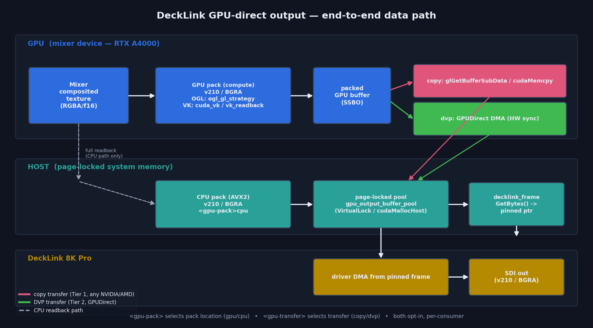
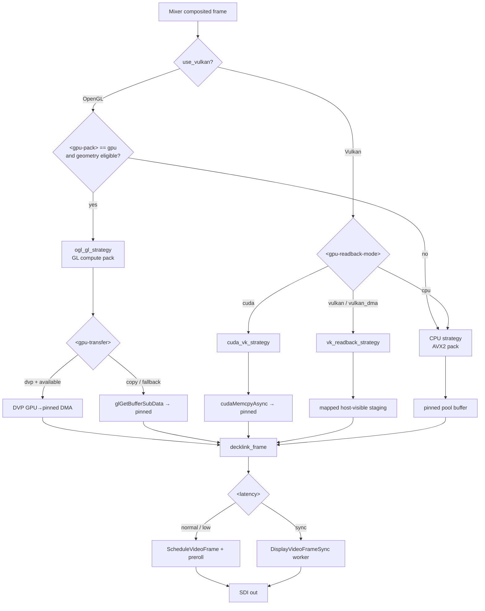
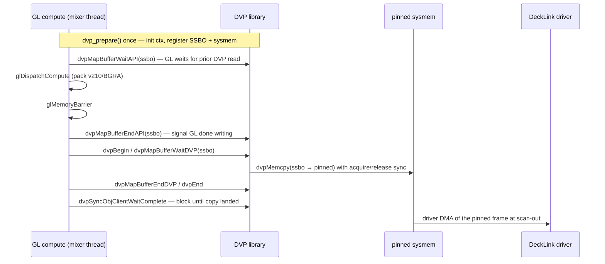
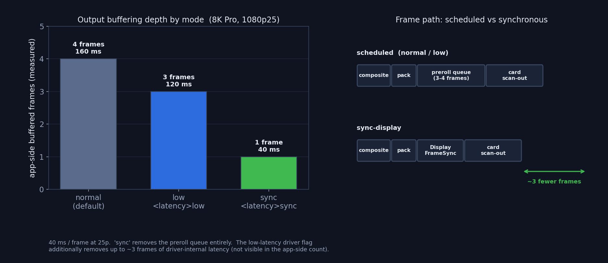
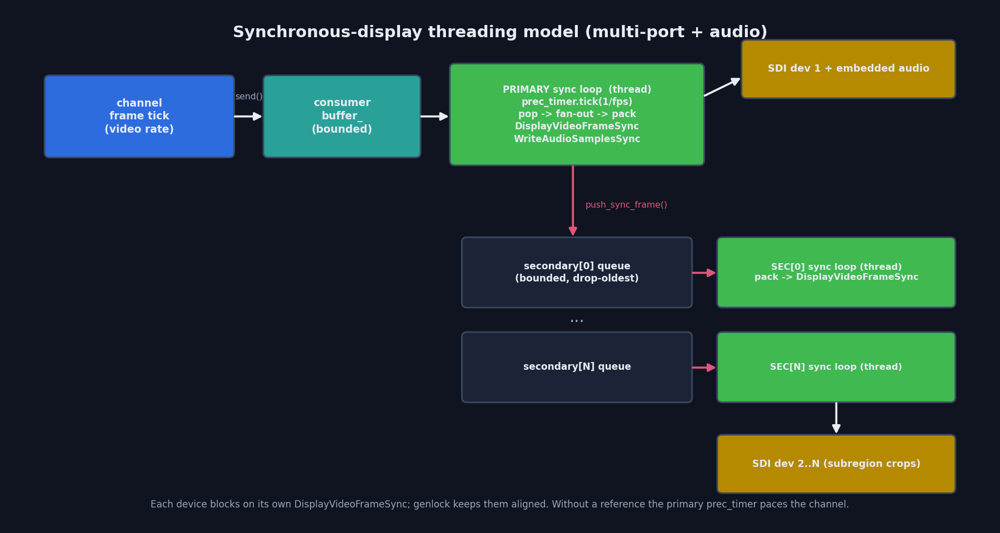

# DeckLink GPU‑Direct Output & Low‑Latency Pipelines

> **State and measurements:** [`../features/decklink-output.md`](../features/decklink-output.md)
> **Operator guide:** [`../guides/DECKLINK_OUTPUT.md`](../guides/DECKLINK_OUTPUT.md)
> **This document is why-it-is-shaped-this-way.** Operating instructions live in `guides/`, current state and figures in `features/`.

**Status:** implemented, hardware‑verified (DeckLink 8K Pro + RTX A4000).
**Scope:** the DeckLink *consumer* (SDI output). Covers GPU‑side packing, page‑locked
transfer, NVIDIA GPUDirect‑for‑Video (DVP), and the three scheduling/latency modes
(including the experimental synchronous‑display path with audio and multi‑port).
**Module:** `src/modules/decklink/`

This document is the reference for the current design. All features are **opt‑in**;
with the defaults the classic scheduled + CPU‑pack path is unchanged.

---

## Table of contents

1. [Motivation](#1-motivation)
2. [Architecture at a glance](#2-architecture-at-a-glance)
3. [Configuration reference](#3-configuration-reference)
4. [Packing tier — where v210/BGRA is produced](#4-packing-tier)
5. [Transfer tier — Tier 1 pinned copy and Tier 2 DVP](#5-transfer-tier)
6. [Scheduling & latency modes](#6-scheduling--latency-modes)
7. [Synchronous‑display: audio & multi‑port](#7-synchronous-display-audio--multi-port)
8. [Correctness: parity self‑tests](#8-correctness-parity-self-tests)
9. [Mixer independence & the Vulkan path](#9-mixer-independence--the-vulkan-path)
10. [Verification matrix](#10-verification-matrix)
11. [Limitations & caveats](#11-limitations--caveats)
12. [File & symbol map](#12-file--symbol-map)
13. [Change history](#13-change-history)
14. [Appendix — config examples](#14-appendix--config-examples)

---

## 1. Motivation

The DeckLink consumer historically read the whole composited frame back to the CPU,
packed it to `v210`/`BGRA` with AVX2, and handed the result to the driver. Two costs
dominate:

- **Packing + full readback** on the CPU for every frame (an 8K v210 frame is tens of MB).
- **Scheduling latency**: scheduled playback keeps a multi‑frame preroll queue.

This work adds, all opt‑in:

- **GPU packing** — pack `v210`/`BGRA` on the GPU (GL compute for the OpenGL mixer;
  CUDA/Vulkan compute for the Vulkan mixer), so the CPU pack and the full‑frame readback
  disappear; only the (smaller) packed result crosses to the host.
- **Page‑locked output buffers (Tier 1)** — the frame the driver DMAs is `VirtualLock`/
  `cudaMallocHost` pinned and pooled.
- **NVIDIA GPUDirect for Video / DVP (Tier 2)** — a hardware‑synchronised GPU→pinned‑sysmem
  DMA in place of `glGetBufferSubData`/`cudaMemcpy`.
- **Low‑latency scheduling** — expose the DeckLink low‑latency flag and a new
  **synchronous‑display** mode that removes the preroll queue entirely.

---

## 2. Architecture at a glance

Every consumer output frame flows through a `format_strategy` (the packing abstraction),
into a page‑locked buffer, optionally via a DVP DMA, and is wrapped by a custom
`decklink_frame` whose `GetBytes()` returns the pinned pointer the driver reads directly
(zero redundant copy — the "Model X" the Blackmagic developer notes describe).



The two orthogonal knobs are **`<gpu-pack>`** (where packing happens) and
**`<gpu-transfer>`** (how the packed bytes reach the pinned buffer). A third knob,
**`<latency>`**, selects the scheduling model. They compose freely and each is per‑consumer.



---

## 3. Configuration reference

All elements live inside a `<decklink>` consumer block. Defaults preserve legacy behaviour.

| Element | Values | Default | Meaning |
|---|---|---|---|
| `<pixel-format>` | `yuv` \| `rgba` | `rgba` | `yuv` → `v210` (10‑bit 4:2:2); `rgba` → `BGRA8`. |
| `<gpu-pack>` | `gpu` \| `cpu` \| `auto` | `auto` (=cpu) | Pack on the GPU (compute) vs CPU (AVX2). OpenGL mixer only. |
| `<gpu-transfer>` | `copy` \| `dvp` \| `auto` | `auto` | Final GPU→host transfer. `dvp` uses GPUDirect; falls back to `copy` if unavailable. |
| `<gpu-readback-mode>` | `cuda` \| `vulkan` \| `vulkan_dma` \| `cpu` \| `auto` | `auto` | Vulkan mixer packing/readback strategy. |
| `<latency>` | `normal` \| `low` \| `sync` | `normal` | Scheduling model (see §6). |
| `<buffer-depth>` | int ≥ 3 | 3 | Base preroll depth (scheduled modes). |
| `<embedded-audio>` | `true`/`false` | `false` | SDI embedded audio. |
| `<key-only>` | `true`/`false` | `false` | Output the alpha as a fill/key. |
| `<ports><port>…` | — | — | Secondary output devices; each may crop a `<subregion>`. |
| `<subregion>` | `src-x/src-y/dest-x/dest-y/width/height` | — | Per‑port crop of the one composited channel. |

**Eligibility note (OpenGL GPU pack):** `gpu-pack=gpu` engages for progressive **and**
interlaced, fill and key‑only, and `src-x/src-y` crops. Ports with a **destination offset
or partial region** (`dest-*`/`width`/`height`) fall back to the CPU strategy (v210 group
alignment), so mixed configs are safe.

---

## 4. Packing tier

The `format_strategy` interface (`consumer/format_strategy.h`) exposes
`get_pixel_format`, `get_row_bytes`, `allocate_frame_data`, and
`convert_frame_for_port(channel_fmt, dl_fmt, port_cfg, frame1, frame2, field_dominance)`.

| Strategy | File | Mixer | Notes |
|---|---|---|---|
| `sdr_bgra_strategy` | `sdr_bgra_strategy.cpp` | any | CPU AVX2 BGRA; key‑only supported. |
| SDR/HDR v210 | `v210_strategies.cpp` | any | CPU AVX2 v210 (BT.709/BT.2020 fixed‑point). |
| `ogl_gl_strategy` | `ogl_gl_strategy.cpp` | OpenGL | **GL 4.3 compute** pack of a subregion → SSBO. |
| `cuda_vk_strategy` | `cuda_vk_strategy.cpp` | Vulkan | Imports the VK texture, CUDA kernel packs v210 → pinned host. |
| `vk_readback_strategy` | `vk_readback_strategy.cpp` | Vulkan | Pure VK compute pack → host‑visible staging. |

### OpenGL GPU pack (`ogl_gl_strategy`)

The OpenGL mixer already owns the composited texture on its GL thread. Rather than reading
it back, the strategy dispatches a GL compute shader (ported from the Vulkan
`vk_readback_v210.comp` / `vk_readback_bgra.comp`) **on the mixer's own GL thread** via
`ogl::texture::get_device()->dispatch_sync(...)`. Because the work is enqueued in‑context
after the mixer's draw, ordering is guaranteed with no cross‑context fence.

- **Interlaced** output is produced with two dispatches that weave `frame1`/`frame2` into
  alternate output rows (`u_first_line` / `u_line_step` uniforms), honouring field dominance.
- **Key‑only** replicates the alpha as a grey key (`u_key_only`).
- The packed result lands in an SSBO; the transfer tier (§5) moves it to the pinned buffer.
- `needs_cpu_frame_data()` returns `false` when the GPU pack is eligible, so the host
  readback the mixer would otherwise perform is skipped.

---

## 5. Transfer tier

### Tier 1 — page‑locked pinned pool (`gpu_output_buffer_pool`)

`consumer/gpu_output_buffer_pool.{h,cpp}` owns a fixed pool of page‑locked buffers
(`VirtualLock` for the host‑locked kind, `cudaMallocHost` for the CUDA‑pinned kind). Key
properties:

- `acquire(bytes)` returns a `shared_ptr<void>` whose deleter returns the buffer to the free
  list; the allocations outlive the pool (held by an internal state block) so a frame still
  in the DeckLink queue at shutdown stays valid.
- On Windows the working‑set quota is raised (`SetProcessWorkingSetSize`) before
  `VirtualLock`, otherwise pinning fails silently.
- Pool buffers are page‑aligned (4096), which also satisfies DVP's `bufferAddrAlignment`.

`decklink_frame::GetBytes()` returns the pinned pointer directly — the driver DMAs from the
application buffer with no extra copy, while the custom frame still carries HDR static
metadata (SMPTE‑2086 / MaxCLL‑FALL) and VANC.

### Tier 2 — NVIDIA GPUDirect for Video (DVP)

Enabled with `<gpu-transfer>dvp` on the OpenGL GPU‑pack path (build flag
`DECKLINK_CUDA_DVP_ENABLED`, links `dvp.lib` + `dvp.dll`). It replaces the
`glGetBufferSubData` readback with a hardware‑synchronised DMA of the packed SSBO straight
into the page‑locked DeckLink output buffer, following the DeckLink SDK
`LoopThroughWithOpenGLCompositing` / `VideoFrameTransfer` pattern.



Robustness details:

- **Self‑probing with fallback**: any DVP error permanently reverts that strategy to
  `glGetBufferSubData` (logged once). A capability probe (`dvp_support.cpp`) runs at init.
- **Process‑level context refcount** (`dvp_gl_ctx`): `dvpInitGLContext` /
  `dvpCloseGLContext` act on the single shared mixer GL context, so with several DVP ports
  they are initialised **once** and closed **once** — the first port's teardown can't close
  the context out from under the others.
- **Honest benefit**: for whole‑frame scheduled output DVP goes through pinned host memory
  just like a pinned `glGetBufferSubData`, so it is a **sync/quality** feature rather than a
  throughput win. DeckLink does not expose GPUDirect RDMA (P2P); the sub‑frame chunked
  transfer that gives DVP a latency edge needs card‑side low‑level scheduling that
  CasparCG's `ScheduleVideoFrame` model does not use.

---

## 6. Scheduling & latency modes

`<latency>` selects the scheduling model. Measured output buffering at 1080p25:



| `<latency>` | Driver flag | Model | App‑side buffered | Notes |
|---|---|---|---|---|
| `normal` (default) | off | scheduled + preroll | 4 frames | Most robust. |
| `low` | on | scheduled + preroll | 3 frames | One‑line win; fully featured; **recommended** for low latency. |
| `sync` | on | `DisplayVideoFrameSync` | ~1 frame | Experimental; see §7 and §11. |

- **Scheduled** (`normal`/`low`): `EnableVideoOutput` → preroll `buffer_depth()` frames →
  `StartScheduledPlayback`; the `ScheduledFrameCompleted` callback pops the next frame and
  reschedules. The `bmdDeckLinkConfigLowLatencyVideoOutput` flag (set for `low`) removes up
  to ~3 frames of *driver‑internal* latency on top of the one‑frame app‑side reduction.
- **Synchronous** (`sync`): no preroll and no scheduled playback; a worker thread blocks on
  `DisplayVideoFrameSync`, removing the queue for ~1‑frame end‑to‑end latency.

The `buffered=N/M` field in the consumer's periodic `trace` TIMING log surfaces the live
depth (`GetBufferedVideoFrameCount` / configured `buffer_depth`).

---

## 7. Synchronous‑display: audio & multi‑port

`<latency>sync</latency>` drives output from worker threads instead of scheduled playback.
It supports embedded audio and multiple output devices.



- **Primary loop** (`sync_display_loop`): `prec_timer.tick(1/fps)` → `pop` frame(s) →
  fan‑out to secondaries → GPU pack → `DisplayVideoFrameSync` → `WriteAudioSamplesSync`.
- **Audio**: `EnableAudioOutput(bmdAudioOutputStreamContinuous)` in sync mode; one frame's
  worth of samples is written per displayed frame, so A/V stays aligned on the card's sample
  clock (`BeginAudioPreroll` is scheduled‑mode only).
- **Multi‑port**: each secondary device runs its own `DisplayVideoFrameSync` worker
  (`decklink_secondary_port::start_sync` / `sync_loop`) fed by a bounded, drop‑oldest queue.
  The primary fans the composited frame out to every secondary **before** displaying its own,
  so all devices run in parallel. The scheduled playback group is skipped — inter‑device
  alignment relies on **genlock**.

### The genlock caveat (important)

`DisplayVideoFrameSync` only blocks to the output clock when the card is **genlocked**.
Without a reference signal it free‑runs (measured ≈340 fps in a loop), giving the consumer
no timing backpressure and letting the whole channel race. The loop therefore also
rate‑limits with `prec_timer` to the frame period — this paces the channel without a
reference and is a no‑op when genlock already blocks the call. For production
(inter‑device + lip‑sync correctness) a genlock reference is required.

---

## 8. Correctness: parity self‑tests

The `ogl_gl_strategy` runs a one‑shot, byte‑exact self‑test the first time it packs a
non‑black progressive frame: it reads the source texels back and packs one row with a
C++ reference (`cpu_ref_v210_row` / `cpu_ref_bgra_row`), then compares against the GPU result.

- The reference **faithfully mirrors the production CPU packer** (`v210_strategies.cpp`), so a
  PASS means the GPU output equals the CPU output, not merely a sibling reference.
- **Single source of truth for colour**: the legal‑range RGB→YCbCr matrix is computed on the
  host (`legal_range_v210_matrix`, the same formula as the CPU's `create_int_matrix`) and
  uploaded to the shader as `u_mat[9]`, for BT.709 and BT.2020 alike. The GPU therefore uses
  the CPU's exact coefficients rather than hardcoded GLSL constants.
- Validates colour math, BGRA swizzle, 4:2:2 co‑sited (nearest) chroma, v210 bit packing,
  orientation and SSBO stride. Clamped to in‑bounds texels for cropped ports.
- Emits `v210 parity self-test PASS (N groups @ row R)` / `bgra parity self-test PASS`.

On hardware, v210 (320 groups) and BGRA (1920 px) pass byte‑exact against the CPU packer,
including through the DVP path and on cropped secondary ports.

> **History:** the GPU v210 packers originally used **full‑range** coefficients
> (`0.2126 × 2²⁰`) and box‑averaged chroma, while the CPU uses **legal/limited range**
> (`× 876/1023` luma, `× 896/1023` chroma) and co‑sited nearest chroma — a ~15% luma
> mismatch (mid‑gray 128 → 578 vs 502) with early highlight clipping. The self‑test missed it
> because its reference used the same wrong coefficients. Fixed for the OpenGL path (verified)
> and the Vulkan‑mixer paths (pending Vulkan‑build verification). The self‑test is now a true
> GPU‑vs‑CPU check. A scope/loopback check is still the final word on SDI colour.

---

## 9. Mixer independence & the Vulkan path

Packing is mixer‑specific; **scheduling is not**. `<latency>` (including `sync` with audio
and multi‑port) lives in the consumer/scheduling layer and works with the **Vulkan mixer
today**, unchanged — the sync worker calls `convert_frame_for_port` exactly as the scheduled
path does, which for a Vulkan channel resolves to `cuda_vk_strategy` / `vk_readback_strategy`.

**Is VK‑CUDA‑DVP worth finishing?** No. The Vulkan mixer already delivers a GPU‑packed,
page‑locked frame (`cuda_vk` uses `cudaMallocHost`; `vk_readback` uses host‑visible
staging) — the same Tier‑1 optimum DVP would land on. A Vulkan DVP path would need the
untrodden `dvpapi_cuda` **device‑pointer** route (no reference sample, real hang risk; AJA
and the BMD sample use the GL‑texture DVP path even for CUDA, and VK has no GL context to
borrow). It would add complexity and risk for no measurable throughput or latency gain, so
it is intentionally deprioritised.

---

## 10. Verification matrix

All on DeckLink 8K Pro + RTX A4000 (no reference signal connected).

| Case | Result |
|---|---|
| Tier‑1 pinned pool (OpenGL, CPU strategy) | `N × MB page‑locked`, stable |
| OpenGL GPU pack, v210 progressive | parity PASS byte‑exact (320 groups) |
| OpenGL GPU pack, BGRA | parity PASS byte‑exact (1920 px) |
| Interlaced 1080i5000 (field weave) | engages, clean, no drops |
| Key‑only | engages, clean |
| DVP‑GL readback (v210) | `DVP‑GL readback active`, parity PASS byte‑exact |
| DVP + interlaced / key‑only | engage + run clean |
| Multi‑port GPU pack (dev1 + dev2 `src` crop) | both parity PASS (320 / 286 groups) |
| DVP context refcount / graceful `REMOVE` | both DVP strategies torn down, process alive |
| 3× process restart | DVP init + parity PASS every time, 0 errors |
| Format change `1080p25 ↔ 1080i5000` mid‑run | clean re‑init both ways, no crash |
| `<latency>low` vs `normal` | buffered 3/3 vs 4/4, 0 late/drops |
| Sync‑display (single) | 25 fps, 0 `DisplayVideoFrameSync` failures |
| Sync‑display + multi‑port | both devices parity PASS, threads join on `REMOVE` |
| Sync‑display + embedded audio (real clip) | continuous stream, 25 fps, 0 failures |
| Scheduled regression (sync off) | unchanged (parity PASS, no sync path) |

**Not yet done (needs the rig):** loopback/scope SDI visual check; multi‑port genlock‑drift
on an analyser; audible A/V‑sync confirmation. These require a genlock reference and output
monitoring.

---

## 11. Limitations & caveats

- **DVP is sync/quality, not throughput** for whole‑frame scheduled output (§5).
- **Sync‑display needs genlock** for correct hardware timing, inter‑device alignment and
  lip‑sync; without a reference the loop is software‑paced (jitter) (§7).
- **OpenGL GPU pack geometry**: ports with a destination offset / partial region fall back
  to the CPU strategy (v210 group alignment).
- **DVP is OpenGL‑mixer only**; the Vulkan mixer uses its pinned CUDA/VK strategies (§9).
- **Vulkan‑mixer v210 colour** was corrected to match the CPU packer (legal range + co‑sited
  chroma) but is **pending verification on a Vulkan build**; the OpenGL path is verified.
- Parity self‑tests now mirror the CPU packer (single source of truth for coefficients), so
  they catch colour drift; a scope/loopback check is still the final word on SDI colour (§8).

---

## 12. File & symbol map

| File | Purpose |
|---|---|
| `consumer/config.{h,cpp}` | `gpu_transfer_t`, `gpu_pack_t`, `latency_t{low,normal,sync_display}`, `<latency>sync` parse, `buffer_depth()`. |
| `consumer/format_strategy.h` | Strategy interface + `acquire_pinned_output` helper. |
| `consumer/gpu_output_buffer_pool.{h,cpp}` | Tier‑1 page‑locked pool. |
| `consumer/ogl_gl_strategy.{h,cpp}` | OpenGL GL‑compute pack + DVP‑GL readback + parity self‑tests + `dvp_gl_ctx` refcount. |
| `consumer/dvp_support.{h,cpp}` | DVP capability probe. |
| `consumer/cuda_vk_strategy.*`, `vk_readback_strategy.*` | Vulkan‑mixer packing strategies. |
| `consumer/decklink_consumer.cpp` | `decklink_frame`, scheduled path, `sync_display_loop`, `decklink_secondary_port` (scheduled + `sync_loop`), `build_fill_frame`/`make_frame`, `enable_audio` (continuous), buffered diagnostic. |

---

## 13. Change history

Branch `CasparVPV` (local). Chronological:

| Commit | Summary |
|---|---|
| `e5c650dcd` | P0/P1 — config knobs + pinned pool, CPU strategies wired. |
| `a7cdcb4a1` | Working‑set fix before `VirtualLock`. |
| `61a9145f7` | DVP capability probe. |
| `29a2f9d98` | P5 — OpenGL GPU pack (`ogl_gl_strategy`). |
| `9c7f71486` | v210 parity self‑test (byte‑exact). |
| `707650d67` | P7 — interlaced, key‑only, BGRA parity. |
| `61dbdad54` | P6 — OpenGL DVP‑GL readback. |
| `1709ce583` | Parity self‑test clamp for cropped ports. |
| `0f7230268` | Process‑level DVP GL context refcount. |
| `19c243bd8` | `buffered=N/M` diagnostic in TIMING log. |
| `146d0c743` | Experimental `<latency>sync</latency>` (DisplayVideoFrameSync). |
| `c5cce66f4` | Sync‑display embedded audio + multi‑port. |
| `ad500cadb` | Fix OpenGL v210 pack to CPU parity (legal range + co‑sited chroma). |
| `dd926872a` | Fix Vulkan‑mixer v210 packers likewise (pending VK‑build verification). |

---

## 14. Appendix — config examples

**OpenGL GPU pack + DVP, low latency:**

```xml
<decklink>
    <device>1</device>
    <pixel-format>yuv</pixel-format>
    <gpu-pack>gpu</gpu-pack>
    <gpu-transfer>dvp</gpu-transfer>
    <latency>low</latency>
</decklink>
```

**Synchronous‑display, embedded audio (single device, needs genlock):**

```xml
<decklink>
    <device>1</device>
    <pixel-format>yuv</pixel-format>
    <gpu-pack>gpu</gpu-pack>
    <embedded-audio>true</embedded-audio>
    <latency>sync</latency>
</decklink>
```

**Synchronous‑display, dual‑device split (primary + one cropped secondary):**

```xml
<decklink>
    <device>1</device>
    <pixel-format>yuv</pixel-format>
    <gpu-pack>gpu</gpu-pack>
    <latency>sync</latency>
    <ports>
        <port>
            <device>2</device>
            <subregion>
                <src-x>200</src-x>
                <src-y>100</src-y>
            </subregion>
        </port>
    </ports>
</decklink>
```

**Classic CPU path (default behaviour, nothing opt‑in):**

```xml
<decklink>
    <device>1</device>
    <pixel-format>yuv</pixel-format>
</decklink>
```

---

*Figures are generated by `docs/gen_decklink_figures.py` (matplotlib). Re‑run it after
editing to refresh `docs/images/decklink/*.png`.*
