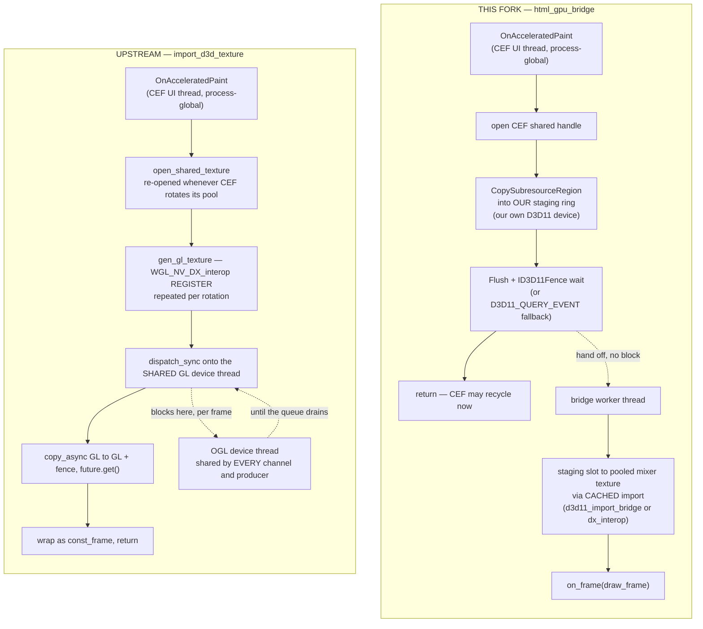

# Two GPU-direct HTML paths — findings, the upstream PR, and the harness it needs

**Status: investigated, decided, NOT acted on. 2026-08-18.** No code changed for this
document. It exists because the sync onto `upstream/master` put two implementations of the
same feature in one tree, §4.1 of [`UPSTREAM_SYNC_2026-08-18.md`](../audits/UPSTREAM_SYNC_2026-08-18.md)
deferred the choice, and the reasoning behind that deferral is worth more than the one-line
summary it left.

> **Headline: keep this fork's `html_gpu_bridge`. Upstream's path throws once per frame on
> the Vulkan mixer, which is this fork's default.** That is not a preference between two
> designs — it is a defect in upstream's, on upstream's own terms, and it is the strongest
> available on-ramp for proposing ours to them.

---

## 1. What each implementation is

| | this fork | upstream |
| :--- | :--- | :--- |
| Entry point | `frame_factory::gpu_device_handle()` + `gpu_device_backend()` — two virtuals **with defaults** | `frame_factory::import_d3d_texture()` — one **pure virtual** carrying a D3D type |
| Machinery | [`html/producer/html_gpu_bridge.{h,cpp}`](../../src/modules/html/producer/html_gpu_bridge.cpp) (768 lines), `ogl/util/dx_interop`, `vulkan/util/d3d11_import_bridge` | [`accelerator/d3d/{d3d_device,d3d_device_context,d3d_texture2d}`](../../src/accelerator/d3d/) (~350 lines) |
| Where the work happens | the html module | the mixer |

### 1.1 The two paths, side by side

The thread lanes are the point, not the box count.



### 1.2 Why this fork copies twice, which is not waste

CEF documents the handle from `OnAcceleratedPaint` as **pool-owned and valid only inside the
callback**, and the texture carries no keyed mutex. So a copy must not merely be submitted
but **finished** before the callback returns; a submitted-but-unexecuted blit reading a
recycled texture yields a torn frame rather than a crash, which is the class of bug that does
not reproduce on demand.

Both implementations obey that. They differ in what they pay for it:

* **This fork** copies into its own staging ring, on its own D3D11 device, and waits on its
  own fence. Because the staging texture is ours, **its shared handle is created once and
  lives for the bridge's life — so the expensive import is cached** ([`html_gpu_bridge.cpp:78-84`](../../src/modules/html/producer/html_gpu_bridge.cpp#L78)).
  The second copy, into a pooled mixer texture, runs on the bridge's own worker.
* **Upstream** registers CEF's texture with GL and copies GL→GL, but does it by a
  **synchronous round trip onto the shared OGL device thread** and blocks on the resulting
  fence — both on the CEF UI thread.

The comment that predicted this is in our header, written before the sync:

> the CEF UI thread is process-global and shared by every html producer in the server, so a
> per-frame sync hop onto a single device executor would serialise the whole browser message
> loop behind the mixer's queue depth

Upstream's `image_mixer.cpp` does exactly that: `ogl_->dispatch_sync([...] { return
ogl_->copy_async(...); })` followed by `gl_texture.get()`.

---

## 2. The decisive finding: upstream's throws on Vulkan

`upstream/master:src/accelerator/vulkan/image/image_mixer.cpp:389`:

```cpp
core::const_frame import_d3d_texture(...) override
{
    throw std::runtime_error("d3d texture import not supported on vulkan accelerator");
}
```

`import_d3d_texture` is a **pure virtual** on `frame_factory`, so upstream's Vulkan mixer has
to implement it, and implements it as a throw. Three facts make that fatal rather than merely
unfinished:

1. `html_producer.cpp`'s `OnAcceleratedPaint` wraps the call in
   `catch (...) { CASPAR_LOG_CURRENT_EXCEPTION(); }`, so the throw is swallowed and repeated.
2. `is_gpu_shared_texture_enabled()` ([`html.cpp:386`](../../src/modules/html/html.cpp#L386))
   decides whether to request shared textures from **`enable-gpu` plus a D3D device probe
   only**. It never asks which mixer is running.
3. `src/shell/casparcg.config:6` of this fork is `<accelerator>vulkan</accelerator>`.

So on the default configuration, adopting upstream's path means GPU-direct HTML renders
nothing and logs an exception **per frame, per producer**. That is the same shape as the
storm `log_triage` was built for — 708,390 lines of one Vulkan refusal filling 513 MB in a
single session — and it is why "adopt upstream's for coherence" is not coherence.

---

## 3. Full comparison

| axis | this fork | upstream |
| :--- | :--- | :--- |
| GPU copies per frame | **2** | **1** |
| Import / registration cost | **once**, for the bridge's life | **per CEF pool rotation** (`open_shared_texture` + `gen_gl_texture`) |
| CEF UI thread blocks on | its own D3D11 copy + fence | `dispatch_sync` onto the shared GL device thread, then a GL fence |
| Several HTML producers | independent — own device, own worker | all serialise behind one device queue |
| Vulkan mixer | supported (device LUID → DXGI adapter, `d3d11_import_bridge`) | **throws per frame** |
| Adapter selection | Vulkan: exact, via device LUID. OpenGL: probe until `wglDXOpenDeviceNV` succeeds — succeeding *is* the adapter test, and the only reliable one | **none**: `D3D11CreateDevice(nullptr, D3D_DRIVER_TYPE_HARDWARE, …)`, process-wide singleton, default adapter |
| Multi-GPU | correct — shared handles are adapter-bound, and the adapter is chosen to match the mixer | wrong whenever the mixer is not on the default adapter |
| Failure handling | `healthy()`, `probing()`, adapter-mismatch diagnosis, drop counters, staging back-pressure as a first-class outcome | logs and continues |
| Linux path | handle is `void*`, byte order an enum, rect four ints — a dmabuf variant is **additive** | D3D types reach `core/frame/frame_factory.h` |
| Layering | D3D stays out of `core/` | `core/frame/frame_factory.h` forward-declares `accelerator::d3d::d3d_texture2d` |

**Where upstream genuinely wins.** One copy instead of two, and a smaller, tidier interface —
the producer knows nothing about D3D and the mixer owns the import. If the world were one
OpenGL mixer on one GPU with one HTML producer, upstream's is the design to prefer, and this
document would say so.

That is not this deployment. Multi-GPU with adapter-bound shared handles
(two GPUs on this box, mixers on adapter 0), Vulkan by default, and HTML used for lower-third templates where
several producers coexist.

**And the copy-count advantage is narrower than it looks**: upstream pays a re-open and a WGL
re-registration every time CEF rotates its pool, which this fork pays exactly once. Neither
of those is cheap, and neither has been measured (§6).

---

## 4. Decision

**Keep `html_gpu_bridge`. Do not adopt upstream's frame-import path. Do not leave the tree in
its current state either** — both compiled with ours wired is the worst long-term option,
because those files re-conflict at every future sync while serving nothing.

Concrete cleanup, owed but not done:

1. **Drop upstream's `import_d3d_texture` deliberately** rather than as an artefact of the
   sync's deferral: it is already absent from `frame_factory`, so also remove upstream's two
   overrides (OGL real, Vulkan throw-stub) and say in the commit that the frame-import path
   is not this fork's mechanism.
2. **Keep `accelerator/d3d/` compiled.** Not optional: `html.cpp`'s
   `is_gpu_shared_texture_enabled()` probes the D3D device to decide whether CEF can hand
   over a shared texture at all, and without those three files it is an unresolved symbol at
   link time. This is already the state after `6aa7f004e`.
3. **Keep `gpu_device_handle()` / `gpu_device_backend()`** as the entry point. Two virtuals
   *with defaults* is non-breaking and platform-neutral; a pure virtual carrying a D3D type
   is neither.

---

## 5. The upstream PR, if it is ever made

### 5.1 Frame it as a bug report first, not a redesign

Proposing "replace the CEF shared-texture path you merged in March" is a hard sell against an
active maintainer's own feature. Proposing "your Vulkan accelerator and your CEF path
together throw once per frame for any user who sets `<accelerator>vulkan</accelerator>` and
enables GPU" is a defect in upstream's tree, reproducible without any of this fork's code,
and it opens the conversation on the right footing. Offer the implementation as the fix, not
as an opinion.

That framing also decides the order: the **issue** comes first and can be filed today; the
**PR** follows only if there is appetite for it.

### 5.2 Slices, smallest first

| # | Slice | Depends on | Notes |
| :--- | :--- | :--- | :--- |
| 0 | Issue: `import_d3d_texture` throws on the Vulkan accelerator | — | Reproducible on upstream alone. Cite `vulkan/image/image_mixer.cpp:389`, and that `is_gpu_shared_texture_enabled()` never checks the backend |
| 1 | `frame_factory::gpu_device_handle()` + `gpu_device_backend()`, with defaults | — | Additive and non-breaking. Stands alone as "let a module ask which GPU the mixer is on" |
| 2 | The OpenGL half of `html_gpu_bridge` + `ogl/util/dx_interop` | 1 | Fixes nothing upstream is missing yet, so lead with the contention argument — which means §6 must exist first |
| 3 | The Vulkan half — `d3d11_import_bridge`, `dxgi_adapter_for_vk_device` | 1, 2 | **Only possible now**: upstream merged the Vulkan accelerator in #1677. This is the slice that closes slice 0's bug |
| 4 | Retire `import_d3d_texture` and the `accelerator/d3d` frame path | 2, 3 | Last, and only if 2 and 3 land. Removes a D3D type from a `core/` header |

### 5.3 Constraints on the PR itself

* **Rebase onto `upstream/master`, never merge master in.** Maintainer asked for this
  directly on #1766; budget N conflict resolutions rather than one, and check each side's
  brace delta before resolving. Asked for on #1766, 2026-08-14.
* **Far fewer comments than this fork's style.** The archaeology density here is deliberate
  and is the opposite of what the maintainer asked for. Asked for by the maintainer directly.
* **Report numbers, never the private harness that produced them.** No module names, no
  `cli.py` invocations.
* **The `[[nodiscard]]`, `<chrono>`/CUDA and C4459 fixes from `6aa7f004e` are NOT part of
  this** — they are fork-local consequences of C++20 and belong in their own PRs if at all.

---

## 6. The harness this needs, and why it does not exist yet

**Every efficiency claim in §3 is architectural reasoning. None of it is measured.** That is
fine for a decision that keeps the status quo — the Vulkan throw-stub settles it on
correctness alone — and it is not fine for a PR that asks upstream to change a design. Slice
2 above cannot honestly be proposed without §6 first.

### 6.1 What already exists

`CasparCG-TestRunner/vkdispatch/html_gpu.py` (250 lines) — an ad-hoc script, not a battery.
It already drives 1 and 4 layers × CEF GPU off/on × both mixers, and collects process-tree
CPU (`cores`), a per-layer delta, `tick_ms`, `late_frames` from `INFO`, an error count, and a
PSNR between the GPU-off and GPU-on captures. It is the right starting point; promoting it is
cheaper than starting over.

**Four traps it already records, which any battery must inherit:**

1. **CEF paints on damage.** A *static* page reaches the paint callback about twice and then
   never again. The first version of that script used one and reported `+0.003 cores` per
   layer, which was a precise measurement of four idle producers. An **animated** page is
   what prices the paint path.
2. **Two pages are needed, for different questions.** Animated for cost; still for the
   picture comparison, because two servers are never on the same frame of an animation.
3. **The HTML producer resolves a bare name against `template/`, without the extension.**
   Give it a filename and CEF treats it as a hostname and quietly loads nothing.
4. **CEF's GPU compositor must be on at all** — `configuration.html.enable-gpu`, which
   CasparCG disables by default. Turning it on is itself a cost, and it is the bar the saved
   readback has to clear.

And from how the HTML producer is actually used here — alpha lower thirds into a DeckLink fill+key output: the **key channel is a first-class
output**, so alpha is compared separately from RGB; straight-alpha PNGs must be composited
over black before comparison, because at alpha ≈ 1/255 the RGB values are meaningless and
produce max-255 diffs that mean nothing; and GPU compositing changes text antialiasing
**independently of any transport change** — measured within 2/255 on alpha and 3/255
composited on a probe template, but it must be A/B'd on real templates rather than assumed.

### 6.2 What a `html-gpu` battery would add

| # | Capability | Why the existing script cannot answer it |
| :--- | :--- | :--- |
| 1 | **Producer-count sweep 1→N**, not 1 and 4 | Contention is a *curve*. Two points cannot distinguish "costs more per layer" from "serialises above K layers", and serialisation is the whole claim |
| 2 | **Per-producer paint interval and its jitter**, from each producer's `browser-tick-time` | Aggregate `cores` is blind to the failure mode. A serialised UI thread can show flat CPU while every producer's paint cadence degrades together |
| 3 | **Time blocked inside the paint callback**, per producer | This is THE number that separates the two designs. This fork exposes it already — `html_gpu_bridge::take_stage_wait_us()`, plotted as `gpu-stage-time`. Upstream's path has no equivalent, so the battery must derive it from paint-interval statistics to compare them at all |
| 4 | **Alpha as its own verdict**, composited over black | The deployment is fill+key. An RGB-only PSNR passes a wrong key |
| 5 | **A control that must FAIL** | A GPU-direct path that silently declines to the copy path renders correctly and cheaply, and would pass every check above. The battery has to assert the GPU path was actually taken — the `memcpy` graph value populated means the host path ran, and `gpu-stage-time` populated means this one did; exactly one may be non-zero |
| 6 | **Log triage gated, not collected** | Upstream's Vulkan stub is a per-frame exception. A battery that does not fail on an exception storm would have called §2 a pass |

### 6.3 The prerequisite nobody will enjoy

**Comparing the two implementations requires both to be buildable in one tree**, selected at
configure time — something like `-DHTML_GPU_PATH=bridge|d3d_import`, with
`frame_factory::import_d3d_texture` and the bridge each behind it. That is real work on a
feature we have just decided not to change, and it is the honest cost of slice 2's argument.

**Which suggests the cheaper order**: build capabilities 1, 2, 4, 5 and 6 against *this
fork's* implementation only. That gives a contention curve, a paint-cadence baseline and an
alpha verdict for the path we actually ship — useful on its own merits, and the thing
this tree's rule that a correctness proof is not a performance proof asks for. The A/B against upstream's implementation is
then a smaller increment on top, and only worth paying for if slice 0's issue gets traction.

---

## 7. What would change the decision

* **Upstream implements `import_d3d_texture` on the Vulkan accelerator for real.** Then §2
  evaporates, the comparison reduces to §3's copy-count-versus-contention trade, and it
  becomes a genuine measurement question rather than a correctness one.
* **The contention curve turns out flat** up to the producer counts this deployment uses.
  Then upstream's single copy and smaller interface win on merit, and adopting theirs becomes
  the coherent choice — this is exactly what §6 exists to find out.
* **Upstream adds adapter selection** to `d3d_device::get_device()`. That removes the
  multi-GPU objection, though not the Vulkan one.
* **The deployment stops using Vulkan by default.** Unlikely, and it would not fix the
  multi-GPU adapter problem.

## 8. Sources

* **This fork** at `6aa7f004e`: `html_gpu_bridge.{h,cpp}`, `html.cpp`, `html_producer.cpp`,
  `ogl/util/dx_interop`, `vulkan/util/d3d11_import_bridge`, `core/frame/frame_factory.h`.
* **Upstream** `CasparCG/server` at `30fcb2f4e`: `accelerator/d3d/*`,
  `ogl/image/image_mixer.cpp`'s `import_d3d_texture`,
  `vulkan/image/image_mixer.cpp:389` (the throw stub), `core/frame/frame_factory.h`.
* **CEF's own contract** for `OnAcceleratedPaint` — handle pool-owned, valid only inside the
  callback, no keyed mutex — as cited in `html_gpu_bridge.h`'s header comment.
* **`CasparCG-TestRunner/vkdispatch/html_gpu.py`** for §6.1's prior art and its four traps.
* Nothing in §3's efficiency column is measured. Said plainly because a table invites the
  opposite assumption.
