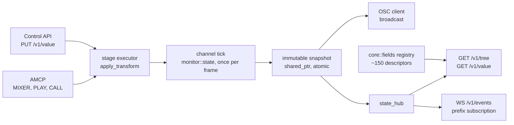

# Control API — the server's state as an addressable tree

> **State:** partial
> **Modules:** `src/protocol/http`, `src/core/frame/transform_fields.h`
> **Commands:** 1 fork-specific AMCP command — `MIXER FIELD`, the registry's own projection onto AMCP
> **Coverage:** `api-tree`, `api-roundtrip`, `api-events`, `api-write`, `api-atframe`, `api-readiness`, `api-stage`, `html-input` -- which is the only coverage of the input action (§2)

An HTTP interface that exposes what the server publishes as an **addressable, self-describing
tree**, in the OSCQuery format. A client fetches `/v1/tree` once and knows every parameter that
exists, its type, its arity, its legal range and what animates it — instead of hard-coding a list
of `MIXER` commands and their argument orders. Turned on by an `<http>` block under
`<controllers>`; absent by default, so a server that does not configure one opens no port.

Reading, subscribing, writing, transport actions and atomic batches all work, and six batteries
run against them on **both mixers**. What is missing is named in §5 rather than implied by the
word "API".

---

## 1. What is implemented today

| surface | state | evidence |
| :--- | :--- | :--- |
| `GET /v1/tree` — the whole address space | implemented | `build_tree` in `api_tree.cpp` |
| `GET /v1/tree/<path>` — a sub-tree | implemented | `tree_at`, same file |
| `GET /v1/value/<path>` — one value | implemented | `read_value`, same file |
| `?HOST_INFO` on any path — the capability probe | implemented | `host_info`, same file |
| The uniform reply envelope, with a `server` name | implemented | `envelope` in `api_status.cpp` |
| The field registry behind the descriptors | implemented | `core::fields::all()`, `transform_fields.cpp` |
| `<http>` controller, `<port> <host> <name> <extent> <max-prefixes>` | implemented | the `http` branch of `setup_controllers`, `server.cpp` |
| Live mixer values, published sparsely by the tick | implemented | `publish_layer_transform` in `stage.cpp` |
| `MIXER {ch}-{layer} FIELD {name} [values]` -- every registry field over AMCP | implemented | `mixer_field_command` in `AMCPCommandsImpl.cpp` |
| `<auth>password</auth>` -- challenge/response, SHA-256 | implemented | `auth_state` in `api_auth.cpp`, `sha256` in `common/sha256.h` |
| `PUT /v1/value/.../mixer/{field}` -- validated, with `duration` and `tween` | implemented | `write_value` in `api_value.cpp` |
| `op`: `set`, `toggle`, `add`, `cas` -- one closure on the stage executor | implemented | same |
| `POST /v1/action/.../{verb}` -- transport, clear, **input**; clip loads and input delegated to AMCP | implemented | `run_action` in `api_action.cpp` |
| `POST /v1/batch` -- validate-all-then-apply, one frame across channels | implemented | `run_batch`, same file |
| `GET /v1/openapi.json` -- generated, and `GET /v1/docs` | implemented | `openapi` and `docs_page` in `api_openapi.cpp` |
| `at_frame` / `in_frames` on a batch | implemented | `park_batch` and `drain_batches` in `http_server.cpp` |
| `WS /v1/events` -- prefix subscription with a per-connection diff | implemented | `collect_events` in `api_events.cpp`, `ws_session` in `http_server.cpp` |
| `throttle_ms`, `repetition_filter`, revert events | implemented | same |

**Three sources are joined to build the tree**, and none of them alone describes the address space:

* the **channels and layers that exist**, scanned out of the tick's own snapshots;
* **every key the snapshot carries**, as a read-only leaf — this is exactly what OSC has always
  sent, now addressable rather than broadcast;
* the **transform field registry**, per layer, under `mixer/`. This is the part a snapshot cannot
  supply: a parameter sitting at its default is not published, so without this pass a client would
  discover only the parameters somebody had already changed.

**A mixer value at its default is not published at all**, and that is the one thing to know
before reading anything here. The tick emits only the fields that DIFFER from their declared
default, so `/v1/value` answers an unpublished path with the descriptor's default and flags the
reply `is_default`. Absent means "at its default" — never "unknown". A client that treats a
missing key as unknown will show a stale value forever after a reset.

**An AMCP change is visible here within one tick**, because there is one state and the tick is the
only thing that publishes it. `MIXER 1-10 OPACITY 0.5` is readable at
`/v1/value/channel/1/stage/layer/10/mixer/opacity` on the next frame, with no AMCP change of any
kind — which is the property the whole design rests on, and the reason writes can be added later
without a second model of the server appearing anywhere.

---

## 2. How to drive it

Add an `<http>` block beside the `<tcp>` one. Every default below is the literal in
`setup_controllers`, and the same literals appear in the commented reference block at the bottom of
`src/shell/casparcg.config`:

```xml
<controllers>
    <tcp>
        <port>5250</port>
        <protocol>AMCP</protocol>
    </tcp>
    <http>
        <port>5254</port>
        <host>0.0.0.0</host>
        <name>stage-left</name>
        <auth>off</auth>
        <extent>mixer</extent>
        <max-prefixes>32</max-prefixes>
    </http>
</controllers>
```

| element | default | meaning |
| :--- | :--- | :--- |
| `<port>` | `5254` | Not 5253 — that is the OSC predefined-client port in the shipped example config, and the collision would surface only as OSC packets arriving at an HTTP listener. |
| `<host>` | `0.0.0.0` | Bind address. |
| `<name>` | the machine's hostname | Names this server in every reply, and is `HOST_INFO.NAME`. A client attached to two servers tells them apart by this. |
| `<auth>` | `off` | `password` turns on the handshake below. It needs a `<password>` and refuses to start without one. |
| `<extent>` | `mixer` | `state` exposes only what the tick published. `mixer` also describes every mixer parameter of every existing layer — which is what a generated control surface needs, and what most of the tree's size is. |
| `<max-prefixes>` | `32` | Per-connection subscription prefixes. Reserved for `/v1/events`. |

Four requests, against a server with `bars` playing on `1-10`:

```
curl http://127.0.0.1:5254/v1/tree
curl http://127.0.0.1:5254/v1/tree/channel/1/stage/layer/10/mixer
curl http://127.0.0.1:5254/v1/value/channel/1/stage/layer/10/foreground/ready
curl "http://127.0.0.1:5254/v1/tree?HOST_INFO"
```

The last one is answered on **any** path, which is what makes it usable as a liveness and identity
check before a client knows the address space -- `HOST_INFO.PID` is how a test fixture confirms it
is talking to the server it started rather than to somebody else's on the same port.

**Live values arrive on a WebSocket at `/v1/events`.** Connect, send one `subscribe`, and every
change under those prefixes is pushed:

```json
-> {"op":"subscribe","id":"s1",
    "prefixes":["/channel/1/stage/layer/10/mixer/","/channel/1/frame"],
    "throttle_ms":40,"repetition_filter":true}

<- {"status":{"code":"ok","message":""},"server":"stage-left",
    "result":{"subscribed":true,"id":"s1","prefixes":2}}

<- {"id":"s1","server":"stage-left","frame":{"1":365},
    "events":[{"path":"/channel/1/stage/layer/10/mixer/opacity","value":0.5}]}
```

| field | meaning |
| :--- | :--- |
| `prefixes` | Each must start `/channel/{index}` -- that is what bounds the per-tick scan to the channels asked for, so it is a requirement rather than a convention. Matching is on **segment boundaries**: `/channel/1` does not match `/channel/10`. At most `<max-prefixes>` of them. |
| `throttle_ms` | Minimum interval between messages, default 0. Changes are coalesced rather than dropped: the diff is against what this client was last **sent**, so the message that does arrive carries the latest value. |
| `repetition_filter` | Default true -- a key republished with an unchanged value produces no event. |
| `id` | Echoed on every message, so a client multiplexing several subscriptions can route them. |
| `server` | On every message, so a client attached to two servers can tell them apart without tracking which socket is which. |
| `frame` | The frame number of every channel the subscription touched, so an event can be tied to a picture. |

**The first message after subscribing is the whole subscribed set**, not a diff -- the
per-connection diff starts empty, so every matching key reads as changed. That is a client's
initial state without a second REST round trip.

**A field that returns to its default produces `{"path": ..., "value": <default>, "reverted": true}`.**
It stops being published, and silence would otherwise leave the client showing the old value
forever. A path with no descriptor default -- a layer that was cleared -- reports `value: null`
alongside `reverted`, which is honest about the difference.

`op: "unsubscribe"` stops the flow without closing the socket. `HOST_INFO.SUBSCRIPTIONS` counts
the live ones. `HOST_INFO.EXTENSIONS.LISTEN` stays **false** on purpose: that advertises
OSCQuery's per-path `LISTEN`/`IGNORE`, which is a different mechanism from a prefix subscription,
and claiming it would leave a standard client waiting on a socket that is never going to answer
it.

### Writing a value

`PUT /v1/value/channel/{n}/stage/layer/{m}/mixer/{field}` -- mixer fields only in this build.

```bash
curl -X PUT http://127.0.0.1:5254/v1/value/channel/1/stage/layer/10/mixer/opacity \
     -d '{"value": 0.42, "label": "vt roll-in"}'

curl -X PUT http://127.0.0.1:5254/v1/value/channel/1/stage/layer/10/mixer/opacity \
     -d '{"value": 0.0, "duration": 50, "tween": "easeoutsine"}'

curl -X PUT http://127.0.0.1:5254/v1/value/channel/1/stage/layer/10/mixer/fill_translation \
     -d '{"value": [0.1, 0.2]}'

curl -X PUT http://127.0.0.1:5254/v1/value/channel/1/stage/layer/10/mixer/blend_mode \
     -d '{"value": "screen"}'
```

| body field | meaning |
| :--- | :--- |
| `value` | A bare value for a scalar field, an array for a vector one. A scalar also accepts a one-element array, because `/v1/value` reports scalars bare and the tree reports them as arrays -- a client writing back what it read from either is right. |
| `duration`, `tween` | Frames and a tween name, exactly as the `MIXER` commands' optional arguments. An unknown tween is `bad_request` rather than silently linear. |
| `label` | Free text, logged with the write and the client's address. A show that goes wrong is reconstructed from that log, and a label the operator chose beats any identifier the server could invent. |
| `op` | `set` (the default), `toggle`, `add` or `cas`. |

**An enumeration takes a name or its ordinal**, and the reply reports the **name** either way --
the reply echoes what the field now HOLDS, not what arrived, so a client can store the answer.

**Out of range is refused, never clipped**, with the component and the limits:

```json
{"status":{"code":"field_out_of_range","message":"value out of range for chroma_min_brightness",
           "details":[{"component":0,"min":0.0,"max":1.0,"got":5.0,"path":"chroma_min_brightness"}]},
 "server":"stage-left","result":null}
```

That matches `grade_param`, the single place every `MIXER` command validates, so the two facades
cannot disagree about what is legal. `bounding` in the descriptor is what a control surface
applies to its own slider; it is not what the server does to a value. **Wrapped fields are the
exception**: a periodic quantity is normalised into range first, so `hue_shift` 400 is 40 and -400
is -40 rather than two errors.

**`toggle`, `add` and `cas` read and write inside one closure on the stage executor**, so no other
client's write can interleave between the read and the write:

```bash
curl -X PUT .../mixer/invert   -d '{"op":"toggle"}'
curl -X PUT .../mixer/opacity  -d '{"op":"add","value":0.25}'
curl -X PUT .../mixer/opacity  -d '{"op":"cas","expect":0.75,"value":0.3}'
```

A `cas` whose `expect` does not match answers `field_conflict` and carries both values; nothing is
written. `add` and `toggle` range-check the COMPUTED value, because the client did not know what
the old one was.

**A write is applied immediately and readable through `/v1/value` on the next tick.** The reply's
`value` is authoritative and needs no round trip; the state is a per-frame snapshot and is at most
one frame behind. Read back too fast and you get the previous frame's value -- which is a correct
answer to a different question.

### Actions

`POST /v1/action/channel/{n}/stage/layer/{m}/{verb}` -- `play`, `stop`, `pause`, `resume`,
`preview`, `clear`, `clear_transforms`, `input`. `POST /v1/action/channel/{n}/{verb}` takes
`clear`, `clear_transforms` and `input` for the whole channel.

```bash
curl -X POST .../v1/action/channel/1/stage/layer/10/play -d '{"clip":"AMB","loop":true}'
curl -X POST .../v1/action/channel/1/stage/layer/10/pause
curl -X POST .../v1/action/channel/1/clear
curl -X POST .../v1/action/channel/1/stage/layer/10/input      -d '{"type":"mouse","action":"move","x":0.25,"y":0.75}'
```

**`input`** -- synthetic pointer and keyboard events, since 2026-09-08. The body's `type` is
`mouse`, `key` or `text`; a mouse `action` is `move`, `down`, `up`, `wheel` or `leave`, with
`x`/`y` in **0..1 across the target's own picture, top-left origin**, an optional `modifiers`
mask, `button` for a press, and `dx`/`dy` for a wheel. A key takes `action` plus a numeric
`key`; text takes `text`.

With a layer the event goes to that layer; **without one it is hit-tested topmost-first**, which
is the same path a gesture on the screen consumer's own window takes. `docs/features/html-gpu-direct.md`
§4 owns the full grammar and what is not covered.

Everything the API can do through `stage_base` it does directly -- the same object AMCP's handlers
call. Three forms are delegated to AMCP instead and say so in the reply: `play` and `load` **with
a clip**, because they need a producer built from a string, and **`input`**, for a different
reason worth stating. A channel-level input must try the image mixer before the stage -- previz
consumes the event when it is active -- and `video_channel::input` is the single place that
decides. `api_context` hands out a `stage_base` rather than a channel, so a direct route here
would have to duplicate that decision, which is how two dispatch orders come to disagree.

```json
{"status":{"code":"ok","message":""},"server":"stage-left",
 "result":{"via":"amcp","sent":"PLAY 1-10 bars LOOP","code":202,"reply":"202 PLAY OK"}}
```

Parsing a clip name into a producer is the producer registry's job, and a second implementation of
`LOOP`/`SEEK`/`LENGTH` beside the original is exactly the duplication that let `MIXER EXPOSURE`
diverge. The cost is that a delegated failure carries AMCP's detail rather than this API's: a
missing file is `unknown_path`, a bad argument is `bad_request`, and neither says which argument.

### Batches

`POST /v1/batch` applies several ops **inside one frame, across every channel they touch**.

```json
{"label":"go cue 12","ops":[
  {"op":"set","path":"/channel/1/stage/layer/10/mixer/opacity","value":0.25},
  {"op":"set","path":"/channel/2/stage/layer/10/mixer/opacity","value":0.75},
  {"op":"action","path":"/channel/1/stage/layer/10/pause"}
]}
```

**Every op is validated before any op is applied.** A failure answers `batch_op_failed` with the
failing index and that op's own status, and **nothing is written**:

```json
{"status":{"code":"batch_op_failed","message":"op 2 is invalid; nothing was applied",
           "details":[{"index":2,"code":"unknown_path","message":"no such mixer field: nope"}]}}
```

The atomicity is real rather than nominal: each touched channel gets a `core::stage_delayed`
holding a blocked executor, every op is queued against it, every touched channel is then locked,
and only then are the executors released -- so no channel's tick can run between the first op
landing and the last. Measured on two channels: both events carried **the same frame number**.

Two limits, both deliberate:

* **A clip load cannot be inside a batch.** It has to go through AMCP to build the producer, which
  runs against the channel's real stage, so it would land whenever AMCP got to it -- outside the
  frame the rest of the batch is pinned to. It is refused at validation rather than silently
  breaking the guarantee. `POST` it to `/v1/action` first, then batch the rest.
* **`queue` is accepted and echoed, and there is one queue.** The field is reserved now so a client
  written today does not have to change when independent queues arrive.

### The API describes itself

`GET /v1/openapi.json` is an OpenAPI 3.1 document, **generated**. The eight endpoints are written
out in the source because there are eight of them and they do not change on their own; the field
list is not -- every mixer parameter, its JSON type, its arity, its range, its enumeration values,
its composition rule and its keyframe names come from `core::fields::all()`. The document cannot
describe a field the server does not have, or miss one it does, and there is no `.yaml` in the
repository to go stale.

`GET /v1/docs` renders the same thing as a page: the endpoint table and all 177 fields. It is
plain HTML with **no script and no external reference**, so it works on a server with no route to
the internet -- which is most of them.

**It is not Swagger UI**, which this branch's plan called for. Swagger UI is around 1.5 MB of
third-party JavaScript and CSS that would be vendored into the repository and embedded in the
binary, carrying its own licence, to give a developer a form to click; the alternative is loading
it from a CDN, which the machine it runs on cannot reach. 27 KB of generated HTML answers the same
question.

### Authentication

With `<auth>password</auth>` the password never crosses the wire. Ask for a challenge, answer it
on the same request you want to make:

```
GET /v1/auth
→ {"auth":"password","salt":"0486...","challenge":"6a80...","expires_s":30,
   "algorithm":"Authorization: Caspar <challenge>:<sha256(sha256(password+salt)+challenge)>, hex, lower case"}

GET /v1/tree
Authorization: Caspar 6a80...:9f3c...
```

* **The client echoes the challenge it is answering.** That is what lets a WRONG answer consume
  the challenge, so a guess costs a round trip to `/v1/auth` rather than nothing.
* **A challenge is single-use**, right or wrong, and expires after 30 s. A correct answer cannot
  be replayed.
* **The salt is per server RUN.** A captured exchange is worthless against the next start.
* **The WebSocket takes the same answer**, in the upgrade request's own `Authorization` header --
  the only chance a WebSocket handshake gives.
* **`?HOST_INFO` is behind it too.** An unauthenticated client learns nothing, not even the
  server's name.

**What this buys, and what it does not.** It stops the password being shouted on a studio LAN.
It is not confidentiality -- every request and every event after the handshake is cleartext -- and
it is not a password store: `<password>` is plain text in the config, so anyone who can read the
config has the password whatever this does. There is no key stretching, deliberately: stretching
a secret that is stored in the clear beside it protects nothing. **This is not a substitute for
keeping the port off any interface you do not control.**

SHA-256 is vendored (`src/common/sha256.h`) because the tree links no crypto library on either
platform, and adding one -- or a `#ifdef` between Windows CNG and libcrypto -- for a single hash
in a single handshake is a worse trade than 150 lines with the standard's own test vectors in the
header.

### The same fields over AMCP

`MIXER FIELD` is the registry projected onto AMCP, so a client already speaking AMCP reaches
every parameter this API describes -- and a field added to the registry is settable, readable and
animatable with no handler written for it.

```
MIXER 1-10 FIELD                            → the whole inventory, 177 rows
MIXER 1-10 FIELD opacity                    → 0.37
MIXER 1-10 FIELD opacity 0.37               → 202 MIXER OK
MIXER 1-10 FIELD opacity 0.0 50 easeoutsine → the same duration/tween every MIXER command takes
MIXER 1-10 FIELD fill_translation 0.1 0.2   → a vector field, one value per component
MIXER 1-10 FIELD blend_mode screen          → an enumeration by name
MIXER 1-10 FIELD blend_mode 5               → ...or by ordinal; reads back as `add`
```

The inventory line is `name arity rw|r [min..max]`, so a client with no documentation at all can
discover the surface from the protocol it is already speaking.

**It validates against the same descriptor the API reports**, so `MIXER FIELD
chroma_min_brightness 5` and the equivalent `PUT` fail identically, and neither can drift from
what the tree advertises. The existing ninety `MIXER` handlers are untouched -- see section 3 for
why they were not rewritten.

### Scheduling a batch on a frame

`at_frame` names a frame from **this server's own `/channel/{n}/frame`**; `in_frames` counts from
now. Give one or the other, never both.

```json
{"label":"go cue 12","at_frame":451,"ops":[ ... ]}
{"label":"go cue 12","in_frames":50,"ops":[ ... ]}
```

The reply comes back at once -- holding an HTTP socket open for fifty frames to avoid saying so
would be a worse trade than any it saves:

```json
{"status":{"code":"ok","message":""},"server":"stage-left",
 "result":{"scheduled":true,"at_frame":451,"channel":1,"now":401,"ops":2}}
```

`channel` is the **lowest channel the batch touches**, chosen by the server rather than the caller
so that two clients naming the same frame mean the same instant.

**Measured, six runs, two channels:** the change becomes observable **2 frames after `at_frame`**,
every time, and the **spread between the two channels is 0 frames**, every time. The offset is the
publication pipeline -- a batch applied after the server observes frame N appears in a later
snapshot -- and it is **not compensated for**, deliberately: the constant is stable on this machine
and guessing it into the scheduler would be over-fitting. A client that needs a value visible on
frame F asks for F-2; a client that needs two channels to change *together* -- which is what a cue
actually needs -- gets that exactly.

**A frame that has already passed is refused**, with the frame the server is on:

```json
{"status":{"code":"bad_request",
           "message":"at_frame 1 is not in the future; channel 1 is on frame 503"}}
```

Quietly firing a missed cue late is how a show ends up out of sync with nothing in the log.

**Validation still happens before scheduling**, so a batch with a bad op is refused immediately
rather than at the frame it was aimed at.


Every reply carries the same envelope:

```json
{
  "status": { "code": "ok", "message": "" },
  "server": "stage-left",
  "result": { "path": "/channel/1/stage/layer/10/mixer/opacity", "value": 1.0, "type": "d", "is_default": true }
}
```

A leaf's descriptor, as it appears in the tree — the vendor block is everything OSCQuery has no
key for:

```json
{
  "FULL_PATH": "/channel/1/stage/layer/10/mixer/chroma_min_brightness",
  "ACCESS": 3,
  "TYPE": "d",
  "VALUE": [0.0],
  "RANGE": [{ "MIN": 0.0, "MAX": 1.0 }],
  "casparcg": {
    "type": "real", "bounding": "refuse", "compose": "max", "kind": "continuous",
    "arity": 1, "default": [0.0], "writable": true, "kf": ["chroma_min_bright"]
  }
}
```

---

## 3. Design decisions, and what they cost

**Application errors are HTTP 200 with a non-zero `status.code`.** Rejected: mapping each failure
onto an HTTP status. Two reasons. An intermediary that retries or alerts by HTTP status should not
treat "you asked for a path that does not exist" as a server fault; and a client that has to branch
on both layers gets two sources of truth that can disagree. The exceptions are the two failures
that really are transport — an endpoint that does not exist at all, and authentication. The cost is
that `curl -f` does not fail on an application error, which surprises people once.

**The vendor block, rather than new top-level keys.** Rejected: putting `bounding`, `compose`,
`default` and `kf` next to `ACCESS` and `RANGE`. A strict OSCQuery client is entitled to reject a
node carrying unknown top-level keys, and ossia and Vezér both extend the format exactly this way.
The cost is one level of nesting for the fork-specific half of every descriptor.

**`CLIPMODE` is OMITTED for a `refuse` field, and that is a correction made 2026-09-09.** It used
to be *"emitted only for `clip`"*, mapping `clip` to `"both"` — and §2's own line above,
**"out of range is refused, never clipped"**, was already the truth. So the documentation was right
and the descriptor was the liar: **74 ranged fields advertised `clip`, and both facades refused
them.** That mattered more through `CLIPMODE` than through `bounding`, because `bounding` is ours
and a reader can check it against the code, while `CLIPMODE` is a standard field a third-party
OSCQuery client branches on.

All four OSCQuery values describe a value that gets **used** — `none` is explicitly *"the OSC
method will try to use any value you send it"* — so refusal has no member of the vocabulary.
`clipmode_name` now returns `nullptr` for it and the leaf omits the key, because the
specification's own rule for a missing optional attribute (*"assume that no clipping will be
performed"*) is at least not a claim about clamping. `free` and `wrap` keep `"none"`, where it is
true: the value as sent, or as wrapped, is the value stored.

**`bounding` lost `clip` and `fold` in the same change.** Neither was ever honoured by any code
path, and a vocabulary value that no code path honours is a trap for the next reader. The three
that remain each have one: `free` (no range declared), `wrap` (normalised into range), `refuse`
(rejected, with the limits in the error).

**Clamping is deliberately not offered, and the reason is where clamping belongs.** A client never
needs to send out of range for a slider drag — `RANGE` is published, so the widget is built from it
and stops at the bound. What is left is a script typo, a client that ignored the descriptor, or a
*computed* value, and computed values are already clamped upstream: `compose_clamps` for
composition, and a binding's own `MIN`/`MAX` for modulation. Clamping at the boundary would add
nothing and would cost the error signal, write idempotence, and authored intent in a timeline whose
tracks are these fields.

**One place does clamp, and it is not an inconsistency:** `MIXER CDL_FILE` clamps the ten values it
reads out of an ASC CDL file, because *"a file is operator-supplied ... so a file cannot reach a
state the numeric command refuses"*. **An imported document clamps; a typed command refuses.** A
client loading a preset should expect the former and a client setting a value the latter.

**A field with no limits declares `bounding: free`, and gets no `RANGE` key at all.** This was
wrong on its first outing and the failure is worth recording: seventeen rows — `opacity`,
`brightness`, `contrast`, `saturation` and most of the projection block — declared `clip` with no
range to clip against, because `clip` reads as the safe default when writing a table row. The tree
rendered them as `"RANGE": [{}]`, which is *worse than saying nothing*: a client reads the key's
presence as "this is bounded" and then finds no MIN or MAX to bound it with. The registry now
**refuses to build** a table with a bounding rule and nothing to bound (`programming_error` from
`fields::all()`), so the class cannot come back quietly.

**A per-frame snapshot is complete; only the work of building it is skipped.** The obvious way to
keep sparse publication cheap is to publish on change and stay quiet in between, and that is what
the projection block did for as long as it existed. It is correct for a stream — an OSC receiver
holds the last value it was sent — and wrong for a snapshot, where a reader sees one tick and
nothing else. Measured while building this: `MIXER 1-10 OPACITY 0.5` read back as `0.5` or as
"absent, therefore default" depending on which frame the request landed in, from the same server,
seconds apart. The fix is a per-layer cache: work out which fields differ from their default only
when the transform CHANGES, and write the cached keys into the state on every tick. The cost is in
§4 and in `CHANGELOG.md`; the projection block was moved onto the same rule, which is a cadence
change for existing OSC consumers and is why it has a `CHANGELOG.md` entry of its own.

**`MIXER FIELD` rather than rewriting the ninety existing handlers.** The plan for this branch
said to re-point every `MIXER` command at `fields::find`/`set`, making AMCP a projection of the
registry. It is not what happened, for two reasons. The handlers are not getters and setters:
`MIXER BLUR` takes a radius, a type NAME, an angle and a centre and derives `blur.enable` from the
radius; `MIXER CHROMA` carries a legacy positional form beside a modern one; `MIXER PROJECTION`
converts four parameters from degrees. Generic field access would either lose those grammars or
reimplement them beside the originals -- and reimplementing beside the original is the exact
failure the registry exists to prevent. And `conformance` and `grading` drive perhaps a dozen of
those ninety commands, so a ninety-handler rewrite would have a blast radius far larger than its
gate. `MIXER FIELD` adds a path and removes none, which is why those batteries could confirm the
frame path unmoved rather than merely fail to notice.

**A value is dry-run before the transform is queued**, and that is not defensive
programming -- it is a defect this command shipped and then fixed. `MIXER 1-10 FIELD blend_mode 5`
pushed the ordinal as the STRING `"5"`, the descriptor's setter looked it up in the name list, did
not find it, and returned false. But `set` runs inside the transform closure, on the stage
executor, long after the command replied `202 MIXER OK`. Accepted, reported back as unchanged, no
effect: the exact shape of the `MIXER EXPOSURE` defect, reproduced by the machinery built to
prevent it. The fix is both halves -- an ordinal is pushed as a number, and every value is now
applied to a scratch `image_transform` first, so a bad one is a `403` before anything is queued.

**Out of range is refused rather than clipped.** Rejected: clamping to the descriptor's range,
which is friendlier and is a different server. `grade_param` refuses, so clipping here would mean
`MIXER 1-10 CHROMA ... 5.0` and `PUT .../chroma_min_brightness 5.0` doing different things -- and
the whole argument for one state is that the two facades cannot disagree. The `bounding` column is
what a control surface applies to its own slider; it is not what the server does to a value that
arrives out of range.

**The read and the write of an in-place operation are the same closure.** `toggle`, `add` and
`cas` compute inside `apply_transform`'s function, on the stage executor, against the transform
the write lands on. Rejected: read via `get_current_transform`, compute, write -- which is two
tasks with a gap, and the gap is exactly where another client's write goes. Measured with two
clients issuing 100 toggles each: every reply's `value` equalled the next reply's `previous`, one
unbroken chain of 200. **A parity check would have passed either way**, which is why the chain is
the assertion.

**A batch owns its delayed stages, and finding out why cost an hour.** `core::stage_delayed` held
its channel's `shared_ptr<stage>` **by reference**, which is safe only while the caller's own
variable outlives the batch. That is true for `AMCPCommandQueue`, which passes a channel's member,
and false for anything holding the pointer in a local -- and the failure is not a crash. Both
delayed stages resolved through a dangling reference to the same `stage`, so locking the second
channel hit a mutex this thread already held and threw `resource_deadlock_would_occur` from inside
a `try` block that reported it as `internal`. One channel worked; two did not. The member is now
held by value, which costs one atomic increment per batch and removes a trap that was waiting for
whoever wrote the second caller.

**The composition self-test runs on every start, for BOTH backends, whichever one is
configured.** It is the exit criterion for a later change -- making the mixers CALL
`core::fields::compose_colour` instead of their own hand-written tables -- and it is worth its
milliseconds before then, because it is the only thing stopping the registry and the mixers
drifting in the meantime. A divergence names the field, not just the fact.

Its first run said so eight times over, and every one was the registry's error rather than a
mixer's: `enable_geometry_modifiers` declared `or_` when the colour composition never touches it
at all; `shape_stroke_enable` declared `or_` when the mixers replace the whole `shape` struct;
the fifteen per-channel-levels rows declared individual rules **on top of** a group rule that
already merged the block, which is idempotent for the min/max rows and squares the gamma; and six
fields -- `levels_gamma`, the three per-channel gammas, `sharpen_amount`, `grain_intensity` --
declared that composition clamps them when neither mixer does. The last of those is now a
declared column rather than an assumption, and **whether the mixers should clamp those six is a
real open question**: their own comment says combined grading values are clamped so that "two
layers at the edge of legal would otherwise reach a value no single command could set", and these
six sit outside that rule for no stated reason. Answering it changes rendered output for stacked
layers and needs its own measurement.

**The diff is per connection, not per server.** Rejected: one server-side "last published" set
that every subscriber diffs against. Two clients with different `throttle_ms` are at different
points in time, so a shared set hands one of them a diff computed against the other's view -- and
the value it skipped is never sent again, because as far as the server is concerned it has already
been published. The cost is one `map<path, value>` per connection, sized by what that connection
actually subscribed to.

**One collect at a time per session, and one fan-out queued at a time per server.** Ticks arrive
faster than a slow client drains, so both are guarded by an atomic flag and a second request is
skipped rather than queued. Skipping is safe precisely because the diff is against `last_values`:
the collect that does run carries everything the skipped one would have. Without the guards, four
channels at 25 fps queue a hundred tasks a second whether or not the previous ones have run.

**A mode that cannot work is refused at startup, in both directions.** `<auth>password</auth>`
with an empty `<password>` fails to start rather than letting everyone in: an operator who wrote
that has asked for authentication, and starting anyway hands them a wide-open port they believe
is closed. And `<auth>off</auth>` now logs a warning naming the risk, because "no authentication"
is a decision worth seeing in the log of a server someone else configured.

**The client names the challenge it answers, which the first version did not.** Without it the
server has to try every live challenge in turn -- workable, and it means a wrong answer cannot be
attributed to a challenge and therefore cannot consume one. Measured on that version: a corrupted
answer was rejected and the correct answer to the same challenge was still accepted afterwards, so
a challenge could be guessed at for its whole 30-second life. Echoing the challenge makes one
attempt per challenge, right or wrong.

**Request handling runs on its own executor, not on the shared `io_context`.** Accept, read and
write use the shell's `io_context` — the same shape `AsyncEventServer` uses for AMCP. Every request
*body* is posted to a dedicated `http-api` thread and the reply posted back. A tree serialisation is
tens of kilobytes of JSON and a future write blocks on a stage future; doing either on an
`io_context` thread would stall AMCP and OSC, which share it.

**`protocol_http` is a separate library from `protocol`.** `protocol` force-includes a precompiled
header into every translation unit, and Beast in a PCH costs seconds per file — and in this tree a
header edit does not invalidate the PCH, so it would need the full manual sweep from `CLAUDE.md` on
every change. Boost.JSON is compiled from source into one translation unit here
(`boost_json_src.cpp`, with `BOOST_JSON_NO_LIB`), which makes the dependency identical on Windows
and Linux and leaves both bootstraps untouched.

---

## 4. Verification -- what is measured, and what is not

Six batteries, run on **both mixers**. Every one exits 0 only if every check passed; an
INCONCLUSIVE check exits 2, never 0, so a battery whose fixture did not come up cannot report
success.

| battery | what it drives | numbers | date |
| :--- | :--- | :--- | :--- |
| `api-tree` | 2 channels, a clip on layer 10 | **11/11** on both mixers. **500 advertised leaves, 0 unresolvable** through `/v1/value`; 177 mixer descriptors, all carrying their vendor block; 0 empty `RANGE` objects; all four not-found codes specific | 2026-09-05 |
| `api-roundtrip` | every writable field, with a value **derived from its own descriptor** | **8/8** on both mixers. **172 of 177 fields written with a non-default value; 0 refused, 0 failed to store, 0 disagreed between the API and `MIXER FIELD`, 0 failed to restore** | 2026-09-05 |
| `api-events` | 3 subscriptions | **10/10** on both mixers. AMCP-originated and API-originated changes both arrive; revert reported; throttle at 400 ms gave gaps of **401, 438, 400 ms** and still ended on the final value; `SUBSCRIPTIONS` back to 0 on close | 2026-09-05 |
| `api-write` | validation, contention, batches | **9/9** on both mixers. Eight refusals each with their own code and **the value read back unchanged after all eight**; **200 concurrent toggles forming one unbroken chain**; a failed batch applied nothing; a two-channel batch landed on **frame 215 on both** | 2026-09-05 |
| `api-atframe` | 10 scheduled batches | **7/7** on both mixers. **Spread between channels 0 frames on all ten**; offset from `at_frame` **2 frames on all ten** | 2026-09-05 |
| `api-readiness` | a 75-frame clip | **7/7** on both mixers. Readiness observable **113-133 ms after PLAY**; transport followed pause/resume/stop; `file/frame` **(22, 75)** against **ffprobe's 75** | 2026-09-05 |

**The two things every one of these is blind to, and they are the important ones.**

* **None of them looks at a pixel.** `api-roundtrip` writes 172 fields and confirms each reads
  back through both facades -- and a field that stores correctly and renders nothing passes every
  check in it. That is the `MIXER EXPOSURE` class exactly, and closing it needs a capture per
  field, which is a different battery. `conformance` and `grading` cover the magnitude for the
  dozen fields they drive, on both mixers.
* **The tree and the value come from the same descriptor**, so they agree by construction.
  Nothing here can say a `min`, a `max` or a default is *right*; only an external reference could,
  and there is none. The one claim checked by something outside this harness is the OpenAPI
  document, which `openapi-spec-validator` accepts as OpenAPI 3.1.

Three narrower limits, each stated where it applies:

* **`api-atframe` gates the SPREAD at one frame, not zero.** A batch is atomic against other
  batches, not against the channel ticks -- the two channels tick on their own threads, so an
  apply landing between them publishes on frame N for one and N+1 for the other. Measured at
  0 on twenty of twenty-one runs and 1 once. And this is the spread in the PUBLISHED STATE:
  whether the two pictures change on the same frame is not measured by anything.
* **`api-readiness` cannot see `false -> true`.** A local clip is ready before the first tick
  publishes anything, so the transition is not observable and the battery reports the latency
  rather than gating it. Only a deliberately slow source would show the edge, and there is no
  such fixture.
* **The auth handshake has no battery**; its six refusals and two acceptances are one manual run.

Numbers taken by hand and not by a battery, kept because nothing re-runs them:

| what | numbers | date |
| :--- | :--- | :--- |
| tick cost of sparse publication | 16 layers, `tick/produce` mean: **+0.322 ms** with static fields set, **+0.436 ms** with every transform tweening; `tick/total` unchanged at 39.6 ms in all six arms. Full table in `CHANGELOG.md` | 2026-09-05 |
| the registry agrees with both mixers | `compose self-test`, at every startup: 177 fields, 256 randomised pairs, **0 divergences on opengl and 0 on vulkan**. Its first run reported 8 diverging fields -- see §3 | 2026-09-05 |
| the generated OpenAPI document is valid | `openapi-spec-validator` accepts it as **OpenAPI 3.1**. 43 KB, 8 paths, **177 field schemas**, 15 status codes | 2026-09-05 |
| the docs page is self-contained | 27 KB, **0 `<script>` tags, 0 external references** | 2026-09-05 |
| authentication | no header, replayed answer, corrupted answer, wrong password, malformed header, unauthenticated WS upgrade: **all six 401**; a correct answer 200. A corrupted answer **consumed its challenge** | 2026-09-05 |
| the frame path is unchanged by `MIXER FIELD` | `conformance` **100/100 within 1.0 LSB** and `grading` **48/48**, on **both mixers** | 2026-09-05 |
| KEYFRAMES still round-trips | `KEYFRAMES 1-10 SET`/`GET` exact across `opacity`, `rgb_r_gamma`, `proj_yaw` and `blur_type`, including `proj_yaw` 90 on the wire against radians in the struct; frozen-name check passes at 193 | 2026-09-05 |

---

## 5. Known gaps

1. ~~**No battery.**~~ **CLOSED.** Six batteries run on both mixers — `api-tree`,
   `api-roundtrip`, `api-events`, `api-write`, `api-atframe`, `api-readiness`. This item read
   "No battery. Every number in section 4 is one manual run on one machine" for some time
   after they landed, which is exactly the class of stale claim §5 exists to hold.

   ~~**A live intermittent**~~ — **DIAGNOSED AND FIXED 2026-09-06, and neither cause was a
   server defect.** `api-write --mixer ogl` had been failing about one run in three, on two
   *different* checks. Both were faults in the check:

   * **"no lost updates under contention"** sorted the 200 toggle replies by `time.time()`
     recorded **client-side after each reply arrived**, then required each reply's `value` to
     equal the next one's `previous`. A receive timestamp is not execution order — the threads
     race in the client as well as in the server — so the chain read as broken with nothing
     lost. It now counts **edge directions** instead: 200 toggles from `false` must report
     exactly 100 `false→true` and 100 `true→false`. A lost update is two clients reading one
     state and both writing its opposite, which imbalances the counts **whatever order the
     replies arrive in**, so no clock is consulted and none can be wrong.
   * **"a two-channel batch lands on ONE frame"** asserted frame *equality*, which is stricter
     than what a batch offers. `api-atframe` already gates the same property at a spread of
     **≤ 1** because a batch is atomic against other batches, not against the channel ticks —
     and the observed failure, frames 222 and 223, is a spread of exactly 1. The two batteries
     were disagreeing about the same guarantee. Now both gate at ≤ 1; a spread of 2 still fails.

   Same class as the Phase-1 `is_default` race that reported 112 restored fields as unrestored:
   a check that measured *when a reply arrived* rather than *what the server did*.

   Measured after the fix: **five consecutive `api-write` runs on each mixer, 9/9 every time**,
   plus ten mutation tests in the harness's `tests/test_api_write_invariants.py` that hold each
   replacement to failing on the fault it exists for — including a correct-but-shuffled run,
   which is precisely what the old check rejected.
2. ~~**Only mixer fields are writable.**~~ **CLOSED 2026-09-06 for the 3D stage.** `PUT` also
   resolves `/channel/{n}/mixer/previz/camera/{field}`, `.../view_camera/{field}` and
   `.../screen/{name}/{field}`.

   Three restrictions, each with a reason rather than a to-do:

   * **`op: set` only.** `toggle`, `add` and `cas` get their atomicity on the mixer path from
     running inside one closure on the stage executor, where no other client can interleave
     between the read and the write. The previz renderer has no equivalent — its API is a set of
     per-property setters — so a read-modify-write here would span two calls and two acquisitions
     of the scene lock. A `toggle` that is not atomic would be worse than no `toggle`.
   * **Not tweenable.** KEYFRAMES is bound to `image_transform` end to end, so a screen cannot be
     animated in this build. `duration` and `tween` are refused rather than ignored.
   * **`size` and `arc` have no mutator.** Both are set only by `add_screen_flat` /
     `add_screen_curved`, which build a fresh `screen_meta` and would silently discard position,
     rotation, eye mode and ICVFX. Refused with that reason in the message.

   **The write reports what the renderer HOLDS, not what was asked for**, and the difference is
   not hypothetical: `set_screen_eye_mode` stores `design_eye_*` only when the mode is already
   `fixed`, so setting a design eye on a camera-mode screen changes nothing. The bridge compares
   intended against actual — both read through the same accessor, so canonicalisation and float
   widening cancel — and a genuine refusal comes back as `field_conflict` with both values.
3. ~~**No field emits a `DESCRIPTION`.**~~ **CLOSED for the stage, still open for the mixer.**
   The sixteen stage rows each carry one and the table refuses to load without it, so
   `HOST_INFO.EXTENSIONS.DESCRIPTION` now derives to `true` and the leaves that carry the key are
   the stage's. The 177 mixer rows still pass `nullptr`; filling them needs a slot in the eleven
   macros and is its own commit.

   The original finding, kept because the shape of it recurs:

   As found on 2026-09-06: the `field_desc` column existed, `api_tree.cpp` emitted `DESCRIPTION`
   when it was non-null, **every row passed `nullptr`**, and `HOST_INFO` nevertheless advertised
   `EXTENSIONS.DESCRIPTION: true`. So the guard never fired, no leaf carried the key, and the
   capability probe said otherwise. Same class as `LISTEN`, which is advertised `false` precisely
   so a client does not wait for something that never comes — this one had the care backwards.

   `host_info` **derives** the flag across all three tables rather than asserting it, so it says
   what is true on the day it is asked and needed no second edit when the stage rows landed.

   **Not covered by any battery.** `api-tree` reads `HOST_INFO` and asserts nothing about
   `EXTENSIONS`, so nothing would have caught the original and nothing gates the derivation now.
4. **A clip load goes through AMCP**, so its failures carry AMCP's detail rather than this API's,
   and it cannot take part in an atomic batch.
5. **`at_frame` is this server's own frame counter, so two servers cannot yet be told to change
   together.** Each server counts from its own start, and nothing aligns them; the cluster module
   has a PTP-derived frame clock that would, and the API does not use it. That is the gap between
   "two channels change together", which is measured and works, and "two machines change
   together", which does not.
6. **The 2-frame offset is not compensated for.** Measured stable, and named in section 2 rather
   than corrected, because the constant is this machine's pipeline rather than a property of the
   protocol.
7. **No `sleep_frames`.** A batch is one instant; a sequence with waits inside it needs independent
   queues, which is the same deferral as `queue`.
8. **Authentication is a handshake, not a channel.** Everything after it is cleartext, and the
   password is plain text in the config. It protects against listening, not against reading the
   config, and it is not a reason to expose the port off-segment.
9. **A subscription is not resumable.** A dropped socket loses the per-connection diff, so a client
   must re-subscribe and take the full set again. There is no session id to resume, deliberately.
10. **`throttle_ms` is per message, not per path.** A subscription covering a busy prefix and a
   quiet one throttles both together.
11. **A `wrap` field with no declared range is not normalised.** The projection angles are the whole
   set: they declare `wrap` because they are periodic and carry no limits, so `proj_yaw` 7.5 rad
   stays 7.5 rad. AMCP stores it the same way, so the two agree -- but a client cannot rely on
   getting a canonical representative back.
12. **The blob fields report presence, not content.** `lut3d`, `hue_curves`, `blend_mask` and
   `grade_nodes` appear as `blob` descriptors and refuse a `PUT`; loading one stays a `MIXER`
   command.
13. **`ocio.source_space` is read-only** -- validating a colour-space name against the loaded OCIO
    config lives in the accelerator layer, which this library does not link.
14. **No discovery.** There is no mDNS/Zeroconf anywhere in the fork, so a client is told where the
    server is rather than finding it.
15. **The projection block is published twice**, under its historical `projection/*` names for
    existing OSC consumers and under its registry names in `mixer/proj_*`. Both are live and they
    agree; retiring the first changes a published interface and is deliberately not done here.

---

## 6. Related commits

* `protocol/http: Beast listener, envelope, GET /v1/tree, GET /v1/value, <http> controller` — the
  first runnable endpoint, and the commit that established that the tree needs three sources rather
  than one. Also fixed `setup_controllers` reading `<protocol>` before testing the controller's
  name, which made every non-`tcp` controller throw "Missing parameter: protocol" — an error naming
  an element the controller in question does not have.
* `core: layer ready/transport/empty; av_producer file/frame` — `is_ready()` has been implemented by
  every producer since forever and published nowhere, which is why every client has had to infer
  readiness from a timer.
* `core: atomic channel snapshot, frame key, on_tick carries shared_ptr` — the tick used to hand
  every subscriber a deep copy of the state map and store another into a member that readers read
  unsynchronised. The snapshot is now immutable and published under an atomic, which is what makes
  a second consumer of the state free rather than expensive.
* `core: transform field registry` — the declaration this tree's four hand-written field lists are
  now derived from or checked against.

---

## 7. Diagrams



**Why this diagram and not a prose paragraph:** the point is that the two write façades reach the
same state and the two read façades leave from the same snapshot — which is a shape, not a
sequence. The dotted edges are the parts this build does not have, so the picture stays honest
about what is drawn and what is planned.

## 8. Fault catalogue

Generated from `docs/faults.yaml`, which is the one list of these. The harness's
`tests/test_fault_catalogue.py` reads the `api_code` enum out of `api_status.h` and asserts that
every code the server can answer with has a row here, and that every row has substance -- so a
code added to the enum and not to the catalogue fails a test rather than reaching a client
undocumented at the moment something has gone wrong.

| code | what it means | what to do |
| :--- | :--- | :--- |
| `ok` | The request succeeded. | Nothing. |
| `unknown_path` | No such path in the address space, or no such endpoint. For a mixer field this means the NAME is wrong, not that the value is unset -- a field at its default still reads, and answers with the default. | Fetch `/v1/tree` and look for the path there. `GET /v1/docs` lists every field name. |
| `not_writable` | The path exists and this build refuses to write it. The blob fields (`lut3d`, `hue_curves`, `blend_mask`, `grade_nodes`) report presence and are loaded by their own `MIXER` commands; `ocio_source_space` is validated against the loaded OCIO config, which lives in a layer the API does not link. | Use the `MIXER` command that owns it. |
| `field_wrong_type` | The JSON type or the component count does not match the descriptor. A string where a number belongs, a two-element array for a scalar, an enumeration name that is not in the list. | The descriptor is in the tree, under `casparcg.type` and `casparcg.arity`. Note that `"0.5"` is not `0.5`; a client sending a string for a number has a bug and the API refuses rather than guessing. |
| `field_out_of_range` | Outside the declared range, and the field is not periodic. `details` carries the component, the limits and the value that arrived. | Clamp on the client. `casparcg.bounding` says how -- and note the API REFUSES rather than clipping, deliberately, because the `MIXER` commands refuse too and the two facades must not disagree about what is legal. |
| `field_missing` | A required part of the body is absent -- no `value`, no `expect` on a `cas`, no `ops`. | The message names which one. |
| `field_conflict` | A compare-and-set whose `expect` did not match. `details` carries both values. Nothing was written. | Re-read, decide whether to overwrite, and either retry or tell the operator that something else moved the value. |
| `field_bound` | The path exists and is writable, and a BINDING currently owns it -- a live source is driving it every tick. Nothing was written, deliberately: the write would have been applied and then overwritten on the next frame, which is worse than a refusal because it succeeds and does not last. | `UNBIND <ch>-<layer> <field>` hands the field back, and an explicit write then sticks. Distinct from `not_writable` on purpose: that one means the field is derived and never settable, so a control surface should grey the slider out, while this one means something else has it and the surface can offer to take it back. `BIND <ch> LIST` says what owns what. |
| `channel_not_found` | The channel index does not exist on this server. | `GET /v1/tree` lists the channels. A channel with no consumer never ticks and therefore publishes nothing, so it will not appear -- check the config's `<consumers>`. |
| `layer_not_found` | The layer index does not exist. A layer exists once something has been loaded on it and stops existing on `CLEAR`; a stopped layer still exists, with `foreground/empty` true. | Load something first, or read `foreground/empty` to tell stopped from cleared. |
| `producer_not_ready` | A valid request that cannot be honoured yet because the producer has not finished loading. | Wait for `foreground/ready`, which is what it is published for. |
| `batch_op_failed` | One op of a batch was invalid, and NOTHING was applied. `details[0].index` is the failing op and `details[0].code` is its own status. | Fix that op. The rest of the batch was never attempted, so there is nothing to undo. |
| `not_supported_on_backend` | The request is valid but the configured mixer does not implement it. Reserved: no field currently answers this, and it exists so that a future one-backend feature has an honest answer rather than silently doing nothing. | Run the other mixer, or avoid the field. |
| `unauthorized` | `<auth>password</auth>` is configured and the `Authorization` header was absent, malformed, answered a challenge that had already been used, or was wrong. | `GET /v1/auth`, then answer THAT challenge. A challenge is single-use whether the answer was right or wrong, so a retry needs a new one. |
| `bad_request` | Malformed JSON, an unknown `op`, a tween name that does not exist, `at_frame` in the past, or `at_frame` and `in_frames` together. | The message says which. |
| `internal` | The server threw. This is a defect, not a usage error, and the message carries what the exception said. | Look at the server log around the same moment -- an `internal` with nothing in the log is itself worth reporting. |

`docs/faults.yaml` also lists the log lines a harness run forgives, each with its reason. There is
one: the warning that `<auth>off</auth>` is configured, which is emitted on purpose and whose
absence on a server configured that way would be the finding.
