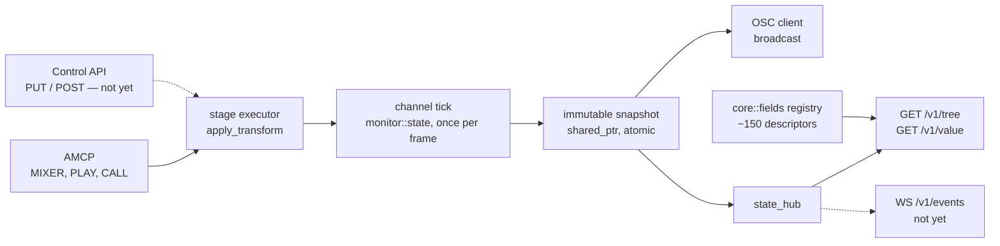

# Control API — the server's state as an addressable tree

> **State:** partial
> **Modules:** `src/protocol/http`, `src/core/frame/transform_fields.h`
> **Commands:** none — this is a protocol-layer feature, like the OSC client
> **Coverage:** **none**

An HTTP interface that exposes what the server publishes as an **addressable, self-describing
tree**, in the OSCQuery format. A client fetches `/v1/tree` once and knows every parameter that
exists, its type, its arity, its legal range and what animates it — instead of hard-coding a list
of `MIXER` commands and their argument orders. Turned on by an `<http>` block under
`<controllers>`; absent by default, so a server that does not configure one opens no port.

**This build is read-only.** `GET` works; writing, subscribing and batching are named as gaps in
§5 rather than implied by the word "API".

---

## 1. What is implemented today

| surface | state | evidence |
| :--- | :--- | :--- |
| `GET /v1/tree` — the whole address space | implemented | `build_tree` in `api_tree.cpp` |
| `GET /v1/tree/<path>` — a sub-tree | implemented | `tree_at`, same file |
| `GET /v1/value/<path>` — one value | implemented | `read_value`, same file |
| `?HOST_INFO` on any path — the capability probe | implemented | `host_info`, same file |
| The uniform reply envelope, with a `server` name | implemented | `envelope` in `api_status.cpp` |
| The field registry behind the descriptors | implemented | `core::fields::all()`, `transform_fields.cpp` |
| `<http>` controller, `<port> <host> <name> <extent> <max-prefixes>` | implemented | the `http` branch of `setup_controllers`, `server.cpp` |
| Live mixer values, published sparsely by the tick | implemented | `publish_layer_transform` in `stage.cpp` |
| `<auth>password</auth>` | **refused at startup**, with a fatal log | same branch — see §3 |
| `PUT /v1/value`, `POST /v1/action`, `POST /v1/batch` | **not implemented**; answered `bad_request` | `route()` in `http_server.cpp` |
| `WS /v1/events` | **not implemented**; `HOST_INFO.EXTENSIONS.LISTEN` is `false` | §5 gap 1 |

**Three sources are joined to build the tree**, and none of them alone describes the address space:

* the **channels and layers that exist**, scanned out of the tick's own snapshots;
* **every key the snapshot carries**, as a read-only leaf — this is exactly what OSC has always
  sent, now addressable rather than broadcast;
* the **transform field registry**, per layer, under `mixer/`. This is the part a snapshot cannot
  supply: a parameter sitting at its default is not published, so without this pass a client would
  discover only the parameters somebody had already changed.

**A mixer value at its default is not published at all**, and that is the one thing to know
before reading anything here. The tick emits only the fields that DIFFER from their declared
default, so `/v1/value` answers an unpublished path with the descriptor's default and flags the
reply `is_default`. Absent means "at its default" — never "unknown". A client that treats a
missing key as unknown will show a stale value forever after a reset.

**An AMCP change is visible here within one tick**, because there is one state and the tick is the
only thing that publishes it. `MIXER 1-10 OPACITY 0.5` is readable at
`/v1/value/channel/1/stage/layer/10/mixer/opacity` on the next frame, with no AMCP change of any
kind — which is the property the whole design rests on, and the reason writes can be added later
without a second model of the server appearing anywhere.

---

## 2. How to drive it

Add an `<http>` block beside the `<tcp>` one. Every default below is the literal in
`setup_controllers`, and the same literals appear in the commented reference block at the bottom of
`src/shell/casparcg.config`:

```xml
<controllers>
    <tcp>
        <port>5250</port>
        <protocol>AMCP</protocol>
    </tcp>
    <http>
        <port>5254</port>
        <host>0.0.0.0</host>
        <name>stage-left</name>
        <auth>off</auth>
        <extent>mixer</extent>
        <max-prefixes>32</max-prefixes>
    </http>
</controllers>
```

| element | default | meaning |
| :--- | :--- | :--- |
| `<port>` | `5254` | Not 5253 — that is the OSC predefined-client port in the shipped example config, and the collision would surface only as OSC packets arriving at an HTTP listener. |
| `<host>` | `0.0.0.0` | Bind address. |
| `<name>` | the machine's hostname | Names this server in every reply, and is `HOST_INFO.NAME`. A client attached to two servers tells them apart by this. |
| `<auth>` | `off` | `password` is refused at startup in this build. |
| `<extent>` | `mixer` | `state` exposes only what the tick published. `mixer` also describes every mixer parameter of every existing layer — which is what a generated control surface needs, and what most of the tree's size is. |
| `<max-prefixes>` | `32` | Per-connection subscription prefixes. Reserved for `/v1/events`. |

Four requests, against a server with `bars` playing on `1-10`:

```
curl http://127.0.0.1:5254/v1/tree
curl http://127.0.0.1:5254/v1/tree/channel/1/stage/layer/10/mixer
curl http://127.0.0.1:5254/v1/value/channel/1/stage/layer/10/foreground/ready
curl "http://127.0.0.1:5254/v1/tree?HOST_INFO"
```

The last one is answered on **any** path, which is what makes it usable as a liveness and identity
check before a client knows the address space — `HOST_INFO.PID` is how a test fixture confirms it
is talking to the server it started rather than to somebody else's on the same port.

Every reply carries the same envelope:

```json
{
  "status": { "code": "ok", "message": "" },
  "server": "stage-left",
  "result": { "path": "/channel/1/stage/layer/10/mixer/opacity", "value": 1.0, "type": "d", "is_default": true }
}
```

A leaf's descriptor, as it appears in the tree — the vendor block is everything OSCQuery has no
key for:

```json
{
  "FULL_PATH": "/channel/1/stage/layer/10/mixer/chroma_min_brightness",
  "ACCESS": 3,
  "TYPE": "d",
  "VALUE": [0.0],
  "RANGE": [{ "MIN": 0.0, "MAX": 1.0 }],
  "CLIPMODE": "both",
  "casparcg": {
    "type": "real", "bounding": "clip", "compose": "max", "kind": "continuous",
    "arity": 1, "default": [0.0], "writable": true, "kf": ["chroma_min_bright"]
  }
}
```

---

## 3. Design decisions, and what they cost

**Application errors are HTTP 200 with a non-zero `status.code`.** Rejected: mapping each failure
onto an HTTP status. Two reasons. An intermediary that retries or alerts by HTTP status should not
treat "you asked for a path that does not exist" as a server fault; and a client that has to branch
on both layers gets two sources of truth that can disagree. The exceptions are the two failures
that really are transport — an endpoint that does not exist at all, and authentication. The cost is
that `curl -f` does not fail on an application error, which surprises people once.

**The vendor block, rather than new top-level keys.** Rejected: putting `bounding`, `compose`,
`default` and `kf` next to `ACCESS` and `RANGE`. A strict OSCQuery client is entitled to reject a
node carrying unknown top-level keys, and ossia and Vezér both extend the format exactly this way.
The cost is one level of nesting for the fork-specific half of every descriptor.

**`CLIPMODE` is emitted only for `clip`.** OSCQuery's vocabulary is `none|low|high|both`; `wrap`
and `fold` are ossia's `bounding`, not OSCQuery's. Saying `both` for a hue rotation would tell a
standard client to clamp a value that is periodic. Wrapped fields therefore report `CLIPMODE:
"none"` and their real rule in `casparcg.bounding`.

**A field with no limits declares `bounding: free`, and gets no `RANGE` key at all.** This was
wrong on its first outing and the failure is worth recording: seventeen rows — `opacity`,
`brightness`, `contrast`, `saturation` and most of the projection block — declared `clip` with no
range to clip against, because `clip` reads as the safe default when writing a table row. The tree
rendered them as `"RANGE": [{}]`, which is *worse than saying nothing*: a client reads the key's
presence as "this is bounded" and then finds no MIN or MAX to bound it with. The registry now
**refuses to build** a table with a bounding rule and nothing to bound (`programming_error` from
`fields::all()`), so the class cannot come back quietly.

**A per-frame snapshot is complete; only the work of building it is skipped.** The obvious way to
keep sparse publication cheap is to publish on change and stay quiet in between, and that is what
the projection block did for as long as it existed. It is correct for a stream — an OSC receiver
holds the last value it was sent — and wrong for a snapshot, where a reader sees one tick and
nothing else. Measured while building this: `MIXER 1-10 OPACITY 0.5` read back as `0.5` or as
"absent, therefore default" depending on which frame the request landed in, from the same server,
seconds apart. The fix is a per-layer cache: work out which fields differ from their default only
when the transform CHANGES, and write the cached keys into the state on every tick. The cost is in
§4 and in `CHANGELOG.md`; the projection block was moved onto the same rule, which is a cadence
change for existing OSC consumers and is why it has a `CHANGELOG.md` entry of its own.

**`auth=password` is refused at startup rather than ignored.** Accepting a mode that is not
implemented would leave an operator who deliberately configured authentication with a wide-open
port and nothing in the log to say so — strictly worse than the same port with `off` written in the
config, because there the operator knows. Off by default is acceptable; silently absent is not.

**Request handling runs on its own executor, not on the shared `io_context`.** Accept, read and
write use the shell's `io_context` — the same shape `AsyncEventServer` uses for AMCP. Every request
*body* is posted to a dedicated `http-api` thread and the reply posted back. A tree serialisation is
tens of kilobytes of JSON and a future write blocks on a stage future; doing either on an
`io_context` thread would stall AMCP and OSC, which share it.

**`protocol_http` is a separate library from `protocol`.** `protocol` force-includes a precompiled
header into every translation unit, and Beast in a PCH costs seconds per file — and in this tree a
header edit does not invalidate the PCH, so it would need the full manual sweep from `CLAUDE.md` on
every change. Boost.JSON is compiled from source into one translation unit here
(`boost_json_src.cpp`, with `BOOST_JSON_NO_LIB`), which makes the dependency identical on Windows
and Linux and leaves both bootstraps untouched.

---

## 4. Verification — what is measured, and what is not

| what | battery | numbers | date |
| :--- | :--- | :--- | :--- |
| the tree builds and every readable leaf resolves | **none — checked by hand** | 2 channels, 1 layer: 247 leaves, **0 unresolvable** through `/v1/value`; 177 mixer descriptors; 75 KB; 14 ms per full-tree request | 2026-09-05 |
| status codes | **none — checked by hand** | `unknown_path`, `channel_not_found`, `layer_not_found` each returned for the case that should produce them | 2026-09-05 |
| readiness is observable | **none — checked by hand** | `foreground/ready` `true` and `foreground/transport` `playing` for a `PLAY`ed layer | 2026-09-05 |
| an AMCP change reaches the API | **none — checked by hand** | `MIXER 1-10 OPACITY` at 0.5, 0.4 and 0.3 in turn: each read back correctly, and **10 consecutive reads returned the same value every time** — the check that catches a value published only on the tick it changed | 2026-09-05 |
| a reverted field disappears | **none — checked by hand** | `MIXER 1-10 OPACITY 1.0` returns the path to `is_default` | 2026-09-05 |
| tick cost of sparse publication | **none — checked by hand** | 16 layers, `tick/produce` mean: +0.322 ms with static fields set, +0.436 ms with every transform tweening; `tick/total` unchanged at 39.6 ms in all six arms. Full table in `CHANGELOG.md` | 2026-09-05 |

**What these numbers do not cover, and it is most of it.** They were taken by hand from one server
on one machine, not by a battery, so nothing re-runs them and nothing will notice when they stop
being true. Specifically:

* **No battery exists for this feature.** The `api-tree`, `api-roundtrip`, `api-events`,
  `api-write` and `api-readiness` batteries are planned and unwritten. Until they exist, every
  claim here is a claim about one manual run.
* **Nothing measures the values.** "247 leaves resolve" says each path answers `ok`; it says
  nothing about whether any value is *correct*. The one thing that would have caught the
  `RANGE: [{}]` defect was reading the output, not counting the successes.
* **The 14 ms is one channel pair with one layer.** It is not a load figure and does not extrapolate
  — the mixer descriptor set is copied per layer.
* **Nothing runs against two servers, a remote bind, or a non-loopback network.** WebSocket
  fragmentation and keep-alive do not exist on loopback.

---

## 5. Known gaps

1. **`WS /v1/events` does not exist.** `HOST_INFO` advertises `LISTEN: false`, so a standard client
   is told the truth rather than left waiting. Closing it needs the per-connection diff, prefix
   matching that is segment-bounded (`/channel/1` must not match `/channel/10`), and a throttle.
   Until then a client that wants live values polls, which is what the tree is cheap enough for and
   is still the wrong answer at 25 fps.
2. **No writes.** `PUT /v1/value`, `POST /v1/action` and `POST /v1/batch` answer `bad_request`.
3. **No authentication.** `<auth>password</auth>` is refused at startup. Until it exists this port
   must not be bound to an interface reachable off-segment.
4. **No battery.** See §4 — this is the gap that makes every other item here unverifiable rather
   than merely incomplete.
5. **The blob fields report presence, not content.** `lut3d`, `hue_curves`, `blend_mask` and
   `grade_nodes` appear as `blob` descriptors; loading one stays a `MIXER` command.
6. **`ocio.source_space` is read-only** even once writes land — validating a colour-space name
   against the loaded OCIO config stays on the AMCP side for now.
7. **No discovery.** There is no mDNS/Zeroconf anywhere in the fork, so a client is told where the
   server is rather than finding it.
8. **The projection block is published twice**, under its historical `projection/*` names for
   existing OSC consumers and under its registry names in `mixer/proj_*`. Both are live and they
   agree; retiring the first is a change to a published interface and is deliberately not made here.

---

## 6. Related commits

* `protocol/http: Beast listener, envelope, GET /v1/tree, GET /v1/value, <http> controller` — the
  first runnable endpoint, and the commit that established that the tree needs three sources rather
  than one. Also fixed `setup_controllers` reading `<protocol>` before testing the controller's
  name, which made every non-`tcp` controller throw "Missing parameter: protocol" — an error naming
  an element the controller in question does not have.
* `core: layer ready/transport/empty; av_producer file/frame` — `is_ready()` has been implemented by
  every producer since forever and published nowhere, which is why every client has had to infer
  readiness from a timer.
* `core: atomic channel snapshot, frame key, on_tick carries shared_ptr` — the tick used to hand
  every subscriber a deep copy of the state map and store another into a member that readers read
  unsynchronised. The snapshot is now immutable and published under an atomic, which is what makes
  a second consumer of the state free rather than expensive.
* `core: transform field registry` — the declaration this tree's four hand-written field lists are
  now derived from or checked against.

---

## 7. Diagrams



**Why this diagram and not a prose paragraph:** the point is that the two write façades reach the
same state and the two read façades leave from the same snapshot — which is a shape, not a
sequence. The dotted edges are the parts this build does not have, so the picture stays honest
about what is drawn and what is planned.
