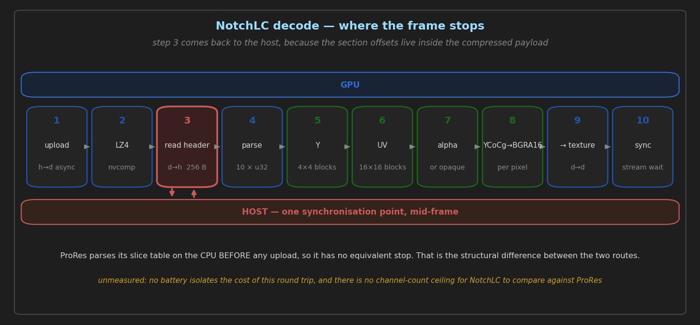

# CUDA NotchLC — GPU decode

> **State:** shipped
> **Modules:** `src/modules/cuda_notchlc`
> **Commands:** none of its own — the `CUDA_NOTCHLC` keyword on `PLAY`
> **Architecture:** [`../architecture/GPU_CODEC_HANDOFF.md`](../architecture/GPU_CODEC_HANDOFF.md)
> **Guide:** [`../guides/PIPELINE_EFFICIENCY_GUIDE.md`](../guides/PIPELINE_EFFICIENCY_GUIDE.md) (§NotchLC — no dedicated guide)
> **Coverage:** `producer-swap`, `coexistence`

Decodes NotchLC entirely on the GPU: nvcomp LZ4 decompression, then CUDA kernels for the Y, UV and
alpha sections, then a YCoCg→BGRA16 convert, then a zero-copy handoff to the mixer. Built for the
12K 360° material that this fork's projection work targets.

---

## 1. What is implemented today

The per-frame pipeline, from the module's own header (`notchlc_decode.cu:27-38`):

| step | what |
| :--- | :--- |
| 1 | upload compressed payload, host→device async through pinned staging |
| 2 | **nvcomp LZ4** decompress — or a direct copy for the Uncompressed format |
| 3 | sync, read the first 256 bytes back as the block header |
| 4 | parse 10 little-endian `u32` header fields to derive every section offset |
| 5 | `k_notch_y_decode` — one thread per 4×4 luma block |
| 6 | `k_notch_uv_decode` — one thread per 16×16 chroma block |
| 7 | `k_notch_a_decode`, or `fill_opaque` when there is no alpha |
| 8 | `k_notch_ycocg_to_bgra16` — one thread per pixel |
| 9 | `cudaMemcpy2DToArrayAsync` into the mixer's texture, or to host for the headless variant |

**Step 3 is a synchronisation point in the middle of the frame**, and it is unavoidable: the
section offsets live in the compressed payload, so nothing downstream can be launched until the
header has come back to the host. That is the structural difference from ProRes, whose slice table
is parsed on the CPU before any upload.

**Chroma is decoded at 16×16 granularity against 4×4 luma** — a 4:2:0-like ratio in blocks rather
than samples, which is where the format's compression comes from and why the UV kernel has a
different thread mapping from the Y kernel.

---

## 2. How to drive it

The keyword is required and the decoder is unreachable without it
(`notchlc_producer.cpp:1378-1380`):

```
PLAY 1-1 CUDA_NOTCHLC "clip.mov"
PLAY 1-1 CUDA_NOTCHLC FILE "clip.mov" DEVICE 0 LOOP
```

The long form takes `FILE`, an optional `DEVICE <index>` to pin the CUDA device, and the usual
`LOOP`.

**`DEVICE` must name the GPU the mixer runs on, and is now refused when it does not.** The
decode target is a texture *exported by the mixer's device*, and CUDA can only import it on the
GPU that owns it — so pointing `DEVICE` elsewhere does not move the decode to the other card, it
costs the zero-copy path. Until 2026-09-02 nothing checked, and the two mixers failed differently:
the Vulkan path threw a bare CUDA error from `cudaImportExternalMemory` naming neither GPU nor the
parameter, and the OpenGL path caught the equivalent failure and dropped **silently to host copy** —
the show continuing at a fraction of the throughput with one error line as the only evidence.

The Vulkan mismatch is now refused at construction with a message naming both GPUs and the index
to use, matching CUDA and Vulkan by **device UUID** (`cuda_device_for_vk`, the same comparison
`remotewall_producer` uses). The OpenGL mismatch **warns and still falls back**, because the
fallback works and making it a refusal is a behaviour change with no measurement behind it.

> **CUDA's device indices are not `nvidia-smi`'s.** With `CUDA_DEVICE_ORDER` unset the runtime
> sorts FASTEST_FIRST, so on a box with a Quadro P4000 and an RTX A4000 `nvidia-smi` numbers them
> 0 and 1 while CUDA numbers them **1 and 0**. Read the index out of the server's own startup
> log, which enumerates CUDA devices in CUDA's order, rather than from `nvidia-smi`.

---

## 3. Design decisions, and what they cost

**Still hands the mixer a packed BGRA16 texture**, unlike CUDA ProRes 4:2:2 which now hands over
planes. That is not an oversight — NotchLC's kernels produce YCoCg rather than YCbCr, and the
mixer's planar YCbCr path would need a YCoCg plane format that does not exist. The HAP producer
solved the same problem differently by keeping YCoCg compressed to the sampler and resolving in the
shader (cases 13/14). **Three GPU codec producers in this fork, three different handoff
strategies** — worth knowing before assuming one is the house style.

**LZ4 via nvcomp, where HAP uses Snappy on CPU workers.** Both are deliberate and were chosen
independently; `hap_producer.cpp:23` records the contrast explicitly.

**Slot depth is 5** and the buffers are sized from the file's own maxima
(`max_compressed`/`max_uncompressed`), logged at startup. At 12K that is the dominant VRAM cost of
the module — **~26 bytes per pixel per slot**, read out of `notchlc_decode_ctx_create`:

| buffer | bytes/pixel |
| :--- | ---: |
| `d_y` / `d_u` / `d_v` / `d_a`, uint16 | 8 |
| `d_bgra16` | 8 |
| the exported VK/GL texture | 8 |
| `d_y_bit_widths` + `d_y_bit_offsets` | 0.5 |
| `d_uncompressed` (probe-derived, so file-dependent) | ~2 |

Measured against the 12K asset, whose own startup line reports `max_uncompressed=108 MB` at
**12288×6144**: 604 + 604 + 604 + 38 + 108 = **1958 MB a slot, 9.8 GB for the five**, plus ~1.8 GB
of pinned host memory. On a 16 GB card (14.89 GB free) one producer of that raster fits and **two do
not** at 19.6 GB — so a `LOADBG`/`PLAY` onto a layer already playing 12K NotchLC builds the incoming
producer while the outgoing still holds its pool, and is refused. The refusal now names the raster,
the per-slot cost, the slot count and the free VRAM, because `cudaGetErrorString` alone ("out of
memory") is not a diagnosis.

> **That refusal has never been printed by a test.** `producer-swap --clips 12k` is the closest
> coverage and cannot reach it: it alternates **ProRes with NotchLC**, peaking near 4.5 + 9.8 =
> 14.3 GB, which *just* fits — so it passes without ever exhausting VRAM. Two concurrent NotchLC
> producers are the case, and nothing drives that (§5 gap 3).

**The slot count is deliberately NOT adaptive**, unlike `cuda_prores`, which picks 7 above 25 MP
and 5 below. A greedy allocator that stops at the first `cudaErrorMemoryAllocation` and continues
with fewer slots exists on an abandoned branch (`origin/feature/cuda-prores`) and was **declined
on 2026-09-02**: it trades a refusal an operator can see for a degradation they cannot, whether
this pipeline holds rate on two or three slots is unmeasured, and §5 gap 3 is why — there is no
`notchlc` route in `playback-scaling` to judge it with. `prores_producer.cpp` also records that
raising slot depth there did **not** move the channel ceiling, and that the instrument's
resolution is ±2 channels. Revisit when a `notchlc` scaling route exists, not before.

---

## 4. Verification — what is measured, and what is not

| what | battery | result |
| :--- | :--- | :--- |
| Survives alternating loads against CUDA ProRes on one layer, 12K, both mixers | `producer-swap` | 12/12 swaps, no fatal line |
| Runs concurrently with three other GPU interop paths | `coexistence` | engaged 1/1 in company, 0 late frames |

**What is not covered: the picture.** Nothing compares a NotchLC-decoded frame against a reference
decoder — there is no equivalent of `prores-parity` for this format, because there is no
second decoder to compare against. The YCoCg→BGRA16 convert is our code and per-channel, which by
the ICVFX precedent is where a channel exchange would hide, and **greys are invariant under it**.

A usable substitute exists without a reference decoder: decode the same file on both mixers and
compare. That catches a mixer-side divergence but not a shared error in the kernel — worth stating,
because it is the difference between "the two agree" and "the two are right".

---

## 5. Known gaps

1. **No picture verification of any kind**, and no reference decoder to build one against. §4
   describes the partial substitute and what it cannot catch.
2. **The mid-frame host sync (step 3) is unmeasured** — it is the obvious candidate for why this
   route would scale differently from ProRes, and no battery has isolated it.
3. **No channel-count ceiling.** `playback-scaling` has no `notchlc` route, so the figure that
   exists for ProRes (8 channels at 1080p) has no counterpart here.
4. **`fill_opaque` for alpha-less material** writes 1023 per sample on the host and uploads it. At
   12K that is a full-frame transfer per frame for a constant; never profiled.

---

## 6. Related commits

| commit | why it matters |
| :--- | :--- |
| `d8d384934` | `notchlc_decode_ctx_create` leaked every prior allocation on partial failure — same defect as the ProRes decoder, found in the same audit pass |
| `3e1d02b4d` | the CUDA↔Vulkan import/release pair had no lock; this producer takes that path on the Vulkan mixer |

---

## 7. Diagrams




The second figure is why this route is worth a picture at all: **step 3 returns to the host**,
because the section offsets live inside the compressed payload, and nothing downstream can launch
until the block header has come back. ProRes parses its slice table on the CPU before any upload
and has no equivalent stop.

Generated by `docs/diagrams/generate_feature_diagrams.py`.
