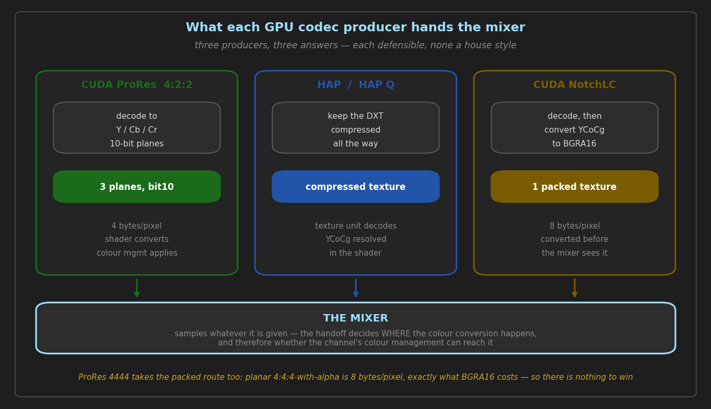

# CUDA ProRes — GPU decode and encode

> **State:** shipped
> **Modules:** `src/modules/cuda_prores` (producer, consumer, bypass consumer, CUDA kernels)
> **Commands:** reached by the `CUDA_PRORES` / `CUDA_PRORES_BYPASS` keyword on `PLAY`, and by a
> consumer name; no dedicated `MIXER` command
> **Architecture:** [`../architecture/CUDA_PRORES_IMPLEMENTATION_GUIDE.md`](../architecture/CUDA_PRORES_IMPLEMENTATION_GUIDE.md), [`../architecture/GPU_CODEC_HANDOFF.md`](../architecture/GPU_CODEC_HANDOFF.md)
> **Guide:** [`../guides/CUDA_PRORES_OPERATION_GUIDE.md`](../guides/CUDA_PRORES_OPERATION_GUIDE.md)
> **Coverage:** `prores-parity`, `producer-swap`, `playback-scaling`, `encode-matrix`, `coexistence`,
> `decoded-alpha` (the 4444 alpha route)

A complete ProRes implementation on the GPU: entropy decode, IDCT and colour handled by CUDA
kernels, with the decoded frame handed to the mixer without a host round trip. Encode is the same
in reverse. 422 profiles and 4444 both work, progressive and interlaced.

Deep detail lives in `../architecture/CUDA_PRORES_IMPLEMENTATION_GUIDE.md` and
`../guides/CUDA_PRORES_OPERATION_GUIDE.md`. This document is the part neither has: what is
measured, what the numbers are, and which design decisions are load-bearing.

---

## 1. What is implemented today

| piece | state | evidence |
| :--- | :--- | :--- |
| Decode, 422 profiles (Proxy/LT/Standard/HQ) | shipped | `prores-parity`, worst 2 LSB vs the FFmpeg CPU decoder |
| Decode, 4444 / 4444 XQ incl. alpha | shipped | `prores-parity` 4444 arm; alpha is CPU-decoded RLE, not DCT |
| Encode, progressive 422 | shipped | `encode-matrix` CUDA_PRORES arm |
| Encode, interlaced 422 (two picture headers) | shipped | `prores_encode_from_yuv_fields_422` |
| Encode, 4444 progressive | shipped | `prores_encode_frame_444` |
| Planar handoff to the Vulkan mixer, 4:2:2 | shipped | `21fca9e84`, `ae1cf266c` |
| Reverse playback, loop, ping-pong, seek | shipped | `loop-boundary`, `seek` |
| Frame-level rate control | shipped | `rate-profile`, on target from frame 9 |

**The producer publishes different things to the two mixers, and that is deliberate** — see §3.
On the Vulkan mixer a 4:2:2 frame arrives as three 10-bit planes; on OpenGL, and for 4444 on
either, it arrives as one packed BGRA16 texture.

---

## 2. How to drive it

The keyword is load-bearing. **A plain `PLAY` of a ProRes file does not use this decoder** — it
decodes on the CPU, or through FFmpeg's Vulkan compute path if `<vulkan-decode>` is on:

```
PLAY 1-1 CUDA_PRORES "clip.mov"
PLAY 1-1 CUDA_PRORES_BYPASS "clip.mov"
```

Recording, with the profile as a parameter:

```
ADD 1 CUDA_PRORES "out.mov" PROFILE 3
```

`PROFILE` follows FFmpeg's numbering (0 Proxy, 1 LT, 2 Standard, 3 HQ, 4 4444). The rate control
converges within a few frames of the seed and holds the profile's own target — `rate-profile`
measures **100.0 % of the ProRes 422 HQ target from frame 9**, and the whole-file figure is 100.4 %
only because the first frames are still converging.

---

## 3. Design decisions, and what they cost

**4:2:2 on Vulkan hands over planes; everything else hands over a packed texture.** The mixer's
shader does the YCbCr→RGB conversion, which is both cheaper and more faithful — the channel's
colour management, working space and output transform all live in the mixer, so converting in the
producer happens before any of them can apply.

*Why not everywhere.* Planar 4:4:4-with-alpha is four full-size 16-bit planes: 8 bytes a pixel,
exactly what BGRA16 costs. There is nothing to win, and it is not free — FFmpeg decodes ProRes
4444 to `yuva444p12` while this decoder produces 10-bit planes, so alpha normalises to 0.99904
against the reference's 0.99985 and the straight-alpha premultiply lands a fraction low. Measured:
`any diff` 0.50 % → 13.87 %, all of it 1 LSB, all of it in one alpha band. **The halving is a
property of 4:2:2, not of planar.**

*Why not on OpenGL.* Its interop target is a single opaque `cudaArray_t`. Three planes would mean
three `cudaGraphicsGLRegisterImage` registrations per slot — the exact call that crashed the NVIDIA
driver until a process-wide mutex serialised it (`BUILDING_WORKFLOW.md` pitfall #4). The asymmetry
is deliberate and stated at both call sites.

**Planes are declared `bit10`, and that is invisible if wrong.** `bit10` and `bit16` are backed by
the same `eR16Unorm` storage, so nothing about the allocation tells you which was chosen — but the
mixer takes its precision factor from the *texture's* depth: 64 for `bit10`, 1 for `bit16`. The
wrong one gives a picture four times too dark.

**Slot depth is a frame-lifetime pool, not a decode-ahead pool.** This producer hands the mixer its
own per-slot texture, so a frame the consumer is presenting *is* a slot. Two attempts to raise the
1080p depth were made and both withdrawn: 2/5 → 4/7 moved nothing, and 4/10 read as one extra
channel against a single baseline run and evaporated when the same binary was run four times
(8, 10, 8, 10). It stands at **2/5**.

---

## 4. Verification — what is measured, and what is not

Picture, against the FFmpeg CPU decoder, Vulkan mixer, frame 12 (`prores-parity`):

| arm | worst | mean | any diff | >3 LSB |
| :--- | ---: | ---: | ---: | ---: |
| 422 BT.709 | 2 LSB | 0.00 | **0.01 %** | 0.00 % |
| 4444 + alpha | 2 LSB | 0.00 | **0.50 %** | 0.00 % |

Encode, `encode-matrix` CUDA_PRORES arm at 1080p25, pre- and post-change binaries built and
measured back to back:

| | before | after |
| :--- | :--- | :--- |
| picture vs the CPU encoder | worst 37, mean 0.85, 0.19 % over 3 LSB | **identical** |
| recording size | 39.6 MB | **39.6 MB** |
| server CPU | 1.66 cores | 1.61–1.69 cores |

Channels, 1080p, one producer per channel with a screen consumer (`playback-scaling`):

| | channels |
| :--- | ---: |
| CUDA ProRes, BGRA16 *(before the planar change)* | 5 |
| CUDA ProRes, planar 4:2:2 | **8**, range 7–9 over six runs |
| FFmpeg Vulkan compute, for scale | 12 (held at 12, failed at 14 — **13 never run**) |

**What these numbers do not cover.** One fixture per raster; `screen` output only; BT.709 SDR — HDR
and BT.2020 ProRes take the same code path and were not captured. The channel figures are **±1** and
the "before" is a single run: a difference of one channel between two single runs is noise, which
is how a slot-depth improvement was reported and withdrawn. Nothing measures `MIXER CHROMA` or the
other per-channel operators against the planar plane layout.

**A null result worth keeping:** collapsing the encode's `BGRA → V210 → planes` round trip into one
pass removed ~19 MB of traffic per 1080p frame and produced **no measurable CPU saving** — the DCT
and entropy stages dominate. It buys a frame of VRAM per consumer and a right-edge fix, not speed.

---

## 5. Known gaps

1. **HDR and BT.2020 ProRes are unmeasured** on both decode and encode.
2. **The right-edge fix at widths not divisible by six** (1280, 2048, 4096) follows from the
   ceil/floor arithmetic and the pre-zeroing that existed to hide it, but **was only measured at
   1080p** — the black sliver it removes has not been photographed at an affected raster.
3. **4444 decodes 10-bit where the reference decodes 12-bit.** Not a defect, but it is why the 4444
   arm sits at 0.50 % rather than 0.01 %, and it caps how close that arm can get.
4. **The three ProRes routes at 2160p with a screen consumer** were never run; only 1080p was.

---

## 6. Related commits

| commit | why it matters |
| :--- | :--- |
| `d8d384934` | `ctx_create` leaked every prior allocation on partial failure — which explains a five-refusal OOM cascade previously recorded as correct behaviour |
| `0f45b11c4` | the V210 fusion measured bit-identical against a pre-change binary, and the CPU saving recorded as the null result it is |
| `21fca9e84` | the encode packed V210 only to unpack it again; also the ceil/floor right-edge defect the memsets were hiding |
| `e323d8add` | the `VRAM/slot` log line was a hardcoded BGRA16 figure understating **every** path — 576 MB printed against a real ~1440 at 12K |
| `3b4ad320c` | why the planar handoff is 4:2:2 only, with the 4444 measurement that settled it |
| `ae1cf266c` | the planar handoff itself, and the two latent defects it depended on |

---

## 7. Diagrams



Generated by `docs/diagrams/generate_feature_diagrams.py`.
