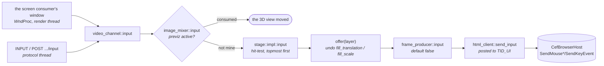

# HTML / CEF — GPU-direct page compositing

> **State:** shipped
> **Module:** `src/modules/html` — **282 lines** different from upstream across 7 files, plus two
> fork-only ones: `producer/html_gpu_bridge.{h,cpp}`
> **Commands:** upstream's `PLAY [HTML]` and the CG interface; the fork adds configuration and
> **`INPUT`** (§4)
> **Architecture:** none, deliberately — the D3D11 shared-texture import is the same bridge GStreamer uses, documented in GPU_INTEROP_ARCHITECTURE.md
> **Guide:** none, deliberately — Upstream owns the HTML producer and the CG interface; this fork adds GPU-direct configuration only, documented in §2 here. No separate operator guide.
> **Coverage:** `cli.py html-input` — mouse and keyboard into a page, verified from the
> **picture**, both mixers, mutation-proved (§4.4). The GPU-direct path itself still has none
> — see §5

Takes CEF's composited page as a **D3D11 shared texture** instead of a host-memory bitmap, so a
browser layer reaches the mixer without a CPU copy per frame.

---

## 1. What is implemented today

Upstream CEF renders off-screen and hands back a CPU buffer via `OnPaint`. This fork also binds
`OnAcceleratedPaint` (`html_producer.cpp:399-406`), where the composited page arrives as a D3D11
shared texture, and `html_gpu_bridge.cpp` imports it through
`accelerator/vulkan/util/d3d11_import_bridge.h` — the same bridge the GStreamer GPU route reuses.

**CEF binds `OnPaint` or `OnAcceleratedPaint` once and will not change afterwards**
(`html_producer.cpp:703`), so the choice is made at browser creation and is not a per-frame
fallback. That is why the switch below is a configuration element and not a runtime command.

`html_gpu_bridge.h` carries its own byte-order enum that "mirrors `cef_color_type_t` without
dragging a CEF header into the accelerator layer" — the compositor declares the byte order of its
shared surface, and this fork does not assume it.

---

## 2. Configuration

```
<html>
    enable-gpu                 CEF's own GPU compositing
    gpu-direct                 take the shared texture instead of a host bitmap
    gpu-direct-adapter-luid    which adapter the shared handle belongs to
    angle-backend              CEF's ANGLE backend selection
    cache-path
    remote-debugging-port
</html>
```

**`gpu-direct-adapter-luid` is load-bearing on a two-GPU machine.** A D3D11 shared handle is
adapter-bound; importing one produced on the other adapter fails rather than degrades.

### WebGPU needs all three of these, and each failure looks like "unsupported"

Measured 2026-09-07 on CEF 142.0.17 / Chromium 142.0.7444.176, OpenGL mixer, nvidia/ampere.
WebGPU works in the HTML producer, and `vgpu` 0.4.0 runs on it unmodified — but three separate
things gate it, and the symptoms are easy to misread as the engine lacking the feature:

| requirement | symptom when missing |
| :--- | :--- |
| `enable-gpu` **true** (defaults **false**) | `navigator.gpu` exists, `requestAdapter()` returns null, log says `No available adapters` |
| `dxil.dll` + `dxcompiler.dll` beside the exe | adapter found, then `requestDevice()` throws `DynamicLib.Open: dxil.dll Windows Error: 87` |
| `gpu-direct` **true** | the channel composites a **fully transparent** frame — RGBA all zero |

The DXC pair is what Dawn's D3D12 backend uses to compile WGSL. `d3dcompiler_47.dll`, already in
the list, serves ANGLE (WebGL) and does **not** cover it. Both ship in the CEF distribution and
were absent from `Bootstrap_Windows.cmake` until the commit that added this section.

**A WebGPU canvas must redraw every frame.** `getCurrentTexture()` returns a new texture per
frame, so a page that submits once at load composites as nothing. That is a page bug rather than
a server one, but it presents identically to a broken WebGPU path.

Verified through the IMAGE consumer with four **asymmetric** quadrant colours — the channel-order
trap in `CLAUDE.md` makes a neutral test worthless here. All four landed in the right positions
within 1 LSB, each channel perfectly uniform.

---

## 3. Why this matters beyond speed

HTML is how this fork renders **fill + key lower thirds**, so the key channel is an output of the
page rather than a separate asset. A byte-order or premultiplication error therefore shows up in the
key, not only in the fill — and comparing the two honestly means capturing both.

---

## 4. Input — mouse and keyboard into the page, since 2026-09-08

A page receives pointer and keyboard events, from either of two sources, through one sink.



**Two sources, one sink, and nothing downstream knows which it was.** The gate on the window
source is `<interactive>`; the command source has none beyond AMCP's own (see the security note
below).

### 4.1 The commands

```
INPUT <ch>[-<layer>] MOUSE MOVE <x> <y> [<modifiers>]
INPUT <ch>[-<layer>] MOUSE DOWN|UP LEFT|MIDDLE|RIGHT <x> <y> [<modifiers>]
INPUT <ch>[-<layer>] MOUSE WHEEL <x> <y> <dx> <dy>
INPUT <ch>[-<layer>] MOUSE LEAVE
INPUT <ch>[-<layer>] KEY DOWN|UP <virtual-key> [<modifiers>]
INPUT <ch>[-<layer>] TEXT "<string>"
```

```bash
curl -X POST -d '{"type":"mouse","action":"move","x":0.25,"y":0.75}' \
     http://127.0.0.1:5254/v1/action/channel/1/stage/layer/10/input
```

| | |
| :--- | :--- |
| **coordinates** | 0..1 with a **top-left** origin, across the target's own picture. Not pixels: a caller does not know the channel's raster, and a normalised point survives a format change |
| **`<modifiers>`** | the numeric `core::input_modifier` mask — shift 2, control 4, alt 8, left button 16, middle 32, right 64. Deliberately CEF's own `EVENTFLAG_*` numbering, so the mask passes through untouched |
| **with a layer** | delivered to that layer, **no hit-test and no rectangle check**. For a client that already knows its target and should not have its event dropped because the layer is scaled away from where the client thinks it is |
| **without a layer** | hit-tested topmost-first, exactly as a gesture on the window is |

**The API form is built into an `INPUT` string and sent through AMCP**, rather than reaching the
stage directly. That is not laziness: the channel-level form must try the image mixer before the
stage, because previz consumes the event when it is active, and `video_channel::input` is the one
place that decides. `api_context` hands out a `stage_base` rather than a channel, so a second
route would have to duplicate that decision — which is how two dispatch orders come to disagree.

### 4.2 How a layer is chosen

* **topmost first.** `layers_` is ordered by index and the mixer draws in that order, so the last
  layer is the one on top.
* **the layer's fill transform is undone** — a layer at translation `t` with scale `s` occupies
  `[t, t+s]` of the channel, so a channel point `x` arrives at the producer as `(x-t)/s`. A page
  scaled into a corner therefore still receives its own coordinates, in its own space.
* **a producer returning `false` does not end the search.** Geometry decides the *order*; the
  producer decides whether it *consumes*. So a colour layer above an HTML page does not swallow
  every click for being on top — which is what the 2013 API's "topmost hit layer wins" did, since
  every consumer carried a sink whether it wanted one or not.
* **but an HTML layer is opaque**, because `html_producer::input` returns true unconditionally. A
  truthful answer would need a round trip into the browser per event, on the render thread. Put
  the page on the top layer, or scale it so its rectangle covers only what it should receive.
* **a drag is captured.** Once a button is down the layer is latched until every button releases,
  so a drag that travels off the rectangle still completes. A `MOUSE LEAVE` ends nothing.
* **keys go to whatever last accepted a pointer event.** A key carries no position, so there is no
  other honest target.

**Not inverted: rotation, perspective corner-pin and crop.** A rotated layer hit-tests as its
unrotated rectangle. That is the same limit the 2013 API had, and it is a limit rather than an
approximation — the numbers are simply not used.

### 4.3 The five defects of the removed API, and where each is answered

The interaction API added in 2013 (`dafba8be8`) and removed in 2018 (`efcd57858`, 31 files, −496
lines, no reason recorded) carried five defects. Every one was a property of the SFML→CEF
conversion rather than of the routing, which is why the revival reuses none of its shape and all
of its lessons.

| the defect | now | measured? |
| :--- | :--- | :--- |
| `SendMouseMoveEvent` called from the **stage thread**; CEF's host is `TID_UI`-only | everything posted through `html::begin_invoke`, and posted rather than invoked — the caller is a render or protocol thread | indirectly, by everything working |
| `sf::Mouse::Button` **cast** to `MouseButtonType`; SFML orders Left/Right/Middle, CEF Left/Middle/Right, so right and middle were exchanged | `input_event.button` is *defined* in CEF's order at the source; there is nothing to convert | **yes** — §4.4 check 4, and the cast reintroduced fails it |
| `e.modifiers` **never set**, so every move reported no buttons held and **no in-page drag ever worked** | `input_modifier` is bit-for-bit `EVENTFLAG_*`, so the mask passes through | **yes** — §4.4 check 5, and zeroing the mask fails it |
| `clickCount` hard-coded to **1**, so no page saw a double-click | counted at the source (`CS_DBLCLKS`) and carried in `click_count` | **no** — plumbed, and resting on a code reading |
| **no keyboard at all** — three mouse events and nothing else | `SendKeyEvent`, with a separate CHAR event for text, and `SetFocus(true)` on the first input | **yes** — §4.4 checks 6 and 7 |

Two of those five are worth a sentence each beyond the table. **The keyboard needs `SetFocus`**: a
windowless browser starts unfocused and an unfocused page routes keys nowhere; it is sent once, on
the first input, because re-focusing mid-gesture can reset a page's selection. **And text is a
separate event from the key that produced it** — a producer sending only `RAWKEYDOWN` fires keydown
handlers and types nothing into a field, so the source emits both.

### 4.4 Verification — `html-input`, both mixers

Eleven checks, and **the verdict is a pixel**. `core/html_fixture.py` writes a page whose whole
background is a colour computed from its last event, so the existing IMAGE capture answers "did the
page get this" with no text recognition and no channel back out of the browser.

The colours are chosen rather than arbitrary, and each choice is what makes one defect visible:

* **x and y are different channels of one reading** — `MOVE 0.25 0.75` must give (64, 191, ·), and
  a transposition gives (191, 64, ·). A page reporting only "a move happened" would pass with the
  coordinates swapped.
* **middle (200, 16, 64) and right (16, 200, 64) are permutations of each other**, so the button
  cast does not merely fail its check — it makes each colour read as the other's value, which names
  the defect instead of reporting a mismatch.
* **the held-button bit is reported on the MOVE**, from `e.buttons`. That is the only way to see
  the missing-modifier defect, which broke every drag while leaving every click working.
* **idle is (8, 8, 8), not black**, so "loaded and quiet" is distinguishable from "never loaded".
  This paid for itself on the first run: eight checks read (8, 8, 8), which proved the page was
  alive and the events were not arriving — rather than leaving a black frame to blame on CEF.

**What the first run found, and it is the reason to write this down.**
`destroy_producer_proxy` wraps **every** producer the registry creates and forwards each base-class
virtual by hand, one line apiece. `input` was not among them. The failure had no symptom of its
own: `INPUT` returned `202`, the stage hit-tested correctly, the page rendered, and the default
`frame_producer::input` returned false from the proxy — so eight checks read the page's untouched
idle colour, which is exactly what a browser that never received anything looks like. **This is the
`apply_transform_colour_values` allowlist trap in a different file**, and the same rule applies:
a hand-written forwarding list is a place a new virtual goes to die. Four core wrappers forward it
now — that proxy, `separated_producer` (to the fill; the key is a matte), and both transition
producers (to the destination, which is what will be on screen).

**What it cannot see:**

* **double-clicks.** Nothing sends two clicks inside the interval and asserts a `dblclick`.
* **a page's own hit-testing.** `input()` returns true unconditionally; check 8 measures the
  consequence (an HTML layer is opaque to the layers below) rather than pretending otherwise.
* **anything about the GPU.** The fixture paints a background and nothing else, so this says
  nothing about WebGPU, gpu-direct or the shared-texture path — see §5 gap 1.
* **`WasResized()` is still never called on the browser**, so a page cannot re-lay-out when the
  channel's format changes. Unrelated to input and unchanged by it.
* **the SFML window path is verified only as a TRANSLATION.** Since 2026-09-08 the Linux window
  produces the same events (`screen-consumer.md` §1c), checked by `sfml_input_self_test` against
  a real SFML window under WSL -- but the server does not build on Linux on this machine, so "an
  HTML page on Linux receives a click" rests on that translation plus everything downstream being
  shared, rather than on a running channel.

**The elevation preflight is INCONCLUSIVE, never FAIL.** `CefInitialize` returns false when the
server runs elevated — one log line — and the server otherwise starts perfectly: every consumer
works, every command answers, and every HTML layer is empty. A battery that FAILED there would be
reporting a defect in the shell it was launched from. Whether a session is elevated **varies** and
is not a property of the machine, so it is checked at run time rather than recorded anywhere.

### 4.5 Security posture — stated, not solved

AMCP is unauthenticated on the LAN and can already `PLAY [HTML] <any url>` into a browser running
with web security disabled. Synthetic input adds **no new capability class** to that surface: an
attacker who can send `INPUT` can already load their own page. The API form goes through the same
auth handshake as every other `/v1/action`.

Neither is gated, and that is a decision rather than an omission. If synthetic input needs gating,
the thing to gate is the whole unauthenticated command surface, not this one verb.

---

## 5. Known gaps

1. **No battery for the GPU-direct path.** `html-input` (§4.4) drives the producer and reads its
   picture, so "no battery at all" is no longer true — but it does not compare the two routes.
   The GPU-direct path is still not measured against `OnPaint` for picture equality, which is the
   check that would catch a byte-order or alpha-domain difference between them. **And note that
   `html-input` cannot be made into that check by adding an arm**: its fixture page paints a flat
   background, and a flat colour is invariant under exactly the byte-order faults in question.
2. **The reconciliation in `../audits/CEF_GPU_DIRECT_RECONCILIATION.md` is a code reading**, not a
   measurement.
3. ~~**No fixture.**~~ **CLOSED 2026-09-08** — `core/html_fixture.py::write_page` writes a page
   whose expected output is known by construction. It is the wrong fixture for gap 1 (see above)
   and the right one for gap 3's original purpose: something a battery can load and predict.
