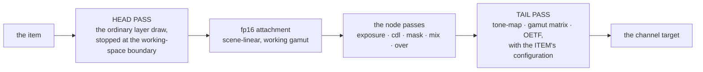

# The node graph — a typed DAG per layer, owned as a document, addressed like every other parameter

> **State:** **in progress, and it renders now.** A graph is stored, validated, attached to a
> layer, driven through the whole ownership stack, and **evaluated on the frame path on both
> mixers** — `stage: display` only. The `MIXER GRADE_NODE` prototype it replaces is **deleted**.
> What is still owed is the `working` stage (§2), fp16 intermediates, the remaining mask families
> and the catalogue; §8 lists the order and §9 says exactly what is measured.
> **Commands:** `GRAPH <ch>-<layer> ATTACH <name> | DETACH` and `GRAPH <ch>-<layer>` to query,
> plus `MIXER FIELD node/<id>/<param>` — and `HOLD`/`RELEASE`/`BIND`/`UNBIND` need no new command,
> because a node parameter is an address. There is deliberately **no `GRAPH LOAD`**: a document is
> JSON and arrives over the control API, the timeline's precedent.
> **API:** `PUT`/`GET`/`DELETE /v1/graph/{name}`, `GET /v1/graph`, `GET /v1/graph/{name}/history`,
> `POST /v1/graph/{name}/{attach|detach|undo|redo}` (§7), and
> `GET`/`PUT /v1/value/channel/N/stage/layer/M/mixer/node/{id}/{param}` — the same body every
> mixer field takes, `hold` included (§3.1)
> **Modules:** **not a module** — `src/core/graph/` (`registry`, `model`, `validate`,
> `graph_store`), with the JSON codec in `src/protocol/http/api_graph.cpp`, the routes in
> `src/protocol/http/http_server.cpp` and the store injected into every stage by
> `src/shell/server.cpp` for the structure fingerprint
> **Replaces:** the `MIXER GRADE_NODE` prototype, **removed 2026-09-11** —
> `grade_window`/`grade_node`/`grade_graph`, `mixer_grade_command` (162 lines), `apply_grade_node`
> on both mixers, and `F2_GRADE_NODE`. The `grade_nodes` blob row is **renamed** to `graph` rather
> than removed: it is the cheap presence flag the composition guard reads.
> **Coverage:** `api-graph` **34/34** (the document, its faults, order, history); `graph-stack`
> **29/29** (a node parameter through the whole ownership stack); `grade-graph` **10/10** (which
> space a node pass runs in, the 32–42 LSB gap, a bypassed node byte-identical to no graph, and
> the graph surviving an in-flight `MIXER` tween); **`grade-window` — migrated to the graph and
> reproducing the prototype's figures exactly** (§9); `conformance` **100/100 at 1 LSB** and
> `grading` **48/48** (the no-graph fast path is untouched) — all on **both mixers**. Four boot
> self-tests: `node_registry_self_test`, `graph_validate_self_test`, `graph_plan_self_test`,
> `graph_store_self_test`, plus `target_self_test`'s node rows.

---

## 1. What this replaces, and why it is a replacement rather than an extension

`MIXER GRADE_NODE` is the fork's only node model and it is not a graph. It is a **16-slot array of
one fixed record** inside `image_transform` — an ellipse window, an exposure, an optional CDL —
with no edges, no ports, no types, addressed by index, AMCP-only, exposed to the control API as one
read-only blob row.

Three of those are fatal to a client that draws it, and the third is the one that cannot be patched:

* **Index addressing has no identity.** Delete node 3 and every reference to node 4 means something
  else. A parameter's address, a timeline key, a binding, an undo entry — all of them name the
  wrong thing after one edit.
* **There is no topology at all**, so fan-in is inexpressible. A `mix` of two graded versions of the
  same picture is the first thing anybody asks a node graph for and the array cannot say it.
* **And it runs in the wrong colour space** — measured, 42 LSB, see §2.

The design study's own verdict (ch.13): *do not ship the v1 shape — a curated parameter list plus
one opaque blob is where Wire started and where the fork is now.*

## 2. The placement, measured — 42 LSB

The prototype's node early-out sits at the **end of `main()`** in both shaders, after the whole
grading chain and after the `do_output_convert` block, so a node operates on the layer's finished,
**display-encoded** attachment. `MIXER CDL` and every other grading operator run *inside* the chain.

`grade-graph` applies the same CDL both ways on the same source:

| config | `MIXER CDL` | node CDL | apart |
| :--- | :--- | :--- | ---: |
| pass-through — nothing non-identity after the CDL's step | `187, 66, 36` | `187, 66, 36` | **0.00 LSB** |
| `MIXER COLORSPACE REC709 BT709 NONE BT709 REC709 1.0` — an identity round trip through a **linear middle** | `169, 66, 78` | `187, 66, 36` | **42.00 LSB** |

Identical on both mixers, to the byte. The first row is what makes the second attributable, and the
node's answer is the **same number in both rows** — invariant under `MIXER COLORSPACE`, which is
what "it runs after everything" looks like from outside.

So `stage` is a property of the document, with two values, and both are real:

* **`working`** (the default) — scene-linear, in the working gamut, before tone-map and the OETF.
  A node CDL is then the same operation as `MIXER CDL` and a node exposure is a stop of light.
* **`display`** — the prototype's placement, kept because it is a legitimate thing to want. A
  correction expressed on the picture *as encoded* — a broadcast-legal trim — is not the same
  operation in linear light.

A single graph is entirely in one stage; a cross-stage edge is refused rather than converted,
because inserting an EOTF into the middle of a chain the author did not ask for is exactly the
assumption the port tags exist to prevent.

### 2.1 How `working` is reached — the layer draw is SPLIT, not duplicated

The layer draw stops one statement early and a second pass finishes it:



**The head is not a new kind of draw.** `graph_head` is one statement in each shader, placed
immediately before the `do_output_convert` block — so everything above it has already run
(decode, geometry, the keys, the whole grading chain including `MIXER CDL`) and the pixel is
exactly where `MIXER CDL` left it. That single statement is the whole of the 42 LSB.

**The tail is the layer's own output half, applied once.** And this is the part that was built
wrong first and reverted, so it is worth stating as a rule rather than as a detail: the kernel
chooses among four conversion branches, in this order —

| branch | input half | output half | target values |
| :--- | :---: | :---: | :--- |
| `ocio_in \|\| output_convert_only` | off | **on** | the **channel's** |
| `cg.enable` — `MIXER COLORSPACE` | **on** | **on** | the **layer's**, and its gamut matrix lives in the INPUT half |
| `auto_color_convert` and the spaces differ | **on** | **on** | the channel's |
| otherwise | off | off | — |

— and then a channel display transform or `<working-space-composite>` clears the output half
outright. A tail must reproduce **whichever branch the head took**, with the input half removed.
So `graph_tail` is applied *after* the entire chain, and the tail pass carries **the item's own
`draw_params`** — its `pix_desc` colour fields, its `auto_color_convert`, its
`transforms.image_transform.color_grade`, its OCIO names.

**What it must NOT be is `output_convert_only`**, which is a different thing that looks like the
right one: it forces the output half *on*, using the **channel's** target values. Measured, that
gives `node_ws [255, 130, 102]` in **both** configs — identical with `MIXER COLORSPACE` on and
off, which is the signature of a pass ignoring the layer entirely — and **68 LSB** out in the
pass-through arm, where head + node + tail should be a no-op because the EOTF and OETF are both
the identity. The first attempt at this shipped nothing for exactly that reason.

With the item's params carried over, the placement gap closes:

| config | `MIXER CDL` | node CDL, `stage: working` | apart |
| :--- | :--- | :--- | ---: |
| pass-through | `187, 66, 36` | `187, 66, 36` | **0.00 LSB** |
| `MIXER COLORSPACE` with a linear middle | `169, 66, 78` | `169, 66, 78` | **0.00 LSB** |

Both mixers, to the byte — and in the second row the same graph declared `stage: display` still
reads `187, 66, 36`, 42.00 LSB away, which is what makes the zero attributable rather than
merely agreeable.

Three properties of the split that are decisions, not consequences:

* **The grading chain does not run twice.** The tail's `image_transform` is a DEFAULT one
  carrying only `color_grade` — every operator's enable is at its default, so there is nothing
  to double-apply. `color_grade` is not an operator; it is the conversion configuration, which
  is why it is the one field copied.
* **The keys are not re-applied.** `local_key`/`layer_key` mask the *item*, and the head pass
  already consumed them; applying them again would double-darken every soft edge.
  `grade-window`'s composite check and `alpha-domain` are what adjudicate that.
* **`stage: display` sets neither flag**, so that graph renders through the path that existed
  before this commit, byte for byte. That is what makes the stage a compatibility guarantee
  rather than a label.

### 2.2 `space` — which space a MASK's numbers are in, which is a different question

The colour maths and the mask geometry are independent, and conflating them is easy because
both sound like "where does the node run". A node pass is a **full-screen draw over a
frame-sized attachment**, so a mask evaluated at the fragment's own uv is in **frame** space —
and under any non-default `MIXER FILL` that is not where the picture is.

`mask_ellipse` therefore carries a `space` port, `frame` (the default) or `source`:

* **`frame`** — the raster. A vignette pinned to the output, a broadcast-safe corner.
* **`source`** — the layer's own 0..1 space, so the mask **moves with the picture** when the
  layer is translated, scaled or rotated. A face-light that stays on the face.

`source` works by handing the pass the item's **composed placement, inverted** — three rows of
a matrix the shader multiplies `vec3(uv, 1)` by. Three things about that are decisions:

* **The geometry SCALE MODE is part of the placement**, and it used to be applied inline inside
  each kernel's `draw()`. It is now `apply_geometry_scale_mode` in each backend's
  `util/transforms.cpp` — one table, two callers — because a matrix built without it is off by
  exactly the fit/fill scale on any layer whose native raster is not the channel's, which is
  most of them (a 4K clip in an HD channel).
* **A corner pin is REFUSED, not approximated.** `perspective` is applied per step by
  `apply_perspective_to_vertex` precisely because it is not expressible as a 3×3, so
  `source_uv_inverse` returns false for it — and for a singular placement, which is what
  `MIXER FILL x y 0 1` (how a layer is hidden without being cleared) reaches it as. The pass
  then masks in **frame** space. That is deliberately a visible answer: a mask that plainly did
  not follow the picture is diagnosable, and one that followed it to somewhere plausible and
  wrong is not.
* **The convention is measured, not asserted.** Whether the uploaded matrix is the composed
  placement or its transpose depends on which way `transform_coords` multiplies, and getting it
  backwards produces a matrix that compiles, runs, and masks the wrong region. So
  `node_uv_self_test` runs the default quad through the **real** `transform_coords` and requires
  that each placed vertex comes back as its own texture coordinate — five placements, chosen so
  one mistake cannot pass all of them (a uniform scale is invariant under a row/column swap; a
  pure translation is invariant under a composition-order error). It is **fatal** at boot, where
  `run_compose_self_test` beside it only warns, because this matrix is on the frame path the
  moment a mask says `source`.

Measured by `grade-graph`, both mixers: the layer filled into the right half of the frame with
the mask in the left fifth of the **item**, so the two interpretations are **disjoint** — source
space grades a band at frame *x* ∈ [0.55, 0.65], and frame space puts the same ellipse entirely
off the layer and grades nothing at all. Four checks, and each failure mode fails a different
one: a matrix never applied, a matrix always applied, and a `space` port read as "no mask".

**A finding, recorded rather than worked around: an enum port sent by NAME is silently
ignored.** `values_of` fills each slot with `as_number(v[k])` and leaves it at the port's
default when that fails — so `{"space": "source"}` is accepted by the PUT, echoed back by the
GET, and renders as `frame`, with no fault anywhere. `space` is the first enum port in the
registry, so nothing could have reached this before. Send the index (`0`/`1`) until the
catalogue commit resolves names at PUT time against the port's declared values.

## 3. The three orthogonal things, and why that is the whole design

The governing requirement was **compatible with timelines, keyframes, bindings and every other
workflow — not A or B**. That is achievable without a single new mechanism, because the fork already
has the two pieces it needs: **one address space** (`core::address::parse`) and **one ownership
stack** (`drivers_` → `resolve_drivers`).

**A node parameter is an ADDRESS.** `node/<id>/<param>[.N]`, published under
`channel/N/stage/layer/M/mixer/node/<id>/<param>` so read and write are one path. Then:

| workflow | what it needs | what it gets |
| :--- | :--- | :--- |
| a timeline keys it | a path in a document | already works — a curve or a `content` step naming `node/n1/exposure` |
| a binding drives it | an address `BIND` accepts | already works — one more `target_kind` |
| `HOLD` holds it | a dominant overlay keyed by path | already works — `layer_overlay::values` is path-keyed |
| `PUT` writes it | a write path with `effective`/`shadowed_by` | already works — the same reply shape every mixer field has |
| `animatable` describes it | a `kf_kind` on the descriptor | already works — derived by `fields::animatable_of` |
| a preset snapshots it | a path and a value | already works |

**The graph itself decides only how IMAGES flow.** That split is the reason the answer is "and"
rather than "or": three orthogonal things composed through one address space, instead of a fourth
subsystem with its own vocabulary for animation.

**And the node graph is the COMPOSITING graph, not the binding surface.** A compositing edge carries
frame data whose *order changes the result*, so topology is intrinsic and the server owns evaluation
order, validity and cycles. A binding has no topology — one scalar to one address, unordered against
every other binding — and what an operator asks of it is **membership** ("what drives this?"), which
`stack/<path>` already answers per address. `reactive.md` §1.2's "a node graph in the server —
bindings are edges and the client draws them" stands for *bindings*; a compositing graph is a
different object for this reason.

## 3.1 A node parameter is an address — and that is now measured, not asserted

`node/<id>/<param>[.N]`, resolved by `core::address::parse` like every other target, and
published under `channel/N/stage/layer/M/mixer/node/<id>/<param>` so **read and write are one
path**: an address copied out of the tree resolves unedited, because `parse` strips a leading
`mixer/` and the rest is the address. That is the same property `previz/` has, and it is why both
live under `mixer` rather than beside it.

**A node parameter is a LIVE registry**, like a producer parameter: `parse` classifies the path
and leaves `meta` null, because the descriptor is the attached document's class crossed with the
registry's port and only the stage holds both. Reporting a node path as valid in `parse` and
having the write fail later would put two answers to one question in two places, which is the
mistake `target.h` exists to undo.

| workflow | what it took | measured by |
| :--- | :--- | :--- |
| a timeline keys it | nothing — the path resolved | `graph-stack`: the published value follows the ramp |
| a binding drives it | a `case node:` in `add_binding` validating against the **attached document**, and a `node/` prefix test in `apply_binding` **before** the `fields::find` fallthrough | a binding parked at 2.35 outranks a document ramping 0.5–4.0 |
| `HOLD` takes it | a node arm in `hold_field`, reading the **effective** value | held while the *binding* has it, so a hold that snapped to the constant reads the wrong number |
| a write is remembered | `set_node_param` → `graph_store::patch_params` | `effective: false`, `shadowed_by`, and it lands at `STOP` |
| `animatable` describes it | nothing — `param_leaf` and `animatable_of` already read a `param_snapshot` | the tree carries a node port with a mixer field's whole key set |

**Why `apply_binding`'s prefix test has to come first**, stated because it is a one-line guard
between this path and the failure the whole design is built to avoid: `fields::find("node/n1/gain")`
returns null and the function simply `return`s, so the binding would be **accepted at `BIND` time
and then do nothing on every tick**, with a 202 behind it. That is the shape `stage_fields.h`,
`producer_params.h` and the timeline's path validation each exist to prevent.

**And the document's parameter values ARE the operator's constant.** There is deliberately no
per-layer constant table seeded from the document: two tables would be two answers to "what is
this parameter set to". So a write goes into the document, `constant/node/<id>/<param>` publishes
it beside the effective value, and release is **lossless by construction** rather than by care —
nothing above the document ever writes it, so there is nothing to restore.

That is what makes a node parameter **class (a)**, like a mixer field, rather than class (b) like
a producer parameter — which is captured and restored, and *refused* while bound because there is
nowhere on the stage to remember a write. `faults.yaml` calls that "a gap in the ownership stack
rather than a policy"; for node parameters the gap is closed.

## 3.2 Attaching a document to a layer

```
POST /v1/graph/{name}/attach   {"channel": 1, "layer": 10}
POST /v1/graph/{name}/detach
GRAPH <ch>-<layer> ATTACH <name> | DETACH | (no argument to query)
```

**One document, at most one layer**, and a layer holds at most one document — `graph_attached`
either way. The reason is the constant: two attachments would be two answers to what a parameter
is set to. Reusing a look is a `PUT` under another name, which is also what makes the two copies
independently gradeable. Re-attaching the **same** document to the **same** layer is idempotent,
which a client retrying after a timeout depends on.

**`DETACH` leaves the DRIVERS alone**, and this is a decision rather than an omission. A timeline
keying `node/n1/gain` on a layer whose graph has just been detached keeps writing an overlay
nothing reads — and re-attaching puts the parameter straight back **under the ramp it was under**.
Dropping the overlays would make a detach silently end a show's animation. `MIXER CLEAR` detaches
too, because "this layer's look is gone" includes the graph, and leaving it would keep the
document claimed by a layer that no longer has anything on it.

**There is no `GRAPH LOAD`.** A document is JSON and arrives over the control API — the timeline's
precedent, and the same reasoning: `protocol_http` is a sibling of the AMCP implementation, not a
layer below it, so putting a JSON parser in the AMCP tokeniser would be a second codec.

## 3.3 How it renders — two objects, because there are two flow types

`image_transform` carries **two** members where the prototype carried one, and the split is not
an optimisation: the single pointer is *incorrect* for anything that animates.

| member | what it is | compared |
| :--- | :--- | :--- |
| `node_plan` | topology, classes, order, `last_use`, the pass count | **by pointer** |
| `node_values` | every node parameter, every `bypass`, every edge's `mute`, flat | **by value** |

`image_transform::operator==` is what the still-frame cache compares. A single pointer holding
the values would be reallocated whenever a value changed — so a timeline ramping `exposure` at
50 Hz would allocate a graph fifty times a second, and the fingerprint would move on every tick
**by allocation rather than by value**, making a paused unchanging graph look different every
frame and defeating the cache it exists to feed.

**The registry declares which is which.** A port's `flow` is `signal` (in the array) or
`attribute` (in the plan). Declaring a signal as an attribute costs a reallocation per tick;
declaring an attribute as a signal makes a change silently not take effect. Neither fails to
compile, so the declaration *is* the contract.

### 3.3.1 The evaluator

One linear walk per layer, in both mixers:

```
plan and values are copied out BEFORE draw_params is moved from -- they live in it
alias[]      one pass: a bypassed or dead step aliases its primary input
live_passes  == 0 -> the EXISTING single draw, byte-identical. No graph, an empty
             graph and an all-bypassed graph are all this path.
head pass    the layer's own draw, into a pooled attachment
per step     aliased -> a shared_ptr copy, no draw (which is what makes fan-out free)
             otherwise -> acquire an attachment, apply_node(in0, in1, mask, values)
             then release every attachment whose last_use is this step
tail         what reaches `output` is what the layer draws
```

**`bypass` and `mute` are values, not topology**, which is what lets a timeline step them: the
plan is identical either way. A bypassed node aliases its primary input, so **a graph with a
bypassed node is byte-identical to the graph without it** — gated, not claimed.

**And a dead path resolves to the INPUT, never to black.** A muted edge blacking a layer during a
show is the one failure nobody would forgive, so an unconnected image input aliases the primary,
a mask defaults to 1.0, and `mix.b` returns `a`.

**A mask with one consumer is FUSED** — its parameters ride along in the consumer's uniforms and
the shader evaluates the ellipse inline, so a windowed grade is *one* draw rather than two. With
two consumers it is materialised, which `grade-window`'s chain check now exercises: the prototype
needed the geometry declared twice and this declares it once.

### 3.3.2 The shader, and what the UBO change cost

`gn_op` is an index into `node_classes()`, and **it is the flag**: -1 means "not a node pass", so
`F2_GRADE_NODE` is gone and there is no boolean that can disagree with it. The same number is read
by the table, two kernels and two shaders — so `node_registry_self_test` asserts every index
against the table, because a reordering of `build_classes()` compiles perfectly and would make an
`exposure` run the CDL's code.

**The UBO did not grow.** Sixteen bytes of existing padding at offset 928 became `gn_op`,
`gn_mix`, `gn_has_in1` and `gn_has_mask`, so `static_assert(sizeof == 944)` and both `offsetof`
anchors stand unchanged and no field above them moved. The design's generic `gn_p[16]` /
`gn_mask_p[8]` arrays are deferred: they would append 96 bytes to carry, through an index, values
that every class in this commit already has a named field for. They earn their size when the mask
families arrive.

### 3.3.3 Intermediates are fp16, on both backends, whatever the channel is

A node's intermediate is **not a picture on its way to a display** — it is a value on its way to
the next node, and those legitimately exceed 1.0. `exposure 4.0` followed by `exposure 0.25` is
the identity in arithmetic and **clips to white** through a unorm attachment, which is the same
reason `<working-space-composite>` refuses to run on one.

**Measured, both mixers:** `×4` then `×0.25` returns `[140, 89, 51]` against an ungraded
`[140, 89, 51]` — **0.00 LSB**. Forced back to unorm it reads `[64, 64, 51]`, **76 LSB** out,
which is exactly the clipping prediction: red (2.2) and green (1.4) clamp to white and are then
scaled by a quarter.

The attachment pools are keyed by format on both backends, so this is a pool hit in a second
bucket rather than an allocation per frame. **On Vulkan the format is only half the change**: a
pipeline carries its colour-attachment format in its own creation info, so writing fp16 through a
unorm pipeline is a format *mismatch* rather than a conversion. `draw_params::node_fp16` reaches
the kernel, which hands back the matching pipeline through the same per-layer hook OCIO uses —
and that hook is per layer precisely because one pass composites layers that may each need a
different one. OpenGL needs no equivalent: a GL program does not carry its target's format.

> **THE CHECK FOR THIS COULD NOT FAIL WHEN IT WAS FIRST WRITTEN, and that is the more useful half
> of this commit.** Its correct answer — *"the picture is unchanged"* — is **identical to its
> not-running answer**, so a capture that raced the attach read the ungraded picture and the check
> **passed**. The same binary and the same fixture gave **0.00 (a false pass)** and then **76.00
> (the correct failure)** on consecutive runs, and the first was very nearly recorded as evidence
> that fp16 worked.
>
> Every other arm here expects a picture *different* from the base, so a race makes those fail.
> This one it makes succeed. The fix is a **control in the same arm** whose answer is nothing like
> the base: the same graph with the second node bypassed, so only the `×4` runs and the picture
> must visibly clip — `[255, 255, 204]`, 166 LSB out. The check is now a *relationship*, and
> neither half can be satisfied by a graph that is not running.
>
> The general form: **a check whose expected value coincides with its failure mode cannot fail.**
> That is the same family as an empty or stale input, reached from a direction that looks like
> careful oracle design.

### 3.3.4 Fan-out, pool reuse, and what the plan predicted wrongly

**Fan-out is a `shared_ptr` copy**, so two consumers of one output cost one draw. That is the
thing the prototype's ping-pong pair could not express at all, and it is the whole reason `mix`
and `over` exist.

**The plan predicted this would break on Vulkan. It does not, and the reason is worth recording
because it was predicted wrongly twice.**

The plan's flag said `renderpass::commit()` tracks a single `previous_attachment`, so a DAG
reading an earlier one would read a stale layout. Reading the source suggested a different
hazard instead: `last_use` returns an attachment to the device pool the instant its `shared_ptr`
dies, the pool's deleter pushes it back immediately, and `renderpass::draw()` only *queues* —
`commit()` issues the passes and barriers afterwards — so two logical outputs aliasing one image
within a frame looked expressible.

**Both are false, measured.** A **6-step chain** — chosen specifically to force mid-frame reuse
— is exact at **0.67 LSB**. `renderpass::draw()` stores `params.background` in its layer list, so
an attachment the evaluator releases is *still held by the renderpass* until `commit()`: the pool
never hands back a live image.

A consequence worth knowing: **`last_use` release saves nothing on Vulkan.** The pool-pressure
benefit lands on OpenGL only, where the draw is issued immediately. The code is kept identical on
both sides because the release is correct on both and a divergence would be one more thing no
single-backend test could see.

**What actually broke was a channel order.** `mix` read its second image *without* the `.bgra`
swizzle that `get_rgba_color` applies to plane 0, so red and blue were exchanged on `b`:
**30.5 LSB, Vulkan only**, because OpenGL's copy of that line already swizzled. Exactly the trap
both shaders' comments warn about — and it was visible only because the fixture's two branches
differ by a **factor of four** and its source has three distinct channels. A neutral source, or
branches an octave apart, would have shown noise.

> **And the same run produced a fixture error, which is the other half of the lesson.** With the
> `a` branch at gain 2.0 the red channel reached 1.1 and **clipped in the 8-bit intermediate**, so
> the check failed on OpenGL by exactly the clip. OpenGL was right and the expectation was wrong
> — a fabricated defect, caught only by working out where the residual came from. Gains are 1.6
> and 0.4 now. The clip is itself the argument for fp16 intermediates (§8): working-space values
> legitimately exceed 1.0, and this fixture will use that headroom once they land.

### 3.3.5 Two defects the seam fixed, one of them shipping

**`image_transform::tween` never assigned the graph.** `lut3d`, `hue_curves` and `blend_mask` are
all assigned to the destination on the lines around it; `grade_nodes` was not. So for the whole
duration of any in-flight `MIXER <field> <v> <duration>` on a graphed layer, the tweened transform
carried a **null graph**: the look vanished for the length of the fade and snapped back at the end.

It shipped because **`grade-window` never tweens anything** — nothing in the harness could see it.
`grade-graph` now holds a mid-tween check: `MIXER OPACITY 0.5 50 linear` with the graph attached,
measured **94.5 LSB** away from the ungraded colour at the same opacity.

**And `DETACH` left the plan on the layer** — this commit's own defect, found by `grade-graph` on
its first migrated run. The per-tick pass iterates the attachment map, so erasing the attachment
meant nothing ever cleared `node_plan` from the transform: **the graph kept rendering after
`DETACH`, indefinitely.**

`graph-stack` could not see it. Its detach check reads the *published leaf*, which comes from the
attachment map and correctly went away — so the value stream said the graph was gone while the
picture still had it. That is the `MIXER EXPOSURE` class, and it is the first time in this work
that the **picture** check caught what the **value** check could not.

### 3.3.6 A mask with two consumers is MATERIALISED — and it used to be dropped

A mask generator with **one** consumer is **fused**: the consumer evaluates it inline from its
own uniforms, so a windowed grade costs one draw and the mask costs none. With **two** it cannot
be — it would be evaluated twice from two different uniform sets, and the two would drift the
moment either consumer's own parameters differed — so `compile()` clears `fused_mask` and the
mask gets a **pass of its own**, writing a texture that every consumer samples.

The plan half of that has been right since the compiler landed, and `graph_plan_self_test`
asserted it. **The evaluator half did not exist.** `node_draw::has_mask_texture` was declared
and read by *nothing* — not either kernel, not either shader — so a fanned-out mask was neither
inlined nor sampled: `gn_has_mask` came out false, and **both consumers graded the whole image**.

Measured on the first fixture that looked: at four radii outside the ellipse, **139.00 LSB** from
the ungraded picture where the answer is 0.00.

**Why nothing saw it is the part worth keeping.** The only fixture that fanned a mask out was
`grade-window`'s CDL arm, and it samples **inside** the window — where "graded through the mask"
and "graded everywhere" are *the same number*. A whole-frame grade is only visible from outside.
That file's own comment claimed its chain arm exercised the materialised path, and it was wrong
twice over: that fixture builds one mask **per** window, so both are fused.

Three things the fix is built from:

* **`node_step::produces_mask`**, exactly `group == "mask" && !fused_mask`, and the self-test now
  asserts fused and materialised are **exhaustive** — because "neither" is precisely the state
  that shipped. It also asserts the pass count: two masked exposures sharing one mask is **3**
  passes, so the 16-pass cap counts the mask.
* **One mask-parameter source in each kernel.** A mask *generator* pass reads its own `values`; a
  consumer with a *fused* mask reads the mask node's `mask_values`; a consumer with a
  *materialised* one reads neither and samples the texture. All three use the same slot layout,
  so there is one evaluation in the shader and the fused and materialised forms cannot drift —
  which the battery checks directly, comparing a shared mask against two fused masks at
  identical geometry (**0.00 LSB**).
* **The mask goes in the third texture slot** — `in0` → plane 0, `in1` → plane 1, `mask` →
  plane 2 — which is what the fan-in design meant by using the plane slots a single-plane source
  leaves empty. Written to all four channels and read from `.r`, so a scalar mask is invariant
  under the channel-order trap on both backends.

**A deviation from the plan, stated:** the plan called for a **1-component** fp16 attachment and
this uses the same 4-component fp16 the image intermediates use. The pools are keyed by format,
so a second bucket would be a second allocation path for a quarter of the memory; it is a cost
question rather than a correctness one, and `grade-graph-cost` is where it belongs.

## 4. The document

```jsonc
PUT /v1/graph/{name}
{
  "name": "look",
  "stage": "working",                    // or "display". Refused if misspelled, never defaulted
  "label": "add a highlight roll-off",   // names the GESTURE for the undo history
  "nodes": [
    {"id": "in",  "class": "input"},
    {"id": "e",   "class": "exposure", "params": {"gain": 2.0}, "ui": {"pos": [40, 80]}},
    {"id": "k",   "class": "mask_ellipse", "params": {"center": [0.5, 0.4], "radius": [0.3, 0.2]}},
    {"id": "out", "class": "output"}
  ],
  "edges": [
    {"from": "in.out", "to": "e.in"},
    {"from": "k.out",  "to": "e.mask"},
    {"from": "e.out",  "to": "out.in"}
  ],
  "ui": {"camera": {"x": -120.5, "zoom": 1.75}}
}
```

Five things about that shape are decisions rather than syntax:

**Node ids are the CLIENT'S and are required.** A client that draws a graph already has ids for the
things it drew, and an id is what `node/<id>/<param>` addresses — so it is the one thing that must
survive an edit. An id containing `/` or `.` is refused, because those are the two characters the
address grammar splits on and an ambiguous address is a write that silently lands elsewhere.

**Edge ids are server-assigned when absent** (`e1`, `e2`, …), echoed, and stable across a re-PUT.
Drawing an edge is a gesture with no natural name, so requiring one would only make clients invent
`e17`; but an edge needs an id for a fault to point at.

**An edge is one string, `"n1.out"`**, split on the last `.`. Unambiguous precisely because a node
id may not contain one.

**`params` is sparse and carries values only.** The descriptor is in the registry, so a document
cannot disagree with the server about types. Absent means "at its default", which is
distinguishable from "explicitly set to the default" — that difference matters for a preset diff.

**`ui` is stored uninterpreted.** Node positions, the client's camera, a collapsed group: raw JSON,
echoed back verbatim, checked for well-formedness and nothing else. Where a box sits on a client's
canvas is not something this server should ever have a schema for. Well-formedness *is* checked,
because a malformed blob would break the next GET rather than the PUT that stored it.

## 5. The node classes that exist

The registry is a fixed table, like `fields::mixer_fields()`, for the same reason: a client needs to
know what it may build before it builds it.

| class | group | in | out | parameters |
| :--- | :--- | :--- | :--- | :--- |
| `input` | root | — | `image` | — |
| `output` | root | `image` | — | — |
| `exposure` | grade | `image`, `mask?` | `image` | `gain`, `mix`, `bypass` |
| `cdl` | grade | `image`, `mask?` | `image` | `slope`, `offset`, `power` (vec3 each), `saturation`, `mix`, `bypass` |
| `mask_ellipse` | mask | — | `mask` | `center`, `radius`, `feather`, `invert`, `space`, `bypass` |
| `mix` | combine | `image a`, `image b?`, `mask?` | `image` | `amount`, `bypass` |
| `over` | combine | `image a`, `image b?` | `image` | `bypass` |

**The table carries exactly the classes the evaluator will implement, and no more.** A class in the
catalogue that a PUT accepts and the renderer ignores is the *202-and-no-picture* failure seen from
the other end — the same one the timeline's path validation closed. So the remaining mask families
(`mask_rect`, `mask_gradient`, `mask_qualifier`, `mask_combine`) and the rest of the grading
operators arrive **with the shader that implements them**, not before.

**`lut3d` is absent**, though the design lists it: its LUT input needs a `ref_lut` port, reference
ports are refused in v1, so the class could only ever be a pass-through with a `strength` nobody can
apply.

**Every class gets an implicit `bypass`**, added by the registry's own constructor so no class author
can forget it. It is a boolean and therefore `"step"`-animatable: a timeline switches a chain on **at**
a key rather than sliding through half of it. A bypassed node aliases its primary input and costs no
draw; a bypassed *mask generator* emits its port's disconnected default — 1.0, "everywhere" — so
bypassing a mask means "no mask" rather than "mask nothing".

### 5.0 The mask families, and what each one's parameters mean

| class | inputs | parameters beyond `bypass` | fusable? |
| :--- | :--- | :--- | :--- |
| `mask_ellipse` | — | `center`, `radius`, `feather`, `invert`, `space` | yes |
| `mask_rect` | — | the same five; `radius` is the **half-extent**, so the rect spans twice it | yes |
| `mask_gradient` | — | the same five plus `angle`; `radius.0` is the **run** and `radius.1` is unused | yes |
| `mask_qualifier` | `in` (image) | `hue`, `hue_width` (**degrees**), `sat_low/high`, `luma_low/high`, `softness`, `invert` | **no** |
| `mask_combine` | `a`, `b` (masks) | `op` ∈ {`union`, `intersect`, `subtract`}, `invert` | **no** |

**The three analytic generators share one parameter layout**, and that is a decision rather than
a coincidence: each kernel uploads one set of mask uniforms and each shader evaluates one shape
per class, so a new analytic generator costs a shader case and no new plumbing.

**`intersect` and `subtract` are multiplicative** — `a·b` and `a·(1−b)` — not `min`. `min` would
hand back the *harder* of two feathered edges, so intersecting two soft shapes would produce one
soft edge and one hard one. `union` is `max` because adding saturates where they overlap.

**Fusability has three conditions, not one.** A fused mask is evaluated by its *consumer* from
the consumer's own uniforms, so a mask is fusable only if it is **analytic** (no inputs to read
— which rules out `qualifier` and `combine` at any fan-out), has **one consumer**, and that
consumer is **not itself a mask node** (a `mask_combine` is a pass that *samples* its inputs,
not a draw that evaluates mask uniforms). `graph_plan_self_test` asserts all three, and the
third one it asserted against *me*: the first version of the rule fused an ellipse feeding a
combine, and the boot aborted naming it.

### 5.0.1 A fused mask needs to say WHICH SHAPE it is

`gn_mask_kind` carries the fused mask's class into the consumer, because `gn_op` there is the
**consumer's** class. Without it a consumer has no way to tell an ellipse from a rectangle, and
**it rendered every fused mask as an ellipse** — correct as a materialised pass, wrong the moment
the same mask had a single consumer, which is the common case.

Measured by `grade-graph`: a rectangle and an ellipse with identical `center` and `radius` came
back **byte-identical**. They must not be — a square of half-extent *r* contains the disc of
radius *r*, and the corner region is in one and not the other, which is the sample point the arm
uses. After the fix the rect reads fully graded there (`224, 142, 82`) and the ellipse reads
exactly ungraded (`140, 89, 51`).

**And a second gap the same arms found:** a mask generator *with* inputs was being handed the
head texture as its source, because the evaluator used "produces a mask" to mean "has no image
input". `mask_combine` and `mask_qualifier` break that — so a combine read the layer's red
channel as its `a` operand. Two of its three operators then passed *for the wrong reason*, which
is exactly why the check asserts a triple over three regions rather than one region.

### 5.1 Ports: no new type system

A port is a **`param_snapshot` plus three enums**, and that is the entire type story. The value half
is the same descriptor a producer parameter carries, so `api_tree.cpp`'s `param_leaf` and
`api_value.cpp`'s validation describe and check a node parameter with no new descriptor code, and a
node port carries exactly a mixer field's key set including `animatable`.

| enum | values | what it decides |
| :--- | :--- | :--- |
| `direction` | `input`, `output` | not derivable from anything else |
| `flow` | `signal`, `attribute` (`event` reserved) | whether a change is a value write or a re-compile |
| `domain` | `value`, `image`, `mask` (`ref_layer`, `ref_channel`, `ref_lut` declared and refused) | what flows |

**The `flow` split is what makes a timeline able to ramp a node parameter at 50 Hz.** A `signal`
port's value is compared *by value* and lives in a flat array; an `attribute` port's value is part
of the compiled plan — it changes the step list, the pass count, or a mask's coordinate space — so
changing it needs a re-PUT and a new plan. Declaring a signal as an attribute would make a ramp
allocate a graph fifty times a second; declaring an attribute as a signal would make a change
silently not take effect. So it is declared per port rather than inferred from the type.

**Image ports carry `space` and `alpha` tags from the first commit**, when nothing needs them,
because the alternative is a conversion that gets *assumed*. This tree has paid for that twice —
the YCbCr decode counting in 8-bit codes at every depth, and `apply_transform_colour_values`
silently dropping any field nobody added to it. A tagged handle makes a mismatched join either an
inserted conversion or a refusal at PUT, never a wrong picture.

**No scalar or math nodes.** Scalar ports *are* parameters, and the server already has two scalar
dataflow engines addressing them: bindings (LFO, audio, inputs, OSC, trackers) and the timeline
(curves and steps). A third inside the graph would duplicate both.

### 5.2 Coercion: one table, three callers

`coerce(from, to)` is consulted by `validate` at PUT, by `connections/preview` before a client
commits a gesture, and by `suggest` when a client asks what may be joined. **One function, because
two would let a client be offered an edge a PUT then refuses** — which is worse than not offering it.

| join | verdict |
| :--- | :--- |
| same domain, same type | legal, exact |
| `mask` → `image` | legal, exact — replicated across RGB with alpha 1, so a mask can be looked at |
| `image` → `mask` | legal, **reported** — reduced to the working-space luma, three components to one |
| `value` → `mask` | legal — a constant mask over the raster |
| numeric → numeric of another type | legal; **reported** when it rounds or thresholds |
| `image`/`mask` → `value` | refused — there are no reduction nodes in v1 |
| anything involving `ref_*` or `event` | refused, naming the version it waits for |
| `image(working)` ↔ `image(display)` | refused — use the document's `stage` |

The asymmetry between the two mask conversions is asserted in both directions by the boot self-test,
because a table that made them symmetric would let an image be used as a mask with **no warning**.

## 6. Validation, and the two kinds of refusal

`validate` is pure and every fault names something an author can see: a node id, an edge id, a port
name. "The graph is invalid" is not something a client can act on.

| checked | why it is a real failure mode |
| :--- | :--- |
| unknown class, unknown port | the *202-and-no-picture* class: a typo would store, answer 200, render nothing, and be found on air |
| duplicate node id, an id with `/` or `.` | every edge and every address naming it becomes ambiguous |
| direction | checked rather than inferred, so a client that drew the edge backwards is told which end is which |
| domain, via `coerce` | one table, so PUT and `preview` cannot disagree |
| fan-in | an input takes **one** edge; two have no defined order. Fan-**out** is unlimited — that is what a graph is for |
| required inputs | unconnected is an error, not a default: there is no picture to default *to* |
| parameter type, arity, range | against the port descriptor, the same quantities the write path checks |
| exactly one `input` and one `output`, and the output **reachable** | two outputs are two answers to what the layer draws; an unreachable one renders black |
| cycles, by Kahn's at PUT | and the fault **names an edge of the cycle**, not merely one downstream of it. A cycle found on air is a hang; found at PUT it is a message with an edge id in it |
| at most 16 image passes | **refused, not clamped** — a clamped graph renders something nobody authored |

### 6.1 Whether a rejected document is STORED — and this is the opposite of the timeline's answer

| the fault | code | stored? |
| :--- | :--- | :--- |
| **validation** — an unknown class, a cycle, a value out of range | `graph_invalid` | **yes** |
| **decode** — malformed JSON, a misspelled `stage`, a `ui` that is not JSON, an edge that does not split | `bad_request` | no |

**A graph is edited while it is ON AIR.** An operator who mistypes a port name must not lose the
grade that is currently rendering — so the document is kept, `GET` returns it with its faults, an
attached layer keeps its **last good plan**, and the stage publishes `graph_stale`.

That is deliberately the opposite of a timeline path typo, which is refused. The difference is what
the fault names: a timeline key names a *registry*, which does not change while the author types, so
storing a typo helps nobody. A graph's structure is exactly what the author is in the middle of
changing.

**A `coercion` fault is not an error.** It does not produce `graph_invalid`, the graph compiles and
renders, and the entry exists so an editor can draw a warning on the edge — instead of the server
either refusing a useful join or performing a luma reduction silently.

## 7. The API

```
GET    /v1/graph                      every loaded document: revision, counts, ok, faults, attachment
PUT    /v1/graph/{name}               store one; `graph_invalid` when it will not run, and stored anyway
GET    /v1/graph/{name}               as stored, with `faults`, `order`, `attached`, `can_undo`/`can_redo`
DELETE /v1/graph/{name}               remove it, detaching first
GET    /v1/graph/{name}/history       the undo stack, newest last
POST   /v1/graph/{name}/{undo|redo}   one step, answering the resulting document
```

**A PUT answers with `order`** — node ids in evaluation order — because that is the one thing a
client cannot compute for itself without reimplementing both the topological sort and the coercion
rules.

**Two revision counters, and keeping them apart is load-bearing.**

| counter | moves on | in the stage fingerprint? |
| :--- | :--- | :--- |
| `revision` | put, erase, undo, redo, attach, detach — a **structure** change | **yes** |
| `values_revision` | a parameter write | **no** |

Mixing the second one in would make a slider drag, or a timeline ramping a node parameter, bump
`structure_revision` fifty times a second on every channel and force every attached client to
re-walk every tree. The store's boot self-test asserts the two stay apart, because nothing
observable from outside would show it in a single run.

**A graph has an undo history and a timeline does not.** That is a difference in how the two are
used rather than an inconsistency: a graph is edited in dozens of small gestures an operator expects
to be able to take back, where a timeline document is authored elsewhere and PUT whole.

**Undo is the GESTURE, not the write.** A slider drag is fifty parameter writes and one undo, so
consecutive changes carrying the same `label` coalesce into one history entry. An *unlabelled* write
never coalesces — with no label there is nothing to say two writes belong together, and guessing
from timing would fold two deliberate nudges into one. Depth is 64, chosen rather than measured. A
PUT clears redo, the ordinary editor rule: once the document has branched, the old future was
computed against something that no longer exists.

**`DELETE` detaches rather than refusing.** A client deleting a look means "take it off air";
refusing would leave them holding a document they cannot get rid of without first remembering where
it was attached. A policy call, flagged as one.

### 7.1 The catalogue — what a client needs before it can build anything

```
GET /v1/catalog/node                       every class, with its ports
GET /v1/catalog/node/{cls}                 one class
GET /v1/catalog/node/{cls}/default         a node object ready to PUT
GET /v1/catalog/node/{cls}/suggest?port=p  what may legally feed `cls.p`
GET /v1/graph/connections/preview?from=a.b&to=c.d   may these two join?
```

**It is answered from the registry, not from an injected list**, which is why it lives in
`api_graph.cpp` rather than beside `ofx` and `isf`. Those catalogue what is *installed* and
depend on the shell having wired the modules; the node classes are compiled in, so a build
either has all eleven or is not this server. The route is matched **before** the general
`/v1/catalog/` one, which would otherwise claim `node` and answer `unknown_path`.

**`coerce()` is consulted, never reimplemented**, and that is the whole reason a client would
trust any of this. `suggest` walks every output port in the registry through `coerce()`; `preview`
calls it on one named pair; the validator calls it on every edge of a PUT. A second table in any
of them would drift, and **the drift presents as an editor offering a connection the PUT then
refuses** — which looks like a broken client and a correct server.

So `api-graph` asserts the three *agree*, over every input port of every class rather than a
sample: **65 (class, port) pairs, 0 disagreements.** A legal-but-lossy join is offered as lossy
and previews as `legal: true, exact: false` with the note — an image into a mask port answers
*"reduced to the WORKING-SPACE luma, so three components become one"*. Refusing it would make a
useful graph unbuildable; doing it silently would hide the reduction in a picture.

**What `default` claims, and what it does not.** Every parameter at its declared value — so a
client adding a `mask_gradient` does not have to know what a sensible `feather` is. It claims
**nothing about topology**: a node dropped into a bare document has its required inputs unwired,
and the resulting `graph_invalid` is the validator being right. The check therefore tolerates
faults about *connections* and refuses faults about *values*, which is the distinction a default
is actually making. (The first version of that check asserted the PUT succeeded outright and
failed all nine classes — the check was wrong, not the server.)

`default` deliberately omits `id`: ids are the client's stable handles, and inventing one here
would either collide or teach a client to accept ours and then wonder why it changed.

### 7.2 A graph in a batch, and one history entry per gesture

```json
POST /v1/batch
{"at_frame": 1200, "ops": [
  {"op": "graph", "name": "look", "verb": "attach", "channel": 1, "layer": 1},
  {"op": "set", "path": "channel/1/stage/layer/1/mixer/node/e/gain", "value": 1.6,
   "label": "drag"}
]}
```

**Why a batch needs a graph op at all:** putting a look on air is a *cut*. Before this a client
could pin the field writes around it to a frame and not the `attach` that made them mean
anything. The same argument the timeline op already makes.

Four verbs — `attach`, `detach`, `undo`, `redo` — addressed by **document name** and not by a
path, because a graph document is server-wide rather than a property of a channel. `attach` is
told its channel and layer; the other three read the **store**, because a client taking a look
off air knows the look's name and making it also remember the layer only gives it something to
get wrong.

**A node-parameter write inside a batch did not work at all**, and the way it failed is the
interesting part: `{"op": "set"}` on a node address fell into the *transform* path, which has no
node arm — so the write silently did nothing while the batch reported success. Two things were
needed. The batch now routes a nine-segment node path to `set_node_param` (the write route
already tests this first, because `resolve_write_target` reads seven segments and would take
`node` for a field name). And **`stage_delayed` had to override `set_node_param`**: `stage_base`'s
default returns `false` without doing anything, which is exactly the shape the timeline's own
delayed-stage defect took.

**`label` is what makes a slider drag one undo.** Consecutive writes carrying the same label
coalesce into one history entry, so three writes are one step back rather than three. An
*unlabelled* write never coalesces — with no label there is nothing to say two of them are one
gesture. Measured: three writes under one label take the history from 1 entry to 2, and one
`undo` returns the parameter to its pre-gesture value rather than to the middle of the drag.

**Validation stops at the address**, for a node op and for an action alike: whether a value is in
range depends on the document attached *when the frame arrives*, and a batch that validated
against the document as it is now would still be wrong by then. So the all-or-nothing promise
covers the address resolving and stops there — stated, because the alternative is to pretend
otherwise. A verb the channel then refuses is reported after the batch lands, in `details`,
alongside the timeline's.

## 7.3 What it costs — sixteen passes, measured

The design is bounded by a **16-pass cap** and an attachment pool. `grade-graph-cost` measures
the cap at 0/4/8/16 nodes on one layer of four channels:

| nodes | late frames | published leaves (ch 1) |
| ---: | :--- | ---: |
| 0 (no graph) | 0–1 / ~2000 | 18 |
| 4 | 0 | 25 |
| 8 | 0 | 29 |
| 16 — the cap | **0** | 37 |
| 16, all bypassed | 0 | 53 |

**2160p50 on four channels**, both mixers, worst of two interleaved passes. The no-graph arm
itself reports 1 late frame in one pass, so a graph at the cap is inside the noise floor.

**Read this as "sixteen passes fit comfortably at 4K/50 on this box", not as "passes are
free".** The consumer paces the frame period, so a cost that does not overrun the tick is
invisible to this measurement whatever it is. What the battery establishes is that the budget is
not exceeded, not how much of it is used.

**The raster is part of the result.** At 1080p25 — the fixture's first choice, and what
`timeline-cost` uses — *every* arm read 0 including the cap, which is a battery with no
discriminating power rather than a finding. 2160p50 is eight times the pixel rate; it still does
not reach the edge, and that is now a statement about the hardware.

**Two controls, and the first is what gives the zeroes any meaning.** Every arm reads 0 late —
and 0 late is exactly what a graph that *never drew* would report. The leaf counts prove the
documents are attached and published, and prove nothing about whether the passes executed. So
the battery captures the picture at the cap and requires it to be `0.98^16` down: **0.42 LSB**
against a predicted `[101.3, 64.4, 36.9]`. The second control is a bypassed ladder of the same
size — same document, same publication, no draws — so the difference between the two arms is the
passes and nothing else.

**Why the bypassed arm publishes MORE**, which is the sparse rule working rather than an
anomaly: a parameter at its default is omitted, so the live ladder publishes `gain` alone and
the bypassed one publishes `gain` *and* `bypass: true`. Exactly one extra leaf per node. **What
is published is the off-default parameters, not the parameters** — so a leaf count is not a node
count.

**This is a different mechanism from the timeline's cost**, and neither battery substitutes for
the other. `timeline-cost` found the timeline's expense to be the per-tick state publication
into a `flat_map` — 17.0 leaves per binding against 4.2 per keyed field. A graph publishes a
handful of leaves whatever its size and spends its budget on GPU passes.

## 8. What is not here yet

Each of these is sequenced rather than open, and the order is riskiest-first:

| next | what it adds |
| :--- | :--- |
| ~~the address grammar~~ | **DONE** — see §3.1 and §3.2 |
| ~~**the seam**~~ | **DONE** — see §3.3 |
| ~~`stage: working`~~ | **DONE** — the head/tail split; see §2.1. The CDL parity in §2 is green on both mixers |
| ~~source-space masks~~ | **DONE** — see §2.2 |
| ~~the mask families~~ | **DONE** — see §5.0 |
| ~~the catalogue~~ | **DONE** for `/v1/catalog/node`, `default`, `suggest` and `connections/preview` — see §7.1. **`ports/{p}/live` is NOT done**: a node parameter's live value is already readable at `/v1/value/channel/N/stage/layer/M/mixer/node/<id>/<param>`, which is the address the ownership stack publishes, so a second spelling under the catalogue would be a second way to ask one question. Recorded as a deliberate omission rather than an oversight |
| ~~batches~~ | **DONE** — `{"op": "graph"}`, a node write, and one history entry per gesture; see §7.2 |
| previews | a per-node preview PNG, and the cost arms |

And these are **not v1 at all**, each with its hook: effect and source node families (a texture
hand-off between GL contexts or Vulkan devices is a *device* feature, not a graph one — the `image`
tags and K-input steps are ready for it); scalar/math nodes; topology changing over time beyond
bypass and mute; `group` evaluation (the model carries one, inlining at compile is v2); reference
ports; fusing linear runs into one pass; preview streams; `duration`/`tween` on a node-parameter
write, which is the one place "every workflow works on a node parameter" is answered by the timeline
rather than by the `MIXER` tween.

## 9. Coverage — what is measured today

| what | battery | result |
| :--- | :--- | :--- |
| the document, its faults, its order, its history | `api-graph` | **34/34 both mixers** |
| a node parameter through the whole OWNERSHIP STACK | `graph-stack` | **29/29 both mixers** |
| FAN-OUT (one output, two consumers) and POOL REUSE (a 6-step chain) | `grade-graph` | diamond **0.70 LSB**, chain **0.67 LSB**, both mixers |
| fp16 INTERMEDIATES — `×4` then `×0.25` is the identity | `grade-graph` | **0.00 LSB** both mixers; **76 LSB** when forced to unorm |
| what a node COMPUTES, and its window | `grade-window`, **migrated to the graph** | inside **0.50** LSB, leak **0.00**, separation 77.0, move 76.7, restore 0.00, chain **0.75**, invert 0.00/77.0, composite **0.00**, CDL **0.38**, desat **0.00** — identical to the prototype's figures, on both mixers |
| the no-graph fast path | `conformance`, `grading` | **100/100 at 1 LSB**, **48/48** |
| which colour space a node pass runs in | `grade-graph` | **16/16 both mixers** — `working` agrees with `MIXER CDL` at **0.00 LSB** in both configs, and the same graph declared `display` still reads 42.00 LSB away, which is what makes the zero attributable |
| what a node computes | `grade-window` | 1 LSB both mixers. **Its oracle asserts the DISPLAY placement** — *inside == measured outside x exposure*, which is only true of an already-encoded value — so it drives a pass-through config, where the two placements are provably indistinguishable and its figures did not move when the split landed. That is also why it cannot see a placement at all, and why `grade-graph` owns the question |
| the four mask FAMILIES — rect, gradient, qualifier, combine | `grade-graph` | **8 checks, both mixers.** Each arm is built so a wrong answer is a *different* picture: the rect against an ellipse of identical geometry at the corner, the gradient's two ends against each other, the qualifier on the source's hue *and* its complement, and `combine`'s three operators over three regions where they give three different triples |
| a mask read by TWO consumers (the materialised path) | `grade-graph` | **3 checks, both mixers** — and the sample that matters is OUTSIDE the mask, because a dropped mask reads identically to a correct one from inside |
| which space a MASK's numbers are in | `grade-graph` | **4 checks, both mixers** — the two interpretations are disjoint by construction, so each failure mode fails a different check |
| the source-uv matrix against `transform_coords` | `node_uv_self_test` | at boot, **fatal** — five placements, and the row/column convention is the thing it exists to pin |
| a graph VERB and a node WRITE inside a batch, and label coalescing | `api-graph` | **6 checks, both mixers** — including that three writes under one label are ONE undo, which is the claim a client's slider depends on |
| what sixteen passes COST, and that they ran at all | `grade-graph-cost` | **5/5 both mixers** — 0 late at the cap on four 2160p50 channels, with a picture control at **0.42 LSB** because 0 late is also what a graph that never drew reports |
| the CATALOGUE, and that `suggest`/`preview`/PUT agree | `api-graph` | **6 checks, both mixers** — 65 (class, port) pairs walked, 0 disagreements. The agreement is the claim; any one endpoint answering is not |
| the class table against its own rules | `node_registry_self_test` | at boot |
| the validator, one minimal document per failure mode | `graph_validate_self_test` | at boot |
| the store's two counters, coalescing, attachment | `graph_store_self_test` | at boot |

**Mutations that were shown failing first**, each caught by a different check with a message naming
the rule it broke:

| mutation | what caught it |
| :--- | :--- |
| cycle detection removed | `graph_validate_self_test` — *"a cycle was accepted"*, boot aborted |
| a parameter write bumps the structure revision | `graph_store_self_test` — *"patch_params moved the STRUCTURE revision"*, boot aborted |
| the `image → mask` coercion reported as exact | `node_registry_self_test` — *"must be legal and REPORTED as lossy"*, boot aborted |
| the graph store dropped from the stage fingerprint | `api-graph` — exactly *"a graph PUT moves structure_revision"* at `2 -> 2`, the rest green |

**Three mutations on the ownership arms**, and what they show about the battery is worth as much
as what they show about the code:

| mutation | what `graph-stack` reported |
| :--- | :--- |
| a binding writes `patch_params` (the document) instead of its overlay | 3 of 29: the binding does not outrank the document, the stack names only the timeline, and the release is wrong |
| `apply_binding` loses its `node/` arm entirely | **the same three** |
| the rank inverted in the effective-value walk | 3 of 29, but a **different** three: the *hold* stops holding, drifting 1.998 → 2.53 while the ramp runs under it |

The first two being indistinguishable is recorded rather than smoothed over: this battery
discriminates *"the binding arm is broken"* and not *which way*. And in both cases `BIND` still
answered **202** — the accepted-and-does-nothing shape, caught by the value stream rather than by
the command's reply, which is exactly why the value stream is measured.

**And one check came from reading a PASSING check's output**, which is the cheaper half of this
discipline and the easier one to skip. The unknown-class case reported **three** faults: the real
one, plus *"no node 'b' to take an edge to"* for each edge touching it. That is false — the node
exists, its *class* does not — and an editor told it would highlight three things for one typo. The
validator now records such a node as known-but-unclassified and leaves its edges alone, and
`api-graph` gained the assertion that one cause produces one fault, which nothing had been making.

**Two defects the battery found in this commit's own code, both on its first run:**

* **A graphed layer published nothing at all.** `publish_layer_transform` returns early when no
  mixer field differs from its default — correct, because creating `state["layer"][layer]` for an
  untouched layer costs a leaf per layer per tick for no information. But *"no mixer field
  differs"* is not *"nothing to say"*: a plain colour layer with an attached graph is exactly that
  case, and the graph block sat after the return. `graph=None` on a layer whose attach had
  provably succeeded. The guard now also asks whether the layer is graphed or driven.
* **`{"hold": false}` could not be expressed.** `write_node_value` required a `value`, so a
  release came back `field_missing`. The mixer-field path handles `hold` *before* the value is
  required, and for a reason: `PUT {"hold": true}` on a ramping parameter means "stop there", and
  requiring a value would make the client read the position first and race the next tick.

  **The second one is also a lesson about reading a battery.** It produced *five* red checks: the
  release, and then four cascades — the hold never let go, so the binding, the document and a
  later write all read the held number. One defect, five failures, and only reading them in order
  showed that. A battery that stopped at the first failure would have reported four defects that
  did not exist.

**Not measured, and each is honest rather than pending:** anything about a picture, because nothing
evaluates a graph yet; and the *second* half of the revision rule — that a parameter write must
**not** move `structure_revision` — which needs a write path for a node parameter and is gated by
the boot self-test until then.
