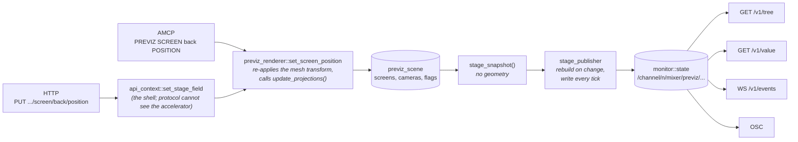

# PREVIZ — 3D pre-visualisation

> **State:** shipped; **cost** measured, **picture** unmeasured
> **Modules:** **not a module** — `src/accelerator/ogl/image/previz_renderer.cpp`, `previz_scene.h`,
> `previz.frag` / `previz.vert`, with the Vulkan route through
> `src/accelerator/vulkan/image/previz_texture_bridge.cpp`
> **Commands:** 13 fork-specific AMCP commands
> **Architecture:** none — shares the ICVFX state the projection commands write; the two routes to
> it are §5.3 below
> **Guide:** [`../guides/PREVIZ_3D_MODULE.md`](../guides/PREVIZ_3D_MODULE.md)
> **Coverage:** `cli.py previz-picture` — does the mapped channel arrive on the mesh, in order, on both mixers (§4). `cli.py api-stage` — screens and cameras as addressable nodes, and §4's check 3, the two routes to ICVFX state (§4.2). `cli.py preview-cost --arm previz --arm previz_spout --arm previz_screen` — what previz costs the channel, at 1080p50 and at the VP workload; the floor those shares are measured against is `cli.py raster-capacity`. The projection maths itself is checked at every server start (§4.1). **Spatial placement is still uncovered by all of them** — see §4

Loads a 3D scene, maps channel output onto meshes in it, and renders a camera view of the result —
so a projection design can be checked without the venue. Screens, presets and camera positions are
addressable by name at runtime.

> **Read §4 first.** This is the largest surface in the fork with **no picture check**: 13 commands,
> five of them now driven by `preview-cost`'s previz arms and **none of them checked against a
> rendered pixel**. That combination — undocumented *and* undriven — is exactly what ICVFX was
> before an audit found a live colour defect in it, and this document exists because that
> correlation was measured rather than assumed. **This file closed the documented half.** Cost
> coverage arrived on 2026-08-31 and closes none of the ICVFX-class gap: a battery that gates on
> timing cannot see a channel exchange.

---

## 1. What is implemented today

Verified against `src/protocol/amcp/AMCPCommandsImpl.cpp` at the definition line given.

**The wire form is `PREVIZ <channel>[-<layer>] <SUBCOMMAND> [args]`** — the channel comes *before*
the verb, as it does for `MIXER`. The layer index parses and **no previz command reads it**.

| command | shape | handler |
| :--- | :--- | :--- |
| `PREVIZ SCENE` | *(query)* \| `NONE` \| `SAVE <path>` \| `LOAD <path>` \| `<path>` | `previz_scene_command` |
| `PREVIZ MAP` | `<mesh_name> <channel>` — needs ≥2 parameters, else `400` | `previz_map_command` |
| `PREVIZ UNMAP` | `<mesh_name>` | `previz_unmap_command` |
| `PREVIZ CAMERA` | *(query)* \| `RESET` \| `OVERRIDE [1\|0]` \| `<x> <y> <z> <yaw> <pitch> <roll> <fov>` | `previz_camera_command` |
| `PREVIZ VIEW` | *(query)* \| `CLEAR` \| `RESET` \| `<x> <y> <z> <yaw> <pitch> <roll> <fov>` | `previz_view_command` |
| `PREVIZ INFO` | — query | `previz_info_command` |
| `PREVIZ SHOW` | `<mesh_name> [1\|0]` | `previz_show_command` |
| `PREVIZ GRID` | `[1\|0]` | `previz_grid_command` |
| `PREVIZ WIREFRAME` | `[1\|0]` | `previz_wireframe_command` |
| `PREVIZ GIZMO` | `[1\|0]` | `previz_gizmo_command` |
| `PREVIZ PRESET` | `SAVE <name>` \| `RECALL <name>` \| `LIST` | `previz_preset_command` |
| `PREVIZ SCREEN` | a family of twelve — see below | `previz_screen_command` |
| `PREVIZ AUTOPROJECTION` | `[1\|0] [SOURCE <ch>-<layer>]` — defaults to **on** when no parameter is given | `previz_autoprojection_command` |

> **The `def` column used to hold line numbers, and all thirteen were wrong** by the time anyone
> read them — commits elsewhere in `AMCPCommandsImpl.cpp` shifted every one. `CLAUDE.md` says to
> cite a symbol rather than a line for exactly this reason; the handler names above survive any
> edit above them.

**Details that are not guessable from the names:**

- **`PREVIZ SCREEN` is a command family of twelve, not one command** — enumerated in §1.1 below.
  It includes `ICVFX` and `EYEMODE`, which means per-screen ICVFX state is reachable from here as
  well as from `MIXER PROJECTION_ICVFX`. Two routes to one piece of state is the pattern
  `CLAUDE.md` says earns a diagram; §7 records that as owed, and §5.4 records that the precedence
  between them is **not** what a reader would guess.
- **`PREVIZ AUTOPROJECTION` with no argument turns it ON** — `ctx.parameters.empty() || at(0) != "0"`.
  Toggles that default to enabled are unusual in this command set and easy to trip over in a
  startup script.
- **The `[1|0]` commands are all "anything but `0` is on"**, not strict boolean parsing.
- **`PREVIZ MAP` requires two parameters and returns `400`**; most of the others accept an empty
  parameter list as a query or a default.

### 1.1 `PREVIZ SCREEN` — the twelve subcommands

Read out of `previz_screen_command`'s dispatch chain on 2026-09-06 and checked against it
argument by argument. This is the enumeration §5.3 recorded as owed, and `BRIEF.md` requires it
**before** anything re-models how screens are described.

The whole body is inside one `try`, so any unparseable number answers `502 PREVIZ FAILED <what>`
rather than `400`.

| subcommand | full grammar | writes | recomputes projections |
| :--- | :--- | :--- | :---: |
| `LIST` | `SCREEN LIST` | — | — |
| `ADD … FLAT` | `SCREEN ADD <name> FLAT <width_m> <height_m>` | a fresh `screen_meta` with only name and size; generates the mesh; sets the scene active | **no** |
| `ADD … CURVED` | `SCREEN ADD <name> CURVED <width_m> <height_m> <radius_m> <arc_deg>` | as above plus `arc_deg`; **`radius_m` is recomputed, see below** | **no** |
| `POSITION` | `SCREEN <name> POSITION <x> <y> <z>` | `pos_x/y/z`, re-applies the mesh transform | yes |
| `ROTATION` | `SCREEN <name> ROTATION <yaw> <pitch> <roll>` | `rot_yaw/pitch/roll`, re-applies the mesh transform | yes |
| `RESOLUTION` | `SCREEN <name> RESOLUTION <w_px> <h_px>` | `res_w`, `res_h` | **no** |
| `CHANNEL` | `SCREEN <name> CHANNEL <ch>` | `channel`; maps the mesh when `ch >= 0`, unmaps otherwise | yes |
| `REMOVE` | `SCREEN <name> REMOVE` | erases the screen, its mapping and its mesh | **no** |
| `EYEMODE` | `SCREEN <name> EYEMODE CAMERA` \| `SCREEN <name> EYEMODE FIXED [x y z]` | `eye_mode`, and `design_eye_*` only when `FIXED` **and** at least three coordinates were given | yes |
| `ARCV` | `SCREEN <name> ARCV <arc_v_deg>` — 0 means a single-curved cylinder | `arc_v_deg` | yes |
| `ICVFX` | `SCREEN <name> ICVFX 1\|0` — also accepts `true` | `icvfx_enable` | yes |
| *(anything else)* | — | `400 PREVIZ ERROR unknown screen subcommand` | — |

`LIST` answers `201` followed by one line per screen and a blank line:

```
<name> <width>x<height>m[ curved r=<radius>m][ ch=<channel>]
```

**Seven things the grammar does not tell you, each verified against the handler:**

1. **`LIST` reports four of a screen's fifteen properties.** Position, rotation, vertical arc,
   resolution, eye mode, design eye and ICVFX are **write-only over AMCP** — settable, and
   readable nowhere. There is no `SCREEN <name> INFO`.
2. **`ADD … CURVED` discards the `radius_m` you give it.** `add_screen_curved` computes
   `radius = width / 2 / sin(arc / 2)` and uses the supplied value only when that sine is within
   `1e-6` of zero. The argument is in the grammar and is almost never the value stored.
3. **`EYEMODE` accepts any word.** The test is `== "FIXED"`; **everything else, including a typo,
   silently means `CAMERA`**. `SCREEN wall EYEMODE FIXXED 0 1.5 3` returns `202` and sets camera
   mode with the coordinates ignored.
4. **`EYEMODE FIXED` with one or two coordinates silently uses the defaults** `(0, 1.5, 3)` — the
   guard is `size() >= 6`, so a partial coordinate list is neither used nor refused.
5. **`LIST` and `ADD` are matched before `<name>`**, so a screen called `list` or `add` is
   unaddressable by every other subcommand.
6. **Four subcommands do not recompute projections**: `ADD` (either form), `RESOLUTION` and
   `REMOVE`. Adding a screen and mapping it with `CHANNEL` works because `CHANNEL` recomputes;
   adding one whose `channel` is set only by `PREVIZ MAP` does not, because `MAP` does not either.
7. **`res_w`/`res_h` are stored and persisted and read by nothing.** No renderer path and no
   projection calculation consults them.

### 1.2 `PREVIZ CAMERA` and `PREVIZ VIEW`

Both are families of four, and both were listed in §1 as *"placement arguments"*.

| form | `CAMERA` | `VIEW` |
| :--- | :--- | :--- |
| *(no parameters)* | query: `201` then `<x> <y> <z> <yaw> <pitch> <roll> <fov>` | query: `201` then `<override 1\|0> <x> <y> <z> <yaw> <pitch> <roll> <fov>` |
| `RESET` | camera back to its default, projections recomputed | same as `CLEAR` |
| `CLEAR` | — | drops the view override |
| `OVERRIDE [1\|0]` | freezes tracker control of the production camera | — |
| `<x> <y> <z> <yaw> <pitch> <roll> <fov>` | sets the **production** camera; recomputes projections | sets the **viewport** camera; **deliberately does not recompute** |

* **`OVERRIDE` with no argument locks.** The test is `size() < 2 || at(1) != "0"`, so only the exact
  string `0` unlocks — `false` and `off` both lock.
* **The two cameras are not interchangeable.** `compute_frustum` always uses the production camera,
  so orbiting the viewport never moves a projection. That is the point of the split, and it is why
  `VIEW` omits the recompute.
* **Neither reports `near_clip`/`far_clip`, and neither can set them.** `set_camera` hard-codes
  `0.1` and `100`, and the layout file does not carry them.
* **With a tracker bound in `PREVIZ` mode, `set_camera` runs per tracker sample** — so
  `update_projections()`, and one `apply_transform` per mapped screen, run at the tracker's rate
  rather than the channel's.

---

## What previz costs, and why the earlier figures in this file were misleading

**In the configuration anyone actually runs — previz on one channel visualising the
others — it costs almost nothing.** Five 1080p50 channels, previz active on N of them:

| previz active on | 0 | 1 | 2 | 3 | 5 |
| :--- | ---: | ---: | ---: | ---: | ---: |
| late frames / ~5012 | 0 | **2** | **2** | 6 | 14 |

Earlier revisions of this section reported previz costing 5-11% of ticks and named first
the bridge and then the render as the culprit. **Both readings came from a machine state
that could not be reproduced.** The same configurations that measured 267-1280 late frames
in one session measure 2-14 in another, with the same binary, while the previz-off control
holds at 0-1 throughout. Nothing has explained that, and it is the largest open question
about previz — larger than anything in the renderer.

### The render itself, measured directly

The channel's late-frame count is a threshold effect and useless for anything finer than
on/off. Timing `previz_renderer::render` directly is stable and is the instrument to use:

| | p50 | p90 | p99 | max |
| :--- | ---: | ---: | ---: | ---: |
| render, 2-mesh scene | **157-175 µs** | 202-268 | 415-948 | 1140-4090 |
| render, 60-mesh scene | **546-612 µs** | | | |
| — of which FBO bind/attach/viewport/clear | **3.4 µs** | 5.7 | 6.9 | 92 |
| — the draw loop | 108 µs | 145-158 | 258-318 | 474-2078 |
| — the ground grid, within that | ~15-25 µs | | | |

**p50 is reproducible to a few per cent between runs; nothing else here is.** The heavy
tail lives entirely in the draw loop, is the same at 2 meshes as at 60 — so it is a
per-render event, not per-mesh — and is what turns into late frames when it happens.

### Three micro-optimisations, all measured, none worth keeping

| attempt | p50, 2 meshes | p50, 60 meshes |
| :--- | :--- | :--- |
| baseline | 174-204 µs | 546-612 µs |
| cache `u_mvp`/`u_model` locations instead of `glGetUniformLocation` per mesh per frame | 172-221 | 554-650 |
| drain GL errors once per frame instead of once per screen mesh | (same change set) | (same) |
| skip the `glGetError` after `glBindTexture` | 103-120 | — |

None of them moves p50, and the first two were marginally *worse* at 60 meshes — the
switch guarding them costs about what they save. All reverted. Worth knowing so nobody
spends the afternoon again: the per-mesh cost is roughly **8 µs at 60 meshes**, and it is
not in the uniform lookups or the error checks.

### Where to look next, if previz ever needs to be faster

Not at micro-optimisation. The two open questions are the **100x instability between
sessions**, which dominates everything else and is unexplained, and the **heavy tail in
the draw loop**, which is per-render rather than per-mesh and was not localised further
than that. The fixed per-render cost outside the draw loop is 3.4 µs and has nothing left
in it.

## Red and blue were exchanged on every mapped screen (fixed 2026-08-29)

A channel playing `#20A0C0` appeared on its previz screen as `#BE9E1E` — the same colour
with **red and blue exchanged**. Visible on every mapped screen, on the Vulkan mixer, for
as long as the VK→GL bridge has existed.

| | mapped screen renders | source |
| :--- | :--- | :--- |
| before | `#BE9E1E` (190, 158, 30) | `#20A0C0` (32, 160, 192) |
| after | `#1F9FBF` (31, 159, 191) | `#20A0C0` — the 1/channel is previz's own shading |

**Cause.** The mixer's 8-bit attachment is declared `eR8G8B8A8Unorm` but *holds BGRA
bytes* — only the 8-bit shader path swizzles, which `vulkan::device` records in two
places. `previz_texture_bridge` copied it into another `R8G8B8A8` image and imported that
as `GL_RGBA8`, so GL read blue where red should be.

**Fix.** The destination image is now `B8G8R8A8`, and the copy is a **`vkCmdBlitImage`
rather than a `vkCmdCopyImage`** — that second half is the part that is easy to get wrong.
A copy moves *bytes* and is format-agnostic, so changing the destination's component order
would have changed nothing; a blit maps *components*, which is what reorders BGRA into
true RGBA for the importer. Same extents, so the filter never runs. The 16-bit path is
already RGBA and is untouched.

**Why it survived this long: nothing had ever looked at previz's output.** No battery
drives previz, and the defect is invisible unless you compare a mapped screen's colour to
the channel's — a grey or white test pattern is invariant under the exchange. It was found
by publishing the previz channel over Spout and reading the pixels back, which is now the
cheapest way to check previz at all:

```
PREVIZ 1 SCENE scene.obj
PREVIZ 1 MAP screen1 1
ADD 1 SPOUT previzcap MAX_WIDTH 512
```

then receive `previzcap` and compare the mapped quad against the channel's colour. The
scene needs only a two-quad `.obj` inside the server's media path.

## 2. How to drive it

Load a scene, map channel 1 onto a mesh, look at it:

```
PREVIZ SCENE "venue/stage.gltf"
PREVIZ MAP led_wall_main 1
PREVIZ SHOW led_wall_main 1
PREVIZ GRID 1
PREVIZ WIREFRAME 0
PREVIZ INFO
```

Screens and presets are enumerable, which is the fastest way to discover what a scene actually
contains:

```
PREVIZ SCREEN LIST
PREVIZ PRESET LIST
PREVIZ PRESET RECALL front_wide
```

Careful with this one — it enables autoprojection rather than querying it:

```
PREVIZ AUTOPROJECTION
```

No `<configuration>` elements; entirely runtime.

### 2.1 The same stage, as addressable nodes — since 2026-09-06

Every screen and both cameras are also ordinary nodes in the control API's tree, beside the mixer
fields. **Additive**: the thirteen `PREVIZ` commands are unchanged and nothing that works today
stops working. What the tree adds is that a screen can now be *read*, *described* and *discovered*
rather than only written.



**Both routes end at the same mutator**, and that is the point rather than an implementation
detail: `set_screen_position` and its siblings re-apply the mesh transform and call
`update_projections()`. A write that set the struct directly would store a value that changes
nothing on screen — 202 and no picture.

| address | type | notes |
| :--- | :--- | :--- |
| `/channel/{n}/mixer/previz/active` | bool | read-only telemetry, always published |
| `…/auto_projection`, `…/show_grid`, `…/show_wireframe`, `…/show_gizmo` | bool | the diagnostic aids as fields, not a debug menu |
| `…/camera_locked`, `…/view_override`, `…/scene_path` | bool, bool, string | always published |
| `…/screens` | string[] | which named screens exist. Always published, including empty |
| `…/camera/{position,rotation,fov}` | vec3 m, vec3 deg, real deg | the **production** camera — what `compute_frustum` reads |
| `…/camera/{near_clip,far_clip}` | real m | **read-only**: hard-coded by `set_camera`, not in the layout file |
| `…/view_camera/…` | same five | the operator's viewport. Moving it never moves a projection |
| `…/screen/{name}/size` | vec2 m | **not writable** — see below |
| `…/screen/{name}/{position,rotation}` | vec3 m, vec3 deg | |
| `…/screen/{name}/radius` | real m | **read-only and DERIVED** — `width / 2 / sin(arc / 2)` |
| `…/screen/{name}/arc` | real deg | **not writable** — see below |
| `…/screen/{name}/arc_v` | real deg | 0 leaves a cylinder |
| `…/screen/{name}/resolution` | vec2 px | stored, persisted, **read by nothing** (§5.5 defect 4) |
| `…/screen/{name}/channel` | integer | −1 unmapped. Note `PREVIZ MAP` does **not** write this (§5.5 defect 5) |
| `…/screen/{name}/eye_mode` | enum `camera｜fixed` | a **closed** enum here: an unknown name is refused, where the AMCP form accepts any word as CAMERA (§5.5 defect 2) |
| `…/screen/{name}/design_eye` | vec3 m | writable only while `eye_mode` is `fixed` — see below |
| `…/screen/{name}/icvfx` | bool | |

```
curl http://127.0.0.1:5254/v1/tree/channel/1/mixer/previz
curl -X PUT -d '{"value":[2.5,0,-5.5]}' \
     http://127.0.0.1:5254/v1/value/channel/1/mixer/previz/screen/back/position
```

**A field at its default is not published**, exactly as for the mixer: `/v1/value` answers an
absent path with the descriptor's default and flags it `is_default`. That is why `screens` is
published unconditionally — a screen whose every property happened to sit at its default would
otherwise not appear at all. A channel with no stage on it publishes nothing under `previz`, on
either backend.

**Four restrictions, each with a reason rather than a to-do:**

* **`op: set` only.** `toggle`, `add` and `cas` get their atomicity on the mixer path from running
  inside one closure on the stage executor. The previz renderer is a set of per-property setters,
  so a read-modify-write would span two acquisitions of the scene lock. A `toggle` that is not
  atomic is worse than no `toggle`.
* **Not tweenable.** `duration` and `tween` are refused rather than ignored: KEYFRAMES is bound to
  `image_transform` end to end, so a screen cannot be animated in this build. L57 of the design
  study says it should be; that is a real gap, named rather than papered over.
* **`size` and `arc` have no mutator.** Both are set only by `add_screen_flat`/`add_screen_curved`,
  which build a *fresh* `screen_meta` and would silently discard position, rotation, eye mode and
  ICVFX. Refused with that reason in the message, until the renderer grows a resize that
  regenerates the mesh in place.
* **`design_eye` is declined outside `fixed` mode**, because `set_screen_eye_mode` stores those
  three components only when the mode is already FIXED. Set `eye_mode` first. The write comes back
  as `field_conflict` with both values rather than as a success, because the reply reports what the
  renderer **holds**, not what was asked for.

---

## 3. Design decisions, and what they cost

**The renderer is an OpenGL one on both backends, and the commands reach it either way.**
`get_previz_renderer` in `AMCPCommandsImpl.cpp` tries `dynamic_cast<ogl::image_mixer*>` first and
`vulkan::image_mixer` second; the Vulkan mixer builds the same `ogl::previz_renderer` lazily on a
dedicated OGL device and bridges its output back. So `PREVIZ` works on a Vulkan channel —
`api-stage` and `previz-picture` both drive it there, 19/19 and 4/4.

*This paragraph used to say the opposite* — "on a Vulkan channel the commands have no mixer to talk
to" — and it was already false when written. The real constraint is narrower and is recorded as
§5.5's defect 6: **camera tracking** in `mode_previz` casts only to `ogl::image_mixer`, so tracker-
driven previz is OpenGL-only. One `dynamic_cast` chain was widened to cover Vulkan and another was
not, and the difference is invisible from the command surface.

**The two backends allocate the renderer differently, and it leaked once.** OpenGL holds it by
value (one always exists); Vulkan builds it on first use. That gave every idle OpenGL channel a
previz sub-tree in the control API and Vulkan channels none, until the publication was made
conditional on the STAGE being non-default rather than on a renderer existing. Worth remembering
whenever something asks "does this channel have previz" — the honest answer is about the scene,
not about the object.

**Names rather than indices** for meshes, screens and presets. It makes show files readable and
survives a scene being re-exported with different ordering, at the cost of silent no-ops when a
name does not match — which is the failure mode to look for first when a command returns `202`
and nothing moves.

---

## 4. Verification — what is measured, and what is not

**Cost is measured, and since 2026-09-05 so is the picture — for `MAP`.** `preview-cost`'s three
previz arms drive `PREVIZ SCENE`, `MAP`, `SHOW`, `GRID` and `WIREFRAME` against a generated scene
(`core/previz_scene.py` — four named quads around a stage) and report what previz costs the
channel's tick; that is where the figures above come from. **They gate on timing and never look at
a pixel**, so on their own *"a previz that rendered the wrong channel onto every mesh, or nothing
at all, would pass every arm."*

`cli.py previz-picture` closes that for the mapping. Each mapped channel plays a **different
asymmetric colour** and the previz render is searched for each, which answers all three checks
below at once: a colour that is absent did not arrive, a colour found has its components in the
right order, and four distinct colours mean four distinct channels landed. When a colour is
missing its **permutations** are searched too, so an exchange is named as one rather than reported
as a mapping fault.

**Result, 2026-09-05, both mixers: 4/4 screens, and the pixel counts are identical between OGL and
Vulkan** — 346800 / 188232 / 188232 / 405674. So `PREVIZ MAP` delivers the right channel to the
right mesh with its components in order, and the two mixers agree, which is the parity §5.2 records
as unmeasured.

**Still not covered**: eight of the thirteen commands (`UNMAP`, `SCREEN`, `CAMERA`, `VIEW`,
`AUTOPROJECTION`, `GIZMO`, `PRESET`, `INFO`), check 3 below, spatial placement — four colours prove
four channels arrived on four meshes, not that `screen1` is the back wall — and colour accuracy,
since the quads are lit and projected so the tolerance is deliberately wide.

This section read *"Nothing. No battery in the harness references PREVIZ"* until 2026-08-31, and
was already false when the cost figures above were written into this file. The correction is worth
keeping visible: **a cost battery is not coverage of a feature**, and the two halves went stale in
opposite directions in one sitting.

The remaining gap is recorded as the finding it is rather than as a to-do. The measured correlation from the
2026-08-26 audit: of the fork's 58 AMCP commands, the ones carrying defects were the ones that
were both undocumented and undriven. ICVFX had a red/blue exchange on the OpenGL mixer that
survived because no battery drove it and because the natural way to test a white balance — equal
gains — is invariant under exactly that defect. **PREVIZ is the same shape, thirteen times over**, and it
reaches the same OpenGL renderer from both mixers.

What a first battery should do, in the order that would have caught the ICVFX class:

1. `PREVIZ MAP` a channel onto a mesh, render a view, and check the mesh is **not** the background
   colour — the cheapest possible "did anything arrive" check.
2. An **asymmetric** source colour through the mapping, compared per channel, because a symmetric
   one cannot see a channel exchange.
3. ~~`PREVIZ SCREEN ... ICVFX` against `MIXER PROJECTION_ICVFX` for the same screen~~ — **written
   2026-09-06**, as `api-stage`'s last check. §4.2 records what it measures and why it measures
   rather than asserts.

### 4.2 The stage is addressable, and `api-stage` covers it — check 3 included

Since 2026-09-06 a screen and a previz camera are ordinary nodes: `GET /v1/tree` describes all
sixteen properties, `PUT /v1/value/channel/1/mixer/previz/screen/back/position` moves one, and
`cli.py api-stage` gates 19 checks on both mixers.

What it establishes that nothing did before:

* **Every screen property is READABLE.** `SCREEN LIST` reports four of fifteen and there is no
  `SCREEN <name> INFO`, so position, rotation, vertical arc, resolution, eye mode, design eye and
  ICVFX were write-only over AMCP. All of them read back now, and both facades are compared
  through `PREVIZ CAMERA` for the camera.
* **A derived field says it is derived.** `radius` is read-only and the tree shows the value the
  server actually holds: a screen added as `CURVED 4 3 5 60` reads back **4.0**, not the 5 that was
  supplied. §5.5's defect 1 is now visible instead of silent.
* **The documented refusals are asserted to be exactly three** — `size` and `arc`, which have no
  mutator, and `design_eye` outside `fixed` mode. A NEW refusal fails the check rather than
  blending in.
* **Mutation-verified.** With the write bridge echoing its own local copy instead of re-reading the
  renderer, two checks fail and name the real symptom: `design_eye` written `[-2600, -400, 1800]`
  and reading back `[0, 1.5, 3]`.

**§4's check 3 exists now**, as `api-stage`'s last check, and it is deliberately a MEASUREMENT
rather than an assertion. §5.4 says the precedence between `PREVIZ SCREEN … ICVFX` and
`MIXER PROJECTION_ICVFX` is "auto-projection silently wins" — but nobody CHOSE that, so asserting
it would freeze an accident into a gate. What the check does assert is the unambiguous half: the
two routes must not disagree silently. Measured, both mixers: the API sets the screen flag `true`
and reads `true`; `PREVIZ SCREEN back ICVFX 0` sets it `false` and reads `false`; and the screen's
own flag **survives** a `MIXER 1-10 PROJECTION_ICVFX 0` with auto-projection on, which is correct —
the layer's ICVFX block and the screen's flag are different quantities, and it is the LAYER's that
auto-projection overwrites.

**A backend divergence it caught on its first run**, worth recording because no other battery could
have: the OpenGL mixer holds its `previz_renderer` **by value**, so one exists from construction,
while the Vulkan mixer builds one lazily on the first `PREVIZ` command. The publication therefore
gave every idle OpenGL channel a previz sub-tree and gave Vulkan channels none. Fixed by making the
rule about the STAGE rather than about the renderer: a snapshot equal to a default-constructed one
publishes nothing, whichever backend is running.

**Still not covered, and it is the same hole §4 already names**: `api-stage` looks at no pixel. A
screen whose position stores perfectly and renders in the wrong place passes all nineteen checks.
`previz-picture` proves a mapped *channel* arrives on a mesh, not *where* the mesh is. Spatial
placement is uncovered by both, and is tracked as A16 in the harness's mutation battery.

### 4.1 The projection maths is checked at boot, since 2026-09-06

`compute_frustum` — the function that turns a screen's placement into the orientation and field of
view its channel must render at — now has **68 property checks that run on every server start** and
log `[core] stage math self-test: 68 checks, 0 divergences`. They need no GL device and no display,
which is the tier `78-client-test-plan.md` §4 specifies for this surface, and which was
**unavailable until the function moved out of the accelerator** in `b00eb9873`: reaching it meant
constructing a `previz_renderer`, which needs a `device`, which needs a context.

**There is no standard to check it against.** The convention is this fork's own. So the checks are
of two kinds, and the second is the one that matters:

* **Properties** any correct implementation has — a screen facing the camera projects at yaw 0;
  rotating it about Y rotates the projection with it; the field of view follows the
  **perpendicular** distance rather than the total; `eye_mode FIXED` ignores the camera entirely;
  the two documented degenerate cases (eye at the screen centre, eye in the screen plane) return
  what they are documented to return; the curve classification and the `k = perp/radius` ratio.
* **A second derivation of the ICVFX quad.** The camera and screen bases are computed from
  **closed-form trigonometry**, not from `mat4` products — deliberately the same expressions
  `casparcg-360-client`'s pure-numpy, Qt-free `frustum_check.py` uses, which was written
  independently against the same geometry. Reusing `mat4` here would have compared the
  implementation against itself and passed for any self-consistent-but-wrong rotation order, which
  is exactly how two of the ACEScg gamut matrices round-tripped to the identity while both were
  wrong.

**And it was verified to be able to fail**, because a check that cannot fail is worse than no
check. Two mutations were compiled into `compute_frustum` and the self-test run against the
mutant:

| mutation | caught as |
| :--- | :--- |
| field of view from the **total** distance instead of the perpendicular | 3 × `offaxis/fov`, e.g. `got 22.191607 want 22.442819` |
| camera rotation order `Rx·Ry·Rz` instead of `Ry·Rx·Rz` | 16 × `icvfx/quad/{x,y}` |

19 of 68 checks failed on the mutant; 0 of 68 on the reverted build. Tolerances are 1e-3 degrees
and 1e-4 NDC — several orders tighter than 1 LSB of any encoding of these quantities.

It logs **fatal** on failure where the compose self-test logs a warning, and the difference is not
stylistic: the generated composition is not on the frame path, so a divergence there breaks nothing
that is running. `compute_frustum` **is** on the frame path — every auto-projection recompute calls
it — so a broken property means screens are already being pointed the wrong way.

**What it does not cover.** It is a check on the *maths*, not on the picture: it says nothing about
whether the computed projection reaches the shader, whether the warp applies it, or where a screen
appears on screen. Spatial placement stays uncovered, exactly as the previous section says. Nor
does it touch the twelve `PREVIZ SCREEN` subcommands that *write* this geometry — that is check 3
above, still unwritten.

### A mapped channel needs a consumer, or `PREVIZ MAP` succeeds and shows nothing

**Measured 2026-09-05, and it cost a fabricated defect.** The first run of `previz-picture`
reported 0 of 4 screens on both mixers with every command returning `202 PREVIZ OK` — the scene
loaded with 4 shapes, all four meshes reported *"Mapped mesh ... to channel N"*, and the render
came back as grey quads. Read alone that is *"`PREVIZ MAP` reports success and delivers nothing"*,
which is what it was about to be written up as.

**The cause was the fixture: channels 2–5 had no consumer.** A channel with no consumer does not
produce frames, so previz had nothing to sample. Confirmed by elimination rather than assumed —
with the source channels left consumerless, **20 seconds of settle still gave 0 px**, so it is not
a timing problem; adding a capture on each source channel makes the same run pass 4/4.

Two consequences:

* **For a battery**: `previz-picture` captures each mapped channel *before* asking previz about it,
  and an arm whose source control fails reports **"this arm says NOTHING about previz"** rather
  than a previz failure. A check that cannot tell "the mapping dropped it" from "the channel never
  ticked" will eventually report the second as the first.
* **For a client**: mapping a channel that nothing consumes gives a silent grey mesh, with `202 OK`
  on every command. A GUI driving previz must ensure its mapped channels are being consumed, and
  should not treat `PREVIZ MAP`'s `202` as evidence that anything will appear.

---

## 5. Known gaps

1. **Picture coverage exists for `MAP` only, since 2026-09-05** — `cli.py previz-picture`, §4.
   Arrival, component order and per-mesh identity are gated on both mixers. The other twelve
   commands still have no picture check. §4's third check (`PREVIZ SCREEN ... ICVFX` against
   `MIXER PROJECTION_ICVFX`) **was** blocked on §5.3 and is now unblocked — §1.1 gives its exact
   grammar — but it is still unwritten, and §5.4 says what it would find.
2. **The renderer is OpenGL on both mixers, and the parity that implies is unmeasured.** This item
   read *"OpenGL-only — either the Vulkan mixer grows the same bridge or the commands should
   refuse"*; the bridge exists (`vulkan/image/image_mixer.cpp:1204-1254`). A Vulkan channel
   composites in Vulkan, posts the result to the VK→GL bridge, renders the scene on the OGL thread
   and returns *that* as the channel output — so previz **replaces** the 2D output and skips the
   working-space composite. Two consequences nothing checks: a Vulkan channel running previz is
   doing a per-frame round trip through a second API, and its colour handling differs from the same
   channel with previz off.
3. ~~**`PREVIZ SCREEN`'s eight subcommands are unenumerated**~~ — **CLOSED 2026-09-06**, and
   there were **twelve**, not eight. §1.1 enumerates all of them argument by argument, and §1.2
   does the same for `CAMERA` and `VIEW`, which §1 had described as *"placement arguments"*. Seven
   behaviours that the grammar does not imply are recorded there; four of them are defects rather
   than surprises, listed in §5.5.
4. **Two routes to per-screen ICVFX state**, and the precedence is now known: **auto-projection
   silently wins.** `PREVIZ AUTOPROJECTION` writes the ICVFX block on every recompute with no guard,
   whereas the *curve* block beside it is protected by `curve_auto` — an explicit
   `MIXER PROJECTION_CURVE` clears that flag and freezes the operator's values, and nothing does
   the same for ICVFX. So a hand-set `MIXER PROJECTION_ICVFX` survives exactly until the next
   camera move. **Not measured, and not changed**: making ICVFX follow the curve block's rule would
   alter rendered output for any show that sets it manually, so it needs its own commit and its own
   before/after. §4's check 3 is what would measure it, and §1.1 has unblocked it.

### 5.5 Six defects in the command surface

Found while enumerating §1.1 on 2026-09-06. None is fixed here; each is recorded so the next reader
does not have to rediscover it.

1. **`ADD … CURVED` discards the `radius_m` argument** — it is recomputed from width and arc. The
   parameter is in the grammar, is accepted, and is almost never the value stored. The layout file
   round-trips through the same path, so a saved curved screen reloads with a re-derived radius.
2. **`EYEMODE` accepts any word as `CAMERA`.** The test is `== "FIXED"`, so a typo returns `202`
   and silently selects the other mode. And `FIXED` with fewer than three coordinates uses the
   defaults rather than refusing.
3. **A scene reload keeps the old screens.** `PREVIZ SCENE <path>` clears `meshes` but not
   `screens` or `mesh_to_channel` — only `SCENE NONE` clears those. So after loading a second
   model, `screens` still describes screens whose meshes are gone, and `update_projections()`
   iterates `screens`, so those phantoms keep writing projections to their mapped channels.
4. **`show_gizmo` is written and never read**, and `res_w`/`res_h` are stored, persisted and never
   read. `PREVIZ GIZMO` and `SCREEN … RESOLUTION` both answer `202` and change nothing that
   renders.
5. **`PREVIZ MAP` and `PREVIZ SCREEN … CHANNEL` are not the same operation, and the difference is
   silent.** `map_mesh` writes `mesh_to_channel[name]` and `mesh.is_screen`; it never touches
   `screens[name].channel`. `set_screen_channel` writes **both**, then recomputes projections. And
   `update_projections` iterates `screens`, skipping any whose `channel < 1`.

   So on a procedurally added screen, `PREVIZ 1 MAP back 3` **textures the mesh and leaves
   auto-projection off for it** — the screen still reads `channel = -1`, and no frustum is ever
   written to channel 3. `PREVIZ 1 SCREEN back CHANNEL 3` does both. Both answer `202`, and
   nothing reports which one you got.

   `previz-picture` cannot see this: it uses `MAP` and asserts the **texture arrives**, which it
   does. What does not arrive is the projection, and no battery looks at that.
6. **Tracker-driven previz is OpenGL-only, and fails silently.** `tracking_commands.cpp`'s
   `mode_previz` branch does `dynamic_cast<accelerator::ogl::image_mixer*>` and nothing else, so on
   a Vulkan channel `ogl_mix` is null, the `if` is skipped, `previz_camera_fn` is never installed
   — and the command still answers `202 TRACKING OK`. The tracker binds, samples arrive, and the
   previz camera never moves.

   It is the same `dynamic_cast` chain the `PREVIZ` commands use, minus its second branch:
   `AMCPCommandsImpl.cpp`'s `get_previz_renderer` tries `vulkan::image_mixer` as well. One was
   widened to cover both backends and the other was not, which is why §3 said for a long time that
   previz did not work on Vulkan at all — half of that was true, and it was this half.

   Found 2026-09-06 while correcting §3. **Not fixed here**: it needs the Vulkan branch and a check
   that drives a tracker, and `TRACKING` has no battery of any kind — all eighteen of its commands
   are uncovered.

---

## 6. Related commits

Not yet traced. The module predates this document and its history has not been read; that is
deliberate rather than lazy — a commit list here is only useful if each line says *why the commit
matters*, and inventing that from subject lines would be exactly the kind of claim this folder
exists to avoid. Tracked as work owed.

---

## 7. Diagrams

**Owed.** Two of the three criteria in `CLAUDE.md` apply: `PREVIZ SCREEN ... ICVFX` and
`MIXER PROJECTION_ICVFX` are two paths reaching the same state, and the scene → mesh → mapped
channel → camera view chain is an order that prose describes badly. Operator-facing, so a rendered
PNG from a script in `docs/diagrams/`.
