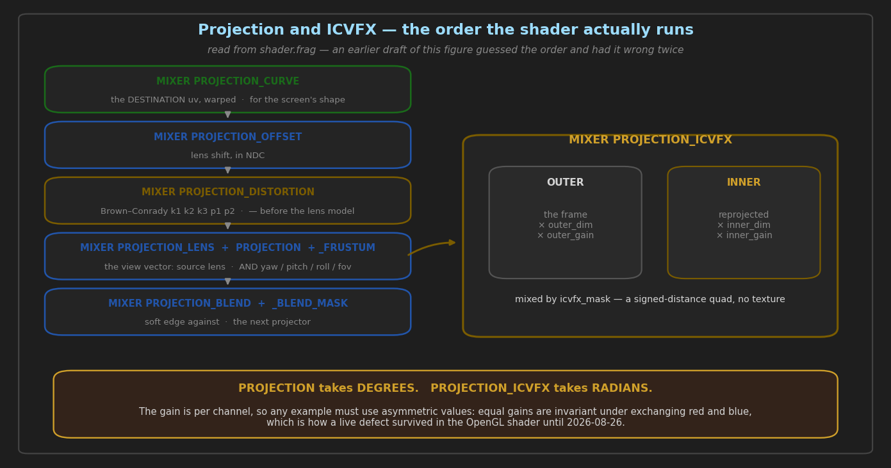

# Projection and ICVFX

> **State:** partial — the geometry and blend commands are shipped and measured; ICVFX is shipped
> with only its per-channel gain measured
> **Modules:** `src/accelerator/ogl/image/shader.frag`, `src/accelerator/vulkan/image/fragment_shader.frag`, `src/core/frame/frame_transform.h`
> **Commands:** 13 fork-specific AMCP commands (10 `PROJECTION_*`, 2 ICVFX, and `MIXER FLIP`)
> **Architecture:** none, deliberately — the shader stage order is the one structural fact, and it is in features/projection-and-icvfx.md with a diagram generated from the shader
> **Guide:** [`../guides/VIRTUAL_PRODUCTION_FEATURES.md`](../guides/VIRTUAL_PRODUCTION_FEATURES.md), [`../guides/PROJECTION_CALIBRATION.md`](../guides/PROJECTION_CALIBRATION.md)
> **Coverage:** `geometry`, `blend-mask`, `calibration`, `venue-test`, `icvfx-parity`

Warps a layer onto a non-planar screen — a cylinder, a dome, a fisheye — soft-edge blends it
against neighbouring projectors, and applies the in-camera VFX inner/outer frustum treatment used
on LED volumes. All of it is per **layer**, composed on the layer's `image_transform`, so two
layers on one channel can carry different geometry.

**Read §4 before trusting any of it.** Twelve of these thirteen commands had no documentation at
all until 2026-08-26, and the thirteenth carried a red/blue exchange on the OpenGL mixer that no
test could see.

---

## 1. What is implemented today

Every row verified against `src/protocol/amcp/AMCPCommandsImpl.cpp` at the line given, not from
another document.

| command | parameters | registered |
| :--- | :--- | ---: |
| `MIXER PROJECTION` | `yaw pitch roll fov [dur] [tween]` — degrees, converted by `DEG2RAD` | 5567 |
| `MIXER PROJECTION_OFFSET` | `offset_x offset_y [dur] [tween]` | 5568 |
| `MIXER PROJECTION_CURVE` | `CYLINDER\|SPHERE\|FISHEYE arc_deg [arc_v_deg] [eye_distance] [dur] [tween]` | 5569 |
| `MIXER PROJECTION_LENS` | `CYLINDER\|SPHERE\|FISHEYE` — the *source* lens | 5570 |
| `MIXER PROJECTION_ICVFX` | `enable [inner_fov_rad] [feather] [outer_dim] [inner_dim] [dur] [tween]` | 5571 |
| `MIXER PROJECTION_ICVFX_COLOR` | `ir ig ib or og ob [dur] [tween]` | 5572 |
| `MIXER PROJECTION_FRUSTUM` | `frustum_h frustum_v [dur] [tween]` | 5573 |
| `MIXER PROJECTION_DISTORTION` | `k1 k2 k3 [p1 p2] [dur] [tween]` — Brown–Conrady | 5574 |
| `MIXER PROJECTION_BLEND` | `left right [top] [bottom] [gamma] [dur] [tween]` | 5575 |
| `MIXER PROJECTION_BLEND_MASK` | `<png path>` \| `NONE` \| *(empty = query)* | 5576 |
| `MIXER FLIP` | `H` \| `V` \| `HV` \| `NONE` \| *(empty = query)* | 2268 |

**Three details that surprise people, all verified:**

- **`PROJECTION` takes degrees, `PROJECTION_ICVFX` takes radians.** `inner_fov_rad` is used as
  given; `PROJECTION`'s four angles are multiplied by `DEG2RAD`. Inconsistent, and load-bearing —
  it is in the parameter name for `ICVFX` and nowhere else.
- **`PROJECTION_CURVE` and `PROJECTION_LENS` are different things.** `CURVE` is the shape of the
  *screen* you are projecting onto; `LENS` is the projection the *source material* was shot or
  rendered with. Both take the same three keywords, which is why they get confused.
- **`PROJECTION_BLEND_MASK` with no parameters is a query**, and with `NONE` clears. Only a path
  sets a mask.
- **`MIXER FLIP` is documented here rather than with the grading commands** because it is a
  geometry operation on the layer's transform (`flip_h` / `flip_v`), and the ICVFX branch of both
  shaders reads those same flags when reprojecting the inner frustum. Empty is a query returning
  `H`, `V`, `HV` or nothing; `NONE` clears. It was the last of the fork's 91 AMCP commands with no
  documentation anywhere.

---

## 2. How to drive it

A 180° cylinder with a soft left edge, a lens-distortion correction, and asymmetric ICVFX gain:

```
PLAY 1-1 "clip.mov"
MIXER 1-1 PROJECTION_CURVE CYLINDER 180 0 1.0
MIXER 1-1 PROJECTION 0 0 0 90
MIXER 1-1 PROJECTION_BLEND 0.15 0 0 0 2.2
MIXER 1-1 PROJECTION_DISTORTION -0.12 0.03 0
MIXER 1-1 PROJECTION_ICVFX 1 0.5 0.1 0.6 1.0
MIXER 1-1 PROJECTION_ICVFX_COLOR 0.3 1.0 0.7 1.0 0.6 0.25
```

Query the current mask, then clear it:

```
MIXER 1-1 PROJECTION_BLEND_MASK
MIXER 1-1 PROJECTION_BLEND_MASK NONE
```

**The gains in that example are deliberately asymmetric — `1.0 0.6 0.25`, three distinct values.**
Copy that shape, not an equal-gain example. Equal per-channel gains are invariant under exchanging
red and blue, so a white balance written as `1.0 1.0 1.0` demonstrates nothing and cannot be
turned into a test that discriminates. That is not a hypothetical: see §4.

No `<configuration>` elements — this feature is entirely runtime, per layer.

---

## 3. Design decisions, and what they cost

**Per-channel uniforms are swizzled at the call site, not reversed on upload.** The OpenGL mixer
carries the pixel in **BGR** through the whole grading chain, so `col.r` holds blue. Every
per-channel `vec3` in `shader.frag` therefore takes `.bgr` where it is used — `lmg_*`, `cdl_*`,
`gc_limit`, `luma_coeff`. The exception is `split_*_color`, which is reversed on upload instead
(`sc[2], sc[1], sc[0]` in `image_kernel.cpp`). Both are correct; the mixture is the hazard, because
a new uniform can look consistent with either convention while doing neither.

**Vulkan grades in RGB and needs no swizzle**, which is why a defect of this class shows up as a
mixer *divergence* rather than as a wrong picture on both — and why `icvfx-parity` compares the
two mixers rather than modelling the expected colour.

**The mask is a signed-distance quad, not a texture.** `icvfx_mask` computes the winding of the
four `icvfx_q*` corners and takes the minimum edge distance, so the inner frustum follows a
projective quad without an upload. The cost is that the mask depends on a default quad this
feature's own battery does not set — which is why `icvfx-parity` compares mixers instead of
asserting an absolute colour.

---

## 4. Verification — what is measured, and what is not

| what | battery | numbers | date |
| :--- | :--- | :--- | :--- |
| ICVFX per-channel gain, both mixers | `icvfx-parity` | worst **0 LSB**, mean 0.000, 0.00 % of samples | 2026-08-26 |
| …with the OpenGL swizzles removed (positive control) | `icvfx-parity` | worst **144 LSB**, mean 28.8, 66.4 %, exit 1 | 2026-08-26 |
| geometry and rasters | `geometry` | — | — |
| blend mask reaching the shader | `blend-mask` | — | — |

**What these numbers do NOT cover, which is most of the feature.** `icvfx-parity` sets the gain
and nothing else. It does not cover the mask geometry, the feather, the inner-frustum
reprojection, `inner_yaw/pitch/roll`, the tweened form of either ICVFX command, or any of the ten
`PROJECTION_*` commands beyond what `geometry` and `blend-mask` already did. A green
`icvfx-parity` means *the per-channel gain agrees between mixers* — nothing more.

**The defect this coverage exists because of.** `icvfx_inner_gain` and `icvfx_outer_gain` were
uploaded in RGB order and applied straight to a BGR pixel, so on the OpenGL mixer the red gain
multiplied blue and the blue gain multiplied red. Vulkan was always correct. It survived because
**nothing in the harness drove ICVFX at all**, and because a white balance is naturally set with
equal gains — which are invariant under exactly that exchange. The obvious way to exercise the
feature was the one way that could not see the defect.

The positive control above is the reason to trust the fix: with the two `.bgr` swizzles removed
the battery fails at 144 LSB, and **green comes back bit-identical** — 0.00 mean, 0 worst, 0.0 %
of samples — which is the fingerprint of a red/blue exchange and of almost nothing else.

---

## 5. Known gaps

1. **The mask, feather and inner-frustum reprojection are unmeasured.** Closing it needs a
   geometric fixture — a known quad and a known feather with a predicted coverage — not another
   colour comparison.
2. **No tweened-form coverage** for any of the twelve commands. `duration`/`tween` are accepted
   and untested throughout the fork, not only here.
3. **The degrees/radians inconsistency** between `PROJECTION` and `PROJECTION_ICVFX` is documented
   above rather than fixed. Changing it would break every existing show file; it needs a
   deprecation path, not an edit.
4. **`PROJECTION_LENS` accepts only three keywords** and silently keeps the previous value for
   anything else — worth a `400` instead, but that is a behaviour change.

---

## 6. Related commits

| commit | why it matters |
| :--- | :--- |
| `b1da34a34` | the ICVFX red/blue fix, with three other audit findings — and the reasoning for why an audit found it where testing could not |
| `d2f6fc4` *(harness)* | `icvfx-parity`, including the positive control and why asymmetric gains are the design rather than a detail |
| `e8e4f244d` | the rule that a per-channel colour value must be tested asymmetrically, recorded where someone picking a battery will meet it |

Earlier projection work predates this document; `PROJECTION_BLEND_MASK`'s own history is worth
reading for a related trap — the command returned `202` and rendered byte-identically to no mask
at all on both backends, because the field was missing from the transform allowlist. Fixing that
then exposed a second defect underneath it: `col.rgb *= texture(...).rgb` on a shader carrying BGR.
Same class as the gain defect above, found the same way.

---

## 7. Diagrams



Generated by `docs/diagrams/generate_feature_diagrams.py`.

**The order in that figure is read from `shader.frag`, not inferred** — and an earlier draft of it
got the order wrong twice, which is worth recording because it is the same failure this whole
folder is built against. The draft drew `LENS` first and `DISTORTION` after `PROJECTION`. The
shader does neither:

```
base_uv                                                     TexCoord.st / TexCoord.q
view_uv = is_curved ? apply_curve_warp(base_uv) : base_uv    <- CURVE, on the DESTINATION, first
uv      = is_360    ? get_equirect_uv(view_uv)  : view_uv

  inside get_equirect_uv_ex:
    1.  screen uv -> NDC
    1a. ndc -= (off_x, off_y)                                <- _OFFSET
    1b. Brown-Conrady radial k1/k2/k3                        <- _DISTORTION, BEFORE the lens model
    1c. Brown-Conrady tangential p1/p2
    2.  view vector from source_lens AND yaw/pitch/roll/fov   <- _LENS and PROJECTION, together
```

The shader's own comment gives the reason `CURVE` comes first: *"destination curve compensation is
orthogonal to the source projection"*. `_LENS` and `PROJECTION` are one step, not two, because both
feed the same view-vector construction — which is also why they are drawn in one box.
