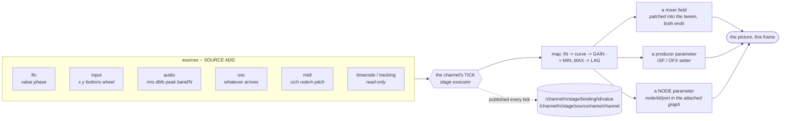

# Reactive parameters — a value driven by a live source

> **State:** shipped; **binding, LFO, input, audio and OSC measured on both mixers**; MIDI
> implemented and **unmeasured** (no device on the reference machine); timecode implemented and
> exercised by hand only
> **Modules:** **not a module** — `src/core/binding/` (the model and its maths),
> `src/core/mixer/audio/audio_analysis.cpp` (level and spectrum),
> `src/protocol/osc/osc_source.cpp` and `src/protocol/midi/midi_source.cpp` (the two wire
> adapters), with the commands in `src/protocol/amcp/AMCPCommandsImpl.cpp`
> **Commands:** 3 fork-specific AMCP commands — `BIND`, `UNBIND`, `SOURCE`
> **Architecture:** none separate — the model is §1 below and it is one sentence
> **Guide:** [`../guides/OPERATIONS_GUIDE.md`](../guides/OPERATIONS_GUIDE.md) §Reactive parameters
> **Coverage:** `cli.py binding-lfo` (the trajectory FITTED against a sine on the frame clock,
> plus the picture at two parked phases), `binding-input` (the pointer, with a gated control arm),
> `binding-owner` (a bound field refuses an explicit write), `binding-audio` (level calibrated
> against ffmpeg, and two tones for the bands), `binding-osc` (including a misaddressed and three
> malformed packets), `binding-cost` (0/8/32 bindings, A/B/A/B), `tracking-previz` (the TRACKING
> source against the same FreeD sample the camera gets), and `binding_math_self_test` +
> `audio_analysis_self_test` at every server start. `cli.py producer-params` covers the
> other half of what a binding needs -- an ISF or OFX parameter described, writable and
> RENDERED at 1 LSB -- since a producer parameter cannot be a binding target until it is
> a registry target

Any addressable parameter — a mixer field, an ISF or OFX parameter — can be driven continuously
by a named live source through a transform, evaluated inside the channel's tick.

---

## 1. The model

```
binding := target  <-  source/channel  through  { IN, MIN, MAX, GAIN, LAG, CURVE }
```

That is the whole of it, and it is not an invention. TouchDesigner gives every parameter four
modes — Constant, Expression, **Export**, Bind — and Export is a CHOP channel continuously
overriding the value. Resolume gives every parameter an animation source (Timeline, BPM, **FFT**
with a band and a gain and a fall, Dashboard, Clip position, Crossfader) with an envelope over
any of them. Hippotizer's pins are the same idea again. Three products converged on one sentence:
**a parameter is either a constant or is driven by a named live source through a transform.**

The fork already had the *description* half of this: 178 registry rows carrying type, range,
composition, bounding and keyframe names, three façades derived from them, and — since
`521a585c7` — producer parameters in the same shape. What it had none of was sources or binding.



### A NODE parameter is a target too, and nothing here changed to make it one

`node/<id>/<port>` in the layer's attached graph binds exactly like a mixer field — `node/n1/gain`,
or `node/n1/slope.2` for one component of a vec3 port. **That is the claim the node graph was
designed around**: a node parameter is one more entry in the address space, so a binding drives
it, a timeline keys it and `HOLD` takes it with no new mechanism. Measured by `graph-stack` on
both mixers, which drives the same questions at a node parameter that `timeline-stack` asks at a
mixer field, precisely so the two answers can be compared.

Plumbing claims are the kind that read as true and are not, which is why that battery exists:
**`add_binding`, `apply_binding`, `hold_field`, the timeline key, the write path and the
publication each have their own switch over `target_kind`**, and any one missing its node arm
gives a parameter that is accepted everywhere and driven by nothing.

One thing genuinely IS different, and it is in `add_binding`. A node id is a property of ONE
DOCUMENT rather than of a class, so "does this port exist" cannot be answered from the class
registry — the target is validated against the **attached document**. A binding on a node that
the next PUT deletes is the case that follows from it.

**Where a binding sits against a document and a `HOLD`** is one stack shared by every target
kind, set out in [`timeline.md`](timeline.md) §10 rather than repeated here: dominant, then
binding, then timeline, over one constant. A binding outranks an authored document on a node
parameter for the same reason it does on a mixer field — a live input beats something written
down in advance.

**How the write lands (changed 2026-09-10).** A binding used to write its field by *replacing* the
layer's whole tween with a zero-duration one — correct for the bound field, destructive for every
other: an operator's `MIXER 1-10 OPACITY 0.2 50 linear` in flight on the same layer was cut to its
destination on the next tick an LFO wrote brightness. It now goes through
`tweened_transform::patch`, which edits *both* ends of the tween in place, so the bound field is
live this tick and every other field keeps interpolating exactly as it was. Measured by
`cli.py timeline-tween-survives`: the fade fits its ramp with the binding running.

### 1.1 Two decisions that are not preferences

**Evaluated IN THE TICK, never through the API.** The control API's write path is a single serial
`http-api` executor blocking on `stage->apply_transform(...).get()` per write — tens of writes a
second, which is right for an operator and useless for anything continuous. A binding runs on the
stage executor at the top of the tick.

*Before the keyframes*, because both write the same transform and the order has to be chosen: a
timeline is an authored intent for a specific frame, a binding is a standing rule, so keyframes
win. *Before any layer is pulled*, because the value must be in the transform when compositing
reads it — applied afterwards it lands one frame late, and for an audio-reactive parameter a
frame of lag is the artefact the feature exists to avoid.

**A bound target is OWNED by its binding, and a write to it is REMEMBERED rather than refused.**
The write lands in the operator's own constant, which nothing else touches, and takes effect the
moment the binding ends. The reply says so: `effective: false` with `shadowed_by: "binding:<id>"`.
`layer/{m}/driver/<path>` and `layer/{m}/stack/<path>` carry the same fact in the state tree.

This is the `icvfx_auto` lesson stated as a rule. `PREVIZ AUTOPROJECTION` used to write the ICVFX
block on every recompute with no ownership guard, so a hand-set `MIXER PROJECTION_ICVFX` survived
exactly until the next camera move — and with a tracker bound, that is every sample. Nobody had
chosen that precedence; it was simply not thought about. Here it is chosen and it is *published*.

**It used to be a refusal, `field_bound`**, and the change is worth understanding rather than
just noting. The refusal reasoned that a write applied and then overwritten one tick later
succeeds and does not last, which is worse than a refusal — and that was right about the *old*
write path, where the operator's value and the binding's both went into the layer's tween. They
genuinely could not coexist; one had to lose, and losing silently was the bad outcome. With the
ownership stack (`timeline.md` §10) they do not share a place, so nothing is lost and the
refusal has no purpose. `field_bound` survives for a driven **producer parameter** only, where
the value lives inside the producer and there is nowhere to remember a write.

**`HOLD` and `RELEASE` sit above a binding**, for the case a rule cannot cover: the operator
taking a parameter back mid-show without stopping what is driving it. `timeline.md` §10 has the
whole rank.

### 1.2 What is deliberately absent

| not here | why |
| :--- | :--- |
| **an expression language** | `IN`/`MIN`/`MAX`/`GAIN`/`LAG`/`CURVE` is Resolume's entire animation menu. TouchDesigner's expressions are Python, which is a rabbit hole with no bottom |
| **a node graph in the server** | bindings are edges, and the client draws them. Putting a graph here duplicates the client's own job |
| **more than one binding per target** | two bindings writing one number gives whichever ran last, which is an ordering nobody chose — the same class of accident as the ICVFX overwrite. A second `BIND` on a target replaces the first |
| **a binding driving a whole vector from one scalar** | a binding drives ONE number, addressed with a `.N` component suffix. Filling three components from a scalar needs a rule (a ramp? a grey?) that nobody has chosen |
| **stage / previz fields as targets** | the previz renderer lives in `accelerator`, which `core` does not link. A binding would have to reach it through the shell's bridge, which is a synchronous round trip per tick. Real gap, named — and note it is a gap in BINDINGS only: `core::address::parse` resolves a `previz/screen/...` path, so a timeline document can address one once its writer lands |
| **cross-channel sources** | a source is created on a channel and belongs to it. BPM sync across a rack is the case that wants sharing, and it wants a *clock* rather than a shared oscillator |

> **AMENDED 2026-09-11, and the distinction is why this paragraph still stands.** The fork now has
> a node graph in the server — `node-graph.md` — and it is **not** this. It is the COMPOSITING
> graph, and the two are different objects for a reason that is not presentational: a compositing
> edge carries frame data whose **order changes the result**, so topology is intrinsic and the
> server has to own evaluation order, validity and cycles. A binding has no topology at all: one
> scalar to one address, unordered against every other binding, and what an operator actually asks
> of it is **membership** — *"what drives this?"*, *"what does OSC touch?"* — which
> `stack/<path>` already answers per address and a list answers better than a canvas.
>
> So the sentence above holds for bindings, and a node PARAMETER is simply one more address in
> that membership question. Direction and multiplicity for a binding graph remain open (`L367`).


---

## 2. How to drive it

```
SOURCE <ch> ADD <name> LFO SINE|TRIANGLE|SAW|SQUARE|NOISE <rate-hz> [PHASE <p>]
SOURCE <ch> ADD <name> INPUT
SOURCE <ch> ADD <name> AUDIO
SOURCE <ch> ADD <name> OSC <port>
SOURCE <ch> ADD <name> MIDI <device-index>        (no index lists the devices)
SOURCE <ch> ADD <name> TIMECODE
SOURCE <ch> ADD <name> TRACKING <camera-id>
SOURCE <ch> REMOVE <name>
SOURCE <ch> LIST

BIND <ch>-<layer> <target> <source>/<channel>
     [IN <lo> <hi>] [MIN <a>] [MAX <b>] [GAIN <g>] [LAG <ms>] [CURVE <name>]
UNBIND <ch>[-<layer>] [<target>]
BIND <ch> LIST
```

```
SOURCE 1 ADD lfo1 LFO SINE 0.5
BIND 1-10 brightness lfo1/value MIN 0.2 MAX 0.8 CURVE EASE

SOURCE 1 ADD aud AUDIO
BIND 1-10 producer/level aud/band/0 IN 0 0.01 MIN 0 MAX 1 LAG 120
```

### 2.1 The transform

```
unit = clamp01( curve( (source - IN_lo) / (IN_hi - IN_lo) ) * GAIN )
out  = MIN + unit * (MAX - MIN)          then smoothed towards over LAG ms
```

| | |
| :--- | :--- |
| `IN` | the source range mapped to 0..1. Defaults to `0 1`, which is what every source here produces except `audio/dbfs`, an accumulating `input/wheel`, and a raw `midi` value before its own normalisation |
| `MIN` `MAX` | the output range. **A descending range is legal**: `MIN 1 MAX 0` is how an operator says "louder means dimmer", and refusing it would send them to `CURVE INVERT` for something the range already expresses |
| `GAIN` | applied to the normalised value, then **clamped**. So a gain of 2 saturates rather than overshooting the declared output range — otherwise `MIN`/`MAX` would not bound what they say they bound |
| `LAG` | Resolume's "Fall". Defined as the time to close **63.2%** of the gap (one time constant), so the number an operator types has a meaning they can predict and does not change with the frame rate — which a hand-picked coefficient would |
| `CURVE` | `LINEAR`, `EASE_IN`, `EASE_OUT`, `EASE` (smoothstep), `STEP`, `INVERT`. An unknown name is **refused**, not defaulted: a `CURVE EAS` that silently became linear is a mapping the operator did not ask for, applied on every frame, with a 202 behind it |

### 2.2 The targets

* **a mixer field** by its registry name — `opacity`, `brightness`, `hue_shift` — with an optional
  `.N` component suffix, so `fill_translation.0` is the X of the fill translation.
* **the layer's audio gain**, `volume`. It is a mixer field to everyone except this codebase's
  struct layout, which keeps it in `audio_transform`; `fields::audio_fields()` describes it in the
  same row type as the image half. Until that table existed, `add_binding` validated a
  non-producer target against the image registry alone and refused `BIND 1-10 volume` — a layer's
  gain was the one mixer parameter no source could drive. `immediate_volume` is addressable and
  deliberately **not** animatable: it is a ramping policy, not a quantity.
* **a producer parameter** as `producer/<name>` — an ISF input or an OFX parameter of whatever is
  on that layer. A multi-component parameter is read-modified-written, so a binding to
  `producer/tint` with `.2` drives the blue and leaves the rest.

All four resolve through `core::address::parse`, which is the single place the registries are
consulted — see `docs/features/timeline.md` §2 for the grammar and for what it deliberately leaves
to the caller.

A binding also applies the same **auto-enable** a `PUT` or a keyframe applies, so a bound
`blur_radius` switches blur on exactly as a written one does. Without that, a binding on
`blur_radius` would move a number nothing reads.

### 2.3 The sources

| source | channels | notes |
| :--- | :--- | :--- |
| `lfo` | `value` `phase` | phase in TURNS. **Rate 0 parks it**, which is how a phase becomes predictable — and is what makes `binding-lfo`'s picture check possible |
| `input` | `x` `y` `buttons` `wheel` | the screen consumer's own pointer and keyboard (`html-gpu-direct.md` §4), latched per tick. `wheel` **accumulates** and is never reset, so it behaves as an encoder — the transform has no integrator, so a per-tick delta could only drive a value that snapped back to zero |
| `audio` | `rms` `dbfs` `peak` `band/0..2` | of what LEAVES the channel — post master volume and post clip. A binding to `rms` on a channel faded out reads silence, which is what an operator means by "the audio" |
| `osc` | whatever arrives, plus `packets` `dropped` | `/casparcg/source/<name>[/<channel>]`. A misaddressed packet is dropped and COUNTED, so "nothing arriving" and "arriving at the wrong address" are different readings |
| `midi` | `cc/<n>` `note/<n>` `pitch` `messages` | normalised 0..1, pitch centred at 0.5. Channel nibble discarded. **Windows only** |
| `timecode` | `valid` `frame` `seconds` | read-only over `ltc::LTCInput`. fps comes from the channel |
| `tracking` | `present` `pan` `tilt` `roll` `x` `y` `z` `zoom` `focus` | read-only over `tracker_registry`. **Degrees and METRES**, converted from `camera_data`'s radians and millimetres |

**`valid`, `present`, `packets`, `dropped` and `messages` always answer; every value channel is
ABSENT until something arrives.** That asymmetry is the operator-facing half of the design. An
absent channel makes a binding report `BROKEN`, which is right for a channel that cannot be read
and wrong for "there is no tracker on camera 9" — a fact, not a fault. So the telemetry channel
reports the fact and the value channels stay absent, which also stops a binding from quietly
driving a parameter to zero forever.

### 2.4 What is published

```
/channel/{n}/stage/binding/{id}/{layer,target,component,source,in_min,in_max,min,max,
                                 gain,lag,curve,value,broken}
/channel/{n}/stage/source/{name}/{kind,<each channel>}
```

`value` is the value **written**, after the transform and the lag — not the source's raw sample.
It is what a client needs to draw the parameter moving, and it is the number a battery can fit a
waveform to.

Published **unconditionally**, including `broken` and every source channel that has a value,
because there is no descriptor default for these to fall back on: a binding is not a field with a
known default, and an absent key would read as "no such binding" rather than "at its default".
That is the rule the previz stage publication learned the hard way.

No `<configuration>` elements. Entirely runtime.

---

**A binding drives ONE component, and both halves of that are load-bearing.** `add_binding`'s
replace predicate compares `b.component`, so two bindings on different components of one target
coexist — which is how a `point2D` ISF input is driven from `mouse/x` and `mouse/y`. Measured
2026-09-15 at 1 LSB, with the two pointer axes deliberately different at every step so that "both
components followed" is distinguishable from "one source wrote both".

`UNBIND` matches the same way since 2026-09-15: a `.N` suffix removes that component only, and no
suffix removes every component. It used to ignore the suffix, so a pair could be created and not
taken apart — and its grammar had advertised the suffix all along.

**And the route matters for ISF specifically**: `isf_producer` does not override
`frame_producer::input()` — `html_producer` is the only producer that does — so a shader never
receives a pointer event. Its entire interactivity is this path: `input_source` → binding →
producer parameter.

---

## 3. Verification — what is measured, and what is not

### 3.1 Two self-tests at every server start

`binding_math_self_test` — the curves at their defining points **and checked monotone as a
property**; the range map on an asymmetric range in both directions; a descending output range; a
zero-width input range that must give the floor and **not a NaN** (a NaN in a mixer field turns
every pixel it touches black, which is why `grade_range::contains` is written as a positive test);
the lag's frame-rate independence and its one-time-constant value; every waveform in range over
two turns and periodic with period 1; noise deterministic *and* varying; and every parser name
round-tripping with a typo **refused**.

`audio_analysis_self_test` — the FFT against DC, a sinusoid exactly on a bin, **Parseval's
theorem** on a pseudo-random input (the case that catches a wrong twiddle or a bit-reversal
off-by-one, which the two structured cases can miss), a non-power-of-two input it must leave
alone; dBFS at its two anchors and its floor; and the level's independence from the channel
LAYOUT, in two shapes.

**The binding self-test earned its keep on its first boot**, and against itself: `map/asymmetric/
quarter` failed because the check called source 10 "a quarter of the way through [-10, 30]" when
it is the midpoint. `map_value` was right and the expectation was wrong. That is exactly what a
property check on an asymmetric range is for, and the arithmetic is now written out in the check.

### 3.2 The batteries, and the shapes that make them able to fail

| battery | what it can see that a simpler check cannot |
| :--- | :--- |
| `binding-lfo` | the trajectory is **FITTED** against a sine on the FRAME clock, not sampled. A change-detector passes an LFO at the wrong rate and one that ignores `MIN`/`MAX`; a fit fails both. Max error measured at **0.0000** over 125 samples. Then the PICTURE at two parked phases, so a value that stores and does not render fails |
| `binding-input` | the **mapping**, at two different positions — x 0.25 → −0.25 and x 0.75 → +0.25 through `MIN -0.5 MAX 0.5`. One position cannot tell a live binding from a field written once. Plus a `NON_INTERACTIVE` arm where the binding, the source and the window all exist and only the gate differs |
| `binding-owner` | a before-control (an ordinary write is accepted), the refusal (`field_bound`), the value the binding holds instead, and an after-`UNBIND` control with the source still registered |
| `binding-audio` | the level **calibrated against ffmpeg on the same file** — two implementations of one quantity. And **two tones** at opposite ends: one tone cannot tell "the bands work" from "every band reports the whole spectrum" |
| `binding-osc` | a **misaddressed** packet and three **malformed** ones, asserted over the receiver's whole CHANNEL SET rather than one channel's value |
| `binding-cost` | 0 / 8 / 32 bindings A/B/A/B on one binary, plus a distribution arm |
| `tracking-previz` | the TRACKING source against the **same FreeD sample** the previz camera gets, so a unit error appears as two readers disagreeing |

### 3.3 Cost — measured, with the part that is not established named

A/B/A/B on one binary, four channels at 1080p50, targets taken from the server's own tree and
filtered to scalar reals with **no subsystem `enables`** (binding `blur_radius` would add a blur
pass to every frame and the arm would measure that instead):

| | frame period | late frames |
| :--- | :--- | :--- |
| 0 bindings | 40.000 ms | 0 / 2010 |
| 8 per channel (32 total) | 39.997 ms | 0 / 2008 |
| **32 per channel (128 total)** | 40.002 ms | **166 / 2009 (8.3%)** |
| the same 32, all on ONE channel | 40.001 ms | 0 / 2010 |

**32 continuous bindings are free whichever way they are spread; 128 are not.** The last row is
what says so: identical per-channel count to the 32 arm and identical total to the 8 arm, and it
comes back clean — so the cost follows the TOTAL and a per-layer explanation is ruled out.

**What this does NOT establish: where the 128-binding cost goes.** The arithmetic is 128 range
maps per tick, which cannot plausibly be 8% of a 40 ms frame, so something *around* the write is
the expense rather than the write. The transform publication (whose `layer_publications_` cache
rebuilds only when the transform changes — and a bound field changes every tick) and the
per-binding `frame_transform` copies are both candidates, and neither is measured. That needs a
profile and is recorded as owed.

Read the period column as **headroom, not time**: it is paced by the consumer's own clock and
cannot rise until the thread overruns, so the late count is the discriminator.

### 3.4 Mutation-proved, and one mutation proved a battery wrong

* **the in-tick write disabled** — sources still ticking, values still computed and published:
  `binding-lfo`'s trajectory fit **still passes** and only its two picture checks fail. The fit
  measures the evaluation; only the picture measures the write. That is the `MIXER EXPOSURE` class
  again, and it is why three of these batteries look at a pixel.
* **the band edge test removed** so every band reports the whole spectrum: both `binding-audio`
  band checks fail *and* the boot self-test fails, with the two bands reading identical values —
  which names the defect rather than reporting a mismatch.
* **the OSC address prefix removed**, making the receiver wide open: **all seven checks passed.**
  The misaddressed-packet check watched one channel and the `dropped` counter, and of its two
  packets one was rejected by an unrelated guard and the other leaked onto a channel the check was
  not looking at. It now asserts the whole channel set across four differently-shaped wrong
  addresses. **A check that watches one name cannot see a leak that lands on another.**

### 3.5 What is not measured

* **MIDI's happy path.** There is no MIDI input device on the reference machine. What was
  exercised: the device list, `MIDI 0` returning 202 *with the reason*, the source appearing as
  `NOT OPEN`, and a binding to it reporting `BROKEN`. A knob turning a parameter rests on a code
  reading. **This needs hardware, not a battery.**
* **`TIMECODE`'s happy path**, for the same reason: no LTC source here. `valid` reads 0 and a
  binding to `seconds` reads `BROKEN`, which is correct and is not the happy path.
* **`CURVE`, `GAIN` and `LAG` end to end.** All three are covered by the boot self-test as pure
  arithmetic, and `binding-lfo` drives a `LINEAR` curve with gain 1 and no lag. A battery arm per
  curve is owed.
* **`NOISE`, `TRIANGLE`, `SAW` and `SQUARE` through a binding.** Checked at boot; only `SINE` is
  driven by a battery.
* **`SOURCE REMOVE` under a live binding.** The binding is designed to go `broken` rather than
  disappear; nothing asserts it.

---

## 4. Known gaps

1. **No stage or previz field can be a target** (§1.2). The previz renderer is in `accelerator`,
   which `core` does not link, so a binding would need a synchronous round trip through the
   shell's bridge every tick. A tracker-driven previz camera already exists by another route
   (`TRACKING ... MODE PREVIZ`); a tracker-driven *screen position* does not.
2. **Not keyframable.** KEYFRAMES is bound to `image_transform` end to end, so a binding's own
   parameters cannot be animated. Presetting them is a real want (§L80 of the design study) and
   they are published and addressable, so the tree half is done.
3. **MIDI is Windows-only.** ALSA (`snd_rawmidi_open`) is the Linux equivalent and is not written.
4. **DMX / sACN input is not a source.** The fork sends Art-Net and sACN and does not receive
   them. Same asymmetry OSC had until 2026-09-08, and the same fix would apply.
5. ~~**ISF `audio` and `audioFFT` input textures are still unimplemented.**~~ **CLOSED
   2026-09-08.** `ISF_USER_AND_SHADER_GUIDE.md` §2.4 owns them; `cli.py isf-audio` measures them
   on both mixers, from the picture. Four limits remain and are stated there: 8-bit magnitude,
   one row (a mono downmix), one frame of lag, and the pixel format being our choice rather than
   the specification's.

   Closing it also **corrected a defect in `audio_analysis::spectrum`** that nothing else could
   see: it averaged each group of bins where the bands beside it sum, so a tone was divided by
   the group size and read an eighth of its magnitude at 64 bins. The reduction now takes each
   group's peak. Only a check that compared the SAME tone at two bin counts could catch that, and
   the self-test now does.
6. **One binding per target, and no way to combine two sources.** A parameter driven by "audio
   band 0 *times* an LFO" needs either a second transform stage or an expression language, and
   §1.2 declines both for now.

## A binding costs more than a keyframe, measured

`timeline-cost` drives the same number of fields two ways on one binary, four channels at
1080p50. At **32 driven fields** both mechanisms are free. At **128**, a timeline costs **0 late
frames** and the same count of bindings costs **90–259 on ogl and 254–308 on vulkan** over six
runs — 4 to 15 percent of frames. The ogl arm's 2.9× run-to-run spread is unexplained and is why
the diagnostic mutations below were read on vulkan, whose spread is about ±10%.

**The cost is what a binding PUBLISHES, not what it computes or writes.** The timeline plan
predicted copy count — one `frame_transform` copy per driven layer against three per binding —
and that was refuted: making the resolve pass copy and store per write changed nothing, twenty
times per path (2560 copies per tick) changed nothing, and 2560 extra mutex acquisitions plus
source map lookups per tick changed nothing. **Removing the per-binding state publication takes
128 bindings to 0 late frames on both mixers.**

A binding publishes **17 leaves** where a keyed field publishes **4.2**, into a
`boost::container::flat_map` whose insert is a memmove and which is **rebuilt whole every tick**.
Thirteen of a binding's are its own `binding/{id}/` sub-tree (`min`, `max`, `gain`, `lag`,
`curve`, `target`, `source`, …), re-inserted fifty times a second, and they cannot simply be
skipped because skipping them removes them from the tree.

**But the cost tracks the TOTAL leaf count, not the mechanism**, which
`channel/N/stage/state_leaves` now makes readable: 32 keyed fields publish 187 leaves and are
free, 8 bindings publish 188 and are free, 32 bindings publish 596 and are late. **The ceiling is
around 600 leaves per channel per tick**; a binding just reaches it four times faster.
`timeline.md` §21 has the mechanism and the ranked fixes — and the measurement that decides
whether any of them is worth building is reading `state_leaves` on a real show, which nobody has
done.

The working figure is comfortable and it is a **total** rather than a per-channel one, which the
"32 all on one channel" arm establishes: **32 continuous bindings cost no late frames on four
channels, however they are spread.**
