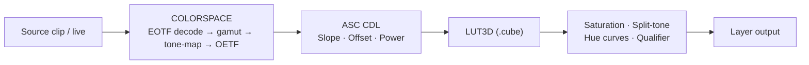
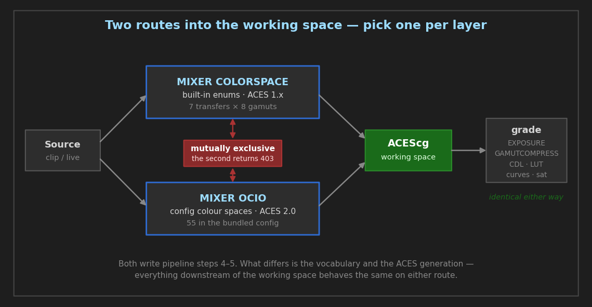
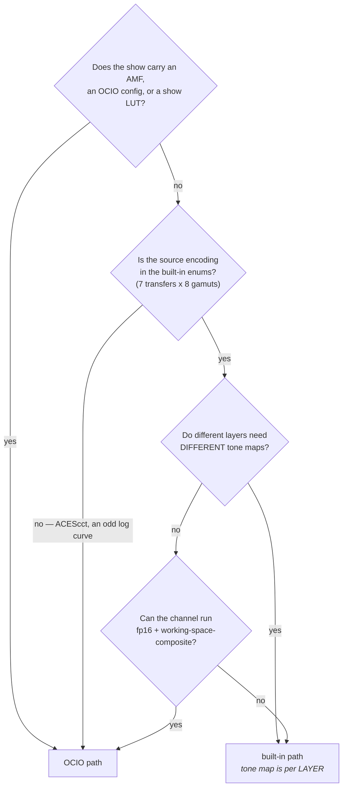

# Color Grading & Color Management

> **State and measurements:** [`../features/colour-grading-and-ocio.md`](../features/colour-grading-and-ocio.md)
> **Implementation notes:** [`../architecture/OCIO_INTEGRATION_STUDY.md`](../architecture/OCIO_INTEGRATION_STUDY.md)
> **This document is how-to.** Per [`../README.md`](../README.md), measured figures live once in `features/`; a tolerance an operator acts on may appear here, the measurements behind it should not.

GPU-accelerated ACES color management and professional color grading tools for CasparCG Server. All processing runs on the GPU in a single GLSL fragment shader pass, with zero CPU overhead per frame.

For virtual production features (360° projection, curved screen compensation, playback speed, flip), see [VIRTUAL_PRODUCTION_FEATURES.md](../guides/VIRTUAL_PRODUCTION_FEATURES.md). For HDR channel configuration, DeckLink/Vulkan HDR output, and file recording metadata, see [HDR_GUIDE.md](../guides/HDR_GUIDE.md). For blur, sharpening, and film grain details, see [IMAGE_EFFECTS.md](../guides/IMAGE_EFFECTS.md).

## Table of Contents

1. [ACES Color Management](#aces-color-management) — Color space conversion, HDR tone mapping, camera log handling
2. [OCIO Color Management](#ocio-color-management) — The other front end to the same stage: OpenColorIO input transforms and display rendering, and how it differs from the built-in ACES path
3. [ASC CDL](#asc-cdl) — Industry-standard Slope/Offset/Power color correction
4. [3D LUT](#3d-lut) — Load `.cube` look-up tables for creative looks
5. [Linear Saturation](#linear-saturation) — Scene-linear saturation control
6. [Split Toning](#split-toning) — Independent shadow/highlight color tinting
7. [Exposure](#exposure) — Linear gain in the working space, on any conversion path
8. [Gamut Compression](#gamut-compression) — ACES-style out-of-gamut recovery
9. [Hue Curves](#hue-curves) — Hue-vs-Hue, Hue-vs-Saturation, Hue-vs-Luminance, Sat-vs-Sat curves
10. [Secondary Qualifier](#secondary-qualifier) — HSL keyer with per-key corrections
11. [Sharpening](#sharpening) — Laplacian unsharp mask
12. [Film Grain](#film-grain) — Procedural photographic grain emulation
13. [Internal Pipeline](#internal-pipeline) — Full processing order, two color management paths
14. [Supported Standards](#supported-standards)
15. [Limitations & Best Practices](#limitations--best-practices)
16. [Common Workflows](#common-workflows)

---

## ACES Color Management



The color management pipeline converts between color spaces, applies HDR tone mapping, and handles camera log curves — all per-layer.

> **This is one of two paths.** [`MIXER OCIO`](#ocio-color-management) writes the same stage
> using OpenColorIO, is mutually exclusive with this command per layer, and is built on
> **ACES 2.0** where the operators below are ACES 1.x. The two are both correct and look
> different — see [the comparison](#the-two-paths-overlap-and-they-do-not-match) before
> choosing, and do not mix them across layers of one composite.

### AMCP Command

```bash
MIXER [channel]-[layer] COLORSPACE [input_transfer] [input_gamut] [tonemapping] [output_gamut] [output_transfer] [exposure]
MIXER [channel]-[layer] COLORSPACE NONE         # Disable
MIXER [channel]-[layer] COLORSPACE              # Query
```

### Parameters

| Parameter | Description | Options |
| :--- | :--- | :--- |
| **input_transfer** | EOTF of the source media | `LINEAR`, `SRGB`, `REC709`, `PQ`, `HLG`, `LOGC3`, `SLOG3` |
| **input_gamut** | Color primaries of the source | `BT709`, `BT2020`, `DCIP3`, `ACES_AP0`, `ACES_AP1`, `ACESCG`, `ARRI_WG3`, `SGAMUT3_CINE` |
| **tonemapping** | HDR compression algorithm | `NONE`, `REINHARD`, `ACES_FILMIC`, `ACES_RRT`, `ACES_RRT_709`, `ACES_RRT_P3`, `ACES_RRT_2020_PQ` |
| **output_gamut** | Target display primaries | Same as `input_gamut` |
| **output_transfer** | OETF for the display | `LINEAR`, `SRGB`, `REC709`, `PQ`, `HLG` |
| **exposure** | Linear exposure multiplier (default `1.0`) | Float (e.g. `2.0` = +1 stop) |

### Tone Mapping Operators

| Operator | Description |
| :--- | :--- |
| `NONE` | Hard clip at 1.0 — no compression |
| `REINHARD` | Simple global operator $x/(x+1)$. Preserves hue, desaturates highlights |
| `ACES_FILMIC` | Narkowicz approximation. High contrast "filmic" look, slight black crush |
| `ACES_RRT` | Stephen Hill's approximation of the ACES Reference Rendering Transform. Standard cinema look with desaturated highlights and smooth rolloff |
| `ACES_RRT_709` | Full ACES RRT + ODT for Rec.709/sRGB (100 nit) display. Uses segmented spline tonecurves from the official ACES specification. Overrides output gamut/transfer to BT.709/sRGB |
| `ACES_RRT_P3` | Full ACES RRT + ODT for DCI-P3 (D65, 48 nit) display. Overrides output gamut/transfer to P3 |
| `ACES_RRT_2020_PQ` | Full ACES RRT + ODT for Rec.2020 PQ (1000 nit) HDR display. Overrides output gamut/transfer to BT.2020/PQ |

> **Note:** The `ACES_RRT_709`, `ACES_RRT_P3`, and `ACES_RRT_2020_PQ` operators incorporate both RRT and ODT in a single pass. When using these, the `output_gamut` and `output_transfer` parameters are effectively overridden by the ODT's target space.

> **These are all ACES 1.x, and each accepts an `ACES1_` spelling** — `ACES1_RRT`,
> `ACES1_FILMIC`, `ACES1_RRT_709`, `ACES1_RRT_P3`, `ACES1_RRT_2020_PQ` — so a show file can
> record which generation it meant. The originals are unchanged and a query still returns
> them. There is no 2.0 operator here: `ACES2_RRT` is refused rather than quietly rendering
> 1.x. ACES 2.0 is on the [OCIO path](#ocio-color-management).

### Usage Examples

```bash
# ARRI LogC camera to HDTV
MIXER 1-10 COLORSPACE LOGC3 ARRI_WG3 ACES_RRT BT709 REC709

# HDR PQ to SDR
MIXER 1-10 COLORSPACE PQ BT2020 REINHARD BT709 SRGB

# Full ACES pipeline to Rec.709 display
MIXER 1-10 COLORSPACE LOGC3 ARRI_WG3 ACES_RRT_709 BT709 SRGB

# Full ACES pipeline to HDR display
MIXER 1-10 COLORSPACE LOGC3 ARRI_WG3 ACES_RRT_2020_PQ BT2020 PQ

# Exposure boost (+1 stop) before tone mapping
MIXER 1-10 COLORSPACE LOGC3 ARRI_WG3 ACES_RRT BT709 REC709 2.0

# Disable
MIXER 1-10 COLORSPACE NONE
```

---

## OCIO Color Management

The **other** front end to the same stage. `MIXER OCIO` puts a layer into the working space
using OpenColorIO instead of the built-in enums, and `OCIO_DISPLAY` applies the channel's
display rendering after the composite.

```bash
MIXER [channel]-[layer] OCIO "ARRI LogC3 (EI800)"   # source encoding → ACEScg
MIXER [channel]-[layer] OCIO NONE                   # back to the built-in path
OCIO_DISPLAY [channel] "<display>" "<view>"         # channel display rendering
```

Full command reference, config elements and refusal codes: **[`OCIO_USER_GUIDE.md`](../guides/OCIO_USER_GUIDE.md)**.
Design rationale: [`OCIO_INTEGRATION_STUDY.md`](../architecture/OCIO_INTEGRATION_STUDY.md).

> ⚠ **Quote the name.** 40 of the 55 colour spaces in the bundled config contain spaces or
> parentheses. Unquoted, `MIXER 1-1 OCIO ARRI LogC3 (EI800)` returns `404` having looked for
> a space called `ARRI` — and the 404 says nothing about quoting.

### The two paths overlap, and they do NOT match



Both write steps 4–5 of the [pipeline](#internal-pipeline), so **they are mutually exclusive
per layer** — setting one while the other is active returns `403 MIXER ERROR` rather than
silently overriding. Clear the other first.

The overlap is not just structural. Both can deliver "an ACES look", and they will not
produce the same picture:

| | `MIXER COLORSPACE` | `MIXER OCIO` + `OCIO_DISPLAY` |
| :--- | :--- | :--- |
| **ACES version** | **1.x.** `ACES_RRT` is Stephen Hill's *approximation*; `ACES_FILMIC` is Narkowicz's. `ACES_RRT_709/P3/2020_PQ` use real 1.x segmented splines | **2.0, exactly** — the pinned `studio-config-v4.0.0_aces-v2.0` is the reference implementation |
| **Source encodings** | 7 transfers × 8 gamuts, fixed enums (this document) | every colour space in the config — 55 in the bundled one |
| **Tone mapping** | 7 operators, chosen **per layer** | the channel's view, chosen **per channel** (`OCIO_DISPLAY`) — there is no per-layer tone map |
| **Where the look lives** | the AMCP command | the OCIO config file |
| **Discovery** | this document | `INFO OCIO COLORSPACES` / `INFO OCIO DISPLAYS` |
| **Prerequisites** | none | `<working-space-composite>` for `OCIO_DISPLAY` (plus `fp16` and `auto-color-convert`) |

**ACES 2.0 changed the rendering transform substantially.** So a layer through
`MIXER COLORSPACE … ACES_RRT_709` and a layer through OCIO with an ACES 2.0 SDR view are
both correctly "ACES" and will look visibly different. Choosing between them is a
look decision, not a technical one — but **mixing them across layers of one composite is
not**, and that is the trap:

```bash
# DON'T — two layers, two ACES generations, one composite
MIXER 1-1 COLORSPACE LOGC3 ARRI_WG3 ACES_RRT_709 BT709 REC709   # ACES 1.x
MIXER 1-2 OCIO "ARRI LogC3 (EI800)"                             # ACES 2.0 via the channel view
```

Pick one path per channel. If a facility has an OCIO config, use it for everything on that
channel; if not, the built-in path is cheaper and needs no config.

### Which path — the short version



Read as rules rather than a diagram:

| use | when |
| :--- | :--- |
| **OCIO** | the show has an AMF, an OCIO config or a show LUT; the source encoding is not one of the built-in enums; you want ACES **2.0**; or you need one look applied to the whole composite |
| **built-in** | a plain named transfer/gamut pair is all you need; the channel cannot run `fp16` + `<working-space-composite>`; or layers genuinely need **different** tone maps, which the OCIO path cannot express — its view is per channel |

**Three costs of the OCIO path, so the choice is informed rather than aspirational:**

* **It requires `<working-space-composite>` for anything channel-level** (`OCIO_DISPLAY`,
  `OCIO_LOOK`, and therefore `AMF`), which needs `fp16` and `auto-color-convert` — and it
  **changes how layers blend**, in scene-linear light rather than display-encoded values.
  Existing looks that relied on display-space blending will move. That is a deliberate
  decision, not a toggle to flip during a show.
* **Selecting a transform compiles a shader.** An ACES 2.0 display program is ~15 KB of
  GLSL. The server pre-warms on the command so it does not cost a frame, but the command
  itself is not instant.
* **The look lives in the config, not in the show file.** Reproducing a look on another
  machine means shipping the config, not just the AMCP commands.

### Where the newer commands fit

None of these is a third path — each one *addresses* the stages above:

| command | path | scope | what it is for |
| :--- | :--- | :--- | :--- |
| [`OCIO_LOOK`](OCIO_USER_GUIDE.md#53-ocio_look-channel--the-channels-lmt-show-look) | OCIO | channel | the show's LMT, applied to the whole composite before the view |
| [`AMF`](OCIO_USER_GUIDE.md#54-amf-channel-layer--configure-everything-from-a-shows-metadata) | OCIO | channel + layer | sets input, look and display at once from the show's own metadata |
| [`MIXER CDL_FILE`](#loading-a-grade-from-a-file) | **either** | layer | loads an ASC CDL grade from a `.cdl`/`.ccc`; it is a grading tool, so it works on both paths |

`MIXER CDL_FILE` is the one worth noting: it sits in the **shared** part of the chain, so a
grade from set applies whichever path the layer took.

### Using both at once — what is refused, and what is not

**On one layer they are mutually exclusive, and the server enforces it in both directions.**
Not by silently overriding, which would be the dangerous behaviour:

```bash
MIXER 1-1 COLORSPACE LOGC3 ARRI_WG3 ACES_RRT BT709 REC709
MIXER 1-1 OCIO "ARRI LogC3 (EI800)"
  -> 403 MIXER ERROR   "...is already using MIXER COLORSPACE. They are mutually
                        exclusive -- clear it with MIXER COLORSPACE NONE first."
```

and the same the other way round. The refusal names the command to clear, because the
failure is otherwise indistinguishable from "that colour space does not exist".

**Across scopes nothing is refused, and that is deliberate**, because the combinations are
legitimate:

| combination | refused? | why |
| :--- | :--- | :--- |
| `MIXER COLORSPACE` + `MIXER OCIO`, same layer | **yes, 403** | both write the same stage |
| `MIXER COLORSPACE` layer + `OCIO_DISPLAY` channel | no | different stages — the layer converts *in*, the channel renders *out* |
| `MIXER OCIO` layer + `MIXER COLORSPACE` on a **different** layer | no | per-layer state, and each layer's own exclusion still applies |
| `OCIO_LOOK` without `OCIO_DISPLAY` | **yes, 403** | the look is composed into the display processor; there is nothing to compose it into |
| `OCIO_DISPLAY` / `OCIO_LOOK` without `<working-space-composite>` | **yes, 403** | they consume working-space pixels and the composite is display-encoded |

> **Mixing generations across layers is still the trap**, and no refusal catches it — the
> `DON'T` example above is two *different* layers, so every command in it succeeds. The
> composite is what ends up wrong. Pick one path per channel.

**Measured 2026-08-16, both mixers byte-identical.** A `MIXER COLORSPACE` layer carrying a
**tone map** under an `OCIO_DISPLAY` channel is *coherent, not double-tone-mapped*: under
`<working-space-composite>` the layer's output half — tone map included — is suppressed, so
the channel applies the display encoding exactly once.

The layer's tone map simply **stops having any effect**, and that is what was measured. Three
channel configurations, each rendering the same patch with `tonemapping` at `NONE` and at
`ACES_RRT` and comparing the two frames the server produced:

| channel | tone map `NONE` vs `ACES_RRT` |
| :--- | ---: |
| plain (no working-space composite) | **62–71 LSB apart** |
| `<working-space-composite>` | **0.00** |
| `<working-space-composite>` + `OCIO_DISPLAY` | **0.00** |

The first row is the control, and it is what makes the other two mean anything: the tone-map
argument demonstrably reaches the shader and moves the picture by 62–71 LSB when the output
half runs. The second row is the finding — **the composite alone suppresses it, and the
display transform is not what does it.** Frame against frame from one server, so no colour
model enters the verdict. `cli.py ws-tonemap`.

So a per-layer tone map on such a channel is not undefined and not harmful; it is **inert**.
Leave `tonemapping` at `NONE` there anyway, because a setting that reads as configured and
does nothing is worth not having — but a show file that carries one renders correctly.

### What is shared regardless of which path a layer took

Everything from step 6 onward is the same code operating on the same working space, so the
grading tools behave identically either way:

| | on a `COLORSPACE` layer | on an `OCIO` layer |
| :--- | :--- | :--- |
| `MIXER EXPOSURE` | yes | yes — and it is the **only** exposure an OCIO layer can be given |
| `COLORSPACE`'s 6th argument (exposure) | yes | **no** — it lives in the COLORSPACE state, which is mutually exclusive |
| `MIXER GAMUTCOMPRESS` | yes | yes |
| CDL, LUT3D, saturation, white balance, LMG, curves, qualifier, grain | yes | yes |

Both also require the layer to have *reached* a working space at all — see
[Exposure](#exposure) and [Gamut Compression](#gamut-compression), which are inert on a layer
that took neither path and is still display-encoded.

---

## ASC CDL

Industry-standard ASC Color Decision List (Slope/Offset/Power) with per-channel control and global saturation. Operates in scene-linear space per the ASC CDL specification.

### AMCP Command

```bash
MIXER [channel]-[layer] CDL [sR] [sG] [sB] [oR] [oG] [oB] [pR] [pG] [pB] [saturation] [duration] [tween]
MIXER [channel]-[layer] CDL RESET               # Reset to identity
MIXER [channel]-[layer] CDL                      # Query

MIXER [channel]-[layer] CDL_FILE "<file>" ["<id>"] [duration] [tween]
```

### Loading a grade from a file

`CDL_FILE` reads an ASC CDL from a **`.cdl`, `.ccc` or `.cc`** file — the interchange
format grades actually arrive in from set and from post — and sets exactly the state the
numeric form sets. The grade runs in the same shader block; only the parsing is new.

```bash
MIXER 1-10 CDL_FILE "shot0010.cdl"              # a file holding one correction
MIXER 1-10 CDL_FILE "show.ccc" "shot0010"       # one correction from a collection, by id
```

The path is tried as given and then under `<media-path>`, the same resolution
`CALIBRATION LUT` uses. Values are clamped through the **same limits** as the numeric
command, so a file cannot reach a state `MIXER CDL` would refuse. A second argument that
parses as an integer is read as `duration`, not as an id.

> **An ambiguous file is refused, and OCIO alone would not refuse it.** A collection
> holding several corrections with no `id` given returns `404`, listing the ids it does
> have. OCIO's own `CreateFromFile(path, "")` silently returns the **first** correction —
> so a 200-shot `.ccc` would load shot 1's grade, correctly applied, with nothing anywhere
> to say so.

**Verified by equivalence, not by a model** (`cli.py cdl-file`, both mixers): each file
renders **byte-identically** — delta `0.00` — to `MIXER CDL` with the same numbers typed
out. A wrong parse cannot survive that, and no drift in the grading maths can cause a false
failure, because both sides drift together. The two `.ccc` ids are additionally required to
render ≥ 8 LSB apart (measured 80.0), or a parser that ignored the id would pass every case.

### Parameters

| Parameter | Description | Default |
| :--- | :--- | :--- |
| **sR sG sB** | Slope (gain) per channel | `1.0 1.0 1.0` |
| **oR oG oB** | Offset (lift) per channel | `0.0 0.0 0.0` |
| **pR pG pB** | Power (gamma) per channel | `1.0 1.0 1.0` |
| **saturation** | Global saturation (optional) | `1.0` |
| **duration** | Tween duration in frames (optional) | `0` |
| **tween** | Tween curve type (optional) | `linear` |

The formula applied per channel is: $\text{out} = \text{clamp}(\text{in} \times \text{slope} + \text{offset})^{\text{power}}$

### Usage Examples

```bash
# Warm the image: boost red gain, reduce blue
MIXER 1-10 CDL 1.2 1.0 0.85 0 0 0 1 1 1

# Print-film emulation with lifted blacks
MIXER 1-10 CDL 0.9 0.9 0.9 0.02 0.02 0.02 1.1 1.0 0.95 0.9

# Animated grade over 50 frames
MIXER 1-10 CDL 1.1 1.0 0.9 0 0 0 1 1 1 1.0 50 EASEINOUTQUAD

# Reset to neutral
MIXER 1-10 CDL RESET
```

---

## 3D LUT

Load industry-standard `.cube` 3D look-up tables for creative color transforms. Supports any cube size (commonly 17×17×17, 33×33×33, or 65×65×65). LUT data is uploaded as a `GL_TEXTURE_3D` with trilinear interpolation and cached until the LUT changes.

### AMCP Command

```bash
MIXER [channel]-[layer] LUT3D [path.cube] [strength]
MIXER [channel]-[layer] LUT3D NONE              # Remove LUT
MIXER [channel]-[layer] LUT3D                   # Query
```

### Parameters

| Parameter | Description | Default |
| :--- | :--- | :--- |
| **path** | Path to `.cube` file (absolute, or relative to media folder) | — |
| **strength** | Blend factor `0.0`–`1.0` (0 = bypass, 1 = full LUT) | `1.0` |

### Usage Examples

```bash
# Load a film emulation LUT
MIXER 1-10 LUT3D "luts/FilmLook.cube"

# Half-strength LUT for a subtler look
MIXER 1-10 LUT3D "luts/FilmLook.cube" 0.5

# Remove LUT
MIXER 1-10 LUT3D NONE
```

### File Format

Standard `.cube` format with `LUT_3D_SIZE` header and `R G B` triplets. The parser ignores `TITLE`, `DOMAIN_MIN`, `DOMAIN_MAX`, comments (`#`), and 1D LUT sections.

---

## Linear Saturation

Scene-linear saturation control using Rec.709 luminance weighting. Operates in the scene-linear working space before tone mapping, providing perceptually smooth results that avoid the clipping artifacts of display-referred saturation.

### AMCP Command

```bash
MIXER [channel]-[layer] LINEARSATURATION [value] [duration] [tween]
MIXER [channel]-[layer] LINEARSATURATION         # Query
```

### Parameters

| Parameter | Description | Default |
| :--- | :--- | :--- |
| **value** | Saturation multiplier (`0.0` = mono, `1.0` = unchanged, `>1.0` = boost) | `1.0` |
| **duration** | Tween duration in frames | `0` |
| **tween** | Tween curve type | `linear` |

### Usage Examples

```bash
# Desaturate to 50%
MIXER 1-10 LINEARSATURATION 0.5

# Boost saturation 20%
MIXER 1-10 LINEARSATURATION 1.2

# Animated desaturation over 2 seconds
MIXER 1-10 LINEARSATURATION 0.0 50 EASEINOUTQUAD
```

---

## Split Toning

Applies independent color tints to shadows and highlights. The balance parameter controls where the shadow/highlight crossover point sits in the luminance range.

### AMCP Command

```bash
MIXER [channel]-[layer] SPLITTONE [shR] [shG] [shB] [hiR] [hiG] [hiB] [balance] [duration] [tween]
MIXER [channel]-[layer] SPLITTONE RESET          # Reset to neutral
MIXER [channel]-[layer] SPLITTONE                # Query
```

### Parameters

| Parameter | Description | Default |
| :--- | :--- | :--- |
| **shR shG shB** | Shadow tint color (RGB, `0.0`–`1.0`) | `0 0 0` |
| **hiR hiG hiB** | Highlight tint color (RGB, `0.0`–`1.0`) | `0 0 0` |
| **balance** | Shadow/highlight crossover point (`0.0`–`1.0`) | `0.5` |
| **duration** | Tween duration in frames | `0` |
| **tween** | Tween curve type | `linear` |

### Usage Examples

```bash
# Cool shadows + warm highlights (classic "teal and orange")
MIXER 1-10 SPLITTONE 0.0 0.1 0.2 0.2 0.1 0.0

# Blue shadows only, balance shifted toward highlights
MIXER 1-10 SPLITTONE 0.0 0.0 0.15 0.0 0.0 0.0 0.3

# Reset
MIXER 1-10 SPLITTONE RESET
```

---

## Exposure

A linear gain applied in the **working space**, after the conversion into it and before the
rest of the grade.

### AMCP Command

```bash
MIXER [channel]-[layer] EXPOSURE [gain] [duration] [tween]
MIXER [channel]-[layer] EXPOSURE            # Query
```

`gain` is a linear multiplier, not stops: `2.0` is one stop up, `0.5` one stop down. It must
be finite and non-negative — a negative "gain" is a channel inversion with a sign error, and
the server refuses it rather than rendering it.

### Two exposures, and how they compose

`MIXER COLORSPACE`'s sixth argument is also an exposure. It lives inside the colour-grade
state and is therefore **unavailable on a layer using `MIXER OCIO`**, because the two
commands are mutually exclusive. `MIXER EXPOSURE` is separate: it applies on any route into
the working space, so it is the only exposure an OCIO layer can be given.

Where both are set they **multiply**. They are both scalars, so composition is the only
answer that is not arbitrary, and existing `MIXER COLORSPACE` behaviour is unchanged.

### The layer has to be in the working space

Like gamut compression below, exposure only runs on a layer that actually reached the
working space — `MIXER OCIO`, `MIXER COLORSPACE`, `<auto-color-convert>` or a
`<working-space-composite>` channel. On a layer with none of those the pixel is still
display-encoded, and a "linear" gain on it would not be a gain on light, so the command sets
its state and the shader does nothing.

> Both mixers apply exposure at the same point in the chain. They did not always: OpenGL
> applied it after the gamut matrix and Vulkan before. That never produced different output
> — a scalar commutes with a linear matrix — but it was believed to, and the belief was
> enough to keep this command from existing. Verified across exposures 0.5, 1.6 and 2.5:
> both mixers within 1 LSB of the same model.

---

## Gamut Compression

ACES-style gamut compression that maps out-of-gamut colors (negative channel values that arise from wide-to-narrow gamut conversions) back toward the achromatic axis. Prevents neon fringing on saturated colors when converting from wide gamuts like ARRI Wide Gamut or S-Gamut3 to BT.709.

### AMCP Command

```bash
MIXER [channel]-[layer] GAMUTCOMPRESS [enable] [cyan_limit] [magenta_limit] [yellow_limit]
MIXER [channel]-[layer] GAMUTCOMPRESS            # Query
```

### Parameters

| Parameter | Description | Default |
| :--- | :--- | :--- |
| **enable** | `1` = enable, `0` = disable | — |
| **cyan_limit** | Compression limit for cyan axis | `1.147` |
| **magenta_limit** | Compression limit for magenta axis | `1.264` |
| **yellow_limit** | Compression limit for yellow axis | `1.312` |

The default limits match the ACES 1.3 Gamut Compression reference values.

> **It shares the limits with ACES 1.3 RGC and not the algorithm.** Measured
> 2026-08-16 against OpenColorIO's own `ACES 1.3 Reference Gamut Compression` look
> (which *is* the reference implementation), over 4000 samples in ACES2065-1:
> **mean 0.030, max 0.350** in linear ACES units. Three distinct causes:
>
> | | this operator | ACES 1.3 RGC |
> | :--- | :--- | :--- |
> | limits | 1.147 / 1.264 / 1.312 | **same** |
> | thresholds | **0.815 for all three** | 0.815 / 0.803 / 0.880, per channel |
> | curve | `thr + n/(1+n)·(lim−thr)`, a simple rational | power form with `p = 1.2` |
> | all components negative | **returned unchanged** — `a = max(max(c),0)` is 0 and the `a <= 0` guard passes the pixel through | still compressed, by up to 0.336 |
>
> The curve is the dominant term, not the thresholds: the **red** channel shares
> threshold 0.815 with ACES and still differs by up to **0.350** on its own.
>
> This is not a defect — the operator never claimed conformance, and it is a fast
> GPU approximation with ACES-derived limits. It is recorded because "ACES 1.3" in
> the table below sits directly above "the pinned config is the reference
> implementation", which invites reading this row as conformance too. If you need
> the reference algorithm, use OCIO.

### Usage Examples

```bash
# Enable with default limits
MIXER 1-10 GAMUTCOMPRESS 1

# Custom limits for aggressive compression
MIXER 1-10 GAMUTCOMPRESS 1 1.1 1.2 1.3

# Disable
MIXER 1-10 GAMUTCOMPRESS 0
```

### The layer has to be in the working space

Compression operates on ACEScg, after the conversion into it, so it only runs on a layer
that actually reached the working space. Any route there will do:

* `MIXER OCIO <source space>`
* `MIXER COLORSPACE …`
* the channel's `<auto-color-convert>`, when the source and target differ
* a `<working-space-composite>` channel

On a layer with none of those the pixel is still display-encoded, and compressing there
would not be a gamut operation — so the command sets its state and the shader does nothing.
`MIXER GAMUTCOMPRESS` on such a layer is a no-op by design.

> Before 2026-08-13 the same silence applied to `MIXER OCIO` layers, which was a defect
> rather than a design: the compressor lived inside the block the OCIO splice replaces, so
> the command returned `202`, set its uniform, and never ran. It reaches OCIO layers now.
> Verified on both mixers by `cli.py ocio-gamut-compress` in the test harness.

### Under an ACES 2.0 display view, this becomes a look control

This compressor — an approximation sharing ACES 1.3's *limits* but not its algorithm, as
above — runs in the working space *before* the display rendering. An ACES 2.0 output
transform (`OCIO_DISPLAY` with an ACES 2.0 view) does its own gamut handling on the way to
the display, so the obvious question is whether the two compress the same saturation twice.

**Measured 2026-08-16, and the answer is neither.** Six saturated patches through
`MIXER OCIO "ARRI LogC3 (EI800)"`, comparing how much the picture moves when compression is
switched on — under a near-linear `Un-tone-mapped` view, then under
`ACES 2.0 - SDR 100 nits (Rec.709)`:

| patch | RGC alone | under ACES 2.0 | ratio |
| :--- | ---: | ---: | ---: |
| `#330D80` violet | 34.00 LSB | 40.00 LSB | 1.18 |
| `#404C80` blue | 32.00 | 36.00 | 1.12 |
| `#261A66` deep blue | 23.00 | 19.00 | 0.83 |
| `#803326` red | 36.00 | 19.00 | 0.53 |
| `#804C33` orange | 27.00 | 7.00 | 0.26 |
| `#4C4066` mauve | 26.00 | 5.00 | 0.19 |

They neither stack nor cancel — the interaction is **strongly hue-dependent**, from almost
fully absorbed on warm colours to slightly amplified on violets. Mean ratio 0.71.

Practically: on a layer heading for an ACES 2.0 view, treat `MIXER GAMUTCOMPRESS` as a
**creative control rather than a technical correction**. ACES 2.0 already handles most of
what the 1.3 compressor was there to fix, unevenly, so setting it "because the source is
wide gamut" changes the look by an amount that depends on the hue rather than fixing
anything. On the built-in path, and on OCIO layers with a linear or un-tone-mapped view, it
does the job it always did.

> **What this measurement does and does not say.** It compares how far the picture moves,
> which conflates "how much the compressor changed the working-space value" with "how much
> the display transform amplifies that change". So it establishes that compression still
> visibly matters under ACES 2.0 and that the amount is hue-dependent — not that the total
> compression is excessive. A claim about *that* needs an out-of-gamut oracle, which no
> battery here has.

---

## Tone Curves

A per-channel tone curve: up to 16 control points on `master`, `red`, `green` and `blue`, applied
as step 19 of the pipeline. Distinct from **Hue Curves** below, which key off hue rather than
input level.

### AMCP Command

```bash
MIXER [channel]-[layer] CURVES [ch] [x1] [y1] [x2] [y2] ...   # set one channel
MIXER [channel]-[layer] CURVES RESET                          # clear all four
MIXER [channel]-[layer] CURVES [ch]                           # query one channel
MIXER [channel]-[layer] CURVES                                # query all
```

### Parameters

| parameter | accepted | notes |
| :--- | :--- | :--- |
| `[ch]` | `MASTER`, `R`/`RED`, `G`/`GREEN`, `B`/`BLUE` | case-insensitive; **the long forms are aliases** and were undocumented until 2026-08-27 |
| `[x] [y]` pairs | **2 to 16 pairs** | fewer than 2, an odd count, or more than 16 returns `400 ERROR` |
| `x`, `y` | `0.0`-`1.0` | `x` must ascend |

A query returns the active points as `x y x y ...`, or `DISABLED` when no curve is set.

### Usage Examples

```bash
MIXER 1-1 CURVES MASTER 0.0 0.0 0.5 0.6 1.0 1.0      # lift the midtones
MIXER 1-1 CURVES BLUE 0.0 0.02 1.0 0.98              # cool the shadows, tame the highlights
MIXER 1-1 CURVES RESET
```

> **This command had no documented syntax until 2026-08-27** — it appeared only as one row in the
> pipeline table above, which is why the mechanical "every command appears in a doc" check passed
> on it. **A name in a table is not documentation**, and that is the limit of what such a check can
> see.

---

## Hue Curves

Four independent curve types for targeted hue, saturation, and luminance adjustments based on input hue or saturation. Each curve is a 256-entry LUT built from control points with linear interpolation. Multiple curve types can be active simultaneously — they are merged into a single texture.

### AMCP Command

```bash
MIXER [channel]-[layer] HUECURVE [type] [h1] [v1] [h2] [v2] ...
MIXER [channel]-[layer] HUECURVE RESET           # Clear all curves
MIXER [channel]-[layer] HUECURVE                 # Query
```

### Curve Types

| Type | Input Axis | Output Axis | Neutral Value |
| :--- | :--- | :--- | :--- |
| `HUE_HUE` | Hue position (0–1) | Hue offset (degrees, wrapped) | `0.0` |
| `HUE_SAT` | Hue position (0–1) | Saturation multiplier | `1.0` |
| `HUE_LUM` | Hue position (0–1) | Luminance offset | `0.0` |
| `SAT_SAT` | Saturation (0–1) | Saturation multiplier | `1.0` |

### Parameters

Control points are provided as `[hue_position] [value]` pairs. At least 2 control points are required. Hue positions are normalized `0.0`–`1.0` (where 0 = 0°, 0.5 = 180°, 1.0 = 360°).

### Usage Examples

```bash
# Desaturate greens (hue ≈ 0.33) while boosting blues (hue ≈ 0.66)
MIXER 1-10 HUECURVE HUE_SAT 0.0 1.0 0.33 0.3 0.5 1.0 0.66 1.5 1.0 1.0

# Shift red hues toward orange
MIXER 1-10 HUECURVE HUE_HUE 0.0 10.0 0.1 5.0 0.2 0.0 1.0 0.0

# Reduce saturation of already-desaturated pixels
MIXER 1-10 HUECURVE SAT_SAT 0.0 0.5 0.3 1.0 1.0 1.0

# Clear all curves
MIXER 1-10 HUECURVE RESET
```

> **Note:** Setting a new curve of a given type merges it with existing curves of other types. To replace a specific curve type, simply send it again — only that channel is overwritten.

---

## Secondary Qualifier

HSL-based secondary color qualifier that isolates a specific color range and applies targeted corrections (exposure, saturation, hue shift) only to the qualified pixels. Unqualified pixels are left untouched. The key mask uses soft edges for smooth transitions.

### AMCP Command

```bash
MIXER [channel]-[layer] QUALIFIER [target_hue] [hue_width] [min_sat] [max_sat] [min_lum] [max_lum] [softness] [exposure] [saturation] [hue_offset] [duration] [tween]
MIXER [channel]-[layer] QUALIFIER 0              # Disable
MIXER [channel]-[layer] QUALIFIER                # Query
```

### Parameters

| Parameter | Description | Range |
| :--- | :--- | :--- |
| **target_hue** | Centre hue to isolate (degrees) | `0.0`–`360.0` |
| **hue_width** | Width of the hue selection window (degrees) | `0.0`–`180.0` |
| **min_sat** | Minimum saturation threshold | `0.0`–`1.0` |
| **max_sat** | Maximum saturation threshold | `0.0`–`1.0` |
| **min_lum** | Minimum luminance threshold | `0.0`–`1.0` |
| **max_lum** | Maximum luminance threshold | `0.0`–`1.0` |
| **softness** | Soft edge width for key transitions | `0.0`–`1.0` |
| **exposure** | Exposure offset for qualified pixels | Float (e.g. `0.5` = +½ stop) |
| **saturation** | Saturation offset for qualified pixels | Float (e.g. `-0.3` = desaturate) |
| **hue_offset** | Hue rotation for qualified pixels (degrees) | Float |
| **duration** | Tween duration in frames (optional) | Integer |
| **tween** | Tween curve type (optional) | `linear` |

### Usage Examples

```bash
# Isolate blue sky (hue ≈ 210°) and boost saturation
MIXER 1-10 QUALIFIER 210 30 0.2 1.0 0.3 1.0 0.1 0.0 0.3 0.0

# Isolate skin tones (hue ≈ 30°) and reduce saturation
MIXER 1-10 QUALIFIER 30 20 0.15 0.8 0.2 0.9 0.15 0.0 -0.2 0.0

# Shift green foliage toward teal
MIXER 1-10 QUALIFIER 120 40 0.1 1.0 0.1 0.8 0.1 0.0 0.0 -30.0

# Disable qualifier
MIXER 1-10 QUALIFIER 0
```

---

## Sharpening

3×3 Laplacian-based unsharp mask applied directly after texture sampling, before any color grading. Works on all layer types including 360° and curved screen projections.

### AMCP Command

```bash
MIXER [channel]-[layer] SHARPEN [amount] [radius] [duration] [tween]
MIXER [channel]-[layer] SHARPEN                  # Query
```

### Parameters

| Parameter | Description | Default |
| :--- | :--- | :--- |
| **amount** | Sharpening strength (`0.0` = off, `1.0` = standard, `>1.0` = aggressive) | `0.0` |
| **radius** | Kernel radius multiplier (controls the sampling spread in pixels) | `1.0` |
| **duration** | Tween duration in frames | `0` |
| **tween** | Tween curve type | `linear` |

### Usage Examples

```bash
# Standard sharpening
MIXER 1-10 SHARPEN 0.5

# Aggressive sharpening with wider radius
MIXER 1-10 SHARPEN 1.5 2.0

# Disable sharpening
MIXER 1-10 SHARPEN 0

# Animated sharpen reveal
MIXER 1-10 SHARPEN 1.0 1.0 25 EASEINOUTQUAD
```

---

## Film Grain

Procedural photographic grain emulation applied in display-referred space (after the OETF encoding). Uses a hash-based noise function with photographic response — grain is more visible in midtones and less visible in deep shadows and bright highlights, matching the behavior of real film stock.

### AMCP Command

```bash
MIXER [channel]-[layer] GRAIN [intensity] [size] [duration] [tween]
MIXER [channel]-[layer] GRAIN                    # Query
```

### Parameters

| Parameter | Description | Default |
| :--- | :--- | :--- |
| **intensity** | Grain visibility (`0.0` = off, `0.05` = subtle, `0.15` = heavy) | `0.0` |
| **size** | Grain particle size multiplier (`1.0` = pixel-level, `2.0` = coarser) | `1.0` |
| **duration** | Tween duration in frames | `0` |
| **tween** | Tween curve type | `linear` |

### Usage Examples

```bash
# Subtle film grain
MIXER 1-10 GRAIN 0.04

# Heavy grain with larger particles (16mm look)
MIXER 1-10 GRAIN 0.12 2.0

# Disable grain
MIXER 1-10 GRAIN 0

# Fade grain in over 50 frames
MIXER 1-10 GRAIN 0.08 1.0 50 LINEAR
```

---

## Internal Pipeline

All color grading runs on the GPU in a single fragment shader pass. The processing order from texture fetch to fragment output is:

| Step | Operation | Controlled By |
| :--- | :--- | :--- |
| 1 | **Texture Fetch** | UV coordinates (projection, curve warp, flip) |
| 2 | **Sharpening** | `MIXER SHARPEN` |
| 3 | **Alpha domain** | Automatic, from the source's own declaration — decoded media is straight, HTML/CEF is premultiplied, `PREMULTIPLIED` overrides. Premultiply if the source is straight (default), or *un*premultiply if the source is premultiplied and `<straight-alpha-grading>` is on |
| 4 | **EOTF** (decode to linear) | `MIXER COLORSPACE` or auto-color-convert |
| 5 | **Input Gamut → Working Space** | `MIXER COLORSPACE`, auto-color-convert, or **`MIXER OCIO`**, whose generated transform *replaces* steps 4–5 rather than following them |
| 6 | **Exposure** | `MIXER EXPOSURE` × `MIXER COLORSPACE` exposure / auto luminance scaling |
| 7 | **Gamut Compression** | `MIXER GAMUTCOMPRESS` |
| 8 | **ASC CDL** | `MIXER CDL` |
| 9 | **3D LUT** | `MIXER LUT3D` |
| 10 | **Linear Saturation** | `MIXER LINEARSATURATION` |
| 11 | **White Balance** | `MIXER WHITEBALANCE` |
| 12 | **Lift / Midtone / Gain** | `MIXER LIFT`, `MIXER MIDTONE`, `MIXER GAIN` |
| 13 | **Split Toning** | `MIXER SPLITTONE` |
| 14 | **Secondary Qualifier** | `MIXER QUALIFIER` |
| 15 | **Hue Shift** | `MIXER HUESHIFT` |
| 16 | **Hue Curves** | `MIXER HUECURVE` |
| 17 | **Tonal Balance** | `MIXER TONEBALANCE` |
| 18 | **RGB Levels** | `MIXER RGBLEVELS` |
| 19 | **Tone Curves** | `MIXER CURVES` |
| 20 | **Legacy Levels / CSB** | `MIXER LEVELS`, `MIXER BRIGHTNESS`, `MIXER SATURATION`, `MIXER CONTRAST` |
| 21 | **Invert** | `MIXER INVERT` |
| 22 | **Shape Overlay** | `MIXER SHAPE` |
| 23 | **Opacity** | `MIXER OPACITY` |
| 23b | **Re-premultiply** | Automatic, only with `<straight-alpha-grading>` on — after opacity and both keys, immediately before the blend |
| 24 | **Keying** | `MIXER KEYER` |
| 25 | **Blend Mode** | `MIXER BLEND` |
| 26 | **Chroma Key** | `MIXER CHROMA` |
| 27 | **Tone Mapping** | `MIXER COLORSPACE` tonemapping / auto (ACES RRT for HDR→SDR) |
| 28 | **Working Space → Output Gamut** | `MIXER COLORSPACE` or auto-color-convert (see below). **Moves to step 31 under `<working-space-composite>`** |
| 29 | **OETF** (encode for display) | `MIXER COLORSPACE` or auto-color-convert. **Moves to step 31 under `<working-space-composite>`** |
| 30 | **Film Grain** | `MIXER GRAIN` |
| 31 | **Post-composite output conversion** | Automatic, only with `<working-space-composite>` — steps 27–29 applied once to the composite instead of per layer, ahead of the LED calibration LUT |

### The blend domain — `<working-space-composite>`

Steps 4–7 and 27–29 run **per layer**, and the output half runs *before* the blend, on
purpose — so that both foreground and background reach the blend in the same display
encoding and blend modes operate on 0–1 display values.

```xml
<channel>
    <render-format>fp16</render-format>
    <auto-color-convert>true</auto-color-convert>
    <working-space-composite>true</working-space-composite>
</channel>
```

With it on, every layer converts **into** scene-linear ACEScg and none of them out of it;
the channel applies the display encoding **once**, to the composite, immediately before the
LED calibration LUT. Layers then blend in light rather than in display values.

**Both preconditions are refused rather than warned about.** fp16 because ACEScg carries
values above 1.0 and below 0 that a unorm target would clamp away; `auto-color-convert`
because every layer needs a defined route into the working space, and without one a layer
would reach an ACEScg composite still display-encoded with nothing downstream able to tell.

**Default off, because it changes every composite of two or more layers.** Measured: a 50%
mix of black and white reads **128** blending in display space and **191** blending in
light. `CasparCG-TestRunner/cli.py blend-domain` is the measurement, and it reports which
domain a channel is actually in.

Three consequences worth knowing before turning it on:

* **`MIXER COLORSPACE`'s output half is overridden.** The channel owns the output encoding
  now, so a layer cannot ask for a different one. Its input half still applies.
* **The `k_direct` / `k_direct_cg` shortcuts do not run.** They leave the pixel in the
  output gamut, and the composite has to be in AP1 — so every layer takes the ACEScg route.
* **A single layer is unaffected.** One layer over black is the same pixel either way,
  which is why `conformance` and `grading` cannot see this option at all.

It is also the prerequisite for a channel-level OCIO display transform and for per-consumer
views: a display transform is not invertible, so a composite that is already display-encoded
cannot be re-encoded for a second view.

### Per-consumer views

The channel's view (`OCIO_DISPLAY`) is a default. Any consumer may override it, and the
mixer renders one extra post-composite pass **per distinct view** over the same
working-space composite — so one channel can feed an LED processor and an SDI monitor
different looks without compositing twice. Consumers do no GPU work of their own.

```xml
<consumers>
    <decklink>
        <device>1</device>
        <ocio-display>Gamma 2.2 Rec.709 - Display</ocio-display>
        <ocio-view>ACES 2.0 - SDR 100 nits (Rec.709)</ocio-view>
    </decklink>
    <screen>
        <ocio-display>Gamma 2.2 Rec.709 - Display</ocio-display>
        <ocio-view>Un-tone-mapped</ocio-view>
    </screen>
</consumers>
```

Both elements or neither — a display without a view is not a transform, and accepting one
silently would render the channel's view while looking configured. The IMAGE consumer takes
its view as `ADD` parameters instead, because it is transient:
`ADD 1 IMAGE <name> "<display>" "<view>"`.

Carried by `decklink`, `screen` and `image` today. Any other consumer gains one by
implementing `frame_consumer::ocio_view()` and parsing the two elements in its factory.

**Requires `<working-space-composite>`.** Without it the composite is already
display-encoded and there is nothing to fan out from; a consumer that asked for a view then
gets the channel's frame, which is the honest fallback rather than a second encoding.

Measured on both mixers with `CasparCG-TestRunner/cli.py consumer-view --consumer
{image,screen,decklink}`: 4/4 patches routed in every case, the two views 28–50 LSB apart.

### Which domain the source arrives in — `STRAIGHT` / `PREMULTIPLIED`

Step 3 acts on the source's *declaration*, and until 2026-08-20 no video producer made one.
`pixel_format_desc::is_straight_alpha` defaults to `false` — "already premultiplied" — and
nothing set it, so the premultiply never ran and `blend()`, which requires premultiplied
input, was handed straight RGB.

What that looked like, measured on both mixers with a 1080p clip carrying alpha strips at
255/192/128/64/0 over an opaque background:

| | |
| :--- | :--- |
| composite matched `c + bg*(1-a)` | **100.0%** of 1 152 000 partial-alpha pixels (mean 0.03) |
| the correct `c*a + bg*(1-a)` | 43.05 away |
| a **fully transparent** region | rendered `[101,101,255]` over a `[0,0,191]` background — visible, and *added* to what was behind it |

After the fix the same measurement selects the correct model on 100.0% of those pixels
(mean 0.23, max 0.5), and alpha 0 renders as the background alone.

**Opaque content is bit-identical either way** — `col.rgb *= 1.0` — which is why this
survived for years and why HTML was never affected: CEF hands over genuinely premultiplied
BGRA, so `false` was the truth there and still is.

Decoded media is **straight** by default, because that is what the formats store and there
is no signal in the container to detect it from. Stills already declared straight; video,
ProRes, HAP and NotchLC now do too. Where content really is premultiplied — some Adobe
ProRes 4444 exports are — declare it:

```
PLAY 1-1 "clip"                  straight (default)
PLAY 1-1 "clip" PREMULTIPLIED    the RGB already carries its alpha
PLAY 1-1 "clip" STRAIGHT         explicit
```

`PREMULTIPLIED` reproduces the pre-2026-08-20 rendering exactly — measured, the old model
at 100.0% / mean 0.03 — so it is also the escape hatch for content authored against it.

#### Some files now say it themselves (FFmpeg 8)

The paragraph above says there is "no signal in the container to detect it from". That was
true of FFmpeg 7 and is no longer true of every format. FFmpeg 8 added `AVFrame.alpha_mode`
and `AVCodecParameters.alpha_mode`, so the ffmpeg producer asks the decoder before falling
back to the convention. The precedence, from 2026-08-21:

| | |
| :--- | :--- |
| 1. the operator | `PREMULTIPLIED` / `STRAIGHT`. Still on top, because the override exists for content whose *file* is wrong, and because it is the escape hatch above |
| 2. the file | `AVFrame.alpha_mode`, read from the frame leaving the filter graph so a graph that legitimately premultiplies is believed over the decoder |
| 3. the convention | decoded media is straight |

**Which formats actually declare it, in FFmpeg 8.1:** `png` (straight), `exr`
(premultiplied, unconditionally), `libjxl` and the JPEG XL parser (either, from the
`alpha_associated` flag), and Matroska where the track is tagged. **ProRes and QuickTime
Animation declare nothing**, and between them they are most of the alpha content this fork
sees — so for the common case nothing changes and the convention still decides.

That is worth stating plainly: **this adoption does not move a pixel today.** Every format
that declares and is reachable through the ffmpeg producer declares *straight*, which is
what the convention already assumed. It replaces a guess with a signal, and the value is in
the case that has not arrived yet rather than in a measurement.

**One thing it surfaced, not yet acted on.** FFmpeg's EXR decoder sets
`AVALPHA_MODE_PREMULTIPLIED` unconditionally (`libavcodec/exr.c`), while `.exr` in this tree
is loaded by the **image** module — which hardcodes straight for every format it reads
(`image_producer.cpp`, the literal `true` argument to `make_frame`). If the OpenEXR
convention really is associated/premultiplied alpha, every EXR with soft edges is being
premultiplied a second time here. FFmpeg agreeing is corroboration, not authority: this
needs the ASWF/OpenEXR specification and a partial-alpha EXR fixture before anything is
changed, since it would move rendered output for an existing configuration.

### The alpha domain — `<straight-alpha-grading>`

Everything between steps 3 and 23b operates on **premultiplied** RGB by default. That is
what the mixer has always done, and it is measurably wrong for partially transparent pixels:
a colour transform describes the *surface colour*, and `C(a·c) ≠ a·C(c)` for any non-linear
`C`. OCIO documents the opposite order — unpremultiply, transform, re-premultiply — and OIIO
exposes `unpremult` on `colorconvert` for exactly this.

```xml
<channel>
    <straight-alpha-grading>true</straight-alpha-grading>
</channel>
```

With it on, the chain runs on straight RGB throughout and the coverage is reapplied once at
step 23b, after opacity and both key multiplies and immediately before the blend.

**Default off, because it changes rendered output** wherever content has soft edges *and* a
non-linear transform is configured — which describes most lower thirds. Opaque content is
bit-identical either way, which is why no flat-patch battery could see the difference until
one drove partial alpha: at alpha 1.0 the two domains are algebraically identical.

Measured on both mixers, 2026-08-12 — `CasparCG-TestRunner/docs/alpha_domain_2026-08-12.md`
and `cli.py alpha-domain`. The sharpest case: `MIXER COLORSPACE PQ BT2020 NONE BT709 REC709`
on a 50%-alpha patch renders **243.8** in the premultiplied domain against **128.0** in the
straight one.

It also fixes a smaller defect that only shows with the flag on: `MIXER OPACITY` and both
key multiplies scale alpha alone while the default path's RGB still carries the old alpha,
so the two disagree by the time they reach the blend.

> **Design note:** Grading operations (steps 8–21) run in scene-linear space, after the EOTF decode and gamut conversion but before tone mapping and output encoding. This ensures perceptually correct, display-independent results. Sharpening runs on raw texture samples (step 2) to avoid sharpening color grading artifacts. Film grain is applied last (step 30) in display-referred space so it has the correct photographic response.

### Two Color Management Paths

The EOTF/gamut/OETF wrapper (steps 4–7 and 27–29) can be activated in two ways. They are **mutually exclusive** — if `MIXER COLORSPACE` is active, it takes priority:

| | **MIXER COLORSPACE** (manual) | **auto-color-convert** (automatic) |
| :--- | :--- | :--- |
| **Activated by** | `MIXER COLORSPACE` command (sets `color_grade.enable`) | `<auto-color-convert>true</auto-color-convert>` in channel config (default) |
| **Working space** | ACEScg (ACES AP1, D60 white point) | Target channel gamut (BT.709 or BT.2020, D65) |
| **Gamut matrices** | Input → ACEScg → Output (via chromatic adaptation) | Direct standard matrices (ITU-R BT.2087, no intermediate) |
| **Gamut accuracy** | Optimized for perceptual grading quality | Norm-correct to ITU standard (< 1 LSB deviation) |
| **Tone mapping** | User-selected operator | Automatic ACES RRT for HDR→SDR; none otherwise |
| **When to use** | Camera log workflows, creative grading, explicit control | Mixed SDR/HDR playout without manual setup |

**Key points:**

- **Grading tools work with both paths.** All color grading tools (CDL, LMG, white balance, hue shift, curves, levels, saturation, qualifier, etc.) have independent flags and operate between the EOTF and OETF regardless of which path activated the color conversion. When `auto-color-convert` provides the linearization, grading tools operate in the target channel's linear space.
- **MIXER COLORSPACE overrides auto.** When you send a `MIXER COLORSPACE` command on a layer, that layer switches from the auto path to the manual ACEScg path. The auto path is skipped entirely for that layer.
- **Auto handles luminance scaling.** The auto path automatically adjusts exposure for cross-transfer conversions: SDR→HLG (×0.1, mapping 100-nit reference white to HLG scene level), HLG→PQ (×10.0), and PQ→HLG (÷10.0 in shader).

---

## Supported Standards

### Transfer Functions (EOTF / OETF)

| Name | Standard | Notes |
| :--- | :--- | :--- |
| `LINEAR` | — | No curve applied |
| `SRGB` | IEC 61966-2-1 | Standard web/monitor gamma |
| `REC709` | ITU-R BT.709 | HDTV standard gamma |
| `PQ` | SMPTE ST.2084 | HDR10 / Dolby Vision |
| `HLG` | ARIB STD-B67 | Broadcast HDR |
| `LOGC3` | ARRI Alexa LogC3 | Input only |
| `SLOG3` | Sony S-Log3 | Input only |

### Color Gamuts

| Name | Standard | Notes |
| :--- | :--- | :--- |
| `BT709` | ITU-R BT.709 | Standard HDTV / sRGB primaries |
| `BT2020` | ITU-R BT.2020 | UHDTV / HDR |
| `DCIP3` | DCI-P3 | Digital Cinema (D65 white point) |
| `ACES_AP0` | SMPTE ST.2065-1 | ACES archival (encompasses all visible colors) |
| `ACES_AP1` / `ACESCG` | Academy S-2014-004 | ACEScg working space |
| `ARRI_WG3` | ARRI Wide Gamut 3 | ARRI camera native |
| `SGAMUT3_CINE` | Sony S-Gamut3.Cine | Sony camera native |

### On the OCIO path, this vocabulary does not apply

The two tables above are the **built-in path's** enums, fixed at compile time. `MIXER OCIO`
takes colour space names from the loaded config instead — 55 in the bundled
`studio-config-v4.0.0_aces-v2.0_ocio-v2.5`, more or fewer in a facility's own — and they are
strings, not enums. Ask the server rather than reading a table:

```bash
INFO OCIO COLORSPACES     # every colour space name in the loaded config
INFO OCIO DISPLAYS        # every display, with its views
```

### ACES version

| | version | what that means |
| :--- | :--- | :--- |
| Built-in tone mapping | **ACES 1.x** | `ACES_RRT` and `ACES_FILMIC` are published *approximations*; `ACES_RRT_709/P3/2020_PQ` use real 1.x segmented splines |
| Gamut compression | **ACES 1.3 limits only** | an approximation sharing the limits, *not* the algorithm — different thresholds, a different curve, and all-negative pixels passed through. Measured at mean 0.030 / max 0.350 against OCIO's reference look; see [Gamut Compression](#gamut-compression) |
| OCIO path | **ACES 2.0** | the pinned config is the reference implementation |

ACES 2.0 changed the rendering transform substantially, so the built-in operators and an
ACES 2.0 OCIO view are not interchangeable. See
[the comparison](#the-two-paths-overlap-and-they-do-not-match).

---

## Limitations & Best Practices

### Single-Pass Precision (No Inter-Stage Quantization)

All 30 color grading operations execute within **a single GPU fragment shader invocation**, using native 32-bit floating-point arithmetic throughout. Intermediate values between operations (EOTF decode → gamut map → CDL → LUT → tone map → OETF encode, etc.) remain in GPU float registers and are **never written to an intermediate framebuffer** between steps.

This eliminates the precision loss inherent in multi-pass architectures where each effect renders to a separate texture — every round-trip to an 8-bit FBO quantizes the signal to 256 levels, causing cumulative banding and color shifts when stacking multiple grading operations. With the single-pass design, quantization occurs only once: at the final fragment output into the 16-bit render attachment.

| | **Single-pass (current)** | **Multi-pass (legacy approach)** |
| :--- | :--- | :--- |
| **Intermediate precision** | 32-bit float (23-bit mantissa, ~7 decimal digits) | 8-bit integer (256 levels) per pass |
| **Quantization events** | 1× (final output) | N× (once per shader pass) |
| **Cumulative error** | None | ~0.4% per pass, compounds with stacking |
| **Banding risk** | Negligible | Visible after 3+ stacked operations |

### 16-bit Integer Storage

CasparCG uses normalized integer textures (0–65535 mapped to 0.0–1.0) for framebuffer storage. It does **not** use floating-point textures (EXR/half-float) for render targets.

- **Impact**: Inputs strictly clip at 1.0 (paper white). Super-white and negative values in the source are lost.
- **Workaround**: Do **not** use Linear EXR or scRGB sources where data exceeds 1.0.
- **Recommended**: Use **Log-encoded** (LogC3, S-Log3) or **PQ/HLG** sources. These formats compress highlight data to fit within the 0.0–1.0 signal range, allowing the tone mapper to work effectively.

> **Note:** The 16-bit integer limit applies only to the final stored output. All grading math runs at full 32-bit float precision inside the shader — there is no loss of information between grading operations regardless of the storage format.

### Alpha Channel

All color grading operations affect RGB channels only. The alpha channel is passed through untouched.

### Grading Order

The pipeline order is fixed. To achieve a specific look, consider which operations interact:

- **CDL** is early in the chain — it affects everything downstream including LUT and split tone.
- **3D LUT** is applied after CDL but before saturation and white balance — use it for creative looks, not technical transforms (use `COLORSPACE` or [`MIXER OCIO`](#ocio-color-management) for those; a technical LUT belongs in an OCIO config, where it is named and versioned, rather than loaded per layer).
- **Qualifier** corrections are applied in-place without disrupting the rest of the grading chain.
- **Film Grain** is the very last operation — it is never affected by color grading.

---

## Common Workflows

### 1. ARRI LogC Camera to HDTV

Standard "Alexa to Rec.709" workflow:
```bash
MIXER 1-10 COLORSPACE LOGC3 ARRI_WG3 ACES_RRT BT709 REC709
```

### 2. Full ACES Pipeline to Rec.709 Display

Using the reference ACES RRT+ODT instead of the Hill approximation:
```bash
MIXER 1-10 COLORSPACE LOGC3 ARRI_WG3 ACES_RRT_709 BT709 SRGB
```

### 3. Full ACES Pipeline to HDR Display

For LED walls or HDR monitors running PQ:
```bash
MIXER 1-10 COLORSPACE LOGC3 ARRI_WG3 ACES_RRT_2020_PQ BT2020 PQ
```

### 4. HDR (PQ) to SDR Down-mapping

Convert HDR content for standard monitors:
```bash
MIXER 1-10 COLORSPACE PQ BT2020 REINHARD BT709 SRGB
```

### 5. Log Footage Exposure Fix

Boost underexposed Log footage by 1 stop ($2.0\times$) before tone mapping:
```bash
MIXER 1-10 COLORSPACE LOGC3 ARRI_WG3 ACES_RRT BT709 REC709 2.0
```

### 6. Color Pass-through

Non-destructive test to ensure the pipeline is active but neutral:
```bash
MIXER 1-10 COLORSPACE SRGB BT709 NONE BT709 SRGB
```

### 7. Creative Grade Stack

Combine multiple grading tools for a complete look:
```bash
# Set up color pipeline
MIXER 1-10 COLORSPACE LOGC3 ARRI_WG3 ACES_RRT BT709 REC709

# Apply a film LUT at 60% strength
MIXER 1-10 LUT3D "luts/Kodak2383.cube" 0.6

# Warm CDL grade
MIXER 1-10 CDL 1.1 1.0 0.9 0.01 0.0 -0.01 1.0 1.0 1.05

# Teal shadows / warm highlights
MIXER 1-10 SPLITTONE 0.0 0.08 0.12 0.12 0.06 0.0

# Add subtle grain
MIXER 1-10 GRAIN 0.04
```

### 8. Sky Enhancement with Qualifier

Isolate and boost the blue sky without affecting other colors:
```bash
MIXER 1-10 QUALIFIER 210 30 0.2 1.0 0.3 1.0 0.1 0.2 0.3 0.0
```

---

## MIXER GRADE_NODE — windowed grading nodes (prototype)

**Undocumented until 2026-08-27**, and the only fork grading command that was in no document at
all — while `../plans/GRADING_NODE_GRAPH_STUDY.md` still described it as unimplemented. It ships,
on **both mixers**.

> **Renamed from `MIXER GRADE` on 2026-08-27.** The old name sat among `MIXER LIFT`, `GAIN`,
> `MIDTONE`, `CDL` and `WHITEBALANCE`, so it read as *the* grading command when it is one
> prototype feature among twenty-odd operators. `GRADE_NODE` matches the fork's underscore
> convention (`CDL_FILE`, `PROJECTION_BLEND_MASK`, `ZOOM_LUT`) and the code's own vocabulary
> (`grade_node`, `apply_grade_node`). **No alias was kept** — an alias would preserve exactly the
> ambiguity the rename removes. It was safe to do now because the feature is a prototype whose
> only consumer was one battery.

A chain of up to **16 nodes** (index 0-15). Each node is a soft-edged **ellipse in frame space**
with one operation, **exposure** — deliberately the narrowest surface that exercises the node pass
and the variable-length data model end to end.

```
MIXER 1-1 GRADE_NODE NODE <n> <cx> <cy> <rx> <ry> <feather> <exposure> [<invert>]
MIXER 1-1 GRADE_NODE NODE <n> CDL <sR sG sB> <oR oG oB> <pR pG pB> <sat>
MIXER 1-1 GRADE_NODE CLEAR                     drop the whole chain
MIXER 1-1 GRADE_NODE                           query
```

| parameter | meaning |
| :--- | :--- |
| `n` | node index, 0-15 |
| `cx` `cy` | window centre, frame space |
| `rx` `ry` | ellipse radii |
| `feather` | edge softness |
| `exposure` | the node's operation, a uniform scale |
| `invert` | optional, `1` grades everything *outside* the window |

### The per-node CDL

Each node also carries an **ASC CDL** — the published standard, the same operation as `MIXER CDL`
but confined to the node's window and applied after its exposure:

```
MIXER 1-1 GRADE_NODE NODE 0 0.5 0.5 0.25 0.18 0.4 1.0
MIXER 1-1 GRADE_NODE NODE 0 CDL  1.2 0.9 0.6   0.05 -0.02 0.10   0.9 1.1 1.3   0.8
```

Slope ×3, offset ×3, power ×3, then saturation — `pow(max(c·slope + offset, 0), power)`, then a
mix toward luma by `sat`. Ranges follow the primary CDL's: slope 0–10, offset ±1, power 0.01–10,
saturation 0–10.

**The two forms address different halves of a node.** Setting the window does not disturb a CDL
already on that node, and setting a CDL does not move the window — so nudging a window mid-grade
does not throw the grade away.

**It is a separate sub-form rather than more positional numbers** because a node already takes
seven for its window; nineteen in a row is a command nobody can check.

Brighten a soft oval in the centre by one stop, then darken outside it:

```
MIXER 1-1 GRADE_NODE NODE 0 0.5 0.5 0.25 0.18 0.4 1.0
MIXER 1-1 GRADE_NODE NODE 1 0.5 0.5 0.25 0.18 0.4 -0.5 1
```

The query returns one line per node — `index enable cx cy rx ry feather exposure invert` — or
`DISABLED` when no chain is set.

**No `DURATION`/tween, and that is deliberate.** Tweening would have to address
`node[n].window.field`, which the tween system cannot express. Named as an open question in the
study rather than half-built.

**Safe with blend modes and keys — measured, not assumed.** The mixers used to warn that routing a
node-enabled item through a private attachment changed how it met the composite. It does not, and
`../plans/GRADING_NODE_GRAPH_STUDY.md` §11 records why: a non-normal blend mode is a **layer**
property, applied after the layer's items composite, against the real target; `keyer additive`
belongs to the mix branch, which a node graph cannot reach; and the keys only scale the item's
alpha. Measured at **0.00 LSB on both mixers** and now guarded by a regression check.

The real limits are the ordinary ones: one window shape, one operation, frame space only.

**Coverage:** the `grade-window` battery, which is spatial by construction rather than a flat-patch
check — a flat patch is invariant under any mask covering it, so a single-patch battery could not
tell a correct window from no window at all. It samples inside and outside and asserts the
*relationship*: `inside ≈ outside × exposure`, `outside ≈ base` (the window does not leak), plus a
separation control and a restore-after-`CLEAR` check.

**Verified on both mixers, gated at 1 LSB** — the operator-relevant fact is the tolerance: every
operation, the two-node chain, `invert`, the per-node CDL and the composite all sit **inside 1 LSB**,
and the two backends return identical figures.

The measured numbers live once, in
[`../features/colour-grading-and-ocio.md`](../features/colour-grading-and-ocio.md) §2 — a figure in
two documents goes stale in one, which is the rule stated in [`../README.md`](../README.md).

**The CDL check uses asymmetric values in all three operands on purpose.** Equal per-channel values
are invariant under a red/blue exchange, which is exactly the trap both shaders carry — OpenGL
swizzles `.bgr` at the call site, Vulkan must not. On its first run this check failed at 47.08 LSB
on Vulkan, and the saturation-0 case at 89.00 where the answer must be grey; the cause was a UBO
field-order mismatch rather than the maths, and it had also corrupted the YCbCr decode flags.

**Not covered**: window shape beyond a centred ellipse, the feather profile itself (both samples
sit in flat regions, so the falloff is untested), source-UV windows, more than two nodes,
non-concentric chains, tweening (there is none — see above), and `keyer additive`, which a node
graph cannot reach anyway.
