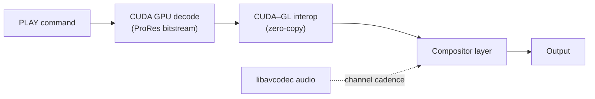
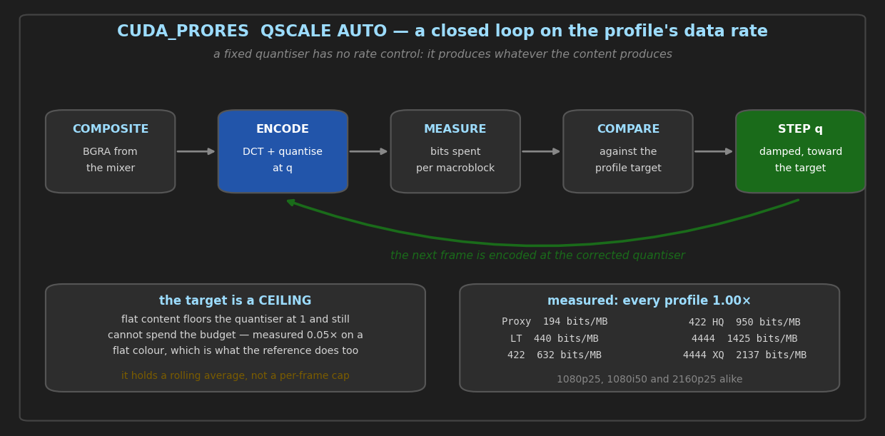

# CasparCG CUDA ProRes — Operation Guide

## Overview

The module provides two recording consumers **and** a GPU-accelerated ProRes playback producer:

| Role | AMCP keyword | Use case |
|---|---|---|
| **Producer** | `PLAY 1-1 CUDA_PRORES <file>` | GPU-decode a ProRes `.mov`/`.mxf`/`.mkv` file for playout |
| **Consumer** | `ADD 1 CUDA_PRORES …` | GPU-encode the channel compositor output to ProRes |
| **Bypass consumer** | `ADD 1 CUDA_PRORES_BYPASS …` | GPU-encode a raw DeckLink SDI input directly to ProRes |

All three share the same GPU encode/decode kernel pipeline (NVIDIA CUDA).  Consumers write `.mov` or `.mxf` files; the producer reads them back.

### The GPU-direct upload

The consumer maps the mixer's composited texture straight into CUDA, so the picture never passes
through host memory. Confirm it from the log:

```
[cuda_prores] GPU-direct path active (CUDA-GL interop on the mixer's own thread); the channel readback stops here
output[1] No consumer needs CPU readback (1 consumers); mixer readback skipped.
```

**It requires the OpenGL mixer.** CUDA-GL interop needs an OpenGL texture; on a Vulkan channel
the consumer falls back to a host readback, correctly and without complaint. There is no
CUDA-Vulkan equivalent in this consumer — use `-vcodec prores_ks_vulkan` through the ffmpeg
consumer on a Vulkan channel instead.

The first frame always reads back: the consumer only stops the channel readback once a map has
actually succeeded, and re-arms it if one ever fails, so a failure degrades to the host path
rather than producing a frame with no pixels in it.

> **Fixed 2026-08-22, and it had never worked before that.** The consumer used to create its own
> OpenGL context and call `wglShareLists` against the mixer's, which fails with `ERROR_BUSY (170)`
> because that call refuses a context current on another thread. Every recording before this went
> through host memory. Fixing it also exposed a red/blue exchange on the GPU path that had never
> been able to show itself. See `CHANGELOG.md` for both.

---

## CUDA_PRORES Producer (Playback)



The ProRes producer uses CUDA to GPU-decode ProRes frames and feeds them into the CasparCG compositor via the zero-copy CUDA-GL interop path (Windows) or a host-copy fallback (Linux / when `wglShareLists` fails).  Audio is decoded by libavcodec from the same container and delivered at the channel's native cadence.

### PLAY Command Syntax

```
PLAY <channel>-<layer> CUDA_PRORES <filename>
    [LOOP]
    [SEEK  <frame>]
    [IN    <frame>]
    [START <frame>]
    [OUT   <frame>]
    [LENGTH <frames>]
    [COLOR_MATRIX  709|2020|601|AUTO]
    [DEVICE <cuda-index>]
    [FILE <filename>]
```

`<filename>` is a path relative to the CasparCG **media** folder (or an absolute path).  Extension may be omitted; `.mov`, `.mxf`, `.mkv`, `.mp4` are probed in that order.

| Parameter | Default | Description |
|---|---|---|
| `LOOP` | off | Loop playback. On EOF (or OUT) the producer seeks back to `IN`/`SEEK` instead of reopening the file. |
| `SEEK` (or `IN` or `START`) | `0` | First frame to play (0-based frame index). Seek is applied before the read thread starts — the first delivered frame is exactly this frame. |
| `OUT` | end of file | Exclusive stop frame. Playback stops (or loops) just *before* this frame. |
| `LENGTH` | rest of file | Frame count from the `SEEK`/`IN` position. Converted to `OUT = IN + LENGTH` internally. Ignored if `OUT` is also given. |
| `COLOR_MATRIX` | `AUTO` | Override the colour matrix embedded in the ProRes file. `709` = BT.709, `601` = BT.601, `2020` = BT.2020, `AUTO` = use per-frame metadata (default). Useful when the file has wrong or absent matrix metadata. |
| `DEVICE` | `0` | CUDA GPU index (0-based). Selects which GPU decodes. |
| `FILE` | — | Explicit keyword form; equivalent to placing the filename positionally. |

### CALL — Seek and Loop Control

```
CALL <channel>-<layer> seek <target> [<offset>]
CALL <channel>-<layer> loop [0|1]
```

**`seek` target values:**

| Target | Meaning |
|---|---|
| `<integer>` | Absolute frame number (0-based) |
| `rel` or `current` | Current frame position (useful with an offset) |
| `start` or `in` | Frame 0 (rewind to beginning) |
| `end` | Last frame of the file |

**Optional offset** (third parameter): a signed integer added to the resolved target.

Examples:
```
CALL 1-10 seek 250              ; jump to frame 250
CALL 1-10 seek rel +25          ; advance 25 frames
CALL 1-10 seek rel -25          ; rewind 25 frames
CALL 1-10 seek start            ; rewind to beginning
CALL 1-10 seek end              ; jump to last frame
CALL 1-10 loop                  ; query loop state → returns "0" or "1"
CALL 1-10 loop 1                ; enable loop
CALL 1-10 loop 0                ; disable loop
```

Seek is non-blocking: it posts a `seek_request_` to the read thread, which flushes the output queue and seeks at the next opportunity (within one frame interval).

### OSC State Keys

The ProRes producer publishes OSC state at the standard CasparCG monitor path `/channel/<ch>/stage/<layer>/`:

| OSC key | Value | Description |
|---|---|---|
| `file/name` | string | Filename (without directory path) |
| `file/path` | string | Full absolute file path |
| `file/time` | `[current_s, total_s]` | Current playback position and total duration in seconds |
| `file/loop` | bool | Current loop state |
| `width` | int | Frame width in pixels |
| `height` | int | Frame height in pixels |

These match the keys published by CasparCG's built-in FFmpeg `av_producer`, so existing monitoring software works without changes.

### Diagnostics Graph

The ProRes producer registers a diagnostics graph with the following tracks:

| Track | Colour | Meaning |
|---|---|---|
| `frame-time` | Bright green | Inter-receive call interval as a fraction of frame period. Should stay near 0.5 (normalised by `hz × 0.5`). |
| `decode-time` | Dark green | CUDA decode time as a fraction of frame period. Should stay well below 1.0. |
| `queue-fill` | Blue | Output queue fill level as a fraction of `MAX_QUEUED`. |
| `dropped` | Red flash | A frame was dropped — decode took too long or the queue was full. |

The graph title updates every frame and shows:
```
clip.mov  125 / 700  |  5.0s / 28.0s  |  25.0fps
```
(filename · current frame / total frames · current time / total time · current output fps)

### Producer Examples

```amcp
; Basic playback
PLAY 1-10 CUDA_PRORES colorbars_hq

; Loop from frame 50 to frame 200
PLAY 1-10 CUDA_PRORES colorbars_hq LOOP IN 50 OUT 200

; Play exactly 500 frames starting at frame 100
PLAY 1-10 CUDA_PRORES colorbars_hq SEEK 100 LENGTH 500

; Force BT.601 colour matrix (e.g. SD content tagged as 709)
PLAY 1-10 CUDA_PRORES sd_clip COLOR_MATRIX 601

; Stop playback
STOP 1-10

; Live seek while playing
CALL 1-10 seek 0
CALL 1-10 seek rel +25
CALL 1-10 loop 1
```

---

## Recording Consumers

Both consumers encode on the GPU (NVIDIA CUDA) to an Apple-compliant ProRes bitstream and mux into `.mov` or `.mxf`.

---

## ProRes Profiles

| `PROFILE` | FourCC | Apple name | Pixel format | Typical bitrate @ 1080i50 |
|---|---|---|---|---|
| `0` | `apco` | Proxy | 4:2:2 10-bit | ~45 Mbps |
| `1` | `apcs` | LT | 4:2:2 10-bit | ~102 Mbps |
| `2` | `apcn` | Standard 422 | 4:2:2 10-bit | ~147 Mbps |
| **`3`** | `apch` | **422 HQ** (default) | **4:2:2 10-bit** | **~220 Mbps** |
| `4` | `ap4h` | 4444 | 4:4:4 12-bit + optional alpha | ~330 Mbps |
| `5` | `ap4x` | 4444 XQ | 4:4:4 12-bit + optional alpha | ~500 Mbps |

---

## AMCP Parameters — CUDA_PRORES (Consumer)

```
ADD <channel> CUDA_PRORES
    PATH      <output-directory>
    FILENAME  <filename.mov>
    [PROFILE  0-5]
    [CODEC    MOV|MXF]
    [QSCALE   AUTO|1-128]
    [SLICES   1|2|4|8]
    [ALPHA    0|1]
    [HDR      SDR|HLG|PQ]
    [MAXCLL   <nits>]
    [MAXFALL  <nits>]
```

| Parameter | Default | Description |
|---|---|---|
| `PATH` | `.` | Output directory. **Use forward slashes** — backslashes are mangled by AMCP's C-escape processing. |
| `FILENAME` | `prores_YYYYMMDD_HHMMSS.mov` | Output filename. If omitted, a timestamped name is generated automatically. |
| `PROFILE` | `3` | ProRes variant. See table above. |
| `CODEC` | `MOV` | Container format: `MOV` or `MXF`. |
| `QSCALE` | `AUTO` | `AUTO` targets the profile's published data rate (see below). A number 1–128 pins the quantiser: lower = better quality and a larger file, `1` = maximum quality. The upper bound is 128 rather than 31 because the ProRes slice header carries q_scale literally up to 128 — and 31 was reachable in practice, see the SDI section. |
| `SLICES` | `4` | Parallel horizontal slices per macroblock row. Valid: `1`, `2`, `4`, `8`. Higher = more GPU parallelism, diminishing returns above 4. |
| `ALPHA` | `1` | Include alpha channel. Only relevant for profiles 4 and 5 (4444). Set `ALPHA 0` to reduce file size when alpha is not needed. |
| `HDR` | `SDR` | Colour space: `SDR` (BT.709), `HLG` (BT.2020 HLG), `PQ` (HDR10 PQ). |
| `MAXCLL` | `1000` | Maximum Content Light Level in nits. Used only with `HDR PQ`. |
| `MAXFALL` | `400` | Maximum Frame-Average Light Level in nits. Used only with `HDR PQ`. |

### `QSCALE AUTO` — how the data rate is held



**A fixed quantiser cannot hold a data rate, and this encoder has no per-slice rate search.**
`QSCALE AUTO` closes a loop instead: after each frame it compares the bits actually spent per
macroblock against the profile's target and steps the quantiser, damped, towards it. It
converges within a handful of frames from a cold start and then holds.

The targets are the reference encoder's, taken from `prores_profile_info[].br_tab` in FFmpeg's
`proresenc_kostya_common.c`. They are quoted **per macroblock**, which is why one number covers
every raster: a picture with four times the macroblocks gets four times the bits.

| `PROFILE` | Apple name | target bits/MB | 1080p25 | 1080i50 | 2160p25 |
| :--- | :--- | ---: | ---: | ---: | ---: |
| `0` | Proxy | 194 | 39.6 Mbit/s | 39.6 | 157.1 |
| `1` | LT | 440 | 89.8 | 89.8 | 356.4 |
| `2` | 422 | 632 | 128.9 | 128.9 | 511.9 |
| `3` | 422 HQ | 950 | 193.8 | 193.8 | 769.5 |
| `4` | 4444 | 1425 | 290.7 | 290.7 | 1154.3 |
| `5` | 4444 XQ | 2137 | 436.0 | 436.0 | 1731.0 |

1080p25 and 1080i50 coincide because they carry the same macroblocks per second — interlaced
halves the macroblocks per picture and doubles the pictures per frame. Rasters at or below
1440×1080 use a higher bucket from the same table (`PRORES_MB_LIMITS`), so SD and 720p targets
are higher per macroblock, not lower.

**Measured 2026-08-23**, detailed noise at 1080p25, steady state after the first eight frames,
every profile, on the OpenGL mixer:

| profile | achieved | vs target | decode errors |
| :--- | ---: | ---: | ---: |
| Proxy | 194 bits/MB | 1.00× | 0 |
| LT | 440 | 1.00× | 0 |
| 422 | 632 | 1.00× | 0 |
| 422 HQ | 950 | 1.00× | 0 |
| 4444 | 1425 | 1.00× | 0 |
| 4444 XQ | 2137 | 1.00× | 0 |

At 4K, 422 HQ reaches 950 (769 Mbit/s) and 4444-with-alpha 1425 (1154 Mbit/s), both 1.00× and
with no decode errors. Interlaced 1080i50 at 422 HQ reaches 950, 1.00×.

**Both mixers, and they agree.** On the Vulkan mixer, 422 HQ reaches 1.00× and 4444 1.00× with no
decode errors, and the alpha partition from a half-size fill is identical to OpenGL's down to the
sample: 1 555 200 transparent, 518 400 opaque, and **not one value in between** on either
backend.

**Three limits on those numbers, and they matter operationally.**

* **The target is a ceiling, not a floor.** On flat content the loop drives the quantiser to 1
  — the best the codec can do — and still cannot spend the budget: measured 52 bits/MB, 0.05×,
  on a flat colour at 422 HQ. That is correct, and it is what the reference encoder does too.
  A recording that comes in far under target is a statement about the content.
* **It holds a rolling average, not a per-frame cap.** The reference encoder searches per
  slice, so it holds the rate *within* a frame as well. A single frame here can overshoot after
  a hard cut, before the loop catches up.
* **One source.** Detailed noise is the worst case for a DCT codec, chosen because it is the
  content most likely to expose a rate the loop cannot reach. The convergence behaviour on
  ordinary footage will differ in how far the quantiser has to travel, not in where it lands.

A frame that would still exceed the pinned output buffer is **dropped with a log line** rather
than written; the buffer carries 50% headroom over uncompressed for the 4444 profiles.

**Note:** `CUDA_PRORES` (consumer) always occupies consumer slot **1** on the channel. Only one CUDA_PRORES consumer can be active per channel at a time. The `CUDA_PRORES` producer (`PLAY`) and consumer (`ADD`) are independent — both can be active simultaneously on the same or different channels.

---

## AMCP Parameters — CUDA_PRORES_BYPASS

All parameters above apply, plus:

| Parameter | Default | Description |
|---|---|---|
| `DEVICE` | `1` | DeckLink device index (1-based). **Required** — specifies which physical SDI input to capture. |
| `CUDA_DEVICE` | `0` | CUDA GPU index (0-based). Useful in multi-GPU systems to pin encoding to a specific card. |
| `PROFILE` | `3` | **`0`–`3` only here.** This consumer encodes V210 straight off the wire, which is 4:2:2 by construction, so there is no 4:4:4 to encode. `4` or `5` is clamped to `3` with a warning — it used to stamp an `ap4h`/`ap4x` fourcc on a 4:2:2 bitstream, and a decoder reads those tags as 12-bit and renders the 10-bit samples at four times their level. |

`CUDA_PRORES_BYPASS` always occupies consumer slot **2**. It does not require a `PLAY` command — it captures directly from the SDI input.

### Interlaced: field-coded always, and not selectable here

Both CUDA consumers field-code an interlaced channel and there is **no way to ask them not to**.
`CUDA_PRORES` takes it from the channel (`field_count == 2`), `CUDA_PRORES_BYPASS` from the
capture signal, and neither exposes a parameter. That differs from the FFmpeg `FILE` consumer,
which grew an `-interlaced auto|0|1` — so if you need a *progressive* file from an interlaced
channel, that is the consumer to use, or change the channel.

Measured on a 1080i50 channel: 422 HQ reaches 950 bits/MB, 1.00× target, field order `tt`, zero
decode errors — the interlaced path is correct, it just is not optional.

**For a 25p file from a 50i SDI input, change the CHANNEL, not the consumer.** The DeckLink
*producer* deinterlaces when an interlaced input feeds a progressive channel: `decklink_producer`
sets `i2p` for exactly that case and inserts `bwdif=mode=send_field` with the input's parity,
followed by an `fps` stage to the channel rate. So a `1080p2500` channel fed from a 1080i50 input
records 25p on any consumer, with no interlaced handling involved at all. Verified end to end over
the looped DeckLink pair: the recording came out `progressive, 25/1`. Note the limit of that
check — the generator's SDI mode was reported by the card both as `1080p25` and as `1080i50`
during the run, so the *output* is confirmed and the `bwdif` stage engaging is not.

### `QSCALE AUTO` on the SDI path, and why the quantiser bound had to move

`QSCALE AUTO` works identically here — the same loop on the same per-profile targets. What the
SDI path exposed is that **the quantiser range mattered**, which the mixer path never showed.

Measured 2026-08-23 over the looped DeckLink pair (a separate `ffmpeg` process putting detailed
noise on connector 1 as `uyvy422`, the consumer capturing connector 4), steady state:

| profile | target | achieved | quantiser it settled on | decode errors |
| :--- | ---: | ---: | ---: | ---: |
| Proxy | 194 bits/MB | **1.00×** | 43 | 0 |
| LT | 440 | **1.00×** | 33 | 0 |
| 422 | 632 | **1.00×** | 35 | 0 |
| 422 HQ | 950 | **1.00×** | 28–29 | 0 |

Three of the four settled **above 31**, which used to be this encoder's hard clamp. With that
clamp in place the same run gave Proxy 1.49× and 422 1.08× with the quantiser pinned at 31 — a
recorder reporting a rate it had not chosen. 31 was never a format limit: `proresdec.c` clips the
slice header's q_scale byte to 1..224 and expands anything above 128, so 1..128 are all literal,
and the coarsest ProRes matrix entry of 63 keeps `63 × 128` well inside the `int16_t` the decoder
scales its matrix into.

**Why the SDI path needs a coarser quantiser than the mixer path for the same clip.** V210 off the
wire keeps the chroma detail the mixer path low-passes: there, the frame has been decoded to RGB
(4:2:2 → 4:4:4 → RGB) and re-subsampled on the way into the encoder, and that round trip is a
filter. More surviving high-frequency chroma costs more bits at the same quantiser.

---

## Consumer Command Examples

### Standard recording (compositor output → HQ ProRes)

```amcp
PLAY 1 DECKLINK DEVICE 1
ADD 1 CUDA_PRORES PATH "D:/recordings" FILENAME "camera1.mov" PROFILE 3
```

### Stop recording

```amcp
REMOVE 1 CUDA_PRORES
STOP 1
```

### Direct SDI capture on two inputs simultaneously

```amcp
ADD 1 CUDA_PRORES_BYPASS PATH "D:/recordings" FILENAME "sdi1.mov" DEVICE 1 PROFILE 3
ADD 2 CUDA_PRORES_BYPASS PATH "D:/recordings" FILENAME "sdi2.mov" DEVICE 2 PROFILE 3
```

### Stop bypass recording

```amcp
REMOVE 1 CUDA_PRORES_BYPASS
REMOVE 2 CUDA_PRORES_BYPASS
```

### 4444 with alpha (for graphics/CG output)

```amcp
ADD 1 CUDA_PRORES PATH "D:/graphics" FILENAME "out_4444.mov" PROFILE 4 ALPHA 1
```

### 4444 without alpha (saves ~25% file size)

```amcp
ADD 1 CUDA_PRORES PATH "D:/graphics" FILENAME "out_4444.mov" PROFILE 4 ALPHA 0
```

### MXF container

```amcp
ADD 1 CUDA_PRORES_BYPASS PATH "D:/mxf" FILENAME "camera1.mxf" DEVICE 1 PROFILE 3 CODEC MXF
```

### Maximum quality (QSCALE 1)

```amcp
ADD 1 CUDA_PRORES PATH "D:/masters" FILENAME "master.mov" PROFILE 3 QSCALE 1
```

### HDR HLG recording

```amcp
ADD 1 CUDA_PRORES_BYPASS PATH "D:/hdr" FILENAME "hlg.mov" DEVICE 1 PROFILE 3 HDR HLG
```

### HDR PQ / HDR10

```amcp
ADD 1 CUDA_PRORES_BYPASS PATH "D:/hdr" FILENAME "hdr10.mov" DEVICE 1 PROFILE 3 HDR PQ MAXCLL 4000 MAXFALL 400
```

---

## casparcg.config (pre-configured consumers)

Consumers can be defined in the config to start automatically on launch:

```xml
<channel>
    <video-mode>1080i5000</video-mode>
    <consumers>
        <cuda_prores>
            <path>D:/recordings</path>
            <profile>3</profile>
            <codec>mov</codec>
            <qscale>auto</qscale>
            <slices>4</slices>
        </cuda_prores>
    </consumers>
</channel>
```

```xml
<channel>
    <video-mode>1080i5000</video-mode>
    <consumers>
        <cuda_prores_bypass>
            <path>D:/recordings</path>
            <device>1</device>
            <profile>3</profile>
            <codec>mov</codec>
            <qscale>auto</qscale>
        </cuda_prores_bypass>
    </consumers>
</channel>
```

---

## Diagnostics

Both consumers register a diagnostics graph visible in the CasparCG client:

| Track | Colour | Meaning |
|---|---|---|
| `encode-time` | Green | Encode time as a fraction of frame time. Should stay below 1.0. |
| `queue-depth` | Orange | Encode queue fill level (0–8 frames). A rising queue warns of sustained overload. |
| `dropped-frame` | Red flash | A frame was discarded because the queue was full. Indicates the GPU cannot keep up. |
| `encode-error` | Pink flash | An encode or mux error occurred. Check the log for details. |

The title bar shows: `cuda_prores[1|3] | 750 fr (30.0s)` — consumer slot, profile, frame count, and elapsed time.

---

## Best Use Guidelines

**Use CUDA_PRORES when:**
- You need to record the CasparCG compositor output (graphics, mixed signals, playout)
- You want frame-accurate recording synced to the channel timeline
- Profile 4/5 (4444) is needed for graphics with alpha

**Use CUDA_PRORES_BYPASS when:**
- You need to ISO-record a raw SDI feed without any CasparCG processing overhead
- CPU usage is critical — bypass uses ~5% sys CPU vs ~24% for the FILE consumer at equivalent quality
- You need multi-camera ingest on a single machine

**Path formatting:**
- Always use forward slashes: `D:/recordings/show1` — backslashes are interpreted as AMCP escape sequences and will corrupt the path

**Bitrate guide (1080i50, 2 simultaneous channels):**

| Profile | Per-channel | 2-channel total | Storage per hour |
|---|---|---|---|
| Proxy (0) | ~45 Mbps | ~90 Mbps | ~40 GB |
| LT (1) | ~102 Mbps | ~204 Mbps | ~92 GB |
| Standard (2) | ~147 Mbps | ~294 Mbps | ~132 GB |
| **HQ (3)** | **~220 Mbps** | **~440 Mbps** | **~198 GB** |
| 4444 (4) | ~330 Mbps | ~660 Mbps | ~297 GB |
| 4444 XQ (5) | ~500 Mbps | ~1 Gbps | ~450 GB |

**SLICES:**
- `4` (default) is the right choice for 1080 on most modern GPUs
- Use `8` only on high-core-count server GPUs (e.g. A100, H100) for 4K
- `1` or `2` may be needed for compatibility with certain NLEs that don't support multi-slice ProRes

---

## Linux Platform Notes

The `cuda_prores` and `cuda_notchlc` modules are fully supported on Linux. Key differences from Windows:

| Feature | Windows | Linux |
|---------|---------|-------|
| **File I/O** | IOCP + `FILE_FLAG_NO_BUFFERING` | `io_uring` + `O_DIRECT` |
| **Consumer GPU-direct** | WGL shared context (CUDA-GL interop) | EGL surfaceless shared context (CUDA-GL interop) |
| **Producer GPU zero-copy** | WGL `wglShareLists` | Host-copy fallback (PBO upload) |
| **Producer Vulkan zero-copy** | Supported | Supported |
| **DeckLink SDK** | COM (`CoCreateInstance`) | Direct API (`CreateDeckLinkIteratorInstance`) |
| **GL headers** | `GL/glew.h` | `GL/gl.h` + `EGL/egl.h` |

### Build dependencies (Linux)

```bash
sudo apt install liburing-dev libegl-dev
```

The DeckLink Linux interop headers are included in the source tree (`src/modules/decklink/linux_interop/`). nvCOMP 5.x must be installed separately for NotchLC support.

### Consumer GPU-direct path

On Linux, the `CUDA_PRORES` consumer creates a shared EGL context (surfaceless, via `EGL_KHR_surfaceless_context`) on the encode thread. This enables zero-copy GPU-direct reads of the mixer's output texture — the same performance benefit as the WGL path on Windows. If EGL context creation fails, it falls back to the CPU frame data path automatically.

### Producer fallback

On Linux without Vulkan, the ProRes and NotchLC producers use the host-copy path: decoded frames are written to `cudaMallocHost` pinned buffers, then uploaded via PBO. When the Vulkan mixer is active, producers use the zero-copy `CudaVkTexture` interop path on both platforms.
