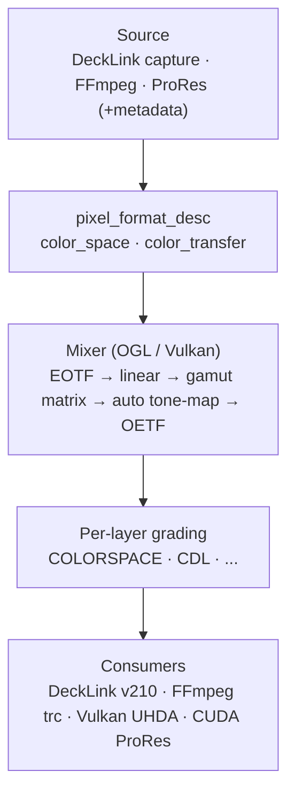
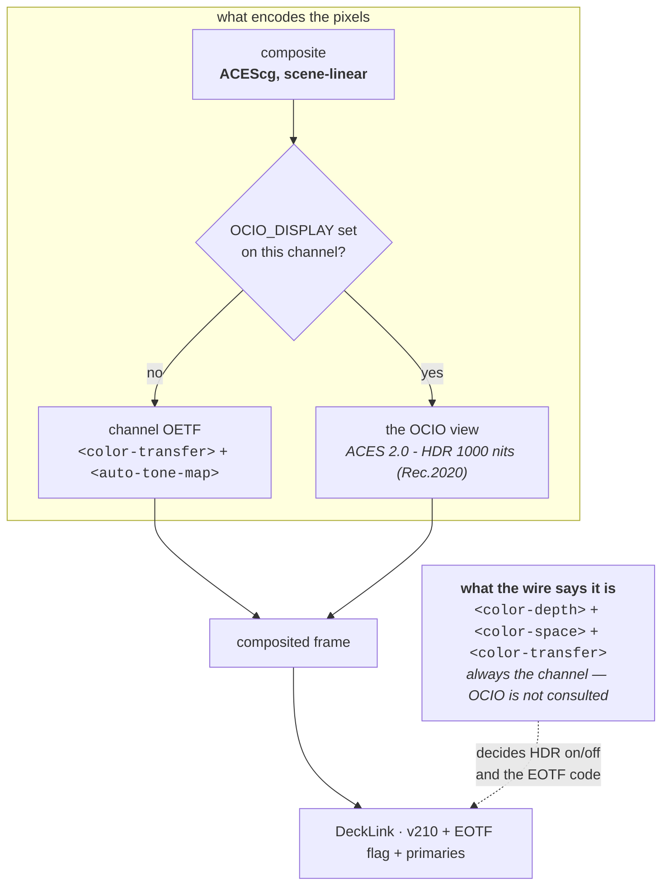

# HDR & Wide-Gamut Guide for CasparVP

> **State and measurements:** [`../features/colour-grading-and-ocio.md`](../features/colour-grading-and-ocio.md)
> **Implementation notes:** [`../architecture/OCIO_INTEGRATION_STUDY.md`](../architecture/OCIO_INTEGRATION_STUDY.md)
> **This document is how-to.** Per [`../README.md`](../README.md), measured figures live once in `features/`; a tolerance an operator acts on may appear here, the measurements behind it should not.

This guide covers the HDR-related features added to CasparVP: channel color configuration, automatic color conversion, BT.2020 / PQ / HLG propagation through the pipeline, DeckLink HDR input/output, Vulkan direct-display HDR output, FFmpeg consumer color metadata, and High Frame Rate (HFR) support.

For per-layer color grading and ACES color management (MIXER COLORSPACE, CDL, LUT3D, etc.), see [COLOR_GRADING.md](../guides/COLOR_GRADING.md). For Vulkan output architecture details, see [VULKAN_OUTPUT.md](../architecture/VULKAN_OUTPUT.md).

> **There is a second route to an HDR channel**, through OpenColorIO: an `OCIO_DISPLAY` view
> such as `ACES 2.0 - HDR 1000 nits (Rec.2020)` encodes the picture instead of the channel's
> own OETF. Everything in this guide describes the built-in route. Where the two meet — and
> which one decides what the SDI wire says — is [Two routes to an HDR
> channel](#two-routes-to-an-hdr-channel-built-in-vs-ocio) below. The commands themselves are
> in [OCIO_USER_GUIDE.md](../guides/OCIO_USER_GUIDE.md).

---

## Table of Contents

1. [Overview of the Pipeline](#overview-of-the-pipeline)
2. [Channel Configuration](#channel-configuration)
3. [Two routes to an HDR channel (built-in vs OCIO)](#two-routes-to-an-hdr-channel-built-in-vs-ocio)
4. [DeckLink Input (Capture)](#decklink-input-capture)
5. [DeckLink Output (Playout)](#decklink-output-playout)
6. [Vulkan Output (Direct Display)](#vulkan-output-direct-display)
7. [FFmpeg Consumer (File Recording)](#ffmpeg-consumer-file-recording)
8. [CUDA ProRes Consumer (Recording)](#cuda-prores-consumer-recording)
9. [CUDA ProRes Producer (Playback)](#cuda-prores-producer-playback)
10. [High Frame Rate Formats](#high-frame-rate-formats)
11. [Complete Config Examples](#complete-config-examples)
12. [Quick Reference Table](#quick-reference-table)
13. [Notes & Known Limitations](#notes--known-limitations)

---

## Overview of the Pipeline



```
┌────────────────────────────────────────────────────────────────┐
│  Source                                                        │
│  DeckLink capture  → bmdDeckLinkFrameMetadata* per frame       │
│  FFmpeg producer   → AVFrame color_trc / colorspace per frame  │
│  CUDA ProRes prod. → ProRes bitstream color_matrix/transfer_func│
│  All map to: color_space (bt601/709/2020/p3_d65/p3_dci/adobe_rgb)    │
│            + color_transfer (sdr/pq/hlg/linear/gamma24/gamma26)      │
└───────────────────────┬────────────────────────────────────────┘
                        │  pixel_format_desc { color_space, color_transfer }
                        ▼
┌────────────────────────────────────────────────────────────────┐
│  OGL/Vulkan Mixer                                                  │
│  - YCbCr↔BGRA conversion uses correct colour matrix           │
│  - Auto color convert: EOTF → linear → gamut matrix → OETF    │
│  - Per-layer color grading pipeline (see COLOR_GRADING.md)     │
│  - Output BGRA frame in channel's target color_space +         │
│    color_transfer (already converted)                          │
└───────────────────────┬────────────────────────────────────────┘
                        │
          ┌─────────────┼──────────────┬───────────────┐
          ▼             ▼              ▼               ▼
┌──────────────────┐ ┌───────────────┐ ┌────────────┐ ┌──────────────────┐
│  DeckLink output │ │ FFmpeg consumer│ │ CUDA ProRes│ │  Vulkan output   │
│  - HDR v210      │ │ enc->color_trc│ │ - MOV/MXF  │ │  - Compute shader│
│  - EOTF signaled │ │ enc->primaries│ │   color    │ │    gamut+OETF    │
│  - primaries set │ │ enc->colorsp. │ │   metadata │ │  - Hardware HDR  │
└──────────────────┘ └───────────────┘ │ - HDR auto │ │    (NvAPI UHDA)  │
                                       └────────────┘ └──────────────────┘
```

Color space and transfer function are declared **once on the channel** and flow automatically to every consumer. Individual consumers can optionally override them.

---

## Channel Configuration

### `casparcg.config` — `<channel>` element

```xml
<channel>
  <!-- Standard definition of video mode, depth etc. -->
  <video-mode>2160p5000</video-mode>
  <color-depth>16</color-depth>

  <!-- Wide-gamut colour primaries: bt709 | bt2020 | p3-d65 | p3-dci | adobe-rgb -->
  <color-space>bt2020</color-space>

  <!-- Transfer function: sdr | pq | hlg | linear | gamma24 | gamma26 -->
  <color-transfer>pq</color-transfer>

  <consumers>
    ...
  </consumers>
</channel>
```

### `<color-space>` values

| Value | Meaning | Typical use |
|-------|---------|-------------|
| `bt709` | ITU-R BT.709 primaries (default) | HD SDR; standard broadcast |
| `bt2020` | ITU-R BT.2020 primaries | UHD HDR; wide-gamut |
| `p3-d65` | Display P3 (D65 white point) | Apple displays, wide-gamut monitors, HDR grading |
| `p3-dci` | DCI-P3 (DCI white point) | Digital cinema projection |
| `adobe-rgb` | Adobe RGB (1998) | Photography, print proofing |

> `bt601` is supported in the DeckLink input pipeline (auto-detected) but is not a valid channel config value.
>
> **DeckLink compatibility**: SDI can only signal BT.709 or BT.2020. If a channel is set to `p3-d65`, `p3-dci`, or `adobe-rgb` and a DeckLink consumer is attached, a warning is logged. The pixel values are still output correctly but SDI metadata will signal BT.2020. For correct SDI signaling, use `bt709` or `bt2020`.

### `<color-transfer>` values

| Value | Standard | Typical use |
|-------|----------|-------------|
| `sdr` | BT.709 / BT.1886 gamma (default) | All SDR workflows |
| `pq` | SMPTE ST 2084 (Perceptual Quantizer) | HDR10, cinema mastering |
| `hlg` | ARIB STD-B67 (Hybrid Log-Gamma) | HDR broadcast (BBC, NHK) |
| `linear` | Linear light (no curve) | Compositing previews, light-linear workflows |
| `gamma24` | Pure gamma 2.4 | EBU broadcast reference monitors |
| `gamma26` | Pure gamma 2.6 | DCI cinema projection |

> `linear`, `gamma24`, and `gamma26` are primarily useful for direct-display output (Vulkan) or compositing workflows. For SDI output via DeckLink, `sdr`, `pq`, or `hlg` are the standard choices.

### `<auto-color-convert>` (automatic color conversion)

```xml
<channel>
  <video-mode>2160p5000</video-mode>
  <color-depth>16</color-depth>
  <color-space>bt2020</color-space>
  <color-transfer>pq</color-transfer>

  <!-- Automatic color conversion: true (default) | false -->
  <auto-color-convert>true</auto-color-convert>

  <consumers>...</consumers>
</channel>
```

When enabled (the default), the mixer automatically converts each layer's color space and transfer function to match the channel output — no `MIXER COLORSPACE` command is needed. For example, an SDR BT.709 clip played on a BT.2020 PQ channel will be automatically linearized, gamut-mapped, luminance-scaled, and re-encoded to PQ.

| Feature | Detail |
|---------|--------|
| **Gamut conversion** | Direct 3×3 matrices between all 5 channel gamuts (BT.709, BT.2020, P3-D65, P3-DCI, Adobe RGB). D65-based pairs use ITU-R BT.2087 matrices; DCI uses Bradford-adapted matrices. Norm-correct to < 1 LSB. |
| **Luminance scaling** | SDR→HLG: ×0.265 (BT.2408 75% signal). HLG→PQ: ×0.1. PQ→SDR: ×100.0. Linear/gamma24/gamma26 treated as SDR-level for luminance adaptation. |
| **Tone mapping** | Configurable via `<auto-tone-map>`. Default is hard-clamp (broadcast standard). Options: reinhard, aces_filmic, aces_rrt, hlg_ootf. See below. |
| **Grading tools** | All color grading commands (CDL, LMG, white balance, hue shift, curves, levels, saturation, qualifier, etc.) work normally — they operate in scene-linear space between the EOTF and OETF. |
| **Override** | Sending `MIXER COLORSPACE` on a layer switches that layer to the manual ACEScg pipeline. Auto is skipped for that layer. |

Set `<auto-color-convert>false</auto-color-convert>` to disable automatic conversion (e.g. when all sources already match the channel output, or when every layer uses explicit `MIXER COLORSPACE` commands).

### `<auto-tone-map>` (channel-level tone mapping)

> **Requires `<auto-color-convert>true</auto-color-convert>`** (the default).
> Channel-level tone mapping is part of the auto color conversion pipeline — it
> operates in linear light between the EOTF decode and OETF encode steps. When
> `auto-color-convert` is disabled, the entire conversion pipeline is skipped
> and `<auto-tone-map>` has no effect.

```xml
<channel>
  <video-mode>2160p5000</video-mode>
  <color-depth>16</color-depth>
  <color-space>bt2020</color-space>
  <color-transfer>hlg</color-transfer>

  <!-- auto-color-convert must be true (default) for tone mapping to work -->
  <auto-color-convert>true</auto-color-convert>

  <!-- Tone mapping applied during auto color conversion -->
  <auto-tone-map>hlg_ootf</auto-tone-map>

  <!-- Display peak luminance for HLG OOTF gamma calculation (default: 1000) -->
  <display-peak-luminance>1000</display-peak-luminance>

  <consumers>...</consumers>
</channel>
```

When `auto-color-convert` is enabled and cross-domain conversion occurs (e.g. SDR source on an HLG channel), the specified tone-mapping operator is applied in linear light after luminance scaling and before the output OETF.

| Value | Operator | Description |
|:---|:---|:---|
| `none` | Hard clamp (default) | Standard broadcast behavior — clips to [0,1] |
| `reinhard` | Reinhard | Simple luminance-preserving curve: `v/(v+1)` |
| `aces_filmic` | ACES Filmic | Narkowicz 2015 approximation — filmic S-curve |
| `aces_rrt` | ACES RRT+ODT | Reference Rendering Transform + Output Device Transform |
| `hlg_ootf` | BT.2100 HLG OOTF | Display-referred mapping — uses `<display-peak-luminance>` |

The `<display-peak-luminance>` setting (in nits, default 1000) controls the gamma exponent in the HLG OOTF formula per BT.2100:

```
γ = 1.2 × 1.111^(log₂(Lw/1000))
```

where `Lw` is the display's nominal peak luminance. Lower values (e.g. 600 for a typical LED wall) produce a steeper gamma curve, compressing highlights more aggressively.

### Per-consumer tone-map override

Individual consumers can override the channel-level tone mapping with their own display-specific settings. This enables a single channel to drive multiple displays with different characteristics (e.g. a reference monitor at 1000 nits and an LED wall at 600 nits):

```xml
<consumers>
  <screen>
    <auto-tone-map>hlg_ootf</auto-tone-map>
    <display-peak-luminance>600</display-peak-luminance>
  </screen>
  <vulkan-output>
    <gpu>0</gpu>
    <device>1</device>
    <auto-tone-map>hlg_ootf</auto-tone-map>
    <display-peak-luminance>1500</display-peak-luminance>
  </vulkan-output>
</consumers>
```

The per-consumer tone-map is applied as a **display transform** after the mixer's compositing stage:
- **Screen consumer**: OpenGL fragment shader applies EOTF decode → tone-map → OETF re-encode
- **Vulkan output**: Compute shader inserts tone-map between gamut conversion and output OETF

Per-consumer tone-mapping is **independent** of both `<auto-color-convert>` and the channel-level `<auto-tone-map>`:
- It does **not** require `<auto-color-convert>true</auto-color-convert>` — even if channel auto-conversion is off, a consumer can still apply its own display transform on the composited output.
- It operates at a different pipeline stage: channel-level maps source layers → channel working space; consumer-level maps the final composited frame → display output.

**AMCP (screen consumer)**:
```
ADD 1 SCREEN TONE_MAP hlg_ootf PEAK_LUMINANCE 600
```

### `<color-depth>` requirement for HDR

For HDR output you must use 16-bit depth. 8-bit channels can carry BT.2020 metadata but will lose precision:

```xml
<color-depth>16</color-depth>   <!-- required for meaningful HDR -->
```

---

## Two routes to an HDR channel (built-in vs OCIO)

Everything above encodes HDR the built-in way: the channel declares `<color-transfer>pq</color-transfer>`,
the mixer's own OETF applies it, and `<auto-tone-map>` decides what happens to values above the
display's range. OpenColorIO is a second route to the same picture — `OCIO_DISPLAY` names a
display and a view, and the view carries the tone map, the gamut and the encoding together.

| | built-in route | OCIO route |
| :--- | :--- | :--- |
| what encodes the picture | the channel's `<color-transfer>` OETF and `working_to_output` gamut matrix | the view named by `OCIO_DISPLAY` |
| tone mapping | `<auto-tone-map>`, plus `<display-peak-luminance>` | the view's own — an ACES 2.0 output transform |
| chosen | in `casparcg.config`, fixed for the session | at runtime, over AMCP |
| prerequisites | `<color-depth>16</color-depth>` | `<working-space-composite>` + `<render-format>fp16</render-format>` + `<auto-color-convert>` |
| per-consumer variation | tone map only (`<auto-tone-map>` on screen / vulkan-output) | the whole view (`<ocio-display>`/`<ocio-view>` on DeckLink / screen) |

### They are not additive — a display transform switches the built-in output half off

When a channel has an `OCIO_DISPLAY` set, the mixer's own output conversion does not run at
all: not the tone map, not the `working_to_output` gamut matrix, and not the `<color-transfer>`
OETF. The generated view replaces that whole block rather than following it, in both mixers —
`do_output_convert` is forced false in
[image_kernel.cpp:1071-1077](../../src/accelerator/ogl/image/image_kernel.cpp#L1071-L1077), and the
`output_convert` flag is cleared in
[image_kernel.cpp:1931-1933](../../src/accelerator/vulkan/image/image_kernel.cpp#L1931-L1933).

So on an OCIO channel, `<auto-tone-map>` and `<display-peak-luminance>` are inert. Choose the
tone mapping by picking the nits ladder of the view instead.

### What the pinned config offers for HDR

The pinned built-in config (`ocio://studio-config-v4.0.0_aces-v2.0_ocio-v2.5`) carries 13 view
transforms, 11 of them `ACES 2.0`, of which **9 are HDR**: 108, 500, 1000, 2000 and 4000 nits,
in P3-D65 and Rec.2020. They are not offered on every display — four of the nine displays
expose an HDR view:

| display | HDR views it offers | what it is |
| :--- | ---: | :--- |
| `Rec.2100-PQ - Display` | 8 | the full ladder — 500/1000/2000/4000 nits in both P3 D65 and Rec.2020 |
| `ST2084-P3-D65 - Display` | 5 | 108/500/1000/2000/4000 nits, P3 D65 only |
| `Display P3 HDR - Display` | 1 | `ACES 2.0 - HDR 1000 nits (P3 D65)` |
| `Rec.2100-HLG - Display` | 1 | `ACES 2.0 - HDR 1000 nits (P3 D65)`, HLG-encoded |

The other five — `sRGB`, `Display P3`, `Gamma 2.2 Rec.709`, `P3-D65`, `Rec.1886 Rec.709` — are
SDR-only. Enumerated from the config with PyOpenColorIO 2.5.2 on 2026-08-16; `INFO OCIO DISPLAYS`
reports the same list from a running server, and is what to trust if `<ocio-config>` points at
a facility config instead.

> **Quote both arguments.** 48 of the 55 colour space names and every display and view name in
> this config contain spaces or parentheses. See [OCIO_USER_GUIDE.md §1](../guides/OCIO_USER_GUIDE.md).

### Where PQ/HLG is decided — pixels and signalling are decided separately

This is the part worth reading twice. The OCIO view decides how the pixels are **encoded**. It
does not decide what the output **says they are**: every consumer's colour signalling is still
derived from the channel's `<color-depth>`, `<color-space>` and `<color-transfer>`, and no
consumer reads any OCIO state for that purpose. The only OCIO thing a consumer knows is which
*view* it wants rendered.



Nothing cross-checks the two. The DeckLink consumer computes its HDR mode from the channel
fields alone — the identical `config.hdr = …` expression in both `create_consumer` and
`create_preconfigured_consumer` in
[decklink_consumer.cpp](../../src/modules/decklink/consumer/decklink_consumer.cpp), reading
`channel_info.depth`, `config.color_space` and `config.color_transfer` and nothing else. So an
operator can render a PQ picture and signal SDR, or the reverse, and the server will not say a
word.

**Set both, consistently.** On an OCIO HDR channel, `<color-transfer>` becomes a
signalling-only declaration — it no longer encodes anything — but it still has to be right:

```xml
<channel>
  <video-mode>2160p5000</video-mode>
  <color-depth>16</color-depth>

  <!-- Required by OCIO_DISPLAY. -->
  <render-format>fp16</render-format>
  <auto-color-convert>true</auto-color-convert>
  <working-space-composite>true</working-space-composite>

  <!-- These no longer encode the picture: the OCIO view does. They are what the
       DeckLink consumer signals on the wire, and must match the view chosen below. -->
  <color-space>bt2020</color-space>
  <color-transfer>pq</color-transfer>

  <consumers>
    <decklink>
      <device>1</device>
      <hdr-metadata>
        <max-cll>1000</max-cll>
        <max-fall>400</max-fall>
      </hdr-metadata>
    </decklink>
  </consumers>
</channel>
```

```
OCIO_DISPLAY 1 "Rec.2100-PQ - Display" "ACES 2.0 - HDR 1000 nits (Rec.2020)"
```

Which is to say: the view's *encoding* must agree with `<color-transfer>` and its *primaries*
with `<color-space>`. Matching pairs:

| OCIO display | matching `<color-transfer>` | matching `<color-space>` |
| :--- | :--- | :--- |
| `Rec.2100-PQ - Display` | `pq` | `bt2020` |
| `Rec.2100-HLG - Display` | `hlg` | `bt2020` |
| `ST2084-P3-D65 - Display` | `pq` | `p3-d65` |
| `Display P3 HDR - Display` | `pq` | `p3-d65` |
| any of the five SDR displays | `sdr` | `bt709` or `p3-d65` per the display |

The nits of the *view* (500 vs 4000) do not change the signalling — that is what
`<hdr-metadata>` MaxCLL/MaxFALL is for, and it is also not derived from the view.

> **What this section is not.** The pairings above are read from the code and the config, not
> measured end-to-end: no battery has yet captured an OCIO HDR view and compared it against the
> built-in PQ path, and none has read back SDI signalling on an OCIO channel. What *is*
> measured is that a display transform renders correctly at all — `cli.py ocio-look` and
> `cli.py amf`, both mixers byte-identical, in [OCIO_USER_GUIDE.md](../guides/OCIO_USER_GUIDE.md). Treat
> the table as the configuration you want, not as a verified claim about the wire.

---

## DeckLink Input (Capture)

The DeckLink producer **auto-detects** color space and transfer function from SDK metadata on every input frame — no configuration is needed.

### What is detected automatically

| SDK metadata key | Maps to |
|-----------------|---------|
| `bmdDeckLinkFrameMetadataColorspace` → `bmdColorspaceRec2020` | `core::color_space::bt2020` |
| `bmdDeckLinkFrameMetadataColorspace` → `bmdColorspaceRec601` | `core::color_space::bt601` |
| `bmdDeckLinkFrameMetadataHDRElectroOpticalTransferFunc` → `2` (PQ) | `core::color_transfer::pq` |
| `bmdDeckLinkFrameMetadataHDRElectroOpticalTransferFunc` → `3` (HLG) | `core::color_transfer::hlg` |
| (default / unset) | `core::color_space::bt709`, `core::color_transfer::sdr` |

### 10-bit capture

To capture HDR in 10-bit (required for PQ/HLG), configure the input in 10BIT pixel format in your DeckLink producer settings. The decoded frame will be v210, decoded to YUV444P10 AVFrames with all color fields set.

### Frame metadata flow

```
DeckLink SDK frame
  → bmdDeckLinkFrameMetadataColorspace     → color_space  per frame
  → bmdDeckLinkFrameMetadataHDRElectroOpticalTransferFunc → color_transfer per frame
  → make_frame() → pixel_format_desc { color_space, color_transfer }
  → AVFrame { colorspace, color_primaries, color_trc, color_range }
```

Frames from a mixed input (e.g. a source that switches between SDR and HDR) will carry the correct metadata on a per-frame basis.

---

## DeckLink Output (Playout)

### Automatic HDR enabling

When a channel has **16-bit colour depth**, `color-space bt2020`, and `color-transfer pq` or `hlg`, the DeckLink consumer **automatically**:
- Switches to HDR v210 10-bit output format
- Sets `bmdFrameContainsHDRMetadata` on every output frame
- Signals the correct EOTF via `bmdDeckLinkFrameMetadataHDRElectroOpticalTransferFunc`
- Signals BT.2020 colour primaries and white point via the HDR static metadata extension

All three conditions must be met — an 8-bit channel with BT.2020/PQ settings will **not** emit HDR metadata (insufficient bit depth), and a 16-bit channel with BT.709/SDR settings will output in SDR mode.

No explicit `<hdr>true</hdr>` flag is needed — it is derived from the channel's depth and color settings.

### DeckLink consumer config in `casparcg.config`

```xml
<consumers>
  <decklink>
    <device>1</device>
    <embedded-audio>true</embedded-audio>
    <!-- Inherits color-space and color-transfer from the channel.    -->
    <!-- Override per-consumer only if this output differs:           -->
    <!-- <color-space>bt2020</color-space>                           -->
    <!-- <color-transfer>pq</color-transfer>                         -->

    <!-- Optional static HDR mastering display metadata:             -->
    <hdr-metadata>
      <min-dml>0.005</min-dml>    <!-- min display mastering luminance (nits) -->
      <max-dml>1000</max-dml>     <!-- max display mastering luminance (nits) -->
      <max-fall>100</max-fall>    <!-- max frame-average light level (nits) -->
      <max-cll>1000</max-cll>     <!-- max content light level (nits)        -->
    </hdr-metadata>

    <!-- Optional: also carry that metadata on the WIRE as SMPTE ST 2108-1.  -->
    <!-- The number is the VANC line. 0 or absent disables it.               -->
    <vanc>
      <hdr-line>9</hdr-line>
    </vanc>
  </decklink>
</consumers>
```

### `<hdr-line>` — the same metadata as an ancillary packet

`<hdr-metadata>` on its own hands the values to the **driver**, through
`IDeckLinkVideoFrameMetadataExtensions`. That interface is HDMI-shaped — the SDK's helpstring
for its 11.5 revision says "HDMI HDR information" — and on SDI the mastering display volume
and content light level have their own transport: **SMPTE ST 2108-1**, an ST 291-1 ancillary
packet with DID `41h` and SDID `0Ch`. `<hdr-line>` emits it, carrying exactly the four values
above as the two static-metadata frames the standard defines:

| frame type | payload | source |
| :--- | :--- | :--- |
| 0 | mastering display colour volume (ST 2086) | `min-dml`, `max-dml`, and the channel's primaries |
| 1 | content light level (CTA-861.3) | `max-cll`, `max-fall` |

Both are H.265 SEI messages byte for byte, so they are the same bytes that reach an HDMI
display or a distribution encoder. Nothing about them is Blackmagic-specific.

Pick the line to suit the plant — ancillary space is shared. RP 168 puts the switching point
for 1080-line formats on line 7 and ST 2108-1 allows from the second line after it through the
last line before active picture, so 9 is the first legal choice.

**What is NOT emitted, deliberately: ST 352 (VPID),** which is the packet that carries
colorimetry and transfer characteristics. That one is the card's to insert, built from the
frame metadata the consumer already supplies, and emitting a second one risks two conflicting
payload identifiers in a single field.

**Verified end to end.** Over a 1->4 SDI loopback the packet arrives as `41h/0Ch` and decodes
to exactly what was configured: mastering display max 1000 / min 0.005 cd/m2, MaxCLL 1000,
MaxFALL 100. The consumer logs `VANC attaching 1 packet(s): 41h/0Ch@9` once per consumer and
the producer logs the census it read, so both ends of the claim appear in one server log.

**ST 352 (VPID) is not emitted here, and must not be** -- the card already inserts it, and a
second payload identifier in the same field is worse than none. That is measured, not assumed.
Setting the channel's colour space and transfer and reading them back over the loopback:

| consumer configured | card reports at the producer |
| :--- | :--- |
| `bt709` / `sdr` | `bt709` / `sdr` |
| `bt2020` / `hlg` | `bt2020` / `hlg` |
| `bt2020` / `pq` | `bt2020` / `pq` |

Neither result can be a fallback: the producer's own `10BIT` default is `bt2020`/`hlg`, which
the first and third rows contradict. **So colorimetry and transfer signalling already work end
to end**, through the frame metadata the consumer sets -- the driver builds the payload
identifier from it and the receiving driver parses it back.

`41h/01h` never appears in the ancillary census because the input driver CONSUMES the payload
identifier rather than listing it as a packet; it surfaces the result through
`IDeckLinkVideoFrameMetadataExtensions` instead. ST 2108-1 has no such treatment, which is why
`41h/0Ch` is visible in the census and VPID is not. Reading the census alone would say the
signalling is absent, and it is not.

**A caution worth more than the feature.** This took most of a session to confirm, because the
diagnostic that said "no ancillary arrived" sampled the FIRST frame only. Ancillary is not
carried on every frame: a minimal SDK capturer watching a source emitting one CDP per frame
saw the interface on 52 frames out of 99. A first-frame sample therefore reports an empty wire
about half the time on a source that plainly has data, and it produced a confident,
well-evidenced and completely wrong root cause along the way. If you add a check in this area,
watch a run of frames before concluding an absence.

### EOTF values sent on the wire (SDK constants)

| `color-transfer` | EOTF value sent | Standard |
|-----------------|----------------|---------|
| `pq` | `2` (`EOTF::PQ`) | SMPTE ST 2084 |
| `hlg` | `3` (`EOTF::HLG`) | ARIB STD-B67 |

### Colour primaries sent for BT.2020

| Field | Value |
|-------|-------|
| Red | (0.708, 0.292) |
| Green | (0.170, 0.797) |
| Blue | (0.131, 0.046) |
| White point | (0.3127, 0.3290) — D65 |

### BT.601 support

When the consumer's `color-space` is `bt601`, the output metadata correctly signals `bmdColorspaceRec601` and uses BT.601 chromaticity coordinates (SMPTE-C). This is primarily useful for SD formats.

### AMCP colour overrides

When adding a DeckLink consumer via AMCP, colour settings can be overridden with the `COLOR_SPACE` and `COLOR_TRANSFER` parameters:

```
ADD 1 DECKLINK 1 EMBEDDED_AUDIO COLOR_SPACE BT2020 COLOR_TRANSFER PQ
ADD 1 DECKLINK 2 COLOR_TRANSFER HLG
```

If omitted, both values are inherited from the channel defaults.

---

## Vulkan Output (Direct Display)

The Vulkan output consumer provides low-latency, direct-to-display HDR output. It performs its own gamut and transfer function conversion via a Vulkan compute shader — or bypasses it entirely using NVIDIA hardware HDR acceleration when available. For full architecture details, see [VULKAN_OUTPUT.md](../architecture/VULKAN_OUTPUT.md).

### HDR Configuration

Unlike DeckLink (which inherits HDR settings from the channel), the Vulkan consumer has its own color conversion pipeline. Configuration is done per-consumer in `casparcg.config`:

```xml
<consumers>
  <vulkan-output>
    <gpu>0</gpu>
    <device>1</device>
    <transfer>pq</transfer>             <!-- sdr | pq | hlg -->
    <gamut>bt2020</gamut>               <!-- bt709 | bt2020 | p3-d65 | p3-dci | adobe-rgb -->
    <eotf>pq</eotf>                    <!-- srgb | linear | pq | hlg | gamma24 | gamma26 -->
    <hdr-metadata>
      <max-cll>1000</max-cll>          <!-- Maximum Content Light Level (nits) -->
      <max-fall>400</max-fall>         <!-- Maximum Frame-Average Light Level (nits) -->
    </hdr-metadata>
  </vulkan-output>
</consumers>
```

When `<gamut>` or `<eotf>` are not explicitly set, they are inferred from `<transfer>`:

| `<transfer>` | Inferred gamut | Inferred EOTF |
|:---|:---|:---|
| `sdr` | bt709 | srgb |
| `pq` | bt2020 | pq |
| `hlg` | bt2020 | hlg |

### EDID Auto-Detection

The Vulkan consumer can read the connected display's EDID via NvAPI to auto-detect HDR capability:

```xml
<vulkan-output>
    <gpu>0</gpu>
    <device>1</device>
    <edid-auto-hdr>true</edid-auto-hdr>
</vulkan-output>
```

If the display reports an HDR Static Metadata Data Block (CTA-861), the module automatically switches to PQ transfer and reads the display's maximum luminance for MaxCLL.

### Hardware HDR Acceleration (NVIDIA)

On NVIDIA GPUs, when PQ or HLG output is configured, the module attempts to enable hardware-accelerated color conversion via `NvAPI_Disp_HdrColorControl` (UHDA mode). This uses the GPU's display engine — dedicated scanout-stage hardware — to perform PQ EOTF encoding and BT.709→BT.2020 gamut mapping at zero shader cost and zero additional latency. The compute shader pipeline is completely bypassed when this is active.

Hardware HDR activates automatically when:
- `<transfer>pq</transfer>` or `<transfer>hlg</transfer>` is set and the display supports ST2084
- `<edid-auto-hdr>` detects an HDR-capable display

Falls back silently to the compute shader path if the display or driver doesn't support it.

### Color Conversion Architecture

Color space conversion is performed by the **mixer's fragment shader** during compositing — not by the Vulkan output consumer. The mixer applies:

1. EOTF linearization (source transfer → linear light)
2. 3×3 gamut matrix (source → channel target primaries)
3. Luminance adaptation (BT.2408 for SDR↔HDR transitions)
4. Tone mapping (if `<auto-tone-map>` is set)
5. OETF encoding (linear → channel target transfer)

Frames arrive at the Vulkan consumer already in the channel's target gamut and transfer. The Vulkan compute shader (`color_convert_pipeline`) is currently **disabled** — it was the legacy conversion path before the mixer gained full color management. It may be re-enabled for per-consumer display transforms in the future.

When hardware HDR acceleration (NvAPI UHDA) is active, the display engine performs additional PQ/HLG encoding at the scanout stage.

### Supported Output Gamuts

| Config Value | Standard | Typical Use |
|:---|:---|:---|
| `bt709` | ITU-R BT.709 / sRGB | Default — no conversion |
| `bt2020` | ITU-R BT.2020 | HDR10, broadcast HDR |
| `p3-d65` | Display P3 (D65 white) | Apple displays, wide-gamut monitors |
| `p3-dci` | DCI-P3 (DCI white) | Digital cinema projection |
| `adobe-rgb` | Adobe RGB (1998) | Photography, print proofing |

### Supported Transfer Functions

| Config Value | Standard | Typical Use |
|:---|:---|:---|
| `srgb` | IEC 61966-2-1 | Default — matches mixer working space |
| `pq` / `st2084` | SMPTE ST 2084 | HDR10, Dolby Vision |
| `hlg` | ARIB STD-B67 | Live broadcast HDR |
| `gamma24` / `2.4` | Pure gamma 2.4 | EBU broadcast reference monitors |
| `gamma26` / `2.6` | Pure gamma 2.6 | DCI cinema projection |
| `linear` | 1:1 | Compositing previews |

### DeckLink vs Vulkan — HDR Configuration Comparison

| Aspect | DeckLink | Vulkan |
|:---|:---|:---|
| HDR mode source | Inherited from channel `<color-transfer>` | Set per-consumer via `<transfer>` |
| Gamut conversion | None (outputs channel gamut directly) | Compute shader or hardware HDR |
| Channel gamut options | BT.709, BT.2020 (P3/Adobe: warning logged) | All 5 gamuts fully supported |
| HDR metadata | `<hdr-metadata>` in DeckLink block | `<hdr-metadata>` in vulkan-output block |
| EDID auto-detect | No | Yes (`<edid-auto-hdr>`) |
| Hardware acceleration | N/A | NvAPI UHDA display engine (NVIDIA) |

---

## FFmpeg Consumer (File Recording)

The FFmpeg consumer sets color metadata on the **encoder context** before opening, so it is written into the container/stream header — not just per-frame.

### What gets written into the file

| Channel setting | Field set on encoder | Value |
|----------------|---------------------|-------|
| `bt2020` + `pq` | `color_primaries` | `AVCOL_PRI_BT2020` |
| | `colorspace` | `AVCOL_SPC_BT2020_NCL` |
| | `color_trc` | `AVCOL_TRC_SMPTE2084` |
| `bt2020` + `hlg` | `color_primaries` | `AVCOL_PRI_BT2020` |
| | `colorspace` | `AVCOL_SPC_BT2020_NCL` |
| | `color_trc` | `AVCOL_TRC_ARIB_STD_B67` |
| `bt709` (default) | `color_primaries` | `AVCOL_PRI_BT709` |
| | `colorspace` | `AVCOL_SPC_BT709` |
| | `color_trc` | `AVCOL_TRC_BT709` |

Additionally, every YCbCr `AVFrame` fed to the encoder carries matching `color_primaries`, `colorspace`, `color_trc`, and `color_range = MPEG` — ensuring frame-level and container-level metadata are consistent.

### Verifying output with ffprobe

```
ffprobe -v error -show_streams -select_streams v my_recording.mov
```

Look for:
```
color_space=bt2020nc
color_primaries=bt2020
color_transfer=smpte2084    ← PQ
# or
color_transfer=arib-std-b67 ← HLG
```

### Streaming: SRT, UDP, TCP

**Colorimetry and transfer survive a stream, exactly as they survive a file.** The colour
description lives in the **video bitstream** — VUI in H.264/HEVC — not in the container, and MPEG-TS
has no colour signalling of its own, so the transport cannot affect it.

**Mastering display volume and MaxCLL/MaxFALL travel too, when you ask for them.** Give the ffmpeg
consumer the same `<hdr-metadata>` block the DeckLink consumer takes:

```xml
<ffmpeg>
  <path>srt://host:9000?mode=caller</path>
  <args>-format mpegts -vcodec libx265 -acodec aac -ac 2</args>
  <hdr-metadata>
    <min-dml>0.005</min-dml>
    <max-dml>1000</max-dml>
    <max-cll>1000</max-cll>
    <max-fall>400</max-fall>
  </hdr-metadata>
</ffmpeg>
```

and the stream carries ST 2086 mastering display volume and CTA-861.3 content light level, which is
what HDR10 delivery requires. **Both libx265 and libx264 carry it.**

The ffprobe readback that establishes all of the above — per transport, per transfer, with the
exact mastering-display values — is in
[`../features/ffmpeg-producer-and-consumer.md`](../features/ffmpeg-producer-and-consumer.md) §5.

Two deliberate constraints:

* **Nothing is attached unless `<hdr-metadata>` is present.** These four numbers describe the
  display a grade was made on, which the server cannot know. Defaulting them would put a claim
  about someone's grading suite into every HDR stream, and a downstream tone-mapper would act
  on it -- worse than sending nothing.
* **They are ignored on an SDR channel**, with a warning. ST 2086 beside an SDR stream is a
  contradiction, and CTA-861.3 has no meaning without an HDR EOTF.

### Reading HDR10 back in (FFmpeg producer)

An ingested file or stream carrying HDR10 is decoded and reported. The producer logs it once
and publishes it to monitor state, so automation can query it rather than scrape a log:

```
source colour: colorspace=bt2020 transfer=pq
source hdr10: mastering display 1000/0.005 cd/m2, MaxCLL 1000, MaxFALL 400
```

| monitor key | meaning |
| :--- | :--- |
| `file/hdr10/max-dml` | mastering display peak luminance, cd/m2 |
| `file/hdr10/min-dml` | mastering display black level, cd/m2 |
| `file/hdr10/max-cll` | maximum content light level |
| `file/hdr10/max-fall` | maximum frame-average light level |

**Reported, not propagated — and that is a decision rather than an omission.** These values
describe the display a *source* was graded on. A channel's output is a composite of however
many layers are on it, and a composite has no single mastering display; picking one layer's
and putting it on the wire would be inventing a claim about a picture nobody graded. So the
values surface on the producer, where they are true, and the output's `<hdr-metadata>` stays
what an operator declares about their own programme.

Colorimetry and transfer are different: they describe how to *decode* a picture, the mixer
converts every layer into the channel's space, and the channel's own setting is the honest
answer for the output. Those are propagated.

`cli.py signalling --stream` asserts the whole of it end to end -- what ffprobe sees leaving
us, and what the producer reads coming back, for colour and for HDR10.

> **The obvious implementation does not work, and fails silently.** Attaching the metadata to
> each `AVFrame` is the natural reading of the API and produces a stream with no HDR10 SEI at
> all -- confirmed with both libx264 and libx265. FFmpeg's encoder wrappers build that SEI
> during **init**, from `AVCodecContext::decoded_side_data`, so anything arriving with the
> frames is simply dropped. There is no error and no return code; only a capture of the stream
> shows it.

> **`ADD 1 STREAM` fails out of the box on a default channel.** MPEG-TS defaults to **mp2**
> audio, which refuses the 16-channel (`hexadecagonal`) layout a standard CasparCG channel
> carries, so `avcodec_open2` fails on the AUDIO encoder and the whole `ADD` returns `501` —
> with an error naming `avcodec_open2` and nothing about audio. Constrain the audio:
>
> ```
> ADD 1 STREAM "srt://host:9000?mode=caller" -format mpegts -vcodec libx264 -acodec aac -ac 2
> ```
>
> Also note the option is **`-format`**, not `-f`: the consumer looks the container up under
> the key `format`, so `-f mpegts` is silently not a format and the open fails with "Unable to
> choose an output format", which reads like a problem with the URL.

### Recommended FFmpeg consumer config for HDR ProRes 4444 XQ

```xml
<consumers>
  <ffmpeg>
    <path>D:\Recordings\output.mov</path>
    <args>-vcodec prores_ks -profile:v 4 -pix_fmt yuv422p10le</args>
  </ffmpeg>
</consumers>
```

> Channels with `color-depth 16` output `BGRA64LE` frames. The FFmpeg filter graph will convert to the codec's required pixel format automatically.

---

## CUDA ProRes Consumer (Recording)

The `CUDA_PRORES` (and `CUDA_PRORES_BYPASS`) consumer now **automatically inherits the channel's `color-transfer`** when no explicit `HDR` override is specified. This means a BT.2020 PQ channel will produce PQ-tagged ProRes MOV/MXF output without any extra AMCP parameters.

### Automatic inheritance behaviour

| Channel `<color-transfer>` | Default CUDA ProRes HDR mode | MOV/MXF output |  
|---------------------------|------------------------------|----------------|  
| `sdr` (default) | SDR BT.709 | Standard Rec.709 colour tags |  
| `hlg` | HLG BT.2020 | HLG primaries + ARIB matrix |  
| `pq` | PQ HDR10 | PQ primaries + ST 2086 mastering + CLL/FALL |  

### Override via AMCP

An explicit `HDR` parameter on the AMCP command still overrides the channel default:

```
ADD 1-10 CUDA_PRORES PATH D:/recordings HDR PQ MAXCLL 4000 MAXFALL 400
ADD 1-10 CUDA_PRORES PATH D:/recordings HDR HLG
ADD 1-10 CUDA_PRORES PATH D:/recordings HDR SDR    # force SDR even on HDR channel
```

When `HDR` is omitted, the mode is derived from `channel_info.default_color_transfer`.

### XML config — inherits automatically

In `casparcg.config`, leaving `<hdr>` absent (or not specifying it) inherits from the channel:

```xml
<consumers>
  <cuda_prores>
    <path>D:\Recordings</path>
    <profile>3</profile>       <!-- 0=Proxy 1=LT 2=Standard 3=HQ 4=4444 5=4444XQ -->
    <codec>MOV</codec>         <!-- MOV or MXF -->
    <!-- <hdr>PQ</hdr>  ← omit to inherit from channel color-transfer -->
    <max_cll>1000</max_cll>
    <max_fall>400</max_fall>
  </cuda_prores>
</consumers>
```

To explicitly force a mode regardless of channel config:

```xml
<hdr>PQ</hdr>   <!-- PQ | HLG | SDR -->
```

Same behaviour applies to `CUDA_PRORES_BYPASS`.

---

## CUDA ProRes Producer (Playback)

The CUDA ProRes producer (used when playing `.mov` / `.mxf` ProRes files via the CUDA decode path) now **reads the EOTF and colour primaries from the ProRes bitstream header** and propagates them into `pixel_format_desc` on every decoded frame.

### What is read from the bitstream

| ProRes frame header field | Value | Maps to |
|--------------------------|-------|---------|
| `color_matrix` | `1` (Rec.709) | `core::color_space::bt709` |
| `color_matrix` | `5` or `6` (Rec.601) | `core::color_space::bt601` |
| `color_matrix` | `9` (BT.2020) | `core::color_space::bt2020` |
| `transfer_func` | `1` (Rec.709 gamma) | `core::color_transfer::sdr` |
| `transfer_func` | `14` (HLG) | `core::color_transfer::hlg` |
| `transfer_func` | `16` (PQ / ST 2084) | `core::color_transfer::pq` |

This propagation happens per-frame, so a file that switches colour tagging mid-stream will be handled correctly.

### What this enables

- **HDR ProRes files** (produced by Final Cut Pro, Resolve, or a previous CUDA ProRes recording) are now correctly tagged as PQ or HLG when fed through the CasparVP mixer — the downstream DeckLink output will signal the correct EOTF and the FFmpeg consumer will write the correct encoder colour metadata.
- **SDR content on an HDR channel** retains its SDR tag from the file; no channel override is applied (the file metadata wins at the frame level).
- **Per-consumer colour-matrix override** (`MATRIX BT.2020` etc.) continues to work as before.

### Colour-matrix AMCP override

An integer `MATRIX` override still applies to the colour *space* (primaries/matrix) only:

```
PLAY 1-10 my_hdr_prores.mov MATRIX 9   # force BT.2020 colour space
```

The transfer function (`transfer_func`) is always read from the bitstream when no container-level override has been explicitly programmed.

---

## High Frame Rate Formats

Four new video modes have been added for DeckLink 8K Pro and compatible hardware:

| `video-mode` | Resolution | Frame rate | Audio cadence |
|-------------|-----------|-----------|--------------|
| `1080p10000` | 1920×1080 | 100 fps | 480 samples/frame |
| `1080p12000` | 1920×1080 | 120 fps | 400 samples/frame |
| `2160p10000` | 3840×2160 | 100 fps | 480 samples/frame |
| `2160p12000` | 3840×2160 | 120 fps | 400 samples/frame |

These map to the SDK modes `bmdModeHD1080p100`, `bmdModeHD1080p120`, `bmdMode4K2160p100`, and `bmdMode4K2160p120`.

### HFR + HDR combined example

```xml
<channel>
  <video-mode>2160p10000</video-mode>
  <color-depth>16</color-depth>
  <color-space>bt2020</color-space>
  <color-transfer>pq</color-transfer>
  <consumers>
    <decklink>
      <device>1</device>
      <embedded-audio>true</embedded-audio>
    </decklink>
  </consumers>
</channel>
```

---

## Complete Config Examples

### Standard UHD HDR10 playout (BT.2020 PQ, DeckLink 8K Pro)

```xml
<channel>
  <video-mode>2160p5000</video-mode>
  <color-depth>16</color-depth>
  <color-space>bt2020</color-space>
  <color-transfer>pq</color-transfer>
  <consumers>
    <decklink>
      <device>1</device>
      <embedded-audio>true</embedded-audio>
      <hdr-metadata>
        <min-dml>0.005</min-dml>
        <max-dml>1000</max-dml>
        <max-fall>400</max-fall>
        <max-cll>1000</max-cll>
      </hdr-metadata>
    </decklink>
  </consumers>
</channel>
```

### HLG broadcast output (BT.2020 HLG, DeckLink)

```xml
<channel>
  <video-mode>1080i5000</video-mode>
  <color-depth>16</color-depth>
  <color-space>bt2020</color-space>
  <color-transfer>hlg</color-transfer>
  <consumers>
    <decklink>
      <device>1</device>
      <embedded-audio>true</embedded-audio>
    </decklink>
  </consumers>
</channel>
```

### HDR file recording — FFmpeg consumer (BT.2020 PQ)

```xml
<channel>
  <video-mode>2160p5000</video-mode>
  <color-depth>16</color-depth>
  <color-space>bt2020</color-space>
  <color-transfer>pq</color-transfer>
  <consumers>
    <ffmpeg>
      <path>D:\Recordings\output.mov</path>
      <args>-vcodec prores_ks -profile:v 4 -pix_fmt yuv422p10le</args>
    </ffmpeg>
  </consumers>
</channel>
```

### HDR file recording — CUDA ProRes consumer (auto-inherits PQ from channel)

```xml
<channel>
  <video-mode>2160p5000</video-mode>
  <color-depth>16</color-depth>
  <color-space>bt2020</color-space>
  <color-transfer>pq</color-transfer>
  <consumers>
    <cuda_prores>
      <path>D:\Recordings</path>
      <profile>3</profile>          <!-- HQ -->
      <codec>MOV</codec>
      <!-- hdr omitted: automatically uses PQ from channel color-transfer -->
      <max_cll>1000</max_cll>
      <max_fall>400</max_fall>
    </cuda_prores>
  </consumers>
</channel>
```

Or via AMCP (omitting `HDR` also inherits from the channel):
```
ADD 1-10 CUDA_PRORES PATH D:/recordings MAXCLL 1000 MAXFALL 400
```

### HDR capture + simultaneous playout and record

```xml
<channel>
  <video-mode>2160p5000</video-mode>
  <color-depth>16</color-depth>
  <color-space>bt2020</color-space>
  <color-transfer>pq</color-transfer>
  <consumers>
    <decklink>
      <device>2</device>             <!-- output on device 2 -->
      <embedded-audio>true</embedded-audio>
    </decklink>
    <ffmpeg>
      <path>D:\Recordings\output.mov</path>
      <args>-vcodec prores_ks -profile:v 4 -pix_fmt yuv422p10le</args>
    </ffmpeg>
  </consumers>
</channel>
```

Use `PLAY 1-10 DECKLINK DEVICE 1` to route DeckLink device 1 as input to this channel.

### Override color-transfer on a single consumer

A BT.2020 PQ channel can output HLG on one specific DeckLink port while keeping PQ elsewhere:

```xml
<channel>
  <video-mode>2160p5000</video-mode>
  <color-depth>16</color-depth>
  <color-space>bt2020</color-space>
  <color-transfer>pq</color-transfer>
  <consumers>
    <decklink>
      <device>1</device>
      <!-- no override: inherits PQ from channel -->
    </decklink>
    <decklink>
      <device>2</device>
      <color-transfer>hlg</color-transfer>   <!-- override to HLG on this port -->
    </decklink>
  </consumers>
</channel>
```

### Vulkan HDR10 direct-display output

```xml
<channel>
  <video-mode>2160p5000</video-mode>
  <color-depth>16</color-depth>
  <consumers>
    <vulkan-output>
      <gpu>0</gpu>
      <device>1</device>
      <transfer>pq</transfer>
      <hdr-metadata>
        <max-cll>1000</max-cll>
        <max-fall>400</max-fall>
      </hdr-metadata>
    </vulkan-output>
  </consumers>
</channel>
```

### Vulkan with EDID auto-detection

Let the Vulkan consumer decide SDR or HDR based on the connected display:

```xml
<channel>
  <video-mode>2160p5000</video-mode>
  <color-depth>16</color-depth>
  <consumers>
    <vulkan-output>
      <gpu>0</gpu>
      <device>1</device>
      <edid-auto-hdr>true</edid-auto-hdr>
    </vulkan-output>
  </consumers>
</channel>
```

### Vulkan DCI-P3 cinema projection

Output for DCI projectors with gamma 2.6:

```xml
<vulkan-output>
    <gpu>0</gpu>
    <device>1</device>
    <gamut>p3-dci</gamut>
    <eotf>gamma26</eotf>
</vulkan-output>
```

### Mixed consumer setup — DeckLink SDI + Vulkan HDR + file recording

```xml
<channel>
  <video-mode>2160p5000</video-mode>
  <color-depth>16</color-depth>
  <color-space>bt2020</color-space>
  <color-transfer>pq</color-transfer>
  <consumers>
    <decklink>
      <device>1</device>
      <embedded-audio>true</embedded-audio>
      <hdr-metadata>
        <max-cll>1000</max-cll>
        <max-fall>400</max-fall>
      </hdr-metadata>
    </decklink>
    <vulkan-output>
      <gpu>0</gpu>
      <device>1</device>
      <transfer>pq</transfer>
      <hdr-metadata>
        <max-cll>1000</max-cll>
        <max-fall>400</max-fall>
      </hdr-metadata>
    </vulkan-output>
    <ffmpeg>
      <path>D:\Recordings\output.mov</path>
      <args>-vcodec prores_ks -profile:v 4 -pix_fmt yuv422p10le</args>
    </ffmpeg>
  </consumers>
</channel>
```

---

## Quick Reference Table

| Scenario | `color-space` | `color-transfer` | `color-depth` |
|---------|--------------|----------------|---------------|
| Standard HD/UHD SDR | `bt709` (default) | `sdr` (default) | `8` |
| UHD HDR10 (PQ) | `bt2020` | `pq` | `16` |
| UHD HLG broadcast | `bt2020` | `hlg` | `16` |
| Wide-gamut SDR | `bt2020` | `sdr` | `16` |
| Display P3 HDR grading | `p3-d65` | `pq` | `16` |
| DCI cinema projection | `p3-dci` | `gamma26` | `16` |
| EBU reference monitor | `bt709` | `gamma24` | `16` |
| Linear compositing preview | `bt709` | `linear` | `16` |
| Adobe RGB proofing | `adobe-rgb` | `sdr` | `16` |

### CUDA ProRes — HDR mode resolution

| `HDR` AMCP param present | Channel `<color-transfer>` | Effective mode |
|--------------------------|---------------------------|----------------|
| Yes (`HDR PQ`) | any | PQ (override) |
| Yes (`HDR HLG`) | any | HLG (override) |
| Yes (`HDR SDR`) | any | SDR (override) |
| No (omitted) | `pq` | PQ (inherited) |
| No (omitted) | `hlg` | HLG (inherited) |
| No (omitted) | `sdr` / default | SDR (inherited) |

### CUDA ProRes producer — bitstream transfer function mapping

| `transfer_func` in bitstream | Reported downstream |
|-----------------------------|---------------------|
| `1` (Rec.709 gamma) | `color_transfer::sdr` |
| `14` (HLG / ARIB STD-B67) | `color_transfer::hlg` |
| `16` (PQ / SMPTE ST 2084) | `color_transfer::pq` |
| other / unset | `color_transfer::sdr` |

---

## Standards Compliance & References

CasparVP's color pipeline is designed to comply with the following ITU-R, SMPTE, EBU, and ARIB standards. This section documents which specifications govern each part of the auto-color-convert path and related configuration options.

### Core Color Standards

| Standard | Scope | CasparVP Usage |
|----------|-------|----------------|
| **ITU-R BT.709-6** | HD color primaries, matrix coefficients, and transfer curve | Default channel gamut; YCbCr→RGB matrix for SDR content |
| **ITU-R BT.2020-2** | UHD/4K color primaries (wide gamut) | BT.2020 gamut option; non-constant-luminance YCbCr coefficients |
| **ITU-R BT.601-7** | SD color primaries and matrix coefficients | Legacy SD input support |
| **ITU-R BT.1886** | Display EOTF for SDR content (gamma 2.4 power law) | SDR EOTF in the auto-conversion path (linearisation step) |

### HDR Transfer Functions

| Standard | Scope | CasparVP Usage |
|----------|-------|----------------|
| **SMPTE ST 2084** (PQ) | Perceptual Quantizer EOTF/OETF | PQ transfer function; exact constants used in shader |
| **ARIB STD-B67** (HLG) | Hybrid Log-Gamma OETF | HLG transfer function; a/b/c constants per spec |
| **ITU-R BT.2100-2** | System requirements for HDR-TV (PQ and HLG) | Overall HDR system compliance; scene-referred vs display-referred paths |

### Color Conversion & Gamut Mapping

| Standard | Scope | CasparVP Usage |
|----------|-------|----------------|
| **ITU-R BT.2087-0** | Colour conversion from one set of chromaticity coordinates to another | Direct gamut-conversion matrices (Case #1); all D65-based gamut pairs computed from chromaticity primaries per BT.2087 method |
| **SMPTE RP 177** | Derivation of basic 3×3 matrix from chromaticity coordinates | Reference method for BT.709/BT.2020/P3 RGB↔XYZ matrices |
| **SMPTE ST 428-1** | DCI-P3 with DCI white point (x=0.314, y=0.351) | P3-DCI gamut support; Bradford CAT used for D50-ish→D65 adaptation |

### Luminance Mapping & Tone Mapping

| Standard | Scope | CasparVP Usage |
|----------|-------|----------------|
| **ITU-R BT.2408** | HDR operational practices — SDR/HLG/PQ luminance alignment | `luminance_scale` factors in auto-conversion: SDR→HLG uses 0.265 (75% signal), SDR→PQ uses `sdr_reference_white / 10000` |
| **ITU-R BT.2390-9** | HDR-to-SDR and SDR-to-HDR tone mapping — EETF (Electrical-Electrical Transfer Function) | Governs the `auto-tone-map` feature. BT.2390 defines a reference EETF that maps PQ signals above a display's peak luminance into the displayable range using a Hermite spline. CasparVP's `<auto-tone-map>` levels 1–3 implement progressively stronger knee compression based on the channel's `<display-peak-luminance>`. Level 0 (default) is hard-clip to [0,1] per broadcast convention |
| **SMPTE ST 2086** | Mastering display colour volume metadata (MaxCLL, MaxFALL) | Static HDR metadata on DeckLink and Vulkan consumers |

### Broadcast Operational Practices

| Standard | Scope | CasparVP Usage |
|----------|-------|----------------|
| **EBU R 137** | Guidelines for the production and distribution of HDR/WCG content | Informs `<sdr-reference-white-nits>`: EBU R 137 defines 203 cd/m² as the HDR reference white for SDR content mapped into a PQ container (per ITU-R BT.2408 Amendment 4). CasparVP defaults to 100 cd/m² (standard SDR reference) but allows 203 for EBU-compliant HDR workflows |
| **EBU Tech 3373** | Colorimetry testing — test patterns and verification | Reference for CasparCG-TestRunner validation methodology |

### SDR Reference White Level

The `<sdr-reference-white-nits>` channel setting (default: 100) controls where SDR content maps in the PQ/HLG luminance range during auto conversion:

- **100 nits** (default): Traditional SDR reference white. SDR→PQ maps to `100/10000 = 0.01` in PQ linear light. Appropriate when SDR content represents standard broadcast levels.
- **203 nits** (EBU R 137 / BT.2408 Amd.4): HDR reference white for SDR-originated content in an HDR container. SDR→PQ maps to `203/10000 = 0.0203`. Use when mixing SDR graphics into an HDR programme per EBU recommended practice.

### Gamut Compression

The `<auto-gamut-compress>` channel setting (default: false) enables ACES-style soft gamut compression during auto conversion when source and target gamuts differ:

- When **disabled** (default): Out-of-gamut colours are hard-clipped to [0,1] after matrix conversion. This preserves bit-exact in-gamut colours and is the broadcast standard.
- When **enabled**: Applies a smooth compression curve (ACES 1.3 gamut compress algorithm with limits 1.147/1.264/1.312 for cyan/magenta/yellow) that maps out-of-gamut colours toward the gamut boundary. This avoids visible clipping artefacts on saturated BT.2020 content played through a BT.709 channel but slightly shifts near-boundary in-gamut colours.

### Chroma Sample Location

CasparVP now captures and propagates `AVChromaLocation` metadata from the FFmpeg decoder through the pixel format descriptor. This metadata is available for future shader-level chroma resampling corrections on subsampled YUV content (4:2:0/4:2:2).

---

## Notes & Known Limitations

- **OGL mixer YCbCr conversion** uses the channel's `color-space` for the correct coefficients (BT.601/709/2020). The mixer output is always BGRA — consumer conversion to YCbCr for encoding uses the same color metadata.

- **DeckLink keyer** is now properly validated via `DoesSupportVideoMode(bmdSupportedVideoModeKeying)` rather than blanket-disabling on BT.2020 channels. Devices such as the 8K Pro that support keying in wide-gamut modes work correctly.

- **Dynamic per-frame transfer function switching** is supported on the *input* side (DeckLink capture and file playback detect it per frame). On the *output* side the transfer function is set at channel-start time and is fixed for the session — runtime changes require a channel restart.

- **Tone mapping** is available at two levels: (1) channel-level via `<auto-tone-map>`, applied during auto color conversion when source and channel transfer functions differ; and (2) per-consumer via `<auto-tone-map>` on screen or vulkan-output consumers, applied as a display transform on the final composited output. Without an explicit tone-map setting, the auto path hard-clips to [0,1] (broadcast standard). For per-layer creative tone mapping, use `MIXER COLORSPACE` with a tone mapping operator (see [COLOR_GRADING.md](../guides/COLOR_GRADING.md)).

- **`<auto-tone-map>` is inert on a channel with an `OCIO_DISPLAY`**, along with the rest of the built-in output half — the view owns the tone map, the gamut and the encoding. Not a fallback and not a compositor of the two: the generated view *replaces* that block. See [Two routes to an HDR channel](#two-routes-to-an-hdr-channel-built-in-vs-ocio).

- **An OCIO view does not change what a consumer signals.** HDR mode, the EOTF code on SDI and the encoder colour tags are all derived from the channel's `<color-depth>`/`<color-space>`/`<color-transfer>`, whether or not a display transform is active, and nothing checks that the two agree. A channel rendering `ACES 2.0 - HDR 1000 nits (Rec.2020)` while declaring `<color-transfer>sdr</color-transfer>` outputs PQ pixels labelled SDR, silently. The matching table is in the same section.

- **HDR static metadata** (MaxCLL, MaxFALL, mastering display luminance) is set per-consumer via `<hdr-metadata>` in the DeckLink or Vulkan consumer config. The FFmpeg consumer currently writes only the EOTF/primaries/matrix into the encoder context; mastering display SEI is not set automatically — use `-x265-params` or Dolby Vision tooling for full HDR10 SEI.

- **HFR formats** (100/120 fps at 1080p and 2160p) require a DeckLink 8K Pro or equivalent hardware capable of those modes.

- **CUDA ProRes consumer** (`CUDA_PRORES` / `CUDA_PRORES_BYPASS`) HDR mode is now derived from the channel's `<color-transfer>` when no explicit `HDR` AMCP parameter is given. Existing workflows that pass `HDR PQ` or `HDR HLG` explicitly are unaffected.

- **CUDA ProRes producer** reads `color_matrix` and `transfer_func` from the ProRes bitstream header on every decoded frame. HDR ProRes files produced by Final Cut Pro, DaVinci Resolve, or a previous CUDA ProRes recording will therefore correctly signal PQ or HLG to the downstream mixer and consumers. Prior to this fix, all CUDA-decoded ProRes frames were reported as SDR regardless of container metadata.

- **Vulkan output color conversion** is now performed by the mixer's fragment shader, not the Vulkan consumer's compute shader. The `color_convert_pipeline` is disabled. The Vulkan consumer outputs whatever the mixer produces — the channel's `<gamut>` and `<eotf>` settings in the vulkan-output config are used for HDR display signaling (NvAPI metadata) but not for pixel conversion.

- **DeckLink with wide-gamut channels**: SDI can only signal BT.709 or BT.2020 color primaries. If a channel is set to `p3-d65`, `p3-dci`, or `adobe-rgb`, the DeckLink consumer logs a warning. The pixel values are output correctly but SDI receivers will interpret them as BT.2020. For correct end-to-end SDI workflows, set the channel to `bt709` or `bt2020`.

- **DeckLink key_only + HDR** is not supported. The primary port rejects `key-only` when HDR is active. Secondary ports with `key-only` on an HDR channel will output the full-colour frame (with a logged warning) because v210 key extraction is not yet implemented.
