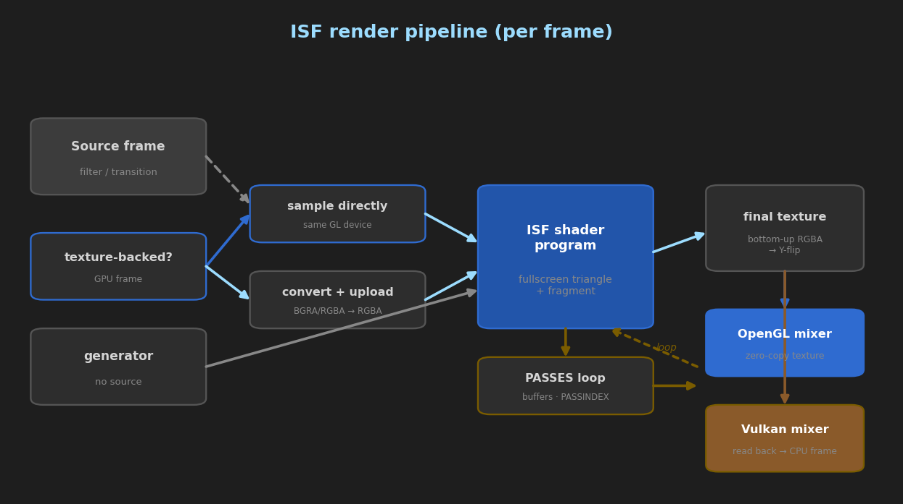
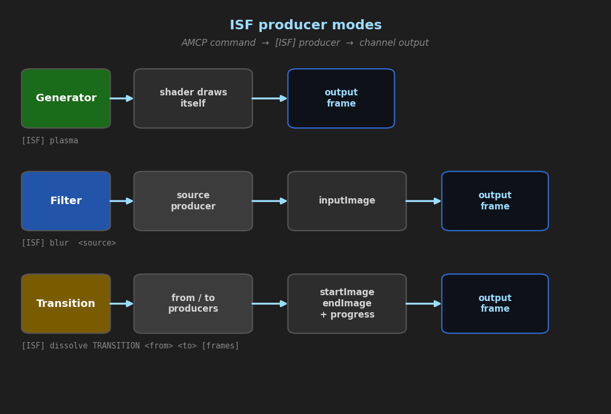
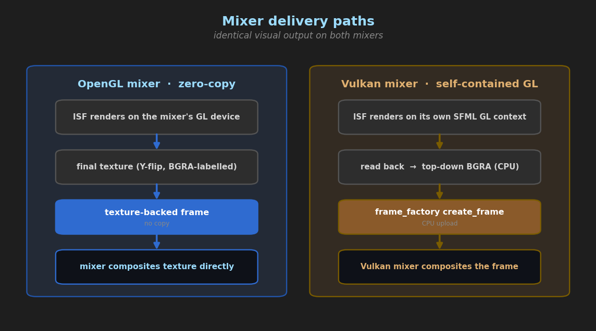
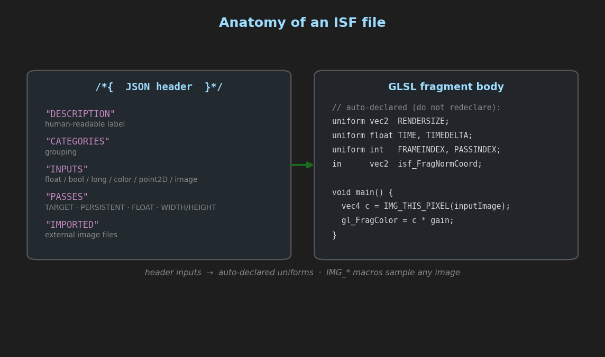
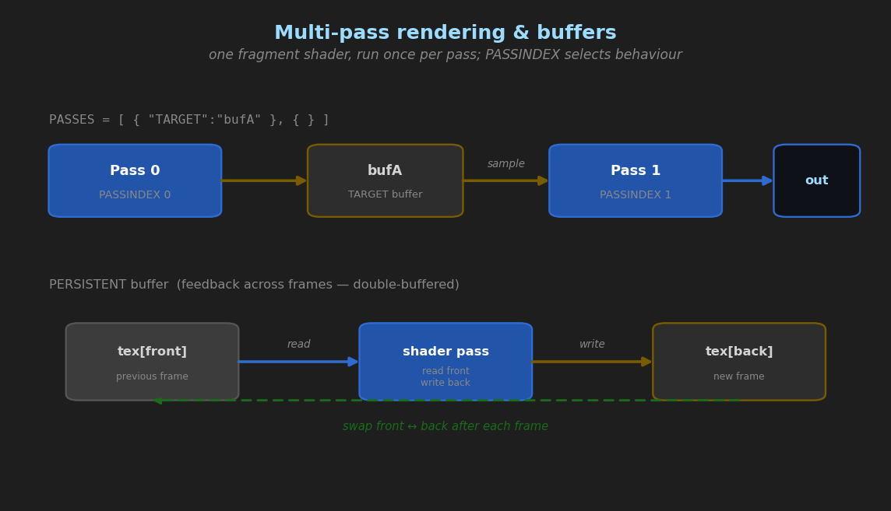

# CasparCG ISF (Interactive Shader Format) Module

> **State and measurements:** [`../features/isf-and-openfx.md`](../features/isf-and-openfx.md)
> **Implementation notes:** [`../architecture/OPENFX_IMPLEMENTATION.md`](../architecture/OPENFX_IMPLEMENTATION.md)
> **This document is how-to.** Per [`../README.md`](../README.md), measured figures live once in `features/`; a tolerance an operator acts on may appear here, the measurements behind it should not.

This document is both a **user manual** (how to play ISF shaders from AMCP) and a **shader-author
guide** (how to write/port ISF shaders that run efficiently in CasparCG).

The ISF module adds an `[ISF]` producer that runs [Interactive Shader Format](https://isf.video)
GLSL shaders as **generators**, **filters**, and **transitions**, rendered on the GPU.



---

## 1. User manual

### 1.1 Where shaders live

Place your shader files in the channel **media folder** (next to your clips), e.g.
`media/myshader.fs`. The following extensions are searched automatically: `.fs`, `.frag`, `.glsl`,
`.isf`, `.isf.fs`. You may also give an absolute path.

An optional custom vertex shader may sit next to the fragment shader with the same base name and a
`.vs` extension (e.g. `myshader.vs`).

### 1.2 AMCP syntax

| Mode | Command | Notes |
|------|---------|-------|
| Generator | `PLAY 1-10 [ISF] myshader` | No source; the shader draws itself. |
| Filter | `PLAY 1-10 [ISF] myshader <source-producer...>` | Wraps any producer; its frame is the shader's `inputImage`. |
| Transition | `PLAY 1-10 [ISF] myshader TRANSITION <from-source> <to-source> [frames]` | Blends `startImage`→`endImage` by `progress` over `frames` (default 25). |

Any mode also takes **`BIT_DEPTH 16`**, which renders and outputs at 16 bits per component:

```
PLAY 1-10 [ISF] myshader BIT_DEPTH 16
PLAY 1-10 [ISF] myshader BIT_DEPTH 16 mymovie   # filter mode; the option is stripped
                                                # before the source is resolved
```

**The depth follows the channel**, so a 16-bit channel renders 16-bit ISF with nothing said. `BIT_DEPTH` overrides it in either direction — `BIT_DEPTH 8` truncates for a receiver that needs 8, `BIT_DEPTH 16` forces precision on an 8-bit channel. The difference is visible rather than academic: measured on a 16-bit channel at 1080p, **256 distinct levels per component at 8-bit against 1920 at 16-bit**, and a smooth gradient bands at 256. Until this followed the channel the default was 8 whatever the channel was, so a 16-bit channel needed the parameter said explicitly.

It costs memory and bandwidth: the final pass target, the output texture and any CPU readback all double. Ask for it when the shader produces smooth gradients or feeds a grading chain, not by default.



Examples:

```
PLAY 1-10 [ISF] plasma
PLAY 1-10 [ISF] blur [FFMPEG] movie.mp4
PLAY 1-10 [ISF] gaussian_blur myclip.png
PLAY 1-10 [ISF] dissolve TRANSITION #FFFF0000 #FF0000FF 50
```

The source of a filter/transition may be **any** producer: a clip (`FFMPEG`), an image, a color, or
even another `[ISF]`/`[OFX]` effect (GPU frames are sampled directly with no read-back on the OpenGL
mixer).

### 1.3 Controlling parameters (`CALL`)

Inputs declared in the shader header can be listed and set at runtime:

```
CALL 1-10 ISF LIST
CALL 1-10 ISF SET <name> <v0> [v1 v2 v3]
```

- `ISF LIST` prints each input's `name type "label"`, plus `min`/`max`/`def` and (for `long`) `values`.
- `ISF SET` sets 1–4 scalar components:
  - `float`/`bool`/`long`: one value — `CALL 1-10 ISF SET gain 1.5`
  - `point2D`: two values — `CALL 1-10 ISF SET center 0.5 0.5`
  - `color`: four values (RGBA 0–1) — `CALL 1-10 ISF SET tint 1 0 0 1`
  - `event`: set to `1` to fire; it auto-resets to `0` after one rendered frame.

**A name the shader does not declare returns `402 CALL ERROR (unknown ISF input)`** — so a typo is
refused rather than silently ignored, and `ISF LIST` is how you get the exact spelling. An `ISF
LIST` or `ISF SET` on a layer that is not running an `[ISF]` producer returns an empty result rather
than an error, because the `CALL` never reaches this producer.

### 1.4 Mixer support

| Mixer (`<accelerator>`) | Path | Cost |
|-------------------------|------|------|
| `opengl` | Zero-copy: the shader renders straight into a mixer texture. | Fastest. |
| `vulkan` (default) | Self-contained GL context + CPU read-back into a frame the mixer uploads. | One GPU→CPU→GPU copy per frame. |

ISF works on **both** mixers with identical visual output. On the Vulkan mixer a GPU texture source
cannot be sampled directly, so such a source passes through unfiltered (use a CPU source — clip,
image, color — for filters/transitions under Vulkan).



---

## 2. Shader-author guide

### 2.1 Anatomy of an ISF file

An ISF file is a GLSL fragment shader with a **JSON header** in a leading `/* ... */` comment:

```glsl
/*{
    "DESCRIPTION": "Horizontal gradient with an adjustable gain.",
    "CATEGORIES": ["Generator"],
    "INPUTS": [
        { "NAME": "gain", "TYPE": "float", "DEFAULT": 1.0, "MIN": 0.0, "MAX": 2.0, "LABEL": "Gain" }
    ]
}*/

void main()
{
    vec2 uv = isf_FragNormCoord;          // [0,0] bottom-left .. [1,1] top-right
    gl_FragColor = vec4(uv.x * gain, uv.y * gain, 0.25, 1.0);
}
```



### 2.2 Input types

`INPUTS` is an array of dictionaries. Supported `TYPE`s:

| TYPE | GLSL uniform | Notes |
|------|--------------|-------|
| `float` | `float` | `DEFAULT`/`MIN`/`MAX` scalars. |
| `bool` | `bool` | |
| `event` | `bool` | Momentary; 1 for one frame after `ISF SET`. |
| `long` | `int` | Pop-up menu via `VALUES`/`LABELS`. |
| `point2D` | `vec2` | `DEFAULT`/`MIN`/`MAX` are 2-arrays. |
| `color` | `vec4` | `DEFAULT`/`MIN`/`MAX` are 4-arrays (RGBA). |
| `image` | `sampler2D` | A source image (see roles below). |

> Not yet supported: `audio` / `audioFFT` inputs.

### 2.3 Roles (conventions)

The module infers the shader's role from its image inputs:

- **Generator** — no image inputs.
- **Filter** — an `image` input named **`inputImage`**.
- **Transition** — `image` inputs **`startImage`** and **`endImage`** plus a float **`progress`**.

### 2.4 Standard uniforms (declared automatically — do not re-declare)

| Uniform | Meaning |
|---------|---------|
| `vec2 RENDERSIZE` | Output size in pixels of the current pass. |
| `float TIME` | Seconds since playback began. |
| `float TIMEDELTA` | Seconds since the previous frame (`1/fps`). |
| `int FRAMEINDEX` | Frame counter (0-based). |
| `int PASSINDEX` | Current pass index (see multi-pass). |
| `vec4 DATE` | `(year, month, day, seconds-in-day)`. |
| `vec2 isf_FragNormCoord` | Normalized fragment coordinate, `[0,0]` bottom-left. |

### 2.5 Sampling images

Use the ISF image macros instead of `texture()`:

```glsl
vec4 c  = IMG_THIS_PIXEL(inputImage);          // this fragment
vec4 c2 = IMG_NORM_PIXEL(inputImage, uv);      // normalized [0..1] coords
vec4 c3 = IMG_PIXEL(inputImage, pixelCoord);   // pixel coords
vec2 sz = IMG_SIZE(inputImage);                // that image's size in pixels
```

These resolve per-image size and orientation correctly, so the same shader works whether the image
is a source frame, an imported file, or a render-pass buffer.

### 2.6 Multi-pass rendering & buffers

Add a `PASSES` array to render several passes per frame. Each pass may render into a named `TARGET`
buffer that later passes (or the next frame) can sample by name:

```glsl
/*{
    "PASSES": [
        { "TARGET": "blurH", "WIDTH": "$WIDTH/2", "HEIGHT": "$HEIGHT/2" },
        { "TARGET": "accum", "PERSISTENT": true, "FLOAT": true },
        { }
    ]
}*/
```

Pass keys:

| Key | Meaning |
|-----|---------|
| `TARGET` | Name of the buffer to render into. Omit on the final (output) pass. |
| `PERSISTENT` | Buffer survives across frames (feedback / accumulators). Double-buffered. |
| `FLOAT` | 32-bit float buffer (`RGBA32F`) for high-precision accumulation. |
| `WIDTH` / `HEIGHT` | String equations for the buffer size. |

`WIDTH`/`HEIGHT` equations support `$WIDTH`, `$HEIGHT`, any input as `$inputName`, `+ - * / %`,
parentheses, and `floor/ceil/abs/sqrt/min/max/mod/pow/sin/cos/clamp`.

`PASSINDEX` tells the shader which pass is executing. A `PERSISTENT` buffer is read as the *previous*
frame's content while a new value is rendered, then swapped — ideal for motion trails.



### 2.7 Imported images

Bundle external images with `IMPORTED` (paths are relative to the shader file):

```glsl
/*{
    "IMPORTED": { "noiseTex": { "PATH": "noise.png" } }
}*/
...
vec4 n = IMG_NORM_PIXEL(noiseTex, isf_FragNormCoord);
```

### 2.8 Custom vertex shader

Provide a sibling `<name>.vs`. Call `isf_vertShaderInit()` first, then optionally adjust
`isf_FragNormCoord`:

```glsl
void main() {
    isf_vertShaderInit();
    isf_FragNormCoord = isf_FragNormCoord.yx; // e.g. swap axes
}
```

### 2.9 Porting Shadertoy / GLSL Sandbox shaders

- Replace `texture()`/`texture2D()` with `IMG_NORM_PIXEL()`.
- Use `RENDERSIZE` instead of `iResolution`, `TIME` instead of `iTime`.
- Write to `gl_FragColor` (declared for you); set `.a = 1.0` if the source ignores alpha.
- Use `isf_FragNormCoord` for normalized coordinates.

### 2.10 Performance tips

- Prefer the **OpenGL mixer** (`<accelerator>opengl</accelerator>`) for zero-copy generators/filters.
- Keep the number of `PASSES` and `PERSISTENT`/`FLOAT` buffers minimal; each costs GPU memory and
  bandwidth.
- Down-scale expensive passes with `WIDTH`/`HEIGHT` equations (e.g. blur at half resolution).
- Generators and effects are 8-bit RGBA end-to-end (pass buffers may be `FLOAT`).

---

## 3. Current limitations

- `audio` / `audioFFT` inputs are not implemented.
- On the Vulkan mixer, rendering uses a CPU read-back (not zero-copy), and GPU-texture-backed
  sources cannot be filtered (use a CPU source).
- 8-bit output; float precision is available only for intermediate `FLOAT` pass buffers.

---

## 4. Quick reference — example shaders

The module ships with test shaders under `media/` you can copy from:

| File | Demonstrates |
|------|--------------|
| `isftest.fs` | Generator + a float input. |
| `isf_passthrough.fs` | Filter (`inputImage`). |
| `isf_multipass.fs` | 2-pass `PASSES` with a `TARGET` buffer. |
| `isf_persist.fs` | `PERSISTENT` feedback accumulator. |
| `isf_imported.fs` | `IMPORTED` external image. |
| `isf_vstest.fs` / `.vs` | Custom vertex shader. |
| `isf_dissolve.fs` | Transition (`startImage`/`endImage`/`progress`). |
