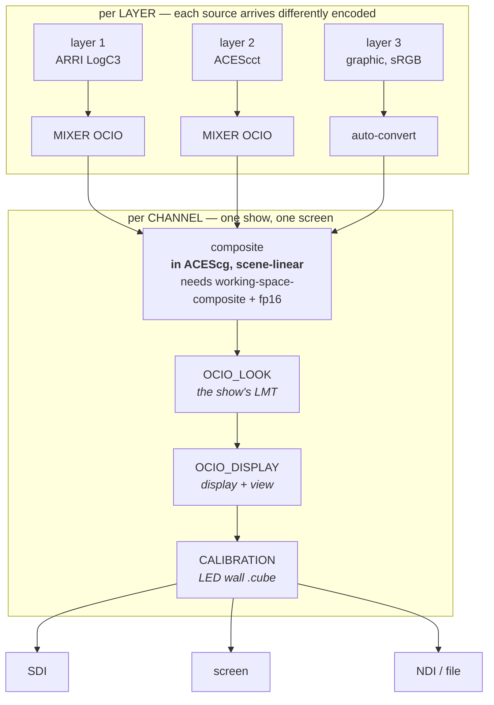
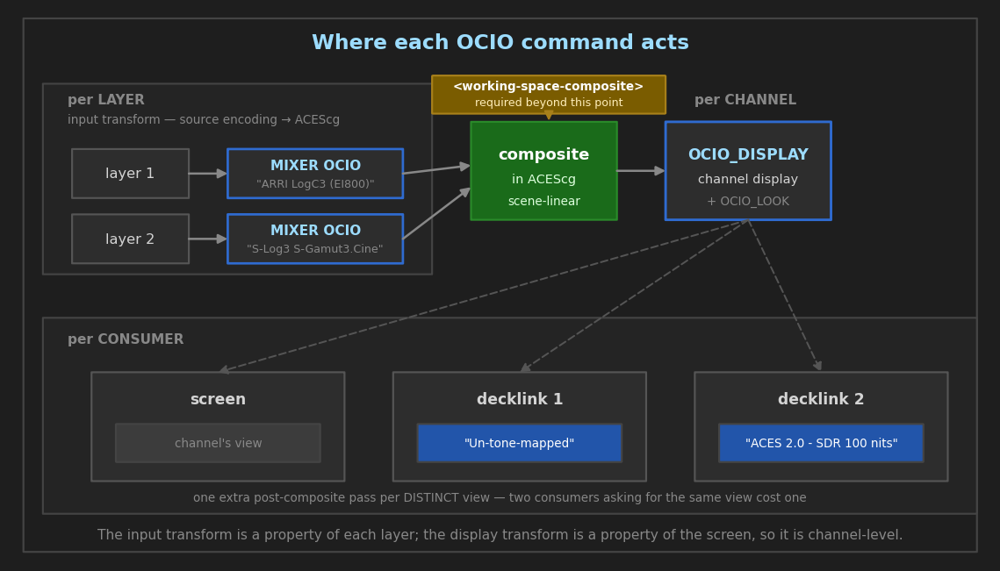
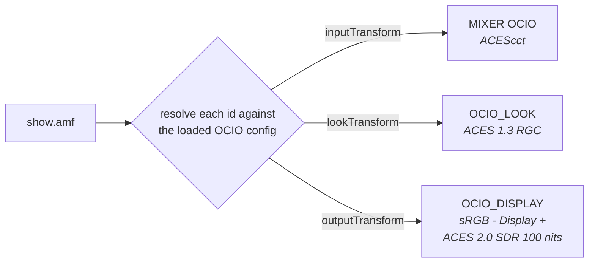

# OpenColorIO — operator guide

> **State and measurements:** [`../features/colour-grading-and-ocio.md`](../features/colour-grading-and-ocio.md)
> **Implementation notes:** [`../architecture/OCIO_INTEGRATION_STUDY.md`](../architecture/OCIO_INTEGRATION_STUDY.md)
> **This document is how-to.** Per [`../README.md`](../README.md), measured figures live once in `features/`; a tolerance an operator acts on may appear here, the measurements behind it should not.

How to drive OCIO on a running server: the commands, the config elements, what each refusal
means and how the pieces fit with the rest of the grading chain.

For *why* the integration is shaped this way, see
[`OCIO_INTEGRATION_STUDY.md`](../architecture/OCIO_INTEGRATION_STUDY.md). For where OCIO sits in the pixel
pipeline relative to the built-in tools, see [`COLOR_GRADING.md`](../guides/COLOR_GRADING.md).

---

## 1. Quote every name. This is the one that bites.

**48 of the 55 colour spaces in the bundled config contain spaces or parentheses**, and AMCP
tokenizes on whitespace. Every display and view name contains spaces too. Only seven names are
safe unquoted — `ACES2065-1`, `ACEScc`, `ACEScct`, `ACEScg`, `ADX10`, `ADX16` and `Raw` — so
quote everything rather than remembering which. (Counted from the config, 2026-08-16; an
earlier note here said 40.)

```
MIXER 1-1 OCIO "ARRI LogC3 (EI800)"     → 202 MIXER OK
MIXER 1-1 OCIO ARRI LogC3 (EI800)       → 404 MIXER ERROR
```

The unquoted form fails cleanly — it looked for a colour space named `ARRI` and did not find
one — but **the 404 says nothing about quoting**, so it reads as "that space does not exist"
when the space is fine and the quoting is not. If a name you can see in
`INFO OCIO COLORSPACES` comes back 404, check the quotes before anything else.

---

## 2. What OCIO does here, and when to use it instead of `MIXER COLORSPACE`

Three things, at three different stages — and **which stage a command belongs to is the
thing most worth getting straight**, because it decides whether it takes a layer or a
channel, and whether two layers can disagree about it:

| | command | scope | stage |
| :--- | :--- | :--- | :--- |
| **Input transform** | `MIXER … OCIO` | one **layer** | source encoding → the mixer's ACEScg working space |
| **Look (LMT)** | `OCIO_LOOK` | one **channel** | the show's look, in the working space, after compositing |
| **Display transform** | `OCIO_DISPLAY` | one **channel** | working space → what the screen wants |



**Why the split is where it is.** An input transform says where pixels *came from*, which
differs per layer. A look says what the *show* looks like and a display transform says what
*screen* it is going to — and every layer of one composite belongs to one show and goes to
one screen. Two layers disagreeing about either would mean compositing a PQ-encoded picture
with a Rec.709 one, which is not a picture in any colour space.

A consumer may override the **view** (§6.2) — but not the look, which is why `OCIO_LOOK`
sits above the fan-out in the diagram: the view is the screen, the look is the intent.

Two commands do not appear above because they are not stages — they are ways of *addressing*
the stages that already exist:

| | what it sets | equivalent to |
| :--- | :--- | :--- |
| `AMF` (§5.4) | all three at once, from a show's ACES Metadata File | `MIXER OCIO` + `OCIO_LOOK` + `OCIO_DISPLAY` |
| `MIXER CDL_FILE` | the per-layer ASC CDL grade, from a `.cdl`/`.ccc` | `MIXER CDL` with the same numbers |

The input transform is the alternative front end to `MIXER COLORSPACE`. Both write the same
stage of the chain, so **they are mutually exclusive** — see §7.



**Which path to use, and what it costs, is documented once** — in
[`COLOR_GRADING.md` § Which path](COLOR_GRADING.md#which-path--the-short-version), beside the
comparison of the two. It is not repeated here: two copies of a recommendation drift, and the
one that drifts is always the copy the reader happened to open.

---

## 3. Requirements

**Build.** OCIO must be compiled in (`ENABLE_OCIO`, which defines `CASPAR_ENABLE_OCIO`). A
server built without it answers `501 MIXER FAILED` to `MIXER OCIO` and `501 OCIO_DISPLAY
FAILED` to `OCIO_DISPLAY`, and returns empty lists from the discovery commands rather than
pretending. Check with `INFO OCIO`.

**Config.** A built-in ACES studio config is pinned and loaded on demand:

```
ocio://studio-config-v4.0.0_aces-v2.0_ocio-v2.5
```

Nothing needs configuring to use it. To use your own, see §6.

**For `OCIO_DISPLAY` only** — the channel must composite in the working space:

```xml
<channel>
    <video-mode>1080p5000</video-mode>
    <render-format>fp16</render-format>          <!-- required -->
    <auto-color-convert>true</auto-color-convert> <!-- required -->
    <working-space-composite>true</working-space-composite>
</channel>
```

All three, and the server refuses to start if the first two are missing when the third is
set. A scene-linear ACEScg composite carries values outside `[0,1]`, which a unorm target
would clamp; and every layer needs a defined route into the working space, or it reaches the
composite still display-encoded.

> **`<working-space-composite>` changes how layers blend**, independently of OCIO: they mix
> in scene-linear light rather than in display-encoded values. Existing looks that relied on
> display-space blending will change. The server logs this at startup.

---

## 4. Discovering what this server has

The operator surface goes from ~20 documented enums to hundreds of config-defined strings.
The intent is that nobody types one — a client populates its controls from the server:

```
INFO OCIO              availability, OCIO version, the loaded config URI, and how many
                       colour spaces and displays it has
INFO OCIO COLORSPACES  every colour space name in the loaded config
INFO OCIO DISPLAYS     every display, with its views nested underneath
INFO OCIO LOOKS        every look (LMT) name in the loaded config
```

Use these rather than a hardcoded list. A client whose list drifts from the server's config
produces show files that reference a colour space which no longer exists.

---

## 5. The commands

### 5.1 `MIXER <ch>-<layer> OCIO` — per-layer input transform

```
MIXER 1-1 OCIO                        query — the layer's space, or NONE
MIXER 1-1 OCIO "ACEScct"              set
MIXER 1-1 OCIO NONE                   clear, back to the built-in path (OFF also accepted)
```

The name is validated **when the command runs**, against the loaded config — and not only
for existence: the server builds the GPU transform there and then. A space can exist and
still fail to produce one (a missing LUT file behind a `FileTransform`, an unresolvable
role), and that difference matters, because by the time the mixer needs the transform there
is no way to report a failure except by rendering something wrong. Both cases are refused up
front, so a bad name fails the command and never the frame.

### 5.2 `OCIO_DISPLAY <channel>` — channel display transform

```
OCIO_DISPLAY 1 "Gamma 2.2 Rec.709 - Display" "ACES 2.0 - SDR 100 nits (Rec.709)"
OCIO_DISPLAY 1 NONE                   clear (OFF also accepted)
OCIO_DISPLAY 1                        query (INFO also accepted)
```

**Channel-level, and that is not a simplification.** An input transform describes where
pixels came from, which is a property of each layer. A display transform describes what
screen they are going to, and every layer in a channel goes to the same screen — two layers
with different display transforms would blend a PQ-encoded layer with a Rec.709-encoded one,
and that composite is not in any colour space.

Both arguments are required and both must be quoted.

> **An HDR view does not signal HDR.** A display transform decides how the pixels are
> *encoded*; what a consumer *says* they are still comes from the channel's `<color-depth>`,
> `<color-space>` and `<color-transfer>`, and nothing checks that the two agree. If the view
> you pick is one of the nine `ACES 2.0 - HDR …` ones, set those channel fields to match —
> the pairing table is in
> [`HDR_GUIDE.md` § Two routes to an HDR channel](HDR_GUIDE.md#two-routes-to-an-hdr-channel-built-in-vs-ocio),
> which also covers what the view switches off (`<auto-tone-map>` among it).

### 5.3 `OCIO_LOOK <channel>` — the channel's LMT (show look)

```
OCIO_LOOK 1 "ACES 1.3 Reference Gamut Compression"
OCIO_LOOK 1 "-ACES 1.3 Reference Gamut Compression"   invert it
OCIO_LOOK 1 "first,second"                            chain, in order
OCIO_LOOK 1 NONE                                      clear (OFF also accepted)
OCIO_LOOK 1                                           query (INFO also accepted)
```

A **look** (LMT) is a creative or technical transform applied to the scene-referred image
**before** the display rendering — the show LUT of an ACES pipeline. Channel-level for the
same reason `OCIO_DISPLAY` is: every layer of one composite belongs to one show. It applies
to the primary **and to every consumer view**, because a consumer asking for a different
view still wants the show's look.

`INFO OCIO LOOKS` lists what the loaded config offers. The bundled config defines exactly
one — `ACES 1.3 Reference Gamut Compression` — so this is mostly useful with your own
config via [`<ocio-config>`](#61-ocio-config--use-your-own-config).

> **It requires `OCIO_DISPLAY` to be set, and refuses with 403 otherwise.** The look is
> *composed into* the display processor rather than spliced separately: that keeps the
> shader-variant cache keyed on the (input, output) pair it already used, and lets OCIO
> optimise the look and the view together. The cost is that there has to be a display
> transform for it to ride on. It refuses rather than storing the look for later, because a
> command that returns `202` and changes nothing is the worst of the available behaviours.

**Measured 2026-08-16, both mixers byte-identical.** Against `sRGB - Display` /
`ACES 2.0 - SDR 100 nits (Rec.709)`, with the look off and on:

| patch | look off | look on | Δ |
| :--- | :--- | :--- | ---: |
| neutral `#808080` | `(92, 92, 92)` | `(92, 92, 92)` | **0.0** |
| saturated blue `#0D05E6` | `(1, 0, 164)` | `(8, 37, 171)` | **37.0** |
| saturated red `#E60D0D` | `(174, 17, 8)` | `(175, 22, 24)` | **16.0** |

That is the signature a gamut-compression look should have — in-gamut neutrals untouched,
saturated primaries pulled in — and it is why "the command was accepted" and "the look ran"
are separable here rather than taken on trust.

Gated by `cli.py ocio-look`, which captures every patch in **both** states and compares each
against OCIO's CPU processor for that state: 6/6 within `max(1 LSB, fp16 band)`, worst 0.65,
both mixers byte-identical. Two of its four saturated patches move 0.00 because they sit in
a region this look leaves alone — they gate the model, but only the movers distinguish a live
command from one that returned `202` and did nothing.

> **Not the same as `MIXER GAMUTCOMPRESS`.** The built-in operator shares ACES 1.3's
> *limits* and not its algorithm; this look is the reference implementation. See
> [`COLOR_GRADING.md`](COLOR_GRADING.md#gamut-compression) for the measured difference.

### 5.4 `AMF <channel>-<layer>` — configure everything from a show's metadata

```
AMF 1-10 "show.amf"        input transform, look and display, from one file
```

An **ACES Metadata File** is the document a production carries to say which input transform,
which look and which output transform its pipeline uses. Loading one sets all three at once —
it is a way of *addressing* the commands above, not a fourth colour path.



**The mapping is mechanical, not a lookup table someone maintains.** OCIO configs carry the
AMF transform IDs themselves, under `interchange: amf_transform_ids`, so an ID resolves
through whichever config is loaded and a config change moves the IDs along with the
transforms they name. Point the server at your own config (§6.1) and your own AMFs resolve
against it. 86 IDs resolve from the bundled config.

One detail worth knowing, because it looks like it should be a problem and is not: an
`outputTransform` is a single ID, while `OCIO_DISPLAY` needs a display **and** a view. That
ID appears on exactly one colour space — whose name is also the display — and on one view
transform. The pair is determined, not guessed.

**It resolves everything before it applies anything.** Three settings from one file must not
leave a channel half configured because the third ID was unknown; the operator would be
looking at a picture that is neither the old look nor the new one. Display is applied before
look, which is forced rather than chosen — `OCIO_LOOK` is composed into the display processor
and refuses when there is no display transform yet.

The `aces:` namespace prefix is convention rather than specification, so a file using a
different prefix is accepted. Refused with `404`: a missing file, malformed XML, an ID that
does not resolve against the loaded config, and an `outputTransform` that yields only half a
display/view pair.

**Measured, both mixers, byte-identical.** Applying an AMF renders **0.00** away from
issuing `MIXER OCIO`, `OCIO_LOOK` and `OCIO_DISPLAY` by hand with the same IDs resolved
independently — a comparison between two frames the server produced, so no colour model is
involved. An AMF differing in exactly one node renders **68 LSB** away, which is what makes
"the file was read" falsifiable rather than assumed. `cli.py amf`.

> Design rationale and the evidence that the mapping is mechanical:
> [`AMF_SUPPORT_STUDY.md`](../plans/AMF_SUPPORT_STUDY.md).

---

## 6. Config elements

### 6.1 `<ocio-config>` — use your own config

```xml
<configuration>
    <ocio-config>C:\shows\myshow\config.ocio</ocio-config>
</configuration>
```

Accepts a filesystem path or an `ocio://` built-in URI. Omit it and the pinned config above
is used.

**A bad value stops the server at startup**, deliberately. Loading keeps the previous config
on failure, so a warning would leave the server running the built-in config while the
operator believes their own is loaded — every look silently wrong, and nothing in the log
after startup to say so. It also fails fast if the build has no OCIO support.

The startup line confirms what loaded:

```
[server] OCIO config <uri> (55 colour spaces, 9 displays)
```

### 6.2 `<ocio-display>` / `<ocio-view>` — a consumer with its own view

One composite can be shown several ways at once: the channel's `OCIO_DISPLAY` is the
default, and any consumer may override it. Supported by the **DeckLink** and **screen**
consumers.

```xml
<consumers>
    <decklink>
        <device>1</device>
        <ocio-display>Gamma 2.2 Rec.709 - Display</ocio-display>
        <ocio-view>ACES 2.0 - SDR 100 nits (Rec.709)</ocio-view>
    </decklink>
    <screen>
        <ocio-display>Gamma 2.2 Rec.709 - Display</ocio-display>
        <ocio-view>Un-tone-mapped</ocio-view>
    </screen>
</consumers>
```

**Both elements or neither** — a consumer with one and not the other is refused. Requires
`<working-space-composite>` on the channel, for the same reason `OCIO_DISPLAY` does. The
mixer renders one extra pass per *distinct* view, so two consumers asking for the same view
cost one.

---

## 7. How OCIO interacts with the rest of the grading chain

**Mutually exclusive with `MIXER COLORSPACE`.** Setting one while the other is active is
refused — `403 MIXER ERROR` — in both directions, rather than silently overriding. An
operator who set a COLORSPACE and then an OCIO space has contradicted themselves, and quietly
picking one produces a look nobody chose. Clear the other first:

```
MIXER 1-1 COLORSPACE NONE
MIXER 1-1 OCIO "ACEScct"
```

**What still applies to an OCIO layer:**

| command | on an OCIO layer |
| :--- | :--- |
| `MIXER EXPOSURE` | **yes** — and it is the only exposure an OCIO layer can be given |
| `MIXER GAMUTCOMPRESS` | **yes** |
| `MIXER CDL`, `LIFT`/`MIDTONE`/`GAIN`, curves, LUTs, the rest of the grade | yes — they run after the working-space conversion |
| `MIXER COLORSPACE`'s 6th argument (exposure) | **no** — that lives in the COLORSPACE state, which is mutually exclusive |

`MIXER GAMUTCOMPRESS` reaching OCIO layers was a fix, not a design: the compressor sat inside
the block the OCIO splice replaces, so before 2026-08-13 the command returned `202`, set its
uniform and never ran.

---

## 8. Refusals, and what each one means

| code | command | meaning |
| :--- | :--- | :--- |
| `404 MIXER ERROR` | `MIXER OCIO` | the name is not a colour space in the loaded config — **check quoting first** (§1), then `INFO OCIO COLORSPACES` |
| `404 MIXER ERROR` | `MIXER OCIO` | the space exists but no GPU transform could be built from it — usually a missing file behind a `FileTransform` in a custom config; the log line says which |
| `403 MIXER ERROR` | `MIXER OCIO` | `MIXER COLORSPACE` is active on this layer — clear it first (§7) |
| `501 MIXER FAILED` | `MIXER OCIO` | this server was built without OCIO support |
| `400 OCIO_DISPLAY FAILED` | `OCIO_DISPLAY` | display given without a view, or vice versa — both are required |
| `404 OCIO_DISPLAY ERROR` | `OCIO_DISPLAY` | that display/view pair is not in the config — check quoting, then `INFO OCIO DISPLAYS` |
| `403 OCIO_DISPLAY ERROR` | `OCIO_DISPLAY` | the channel does not composite in the working space — add `<working-space-composite>` and its two prerequisites (§3) |
| `501 OCIO_DISPLAY FAILED` | `OCIO_DISPLAY` | built without OCIO support |

Every refusal also writes a `[ocio]` warning naming the cause. When a command returns a code
you did not expect, the log line is more specific than the code.

---

## 9. Worked example

A LogC3 camera feed on layer 1, graded in ACEScg, shown on a Rec.709 monitor and sent to SDI
un-tone-mapped for a downstream grade.

```xml
<channel>
    <video-mode>1080p5000</video-mode>
    <render-format>fp16</render-format>
    <auto-color-convert>true</auto-color-convert>
    <working-space-composite>true</working-space-composite>
    <consumers>
        <decklink>
            <device>1</device>
            <ocio-display>Gamma 2.2 Rec.709 - Display</ocio-display>
            <ocio-view>Un-tone-mapped</ocio-view>
        </decklink>
        <screen />
    </consumers>
</channel>
```

```
INFO OCIO COLORSPACES                                   discover the exact spelling
PLAY 1-1 DECKLINK DEVICE 2
MIXER 1-1 OCIO "ARRI LogC3 (EI800)"                     source → ACEScg
MIXER 1-1 EXPOSURE 1.2                                  a stop and a bit, in the working space
OCIO_DISPLAY 1 "Gamma 2.2 Rec.709 - Display" "ACES 2.0 - SDR 100 nits (Rec.709)"
```

The screen consumer takes the channel's view (tone-mapped Rec.709); the DeckLink overrides it
with `Un-tone-mapped`. The mixer renders two post-composite passes, one per distinct view.

---

## 10. Known limits

- **Colour space names are config-defined, and a show file records the string.** Change the
  config and a stored name may no longer resolve. `MIXER OCIO` refuses at command time rather
  than rendering something wrong, so this surfaces as a 404 on recall rather than as a bad
  look — but it does surface at recall.
- **No `$OCIO` environment-variable route.** The config comes from `<ocio-config>` or the
  pinned built-in; the standard OCIO environment variable is not consulted.
- **`OCIO_DISPLAY` needs `<working-space-composite>`**, which is a channel-wide change to how
  layers blend. It is not something to turn on mid-show.
