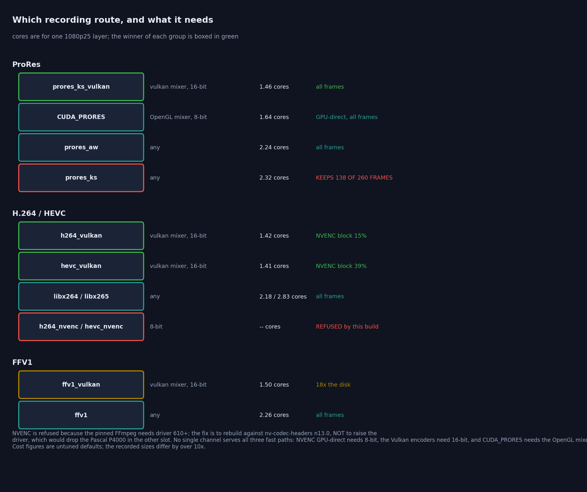
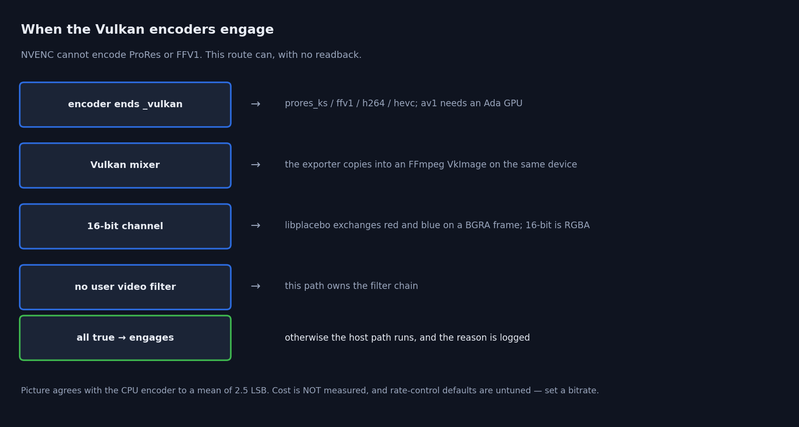

# Pipeline Efficiency — Operations Guide

> How to get the efficient paths, how to tell whether you are on them, and what
> limits a channel. Practical companion to `GPU_OPTIMIZATION_PLAN.md`, which
> carries the reasoning, the measurements and the rejected ideas.

Every figure and number here is measured on the reference rig (Quadro P4000 +
RTX A4000, PCIe 3.0 x16). Re-measure before trusting them elsewhere — the
harnesses are in `CasparCG-TestRunner/vkdispatch/`.

---

## 1. The one thing to know

**Host→GPU upload bandwidth is what limits how many layers a channel can carry.**
Not composition, not layer pulling, not the mixer's threading. Everything else
measured under 10 % of a frame even on a channel running at half rate.


Bytes per frame per layer decide the ceiling, and they are a property of the
**source file**, not of the server:

| source | MB per 1080p frame | layers at 1080p50 | at 1080p25 |
|---|---|---|---|
| 8-bit 4:2:0 (H.264/HEVC, NV12) | 3.0 | ~60 | ~120 |
| 10-bit 4:2:0 | 5.9 | ~30 | ~60 |
| 8-bit RGBA | 8.3 | ~22 | ~44 |
| 16-bit RGBA + alpha (NotchLC, ProRes 4444) | 15.0 | ~12 | ~24 |
| Hap DXT1, via the `HAP` producer | 1.0 | ~180 | ~360 |
| Hap Alpha / Hap Q / Hap R, via the `HAP` producer | 2.0 | ~90 | ~180 |

Measured plateau **9.1 GB/s**, about three quarters of the practical throughput
of a PCIe 3.0 x16 link.

**Practical consequences**

- Prefer 8-bit 4:2:0 for anything that does not need more. It is 5× cheaper than
  16-bit RGBA and the difference is the whole layer budget.
- Ten-bit and 4:4:4 content costs twice its 8-bit equivalent — since the fix in
  §3 it is no longer being silently truncated, which is correct but is a real
  change to headroom if you run many such layers.
- Do not benchmark with lossless RGBA (NotchLC, ProRes 4444, `bars.mov`). It
  costs five times ordinary material and will mislead you about capacity.
- For ProRes and NotchLC specifically, the `CUDA_PRORES` / `CUDA_NOTCHLC`
  producers avoid the upload entirely — see §3.1. That is the single largest
  lever available for those formats, with one caveat about alpha.
- Hap is the cheapest source on the bus by a wide margin, because the compressed
  texture is what gets uploaded — but only through the `HAP` producer. An
  ordinary `PLAY` sends the file through ffmpeg, which decompresses to RGBA on
  the CPU and uploads the full 8.3 MB. See §3.2.

---

## 2. What the channel does each tick


Four phases, all published under `tick` in `INFO <channel>`:

| phase | what it is |
|---|---|
| `produce` | pulling every layer from its producer |
| `mix` | composition, LUT passes, **and waiting for the frame's uploads** |
| `consume` | handing the frame to every consumer |
| `osc` | publishing state to OSC subscribers |

### Read `consume` as the clock, not as cost

A large `consume` is **healthy** — it is the consumer pacing the channel. Watch
it shrink as `mix` grows: that is back-pressure absorbing load, and the tick
stays exactly at nominal while it can. In the figure, `consume` falls 19.9 → 16.7
ms as layers are added and the channel holds 20.00 ms throughout.

**`consume` approaching zero is the warning sign.** The slack is spent, and the
next increment of `mix` makes the channel late.

---

## 3. Getting the efficient producer path


Most of this is automatic now. What is worth knowing:

**Progressive files skip the deinterlacer.** When the container explicitly
declares `field_order=progressive`, `bwdif` is left out of the graph. It was only
ever a pass-through on progressive frames, but its format constraints applied to
everything — measured **~18 % of total server CPU** on twelve layers of
hardware-decoded H.264.

- Containers that say `unknown` keep the deinterlacer. That is deliberate and
  conservative; check with
  `ffprobe -show_entries stream=field_order` if a file seems more expensive than
  its neighbours.
- If a container lies and delivers interlaced frames, the deinterlacer is
  restored at the next filter rebuild and the reason is logged.
- `auto-deinterlace=all` disables the optimisation by design — it means you want
  every frame deinterlaced.

**The mixer now receives each source's native format.** Nothing is silently
converted to fit a filter's preferences. In particular 10-bit stays 10-bit and
4:4:4 stays 4:4:4, where both used to be reduced to 8-bit 4:2:0 before the mixer
ever saw them.

**GPU-direct decode** (the dashed path) bypasses host memory entirely. **On by default**
since the byte-identity verification it was waiting for was performed (`cli.py
gpu-direct-parity`, 0 differing pixels on both mixers); turn it off with
`configuration.ffmpeg.producer.gpu-direct-decode`. **It works on both
mixers**: OpenGL bridges the decoded surface with `WGL_NV_DX_interop2`, Vulkan
imports it through `VK_KHR_external_memory_win32`. Until 2026-08-01 the Vulkan
mixer declined the path outright, so choosing Vulkan meant silently giving up
hardware decode.

Measured at four layers of 1080p25, against the same clips on the *same mixer's*
software path — comparing across mixers would fold their own costs in:

| codec | mixer | software | GPU-direct | saving |
|---|---|---|---|---|
| H.264 8-bit 4:2:0 | OpenGL | 2.01 cores | 1.22 | **39 %** |
| H.264 8-bit 4:2:0 | Vulkan | 1.96 | 1.16 | **41 %** |
| HEVC 8-bit 4:2:0 | OpenGL | 1.99 | 1.26 | **37 %** |
| HEVC 8-bit 4:2:0 | Vulkan | 1.87 | 1.16 | **38 %** |
| VP9 | OpenGL | 2.04 | 1.26 | **38 %** |
| VP9 | Vulkan | 1.85 | 1.14 | **38 %** |
| MPEG-2 | OpenGL | 2.55 | 2.15 | 16 % |

The picture is byte-identical to the software path on both mixers, and the two
mixers' GPU-direct output is byte-identical to each other. That is worth stating
plainly: this path hands the mixer the NV12 planes and lets it do the colour
conversion, rather than converting with the D3D11 VideoProcessor whose matrix
and range behaviour is driver-defined. There is no colour risk to weigh against
the CPU saving.

> **Measure this with a clip longer than the run, and do not loop it.** The
> earlier figures in this table were taken on a 4-second clip with `LOOP`, and
> GPU-direct stalled at the loop point (`Waiting for video frame...`, on *both*
> mixers). A window that starts after the loop therefore compares a stalled producer
> against a working one and reports the stall as a saving.
>
> **That stall no longer reproduces on the D3D11 path**: three separate runs on
> 2026-08-21 with `D3D11 GPU-direct video active` and `LOOP` over several wraps logged
> `Waiting for video frame` **zero** times. Those runs were only 6 seconds each, so this
> is "did not reproduce", not "proven fixed" — but the advice above stands on its own
> merits regardless of the stall, so measure that way anyway.
>
> **It IS newly true of `<vulkan-decode>`**, which is a different path: measured
> 2026-08-21, that route drops a frame every ~3 seconds on a 3-second looping clip
> (28 `fps` samples below nominal in a 24-second window against 0 for software), with
> `frame-time` spikes of 3.3-3.5 against a 0.51 mean. See
> [`FFMPEG_8_MIGRATION.md`](../architecture/FFMPEG_8_MIGRATION.md) §6.1.2; it is why that option stays
> opt-in. `gpudirect/cpu_matrix.py` now
> uses 90-second clips, plays without `LOOP`, and fails the row if the log
> contains `Waiting for video frame`.

**The Vulkan path's cross-API wait.** D3D11 writes the two plane textures on its
own queue and Vulkan reads them on another, so the CPU must order them; OpenGL
needs no equivalent because `wglDXLockObjectsNV` synchronises for it. The wait is
1.1–5.3 ms per frame at four layers, which is real but is *latency on the
producer's decode thread*, not CPU — as long as it blocks rather than spins. It
is an `ID3D11Fence` waited on through a Win32 event, and the signal is issued
under the decoder's lock while the wait happens outside it. Polling a
`D3D11_QUERY_EVENT` instead (the fallback where D3D11.4 is unavailable) measured
1.44 cores against the fence's 1.16 — the spin gave back a third of everything
the path saves.

**Which codecs.** There is no hardcoded list — the producer asks
`avcodec_get_hw_config()` whether the *decoder* supports D3D11VA, so the answer
depends on the build and the GPU. Seven decoders advertise it here: `av1`,
`h264`, `hevc`, `mpeg2video`, `vc1`, `vp9`, `wmv3`. Advertising is not the same
as engaging:

- **confirmed working** — H.264, HEVC, MPEG-2, VP9, AV1
- **untested** — VC1, WMV3

> AV1 declined until 2026-08-02, with the same *"decoder is not using D3D11VA"*
> as VP9 and for the same reason: `avcodec_find_decoder(AV_CODEC_ID_AV1)`
> resolves to `libdav1d`, which advertises no hwaccel, so the producer never
> attached a hardware device context. It was **unreachable rather than
> untested** — the `av1` in the advertising list above is a decoder the producer
> never asked for. See the AV1 section below, because unlike VP9 the fix could
> not simply reverse the choice.

> VP9 declined until 2026-08-01, logged as *"decoder is not using D3D11VA"*.
> The producer forced `libvpx-vp9` for every VP8/VP9 file, because libvpx is the
> only decoder that reads alpha out of a WebM — but that applied to files with
> no alpha too, and libvpx is software-only. It is now chosen per file, from the
> `alpha_mode` the Matroska demuxer puts in stream metadata. **A VP9 file with
> alpha still decodes in software and will not reach GPU-direct** — that is
> inherent, not a gap: no hardware decoder produces the alpha plane.

**It declines, with a logged reason, for:** any video filter (`-vf`), interlaced
content, a framerate that does not match the channel, auto-deinterlace being
active, a codec whose decoder is not using D3D11VA, or the bridge failing to
initialise. Read the log rather than inferring from timings — a silent fallback
looks exactly like a codec with no benefit.

The Vulkan mixer is no longer on that list: since `489b02fbc` it has its own
bridge (`d3d11_import_bridge`), so GPU-direct runs on both backends. That does
put a requirement on multi-GPU setups — the decoder's D3D11 device has to be on
the same adapter as the mixer, or the shared handles are not importable
(*"this D3D11 handle is not importable (result=-3)"*) and the channel drops to
the host transfer path. The adapter is matched to the mixer's GPU by LUID as of
`cdaa530a8`; `configuration.ffmpeg.producer.hardware-decode-adapter` overrides
it if enumeration and the mixer ever disagree.

### 10-bit decoding

Works, and both paths now agree. Per codec, measured:

| source | hardware decode | GPU-direct | reaches the mixer as |
|---|---|---|---|
| HEVC Main 10 | **yes** (NVDEC) | **yes** — no host copy at all | 10-bit |
| H.264 High 10 | no — NVDEC cannot | stands down to software, logged | `yuv420p10le` |
| ProRes (via the ffmpeg producer) | software | n/a | native 10-bit |
| ProRes (via `CUDA_PRORES`) | **GPU** | n/a — decodes straight into a texture | see §3.1 |
| v210, DNxHR | software | n/a | native 10-bit |

Both 10-bit paths measure **39.63 dB** against an external reference decode —
the same as every other 4:2:0 clip, where the residual is chroma upsampling
differing between GPU sampling and swscale.

**Hardware and software now agree to 75.0 dB.** They used to differ by ~46 dB,
because the software path ran through a filter graph that truncated it to 8-bit
while GPU-direct handed the mixer the true 10-bit planes. That was recorded in
the gpudirect harness as a known quirk; it is fixed, and a difference there now
means a real regression.

Nothing needs configuring for this. 10-bit content that can be hardware-decoded
is, 10-bit content that cannot falls back and keeps its depth either way.

### AV1 — hardware-decoded, but only where it can be

AV1 is decoded by hardware when the adapter and the stream allow it, and by
`libdav1d` otherwise. Nothing to configure; the log says which ran and why.

Measured, 20 s of 1080p10 AV1 at 6 Mbps:

| decoder | CPU | cores/layer at realtime |
|---|---|---|
| `libdav1d` (what ran before 2026-08-02) | 4.69 s | 0.23 |
| native `av1` on D3D11VA | 0.28 s | **0.014** |
| `av1_cuvid` | 0.50 s | 0.025 |

Output is unchanged: 40/40 in the harness at **44.8 dB**, the same as before, and
hardware and software captures are **bit-identical** — including on a clip that
genuinely carries film grain, which was the one place they were entitled to
differ (dav1d synthesises grain in software, the decoder does it in hardware).

**Why this needs a gate at all, when VP9 did not.** FFmpeg's native `av1` decoder
is hwaccel-only. It has no software path, so on a stream or adapter it cannot
handle it does not run slower — it fails outright:

```
Your platform doesn't support hardware accelerated AV1 decoding.
Error submitting packet to decoder: Function not implemented
```

which is a black channel. `av1_cuvid` is no better: a pure hardware wrapper that
returns `CUDA_ERROR_NOT_SUPPORTED`. Only `libdav1d` and `libaom-av1` decode AV1
in software. So the decoder is chosen rather than simply switched:

- **Profile 0 only.** Profile 0 (Main) is 4:2:0 8/10-bit by specification;
  Profile 1 is 4:4:4 and Profile 2 is 12-bit, and no hardware decodes those.
  **They stay on `libdav1d` by necessity, not by omission.** The gate reads the
  profile from the container rather than the pixel format, because
  `codecpar->format` can still be `NONE` before the first frame.
- **The adapter must say so**, via `ID3D11VideoDevice::CheckVideoDecoderFormat`
  for `AV1_VLD_PROFILE0` against NV12 and P010 — a static query, asked once per
  adapter, on the adapter the decoder will actually use. Per adapter and not per
  process because the answer differs between cards: on the reference rig the
  A4000 reports *"Profile 0, 8- and 10-bit"* and the P4000 *"not supported"*, so
  the same file hardware-decodes on one channel and falls back on another.

```
configuration.ffmpeg.producer.av1-decoder = auto | hardware | software
```

`auto` is the default and is what the above describes. `software` forces
`libdav1d` — the escape hatch if a driver claims a capability it does not have.
`hardware` bypasses the gate entirely and is a diagnostic, not a setting to
deploy: pointed at a 4:4:4 file it produces exactly the failure above.

The AV1 fixtures in the test matrix exist for this gate specifically —
`av1_444` (Profile 1) and `av1_12bit` (Profile 2) must keep decoding in
software, and `av1_filmgrain` must keep matching software output.

### 3.1 The CUDA producers — ProRes and NotchLC

These are **separate producers**, selected by a token as the first parameter, not
a flag on an ordinary `PLAY`:

```
PLAY 1-10 CUDA_PRORES  <file> [LOOP] [SEEK n] [LENGTH n] [OUT n] [SPEED x]
                              [DEVICE n] [COLOR_MATRIX 709|2020|601|AUTO]
PLAY 1-10 CUDA_NOTCHLC <file> ...
```

They decode on the GPU and hand the mixer a texture they allocated themselves,
so **the uncompressed frame is never uploaded** — only the compressed bitstream
crosses the bus. Since upload bandwidth is what limits layer count (§1), this
does not merely save CPU; it removes the clip's contribution to the binding
constraint almost entirely.

Measured, 1080p25, against the same files through the ffmpeg producer:

| clip | layers | ffmpeg producer | `CUDA_PRORES` | saving |
|---|---|---|---|---|
| ProRes 422 HQ | 6 | 2.55 cores | 1.35 | 47 % |
| ProRes 422 HQ | 12 | 3.70 cores | 1.65 | **55 %** |
| ProRes 4444 | 6 | 4.86 cores | 1.44 | **70 %** |

The saving grows with layer count, and is largest on 4444 — which is also the
most expensive format to upload. Both held the channel at nominal rate.

You can confirm it is engaged by what is **missing** from the log: there is no
`decoded frames arrive as …` line, because the frame never passes through the
host frame path at all. The producer logs its own line instead:

```
[prores_producer] 1920x1080 profile=4 color_matrix=5 (BT.601) LOOP
[prores_producer] CUDA-GL interop active
```

**Alpha works** on ProRes 4444, including fill/key: a clip with genuine
transparency composites correctly and a transparent channel records `a=0`,
matching the ffmpeg producer exactly.

> That was not true until 2026-07-30. Every ffmpeg-encoded ProRes 4444 clip
> composited as **opaque** through `CUDA_PRORES` — black where the background
> should show. The slice-header parser read the alpha payload size only from an
> explicit field present when the header exceeds 9 bytes; `prores_ks` writes an
> 8-byte slice header and, like FFmpeg's own decoder, expects alpha to be the
> remainder after Y, Cb and Cr. So `alpha_size` was 0 for every slice, each one
> took the "fill fully opaque" path, and the alpha channel was silently
> discarded. If you are running a build from before that date, keyed ProRes must
> use the ffmpeg producer.

**Colour matrix.** These producers read the file's matrix and log it, falling
back to a default when the file declares none — note the `BT.601` above on a file
with no metadata. If colours look wrong, state it: `COLOR_MATRIX 709`. Measured
against the ffmpeg producer the pictures agree to 39.9 dB (422) and 46.7 dB
(4444); the residual is the two paths' colour handling, not decode error.

### 3.2 The HAP producer — the same idea, for a DXV-like codec

Hap is the open equivalent of Resolume's DXV, and for the same reason: the file
holds **GPU block-compressed texture data**, so the frame reaches the mixer
without ever being decompressed to pixels. A 1080p Hap DXT1 frame is 0.99 MB on
the bus against 8.3 MB for RGBA — an **8:1 cut in upload bytes**, which is a cut
in the thing that actually limits layer count (§1).

```
PLAY 1-10 HAP <file> [LOOP] [SEEK n] ...
```

Like the CUDA producers this is a token, not a flag. Without it the file plays
through the ffmpeg producer, which decompresses to RGBA on the CPU and uploads
the full frame — correct picture, none of the benefit.

Every variant plays, on both mixers, as of 2026-07-30:

| variant | on the bus, 1080p | vs RGBA | alpha | notes |
|---|---|---|---|---|
| Hap (DXT1) | 0.99 MB | 8:1 | no | cheapest thing you can put on a channel |
| Hap Alpha (DXT5) | 1.98 MB | 4:1 | yes | |
| Hap Q (YCoCg DXT5) | 1.98 MB | 4:1 | no | better colour than DXT1 at the same size |
| Hap Q Alpha (YCoCg + BC4) | 2.97 MB | 2.8:1 | yes | two textures; **CPU decode on Vulkan** |
| Hap R (BC7) | 1.98 MB | 4:1 | yes | best quality; nothing here can encode it |

Chunked files (multi-threaded encodes), uncompressed-container files, and sizes
that are not multiples of four (Hap pads to the 4×4 block grid) all play.

Encode with `ffmpeg -c:v hap -format hap|hap_alpha|hap_q [-chunks N]`. FFmpeg
cannot produce Hap Q Alpha or Hap R — for those you need Resolume Alley,
TouchDesigner, or the AVF Batch Exporter on macOS.

**Hap Q Alpha is the one to think about.** It carries colour and alpha as two
separate textures, and the Vulkan zero-copy path takes one texture per frame, so
on the Vulkan mixer this variant alone falls back to **decoding on the CPU** —
you keep the small file and lose the point of the codec. On OpenGL it stays on
the GPU. If you are on Vulkan and need alpha, prefer Hap Alpha or Hap R.

**Backend parity: byte-identical.** OpenGL and Vulkan produce the same bytes for
Hap DXT1, Hap Alpha and Hap R, for a plain still, and for scaled and rotated
layers. Hap Q measures 54.3 dB, which is the YCoCg transform written once in
each backend agreeing to about half a level — two implementations rounding
differently, not an error.

> This was 42.02 dB until 2026-07-30, on Hap and on everything else. The Vulkan
> sampler was set to repeat where OpenGL clamps to edge, so a bilinear tap at a
> texture boundary pulled in the opposite edge. It only ever showed on the
> outermost pixel column — 0.1 % of the frame, invisible in the dB figure that
> averaged it over two million pixels, and exactly the column that has to line
> up when a channel drives one segment of a **video wall**. If you run walls on
> a build from before that date, keep the whole wall on one accelerator.

> Three defects were fixed on 2026-07-30. Builds from before it should not run
> Hap.
>
> - The decoded-frame queue was unbounded — a clip whose decode outran the GL
>   thread grew resident memory at **6.2 GB/s** with five threads pinned at
>   100 %, until the process fell over.
> - A handover race deadlocked the producer outright: four layers stopped within
>   seconds, every run. The same defect at one layer looked like an intermittent
>   stall, and it was what made the tick scale to 205 ms at eight layers.
> - Hap R was rejected by the demuxer and could never be played at all, and any
>   clip whose dimensions were not multiples of four failed on the CPU decode
>   path — which is the only path Hap Q Alpha has on Vulkan.
>
> Tick is now nominal at 1, 4, 8 and 12 layers with zero underruns.

### Verifying

One log line per producer, at the first frame:

```
[ffmpeg] decoded frames arrive as nv12 -> mixer pixel_format 15 (2 plane(s), 1 stride)
```

That is the authoritative answer to "what is this clip actually costing me".
Multiply the format's bytes-per-pixel by the frame size and check it against §1.

---

## 4. Getting the efficient recording path


By default a recording makes a **round trip**: the channel reads the composited
frame back to host memory, and the encoder uploads the same pixels again. At 4K
that is about 14.8 ms of transfer per frame.

GPU-direct recording removes both legs. It engages automatically:


```
ADD 1 FILE out.mp4 -vcodec h264_nvenc -b:v 60M
```

Measured **5.8 % less server CPU at 1080p and 15–18 % at 4K**, and the recorded
picture is **pixel-identical** to the host path (`inf` dB, same encoder).

**To stay on it, avoid:** a `-filter:v`, an explicit `-pix_fmt`, or a 16-bit channel. Any of
those silently and correctly falls back — and says so. A **Vulkan mixer is fine**: this list
included it until 2026-08-21, but `ffmpeg_consumer.cpp` selects `cuda_vk_uploader` for Vulkan
and `cuda_gl_uploader` for OpenGL, and no decline in that block mentions the backend at all:

```
[ffmpeg] GPU-direct recording active: the composited texture goes straight to NVENC, with no readback.
[ffmpeg] GPU-direct recording not used: a video filter was supplied.
```

Confirm the readback really stopped:

```
output[1] No consumer needs CPU readback (1 consumers); mixer readback skipped.
```

### 10-bit recording — and what the 8-bit gate actually means

**NVENC is not limited to 8-bit, and neither is recording here.** The gate above
says "8-bit channel" because of how *this* fast path works, not because of the
hardware. Measured on the reference rig:

| encoder | 10-bit? |
|---|---|
| `h264_nvenc` | **no** — H.264 NVENC is 8-bit only in hardware. Fed 10-bit it reports *"No capable devices found"* |
| `hevc_nvenc` | **yes** — Main 10, verified producing `yuv420p10le` |
| `av1_nvenc` | not on Pascal or Ampere; fails at 8-bit too, so this is the GPU generation, not the depth |

To record 10-bit, ask for it:

```
ADD 1 FILE out.mp4 -vcodec hevc_nvenc -pix_fmt p010le
```

That works from an 8-bit **or** a 16-bit channel, and it takes the host path by
design — an explicit pixel format is a request the GPU path cannot honour,
because its frames are CUDA/RGB0 and lavfi cannot reformat device frames.

So the trade is explicit: **GPU-direct gives you 8-bit output with less CPU;
`-pix_fmt p010le` gives you 10-bit through the host path.** You choose per
recording, and the log says which you got.

Why the fast path is 8-bit: it copies the mixer's `GL_RGBA8` texture
byte-for-byte into an `AV_PIX_FMT_RGB0` frame, which is what makes it kernel-free.
A 16-bit channel's texture is RGBA16, and NVENC accepts no packed 16-bit RGB
format that matches it byte-for-byte (`x2rgb10le` is 10 bits in 32; `gbrp16le`
and `yuv444p16le` are planar). Supporting it means a conversion kernel — exactly
what the current design avoids.

> **NVENC recording does not work with the pinned FFmpeg, and the fix is a tool rather than a
> driver update.** `-vcodec h264_nvenc`, `hevc_nvenc` and `av1_nvenc` all return
> `501 ADD FAILED`: the pinned build is compiled against nvenc SDK 13.1, which requires an
> NVIDIA driver of 610 or newer, and the reference machine runs 582.53.
>
> **Do not raise the driver to fix this.** Release 580 is the last branch that supports Quadro
> Pascal, the machine's second GPU is a Pascal P4000, and 582.53 is already R580 U9 — the newest
> driver that serves both slots. One Windows package serves both, so R610 would take the P4000
> with it.
>
> **`tools/use_local_ffmpeg.sh apply`** swaps in a locally built FFmpeg compiled against
> `nv-codec-headers` n13.0 (driver 570+), which restores NVENC at the same FFmpeg version. Read
> that script before using it: the local build has a narrower codec set than the pin, and an
> applied swap silently reverts on the next cmake build. `revert` puts the pin back.
>
> Without the swap, use **`h264_vulkan` / `hevc_vulkan`** — they reach the same NVENC silicon
> through Vulkan and need no rebuild. NVDEC *decoding* is unaffected either way.

### Every route to a recording, measured side by side

`cli.py encode-matrix` runs every encoder available for one codec, each in the channel its own
fast path requires, and compares cost, GPU block utilisation and picture. 1080p2500, ten seconds
per round, two interleaved rounds, moving clip for cost and a still for picture.



**The configurations are not interchangeable, and that is the first thing to know.** NVENC
GPU-direct copies the mixer's RGBA8 texture byte-for-byte, so it needs an **8-bit** channel. The
Vulkan encoders need a **16-bit** one. `CUDA_PRORES` maps through CUDA-GL interop, so its fast
path exists only on the **OpenGL** mixer. No single channel satisfies all three.

#### ProRes — four working routes

| route | mixer / bit | GPU-direct | cores | VRAM peak | dropped | frames kept | MB | vs CPU at its depth |
| :--- | :--- | :--- | ---: | ---: | ---: | ---: | ---: | :--- |
| `prores_ks` | vulkan / 16 | host | 2.32 | 2016 | **116** | **138** | 14.4 | reference |
| `prores_aw` | vulkan / 16 | host | 2.24 | 924 | 0 | 260 | 22.4 | mean 0.17 LSB |
| **`prores_ks_vulkan`** | vulkan / 16 | **yes** | **1.46** | 1493 | 0 | 258 | 50.9 | mean 2.55 LSB |
| `prores_ks` | ogl / 8 | host | 2.42 | 1410 | **116** | **140** | 14.8 | reference |
| `CUDA_PRORES` | ogl / 8 | **yes** | 1.64 | 914 | 0 | 260 | 55.4 | mean 0.89 LSB |

**`prores_ks` cannot sustain 1080p25 and `prores_aw` can.** The `ks` encoder kept 138 of 260
frames on both mixers; `aw` kept all of them for slightly less CPU. If you are recording ProRes
on the host, `prores_aw` is the one to ask for — and this corrects an earlier claim in this
repository that "the CPU ProRes encoder" does not keep up. It is specifically `prores_ks`.

**`CUDA_PRORES` needs the OpenGL mixer** — CUDA-GL interop has no Vulkan equivalent here, and on
a Vulkan channel it falls back to a host readback. Its GPU-direct route was fixed on 2026-08-22
and had never engaged before that; the CPU figure did not move when it was fixed (1.64 either
way, inside noise at this raster), but the composite no longer makes a host round trip. On a
Vulkan channel use `prores_ks_vulkan` instead.

#### H.264 and HEVC — the Vulkan encoders reach the NVENC block

| route | mixer / bit | GPU-direct | cores | NVENC block, mean/peak | vs CPU at its depth |
| :--- | :--- | :--- | ---: | ---: | :--- |
| `libx264` | vulkan / 16 | host | 2.18 | 0 / 0 | reference |
| **`h264_vulkan`** | vulkan / 16 | **yes** | **1.42** | **15 / 19** | mean 2.69 LSB |
| `libx264` | vulkan / 8 | host | 1.83 | 0 / 0 | reference |
| **`h264_nvenc`** † | vulkan / 8 | **yes** | **1.37** | **9 / 27** | **mean 1.66 LSB** |
| `libx265` | vulkan / 16 | host | 2.83 | 0 / 0 | reference |
| **`hevc_vulkan`** | vulkan / 16 | **yes** | **1.41** | **39 / 74** | mean 2.53 LSB |
| `libx265` | vulkan / 8 | host | 2.61 | 0 / 0 | reference |
| **`hevc_nvenc`** † | vulkan / 8 | **yes** | **1.39** | **11 / 34** | **mean 1.64 LSB** |

† measured with `tools/use_local_ffmpeg.sh apply`. With the pinned FFmpeg these two are refused
outright — see the note at the top of this section.

**Where NVENC is available it is the better path, so the two are not interchangeable.** It is
slightly cheaper than the Vulkan encoder, lands closer to the CPU encoder's picture (1.66 against
2.70 LSB on H.264), and its default rate control is far more sensible: **0.1 MB against 6.7 MB**
of the same ten seconds on HEVC. It also uses *less* of the NVENC block for the same work — 11%
against 36% mean — which says the NVENC API drives that unit more efficiently than
`VK_KHR_video_encode` does. `av1_nvenc` remains unavailable on any build here: Ampere has no AV1
encoder, and FFmpeg declines it with "No capable devices found".

The NVENC-block column is the useful one and it is not a proxy: `nvmlDeviceGetEncoderUtilization`
reports that fixed-function unit specifically. It reads **0 on every CPU arm and on both compute
encoders** (`prores_ks_vulkan`, `ffv1_vulkan`) and 15–39% on the two `VK_KHR_video_encode` ones —
so H.264 and HEVC through Vulkan are running on the NVENC silicon, reached by an API this driver
supports. Overall GPU utilisation cannot show this: it is the fraction of the window in which any
kernel was resident, so the mixer holds it at 13–33% on every arm regardless.

#### FFV1 — two routes, and a large disk cost

| route | mixer / bit | GPU-direct | cores | MB for 10 s | vs CPU at its depth |
| :--- | :--- | :--- | ---: | ---: | :--- |
| `ffv1` | vulkan / 16 | host | 2.26 | 11.8 | reference |
| **`ffv1_vulkan`** | vulkan / 16 | **yes** | **1.50** | **210.0** | mean 2.49 LSB |
| `ffv1` | vulkan / 8 | host | 1.98 | 2.8 | reference |

**18x the disk for a lossless codec**, which is entropy coding rather than quality. On FFV1 that
can decide the trade on its own.

#### How to read the picture column, and what none of this covers

The picture figures compare one extracted frame against the CPU encoder **at the same channel
depth**, because an 8-bit arm and a 16-bit arm encode genuinely different composites: the two CPU
references differ from each other by 1.29–2.72 LSB depending on codec, and that is the channel's
contribution rather than any encoder's. Most of every disagreement sits at a chroma transition
(55–92%), which is two 4:2:2 or 4:2:0 implementations reconstructing a hard vertical edge
differently — neither is wrong.

* **VRAM is a device total**, sampled across whatever was on the card, so it includes a
  just-exited server that has not yet released. Read it as an order of magnitude.
* **Cores are interleaved means of two rounds.** They have to be interleaved: run sequentially,
  the same `libx264` arm read 2.02 cores and then 1.13 with its output unchanged, so machine
  drift on this box exceeds the effect.
* **One clip, one raster, one channel, ten seconds.** No 4K, no multi-layer, no alpha.
* **Nothing here is tuned.** Every encoder ran at its default rate control, which is why the MB
  column varies by more than an order of magnitude between routes producing the same picture.

### The other GPU route: FFmpeg's Vulkan encoders, and the one thing NVENC cannot do

NVENC **cannot encode ProRes or FFV1**. Those recorded on the CPU, and the CPU ProRes encoder
does not keep up: measured at 1080p25 it dropped 59 of ~150 frames where the GPU encoder dropped
none. FFmpeg 8 ships Vulkan encoders that take the composite with no readback, so ask for one by
name:

```
ADD 1 FILE out.mov -vcodec prores_ks_vulkan
ADD 1 FILE out.mkv -vcodec ffv1_vulkan
ADD 1 FILE out.mov -vcodec h264_vulkan
ADD 1 FILE out.mov -vcodec hevc_vulkan
```



**Two requirements, and both are refusals rather than failures.** The channel must run the
**Vulkan mixer**, and it must be **16-bit**:

```xml
<accelerator>vulkan</accelerator>
<color-depth>16</color-depth>
```

The 16-bit requirement is a **colour-channel-order** one, not a precision preference. The
converter in this path is FFmpeg's `libplacebo` filter, and it exchanges red and blue on a BGRA
Vulkan frame. The mixer's 8-bit composite is BGRA; its 16-bit composite is RGBA, which
libplacebo handles correctly. So an 8-bit channel is refused, and says so:

```
[ffmpeg] Vulkan encode: prores_ks_vulkan on the mixer's own device, converting with libplacebo=format=yuv422p10 -- the composite never reaches host memory
[ffmpeg] Vulkan encode not used for prores_ks_vulkan: the channel is 8-bit, whose composite is BGRA -- and libplacebo exchanges red and blue on a BGRA Vulkan frame; use <color-depth>16</color-depth>
```

Like the NVENC path, a `-filter:v` takes the recording back to the host — this path owns the
filter chain.

`av1_vulkan` needs an Ada-generation GPU. On anything older FFmpeg declines it itself with
*"Device does not support encoding av1!"*.

**The picture** agrees with the CPU encoder to a mean of **2.5 LSB** on all four codecs, with
55–92% of the significant disagreement sitting at a chroma transition — which is two 4:2:2
implementations reconstructing a hard vertical edge differently, and neither is wrong.

**What it costs.** 1080p2500 at 16-bit, 12 s per round, arms interleaved:

| codec | CPU encoder | Vulkan encoder | frames kept, CPU / Vulkan |
| :--- | ---: | ---: | :--- |
| ProRes 422 HQ | 2.31 cores | **1.46** (−37%) | **152 / 298** |
| FFV1 | 2.22 cores | **1.47** (−34%) | 299 / 298 |
| H.264 | 2.04 cores | **1.44** (−30%) | 299 / 298 |

The Vulkan arm costs the same 1.44–1.47 cores whichever codec it is, where the CPU arm varies with
the encoder's difficulty — so the encode is effectively free and what is left is the channel's own
fixed cost.

**The ProRes row is a 37% saving while doing twice the work.** The CPU encoder kept 152 of 298
frames and ran the channel at 0.77 of the frame budget with peaks at 1.81 — over budget, which is
why it drops — where the Vulkan arm kept every frame at 0.42/0.51. Half a recording is not a
cheaper recording. FFV1 and H.264 keep up on the CPU, so those rows are a straight cost comparison.

**Set a bitrate.** Rate-control defaults are untuned and differ wildly from the CPU encoders':
`ffv1_vulkan` wrote **243 MB** where CPU `ffv1` wrote **13.5 MB** of the same twelve seconds — 18x,
for a lossless codec, so it is entropy coding rather than quality — and `hevc_vulkan` wrote 6.3 MB
where `libx265` wrote 108 KB. On FFV1 the disk cost is large enough to decide the trade on its own.

**What is not measured.** The picture comparison is one still, one raster, one frame per recording;
the cost figures are one clip and two rounds per arm. `frame-time` and the dropped-frame counts
reproduced identically across four runs, but the `cores` column did not — one run of four read
−67.5% with the workload byte-identical to the others, which is unexplained, so the conservative
figures are the ones quoted.

### Recording with alpha

GPU-direct is NVENC-only and NVENC carries no alpha. **Keyed and fill/key
recordings must use the host path** — `qtrle`, ProRes 4444 — which is what
happens automatically. Verified end to end: a transparent channel recorded to
`qtrle` keeps `a=0`, on both mixers.

### Recording AV1

Works today with no special support — the consumer is codec-generic. Verified
end to end: `ADD 1 FILE out.mp4 -vcodec libsvtav1 -preset 12 -crf 35` produced
1080p AV1 Main with AAC audio.

It is a software encode, and priced accordingly (1080p, cost to sustain
realtime):

| encoder | cores | max realtime |
|---|---|---|
| `libsvtav1 -preset 8` | 4.75 | ×1.7 |
| `libsvtav1 -preset 10` | 2.35 | ×4.0 |
| `libsvtav1 -preset 12` | 1.42 | ×6.1 |
| `hevc_nvenc` (for comparison) | **0.31** | ×12.2 |
| `av1_nvenc` | — | fails: *"No capable devices found"* |

`av1_nvenc` needs an Ada-generation GPU; neither the Pascal nor the Ampere card
here has an AV1 encoder. **Prefer `hevc_nvenc` unless AV1 output is specifically
required** — it costs about a fifth of the CPU of the fastest usable SVT preset.

> An encoder that cannot start is now reported at `ADD` time. It used to answer
> `202 ADD OK`, write nothing, and only show up as a `404` on `REMOVE`.

### Encoder defaults worth knowing

- Software H.264/HEVC records **8-bit 4:2:0** by default. It used to negotiate
  4:4:4, which most players and every hardware decoder refuse.
- An explicit `-pix_fmt` always wins.
- Alpha-capable codecs are untouched by that preference and negotiate as before.

---

## 5. Telemetry reference

Everything below is published state, readable over AMCP — no debugger, no build
flags.

### `INFO <channel>` → `tick`

| key | meaning |
|---|---|
| `produce/mix/consume/osc .avg_ms`, `.peak_ms`, `.percent` | per-phase cost and share of the frame |
| `unaccounted.avg_ms` | what the four phases do not explain |
| `nominal_ms` | the frame budget |

### `INFO <channel>` → `receive`

| key | meaning |
|---|---|
| `tick_avg_us`, `tick_peak_us` | time pulling all layers |
| `budget_percent`, `peak_budget_percent` | as a share of the frame |
| `slowest_layer`, `slowest_producer` | **names the culprit** if a producer blocks |

### `INFO <channel>` → `timing`

| key | meaning |
|---|---|
| `period_avg_ms` vs `nominal_ms` | is the channel meeting its rate |
| `jitter_ms`, `late_frames`, `drift_ms` | pacing health |
| `consume_load` | share of the budget spent waiting on consumers |
| `clock_sources` | **>1 means two consumers both claim to be the clock** |

### `GL INFO` → `vk.dispatch.*` (Vulkan)

| key | meaning |
|---|---|
| `busy_percent` | wall-clock share the device thread is occupied |
| `cpu_percent` | **actual CPU** consumed by it |
| `wait_avg_us`, `depth_peak` | queueing on the device thread |
| `vk.dispatch_by_kind.*` | split into upload / readback / other |
| `vk.cmd_buffers.reuse_percent` | command-buffer recycling health |

`busy_percent` and `cpu_percent` are both published deliberately. They diverged
by 8× under load — the thread looked 78 % busy while using 9.7 % of a core,
because it was descheduled rather than working. Trust `cpu_percent`.

---

## 6. Diagnosing a channel that is late

In order, because each step rules out the ones after it:

1. **`timing/period_avg_ms` vs `nominal_ms`** — confirm it is actually late.
2. **`tick/*`** — which phase owns the time.
   - `mix` large → almost always upload bandwidth. Check what the producers'
     arrival log lines say and add it up against §1.
   - `produce` large → `receive/slowest_producer` names the layer.
   - `consume` large *and the tick is on time* → healthy back-pressure, not a
     problem.
3. **`consume` near zero** → the channel has no slack left; it is at capacity.
4. **Vulkan and still unexplained** → `GL INFO`, `vk.dispatch.cpu_percent`.

---

## 7. Things to watch out for

**Measurement traps** — each of these produced a confidently wrong answer during
this work:

- **Attach a consumer before measuring anything.** With no consumer the channel
  skips composition *and* readback, and `output.cpp` publishes no timing at all.
  A measurement without one is a measurement of the upload path only.
- **Compare within a run, never across runs.** Absolute server CPU for an
  identical configuration varied 2.4–3.9 cores between sessions on the reference
  rig. Only A/B deltas inside one run are meaningful.
- **Sample twice before believing a peak.** Peaks are cumulative maxima; a
  40–75 ms "stall" that does not grow over a second window was pipeline creation
  at startup.
- **Peaks are worst at the edge of capacity, not past it.** A producer that has
  fallen behind returns empty immediately (cheap); the one that waits is the one
  just barely keeping up.
- **Static sources cannot show combing**, and lossy encoders do not reproduce
  frames — pin a frame with `SEEK` when comparing pixels.
- **Colour strings are `#AARRGGBB`.** `#FF0000FF` is opaque *blue*. A result
  that is exactly the wrong primary is usually this.
- **To prove playback is advancing, read the producer's own `<time>` in `INFO`**,
  or record and hash consecutive frames. Two `PRINT`s a second apart look
  identical on a slow-moving source and identical on a frozen one, and which
  answer you get depends on machine load. `blackframe=amount=0` is worse still —
  it reports every frame unconditionally, so everything scores zero.
- **Reference decodes of metadata-less content disagree with the channel.** The
  channel assumes BT.709 for HD; swscale defaults to BT.601. That is a spurious
  ~10 dB gap, not a regression.

**Real constraints**

- `AV_PIX_FMT_{RGB24,BGR24,ARGB,ABGR}` are deliberately not negotiated. The
  packed-alpha shader cases are wrong (and the two backends disagree with each
  other), and Vulkan cannot sample 3-component 8-bit images at all. Negotiation
  picks a correct equivalent; do not re-enable them without deriving the
  swizzles experimentally.
- GPU-direct **recording** is OpenGL-only. The Vulkan mixer's composition target
  is not allocated with export capability, so CUDA cannot import it. That is a
  mixer allocation change, not a consumer one.
- GPU-direct **recording** is 8-bit output only, by construction. This is not an
  NVENC limitation — `hevc_nvenc` does Main 10 — it is the byte-for-byte copy
  that makes the path kernel-free. Ask for `-pix_fmt p010le` and you get 10-bit
  via the host path.
- GPU-direct **decode** is progressive-only. It is **not** OpenGL-only — this line said so
  until 2026-08-21 while the same document said "it works on both mixers" 500 lines earlier,
  and the Vulkan half is what `d3d11_import_bridge` exists for.
- **`[ISF]` shaders cost more on the Vulkan mixer** — 20 % more CPU at one layer,
  79 % at four. OpenGL hands the mixer the rendered texture; every other mixer
  renders on a self-contained GL context and reads the result back through host
  memory. The picture is identical either way. Before 2026-08-01 an ISF layer
  also took the server down on `CLEAR` under Vulkan.
- **Spout into a Vulkan channel lost the alpha** before 2026-08-01. A Spout frame
  arrives as a key plus a picture, and the Vulkan mixer was BGRA-swizzling the
  key pass, which put the key in the wrong channel and multiplied the alpha to
  zero. It affected any keyed composite on that mixer where the key came from a
  separate item, not only Spout.
- **Hue rotated the wrong way on OpenGL before 2026-07-30.** `MIXER HUECURVE`
  and `MIXER HUESHIFT` delivered the negation of what you asked for: +0.25 came
  out as −0.25, and only 0.0 and 0.5 looked right, being their own negations.
  The OpenGL grading chain runs on BGR-ordered pixels, and exchanging red and
  blue mirrors the hue wheel. Vulkan was always correct. **Any hue grade saved
  against an older OpenGL build is inverted** — check the sign before reusing
  one.
- **Chroma keying anything but green was broken on OpenGL before 2026-07-30**,
  same cause. Green sits at its own mirror image so green keys always worked;
  every other key selected the wrong colour, and asking for blue keyed red.
  `MIXER QUALIFIER` selected the opposite colour to the one asked for. Six
  grading operations — tone balance, split tone, CDL, linear saturation, film
  grain and the qualifier — also weighted Rec.709 luma with red's coefficient on
  blue. Greys were never affected, only saturated colour.
- **Hap Q Alpha decodes on the CPU under the Vulkan mixer.** It needs two
  textures per frame and the zero-copy path takes one, so that variant alone
  gives up the codec's whole advantage there. Every other variant stays on the
  GPU on both backends. On Vulkan, prefer Hap Alpha or Hap R when you need
  transparency.
- FFmpeg cannot encode Hap Q Alpha or Hap R, so neither can be produced by this
  server or by the bundled ffmpeg. They play; they have to be authored elsewhere.

---

## 8. Regenerating the figures

```
python docs/gen_pipeline_figures.py
```

Writes into `docs/images/pipeline/`. The data is inline in the script and every
value is measured — if you re-measure on different hardware, update it there so
the guide and the numbers cannot drift apart.
