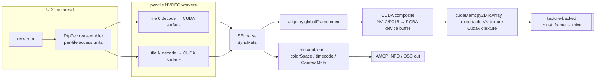

# Native `remotewall` Module — Implementation Plan & Benefits

> **Status:** SHIPPED — verified 2026-08-27 — written 2026-07-28 as a proposal, and **built**:
> `src/modules/remotewall` carries phases 0-4 of §8 as named commits (`79d8af73e`, `57beba84a`,
> `06c84c5b0`, `e13bb4da9`, `3acdc13d6`), phase 5 as `c58f5f3a1` (AV1, 10-bit HDR, multi-GPU), and
> six later fixes. It is in the build at `src/modules/CMakeLists.txt:25`.
> **Falsifier:** none — shipped. Note the commits' phase numbers drifted from §8's.

A plan to replace the third‑party **RemoteWallSource OFX plugin** (from `remoteAss`) with a
first‑class CasparCG **producer module** that ingests the cloudXR tile‑wall stream directly, keeps the
picture on the GPU end‑to‑end, and surfaces the stream's rich per‑frame metadata (colour space, SMPTE
timecode, and full camera intrinsics/extrinsics) to the rest of the CasparVP + 360‑client ecosystem.

---

## 1. Background

The **cloudXR** pipeline renders an LED‑wall image on one or more senders (Unreal Engine nDisplay
tiles, or test tools) and transmits it as **independent HEVC/H.264 tiles** over a minimum‑latency UDP
transport, with per‑frame sync metadata carried **in‑band** in the elementary stream:

```
SENDER (Unreal nDisplay / tools)        TRANSPORT            CLIENT (this machine)
  NVENC per tile (GPU-direct D3D12)   UDP + XOR-FEC        receiver: FEC reassembly →
  + SEI SyncMeta (per frame)      ─▶  'RTF1', mtu 1200 ─▶  per-tile NVDEC → align by
  VPS/SPS/PPS per frame               G=8, no ARQ          globalFrameIndex → composite wall
```

**Today** CasparVP consumes this only through the OFX plugin (`tv.mediapro.remotewall.source`), which
we verified is host‑compatible. But the OFX contract forces a **GPU→CPU→GPU round trip** and can carry
**none** of the stream's metadata. This module removes both limitations.

### The reference sources (already on disk)

| Concern | Reference (read‑only) |
|---|---|
| Wire/packet format + XOR‑FEC | `cloudXR-main/src/net/RtpFec.h`, `net/Udp.h` — **portable, header‑only** |
| In‑band metadata (SEI) | `cloudXR-main/src/sync/SyncMeta.h` — **portable, header‑only** |
| Sender/encoder (for contract) | `cloudXR-main/src/rt/NvTile.{h,cpp}` (`nvenc_tile.lib`) |
| Reference receivers | `cloudXR-main/src/tools/{multistream_recv,screen_player,decklink_player}.cpp` |
| Existing receiver library | `remoteAss/src/recvwall/RecvWall.{h,cpp}` (`recv_wall.lib`) |
| Colour convert kernels | `Video_Codec_SDK_13.0.37/Samples/Utils/ColorSpace.cu` (NV12/**P016**→RGBA, BT.601/709/**2020**) |

### The wire contract in one paragraph

Each frame of each tile is fragmented into `mtu`‑sized chunks with a 24‑byte `rtpfec::PktHdr`
(`'RTF1'`, tileId, frameIndex, seq, dataCount, FEC group `G`); one XOR parity packet per group repairs
a single loss with no retransmit. Each encoded tile frame carries a **`sync::SyncMeta`** SEI
(user_data_unregistered, fixed UUID) with: `globalFrameIndex`, tile/grid identity, wall/tile geometry,
fps, **SMPTE timecode**, `createTimeNsUtc`, a free‑text **`colorSpace`** (`"BT709"`, `"BT2020/PQ"`, …),
and a full **`CameraMeta`** (camToWorld / worldToCam / proj 4×4, `fx,fy,cx,cy`, fov, frustum). The
serializer is plain little‑endian and dependency‑free — **we vendor the three headers and are byte‑exact
by construction**. Pixels today are **8‑bit 4:2:0 (HEVC Main)**; the colour kernels already support
**10‑bit P016 + BT.2020** for the planned HDR path.

---

## 2. Goals / non‑goals

**Goals**
- Ingest the tile‑wall stream as a native CasparCG producer: `PLAY 1-10 [REMOTEWALL] …`.
- **Zero‑copy to the mixer** — decode → CUDA composite → exportable VK texture, no CPU round trip.
- Surface **colour space**, **timecode**, and **camera metadata** to CasparVP and the 360‑client.
- Support the Vulkan mixer (CUDA↔VK) and the OpenGL mixer (CUDA↔GL), matching `cuda_prores`.
- Keep the door open to **10‑bit / HDR (BT.2020/PQ)** via the 16‑bit mixer path.

**Non‑goals (initially)**
- Re‑implementing the sender (out of scope; senders are the cloudXR/Unreal side).
- AV1 ingest (HEVC/H.264 first; AV1 is a later codec toggle).
- Changing the wire protocol (we conform to it exactly).

---

## 3. Architecture

A new module `src/modules/remotewall/` providing a `frame_producer` that owns a receiver, a
per‑tile decoder, a GPU compositor, and the zero‑copy hand‑off, plus a metadata sink.



### Components

| Component | Responsibility | Reuse |
|---|---|---|
| `remotewall_producer` | AMCP producer; owns receiver + hand‑off; per‑frame `receive()` publishes latest wall | pattern from `cuda_prores`/`cuda_notchlc` producers |
| Receiver core | UDP rx, FEC reassembly, per‑tile NVDEC, SEI align, GPU composite | **`recv_wall.lib`** (option A) or FFmpeg NVDEC (option B) |
| GPU hand‑off | device composite → `create_exportable_texture` → `CudaVkTexture` → `core_texture()` | **`cuda_vk_texture.h`**, `device.cpp:create_exportable_texture` |
| Metadata sink | map `SyncMeta` → colour tags, timecode, camera; emit over AMCP/OSC | new; small |

---

## 4. Decode strategy — two options

### Option A — reuse `recv_wall.lib` (fastest, proven)
Link the existing receiver (already validated: 150/150 walls @ 4K 2×2 30fps, 0 drops on the GPU path)
and add **one** entry point that exposes the **device composite** instead of only `DtoH`/D3D11:

```c
/* NEW: hand out the CUDA device composite (RGBA8/RGBA16, top-down) for zero-copy
   into an exportable VK/GL texture. Mirrors RecvWallBindD3D11Texture but for CUDA. */
int  RecvWallGetDeviceComposite(RecvWallHandle*, void** dPtr, int* pitch,
                                unsigned* w, unsigned* h, int* bytesPerCh);
```
`recv_wall` already keeps the composite in a CUDA buffer (`Nv12ToColor32` writes it; the D3D11 path
copies from it) — this is a *small* addition. **Pro:** minimal new code, reuses a proven receiver.
**Con:** pulls in the NVIDIA Video Codec SDK as a build dep (same class as our other CUDA modules).

### Option B — FFmpeg NVDEC (dependency‑lean)
Reassemble each tile's Annex‑B elementary stream from FEC (vendored `RtpFec.h`) and decode with
**in‑tree FFmpeg** `hevc_cuvid` / `h264_cuvid` → `AVFrame` on CUDA (NV12/P010); parse the SEI with the
vendored `SyncMeta.h`; composite with our own kernel (or the SDK `ColorSpace.cu`). **Pro:** no Video
Codec SDK dependency (FFmpeg is already a module), one codec path for 8/10‑bit, AV1 later for free.
**Con:** more new code (demux/feed/align/composite) than reusing `recv_wall.lib`.

**Recommendation:** ship **Option A first** (prove the zero‑copy + metadata end‑to‑end quickly by
reusing the proven receiver), then optionally migrate the decode to **Option B** to drop the SDK
dependency and gain 10‑bit/AV1 uniformly.

---

## 5. Zero‑copy GPU hand‑off (the core win)

Reuse exactly the interop this branch already built and hardened for OFX:

1. `vk_device_->create_exportable_texture(w, h, 4, depth)` — `depth = bit8` (SDR) or `bit16` (HDR).
2. Wrap in `CudaVkTexture` (imports the VK memory into CUDA once per pooled slot).
3. `cudaMemcpy2DToArray(cvt->array(), 0, 0, dComposite, pitch, w*bpp, h, cudaMemcpyDeviceToDevice)`.
4. Publish a texture‑backed `const_frame` tagged `rgba`/`bgra` to match the composite channel order;
   the mixer samples the `VkImage` directly — **no readback**.
5. OpenGL mixer: mirror with a CUDA↔GL registered texture (as `cuda_prores` does) or CPU fallback.

This is the same path validated by the CUDA passthrough test; a wall composite is just a larger source.

---

## 6. Metadata surfacing (what OFX structurally cannot do)

`SyncMeta` is parsed on every completed wall frame and routed three ways:

- **Colour space** (`colorSpace`, `fullRange`) → set the frame's `color_space` / `color_transfer`
  (e.g. `BT2020` + `PQ`) so CasparVP's colour pipeline / LUT / tone‑map operate correctly, and so a
  10‑bit wall lands as true HDR on the 16‑bit mixer.
- **SMPTE timecode** (`tcHours…tcFrames`, `tcDrop`, `tcValid`) → exposed via `INFO` / OSC for scheduling
  and burn‑in — the **authored** timecode, not a receiver count.
- **`CameraMeta`** (camToWorld / worldToCam / proj matrices, intrinsics, fov, frustum) → emitted over
  **AMCP `INFO`** and/or **OSC** per frame. This feeds the **360‑client's existing** camera‑tracking,
  previz frustum, projection‑calibration and stage‑manager tooling directly — the single most valuable
  capability, and one the OFX route cannot provide (OFX has no host‑bound per‑frame metadata channel).

> Because the metadata layer is independent of the pixels, the module can optionally run a
> **metadata‑only** mode (parse SEI, skip composite) to drive previz/tracking with negligible cost.

---

## 7. AMCP surface (proposed)

```
PLAY 1-10 [REMOTEWALL] PORT 9000 [TILES 4] [CODEC hevc|h264] [BINDIP <ip>] [SYNCGROUP <name>]
CALL 1-10 REMOTEWALL SET port 9001            # reconfigure (re-bind)
CALL 1-10 REMOTEWALL SET syncgroup wall        # cross-zone frame lock
CALL 1-10 REMOTEWALL INFO                       # geometry, fps, src, FEC/drops, timecode, colorSpace
CALL 1-10 REMOTEWALL CAMERA                     # latest CameraMeta (matrices/intrinsics/frustum)
```
Config block in `casparcg.config` for defaults (port range, codec, sync group, OSC target).

---

## 8. Implementation phases (each builds + is verified)

| Phase | Deliverable | Verify |
|---|---|---|
| **0** | Vendor `RtpFec.h`, `Udp.h`, `SyncMeta.h`; module skeleton + AMCP `[REMOTEWALL]` registration | builds; `PLAY` creates a black producer + logs bind |
| **1** | Receiver wired (Option A `recv_wall.lib`), CPU readback frame (parity with OFX) | wall composites on screen from a test sender/loopback |
| **2** | `RecvWallGetDeviceComposite` + **CUDA→VK zero‑copy** hand‑off (Vulkan mixer) | no readback in logs; identical pixels; lower CPU |
| **3** | Metadata sink: colour tags + timecode + `CameraMeta` over `INFO`/OSC | 360‑client receives camera/timecode |
| **4** | OpenGL‑mixer CUDA↔GL path + CPU fallback | correct on `opengl` config |
| **5** | 10‑bit / HDR (P016 → RGBA16 exportable texture, BT.2020/PQ tags) | HDR wall lands as PQ on the 16‑bit mixer |
| **6** | Cross‑zone sync (reuse the shared‑memory board), multi‑channel routing, docs | two zones frame‑locked; user guide |

Phases 0–3 deliver the core value (zero‑copy + metadata). 4–6 are breadth/quality.

---

## 9. Benefits

**vs. the OFX plugin (today):**
- **Eliminates the GPU→CPU→GPU round trip.** A 4K RGBA frame is ≈33 MB, 8K ≈133 MB — the DtoH **and**
  the mixer's re‑upload (each ~1 GB/s @4K30, ~8 GB/s @8K60) disappear, along with 1–2 full‑frame CPU
  passes. Big latency + PCIe‑bandwidth win where it matters most (large walls, live).
- **Delivers the metadata OFX cannot:** colour space → correct/HDR colour; authored timecode; and the
  **camera intrinsics/extrinsics** that drive virtual‑production / LED‑wall / previz.
- **Native integration:** AMCP + config + colour pipeline + OSC; no OFX host overhead, render‑budget
  strikes, blocklist quirks, or negotiation ceilings.

**vs. "just modify the plugin to negotiate CUDA":**
- The plugin route captures the pixel zero‑copy (8‑bit, Vulkan‑mixer‑only) but **still cannot carry
  camera/colorspace/timecode** and is pinned to `cudaSetDevice(0)`. Native adds HDR/10‑bit, multi‑GPU
  device matching, both mixers, and the metadata — i.e. everything that makes the stream broadcast‑ and
  VP‑useful.

**Ecosystem leverage:**
- Reuses the CUDA↔VK interop, `create_exportable_texture`, and `CudaVkTexture` already in this branch,
  plus the `cuda_prores`/`cuda_notchlc` producer patterns.
- The camera metadata plugs straight into the **360‑client** (tracking, previz frustums, projection
  calibration, stage manager) — a differentiating, product‑level feature.

---

## 10. Risks & mitigations

| Risk | Mitigation |
|---|---|
| Wire/SEI drift vs. senders | **Vendor the exact headers** (`RtpFec.h`, `SyncMeta.h`); byte‑exact by construction. Pin a version. |
| NVIDIA Video Codec SDK dependency (Option A) | Same class as existing CUDA modules; or choose **Option B (FFmpeg NVDEC)** to avoid it. |
| Worker‑thread crashes (NVDEC/UDP) in‑process | It's now *our* code: guard, isolate, drop‑oldest, watchdog; no third‑party black box. |
| Multi‑GPU (mixer vs. CUDA device) | Select the CUDA device that matches the Vulkan mixer's LUID (native control we lack in OFX). |
| HDR correctness (P016/BT.2020/PQ) | Reuse SDK `P016ToColor32` + BT.2020 matrix; tag frames; validate against a 10‑bit sender. |
| No sender on the dev machine | Use cloudXR loopback tools (`pattern_encode` + `transport_demo`) / `video_sender` for end‑to‑end tests. |

---

## 11. Dependencies & build

- **Always:** vendored `RtpFec.h`, `Udp.h`, `SyncMeta.h` (portable) + CUDA (already used) + our Vulkan
  interop. Windows/NVIDIA (NVDEC) — consistent with existing CUDA modules.
- **Option A:** `recv_wall.lib` + NVIDIA Video Codec SDK 13.x (`nvcuvid`, `cuda`, `cudart`).
- **Option B:** in‑tree FFmpeg with `hevc_cuvid`/`h264_cuvid`; no extra SDK.
- CMake guard `ENABLE_REMOTEWALL` (mirrors `cuda_prores`/`ofx` module gating); links `CUDA::cudart_static`
  and, on Vulkan, `Vulkan::Headers` + reuse of `src/modules/cuda_vk_texture.h`.

---

## 12. Effort & recommendation

- **Phase 0–3 (core value): medium.** Most heavy lifting (proven receiver + CUDA↔VK interop) already
  exists; new code is the producer shell, the one `recv_wall` export, and the metadata sink.
- **Recommendation:** build the native module. Start with **Option A** to prove zero‑copy + metadata
  end‑to‑end fast; keep **Option B** as the dependency‑lean, HDR/AV1‑ready evolution. Treat any
  "modify the OFX plugin to negotiate CUDA" work as a throwaway spike, not the product — it cannot reach
  the metadata/HDR that this stream (and the 360‑client) are built around.

---

## 13. Open questions

1. Primary decode: reuse `recv_wall.lib` (A) or FFmpeg NVDEC (B) for v1?
2. Metadata transport to the 360‑client: AMCP `INFO`/`CALL` polling, OSC push, or both?
3. HDR timeline: is a 10‑bit sender available to validate P016 before we wire the RGBA16 path?
4. Multi‑zone: reuse the cloudXR shared‑memory sync board, or a CasparVP‑native frame‑lock?
5. Should the module also expose a **consumer/route** (wall → SDI/other channels), or producer‑only v1?
