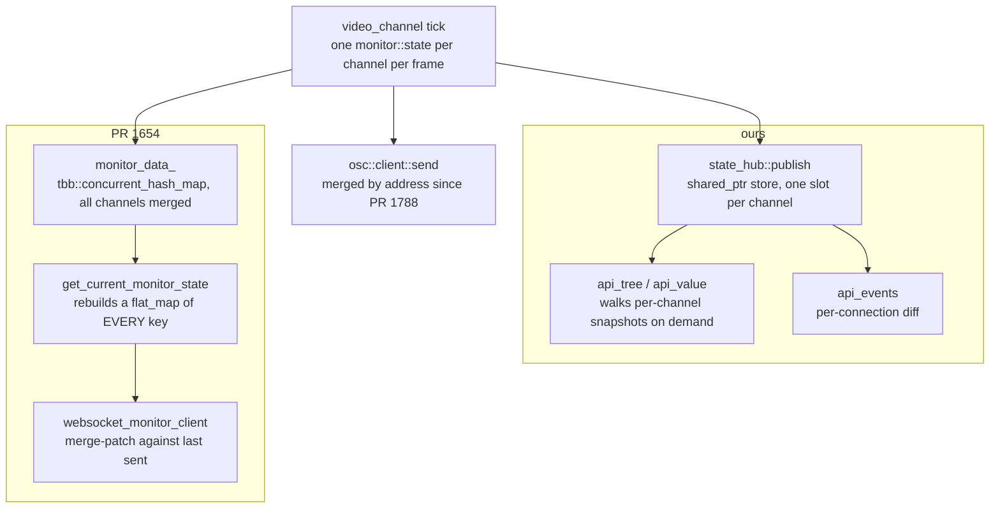

# Upstream's WebSocket API (#1654) against our control API — compatibility study

> **Status:** RESEARCH — written 2026-09-11 — upstream PR #1654 is a **draft**, marked so by its
> own author on 2025-07-12 for performance reasons, and nothing from it exists in this tree. Every
> claim about its behaviour below was read out of its diff; **it was not built or run here.**
> **Falsifier:** `websocket_monitor_server`, `websocket_monitor_client`, `nlohmann_json` — if any
> of the three appears in `src/`, #1654 has landed and §4's merge inventory is history rather than
> a forecast.

Upstream has an open control-API effort and we have one, and they are different shapes. This file
records what each is, where they collide in the source, and what is worth saying on the PR — so
that the next person to consider a rebase onto a tree containing #1654 does not have to re-derive
it.

**Read §6 before quoting any number here.** Two classes of figure appear below and only one of
them is a measurement.

---

## 1. What upstream is building

[CasparCG/server#1654](https://github.com/CasparCG/server/pull/1654), *"add websocket servers for
amcp and monitor data"*, by TomKaltz. Opened 2025-07-04, **draft** since 2025-07-12, last touched
2025-09-02. +2787/-20 across 15 files. Reviewed favourably by ronag and Julusian; no merge
attempt.

It is the **only** upstream control-API effort. `upstream/master` today has no HTTP server of any
kind — `protocol/util/http_request.cpp` is an outbound client used for thumbnails — so AMCP over
TCP and OSC over UDP are the whole remote surface. Issue #1329 (*"Filter OSC messages from server
side"*) is the same demand from the other end.

Two raw WebSocket ports, Boost.Beast, nlohmann/json:

| port | what |
| :--- | :--- |
| 5251 | **AMCP over WebSocket.** Text AMCP, unchanged grammar. A transport swap. |
| 5252 | **Monitor feed.** Full state on connect, then a per-frame delta. |

The monitor feed's three design choices, which are the interesting part:

* **Nested JSON mirroring the OSC tree** — `{"channel":{"1":{"stage":{"framerate":[50,1]}}}}` —
  rather than flat paths.
* **RFC 7386 JSON Merge Patch** deltas. The author's stated reason is the one thing OSC cannot
  express: *"you can't immediately definitively know when a stage is empty"*, because a cleared
  layer simply stops being broadcast. A merge patch carries removal.
* **Glob subscription**, `include`/`exclude` lists, with a small pattern language of its own:
  `*`, `channel/[1-9]/*`, `[1|3|5]`, character ranges, negation `[!1-5]` and array slices
  `volume[0:2]`.

A client is told all of this in a human-readable **welcome message** on connect — a `commands`
block with examples and a `supported_patterns` block.

**No WSS**, explicitly, so browsers reach it only on localhost. **No authentication.**

### What it is not

No schema. The feed carries paths and values; nothing describes a value's type, arity, legal
range, default, or whether it can be animated. A client still hard-codes that `volume` is a float
in `[0,1]` and that `MIXER OPACITY` takes one argument. That is the axis on which the two designs
differ most, and §2 is mostly about it.

---

## 2. The two models

| | upstream #1654 | ours (`docs/features/control-api.md`) |
| :--- | :--- | :--- |
| Transport | two raw WS ports | one HTTP port (5254) plus `WS /v1/events` |
| Addressing | nested JSON mirroring OSC | flat OSCQuery paths; `GET /v1/tree`, `/v1/value/<path>` |
| **Schema** | **none** | descriptors: type, arity, `RANGE`, `ACCESS`, `CLIPMODE`, default, `animatable`, vendor block |
| Where the address space comes from | whatever the tick happened to publish | three joined sources — live channels, every snapshot key, **and the field registry**, so a parameter at its default is still described |
| Subscription | glob include/exclude | prefix list, each rooted at `/channel/{n}`, matched on segment boundaries |
| Rate control | none | `throttle_ms`, coalescing rather than dropping; `repetition_filter` |
| Delta | RFC 7386 merge patch, server-wide | per-connection diff, flat `{path, value}` |
| "the layer went empty" | hand-synthesized `producer: "empty"`, `paused`, `uid` keys | descriptor default published, plus `reverted: true` and `is_default` |
| Writes | AMCP text over WS | `PUT /v1/value` with `set`/`toggle`/`add`/`cas`, dry-run validated, `duration`/`tween` |
| Atomicity | none | `POST /v1/batch`, validate-all-then-apply, `at_frame`/`in_frames` |
| Documents | none | `/v1/timeline`, `/v1/graph`, `/v1/catalog` |
| Self-description | welcome message | `/v1/openapi.json`, `/v1/docs`, `?HOST_INFO` on any path |
| Auth | none | SHA-256 challenge/response, refuses to start misconfigured |
| JSON library | nlohmann/json — a **new** dependency | Boost.JSON from source, `BOOST_JSON_NO_LIB` |
| Per-tick publish cost | rebuilds the whole server's state (§4) | one `shared_ptr` store into `state_hub` |

**They are layers, not rivals.** Theirs is a better transport for the feed OSC already carries;
ours is a description of the address space. A merge-patch delta could perfectly well carry our
descriptors, and our `/v1/events` would be no worse for offering merge-patch framing as an option.
Nothing in either design forecloses the other.

### Where each is genuinely stronger

Worth stating plainly, because a comparison written by the author of one of them is not to be
trusted otherwise.

**Theirs:**

* **Removal is expressible.** A merge patch says *"this key is gone"*. Our `reverted: true` says
  *"this key returned to its default"*, which is the same information only where a descriptor
  default exists — for a cleared layer we send `value: null`, which is honest but weaker.
* **Glob subscription is more expressive than a prefix list.** `channel/*/mixer/audio/volume`
  has no prefix form at all; we would need one prefix per channel.
* **AMCP over WebSocket is a real gap on our side.** We have no WS transport for commands; a
  browser client drives us over HTTP POST, which cannot carry AMCP's existing grammar.

**Ours:** the schema, the write model, batch atomicity, auth, and the per-tick cost in §4.

---

## 3. The two publish paths

Both hang off the same callback — `video_channel`'s tick, wired in `setup_channels` in
`shell/server.cpp`. That shared origin is the whole of §4.

The asymmetry is the point: our arm's per-tick work is a pointer assignment and the reading is
deferred to whoever asks; theirs does the full serialisation-side work inside the tick.

---

## 4. If #1654 merges

### It coexists at runtime

No port collision — 5250 AMCP, **5251/5252 theirs**, 5253 the OSC predefined-client port in the
shipped example config, **5254 ours**, 6250 the OSC default. Different endpoints, and both read the
same `core::monitor::state`, so neither can show the other a stale value. Nothing needs deciding
before both can run in one build.

### It conflicts textually in five files

Our divergence from `upstream/master`, measured 2026-09-11, against their hunks:

| file | ours | theirs | conflict |
| :--- | :--- | :--- | :--- |
| `src/shell/server.cpp` | +852/−17 | +204/−18 | **real — the same two functions** |
| `src/shell/casparcg.config` | +754/−7 | +8 | mechanical, both append to the reference block |
| `src/CMakeModules/Bootstrap_Windows.cmake` | +321/−20 | +8/−1 | mechanical, plus the `/WX` item below |
| `src/CMakeModules/Bootstrap_Linux.cmake` | +194/−3 | +2 | mechanical |
| `src/protocol/CMakeLists.txt` | +14/−1 | +7/−1 | mechanical, adjacent hunks |
| `src/protocol/StdAfx.h`, `tools/linux/install-dependencies`, `tools/linux/deb/*` | unchanged | small | clean |

**The one that is not mechanical is semantic as well as textual.** Their monitor feed rewrites the
same `setup_channels` tick lambda we publish `state_hub` from, and this fork changed that
callback's signature: `video_channel_tick_t` in `core/video_channel.h` is
`std::function<void(const std::shared_ptr<const core::monitor::state>&)>`, where upstream still
passes `core::monitor::state` **by value**. Their `for (const auto& [path, values] : channel_state)`
needs `*channel_state` against this tree. A textual resolution that compiles is not necessarily
the right one.

### The forward cost is duplication, not the conflicts

The conflicts are an afternoon. What persists is carrying **two JSON libraries, two serialisers of
`monitor::state`, and two subscription engines** for one state tree — and thereafter every state
key we add has two publication paths to keep honest. That is the thing to weigh, and it is an
argument for converging the wire format rather than for refusing the merge.

### Relationship to #1788

Their `monitor_data_` accumulates state **by path** across channels, which is independently the
same fix [#1788](https://github.com/CasparCG/server/pull/1788) applied to `osc::client::impl::send`
for the OSC feed. So their WebSocket feed is not subject to the single-slot bug — but their diff
leaves the OSC path untouched, so OSC still needs #1788. **The two are complementary; neither
supersedes the other.** Worth saying on the PR, because "the new feed doesn't lose channels" is a
selling point they have not claimed.

---

## 5. What to suggest on the PR

Ranked by value to them, which is not the same as value to us. Items 1 and 2 are the ones worth
their time.

**1. The draft-blocking cost, which we have already paid and measured.** Their tick callback calls
`get_current_monitor_state()`, which rebuilds the **entire server's** state on **every channel
tick**: it iterates a `tbb::concurrent_hash_map` and does `complete_state[it->first] = it->second`
into a `core::monitor::state`. Two things compound there, and both are recorded in the root
`CLAUDE.md`:

* `monitor::state` is a `boost::container::flat_map`, so every insert is a binary search plus a
  memmove of everything after it;
* a hash map iterates in **hash order**, which is the worst input for that structure — sorted
  insertion appends, random insertion memmoves half the map each time.

Our measured ceiling on this box is around **600 published leaves per channel per tick** at
1080p50 on four channels, where a channel carries 52 leaves idle and 596 driving 32 bindings; 596
costs 13% late frames while 188 costs none. Four channels at 50 Hz means 200 rebuilds a second of
a map several thousand keys wide. This is very likely the *"performance issues"* that shelved the
PR in the first place, so it is a contribution rather than a nitpick.

The shape that works here: hold **one immutable `shared_ptr<const state>` per channel** — our
`protocol::http::state_hub` — and let the serialiser walk them when a client asks, so the tick
cost is a pointer store. If they want a merged view they can keep one, but it should be built in
**sorted** order, or appended and sorted once.

**2. It silently drops `/WX` from the whole tree.** `Bootstrap_Windows.cmake` goes from
`/EHa /Zi /W4 /WX /MP /fp:fast` to the same without `/WX` — presumably because nlohmann or Beast
warns under `/W4`. That removes warnings-as-errors for **every target**, not just the new ones.
Both `upstream/master` and this fork carry `/WX` today, so it is a regression either tree would
inherit. The scoped fixes are `/external:I` with `/external:W0`, a `SYSTEM` include, or
`target_compile_options` on the one target.

**3. Boost.JSON rather than a new nlohmann dependency.** Boost is already required. Their Linux
path is `find_package(nlohmann_json 3.10.0 REQUIRED)` against a distro package while Windows uses
`FetchContent` — asymmetric, and the hard `REQUIRED` breaks any Linux build without
`nlohmann-json3-dev`. Boost.JSON compiled into a single translation unit with `BOOST_JSON_NO_LIB`
needs no bootstrap change on either platform; `src/protocol/http/CMakeLists.txt` is the worked
example, and its comment explains why it also stays out of `protocol`'s precompiled header.

**4. The synthesized "empty" keys will drift.** Their answer to *"when did the layer clear"* is a
hardcoded block writing `foreground/producer = "empty"`, `foreground/paused`, `foreground/uid`,
`background/producer`, `background/uid`. That list has to be extended by hand every time the state
tree grows a key that matters on a cleared layer. A descriptor-driven default is self-maintaining,
which is an argument for the schema layer they do not have — and it is the natural place to
introduce one, because it solves a problem they are already feeling.

**5. Put the listeners under `<controllers>`.** A top-level `<websocket>` block with two ports
sits beside `<controllers>`, which is where every other listener is configured and which already
has `<tcp><protocol>AMCP</protocol>`. **Declare the self-interest:** this also shrinks our merge
conflict, so it should be offered as a coherence argument and not pressed.

**6. An origin check and an opt-in token on 5251.** TCP AMCP is unauthenticated today, so this is
not a regression in kind — but a WebSocket is reachable **from a web page**, which a TCP socket is
not. Any page an operator visits can then drive the server over localhost, which is the exposure
the PR's own "browsers can still connect if the server is on localhost" note describes as a
feature. An origin allowlist plus a token is cheap; `protocol/http/api_auth.cpp` is on offer if
they want challenge/response.

**7. Note the #1788 relationship** as in §4.

### Sequencing for us

**Do not start a rebase onto a tree containing #1654 until it leaves draft.** It has been dormant
since 2025-09-02 and its shape may still move — the subscription model was rewritten once already
in response to review, and the JSON-patch format was changed to merge-patch mid-thread. The
suggestions above are worth making *now* precisely because they are cheapest to act on while the
design is still fluid.

---

## 6. What this document does not establish

**Nothing here is a measurement of #1654.** It was not built, run, or profiled in this tree. §5's
cost argument is derived from **reading** `get_current_monitor_state` together with
`monitor::state`'s declared container type, and it is corroborated only circumstantially — by the
author's own reason for marking the PR draft. A build of their branch could show the cost is
dominated by something else entirely, and the honest form of item 1 on the PR is a question plus
our numbers, not a verdict on theirs.

**The numbers that ARE measured**, and what they do not cover:

* **The leaf counts and late-frame percentages** (52 / 187 / 188 / 596 leaves, 13% at 596, the
  ~600 ceiling) come from `timeline-cost` on both mixers, recorded in the root `CLAUDE.md`. They
  measure **our** publication path on **this** box at 1080p50 on four channels. They say nothing
  about another machine, another raster, or another channel count.
* **The divergence figures in §4** are `git diff --numstat upstream/master..HEAD` per file on
  2026-09-11, against `gh pr diff 1654`. They count lines, which predicts *whether* git will
  conflict and not how hard the resolution is. The `server.cpp` row is called "real" because the
  hunks overlap, which was read rather than counted.

**No client was tested against #1654.** The four OSC receivers checked on 2026-09-11 — HRC's
`Bespoke.Osc`, the official client's `oscpack`, `casparcg-360-client`, and the harness — were
verified against **OSC after #1788**, not against a WebSocket feed. Whether any of them could
consume a merge-patch stream is untouched by that work.

**Nothing in §5 has been said to upstream.** As of this file's date no comment has been posted on
#1654.

---

## 7. Sources

| what | where |
| :--- | :--- |
| the PR, its diff and its review thread | `gh pr view 1654 --repo CasparCG/server`, `gh pr diff 1654` |
| upstream's lack of an HTTP server | `git ls-tree -r --name-only upstream/master` |
| our model | `docs/features/control-api.md`, and `src/protocol/http/` |
| our per-tick publish path | `state_hub::publish`, `src/protocol/http/state_hub.cpp` |
| the flat_map cost | the *"A per-tick published node costs more than the work behind it"* section of the root `CLAUDE.md` |
| the OSC single-slot fix | `CHANGELOG.md`, and upstream #1788 |
