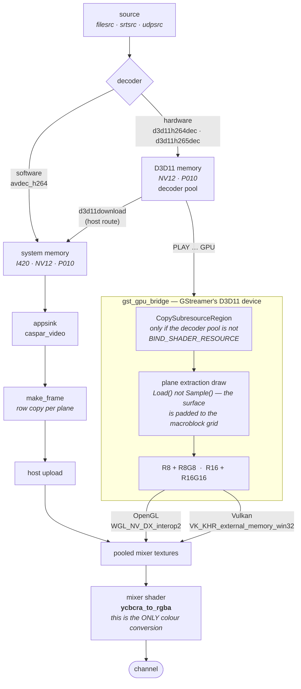

# GStreamer module

Plays a GStreamer pipeline into a channel, and sends a channel out through one. It is
**off by default** — nothing about a build without `ENABLE_GSTREAMER` changes.

```
PLAY 1-10 [GSTREAMER] "filesrc location=clip.mp4 ! decodebin"
PLAY 1-10 [GSTREAMER] "srtsrc uri=srt://host:9010 ! tsdemux ! h264parse ! avdec_h264"
ADD  1 GSTREAMER "videoconvert ! x264enc ! mpegtsmux ! srtsink uri=srt://:9020?mode=listener"
```

## Why this can exist now

GStreamer ships its own FFmpeg. Until CasparCG moved to FFmpeg 8 the two collided: GStreamer
1.28's `avcodec-61`, `avutil-59`, `avformat-61`, `avfilter-10`, `swscale-8` and `swresample-5`
are the same base names CasparCG shipped at FFmpeg 7, and Windows keys loaded modules by base
name per process — so one of the two lost. At 8.x every soname differs (62/60/62/11/9/6) and
both stacks coexist: measured with all six of each resident in one process, and with
`avdec_h264` — that is `gstlibav`, GStreamer's own FFmpeg — decoding video inside
`casparcg.exe` while ours served the rest of the server.

## Building

```
cmake -DENABLE_GSTREAMER=ON -DGSTREAMER_ROOT=<install root> …
```

`GSTREAMER_ROOT` is the directory holding `bin/`, `lib/`, `libexec/` and `include/`. It
defaults to `%GSTREAMER_1_0_ROOT_MSVC_X86_64%`, which the Windows installer sets only for an
all-users install — a per-user install has to name it.

Nothing from GStreamer is copied next to `casparcg.exe`. Its libraries are **delay-loaded**
and opened by explicit path at first use, so a server built with the module still starts on a
machine that has no GStreamer; only a `PLAY` that asks for it fails.

## Configuring

```xml
<gstreamer>
    <path>C:\gstreamer\1.28.6</path>   <!-- installation root; needed when the installer set no variable -->
    <auto-load>false</auto-load>       <!-- load at startup so a wrong path is a startup diagnostic -->
</gstreamer>
```

and, inside a channel's `<consumers>`:

```xml
<gstreamer>
    <pipeline>videoconvert ! x264enc ! mpegtsmux ! srtsink uri=srt://:9020?mode=listener</pipeline>
</gstreamer>
```

`GST_PLUGIN_SYSTEM_PATH_1_0`, `GST_PLUGIN_SCANNER_1_0` and a **private** `GST_REGISTRY` are set
from that path before `gst_init`, and GStreamer's `bin` goes on this process's DLL search path
via `SetDllDirectory` — never `PATH`, which would put its FFmpeg on the search path of every
process on the machine. The two directories are compared at startup and any shared base name is
logged; the set is empty at FFmpeg 8 and was six at FFmpeg 7.

## The pipeline description

The description is **everything except the sink** (producer) or **the source** (consumer); the
module supplies the other end:

| | appended / prepended |
| :--- | :--- |
| producer, host path | `! videoconvert ! videorate ! appsink name=caspar_video` |
| producer, `GPU` | `! d3d11upload ! d3d11convert ! video/x-raw(memory:D3D11Memory),format=NV12 ! appsink name=caspar_video` |
| consumer | `appsrc name=caspar_video is-live=true format=time !` |

Name `caspar_video` yourself and the description is taken as written, which is how a second
chain reaches `caspar_audio`:

```
PLAY 1-10 [GSTREAMER] "filesrc location=clip.mp4 ! decodebin name=d
                       d. ! queue ! videoconvert ! videorate ! appsink name=caspar_video
                       d. ! queue ! audioconvert ! audioresample ! appsink name=caspar_audio"
```

It is parsed with `gst_parse_launch`, so delayed links work and `filesrc ! decodebin` links up
when the pad appears. A description that comes back **incomplete** — an element that could not
be created, a link the parser had to drop — is refused rather than run, because a pipeline
missing a link runs, reaches EOS and delivers nothing.

## Transport and queries

```
CALL 1-10 PAUSE | RESUME | SEEK <frame> | LENGTH | POSITION
GST INFO
GST LIST <substring>
```

`SEEK` is flushing and frame-accurate. `LENGTH` answers 0 on a live source rather than
inventing a duration. `LOOP`, `IN` and `OUT` are deliberately absent: they belong to a producer
that owns its reader, and this one owns a pipeline whose source may be a socket.

## Where the picture goes, and where the conversion happens

The order is the point, so here it is once rather than four times in prose. The two routes
reach the same mixer; what differs is whether the picture visits host memory, and **neither
route converts colour** — that is the mixer's job, at the end, with the channel's colour
management.



Two things the picture makes obvious that the prose kept having to repeat:

* **The conversion happens once, at the end, in the mixer.** No `videoconvert` and no
  `d3d11convert` colour work sits on either route, which is why the two agree byte for byte
  rather than by luck — and why the caps' matrix, range and chroma siting reach the shader
  instead of being consumed on the way.
* **The GPU route is not zero-copy and does not pretend to be.** It is one extraction pass plus
  one mixer-side copy, against a download and an upload. The staging copy is a third pass and
  only appears when the decoder's own pool is not shader-readable, which is the usual case.

## Semi-planar to the mixer, rather than converted on the way

This tree has `core::pixel_format::nv12` and both shaders carry a case for it, so a hardware
decoder's NV12 travels to the mixer **as two planes** — Y as one component, interleaved CbCr
as two at half resolution — and the mixer's own `ycbcra_to_rgba` does the conversion.

That is not only cheaper than letting `videoconvert` produce BGRA. It is the *mixer's*
conversion, so the matrix, the range and the chroma siting come off the caps and reach the
shader, instead of being consumed by a converter whose choices then have to agree with the
mixer's by luck. It also means 10-bit survives: `d3d11h265dec` produces P010, which is carried
at `bit16` with `precision_factor` 1.0, where BGRA8 would truncate it.

`NV12` and `P010_10LE` are therefore in the accepted caps. They were removed from the upstream
module for a good reason — upstream has no semi-planar format, `pixel_format_desc` returned
`invalid`, and a hardware-decoded file played as 164 black frames the producer counted as
*received*. The guard that catches that is still in `make_frame`, and the battery's
`nv12-host` case asserts both halves: that NV12 was negotiated **and** that the picture matches
the FFmpeg producer. Neither alone is worth anything — a picture check passes a `videoconvert`
that silently did the work, and a format check passes the black-frame defect exactly.

`INFO` reports the negotiated format for this reason, including its memory type.

## The GPU path

`PLAY … "<pipeline>" GPU` keeps the picture in video memory from the decoder to the mixer. A
D3D11 pass on **GStreamer's own device** extracts the two NV12 planes into textures the module
owns, and those go to `vulkan::d3d11_import_bridge::copy_planes` or two
`ogl::dx_interop::copy_to_pooled` calls — the same two routes the ffmpeg producer's GPU-direct
decode uses. Upstream's `frame_factory::import_shared_texture` is deliberately absent from this
tree, so none of its mixer-facing half is reused.

**It is not zero-copy**, and calling it that would be wrong. The decoded surface belongs to the
decoder's pool and is recycled, so it cannot simply be handed over: one extraction pass writes
the planes, and the mixer copies those into pooled textures. Two full-frame passes at 1.5
bytes per pixel, against three at 4 for a BGRA route.

**A decoder surface is usually not shader-readable, and that is the trap here.**
`d3d11h264dec` allocates its output pool with `D3D11_BIND_DECODER` and no
`BIND_SHADER_RESOURCE`, so it can have no shader resource view at all — GStreamer publishes
none and `CreateShaderResourceView1` fails. The bridge checks the bind flags once and, when
needed, adds a `CopySubresourceRegion` into a shader-readable texture of its own before
extracting. That is a third full-frame pass on such decoders, and still no host round trip.

It hid at first because the earliest test fed `decodebin` a **lossless** clip, which decodes in
software, so `d3d11convert` had real work to do and produced a shader-readable texture as a
side effect. Point the same route at a hardware decoder and the converter becomes passthrough,
the decoder's own surface arrives, and nothing can sample it. *It worked until we made it
faster* is the shape to recognise.

`d3d11convert` stays in the appended tail for the same reason it is harmless: at matching caps
it passes buffers through, and when they do not match it is the difference between a pipeline
that links and one that refuses — `d3d11upload` changes the memory type, never the format.

It falls back to host memory, once and with a logged reason, when the sample is not D3D11
memory, when the surface format is not NV12/P010/P016, when GStreamer's device is on a
different adapter (`d3d11h264dec` versus `d3d11h264device1dec` decides that), or when the
mixer will not take the textures.

Windows only. Measured on both mixers: 64/64 (OpenGL) and 68/68 (Vulkan) frames on the GPU
path, byte-identical to the host path.

## What it reports

`INFO 1-10` carries `received`, `dropped`, `starved`, `queue`, `queue-peak`, `gpu-frames`,
`restarts`, `underruns`, `audio`, `eos`, `position` and `length`.

The diag window carries the same story for someone watching rather than polling. The
**producer** plots `frame-time`, `tick-time` and `buffer` — the queue depth normalised to its
own limit, which falls *before* the producer starves, so a sender that is slipping shows up
while the picture is still perfect — and tags `dropped-frame`, `audio-underrun`, `starved` and
`restart`. The **consumer** plots `frame-time` and `input` (how full `appsrc`'s queue is
against its `max-bytes`) and tags `dropped-frame`.

Every one of those plots a quantity `INFO` also reports, which is deliberate: the numbers are
gated by the battery, and the graph is a second view of the same values rather than a separate
source of truth. Note that diagnostics graphs are **drawn and nothing else** — they are not
published over OSC or in monitor state — so nothing can assert the window itself.

`starved` is the one worth knowing: it counts ticks that found the queue empty and repeated the
last picture. Frame counts cannot tell a healthy producer from a frozen one — a source that
stops leaves `received` sitting still while the channel keeps ticking — and a source merely
*slower* than the channel does not starve it, because the appended `videorate` duplicates up to
the channel rate.

## Failure handling

A pipeline that errors is rebuilt, backing off 500 ms → 1 s → 2 s → 4 s to a 5 s ceiling, rather
than stopping the producer for good. For a file that would be survivable; for a live source it
means a layer dies with its sender and never comes back.

## Limits

* **The GPU path is Windows-only and opt-in per PLAY.** It is not automatic because the tail
  changes what the pipeline must negotiate, and a source that cannot reach D3D11 memory would
  pay an upload for nothing.
* **Audio on the GPU path is carried, not converted** — a 16-channel bus with the source's
  channels mapped into the first of them.
* **P010 through the host path is untested.** It is in the accepted caps and `av_util` maps it,
  but nothing has measured a 10-bit clip end to end; the battery's fixture is 8-bit.
* **No throughput or latency measurement.** Frames are counted; rates are not.
* **Tested on Windows only**, against GStreamer 1.28.6 MSVC x86_64.

## One thing to know about this fork's DLLs

CasparVP runs a MinGW-built FFmpeg so NVENC works on the Pascal card, which puts four runtime
DLLs in `build/shell` whose base names also exist in GStreamer's `bin` — `libcrypto-3-x64`,
`libgcc_s_seh-1`, `libstdc++-6`, `libwinpthread-1`. Windows keys modules by base name per
process, so ours win.

Measured rather than assumed: three of the four are reached by **none** of GStreamer's 271
plugins. `libcrypto` is reached by nine — SRT, HLS, DASH, RTMP and the WebRTC/ICE stack — and
all nine load and reach PAUSED against ours (OpenSSL 3.6.1) as they do against GStreamer's
(3.5.0). `CasparCG-TestRunner`'s `gst-dll-probe` is the standing check, and it verifies the two
arms genuinely differed rather than reporting agreement it never tested.
